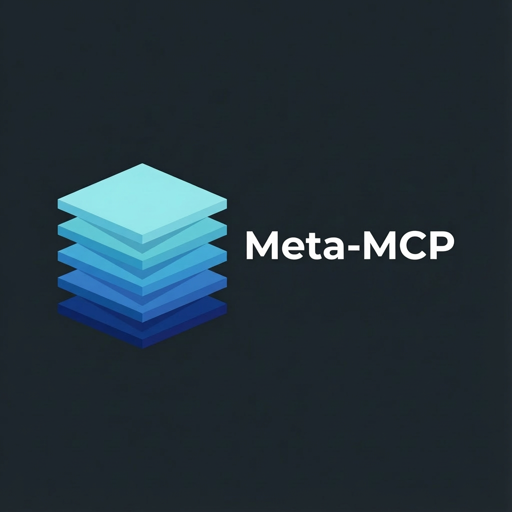

# Meta-MCP Server



A Model Context Protocol (MCP) server that wraps multiple backend MCP servers for token-efficient tool discovery via lazy loading.

## Problem

When Claude/Droid connects to many MCP servers, it loads all tool schemas upfront - potentially 100+ tools consuming significant context tokens before any work begins.

## Solution

Meta-MCP exposes only 3 tools to the AI:

| Tool | Purpose |
|------|---------|
| `list_servers` | List available backend servers (lightweight, no schemas) |
| `get_server_tools` | Fetch tools from a server. Supports `summary_only` for names/descriptions, `tools` for specific schemas |
| `call_tool` | Execute a tool on a backend server |

Backend servers are spawned lazily on first access and managed via a connection pool.

## Features

- **Lazy Loading**: Servers spawn only when first accessed
- **Two-Tier Tool Discovery**: Fetch summaries first (~100 tokens), then specific schemas on-demand
- **Connection Pool**: LRU eviction (max 6 connections) with idle cleanup (5 min)
- **Multi-Transport**: Supports Node, Docker, and uvx/npx spawn types
- **Tool Caching**: Tool definitions cached per-server for session duration
- **VS Code Extension**: Visual UI for managing servers and configuring AI tools

## Quick Start

### Option 1: VS Code/Cursor Extension (Recommended)

The **Meta-MCP** extension provides a visual interface for configuration:

1. Install the extension from `extension/meta-mcp-configurator-0.1.0.vsix`
2. Open the Meta-MCP panel from the activity bar
3. Go to **Setup** tab and click **Install** to install via npm
4. Copy the generated snippet to your AI tool's config
5. Add servers from the **Catalog** or manually

### Option 2: npm Package

```bash
npm install -g @justanothermldude/meta-mcp-server
```

Then add to your AI tool config (see Configuration below).

### Option 3: Build from Source

```bash
cd projects/meta-mcp-server
npm install
npm run build
```

## Configuration

### servers.json

All MCP servers are configured in `~/.meta-mcp/servers.json`:

```json
{
  "mcpServers": {
    "github": {
      "command": "npx",
      "args": ["-y", "@modelcontextprotocol/server-github"],
      "env": {
        "GITHUB_TOKEN": "your-token"
      }
    },
    "filesystem": {
      "command": "npx",
      "args": ["-y", "@anthropic/mcp-server-filesystem", "/path/to/allowed/dir"]
    },
    "corp-jira": {
      "command": "node",
      "args": ["/path/to/adobe-mcp-servers/servers/corp-jira/dist/index.js"],
      "env": {
        "JIRA_URL": "https://jira.example.com",
        "JIRA_TOKEN": "your-token"
      }
    }
  }
}
```

### Internal MCP Servers

For internal/corporate MCP servers (like corp-jira), the extension handles setup automatically:

1. Click **Add** on an Internal server in the Catalog
2. If not found locally, choose **Clone Repository** - the extension opens a terminal and runs:
   ```bash
   git clone https://github.com/Adobe-AIFoundations/adobe-mcp-servers.git
   cd adobe-mcp-servers && npm install && npm run build
   ```
3. Once built, click **Add** again - the server will be auto-detected via Spotlight (macOS)

**Manual setup** (if needed):
```json
{
  "mcpServers": {
    "corp-jira": {
      "command": "node",
      "args": ["/path/to/adobe-mcp-servers/servers/corp-jira/dist/index.js"],
      "env": {
        "JIRA_URL": "https://jira.example.com",
        "JIRA_TOKEN": "your-token"
      }
    }
  }
}
```

### AI Tool Configuration

Add meta-mcp to your AI tool's config file:

**Claude** (`~/.claude.json`):
```json
{
  "mcpServers": {
    "meta-mcp": {
      "command": "npx",
      "args": ["-y", "@justanothermldude/meta-mcp-server"],
      "env": {
        "SERVERS_CONFIG": "/Users/yourname/.meta-mcp/servers.json"
      }
    }
  }
}
```

**Droid** (`~/.factory/mcp.json`):
```json
{
  "mcpServers": {
    "meta-mcp": {
      "command": "npx",
      "args": ["-y", "@justanothermldude/meta-mcp-server"],
      "env": {
        "SERVERS_CONFIG": "/Users/yourname/.meta-mcp/servers.json"
      }
    }
  }
}
```

**Using local build** (instead of npx):
```json
{
  "mcpServers": {
    "meta-mcp": {
      "command": "node",
      "args": ["/path/to/meta-mcp-server/dist/index.js"],
      "env": {
        "SERVERS_CONFIG": "/Users/yourname/.meta-mcp/servers.json"
      }
    }
  }
}
```

### Restart your AI tool

Restart Claude or Droid to load the new configuration.

## Usage

Once configured, the AI will see only 3 tools instead of all backend tools:

```
# AI discovers available servers
list_servers()
→ [{name: "corp-jira", description: "JIRA integration"}, ...]

# AI fetches tool summaries (lightweight, ~100 tokens for 25 tools)
get_server_tools({server_name: "corp-jira", summary_only: true})
→ [{name: "search_issues", description: "Search JIRA issues"}, ...]

# AI fetches specific tool schemas (on-demand)
get_server_tools({server_name: "corp-jira", tools: ["search_issues", "create_issue"]})
→ [{name: "search_issues", inputSchema: {...}}, ...]

# AI fetches all tools (backward compatible, ~16k tokens for 25 tools)
get_server_tools({server_name: "corp-jira"})
→ [{name: "search_issues", inputSchema: {...}}, ...]

# AI calls a tool
call_tool({server_name: "corp-jira", tool_name: "search_issues", arguments: {jql: "..."}})
→ {content: [...]}
```

### Two-Tier Lazy Loading

For servers with many tools (e.g., Jira with 25 tools), use two-tier discovery:

| Parameter | Tokens | Use Case |
|-----------|--------|----------|
| `summary_only: true` | ~100 | Discovery: see what tools exist |
| `tools: ["name"]` | ~640/tool | Fetch specific schemas before calling |
| (none) | ~16k | Backward compatible, fetch all |

This reduces token usage by **87%** for typical discovery workflows.

## Development

```bash
# Run tests
npm test

# Run with vitest (full suite)
npx vitest run

# Type check
npx tsc --noEmit

# Build
npm run build
```

## Architecture

```
src/
├── index.ts           # Entry point with stdio transport
├── server.ts          # MCP server setup and request handlers
├── types/             # TypeScript interfaces
├── registry/          # Server manifest loading (servers.json)
├── pool/              # Connection pool with LRU eviction
│   ├── server-pool.ts # Pool manager
│   ├── connection.ts  # MCP client connections
│   └── stdio-transport.ts # Spawn config builder
└── tools/             # MCP tool implementations
    ├── list-servers.ts
    ├── get-server-tools.ts
    ├── call-tool.ts
    └── tool-cache.ts
```

## Configuration Options

| Environment Variable | Default | Description |
|---------------------|---------|-------------|
| `SERVERS_CONFIG` | `~/.meta-mcp/servers.json` | Path to backends configuration |
| `MAX_CONNECTIONS` | `6` | Maximum concurrent server connections |
| `IDLE_TIMEOUT_MS` | `300000` | Idle connection cleanup timeout (5 min) |

## Test Results

- 112 tests passing (69 unit + 43 integration)
- Tested with Node (corp-jira), Docker (splunk, new-relic, github), and uvx servers
