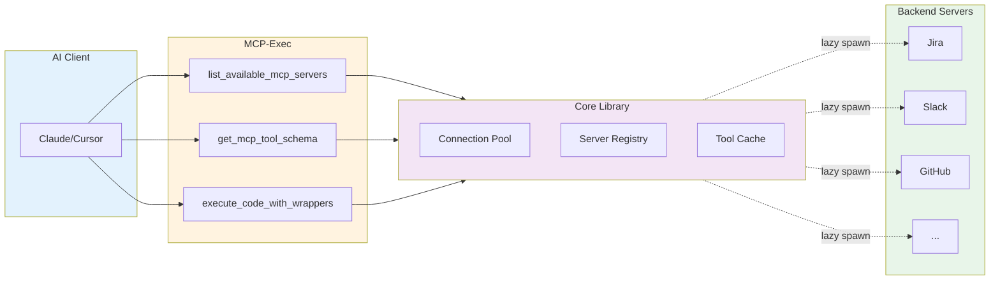
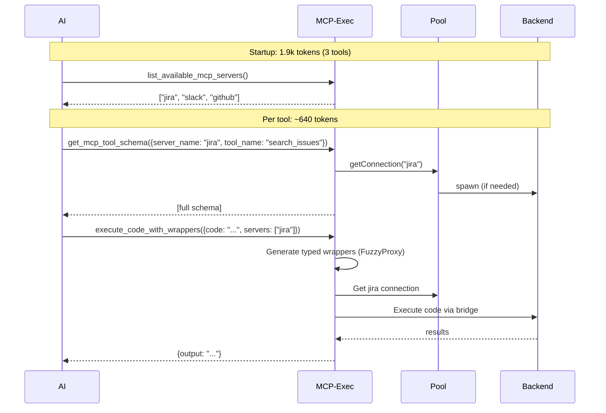
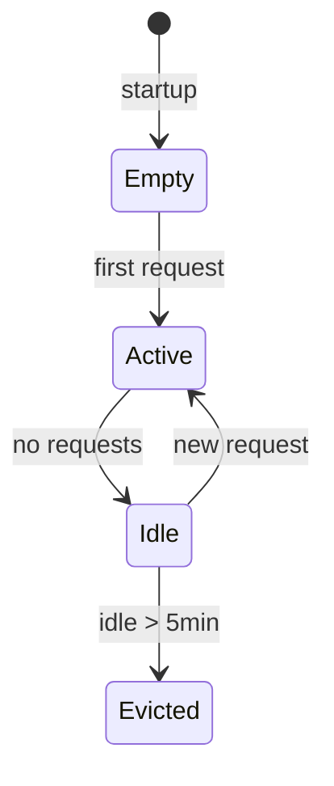

# MCP-Exec Architecture

> **TL;DR**: Sandboxed code execution with typed access to backend MCP servers. Reduces context token consumption through lazy schema loading via `packages/core`.

---

## How It Works



---

## MCP-Exec Tools

MCP-Exec exposes three tools to AI clients:

| Tool | Purpose | Usage |
|------|---------|-------|
| `list_available_mcp_servers` | List available backend servers from servers.json | First query to discover available servers |
| `get_mcp_tool_schema` | Fetch full schema for a specific tool on-demand | Fetch only tool schemas the AI needs |
| `execute_code_with_wrappers` | Execute TypeScript/JavaScript in sandbox with typed MCP wrappers | Run code with access to backend tools |

---

## Typed Wrapper Generation

When the AI calls `execute_code_with_wrappers()`:

1. **Catalog check**: Reads or builds `~/.meta-mcp/tool-catalog.json` (disk-persisted)
2. **Wrapper generation**: `packages/mcp-exec/src/codegen/wrapper-generator.ts` generates TypeScript wrappers with:
   - **FuzzyProxy**: Case-agnostic access to tool names (e.g., `mcp.corpJira` or `mcp.corp_jira`)
   - **Required parameter guards**: Validates inputs at generation time
   - **Field guards on responses**: Type-safe response field access
3. **Sandbox execution**: Code runs in isolated sandbox with typed wrappers injected
4. **Catalog update**: Tool catalog auto-updates on first call, refreshes on every call, prunes against `servers.json` on startup

---

## Core Library Architecture

`packages/core` manages backend MCP server connections:

```
packages/core/src/
├── types/           # TypeScript interfaces
│   ├── connection.ts      # MCP client wrapper
│   ├── server-config.ts   # Zod-validated servers.json schema
│   └── tool-definition.ts # Tool schema types
├── registry/        # Server manifest loading
│   ├── loader.ts          # Loads and validates servers.json
│   └── manifest.ts        # In-memory server manifest
├── pool/            # Connection pool with LRU eviction
│   ├── server-pool.ts     # Main pool manager (max 20, 5min idle timeout)
│   ├── connection.ts      # Wraps MCP client lifecycle
│   └── stdio-transport.ts # Stdio MCP transport
└── tools/           # Tool caching
    └── tool-cache.ts      # Per-server tool definition cache
```

---

## MCP-Exec Components

`packages/mcp-exec` provides code execution:

```
packages/mcp-exec/src/
├── server.ts        # MCP server exposing 3 tools with dynamic catalog
├── sandbox/         # Isolated sandbox executor
├── bridge/          # HTTP bridge for MCP access from sandbox
├── codegen/         # Typed wrapper generation
│   └── wrapper-generator.ts  # Generates FuzzyProxy wrappers
├── types/           # TypeScript interfaces
└── tools/           # Tool implementations
    ├── list-servers.ts       # list_available_mcp_servers
    ├── get-tool-schema.ts    # get_mcp_tool_schema
    └── execute-with-wrappers.ts  # execute_code_with_wrappers + catalog management
```

---

## Token Cost Analysis

**Startup**: ~1.9k tokens (3 mcp-exec tool schemas loaded once)

**Tool catalog**: ~800-1000 tokens (tool names + param signatures, loaded once per session from `~/.meta-mcp/tool-catalog.json`)

| Tool | Per-call cost |
|------|---------------|
| `list_available_mcp_servers` | minimal |
| `get_mcp_tool_schema` | ~640/tool |
| `execute_code_with_wrappers` | variable |

**Traditional**: 16,000+ tokens (all backend tool schemas upfront)
**MCP-Exec**: 3,200 tokens (startup + 2 backend tools used)
**Savings**: **80%**

See [Token Economics](diagrams/token-economics.md) for detailed ROI analysis.

---

## Request Flow



---

## Pool Behavior



| Setting | Value |
|---------|-------|
| Max connections | 20 |
| Idle timeout | 5 min |
| Cleanup interval | 1 min |
| Eviction | LRU |

---

## Configuration

**servers.json** (`~/.meta-mcp/servers.json`):
```json
{
  "mcpServers": {
    "jira": {
      "command": "node",
      "args": ["/path/to/jira-mcp/dist/index.js"],
      "env": { "JIRA_TOKEN": "..." }
    }
  }
}
```

**Environment variables**:
```bash
SERVERS_CONFIG=~/.meta-mcp/servers.json
MCP_DEFAULT_TIMEOUT=30000
```

---

## Quick Reference

```bash
npm run build        # Build all packages
npx vitest run       # Run tests
npm run dev          # Watch mode
```

| Package | Path | Purpose |
|---------|------|---------|
| Core | `packages/core/src/` | Connection pool, registry, tool cache |
| MCP-Exec | `packages/mcp-exec/src/` | Sandbox execution, tool schema, wrapper generation |
| Extension | `extension/src/` | VS Code/Cursor integration UI |

---

See [`diagrams/`](diagrams/README.md) for token economics and visual architecture.
