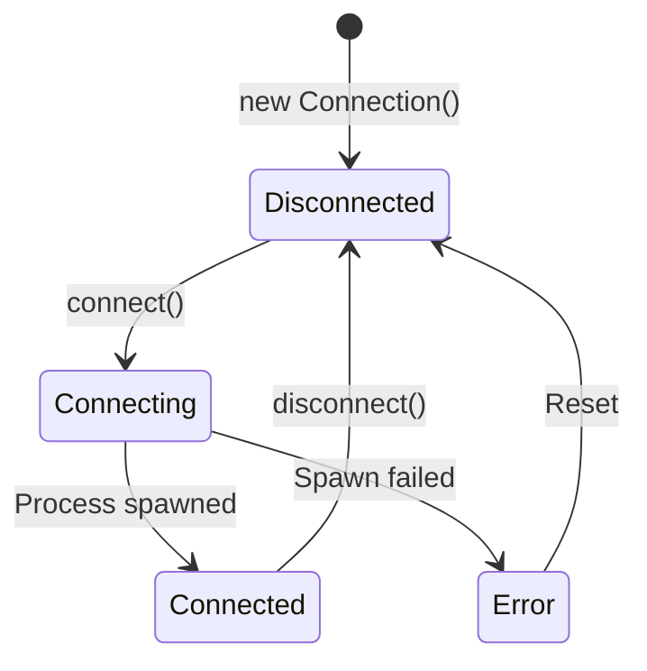

# Meta-MCP Server Architecture Guide

## Table of Contents

1. [Introduction](#introduction)
2. [Core Design Principles](#core-design-principles)
3. [Architecture Overview](#architecture-overview)
4. [Key Concepts](#key-concepts)
5. [Component Details](#component-details)
6. [Request Lifecycle](#request-lifecycle)
7. [Configuration Guide](#configuration-guide)
8. [Performance Characteristics](#performance-characteristics)
9. [Deployment & Operations](#deployment--operations)
10. [Extending Meta-MCP](#extending-meta-mcp)
11. [FAQ & Troubleshooting](#faq--troubleshooting)
12. [Related Resources](#related-resources)

---

## Introduction

### What is Meta-MCP?

Meta-MCP Server is an intelligent proxy layer for the Model Context Protocol (MCP) that sits between AI clients (like Claude Desktop) and multiple backend MCP servers. It acts as a "meta" server that exposes only 3 high-level tools instead of loading hundreds of tool schemas upfront.

### The Problem

When AI assistants connect to multiple MCP servers, they traditionally load all tool schemas at startup:

```
Traditional Approach:
├── Jira Server: 25 tools × 640 tokens = 16,000 tokens
├── Slack Server: 35 tools × 640 tokens = 22,400 tokens
├── GitHub Server: 30 tools × 640 tokens = 19,200 tokens
└── Total: 57,600 tokens consumed BEFORE any user interaction
```

This creates several problems:
- **Token Bloat**: Massive context consumption before any actual work
- **Slow Initialization**: All backend servers must start and load schemas upfront
- **Memory Waste**: Resources allocated for tools that may never be used
- **Context Pressure**: Less room for actual conversation and task completion

### The Solution

Meta-MCP implements a two-tier lazy loading strategy that reduces token consumption by **87-96%**:

**Three Meta-Tools Instead of 100+:**
- `list_servers` - Discover available backend servers
- `get_server_tools` - Fetch tool schemas (with summary-only option)
- `call_tool` - Execute a tool on a backend server

**Progressive Discovery:**
1. **Phase 1**: List servers (~100 tokens)
2. **Phase 2**: Fetch tool summaries - names and descriptions only (~100 tokens)
3. **Phase 3**: Fetch full schemas for specific tools only (~640 tokens per tool)
4. **Phase 4**: Execute tools using pooled connections

**Result**: Typical workflows consume ~1,500 tokens instead of 57,600+ tokens.

### Why It Matters

**For Users:**
- Faster conversation startup
- More context budget for actual work
- Lower API costs
- Better performance with many MCP servers

**For Developers:**
- Scales to 100+ backend servers without context explosion
- Maintains compatibility with existing MCP servers
- No changes required to backend implementations
- Simple configuration matching Claude Desktop's format

---

## Core Design Principles

Meta-MCP's architecture is built on five fundamental principles that work together to optimize token usage and system performance.

### 1. Lazy Loading

**What**: Servers spawn only when first accessed, not at startup.

**Why**: Eliminates upfront resource costs for servers that may never be used.

**How**:
- Meta-MCP starts with zero backend connections
- First `get_server_tools` or `call_tool` request triggers server spawn
- Connection pool manages lifecycle from that point forward

**Diagram Reference**: [System Architecture](diagrams/01-system-architecture.md)

```
Startup Time Comparison:
Traditional: 2-5 seconds (spawn all backends)
Meta-MCP:    <100ms (no backend spawning)
```

### 2. Progressive Discovery (Two-Tier Tool Loading)

**What**: Fetch tool information in two phases - summaries first, full schemas on-demand.

**Why**: AI can browse available tools without loading expensive JSON schemas.

**Token Savings**: 99.4% for discovery phase, 90.8% for typical 2-tool workflows.

**Detailed Flow:** See [Request Flow Diagram](diagrams/02-request-flow.md) and [Token Optimization](diagrams/10-token-optimization.md) for complete analysis with examples.

### 3. Connection Pooling

**What**: Reuse expensive backend connections with LRU eviction strategy.

**Why**: Spawning processes is expensive; reusing connections amortizes startup costs.

**How**:
- Maximum 6 concurrent connections (configurable)
- LRU (Least Recently Used) eviction when pool is full
- 5-minute idle timeout for automatic cleanup
- 1-minute background cleanup cycle

**Diagram Reference**: [Pool Lifecycle](diagrams/03-pool-lifecycle.md), [ServerPool Architecture](diagrams/05-server-pool-architecture.md)

**Benefits**:
- Repeated tool calls reuse existing connections (no spawn overhead)
- Least-used servers automatically evicted to free resources
- Stale connections cleaned up automatically
- Graceful degradation under resource constraints

### 4. Tool Caching

**What**: Cache tool definitions per-server for the session duration.

**Why**: Avoid refetching schemas from backends on repeated requests.

**How**:
- First `get_server_tools` request fetches from backend and caches
- Subsequent requests for the same server return from cache instantly
- Cache invalidates when connection is evicted from pool
- Manual cache clearing on shutdown

**Diagram Reference**: [Caching Strategy](diagrams/04-caching-strategy.md)

**Performance Impact**:
```
First Request:  Backend fetch + cache store (~200ms)
Cached Request: Memory lookup (~1ms)
Speedup:        200x faster
```

### 5. Graceful Shutdown

**What**: Clean resource cleanup on server termination.

**Why**: Prevent orphaned processes and leaked file descriptors.

**How**:
- Stop cleanup timer
- Disconnect all active connections
- Clear all caches
- Wait for graceful backend termination

**Diagram Reference**: [Full Integration](diagrams/09-full-integration.md)

---

## Architecture Overview

### System Architecture

The following diagram shows the complete Meta-MCP architecture from client to backend servers:

**Diagram Reference**: [System Architecture](diagrams/01-system-architecture.md)

```
┌─────────────────────────────────────────────────────────────┐
│                        AI Client                            │
│                    (Claude Desktop)                         │
│                   Sees only 3 tools                         │
└─────────────────────┬───────────────────────────────────────┘
                      │
                      │ MCP Protocol (stdio)
                      │
┌─────────────────────▼───────────────────────────────────────┐
│                  Meta-MCP Server                            │
│  ┌─────────────────────────────────────────────────────┐   │
│  │  3 Meta-Tools (Exposed API)                         │   │
│  │  • list_servers                                     │   │
│  │  • get_server_tools (summary_only + selective)      │   │
│  │  • call_tool                                        │   │
│  └─────────────────────────────────────────────────────┘   │
│                                                             │
│  ┌──────────────┐        ┌────────────────┐               │
│  │ ServerPool   │◄──────►│  Tool Cache    │               │
│  │ (LRU, max 20) │        │  (per-server)  │               │
│  └──────┬───────┘        └────────────────┘               │
│         │                                                   │
│         │ ┌───────────────────────┐                        │
│         └►│ Server Registry       │                        │
│           │ (servers.json)        │                        │
│           └───────────────────────┘                        │
└─────────────────────┬───────────────────────────────────────┘
                      │
                      │ Lazy spawn + MCP Protocol
                      │
        ┌─────────────┼─────────────┬────────────┐
        │             │             │            │
┌───────▼──────┐ ┌───▼───────┐ ┌──▼──────┐ ┌──▼─────────┐
│   Node.js    │ │  Docker   │ │  uvx    │ │   Custom   │
│   Backend    │ │  Backend  │ │ Backend │ │  Backend   │
│ (Jira MCP)   │ │(Slack MCP)│ │(Python) │ │   (Any)    │
└──────────────┘ └───────────┘ └─────────┘ └────────────┘
```

### Component Interactions

**Key Flows**:

1. **Startup Flow** (lazy initialization):
   - AI client connects to Meta-MCP via stdio
   - Meta-MCP loads 3 meta-tools (~200 tokens)
   - Backend servers NOT started
   - Zero connections in pool

2. **Discovery Flow** (progressive loading):
   - AI calls `list_servers()` → returns server names from registry
   - AI calls `get_server_tools(summary_only: true)` → lightweight tool list
   - AI calls `get_server_tools(tools: ["specific"])` → full schema for selection

3. **Execution Flow** (connection pooling):
   - AI calls `call_tool(server, tool, args)`
   - Pool returns existing connection or spawns new backend
   - Tool executes on backend
   - Result returns to AI client

4. **Cleanup Flow** (resource management):
   - Background timer runs every 1 minute
   - Evict idle connections (>5 min unused)
   - Disconnect and remove from pool

### Data Flow

```
Request Path:
AI → Meta-MCP Server → ServerPool → Connection → Backend

Response Path:
Backend → Connection → ServerPool → Meta-MCP Server → AI

Cache Path:
Backend → ToolCache → Memory (subsequent requests skip backend)
```

---

## Key Concepts

### Lazy Loading

**Problem**: Traditional MCP servers start all backends at initialization, consuming resources upfront.

**Solution**: Meta-MCP spawns backends only on first access.

**Implementation**:
```typescript
// src/pool/server-pool.ts
async getConnection(serverId: string): Promise<MCPConnection> {
  const existing = this.connections.get(serverId);
  if (existing) {
    // Connection exists - reuse it
    existing.lastAccessTime = Date.now();
    return existing.connection;
  }

  // Connection doesn't exist - lazy spawn
  const connection = await this.factory(serverId);
  await connection.connect();

  this.connections.set(serverId, {
    connection,
    lastAccessTime: Date.now(),
    inUse: true
  });

  return connection;
}
```

**Lifecycle**:
1. Server starts → 0 backend connections
2. First tool call → spawn backend, add to pool
3. Subsequent calls → reuse existing connection
4. Idle timeout → disconnect and evict
5. Future call → re-spawn if needed

**Benefits**:
- Fast startup (~100ms vs 2-5 seconds)
- Resources allocated only when needed
- Scales to 100+ configured servers (only active ones running)

**Diagram Reference**: [System Architecture](diagrams/01-system-architecture.md), [Full Integration](diagrams/09-full-integration.md)

---

### Two-Tier Tool Discovery

**Problem**: Loading full tool schemas for all tools consumes massive context tokens.

**Solution**: Split discovery into two phases - summaries first, schemas on-demand.

**Implementation Patterns:**
- Phase 1 (Summary): `{summary_only: true}` → ~4 tokens/tool
- Phase 2 (Selective): `{tools: ["specific"]}` → ~640 tokens/tool
- Traditional: All tools → ~16,000 tokens for 25 tools

**Complete Examples & Token Calculations:** See [Token Optimization Analysis](diagrams/10-token-optimization.md#implementation-example) for:
- Working TypeScript code examples
- Detailed token accounting per phase
- Strategy comparison flowcharts
- Real-world Slack workspace case study (96.9% savings)

---

### Connection Pooling

**Problem**: Spawning backend processes is expensive (100-500ms per spawn).

**Solution**: Pool of reusable connections with LRU eviction strategy.

**Configuration**:
```typescript
const pool = new ServerPool(factory, {
  maxConnections: 6,        // Max concurrent backends
  idleTimeoutMs: 300000     // 5 minutes
});
```

**LRU Eviction Algorithm**:
1. Pool reaches max capacity (6 connections)
2. New server needs connection
3. Find least recently used idle connection
4. Disconnect and remove from pool
5. Spawn new connection for requested server

**Example Scenario**:
```
Pool state (max 20):
[A: used 1m ago] [B: used 2m ago] [C: used 5m ago, idle]
[D: used 3m ago] [E: used 8m ago, idle] [F: used 4m ago]

New request for server G:
→ Evict E (least recently used + idle)
→ Spawn G and add to pool
```

**Background Cleanup**:
- Runs every 1 minute
- Evicts connections idle > 5 minutes
- Graceful disconnect of backends
- No eviction if connection in use

**Performance Impact**:
```
First call:       Spawn overhead (100-500ms)
Subsequent calls: Connection reuse (~1ms)
Idle eviction:    Automatic cleanup
Re-spawn:         Transparent to client
```

**Diagram Reference**: [Pool Lifecycle](diagrams/03-pool-lifecycle.md), [ServerPool Architecture](diagrams/05-server-pool-architecture.md)

---

### Tool Caching

**Problem**: Refetching tool schemas from backends is slow and redundant.

**Solution**: Per-server cache of tool definitions for session duration.

**Implementation**:
```typescript
// src/tools/tool-cache.ts
export class ToolCache {
  private readonly cache = new Map<string, ToolDefinition[]>();

  get(serverId: string): ToolDefinition[] | undefined {
    return this.cache.get(serverId);
  }

  set(serverId: string, tools: ToolDefinition[]): void {
    this.cache.set(serverId, tools);
  }
}
```

**Cache Behavior**:

**First Request (Cache Miss)**:
```
1. get_server_tools({server_name: "jira"})
2. Cache check: MISS
3. Pool.getConnection("jira")
4. Backend.listTools()
5. Cache.set("jira", tools)
6. Return tools to client
Time: ~200ms
```

**Second Request (Cache Hit)**:
```
1. get_server_tools({server_name: "jira"})
2. Cache check: HIT
3. Return cached tools immediately
Time: ~1ms (200x faster)
```

**Cache Invalidation**:
- Manual: `cache.delete(serverId)` or `cache.clear()`
- Automatic: When connection evicted from pool
- Session-based: Cache persists for server lifetime

**Benefits**:
- 200x faster response for cached requests
- Reduces backend load
- Enables instant filtering (summary_only, specific tools)
- Minimal memory footprint (~50KB per server)

**Diagram Reference**: [Caching Strategy](diagrams/04-caching-strategy.md), [Tool System](diagrams/07-tool-system-architecture.md)

---

## Component Details

### ServerPool

**Purpose**: Manage MCP backend connections with LRU eviction and idle cleanup.

**Location**: `src/pool/server-pool.ts`

**Key Methods**:

```typescript
class ServerPool {
  constructor(
    factory: ConnectionFactory,
    config?: { maxConnections?: number; idleTimeoutMs?: number }
  );

  // Get or create connection (lazy spawn)
  async getConnection(serverId: string): Promise<MCPConnection>;

  // Mark connection as idle
  releaseConnection(serverId: string): void;

  // Manual cleanup trigger
  async runCleanup(): Promise<void>;

  // Get active connection count
  getActiveCount(): number;

  // Graceful shutdown
  async shutdown(): Promise<void>;
}
```

**Configuration Options**:

| Option | Default | Description |
|--------|---------|-------------|
| `maxConnections` | 6 | Maximum concurrent backends |
| `idleTimeoutMs` | 300000 (5 min) | Idle timeout before eviction |
| `cleanupIntervalMs` | 60000 (1 min) | Background cleanup frequency |

**Internal State**:

```typescript
interface PoolEntry {
  connection: MCPConnection;
  lastAccessTime: number;  // Unix timestamp
  inUse: boolean;          // Currently executing a tool
}

private connections: Map<string, PoolEntry>;
```

**LRU Eviction Logic**:
1. Find all idle connections (`inUse === false`)
2. Select connection with oldest `lastAccessTime`
3. Disconnect backend gracefully
4. Remove from pool
5. Return success

**Cleanup Timer**:
- Starts on pool creation
- Runs `runCleanup()` every 1 minute
- Stops on `shutdown()`
- Prevents memory leaks from abandoned connections

**Error Handling**:
- `PoolExhaustedError`: No idle connections to evict when pool full
- `ConnectionError`: Backend spawn or connect failed

**Diagram Reference**: [ServerPool Architecture](diagrams/05-server-pool-architecture.md)

---

### Connection & Transport

**Purpose**: Spawn and manage individual backend MCP server processes.

**Location**: `src/pool/connection.ts`, `src/pool/stdio-transport.ts`

**Connection Lifecycle**:



**Transport Types**:

| Type | Command | Example |
|------|---------|---------|
| **Node.js** | `node` | `node /path/to/server.js` |
| **Docker** | `docker` | `docker run -i --rm image:tag` |
| **Python (uvx)** | `uvx` | `uvx package-name` |
| **NPX** | `npx` | `npx -y package-name` |
| **Custom** | Any | Custom spawn command |

**Spawn Configuration**:

```typescript
// Example: Node.js backend
{
  command: "node",
  args: ["/path/to/jira-mcp/dist/index.js"],
  env: {
    JIRA_URL: "https://jira.example.com",
    JIRA_TOKEN: "token123"
  }
}

// Spawns: node /path/to/jira-mcp/dist/index.js
// With environment variables injected
```

**Connection Interface**:

```typescript
interface MCPConnection {
  serverId: string;
  state: ConnectionState;

  connect(): Promise<void>;
  disconnect(): Promise<void>;
  isConnected(): boolean;

  getTools(): Promise<ToolDefinition[]>;
  callTool(name: string, args: unknown): Promise<CallToolResult>;
}

enum ConnectionState {
  Disconnected = "disconnected",
  Connecting = "connecting",
  Connected = "connected",
  Error = "error"
}
```

**Error Handling**:

```typescript
try {
  await connection.connect();
} catch (error) {
  // Spawn failed - command not found, permissions, etc.
  throw new ConnectionError(`Failed to spawn ${serverId}`, error);
}
```

**Resource Management**:
- Standard input/output pipes to backend process
- Process terminated on disconnect
- File descriptors cleaned up
- Graceful SIGTERM, forced SIGKILL after timeout

**Diagram Reference**: [Connection Components](diagrams/06-connection-components.md)

---

### Tool System

**Purpose**: Implement the 3 meta-tools that abstract backend complexity.

**Location**: `src/tools/`

**Tool Definitions**:

#### 1. list_servers

**Description**: List all available backend MCP servers.

**Input Schema**:
```json
{
  "type": "object",
  "properties": {
    "filter": {
      "type": "string",
      "description": "Optional filter string to match server names/tags"
    }
  }
}
```

**Output Example**:
```json
[
  {
    "name": "corp-jira",
    "description": "JIRA integration for corporate instance",
    "tags": ["work", "tickets"]
  },
  {
    "name": "slack",
    "description": "Slack workspace integration"
  },
  {
    "name": "github",
    "description": "GitHub repository access",
    "tags": ["code", "repos"]
  }
]
```

**Implementation**: `src/tools/list-servers.ts`

---

#### 2. get_server_tools

**Description**: Fetch tool definitions from a backend server.

**Input Schema**:
```json
{
  "type": "object",
  "properties": {
    "server_name": {
      "type": "string",
      "description": "Name of the backend server"
    },
    "summary_only": {
      "type": "boolean",
      "description": "If true, return only tool names and descriptions (no schemas)"
    },
    "tools": {
      "type": "array",
      "items": {"type": "string"},
      "description": "Optional list of specific tool names to fetch"
    }
  },
  "required": ["server_name"]
}
```

**Usage Patterns**:

**Pattern 1: Summary Only (Discovery)**
```typescript
await get_server_tools({
  server_name: "jira",
  summary_only: true
});
// Returns: Names + descriptions only (~100 tokens)
```

**Pattern 2: Selective Fetch**
```typescript
await get_server_tools({
  server_name: "jira",
  tools: ["search_issues", "create_issue"]
});
// Returns: Full schemas for 2 tools (~1,280 tokens)
```

**Pattern 3: Full Fetch (Backward Compatible)**
```typescript
await get_server_tools({
  server_name: "jira"
});
// Returns: All tool schemas (~16,000 tokens)
```

**Implementation**: `src/tools/get-server-tools.ts`

---

#### 3. call_tool

**Description**: Execute a tool on a backend server.

**Input Schema**:
```json
{
  "type": "object",
  "properties": {
    "server_name": {
      "type": "string",
      "description": "Name of the backend server"
    },
    "tool_name": {
      "type": "string",
      "description": "Name of the tool to execute"
    },
    "arguments": {
      "type": "object",
      "description": "Arguments to pass to the tool"
    }
  },
  "required": ["server_name", "tool_name"]
}
```

**Example**:
```typescript
await call_tool({
  server_name: "jira",
  tool_name: "search_issues",
  arguments: {
    jql: "project = PROJ AND status = Open",
    maxResults: 10
  }
});
// Returns: Tool execution result from backend
```

**Implementation**: `src/tools/call-tool.ts`

**Flow**:
1. Validate arguments
2. Get connection from pool (lazy spawn if needed)
3. Check tool exists in cache
4. Execute tool on backend via MCP protocol
5. Return result to client

**Diagram Reference**: [Tool System Architecture](diagrams/07-tool-system-architecture.md)

---

### Registry & Configuration

**Purpose**: Load, validate, and cache backend server configurations.

**Location**: `src/registry/loader.ts`, `src/registry/manifest.ts`

**Configuration Format**:

The `servers.json` format matches Claude Desktop's `mcp.json`:

```json
{
  "mcpServers": {
    "corp-jira": {
      "command": "node",
      "args": ["/path/to/corp-jira/dist/index.js"],
      "env": {
        "JIRA_URL": "https://jira.example.com",
        "JIRA_TOKEN": "your-token"
      },
      "description": "JIRA integration",
      "tags": ["work", "tickets"],
      "disabled": false
    },
    "slack": {
      "command": "docker",
      "args": [
        "run", "-i", "--rm",
        "--env-file", "/path/.env",
        "slack-mcp:latest"
      ]
    },
    "context7": {
      "command": "uvx",
      "args": ["context7-mcp"]
    }
  }
}
```

**Configuration Fields**:

| Field | Required | Type | Description |
|-------|----------|------|-------------|
| `command` | Yes | string | Executable command (node, docker, uvx, etc.) |
| `args` | No | string[] | Command arguments |
| `env` | No | object | Environment variables |
| `description` | No | string | Human-readable description |
| `tags` | No | string[] | Tags for filtering |
| `disabled` | No | boolean | Skip this server if true |

**Validation**:

Meta-MCP uses Zod for schema validation:

```typescript
const ServerConfigSchema = z.object({
  command: z.string(),
  args: z.array(z.string()).optional(),
  env: z.record(z.string()).optional(),
  disabled: z.boolean().optional(),
  description: z.string().optional(),
  tags: z.array(z.string()).optional()
});
```

**Error Handling**:

```typescript
// Config file not found
throw new ConfigNotFoundError('/path/to/servers.json');

// Invalid JSON syntax
throw new ConfigParseError('Unexpected token } in JSON');

// Schema validation failure
throw new ConfigValidationError('command is required');
```

**Loading Process**:

1. Read `SERVERS_CONFIG` environment variable (default: `~/.config/mcp/servers.json`)
2. Load file from filesystem
3. Parse JSON
4. Validate against Zod schema
5. Cache manifest in memory
6. Generate server list for `list_servers` tool

**Caching**:

- Configuration loaded once at startup
- Cached in memory for session duration
- Changes require server restart (no hot-reload)
- Use `clearCache()` for testing

**Diagram Reference**: [Registry Configuration](diagrams/08-registry-configuration.md)

---

## Request Lifecycle

### Complete Walkthrough: Searching Jira Issues

This section walks through a complete request lifecycle from AI client to backend execution.

**Scenario**: AI assistant needs to search for open Jira issues in project "PROJ".

**Initial State**:
- Meta-MCP server running
- Zero backend connections
- Empty tool cache

---

**Step 1: Discovery - List Available Servers**

```typescript
AI → Meta-MCP: list_servers()
```

**Processing**:
1. Meta-MCP receives request via stdio
2. Handler calls registry loader
3. Returns server names from cached manifest
4. No backend connection needed

**Response**:
```json
[
  {"name": "corp-jira", "description": "JIRA integration"},
  {"name": "slack", "description": "Slack workspace"},
  {"name": "github", "description": "GitHub repos"}
]
```

**Token Cost**: ~100 tokens

---

**Step 2: Tool Discovery - Get Jira Tool Summaries**

```typescript
AI → Meta-MCP: get_server_tools({
  server_name: "corp-jira",
  summary_only: true
})
```

**Processing**:
1. Meta-MCP routes to `get_server_tools` handler
2. Check tool cache: **MISS** (first access)
3. Call `pool.getConnection("corp-jira")`
4. Pool checks for existing connection: **MISS**
5. Pool spawns new Node.js process:
   ```bash
   node /path/to/corp-jira/dist/index.js
   ```
6. Connection establishes MCP protocol over stdio
7. Send `tools/list` request to backend
8. Backend returns all 25 tool definitions with full schemas
9. Cache full tool definitions: `cache.set("corp-jira", tools)`
10. Extract names and descriptions only (ignore schemas)
11. Return summary to AI

**Response**:
```json
[
  {"name": "search_issues", "description": "Search Jira issues with JQL"},
  {"name": "create_issue", "description": "Create a new Jira issue"},
  {"name": "update_issue", "description": "Update existing issue"},
  ... (22 more)
]
```

**Token Cost**: ~100 tokens
**Backend State**: Jira backend now running, connection in pool
**Cache State**: All 25 tool schemas cached

---

**Step 3: Schema Fetch - Get search_issues Schema**

```typescript
AI → Meta-MCP: get_server_tools({
  server_name: "corp-jira",
  tools: ["search_issues"]
})
```

**Processing**:
1. Meta-MCP routes to `get_server_tools` handler
2. Check tool cache: **HIT** (cached from Step 2)
3. Filter cached tools for "search_issues"
4. Return full schema immediately (no backend call)

**Response**:
```json
[
  {
    "name": "search_issues",
    "description": "Search Jira issues with JQL",
    "inputSchema": {
      "type": "object",
      "properties": {
        "jql": {"type": "string", "description": "JQL query"},
        "maxResults": {"type": "number", "default": 50},
        "fields": {"type": "array", "items": {"type": "string"}}
      },
      "required": ["jql"]
    }
  }
]
```

**Token Cost**: ~640 tokens
**Backend State**: Connection reused (no spawn)
**Cache State**: Unchanged

---

**Step 4: Execution - Search for Issues**

```typescript
AI → Meta-MCP: call_tool({
  server_name: "corp-jira",
  tool_name: "search_issues",
  arguments: {
    jql: "project = PROJ AND status = Open",
    maxResults: 10
  }
})
```

**Processing**:
1. Meta-MCP routes to `call_tool` handler
2. Validate tool exists in cache
3. Call `pool.getConnection("corp-jira")`
4. Pool returns existing connection (already connected)
5. Update connection's `lastAccessTime`
6. Send `tools/call` request to backend:
   ```json
   {
     "method": "tools/call",
     "params": {
       "name": "search_issues",
       "arguments": {
         "jql": "project = PROJ AND status = Open",
         "maxResults": 10
       }
     }
   }
   ```
7. Jira backend executes search against JIRA API
8. Backend returns results
9. Forward results to AI client

**Response**:
```json
{
  "content": [
    {
      "type": "text",
      "text": "Found 3 open issues:\n- PROJ-123: Bug in login\n- PROJ-124: Feature request\n- PROJ-125: Performance issue"
    }
  ]
}
```

**Token Cost**: Variable (depends on result size)
**Backend State**: Connection remains in pool
**Cache State**: Unchanged

---

**Total Token Cost**:

| Step | Operation | Tokens |
|------|-----------|--------|
| 1 | list_servers | 100 |
| 2 | summary_only | 100 |
| 3 | Full schema | 640 |
| 4 | Execution result | ~200 |
| **Total** | | **1,040** |

**Comparison to Traditional**:
- Traditional: 16,000 tokens (all 25 tool schemas loaded upfront)
- Meta-MCP: 1,040 tokens
- **Savings**: 93.5%

---

**Background Cleanup**:

After 5 minutes of inactivity on the Jira connection:
1. Cleanup timer triggers `runCleanup()`
2. Check if connection idle > 5 minutes: **YES**
3. Disconnect Jira backend gracefully
4. Remove from pool
5. Clear from cache

If AI makes another Jira request later:
- Steps 2-4 repeat (re-spawn backend)
- Lazy loading ensures resources freed when not needed

**Diagram Reference**: [Request Flow](diagrams/02-request-flow.md), [Full Integration](diagrams/09-full-integration.md)

---

## Configuration Guide

### Environment Variables

| Variable | Default | Description |
|----------|---------|-------------|
| `SERVERS_CONFIG` | `~/.config/mcp/servers.json` | Path to backend server configuration file |
| `MAX_CONNECTIONS` | `6` | Maximum concurrent backend connections |
| `IDLE_TIMEOUT_MS` | `300000` | Idle timeout in milliseconds (5 minutes) |

**Example**:
```bash
export SERVERS_CONFIG="$HOME/.meta-mcp/servers.json"
export MAX_CONNECTIONS=10
export IDLE_TIMEOUT_MS=600000  # 10 minutes
```

---

### servers.json Format

**Basic Structure**:
```json
{
  "mcpServers": {
    "server-name": {
      "command": "executable",
      "args": ["arg1", "arg2"],
      "env": {
        "KEY": "value"
      }
    }
  }
}
```

**Complete Example**:
```json
{
  "mcpServers": {
    "corp-jira": {
      "command": "node",
      "args": [
        "/Users/username/mcp-servers/jira/dist/index.js"
      ],
      "env": {
        "JIRA_URL": "https://jira.company.com",
        "JIRA_TOKEN": "your-token-here",
        "JIRA_EMAIL": "user@company.com"
      },
      "description": "Corporate JIRA instance",
      "tags": ["work", "tickets", "agile"]
    },
    "slack-prod": {
      "command": "docker",
      "args": [
        "run",
        "-i",
        "--rm",
        "--env-file",
        "/Users/username/.env.slack",
        "slack-mcp:latest"
      ],
      "description": "Production Slack workspace"
    },
    "context7": {
      "command": "uvx",
      "args": ["context7-mcp"],
      "description": "Context7 code analysis",
      "tags": ["development", "code"]
    },
    "local-dev": {
      "command": "npx",
      "args": ["-y", "@modelcontextprotocol/server-everything"],
      "disabled": true,
      "description": "Local development server (disabled)"
    }
  }
}
```

---

### Transport-Specific Configuration

#### Node.js Servers

```json
{
  "command": "node",
  "args": ["/absolute/path/to/server.js"],
  "env": {
    "NODE_ENV": "production"
  }
}
```

**Requirements**:
- Node.js installed on system
- Server script must be executable
- Use absolute paths (no `~` expansion)

---

#### Docker Servers

```json
{
  "command": "docker",
  "args": [
    "run",
    "-i",              // Interactive mode required
    "--rm",            // Remove container on exit
    "--env-file", "/path/to/.env",
    "image:tag"
  ]
}
```

**Requirements**:
- Docker daemon running
- Image pulled locally: `docker pull image:tag`
- Must use `-i` (interactive) for stdio communication
- Use `--rm` to avoid orphaned containers

**Environment Variables**:
```bash
# Option 1: Use --env-file
--env-file /path/to/.env

# Option 2: Individual --env flags
--env "API_KEY=value" --env "API_URL=https://..."
```

---

#### Python (uvx) Servers

```json
{
  "command": "uvx",
  "args": ["package-name"]
}
```

**Requirements**:
- `uvx` installed: `pip install uvx`
- Package available on PyPI
- Package must implement MCP protocol

**Alternative: Direct Python**
```json
{
  "command": "python",
  "args": ["-m", "package_name"]
}
```

---

#### NPX Servers

```json
{
  "command": "npx",
  "args": ["-y", "package-name"]
}
```

**Requirements**:
- Node.js with npx installed
- Use `-y` to auto-install if missing
- Package must implement MCP protocol

---

### Default Configuration Values

**Connection Pool Defaults**:
```typescript
{
  maxConnections: 6,        // Max concurrent backends
  idleTimeoutMs: 300000,    // 5 minutes
  cleanupIntervalMs: 60000  // 1 minute
}
```

**To Override**:
```typescript
// In index.ts or custom wrapper
const pool = new ServerPool(factory, {
  maxConnections: 10,       // Support more backends
  idleTimeoutMs: 600000     // 10 minute timeout
});
```

---

### Example Configurations

**Development Setup** (fast iteration):
```json
{
  "mcpServers": {
    "local-test": {
      "command": "node",
      "args": ["./dist/index.js"],
      "env": {
        "NODE_ENV": "development",
        "LOG_LEVEL": "debug"
      }
    }
  }
}
```

**Production Setup** (multiple services):
```json
{
  "mcpServers": {
    "jira": {
      "command": "node",
      "args": ["/opt/mcp-servers/jira/index.js"],
      "env": {
        "JIRA_URL": "${JIRA_URL}",
        "JIRA_TOKEN": "${JIRA_TOKEN}"
      },
      "tags": ["production", "tickets"]
    },
    "slack": {
      "command": "docker",
      "args": [
        "run", "-i", "--rm",
        "--env-file", "/etc/mcp/slack.env",
        "internal-registry/slack-mcp:1.0"
      ],
      "tags": ["production", "communication"]
    },
    "github": {
      "command": "docker",
      "args": [
        "run", "-i", "--rm",
        "--env-file", "/etc/mcp/github.env",
        "internal-registry/github-mcp:1.0"
      ],
      "tags": ["production", "code"]
    }
  }
}
```

**Testing Setup** (disabled servers):
```json
{
  "mcpServers": {
    "test-server": {
      "command": "node",
      "args": ["./test-server.js"],
      "disabled": false
    },
    "old-server": {
      "command": "node",
      "args": ["./old-server.js"],
      "disabled": true,
      "description": "Disabled for migration"
    }
  }
}
```

---

## Performance Characteristics

### Token Consumption

Meta-MCP achieves 87-91% token reduction through two-tier lazy loading:

| Traditional | Meta-MCP (2 tools) | Savings |
|-------------|-------------------|---------|
| 16,000 tokens | 1,480 tokens | 90.8% |

**Detailed Analysis:** See [Token Optimization Guide](diagrams/10-token-optimization.md) for:
- Complete strategy comparisons (Traditional vs Two-Tier vs Hybrid)
- Real-world usage distribution analysis
- Break-even calculations
- Per-tool marginal cost analysis

---

### Response Times

**First Access (Cold Start)**:
```
list_servers:              ~1ms      (cached manifest)
get_server_tools (spawn):  100-500ms (backend spawn)
get_server_tools (cached): ~1ms      (cache hit)
call_tool (first):         50-200ms  (spawn + execute)
call_tool (reuse):         10-50ms   (execute only)
```

**Typical Workflow**:
```
Operation                      Time      Cumulative
────────────────────────────────────────────────────
1. list_servers                1ms       1ms
2. get_server_tools (summary)  200ms     201ms
3. get_server_tools (schema)   1ms       202ms
4. call_tool                   50ms      252ms
────────────────────────────────────────────────────
Total                                    ~250ms
```

**Traditional MCP Startup**:
```
Spawn all backends:            2,000-5,000ms
Load all schemas:              500-1,000ms
────────────────────────────────────────────────
Total                          2,500-6,000ms
```

**Speedup**: 10-24x faster initialization

---

### Resource Usage

**Memory Consumption**:

| Component | Per Server | 6 Servers |
|-----------|------------|-----------|
| Backend Process | 30-100 MB | 180-600 MB |
| Tool Cache | 50 KB | 300 KB |
| Connection Pool | 10 KB | 60 KB |
| Meta-MCP Core | 20 MB | 20 MB |
| **Total** | ~50-120 MB | ~200-620 MB |

**Comparison**:
```
Traditional (all backends):    600 MB
Meta-MCP (lazy, 3 active):     200 MB (67% reduction)
Meta-MCP (lazy, 1 active):     50 MB  (92% reduction)
```

**CPU Usage**:
- Idle: <1% CPU (cleanup timer only)
- Active request: 5-15% CPU (request routing)
- Backend spawn: 20-40% CPU for 100-500ms

---

### Scalability Limits

**Connection Pool**:
```
Max Connections:     6 (configurable)
Max Configured:      Unlimited
Max Active:          6 at a time
Spawn Time:          100-500ms per backend
Idle Eviction:       5 minutes (configurable)
```

**Cache Limits**:
```
Max Cached Servers:  Unlimited
Per-Server Memory:   ~50 KB
Cache Invalidation:  Manual or on eviction
```

**Token Efficiency at Scale**:

| Configured Servers | Active | Traditional Tokens | Meta-MCP Tokens | Savings |
|-------------------|--------|-------------------|-----------------|---------|
| 10 | 3 | 160,000 | 4,340 | 97.3% |
| 50 | 6 | 800,000 | 8,680 | 98.9% |
| 100 | 6 | 1,600,000 | 8,680 | **99.5%** |

**Key Insight**: Meta-MCP's token efficiency *increases* with scale.

---

## Deployment & Operations

### Running Meta-MCP

**1. Build from Source**:
```bash
cd /path/to/meta-mcp-server
npm install
npm run build
```

**2. Create Configuration**:
```bash
mkdir -p ~/.meta-mcp
cat > ~/.meta-mcp/servers.json <<EOF
{
  "mcpServers": {
    "example": {
      "command": "npx",
      "args": ["-y", "@modelcontextprotocol/server-everything"]
    }
  }
}
EOF
```

**3. Configure AI Client**:

**Claude Desktop** (`~/.claude/config/mcp.json`):
```json
{
  "mcpServers": {
    "meta-mcp": {
      "command": "node",
      "args": ["/path/to/meta-mcp-server/dist/index.js"],
      "env": {
        "SERVERS_CONFIG": "/Users/username/.meta-mcp/servers.json"
      }
    }
  }
}
```

**Cline/Continue** (similar configuration):
```json
{
  "mcpServers": {
    "meta-mcp": {
      "command": "node",
      "args": ["/absolute/path/to/meta-mcp-server/dist/index.js"],
      "env": {
        "SERVERS_CONFIG": "/Users/username/.meta-mcp/servers.json",
        "MAX_CONNECTIONS": "10"
      }
    }
  }
}
```

**4. Restart AI Client**:
- Claude Desktop: Quit and restart application
- Cline/Continue: Restart VSCode or reload MCP servers

**5. Verify**:
```typescript
// In AI client, check available tools
list_tools()
// Should see: list_servers, get_server_tools, call_tool
```

---

### Graceful Shutdown

Meta-MCP implements graceful shutdown to clean up resources properly.

**Process**:
1. Receive termination signal (SIGTERM, SIGINT)
2. Stop cleanup timer
3. Disconnect all active connections
4. Clear tool cache
5. Wait for backends to exit gracefully
6. Force kill after timeout (if needed)
7. Exit Meta-MCP process

**Implementation**:
```typescript
// src/index.ts
process.on('SIGINT', async () => {
  await server.shutdown();
  process.exit(0);
});

process.on('SIGTERM', async () => {
  await server.shutdown();
  process.exit(0);
});
```

**Graceful Backend Termination**:
```typescript
// Each connection
async disconnect() {
  this.process.kill('SIGTERM');        // Graceful request
  await this.waitForExit(5000);        // Wait 5 seconds
  if (!this.exited) {
    this.process.kill('SIGKILL');      // Force kill
  }
}
```

---

### Error Handling

**Common Errors**:

**1. ConfigNotFoundError**
```
Error: Config file not found: ~/.meta-mcp/servers.json
```

**Solution**: Create configuration file at specified path.

---

**2. ConfigValidationError**
```
Error: Config validation failed: command is required
```

**Solution**: Check servers.json syntax, ensure all required fields present.

---

**3. ConnectionError**
```
Error: Failed to create connection for corp-jira
```

**Causes**:
- Command not found in PATH
- Permission denied
- Invalid arguments

**Solution**: Test command manually:
```bash
node /path/to/server.js  # Test spawn
echo '{"method":"initialize"}' | node /path/to/server.js
```

---

**4. PoolExhaustedError**
```
Error: Connection pool exhausted
```

**Cause**: All 6 connections active, no idle connections to evict.

**Solution**:
- Increase `MAX_CONNECTIONS`: `export MAX_CONNECTIONS=10`
- Wait for connections to become idle
- Manually disconnect unused backends

---

**5. ToolNotFoundError**
```
Error: Tool 'invalid_tool' not found on server 'jira'
```

**Solution**: Use `get_server_tools` to list available tools first.

---

### Monitoring

**Check Pool Status**:
```typescript
// In development/testing
const count = pool.getActiveCount();
console.log(`Active connections: ${count}/6`);
```

**Check Cache Status**:
```typescript
const cacheSize = toolCache.size();
console.log(`Cached servers: ${cacheSize}`);
```

**Log Connection Events**:
```typescript
// Add logging to ConnectionFactory
const factory = async (serverId: string) => {
  console.log(`[SPAWN] ${serverId}`);
  const conn = await createConnection(serverId);
  conn.on('disconnect', () => {
    console.log(`[DISCONNECT] ${serverId}`);
  });
  return conn;
};
```

**Metrics to Track**:
- Connection spawns per minute
- Cache hit rate
- Average request latency
- Pool evictions per hour
- Backend failures

---

### Logging

**Enable Debug Logging**:
```bash
export DEBUG=meta-mcp:*
node dist/index.js
```

**Log Levels**:
```
ERROR:   Connection failures, validation errors
WARN:    Pool exhaustion, evictions
INFO:    Connection lifecycle, tool calls
DEBUG:   Request/response details, cache hits/misses
TRACE:   Full MCP protocol messages
```

**Diagram Reference**: [Full Integration](diagrams/09-full-integration.md)

---

## Extending Meta-MCP

### Adding New Backend Server Types

Meta-MCP supports any MCP-compatible server. To add a new backend:

**1. Add Configuration**:
```json
{
  "mcpServers": {
    "new-backend": {
      "command": "your-command",
      "args": ["arg1", "arg2"],
      "env": {
        "API_KEY": "value"
      },
      "description": "New backend server"
    }
  }
}
```

**2. Test Spawn Manually**:
```bash
your-command arg1 arg2
# Should start MCP server on stdio
```

**3. Verify MCP Protocol**:
```bash
echo '{"jsonrpc":"2.0","method":"initialize","id":1,"params":{}}' | your-command
# Should return MCP initialize response
```

**4. Restart Meta-MCP**:
```bash
# Reload configuration
pkill -INT meta-mcp
node dist/index.js
```

**5. Test via AI**:
```typescript
await list_servers()  // Should include "new-backend"
await get_server_tools({server_name: "new-backend", summary_only: true})
```

---

### Modifying Pool Behavior

**Increase Max Connections**:
```typescript
// src/index.ts
const pool = new ServerPool(factory, {
  maxConnections: 12,  // Increase from default 6
  idleTimeoutMs: 300000
});
```

**Change Idle Timeout**:
```typescript
const pool = new ServerPool(factory, {
  maxConnections: 6,
  idleTimeoutMs: 600000  // 10 minutes instead of 5
});
```

**Custom Eviction Policy**:
```typescript
// Replace LRU with custom logic
class CustomPool extends ServerPool {
  private evictCustom(): boolean {
    // Your eviction logic here
    // Example: Evict by priority tag
    for (const [serverId, entry] of this.connections) {
      if (!entry.inUse && entry.priority === 'low') {
        entry.connection.disconnect();
        this.connections.delete(serverId);
        return true;
      }
    }
    return false;
  }
}
```

---

### Customizing Tool Discovery

**Add Metadata to Tools**:
```typescript
// src/tools/get-server-tools.ts
interface ExtendedToolDefinition extends ToolDefinition {
  tags?: string[];
  category?: string;
  premium?: boolean;
}

// Return extended metadata
return tools.map(tool => ({
  ...tool,
  tags: extractTags(tool),
  category: categorize(tool)
}));
```

**Filter by Tags**:
```typescript
// Add filtering to get_server_tools
async function getServerToolsHandler(params, pool, cache) {
  let tools = await fetchTools(params.server_name);

  if (params.tags) {
    tools = tools.filter(t =>
      t.tags?.some(tag => params.tags.includes(tag))
    );
  }

  return tools;
}
```

---

### Contributing Guidelines

**Project Structure**:
```
src/
├── index.ts          # Entry point
├── server.ts         # MCP server setup
├── types/            # TypeScript interfaces
├── pool/             # Connection pooling
├── registry/         # Config loading
└── tools/            # Meta-tool implementations

tests/
├── unit/             # Unit tests (mocked)
└── integration/      # Integration tests (real backends)
```

**Testing Requirements**:

**Run All Tests**:
```bash
npx vitest run
```

**Run Specific Test**:
```bash
npx vitest run tests/pool.test.ts
```

**Add New Test**:
```typescript
// tests/new-feature.test.ts
import { describe, it, expect } from 'vitest';

describe('New Feature', () => {
  it('should work correctly', () => {
    // Test implementation
    expect(result).toBe(expected);
  });
});
```

**Code Quality**:
```bash
# Type check
npx tsc --noEmit

# Lint
npm run lint

# Format
npm run format
```

**Pull Request Checklist**:
- [ ] Tests pass: `npm test`
- [ ] Type check passes: `npx tsc --noEmit`
- [ ] Code formatted: `npm run format`
- [ ] Documentation updated (if public API changed)
- [ ] CHANGELOG.md updated
- [ ] Example configurations added (if new feature)

---

## FAQ & Troubleshooting

### Frequently Asked Questions

**Q: Why only 6 max connections by default?**

A: Balances resource usage with practical needs. Most workflows use 1-3 servers concurrently. Increase via `MAX_CONNECTIONS` if needed.

**Q: Can I use Meta-MCP with existing MCP servers without changes?**

A: Yes! Meta-MCP is fully compatible with any standard MCP server. No modifications required to backends.

**Q: What happens if a backend crashes?**

A: Connection enters `Error` state, evicted from pool. Next request spawns fresh backend automatically.

**Q: Does tool caching persist across restarts?**

A: No. Cache is in-memory only. Each Meta-MCP restart starts with empty cache. This ensures fresh tool definitions.

**Q: Can I disable specific servers without removing config?**

A: Yes. Set `"disabled": true` in servers.json:
```json
{
  "old-server": {
    "command": "...",
    "disabled": true
  }
}
```

**Q: How do I debug backend spawn issues?**

A: Test command manually:
```bash
# Test spawn
your-command your-args

# Test MCP protocol
echo '{"jsonrpc":"2.0","method":"initialize","id":1}' | your-command
```

**Q: Can backends communicate with each other?**

A: No. Backends are isolated. Only Meta-MCP can communicate with them via MCP protocol.

**Q: What's the maximum number of configured servers?**

A: Unlimited. Only active connections (max 20) consume resources. Configure 100+ servers without issues.

---

### Troubleshooting Guide

**Issue: "Config file not found"**

**Symptoms**:
```
Error: Config file not found: ~/.meta-mcp/servers.json
```

**Solutions**:
1. Check file exists: `ls -la ~/.meta-mcp/servers.json`
2. Check `SERVERS_CONFIG` env var: `echo $SERVERS_CONFIG`
3. Create config file: `mkdir -p ~/.meta-mcp && touch ~/.meta-mcp/servers.json`
4. Use absolute path, not `~`: `/Users/username/.meta-mcp/servers.json`

**Diagram Reference**: [Registry Configuration](diagrams/08-registry-configuration.md)

---

**Issue: Backend fails to spawn**

**Symptoms**:
```
Error: Failed to create connection for corp-jira
```

**Diagnostics**:
```bash
# 1. Test command exists
which node

# 2. Test spawn manually
node /path/to/server.js

# 3. Test MCP protocol
echo '{"jsonrpc":"2.0","method":"initialize","id":1}' | node /path/to/server.js

# 4. Check permissions
ls -la /path/to/server.js
```

**Solutions**:
- Install missing command: `brew install node` / `apt install nodejs`
- Fix permissions: `chmod +x /path/to/server.js`
- Use absolute paths in config
- Check environment variables are set

**Diagram Reference**: [Connection Components](diagrams/06-connection-components.md)

---

**Issue: "Pool exhausted" error**

**Symptoms**:
```
Error: Connection pool exhausted
```

**Cause**: All 6 connections active, no idle connections to evict.

**Solutions**:

**Option 1: Increase pool size**
```bash
export MAX_CONNECTIONS=10
```

**Option 2: Reduce idle timeout**
```bash
export IDLE_TIMEOUT_MS=60000  # 1 minute
```

**Option 3: Manually trigger cleanup**
```typescript
await pool.runCleanup();  // In development/testing
```

**Option 4: Wait for idle connections**
- Pool automatically cleans up after 5 minutes of inactivity

**Diagram Reference**: [Pool Lifecycle](diagrams/03-pool-lifecycle.md)

---

**Issue: Tools not found after successful spawn**

**Symptoms**:
```typescript
await get_server_tools({server_name: "jira", summary_only: true})
// Returns: []
```

**Diagnostics**:
```bash
# Test backend directly
echo '{"jsonrpc":"2.0","method":"tools/list","id":2}' | node backend.js
# Should return tool list
```

**Solutions**:
- Verify backend implements `tools/list` method
- Check backend logs for errors
- Ensure backend fully initialized before responding
- Test with `get_server_tools` without `summary_only` (full fetch)

---

**Issue: Cache returning stale data**

**Symptoms**: Tool schemas outdated after backend code changes.

**Solutions**:

**Option 1: Restart Meta-MCP**
```bash
pkill meta-mcp
node dist/index.js
```

**Option 2: Manual cache clear** (if exposed):
```typescript
toolCache.clear();
```

**Option 3: Disconnect backend** (forces re-spawn):
```typescript
pool.releaseConnection("server-name");
await pool.runCleanup();  // Force eviction
```

**Note**: Cache invalidates automatically when connection evicted.

**Diagram Reference**: [Caching Strategy](diagrams/04-caching-strategy.md)

---

**Issue: Slow performance on first request**

**Symptoms**: First request takes 500ms+, subsequent requests fast.

**Cause**: Lazy loading - backend spawns on first access.

**Expected Behavior**:
```
First request:  100-500ms (spawn + execute)
Second request: 10-50ms   (execute only)
```

**Optimization**:
- Use `summary_only` for discovery (fast, no execution)
- Pre-warm pool in development:
  ```typescript
  // Spawn backends at startup
  for (const server of ["jira", "slack"]) {
    await pool.getConnection(server);
  }
  ```

**Diagram Reference**: [System Architecture](diagrams/01-system-architecture.md)

---

**Issue: Docker backend not responding**

**Symptoms**:
```
Error: Connection timeout for docker-backend
```

**Common Causes**:
1. Missing `-i` flag (required for stdio)
2. Image not pulled locally
3. Environment variables not passed

**Solutions**:

**Check image exists**:
```bash
docker images | grep your-image
# If missing:
docker pull your-image:tag
```

**Test spawn manually**:
```bash
docker run -i --rm your-image:tag
# Should start and wait for stdin
```

**Verify flags**:
```json
{
  "args": [
    "run",
    "-i",         // Required for stdio
    "--rm",       // Clean up after exit
    "image:tag"
  ]
}
```

**Pass environment**:
```json
{
  "args": [
    "run", "-i", "--rm",
    "--env", "API_KEY=value",
    "image:tag"
  ]
}
```

---

**Issue: High memory usage**

**Symptoms**: Meta-MCP consuming 500+ MB RAM.

**Expected Usage**:
```
Meta-MCP Core:    20 MB
Pool (6 active):  180-600 MB (30-100 MB per backend)
Total:            200-620 MB
```

**Diagnostics**:
```typescript
console.log(`Active: ${pool.getActiveCount()}/6`);
console.log(`Cached: ${toolCache.size()}`);
```

**Solutions**:
- Reduce `MAX_CONNECTIONS`: `export MAX_CONNECTIONS=3`
- Reduce `IDLE_TIMEOUT_MS`: Force earlier eviction
- Check for backend memory leaks (independent issue)
- Restart Meta-MCP periodically in long-running deployments

---

## Related Resources

### MCP Specification

- **Official Spec**: [Model Context Protocol Documentation](https://modelcontextprotocol.io)
- **GitHub Repository**: [modelcontextprotocol/specification](https://github.com/modelcontextprotocol/specification)
- **SDK Documentation**: [@modelcontextprotocol/sdk](https://github.com/modelcontextprotocol/typescript-sdk)

---

### Diagram Documentation

| Diagram | Description | Link |
|---------|-------------|------|
| **System Architecture** | Complete Meta-MCP architecture overview | [01-system-architecture.md](diagrams/01-system-architecture.md) |
| **Request Flow** | Two-tier tool discovery sequence | [02-request-flow.md](diagrams/02-request-flow.md) |
| **Pool Lifecycle** | Connection pool state machine | [03-pool-lifecycle.md](diagrams/03-pool-lifecycle.md) |
| **Caching Strategy** | Tool cache behavior and invalidation | [04-caching-strategy.md](diagrams/04-caching-strategy.md) |
| **ServerPool Architecture** | Class structure and LRU eviction | [05-server-pool-architecture.md](diagrams/05-server-pool-architecture.md) |
| **Connection Components** | Transport types and lifecycle | [06-connection-components.md](diagrams/06-connection-components.md) |
| **Tool System** | Three meta-tools architecture | [07-tool-system-architecture.md](diagrams/07-tool-system-architecture.md) |
| **Registry Configuration** | Config loading and validation | [08-registry-configuration.md](diagrams/08-registry-configuration.md) |
| **Full Integration** | End-to-end request flow | [09-full-integration.md](diagrams/09-full-integration.md) |
| **Token Optimization** | Token savings analysis and charts | [10-token-optimization.md](diagrams/10-token-optimization.md) |

---

### Source Code Reference

**Core Components**:
- **Entry Point**: `src/index.ts` - Server initialization and stdio transport
- **Server Setup**: `src/server.ts` - MCP server with 3 meta-tool handlers
- **Connection Pool**: `src/pool/server-pool.ts` - LRU pool manager
- **Connection**: `src/pool/connection.ts` - MCP client wrapper
- **Registry**: `src/registry/loader.ts` - Config loading and validation
- **Tool Cache**: `src/tools/tool-cache.ts` - Per-server cache
- **Meta-Tools**: `src/tools/` - list_servers, get_server_tools, call_tool

**Testing**:
- **Unit Tests**: `tests/*.test.ts` - Mocked pool and connections
- **Integration Tests**: `tests/integration/` - Real backends (Docker, Node, uvx)

---

### Example MCP Servers

**Official Examples**:
- [@modelcontextprotocol/server-filesystem](https://github.com/modelcontextprotocol/servers/tree/main/src/filesystem)
- [@modelcontextprotocol/server-brave-search](https://github.com/modelcontextprotocol/servers/tree/main/src/brave-search)
- [@modelcontextprotocol/server-postgres](https://github.com/modelcontextprotocol/servers/tree/main/src/postgres)

**Community Servers**:
- [Awesome MCP Servers](https://github.com/punkpeye/awesome-mcp-servers) - Curated list of MCP implementations

---

### Development Tools

**Testing**:
```bash
# Run all tests
npx vitest run

# Watch mode
npx vitest watch

# Coverage
npx vitest run --coverage
```

**Type Checking**:
```bash
npx tsc --noEmit
```

**Debugging**:
```bash
# Enable debug logging
export DEBUG=meta-mcp:*

# Inspect pool state
node --inspect dist/index.js
```

---

### Community

- **Issues**: [GitHub Issues](https://github.com/modelcontextprotocol/meta-mcp-server/issues)
- **Discussions**: [GitHub Discussions](https://github.com/modelcontextprotocol/meta-mcp-server/discussions)
- **Discord**: [MCP Community Discord](https://discord.gg/modelcontextprotocol)

---

### License

Meta-MCP Server is MIT licensed. See [LICENSE](../LICENSE) file for details.

---

## Quick Reference Card

**Essential Commands**:
```bash
# Build
npm run build

# Test
npx vitest run

# Run
node dist/index.js

# Debug
DEBUG=meta-mcp:* node dist/index.js
```

**Three Meta-Tools**:
```typescript
list_servers({filter?: string})
get_server_tools({server_name: string, summary_only?: boolean, tools?: string[]})
call_tool({server_name: string, tool_name: string, arguments?: object})
```

**Configuration**:
```bash
~/.meta-mcp/servers.json    # Backend configurations
SERVERS_CONFIG              # Override config path
MAX_CONNECTIONS=6           # Pool size
IDLE_TIMEOUT_MS=300000      # 5 minute timeout
```

**Token Economics**:
```
Traditional:   16,000 tokens (all tools)
Meta-MCP:       1,480 tokens (typical)
Savings:       90.8% reduction
```

**Performance**:
```
Startup:       ~100ms (vs 2-5 seconds)
First call:    100-500ms (spawn)
Cached call:   1-50ms (reuse)
```

---

*Last Updated: 2025-12-02*
*Version: 1.0.0*
*Meta-MCP Server Architecture Guide*
