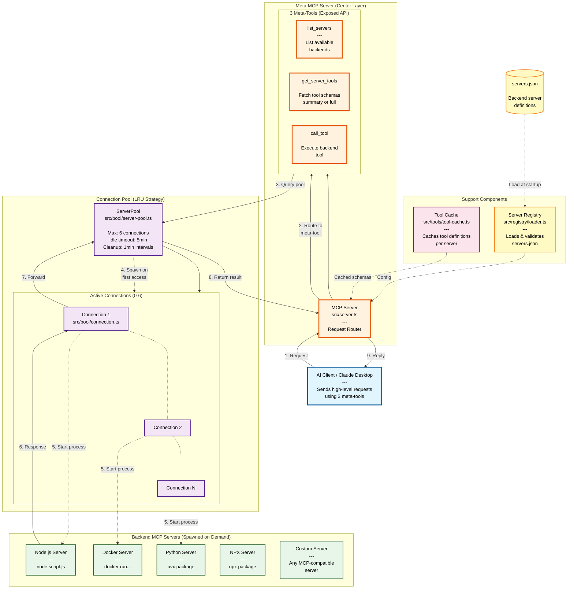
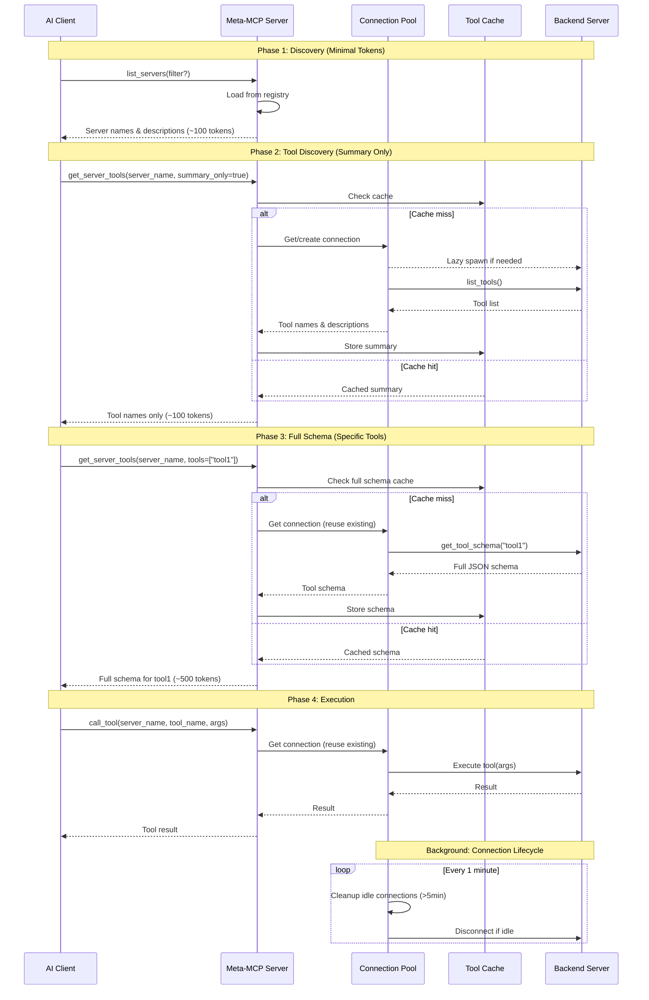
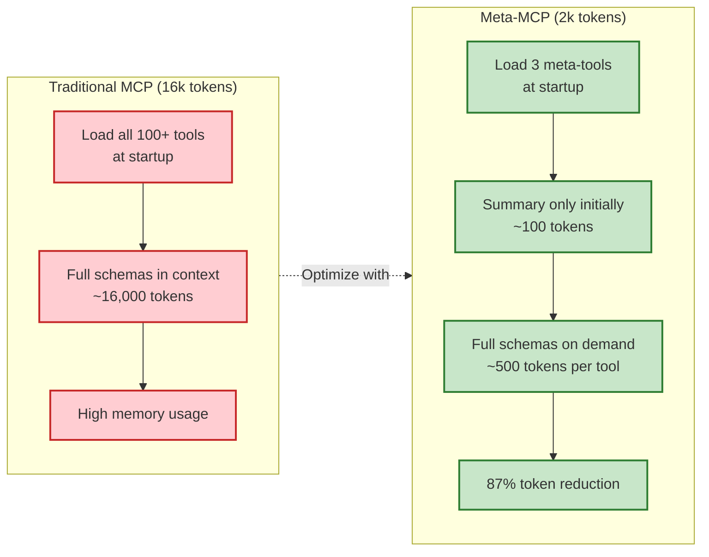
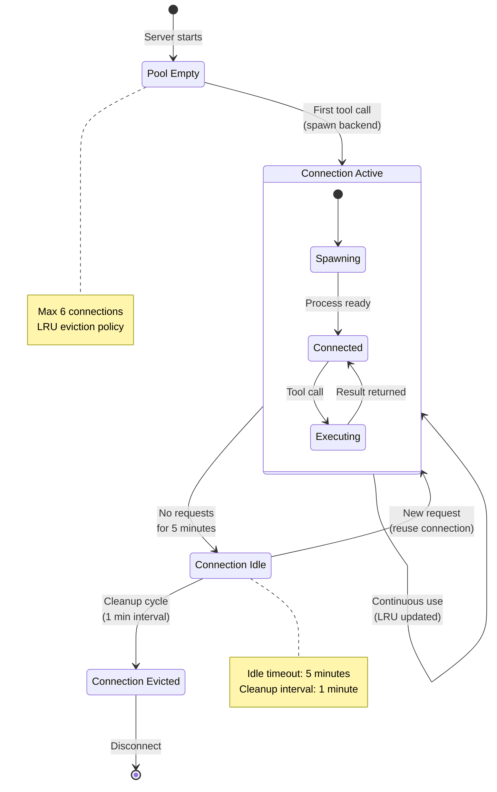
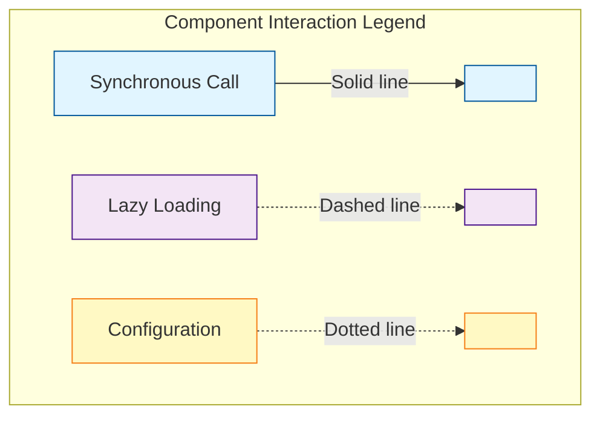

# Meta-MCP Server System Architecture

## Overview

This diagram illustrates the complete architecture of Meta-MCP Server, showing how it acts as an intelligent proxy between AI clients and multiple backend MCP servers, using lazy loading and connection pooling to optimize token usage.

## Architecture Diagram



## Request Flow Sequence



## Token Optimization Strategy



## Connection Pool Behavior



## Component Interaction Matrix



## Key Architectural Principles

### 1. Lazy Loading (Zero Upfront Cost)
- Backend servers are **NOT** started at Meta-MCP initialization
- Connections spawn only when first accessed via `get_server_tools` or `call_tool`
- Reduces startup time and memory footprint

### 2. Two-Tier Schema Loading
- **Tier 1**: `summary_only=true` returns tool names/descriptions only (~100 tokens)
- **Tier 2**: `tools=["specific"]` returns full JSON schemas on demand (~500 tokens each)
- AI can browse 100+ tools without loading full schemas

### 3. Connection Pooling (Resource Management)
- **Max 6 connections**: Prevents resource exhaustion
- **LRU eviction**: Least recently used connections removed when pool is full
- **5-minute idle timeout**: Automatic cleanup of unused connections
- **1-minute cleanup cycle**: Background maintenance task

### 4. Tool Caching (Performance)
- First request to backend: cache tool schemas
- Subsequent requests: serve from cache (no backend call)
- Cache invalidation: manual or on connection restart

### 5. Configuration-Driven (Flexibility)
- `servers.json` format matches Claude Desktop's `mcp.json`
- Environment variable: `SERVERS_CONFIG` points to config file
- Zod schema validation ensures config correctness

## File Structure Reference

```
src/
├── index.ts                    # Entry point (creates ServerPool + ToolCache)
├── server.ts                   # MCP server with 3 meta-tool handlers
├── pool/
│   ├── server-pool.ts         # LRU connection pool manager
│   └── connection.ts          # MCP client wrapper (spawn/connect)
├── registry/
│   └── loader.ts              # Loads/validates servers.json
└── tools/
    └── tool-cache.ts          # Per-server tool definition cache

tests/
├── integration/               # Real backend tests (Docker, Node, uvx)
└── *.test.ts                  # Unit tests (mocked pool/connections)
```

## Performance Characteristics

| Metric | Traditional MCP | Meta-MCP Server |
|--------|----------------|-----------------|
| **Initial Token Load** | ~16,000 tokens | ~100 tokens |
| **Startup Time** | Start all backends | Zero (lazy loading) |
| **Memory Usage** | All backends running | Only active backends |
| **Tool Discovery** | Full schemas loaded | Summary first, schema on demand |
| **Token Reduction** | Baseline | **87% reduction** |
| **Max Concurrent Backends** | Unlimited | 6 (configurable) |

## Legend

### Line Types
- **Solid lines** (→): Synchronous function calls or data flow
- **Dashed lines** (-.->): Lazy loading or asynchronous spawning
- **Dotted lines** (...): Configuration or cache relationships

### Color Coding
- **Blue** (`#e1f5ff`): AI Client layer
- **Orange** (`#fff3e0`): Meta-MCP Server core
- **Purple** (`#f3e5f5`): Connection pool components
- **Green** (`#e8f5e9`): Backend MCP servers
- **Pink** (`#fce4ec`): Caching layer
- **Yellow** (`#fff9c4`): Configuration/registry

---

**Generated for**: Meta-MCP Server
**Version**: 1.0
**Last Updated**: 2025-12-02
