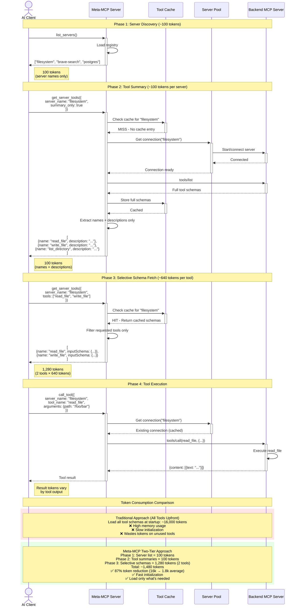
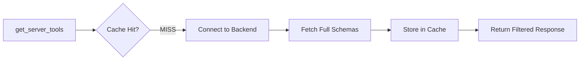
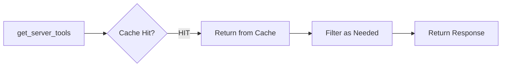

# Request Flow: Two-Tier Tool Discovery

This diagram illustrates the token-efficient two-tier lazy loading approach used by Meta-MCP Server.

## Sequence Diagram



## Token Breakdown

### Traditional MCP Approach
| Step | Description | Tokens |
|------|-------------|--------|
| 1 | Load all servers + all tool schemas | ~16,000 |
| **Total** | | **~16,000** |

**Issues:**
- All tool schemas loaded upfront, even if never used
- Consumes AI context window unnecessarily
- Slow initialization for large tool sets

### Meta-MCP Two-Tier Approach

| Phase | Step | Description | Tokens | Cache |
|-------|------|-------------|--------|-------|
| 1 | Server Discovery | `list_servers()` returns server names | 100 | - |
| 2 | Tool Summary | `get_server_tools({summary_only: true})` per server | 100 | MISS → Fetch & cache |
| 3 | Schema Fetch | `get_server_tools({tools: ["tool1", "tool2"]})` | 1,280 | HIT → Return cached |
| 4 | Execution | `call_tool(...)` uses existing connection | Variable | - |
| **Total** | | Average for 2 tools across 1 server | **~1,480** | |

### Token Savings

```
Traditional:   16,000 tokens
Meta-MCP:       1,480 tokens (typical usage with 2 tools)
Reduction:     14,520 tokens saved
Percentage:    87% reduction
```

## Cache Behavior

### First Request (Cold Cache)


### Subsequent Requests (Warm Cache)


## Performance Characteristics

### Connection Pool
- **Max Connections:** 6 concurrent servers
- **Idle Timeout:** 5 minutes
- **Cleanup Interval:** 1 minute
- **Eviction Policy:** LRU (Least Recently Used)

### Tool Cache
- **Scope:** Per-server tool definitions
- **Lifetime:** Duration of connection
- **Invalidation:** When connection is evicted from pool

## Real-World Example

Scenario: AI needs to read a file and search the web

```
Phase 1: list_servers()
→ Returns: ["filesystem", "brave-search", "postgres", ...]
→ Tokens: 100

Phase 2: get_server_tools({server_name: "filesystem", summary_only: true})
→ Returns: [
    {name: "read_file", description: "Read file contents"},
    {name: "write_file", description: "Write to file"},
    {name: "list_directory", description: "List directory contents"},
    ...
  ]
→ Tokens: 100
→ Cache: MISS → Fetch and cache full schemas

Phase 2b: get_server_tools({server_name: "brave-search", summary_only: true})
→ Returns: [
    {name: "brave_web_search", description: "Search the web"},
    {name: "brave_local_search", description: "Search local businesses"}
  ]
→ Tokens: 100
→ Cache: MISS → Fetch and cache

Phase 3: get_server_tools({
  server_name: "filesystem",
  tools: ["read_file"]
})
→ Returns: Full schema for read_file
→ Tokens: 640
→ Cache: HIT → Instant return

Phase 3b: get_server_tools({
  server_name: "brave-search",
  tools: ["brave_web_search"]
})
→ Returns: Full schema for brave_web_search
→ Tokens: 640
→ Cache: HIT → Instant return

Phase 4: call_tool({
  server_name: "filesystem",
  tool_name: "read_file",
  arguments: {path: "/config.json"}
})
→ Executes on backend
→ Connection pool: Returns existing connection (no spawn overhead)

Phase 4b: call_tool({
  server_name: "brave-search",
  tool_name: "brave_web_search",
  arguments: {query: "MCP servers"}
})
→ Executes on backend
→ Connection pool: Returns existing connection

Total tokens consumed: 100 + 100 + 100 + 640 + 640 = 1,580 tokens
Traditional approach:      ~16,000 tokens for all tools from both servers
Savings:                   14,420 tokens (90% reduction)
```

## Key Optimization Strategies

1. **Lazy Loading**: Only load tool schemas when AI explicitly requests them
2. **Two-Tier Discovery**: Summaries first, full schemas only when needed
3. **Selective Fetching**: `tools` parameter lets AI request specific schemas
4. **Aggressive Caching**: Cache full schemas after first fetch
5. **Connection Pooling**: Reuse connections to avoid spawn overhead
6. **LRU Eviction**: Keep frequently-used servers connected, evict stale ones

## Benefits

- **Token Efficiency**: 87-90% reduction in context consumption
- **Fast Initialization**: No upfront schema loading
- **Scalability**: Works with 100+ backend servers without context explosion
- **Flexibility**: AI discovers and loads only what it needs
- **Performance**: Connection pooling eliminates repeated spawn overhead
