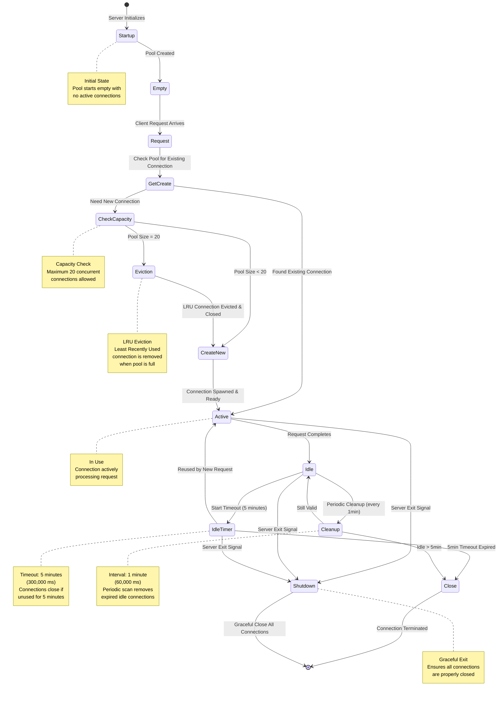

# Connection Pool Lifecycle

This diagram shows the complete lifecycle of connections in the Meta-MCP Server pool, including creation, usage, idle management, eviction, and cleanup processes.

## State Machine Diagram



## Configuration Parameters

| Parameter | Value | Description |
|-----------|-------|-------------|
| `maxConnections` | 20 | Maximum number of concurrent backend connections |
| `idleTimeoutMs` | 300,000 ms | 5 minutes - idle connections are closed after this period |
| `cleanupIntervalMs` | 60,000 ms | 1 minute - periodic cleanup runs at this interval |

## State Descriptions

### Startup → Empty
- **Trigger**: Server initialization
- **Action**: Create empty connection pool with max capacity of 20
- **State**: No connections exist yet

### Request → GetCreate
- **Trigger**: AI client requests a backend tool
- **Action**: Check if connection to target server exists
- **Decision Point**: Reuse existing or create new?

### GetCreate → Active (Existing)
- **Condition**: Connection already exists in pool
- **Action**: Retrieve and mark as recently used (LRU update)
- **Benefit**: Zero latency, no spawn overhead

### GetCreate → CheckCapacity (New)
- **Condition**: No existing connection to target server
- **Action**: Check current pool size against max (20)
- **Decision Point**: Room available or eviction needed?

### CheckCapacity → CreateNew
- **Condition**: Pool has < 20 connections
- **Action**: Spawn new backend process and establish connection
- **Duration**: Varies by backend (stdio spawn, connection handshake)

### CheckCapacity → Eviction
- **Condition**: Pool already has 20 connections
- **Action**: Evict least recently used (LRU) connection
- **Cleanup**: Close evicted connection gracefully before creating new one

### Active → Idle
- **Trigger**: Request completes successfully or with error
- **Action**: Mark connection as available, update last-used timestamp
- **State**: Connection remains open but unused

### Idle → IdleTimer
- **Trigger**: Connection becomes idle
- **Action**: Start 5-minute countdown timer
- **Monitoring**: Timer tracks elapsed time since last use

### IdleTimer → Active (Reuse)
- **Trigger**: New request for same backend server
- **Action**: Cancel timeout, mark as active again
- **Efficiency**: Avoid spawn overhead by reusing warm connection

### IdleTimer → Close (Timeout)
- **Trigger**: 5 minutes elapse with no reuse
- **Action**: Close connection, remove from pool
- **Reason**: Resource conservation - don't hold idle connections indefinitely

### Cleanup → Close
- **Trigger**: Periodic cleanup runs (every 1 minute)
- **Condition**: Connection idle > 5 minutes
- **Action**: Force close and remove from pool
- **Purpose**: Ensure timely cleanup even if timer events miss

### Cleanup → Idle
- **Trigger**: Periodic cleanup runs (every 1 minute)
- **Condition**: Connection idle < 5 minutes
- **Action**: No action, connection remains available
- **Purpose**: Validation that connection is still within timeout window

### Shutdown → [End]
- **Trigger**: Server exit signal (SIGTERM, SIGINT, process exit)
- **Action**: Close all connections gracefully
- **Guarantee**: No orphaned backend processes

## Lifecycle Example Flow

### Scenario: Three sequential requests to same backend

```
1. [Empty] → Request "filesystem/read"
   → Create new connection
   → [Active] (1 connection)

2. Request completes
   → [Idle] (start 5min timer)

3. 30 seconds later: Request "filesystem/write"
   → Reuse existing connection
   → [Active] (resets timer)

4. Request completes
   → [Idle] (restart 5min timer)

5. 6 minutes pass with no requests
   → [Cleanup] detects timeout
   → [Close] (0 connections)
```

### Scenario: Pool at capacity with new server request

```
1. Pool has 6 active connections (A, B, C, D, E, F)
2. All complete → [Idle]
3. Request for server G arrives
4. [Eviction] removes least recently used (say, A)
5. [CreateNew] spawns connection to G
6. Pool now has: B, C, D, E, F, G
```

## Optimization Benefits

1. **Lazy Loading**: Connections only created when needed
2. **Resource Reuse**: Avoid spawn overhead for repeated requests
3. **Memory Bounded**: Maximum 20 connections prevents resource exhaustion
4. **Automatic Cleanup**: Idle connections don't linger indefinitely
5. **LRU Eviction**: Keeps most frequently used servers readily available

## Implementation Notes

The connection pool is implemented in `src/pool/server-pool.ts` with the following key methods:

- `getConnection(serverName)` - Main entry point (handles Get/Create logic)
- `evictLeastRecentlyUsed()` - LRU eviction when pool is full
- `startCleanupInterval()` - Periodic cleanup timer
- `closeAll()` - Graceful shutdown

Each connection wrapper (`src/pool/connection.ts`) tracks:
- `lastUsedAt` timestamp for LRU
- `idleTimer` for 5-minute timeout
- `client` MCP protocol instance
- `process` spawn handle for lifecycle management
