# ServerPool Architecture

This diagram shows the complete ServerPool class architecture, including all components, relationships, and the LRU eviction algorithm.

## Class Structure

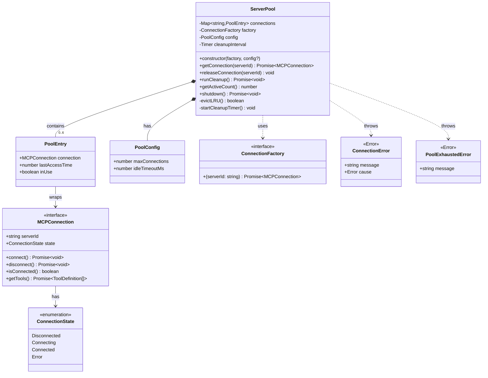

## Component Details

### ServerPool Configuration

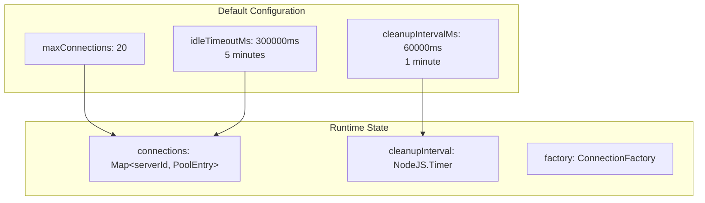

### PoolEntry Lifecycle

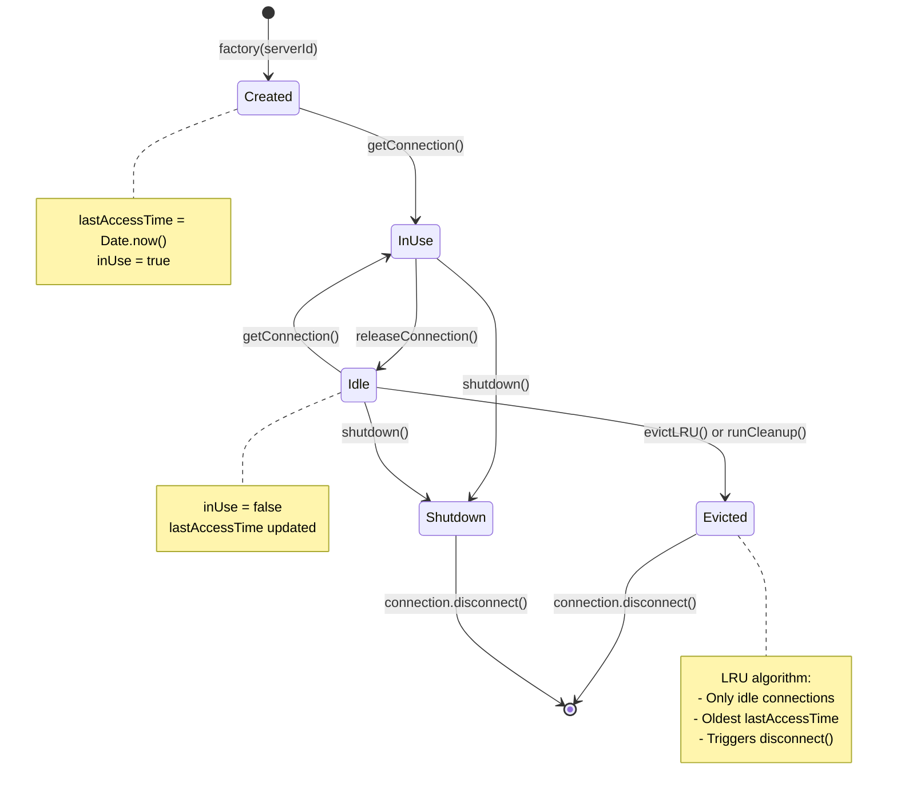

## LRU Eviction Algorithm

```mermaid
flowchart TD
    START([getConnection called]) --> CHECK_EXIST{Connection<br/>exists?}
    CHECK_EXIST -->|Yes| UPDATE[Update lastAccessTime<br/>Set inUse = true]
    UPDATE --> RETURN1[Return existing connection]

    CHECK_EXIST -->|No| CHECK_SIZE{Pool size >=<br/>maxConnections?}
    CHECK_SIZE -->|No| CREATE[Create new connection]

    CHECK_SIZE -->|Yes| EVICT_START[Start LRU eviction]
    EVICT_START --> FIND_OLDEST[Find oldest idle connection]

    FIND_OLDEST --> ITERATE[Iterate connections Map]
    ITERATE --> FILTER{inUse =<br/>false?}
    FILTER -->|No| SKIP[Skip this entry]
    SKIP --> MORE{More<br/>entries?}

    FILTER -->|Yes| COMPARE{lastAccessTime <<br/>current oldest?}
    COMPARE -->|Yes| SET_OLDEST[Update oldest reference]
    COMPARE -->|No| MORE
    SET_OLDEST --> MORE

    MORE -->|Yes| ITERATE
    MORE -->|No| CHECK_FOUND{Oldest<br/>found?}

    CHECK_FOUND -->|Yes| DISCONNECT[Call disconnect()]
    DISCONNECT --> DELETE[Delete from Map]
    DELETE --> CREATE

    CHECK_FOUND -->|No| ERROR[Throw PoolExhaustedError]

    CREATE --> FACTORY[Call factory(serverId)]
    FACTORY --> CONNECT[Call connection.connect()]
    CONNECT --> ADD_ENTRY[Add to Map with:<br/>lastAccessTime = now<br/>inUse = true]
    ADD_ENTRY --> RETURN2[Return new connection]

    ERROR --> END1([Error thrown])
    RETURN1 --> END2([Connection returned])
    RETURN2 --> END2

    style EVICT_START fill:#ffe6e6
    style FIND_OLDEST fill:#ffe6e6
    style DISCONNECT fill:#ffcccc
    style DELETE fill:#ffcccc
    style ERROR fill:#ff9999
```

## Connection Pool Operations

### getConnection() Flow

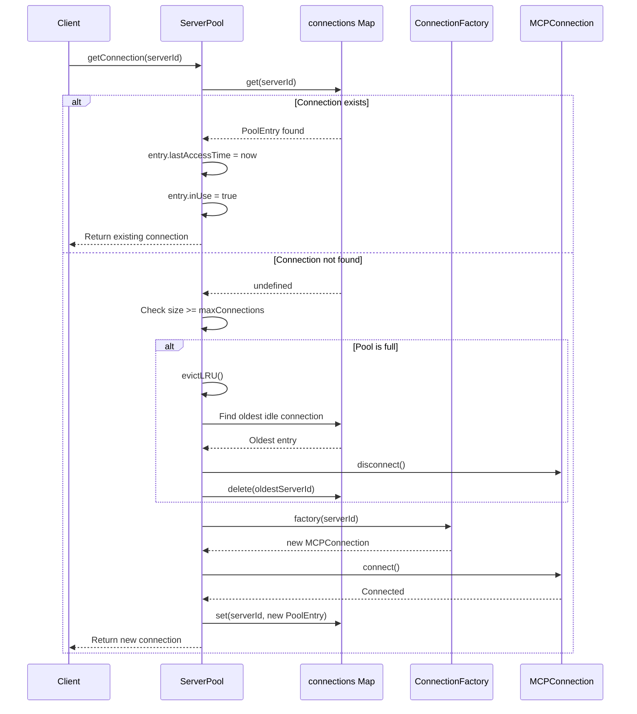

### releaseConnection() Flow

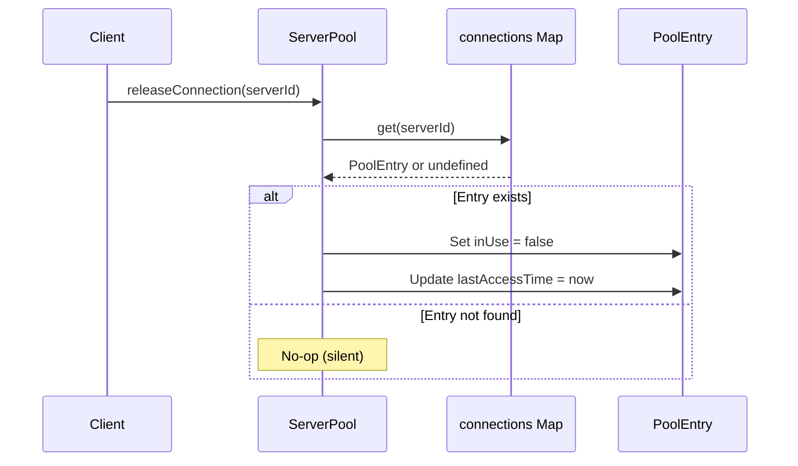

### Cleanup Timer Flow

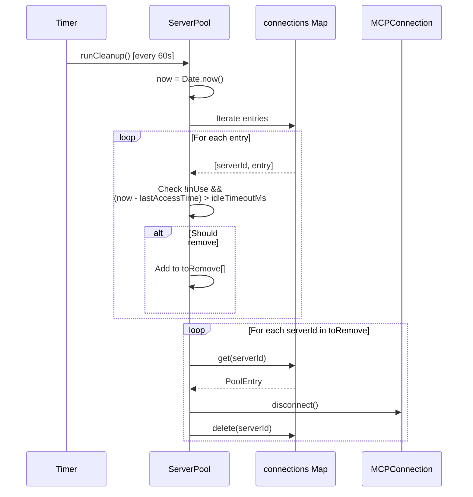

### Shutdown Flow

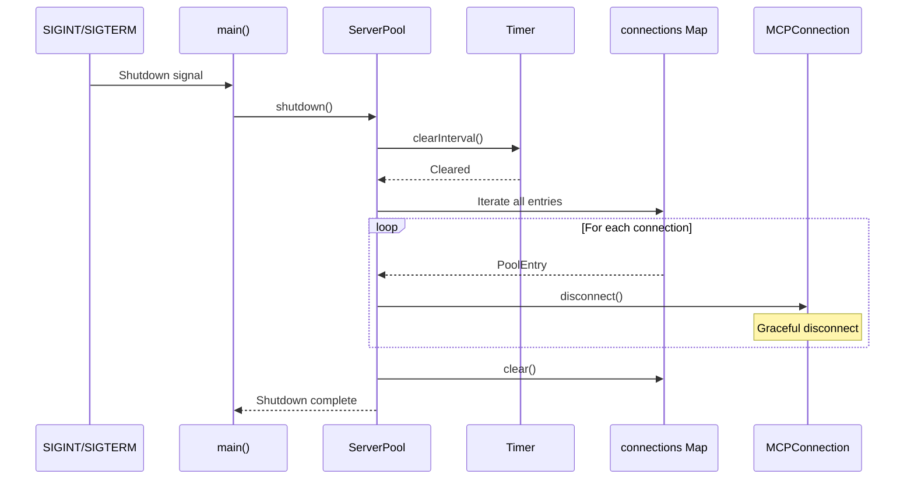

## Integration Points

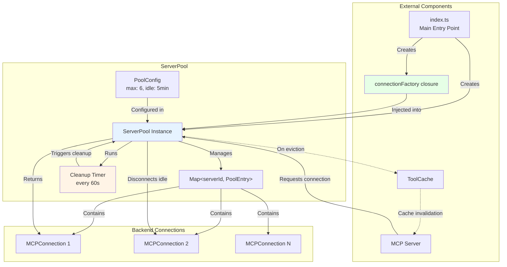

## Error Handling

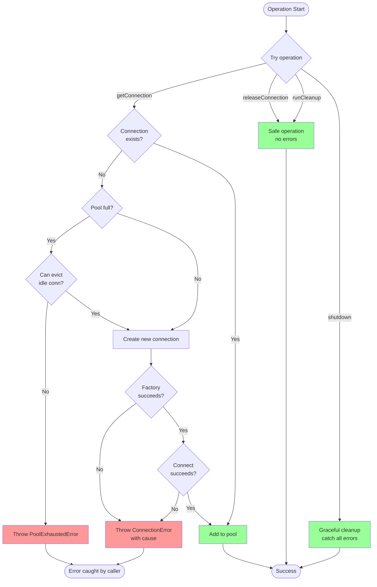

## Memory Management

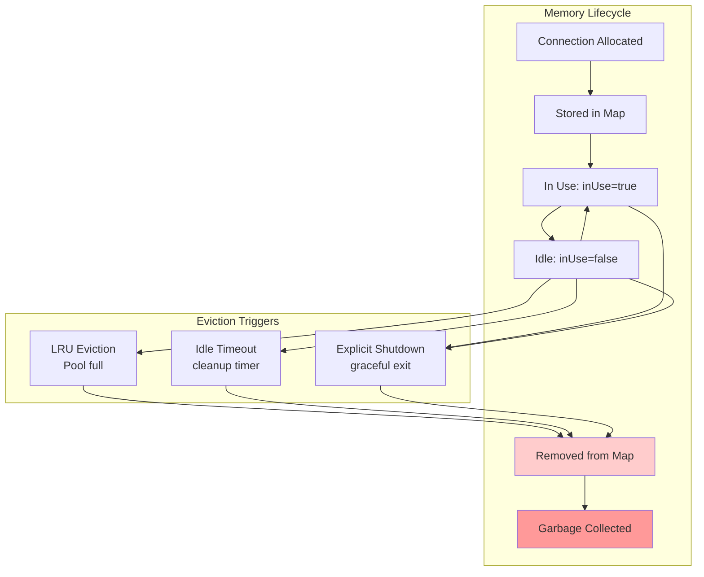

## Performance Characteristics

### Time Complexity

| Operation | Best Case | Average Case | Worst Case | Notes |
|-----------|-----------|--------------|------------|-------|
| `getConnection()` (hit) | O(1) | O(1) | O(1) | Map lookup |
| `getConnection()` (miss, space) | O(1) | O(1) | O(1) | Create + Map insert |
| `getConnection()` (miss, full) | O(n) | O(n) | O(n) | Must iterate to find LRU |
| `releaseConnection()` | O(1) | O(1) | O(1) | Map lookup |
| `runCleanup()` | O(n) | O(n) | O(n) | Iterate all entries |
| `shutdown()` | O(n) | O(n) | O(n) | Disconnect all |

### Space Complexity

- **Map storage**: O(n) where n = number of active connections
- **Maximum**: 6 connections (configurable via `maxConnections`)
- **Per-entry overhead**: ~96 bytes (PoolEntry + Map overhead)
- **Total max pool overhead**: ~576 bytes + connection objects

### Timing Characteristics

```mermaid
gantt
    title Connection Pool Timing
    dateFormat X
    axisFormat %S.%L

    section Connection Lifecycle
    Create connection: 0, 100
    Connect via stdio: 100, 300
    Active use: 300, 5300
    Idle period: 5300, 305300
    Cleanup scan: 305300, 305350
    Disconnect: 305350, 305450

    section Pool Operations
    getConnection (hit): 0, 1
    getConnection (miss): 0, 400
    releaseConnection: 5300, 5301
    runCleanup: 305300, 305350
    evictLRU: crit, 0, 10
```

## Configuration Examples

### Default Configuration

```typescript
const pool = new ServerPool(connectionFactory);
// Equivalent to:
const pool = new ServerPool(connectionFactory, {
  maxConnections: 20,
  idleTimeoutMs: 300000  // 5 minutes
});
```

### Custom Configuration

```typescript
// High-throughput: more connections, shorter timeout
const highThroughput = new ServerPool(connectionFactory, {
  maxConnections: 12,
  idleTimeoutMs: 60000  // 1 minute
});

// Resource-constrained: fewer connections, longer timeout
const resourceConstrained = new ServerPool(connectionFactory, {
  maxConnections: 3,
  idleTimeoutMs: 600000  // 10 minutes
});
```

## Usage Patterns

### Basic Usage

```typescript
// 1. Create factory
const factory: ConnectionFactory = async (serverId: string) => {
  const config = getServerConfig(serverId);
  return createConnection(config);
};

// 2. Initialize pool
const pool = new ServerPool(factory);

// 3. Get connection
const conn = await pool.getConnection('filesystem');

// 4. Use connection
const tools = await conn.getTools();

// 5. Release when done
pool.releaseConnection('filesystem');

// 6. Shutdown on exit
await pool.shutdown();
```

### Error Handling Pattern

```typescript
try {
  const conn = await pool.getConnection('server-id');
  try {
    // Use connection
    const result = await conn.getTools();
    return result;
  } finally {
    // Always release
    pool.releaseConnection('server-id');
  }
} catch (error) {
  if (error instanceof PoolExhaustedError) {
    // All connections in use, wait and retry
  } else if (error instanceof ConnectionError) {
    // Backend spawn/connect failed
  }
  throw error;
}
```

## Key Design Decisions

1. **LRU Eviction**: Oldest idle connection removed when pool is full
   - Only considers idle connections (`inUse = false`)
   - Protects active connections from eviction
   - Simple timestamp-based algorithm

2. **Graceful Release**: `releaseConnection()` marks as idle but keeps alive
   - Connection stays in pool for reuse
   - Cleaned up later by timer or eviction
   - Optimizes for repeated access patterns

3. **Background Cleanup**: Timer runs every 60 seconds
   - Removes connections idle > 5 minutes
   - Prevents resource leaks
   - Independent of request patterns

4. **No Cache Coupling**: Pool doesn't directly manage ToolCache
   - Separation of concerns
   - Cache invalidation handled by server layer
   - Pool focused on connection lifecycle

5. **Synchronous Release**: No async operations needed
   - Just updates `inUse` flag and timestamp
   - Actual cleanup happens asynchronously
   - Simplifies caller code

6. **Error Transparency**: Factory errors propagate with context
   - Wraps errors as `ConnectionError`
   - Preserves original cause
   - Rich error information for debugging
