# Connection and Transport Layer Architecture

This document details the connection lifecycle, transport layer selection, error handling, and cleanup sequences in Meta-MCP Server.

## Component Overview

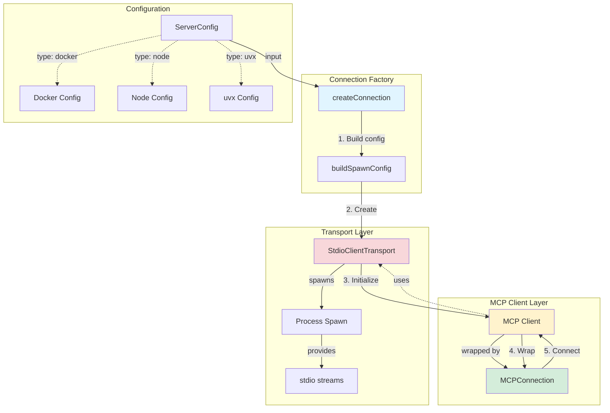

## Transport Selection Logic

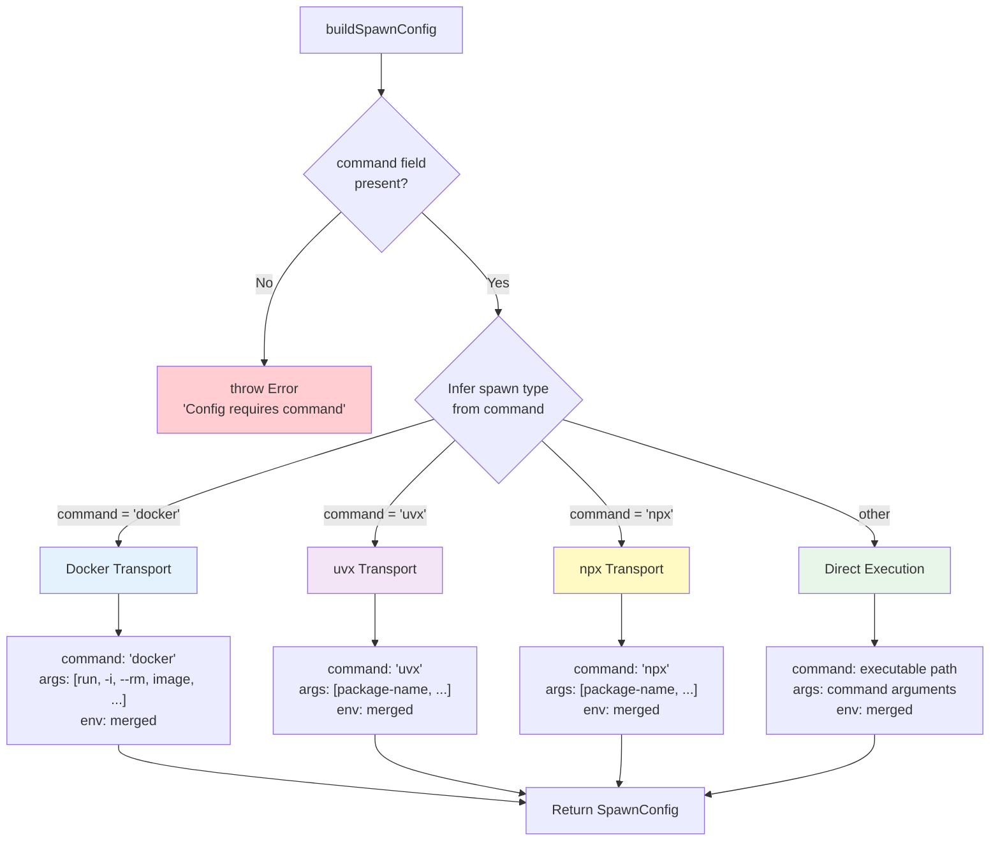

### Transport Examples

```typescript
// Docker Transport
{
  command: "docker",
  args: ["run", "-i", "--rm", "mcp/filesystem"],
  env: { ...process.env, ...customEnv }
}

// uvx Transport
{
  command: "uvx",
  args: ["mcp-server-git"],
  env: { ...process.env, ...customEnv }
}

// Node Transport
{
  command: "node",
  args: ["/path/to/jira/dist/index.js"],
  env: { ...process.env, JIRA_API_KEY: "..." }
}

// Python Transport
{
  command: "python",
  args: ["-m", "mcp_server_module"],
  env: { ...process.env, ...customEnv }
}
```

## Connection Lifecycle

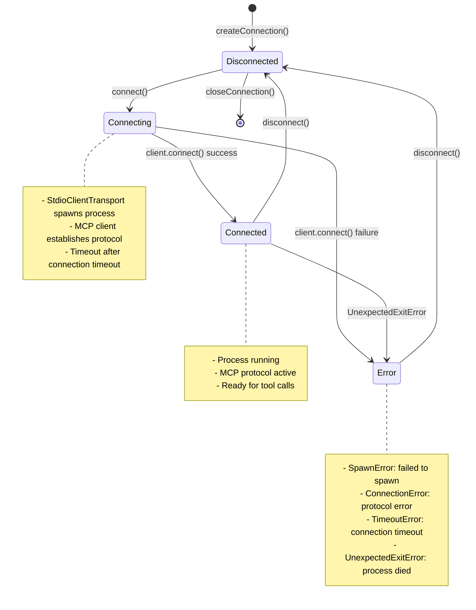

## Detailed Connection Sequence

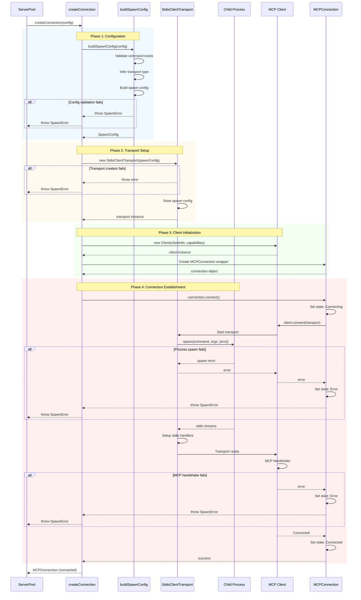

## Error Handling Architecture

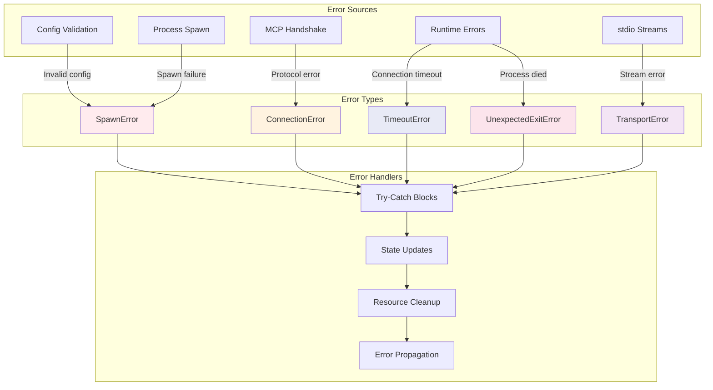

### Error Details

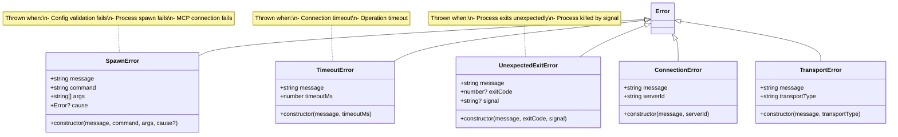

## Graceful Shutdown Sequence

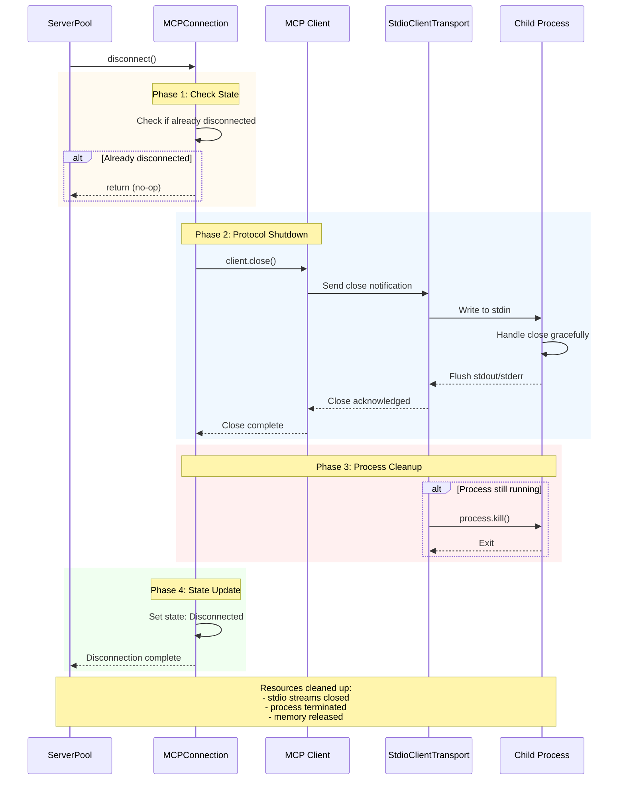

## Connection State Management

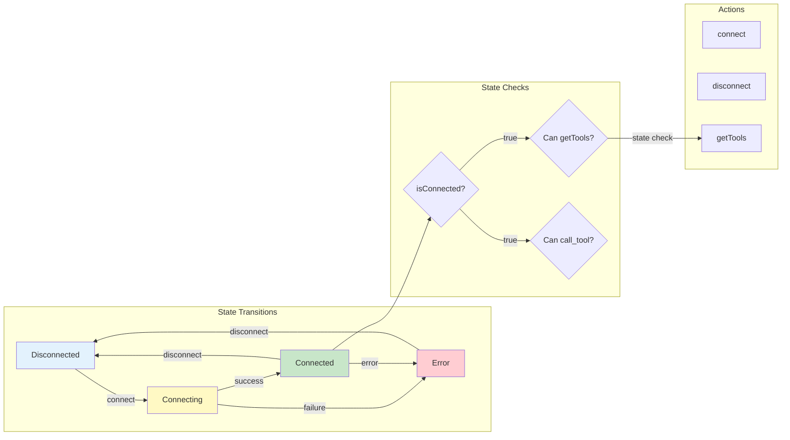

## Component Interactions

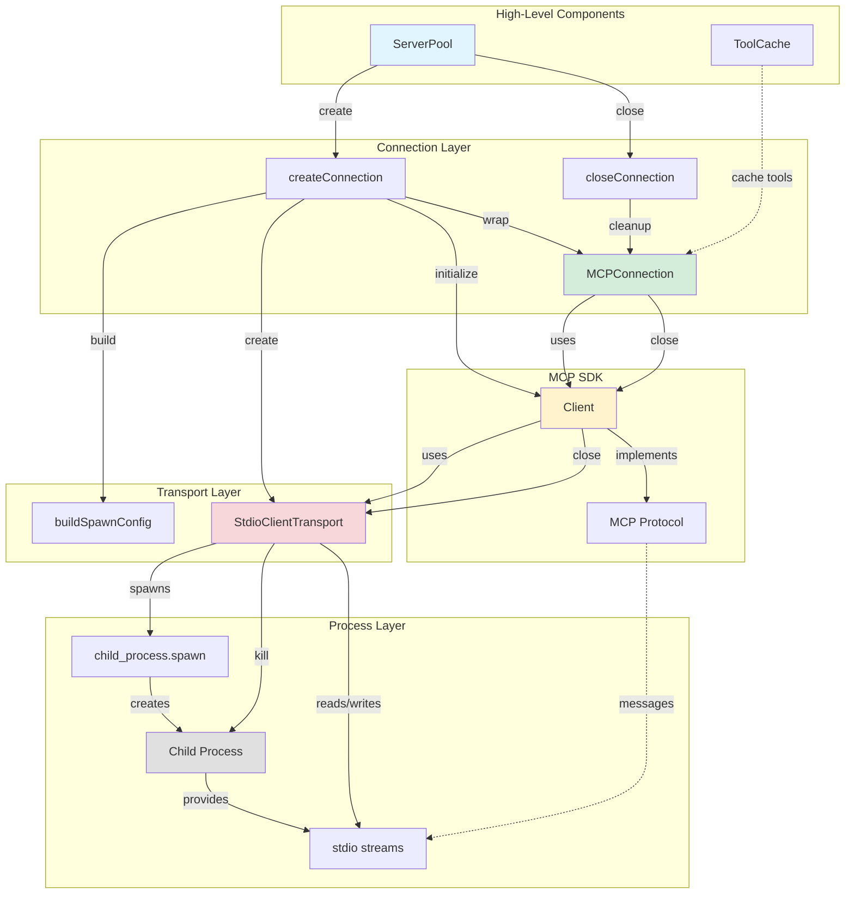

## Resource Lifecycle

```mermaid
gantt
    title Connection Resource Lifecycle
    dateFormat X
    axisFormat %s

    section Configuration
    Build SpawnConfig       :a1, 0, 1s
    Validate Config        :a2, after a1, 1s

    section Transport
    Create Transport       :b1, after a2, 1s
    Setup stdio           :b2, after b1, 1s

    section Process
    Spawn Process         :c1, after b2, 1s
    Process Running       :c2, after c1, 10s

    section Protocol
    MCP Handshake        :d1, after c1, 2s
    Ready for Tools      :d2, after d1, 8s

    section Cleanup
    Send Close           :e1, after d2, 1s
    Process Exit         :e2, after e1, 1s
    Resource Free        :e3, after e2, 1s
```

## Connection Pool Integration

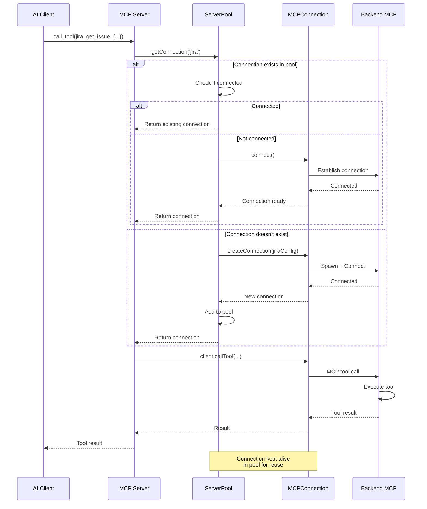

## Error Recovery Strategies

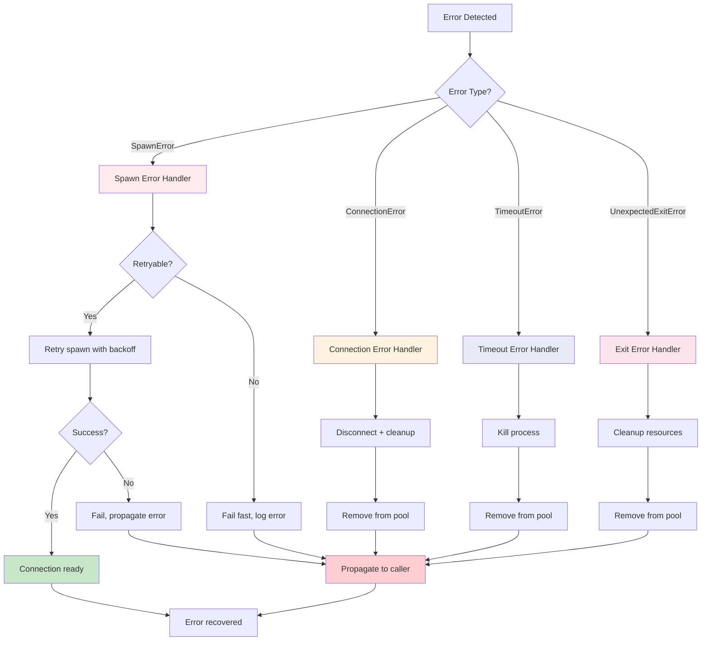

## Best Practices

### Connection Management
1. **Always check state before operations**: Verify connection is in `Connected` state before calling tools
2. **Handle all error types**: Catch and handle specific error types appropriately
3. **Cleanup on errors**: Always set state to `Disconnected` in finally blocks
4. **Graceful shutdown**: Call `client.close()` before killing process

### Transport Selection
1. **Docker**: Use for isolated, containerized MCP servers
2. **uvx/npx**: Use for package-based Python/Node MCP servers
3. **Direct execution**: Use for custom executable paths

### Error Handling
1. **SpawnError**: Retry with exponential backoff for transient failures
2. **ConnectionError**: Remove from pool, log for debugging
3. **TimeoutError**: Kill process immediately, don't retry
4. **UnexpectedExitError**: Log exit code/signal, remove from pool

### Resource Cleanup
1. **stdio streams**: Automatically closed by transport
2. **Child process**: Killed if still running after close
3. **Memory**: Released when connection removed from pool
4. **Event listeners**: Cleaned up by MCP SDK

## Related Diagrams
- [System Architecture](01-system-architecture.md) - Overall system design
- [Request Flow](02-request-flow.md) - End-to-end request handling
- [Pool Lifecycle](03-pool-lifecycle.md) - Connection pool management
- [Caching Strategy](04-caching-strategy.md) - Tool definition caching
