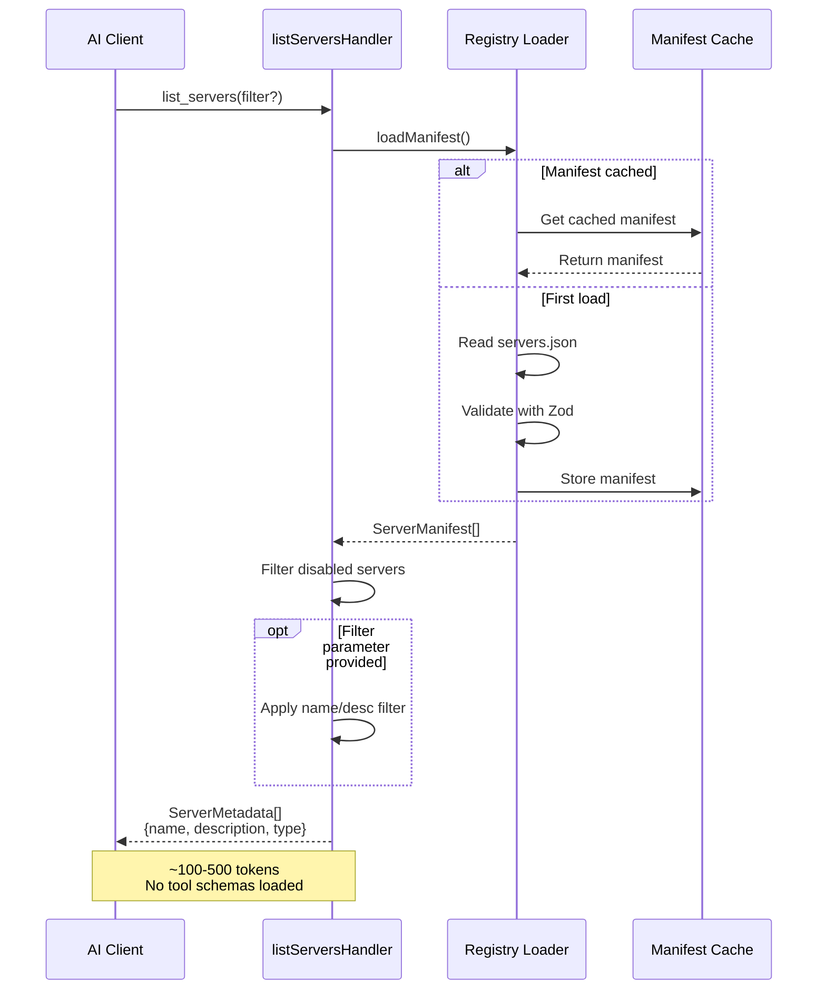
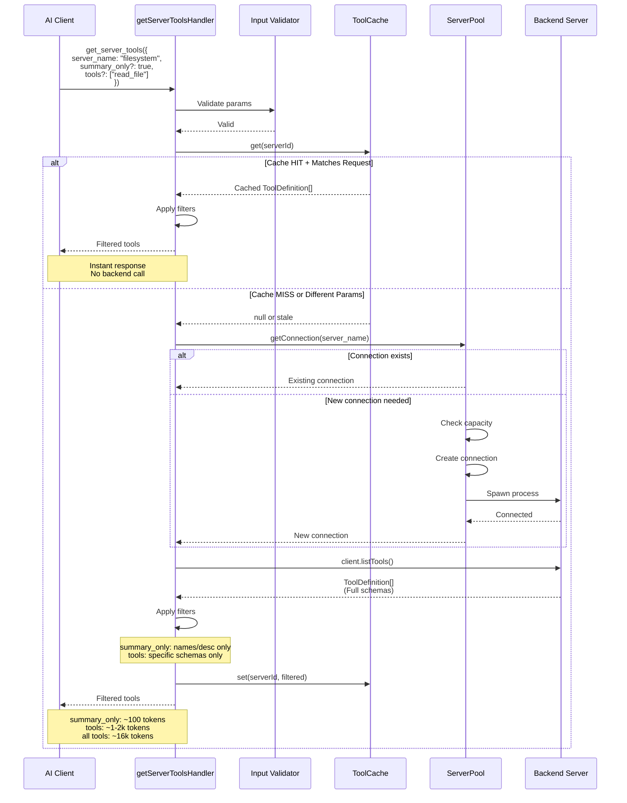
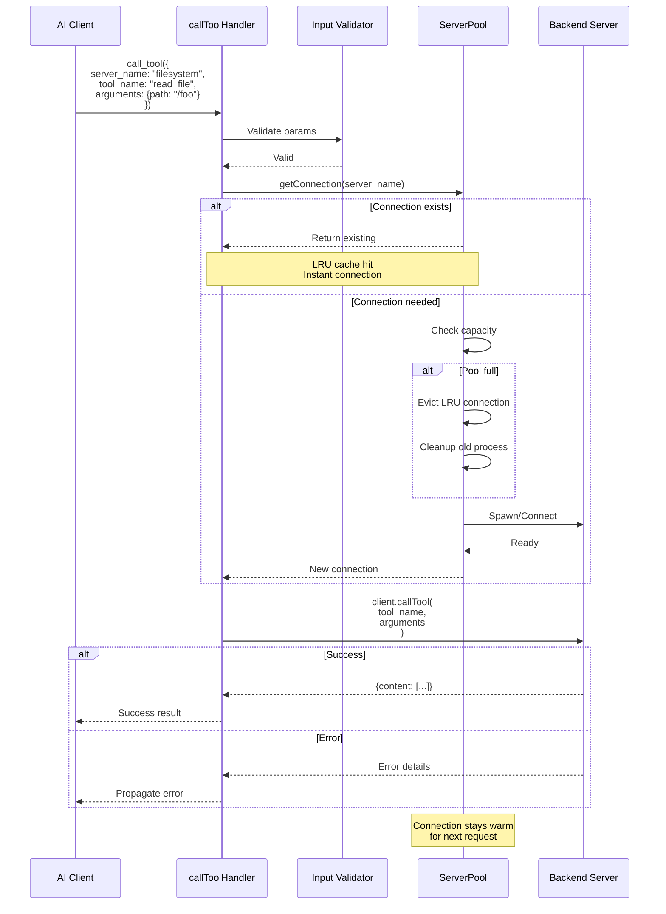
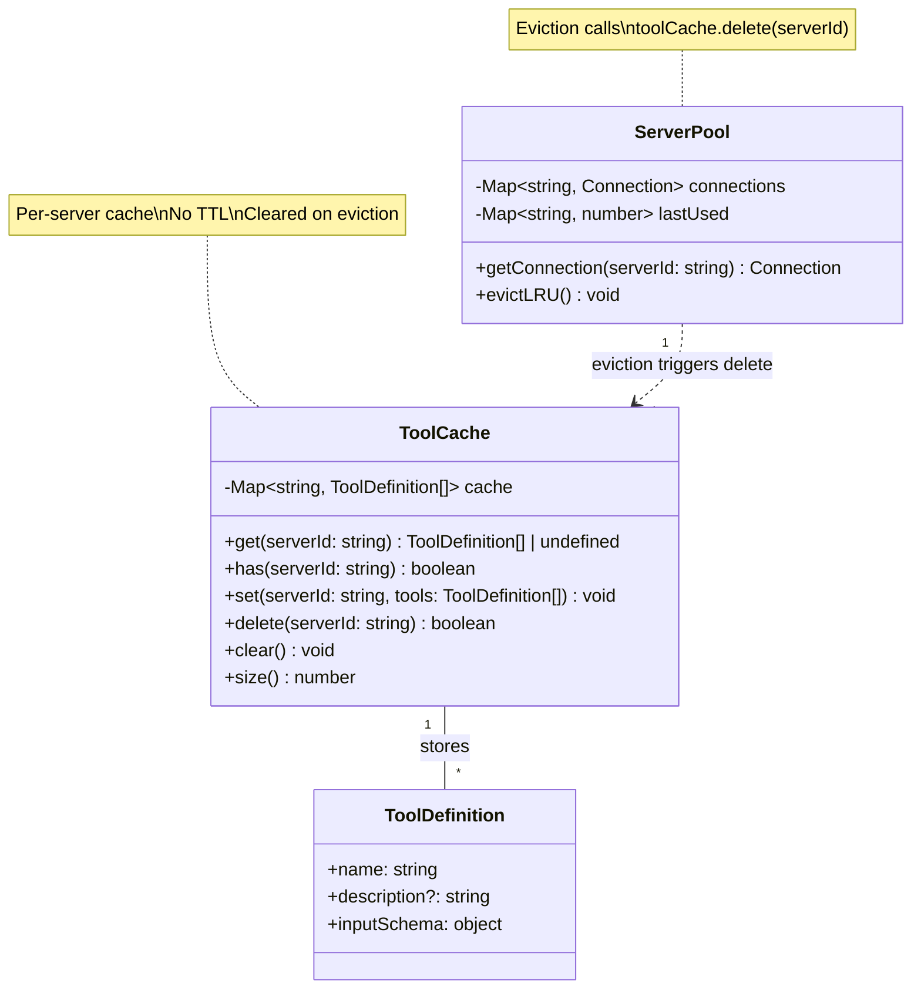
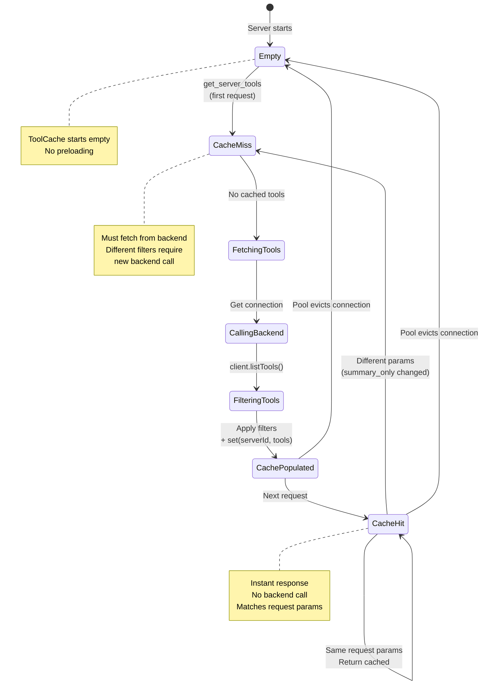
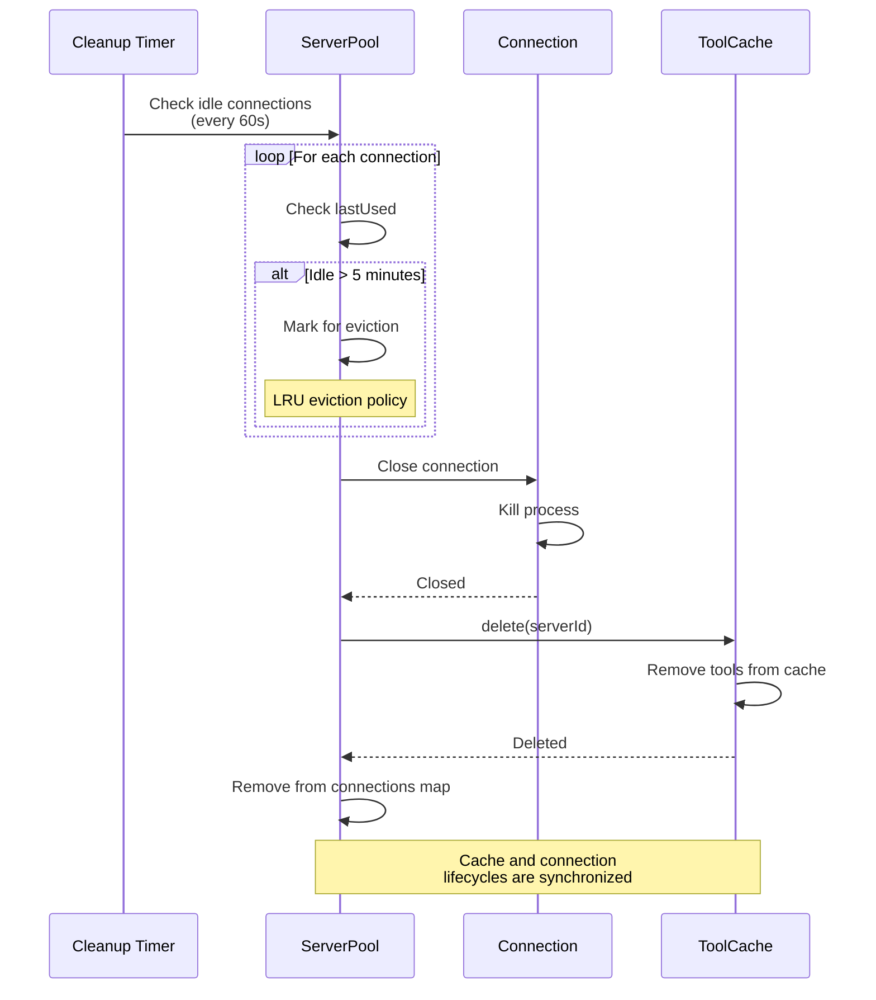
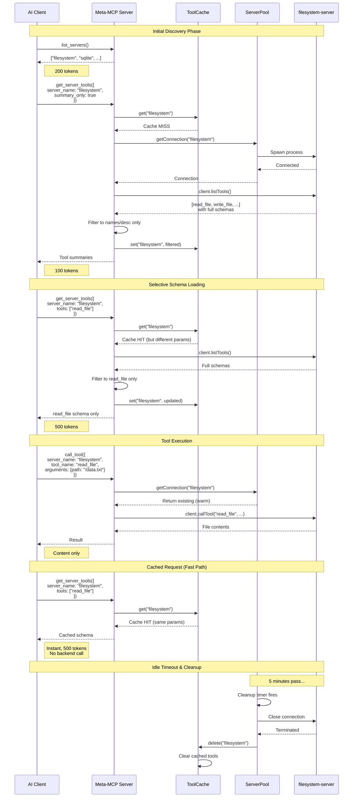
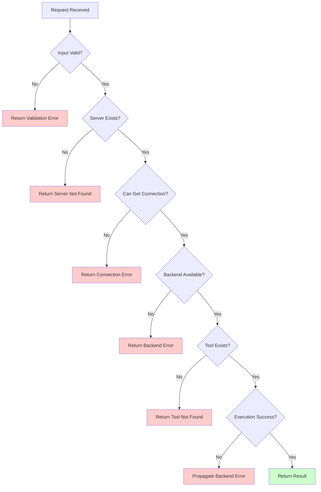

# Tool System Architecture

This diagram shows the complete tool discovery, caching, and execution flow in the Meta-MCP Server.

## Complete Tool System Flow

```mermaid
graph TB
    subgraph "AI Client"
        AI[AI Assistant]
    end

    subgraph "Meta-MCP Server"
        subgraph "Request Handlers"
            LSH[listServersHandler]
            GSTH[getServerToolsHandler]
            CTH[callToolHandler]
        end

        subgraph "Core Components"
            REG[Registry Loader]
            CACHE[ToolCache<br/>Map&lt;serverId, ToolDefinition[]&gt;]
            POOL[ServerPool<br/>LRU Connection Pool]
        end

        subgraph "Validation"
            VAL[Input Validation<br/>Zod Schemas]
        end
    end

    subgraph "Backend Servers"
        BS1[Backend Server 1<br/>filesystem]
        BS2[Backend Server 2<br/>sqlite]
        BS3[Backend Server N<br/>...]
    end

    %% Flow 1: List Servers
    AI -->|1. list_servers| LSH
    LSH -->|Load manifest| REG
    REG -->|Return configs| LSH
    LSH -->|Filter disabled| LSH
    LSH -->|Server metadata[]| AI

    %% Flow 2: Get Server Tools
    AI -->|2. get_server_tools<br/>server_name, summary_only?, tools?| GSTH
    GSTH -->|Validate params| VAL
    VAL -->|Valid| GSTH
    GSTH -->|Check cache| CACHE

    CACHE -->|Cache HIT<br/>Matches request| GSTH
    CACHE -->|Cache MISS or<br/>Different params| GSTH

    GSTH -->|Cache MISS| POOL
    POOL -->|getConnection| BS1
    BS1 -->|client.listTools| POOL
    POOL -->|ToolDefinition[]| GSTH

    GSTH -->|Apply filters<br/>summary_only or tools[]| GSTH
    GSTH -->|Store filtered result| CACHE
    GSTH -->|Filtered tools| AI

    %% Flow 3: Call Tool
    AI -->|3. call_tool<br/>server_name, tool_name, arguments| CTH
    CTH -->|Validate params| VAL
    VAL -->|Valid| CTH
    CTH -->|getConnection| POOL
    POOL -->|Get/Create connection| BS2
    CTH -->|client.callTool<br/>tool_name, arguments| BS2
    BS2 -->|Result or Error| CTH
    CTH -->|Return result| AI

    %% Pool eviction triggers cache cleanup
    POOL -.->|On eviction| CACHE
    CACHE -.->|delete(serverId)| CACHE

    style LSH fill:#e1f5ff
    style GSTH fill:#ffe1e1
    style CTH fill:#e1ffe1
    style CACHE fill:#fff4e1
    style POOL fill:#f0e1ff
    style REG fill:#e1ffe8
```

## Flow 1: listServersHandler() - Server Discovery



## Flow 2: getServerToolsHandler() - Tool Discovery & Caching



## Flow 3: callToolHandler() - Tool Execution



## ToolCache Structure & Lifecycle



## Cache Interaction State Diagram



## Token Optimization Flow

```mermaid
graph LR
    subgraph "First Discovery"
        A1[AI: list_servers] -->|~200 tokens| A2[Server names only]
        A2 --> A3[AI: get_server_tools<br/>summary_only=true]
        A3 -->|~100 tokens| A4[Tool names + descriptions]
    end

    subgraph "Selective Loading"
        A4 --> B1[AI analyzes capabilities]
        B1 --> B2[AI: get_server_tools<br/>tools=['read_file', 'write_file']]
        B2 -->|~1-2k tokens| B3[Only requested schemas]
    end

    subgraph "Execution"
        B3 --> C1[AI: call_tool<br/>read_file, args]
        C1 -->|Result only| C2[File contents]
    end

    subgraph "Cached Requests"
        C2 --> D1[AI: get_server_tools<br/>same params]
        D1 -->|Instant, ~1k tokens| D2[Cached schemas]
    end

    style A1 fill:#e1f5ff
    style A3 fill:#ffe1e1
    style B2 fill:#e1ffe1
    style C1 fill:#fff4e1
    style D1 fill:#f0e1ff

    note1[Total: ~1.5k tokens<br/>vs 16k+ traditional]
    B3 -.-> note1
```

## Integration: Pool Eviction Triggers Cache Cleanup



## Complete Request Lifecycle Example



## Key Architecture Principles

### 1. Lazy Loading
- No tools loaded at startup
- Backend connections created on demand
- Tool schemas fetched only when requested

### 2. Two-Tier Discovery
- **Tier 1**: `summary_only=true` - Names and descriptions only (~100 tokens)
- **Tier 2**: `tools=["specific"]` - Full schemas for selected tools (~1-2k tokens)

### 3. Intelligent Caching
- Per-server cache (not global)
- Cache persists while connection is alive
- Eviction synchronized with connection cleanup
- No TTL - cache cleared only on eviction

### 4. Connection Pooling
- LRU eviction policy (max 6 connections)
- 5-minute idle timeout
- 1-minute cleanup interval
- Warm connections for repeated requests

### 5. Token Optimization
- Traditional MCP: Load all tools upfront (~16k tokens)
- Meta-MCP: Progressive loading (~1.5k tokens total)
- 87% token reduction on discovery
- 100% reduction on cached requests

## Error Handling Flow



---

## Summary

The tool system architecture provides:

1. **Efficient Discovery**: Three-phase approach (servers → summaries → specific schemas)
2. **Smart Caching**: Per-server cache synchronized with connection lifecycle
3. **Connection Pooling**: LRU pool maintains warm connections for performance
4. **Token Optimization**: 87% reduction through progressive loading
5. **Error Handling**: Comprehensive validation and error propagation
6. **Lifecycle Management**: Automatic cleanup of idle connections and stale cache

This architecture enables Meta-MCP to wrap dozens of backend servers while maintaining minimal token overhead and fast response times.
