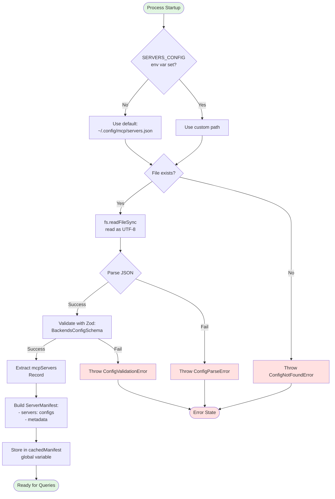
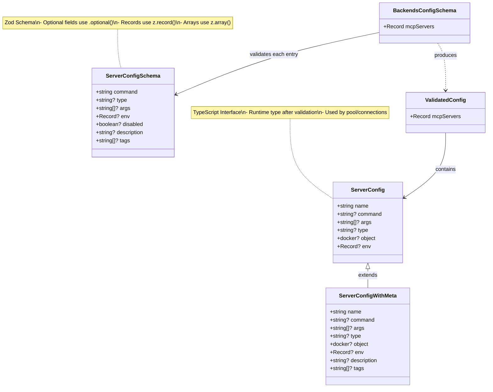
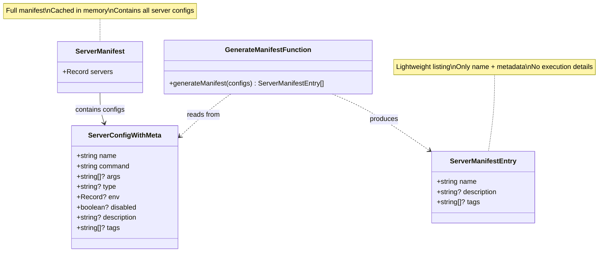
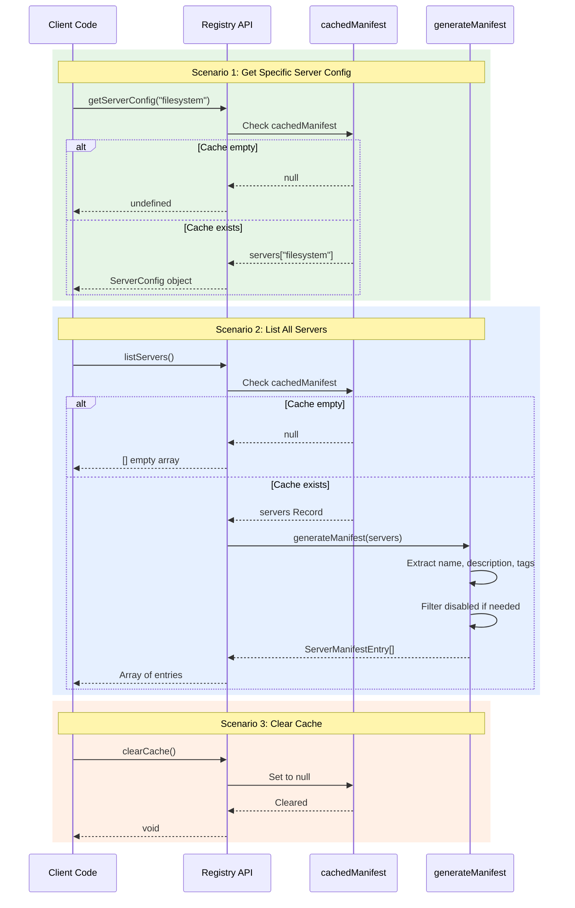
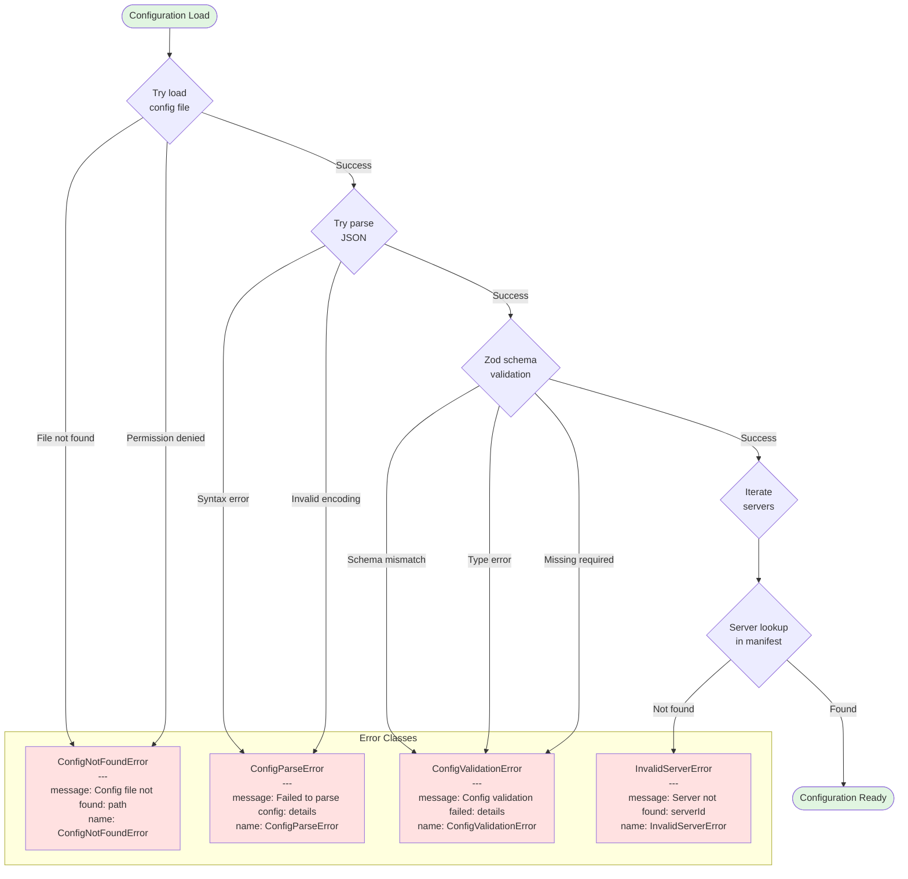
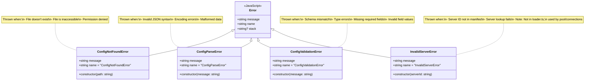
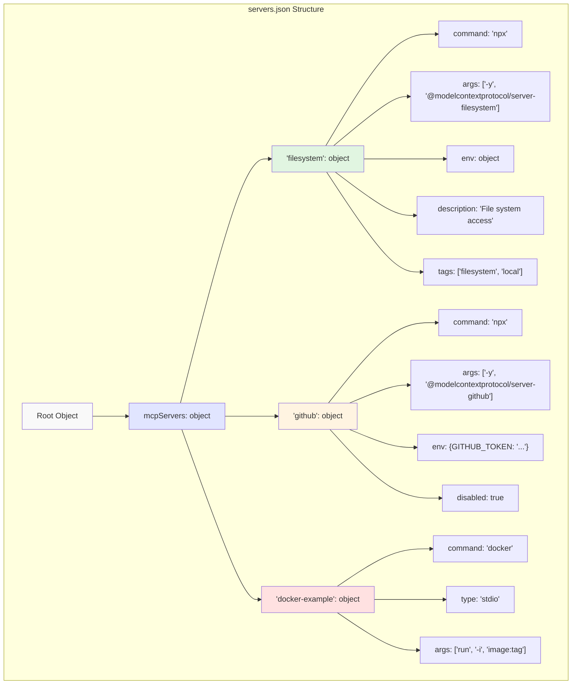
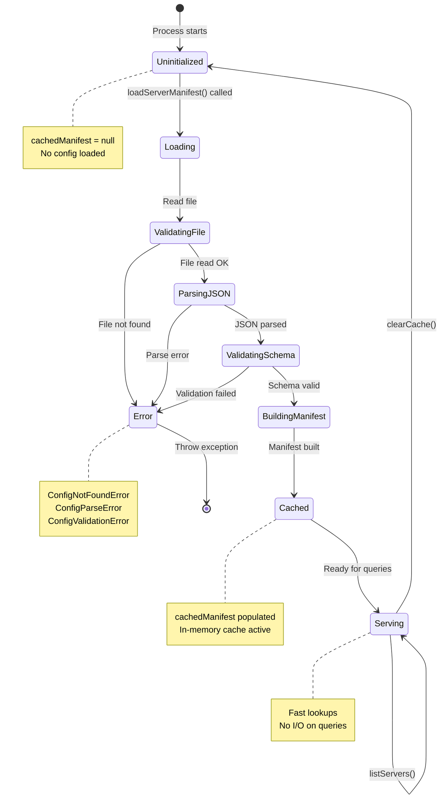

# Registry and Configuration Loading System

This document provides detailed diagrams of the configuration registry system, showing how Meta-MCP Server loads, validates, and manages backend server configurations.

## Overview

The registry system is responsible for:
- Loading configuration files from disk
- Validating configuration structure with Zod schemas
- Generating and caching server manifests
- Providing access to server configurations
- Managing disabled servers

## Configuration Loading Flow



## Zod Schema Validation Pipeline

```mermaid
flowchart TD
    Input[Raw JSON Object] --> Level1[BackendsConfigSchema<br/>Validation]

    Level1 --> CheckStructure{Has mcpServers<br/>property?}

    CheckStructure -->|No| Fail1[Validation Failed:<br/>Missing mcpServers]
    CheckStructure -->|Yes| IsRecord{mcpServers is<br/>Record type?}

    IsRecord -->|No| Fail2[Validation Failed:<br/>Invalid structure]
    IsRecord -->|Yes| IterateServers[Iterate over each<br/>server entry]

    IterateServers --> ServerValidation[ServerConfigSchema<br/>Validation per entry]

    ServerValidation --> ValidateCommand{command<br/>is string?}
    ValidateCommand -->|No| Fail3[Validation Failed:<br/>Invalid command]
    ValidateCommand -->|Yes| ValidateArgs{args is<br/>string[] or<br/>undefined?}

    ValidateArgs -->|No| Fail4[Validation Failed:<br/>Invalid args]
    ValidateArgs -->|Yes| ValidateEnv{env is<br/>Record string, string<br/>or undefined?}

    ValidateEnv -->|No| Fail5[Validation Failed:<br/>Invalid env]
    ValidateEnv -->|Yes| ValidateDisabled{disabled is<br/>boolean or<br/>undefined?}

    ValidateDisabled -->|No| Fail6[Validation Failed:<br/>Invalid disabled]
    ValidateDisabled -->|Yes| ValidateDesc{description is<br/>string or<br/>undefined?}

    ValidateDesc -->|No| Fail7[Validation Failed:<br/>Invalid description]
    ValidateDesc -->|Yes| ValidateTags{tags is<br/>string[] or<br/>undefined?}

    ValidateTags -->|No| Fail8[Validation Failed:<br/>Invalid tags]
    ValidateTags -->|Yes| ValidateType{type is<br/>string or<br/>undefined?}

    ValidateType -->|No| Fail9[Validation Failed:<br/>Invalid type]
    ValidateType -->|Yes| ServerValid[Server config valid]

    ServerValid --> MoreServers{More servers<br/>to validate?}
    MoreServers -->|Yes| IterateServers
    MoreServers -->|No| AllValid[All servers valid]

    AllValid --> Success[Return validated<br/>config object]

    Fail1 --> FailEnd[Throw ConfigValidationError]
    Fail2 --> FailEnd
    Fail3 --> FailEnd
    Fail4 --> FailEnd
    Fail5 --> FailEnd
    Fail6 --> FailEnd
    Fail7 --> FailEnd
    Fail8 --> FailEnd
    Fail9 --> FailEnd

    style Input fill:#e1e5ff
    style Success fill:#e1f5e1
    style FailEnd fill:#ffe1e1
```

## Zod Schema Structure



## Manifest Structure and Caching

```mermaid
flowchart TD
    subgraph Input [Configuration Input]
        ConfigFile[servers.json]
        RawConfig[Raw JSON Config]
    end

    subgraph Validation [Validation Layer]
        Zod[Zod Schema Validation]
        ValidatedData[Validated mcpServers<br/>Record]
    end

    subgraph ManifestGen [Manifest Generation]
        BuildFull[Build ServerManifest]
        ExtractMeta[Extract metadata fields:<br/>- description<br/>- tags]
        CreateEntries[Create ServerManifestEntry[]<br/>for listing]
    end

    subgraph Cache [In-Memory Cache]
        CachedManifest[cachedManifest:<br/>ServerManifest | null]
        FullConfigs[servers:<br/>Record string, ServerConfigWithMeta]
    end

    subgraph API [Public API]
        GetConfig[getServerConfig serverId:<br/>Returns ServerConfig?]
        ListServers[listServers:<br/>Returns ServerManifestEntry[]]
        ClearCache[clearCache:<br/>Invalidates cache]
    end

    ConfigFile --> RawConfig
    RawConfig --> Zod
    Zod --> ValidatedData
    ValidatedData --> BuildFull
    BuildFull --> ExtractMeta
    ExtractMeta --> CreateEntries

    BuildFull --> CachedManifest
    CachedManifest --> FullConfigs

    FullConfigs --> GetConfig
    FullConfigs --> ListServers
    CachedManifest --> ClearCache

    style ConfigFile fill:#f9f9f9
    style CachedManifest fill:#fff4e1
    style GetConfig fill:#e1f5e1
    style ListServers fill:#e1f5e1
    style ClearCache fill:#ffe1e1
```

## ServerManifest Data Model



## Configuration Retrieval Flow



## Error Handling System



## Complete Error Hierarchy



## Configuration File Format



## Registry Lifecycle



## Full System Integration

```mermaid
flowchart TB
    subgraph External [External Sources]
        EnvVar[SERVERS_CONFIG<br/>environment variable]
        ConfigFile[servers.json<br/>on filesystem]
    end

    subgraph Loader [Registry Loader]
        GetPath[getConfigPath]
        ReadFile[fs.readFileSync]
        ParseJSON[JSON.parse]
        ValidateZod[Zod validation]
        BuildManifest[Build manifest]
        StoreCache[Store in cachedManifest]
    end

    subgraph Cache [In-Memory Cache]
        GlobalCache[cachedManifest:<br/>ServerManifest | null]
    end

    subgraph API [Public API Functions]
        LoadManifest[loadServerManifest]
        GetConfig[getServerConfig]
        ListServers[listServers]
        ClearCache[clearCache]
    end

    subgraph Consumers [System Consumers]
        ServerPool[ServerPool]
        MetaTools[Meta-tools<br/>list_servers, call_tool]
        TestSuite[Test Suite]
    end

    EnvVar -.->|provides path| GetPath
    ConfigFile -.->|read by| ReadFile

    GetPath --> ReadFile
    ReadFile --> ParseJSON
    ParseJSON --> ValidateZod
    ValidateZod --> BuildManifest
    BuildManifest --> StoreCache

    StoreCache --> GlobalCache

    GlobalCache <--> LoadManifest
    GlobalCache <--> GetConfig
    GlobalCache <--> ListServers
    GlobalCache <--> ClearCache

    LoadManifest --> ServerPool
    GetConfig --> ServerPool
    ListServers --> MetaTools
    ClearCache --> TestSuite

    style EnvVar fill:#f9f9f9
    style ConfigFile fill:#f9f9f9
    style GlobalCache fill:#fff4e1
    style ServerPool fill:#e1f5e1
    style MetaTools fill:#e1f5e1
```

## Key Implementation Details

### Validation Schema Definition

```typescript
// ServerConfigSchema - validates individual server entries
const ServerConfigSchema = z.object({
  type: z.string().optional(),           // "stdio", "docker", etc.
  command: z.string(),                    // Required: executable command
  args: z.array(z.string()).optional(),  // Command arguments
  env: z.record(z.string()).optional(),  // Environment variables
  disabled: z.boolean().optional(),      // Skip this server
  description: z.string().optional(),    // Human-readable description
  tags: z.array(z.string()).optional(),  // Categorization tags
});

// BackendsConfigSchema - validates complete config file
const BackendsConfigSchema = z.object({
  mcpServers: z.record(ServerConfigSchema), // Map of server ID to config
});
```

### Cache Management

- **Single global cache**: `cachedManifest` variable stores the manifest
- **Lazy loading**: Cache only populated when `loadServerManifest()` is called
- **No TTL**: Cache persists for process lifetime unless explicitly cleared
- **Synchronous access**: No async needed after initial load

### Error Recovery

1. **ConfigNotFoundError**: Unrecoverable - requires valid config file
2. **ConfigParseError**: Unrecoverable - requires valid JSON syntax
3. **ConfigValidationError**: Unrecoverable - requires schema-compliant data
4. No automatic retry or fallback mechanisms

### Performance Characteristics

- **Initial load**: O(n) where n = number of servers (file I/O + validation)
- **getServerConfig**: O(1) hash lookup in cached Record
- **listServers**: O(n) iteration over servers to extract metadata
- **Memory usage**: Entire config kept in memory (typically < 100KB)

## Example Configuration

```json
{
  "mcpServers": {
    "filesystem": {
      "command": "npx",
      "args": ["-y", "@modelcontextprotocol/server-filesystem", "/tmp"],
      "description": "Local filesystem access",
      "tags": ["filesystem", "local", "read-write"]
    },
    "github": {
      "command": "npx",
      "args": ["-y", "@modelcontextprotocol/server-github"],
      "env": {
        "GITHUB_TOKEN": "ghp_xxxxxxxxxxxx"
      },
      "description": "GitHub repository access",
      "tags": ["github", "vcs", "remote"]
    },
    "experimental-server": {
      "command": "uvx",
      "args": ["my-experimental-mcp-server"],
      "disabled": true,
      "description": "Disabled experimental server",
      "tags": ["experimental", "disabled"]
    }
  }
}
```

## Summary

The registry and configuration system provides:

1. **Declarative configuration** via JSON files
2. **Strong typing** through Zod schema validation
3. **In-memory caching** for fast lookups
4. **Clear error handling** with specific error types
5. **Metadata support** for server discovery and filtering
6. **Disabled server handling** to skip servers without removing from config

This design ensures configuration is validated once at startup, then served quickly from memory with type safety guarantees.
