# 09 - Full System Integration: Startup to Shutdown

This diagram documents the complete lifecycle of Meta-MCP Server from process start to graceful termination.

---

## Table of Contents

1. [Startup Sequence Diagram](#startup-sequence-diagram)
2. [Initialization Dependency Graph](#initialization-dependency-graph)
3. [Configuration Loading Flow](#configuration-loading-flow)
4. [Error Boundaries and Recovery](#error-boundaries-and-recovery)
5. [Runtime Request Flow](#runtime-request-flow)
6. [Graceful Shutdown Sequence](#graceful-shutdown-sequence)
7. [Cleanup Sequence Order](#cleanup-sequence-order)
8. [Signal Handling Flow](#signal-handling-flow)

---

## Startup Sequence Diagram

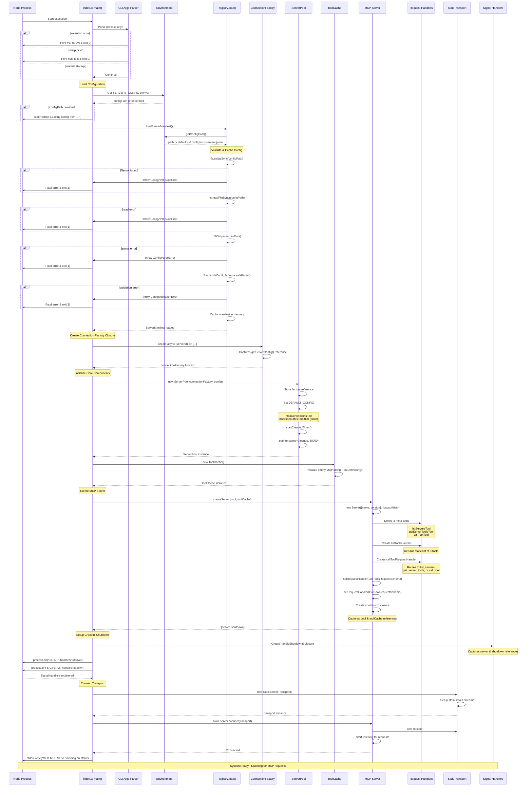

---

## Initialization Dependency Graph

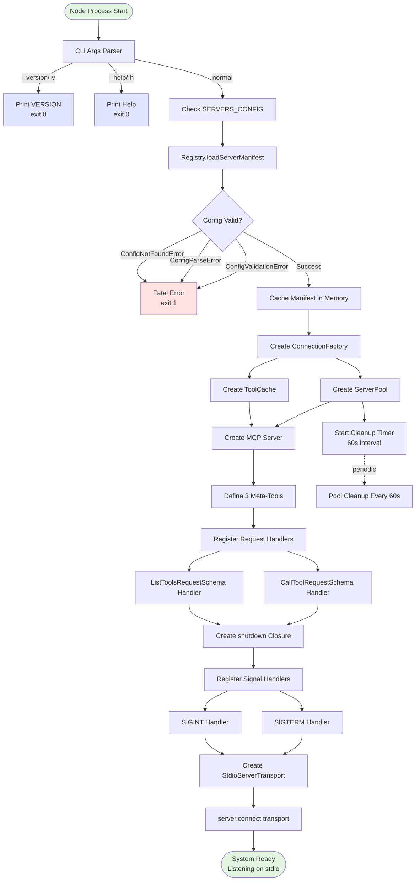

---

## Configuration Loading Flow

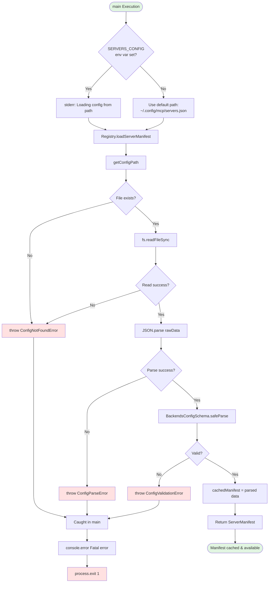

### Configuration Schema

```mermaid
graph LR
    Config[servers.json] --> Root{mcpServers}

    Root --> Server1[server_name_1]
    Root --> Server2[server_name_2]
    Root --> ServerN[server_name_N]

    Server1 --> Type1[type: 'stdio' optional]
    Server1 --> Cmd1[command: string]
    Server1 --> Args1[args: string[] optional]
    Server1 --> Env1[env: Record string optional]
    Server1 --> Disabled1[disabled: boolean optional]
    Server1 --> Desc1[description: string optional]
    Server1 --> Tags1[tags: string[] optional]

    style Config fill:#ffe1b3
    style Root fill:#b3d9ff
```

---

## Error Boundaries and Recovery

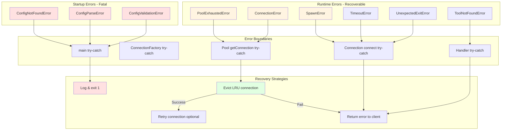

### Error Flow Details

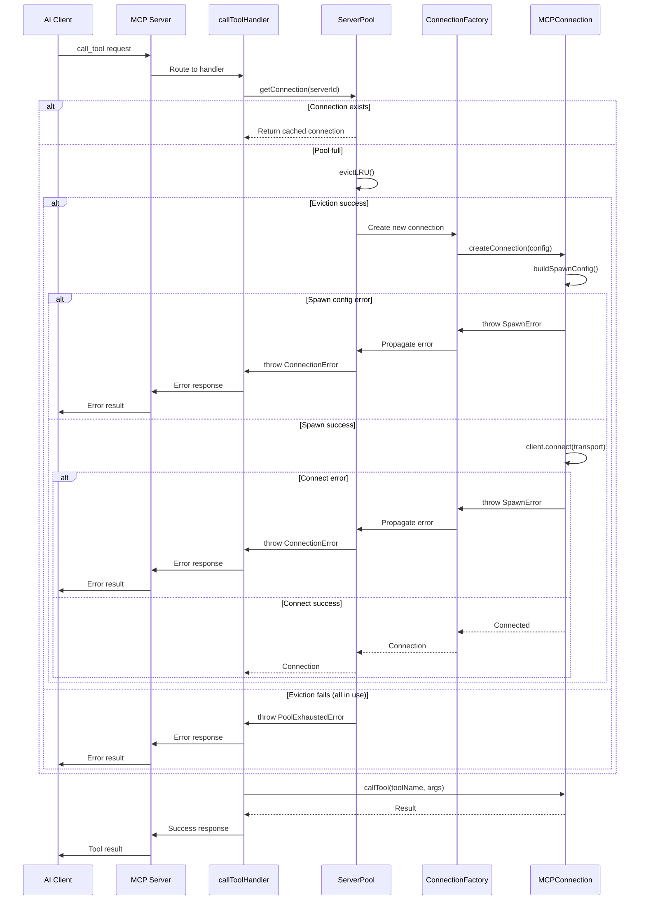

---

## Runtime Request Flow

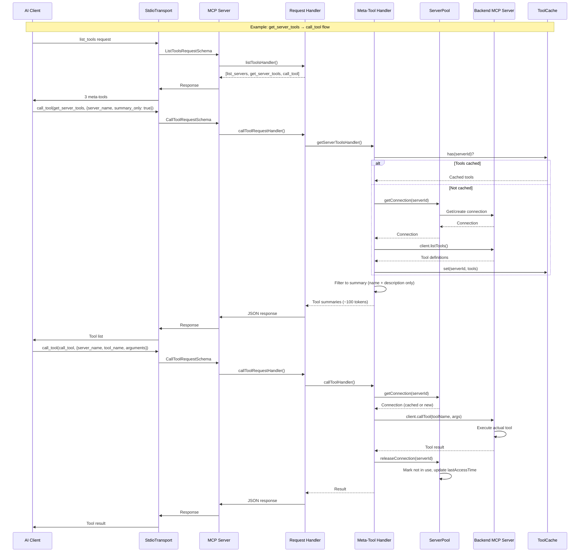

---

## Graceful Shutdown Sequence

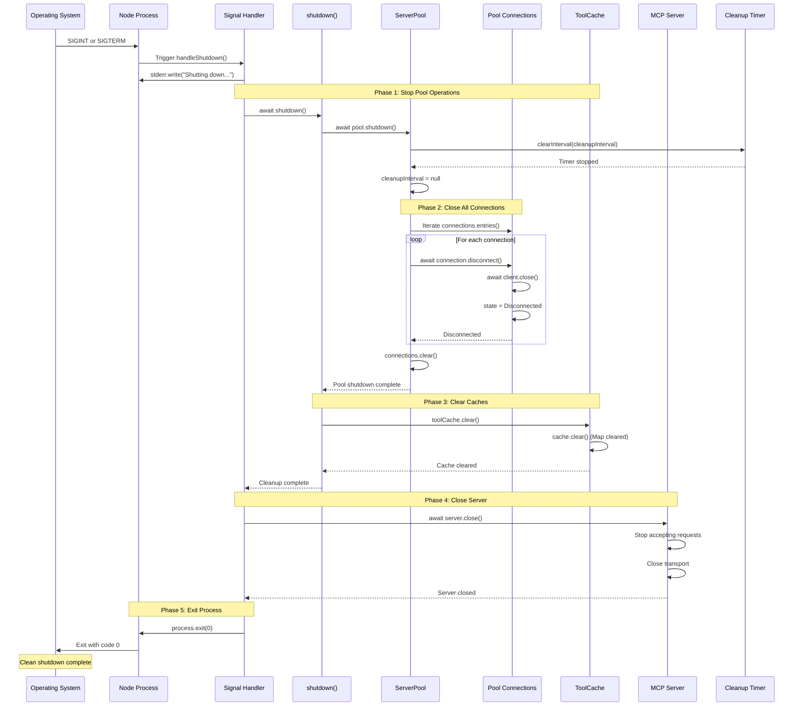

---

## Cleanup Sequence Order

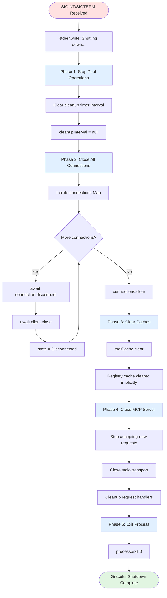

### Critical Cleanup Ordering

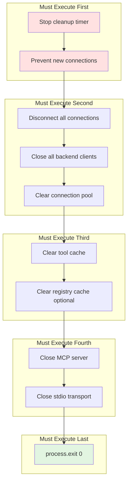

---

## Signal Handling Flow

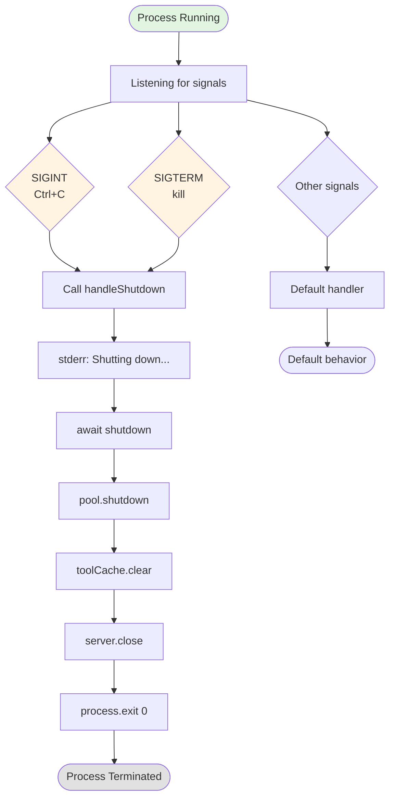

### Signal Handler Registration

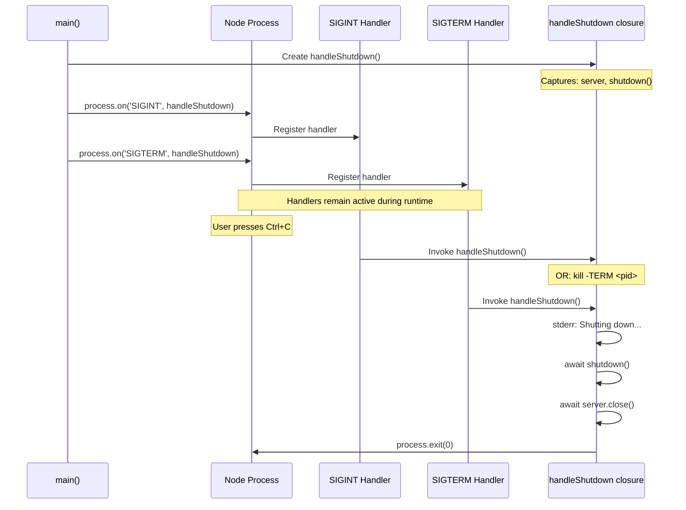

---

## Configuration Sources

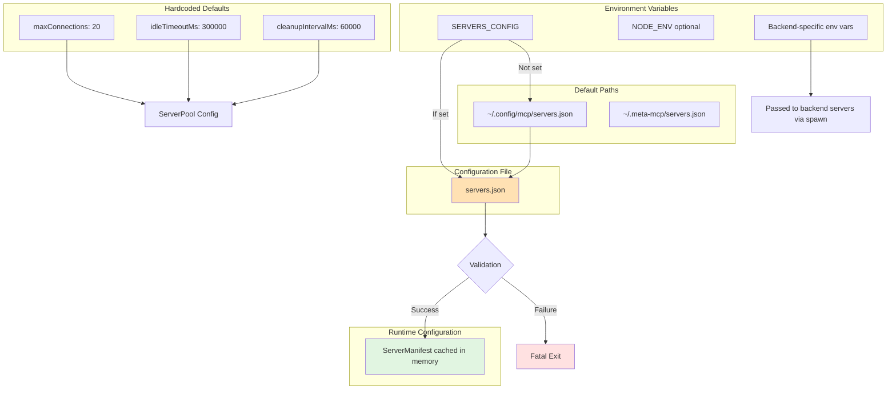

### Configuration Priority

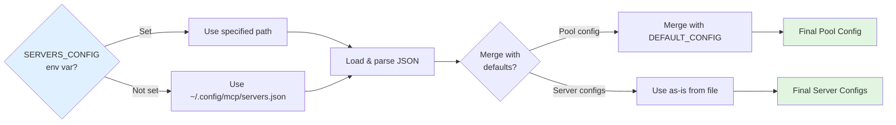

---

## Complete System State Machine

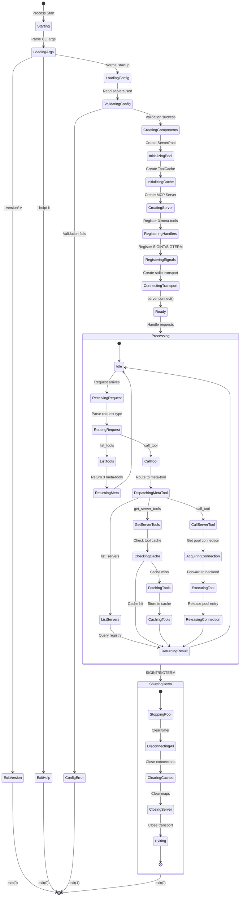

---

## Background Processes

```mermaid
gantt
    title Background Operations Timeline
    dateFormat X
    axisFormat %S

    section Main Process
    Process Start           :milestone, 0, 0s
    Initialize Components   :active, 0, 2
    Ready & Listening       :active, 2, 60
    Shutdown                :crit, 60, 62
    Process Exit            :milestone, 62, 62s

    section Pool Cleanup
    Start Cleanup Timer     :milestone, 1, 1s
    Idle                    :60s, 1, 60
    First Cleanup           :milestone, 60, 60s
    Second Cleanup          :milestone, 120, 120s

    section Connections
    Connection 1 Created    :milestone, 5, 5s
    Conn 1 Active           :active, 5, 15
    Conn 1 Idle             :15, 310

    Connection 2 Created    :milestone, 10, 10s
    Conn 2 Active           :active, 10, 20
    Conn 2 Idle             :20, 320

    section Cleanup Events
    Check Idle Timeouts     :60, 61
    Check Idle Timeouts     :120, 121
    Evict Expired           :crit, 310, 311
```

---

## Summary

This document provides a complete view of Meta-MCP Server's lifecycle:

1. **Startup**: CLI parsing → Config loading → Component initialization → Signal registration → Transport connection
2. **Runtime**: Request routing → Pool management → Background cleanup → Tool caching
3. **Shutdown**: Signal handling → Pool cleanup → Cache clearing → Server closure → Graceful exit

### Key Characteristics

- **Lazy Loading**: Servers only spawn when first requested
- **Resource Management**: LRU eviction with 5-minute idle timeout, periodic 60s cleanup
- **Error Isolation**: Startup errors are fatal; runtime errors return to client
- **Graceful Shutdown**: Ordered cleanup ensures no resource leaks
- **Zero Config**: Works with defaults, customizable via environment variables

### Token Optimization

- Startup cost: ~100 tokens (3 meta-tools)
- Summary query: ~100 tokens per server (names only)
- Full schema: ~2k tokens per tool (on-demand)
- Traditional approach: ~16k tokens (all tools upfront)

**Reduction: 87% fewer tokens**
