# Meta-MCP Server Architecture

## 1. System Overview

### Complete System Diagram

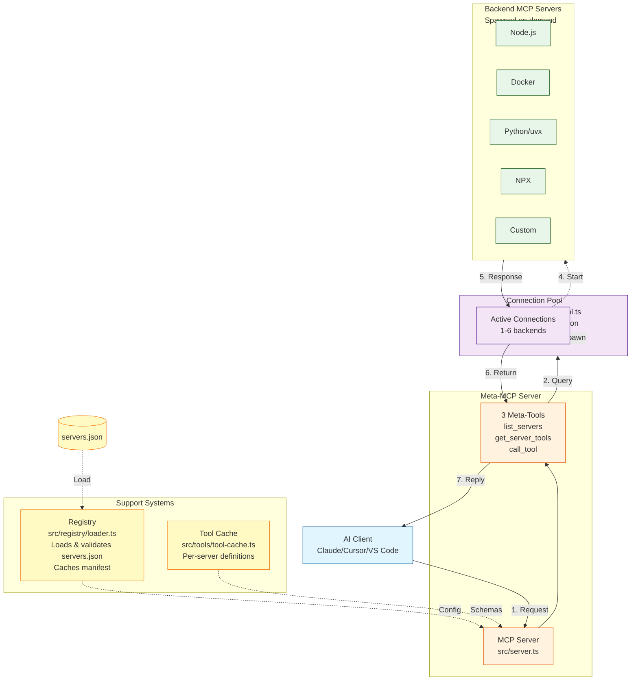

### Component List (One-Liners)

| Component | Location | Purpose |
|-----------|----------|---------|
| **MCP Server** | `src/server.ts` | Routes requests to 3 meta-tools |
| **ServerPool** | `src/pool/server-pool.ts` | Manages up to 20 backend connections with LRU eviction |
| **Connection** | `src/pool/connection.ts` | Spawns and manages individual backend processes |
| **Registry** | `src/registry/loader.ts` | Loads, validates, caches servers.json manifest |
| **ToolCache** | `src/tools/tool-cache.ts` | Caches tool schemas per-server in memory |
| **Meta-Tools** | `src/tools/*.ts` | Implements list_servers, get_server_tools, call_tool |

---

## 2. Configuration & Registry

### servers.json Format

```json
{
  "mcpServers": {
    "corp-jira": {
      "command": "node",
      "args": ["/path/to/server.js"],
      "env": {"JIRA_URL": "https://...", "JIRA_TOKEN": "..."},
      "description": "JIRA integration",
      "tags": ["work", "tickets"],
      "disabled": false
    },
    "slack": {
      "command": "docker",
      "args": ["run", "-i", "--rm", "slack-mcp:latest"]
    },
    "python-server": {
      "command": "uvx",
      "args": ["package-name"]
    }
  }
}
```

### Zod Validation Schema

```typescript
const ServerConfigSchema = z.object({
  command: z.string(),                          // Required
  args: z.array(z.string()).optional(),         // Command args
  env: z.record(z.string()).optional(),         // Environment vars
  type: z.string().optional(),                  // "stdio", "docker", etc.
  disabled: z.boolean().optional(),             // Skip if true
  description: z.string().optional(),           // Human description
  tags: z.array(z.string()).optional()          // Categorization
});

const BackendsConfigSchema = z.object({
  mcpServers: z.record(ServerConfigSchema)      // Map of configs
});
```

### Manifest Loading Sequence

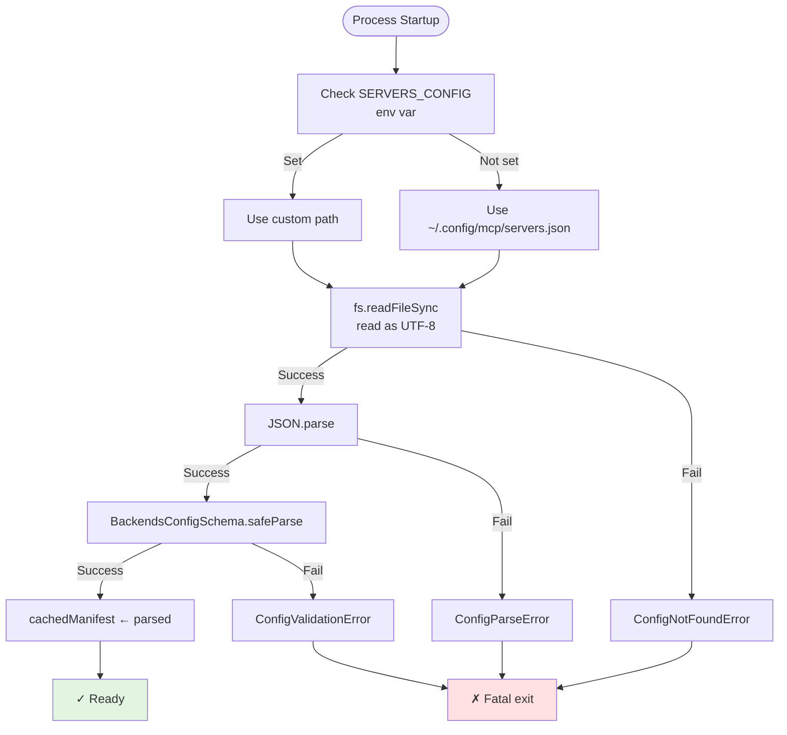

### Configuration Loading Flow

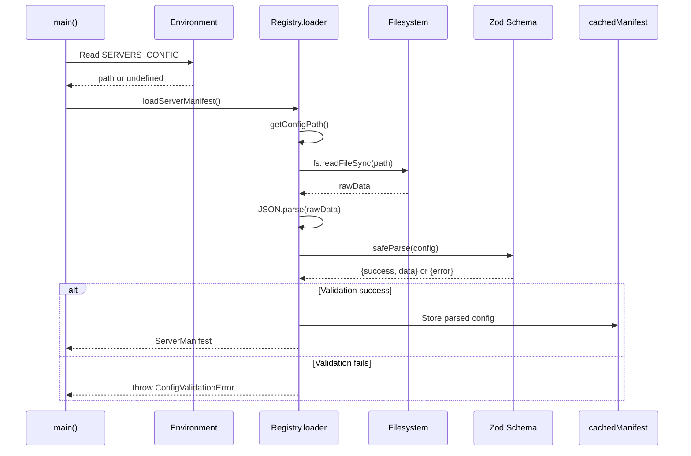

### Error Handling States

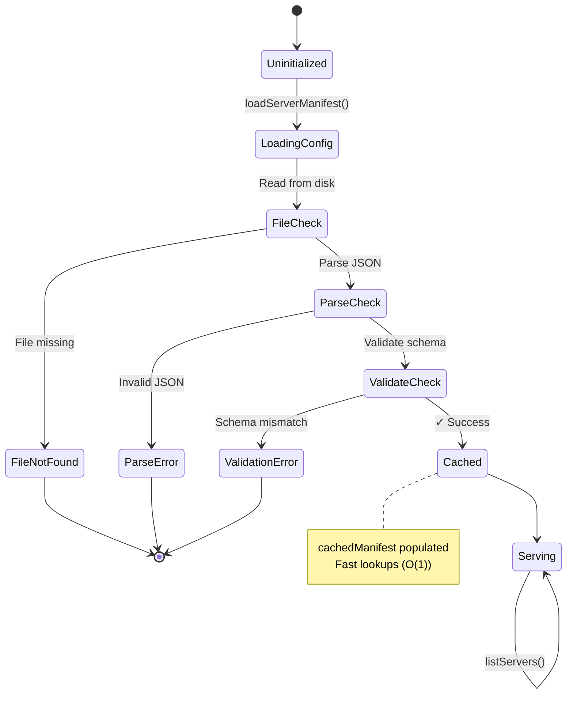

### Error Classes

| Error | Thrown By | Cause | Recovery |
|-------|-----------|-------|----------|
| `ConfigNotFoundError` | Registry | File missing, permission denied | Create config file |
| `ConfigParseError` | Registry | Invalid JSON syntax | Fix JSON syntax |
| `ConfigValidationError` | Registry | Schema mismatch, type errors | Check required fields |
| `InvalidServerError` | Pool | Server not in manifest | Use list_servers first |

---

## 3. Lifecycle

### Startup Sequence

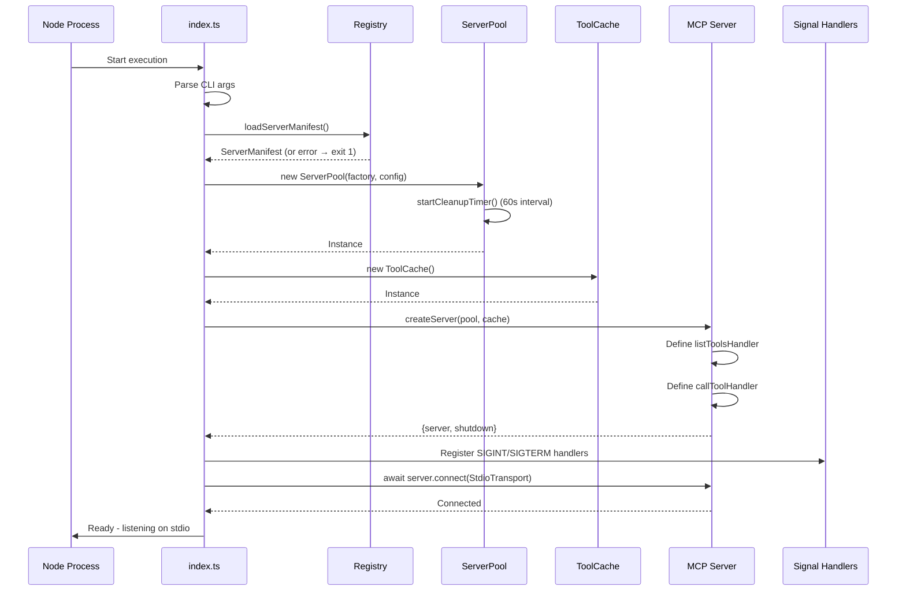

### Request Flow (Two-Tier Discovery)

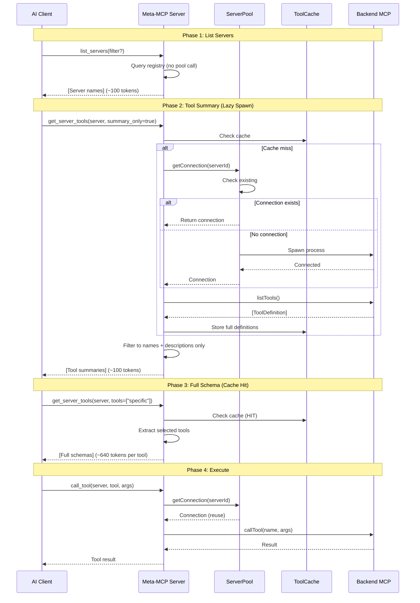

### Pool Lifecycle State Machine

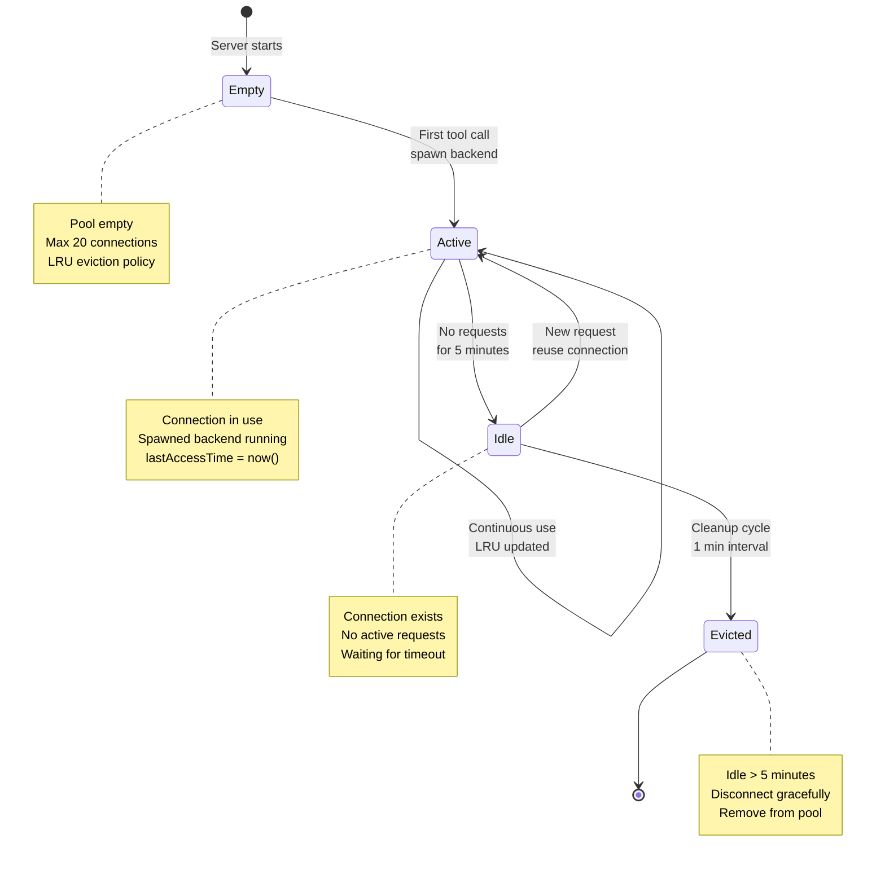

### Graceful Shutdown Sequence

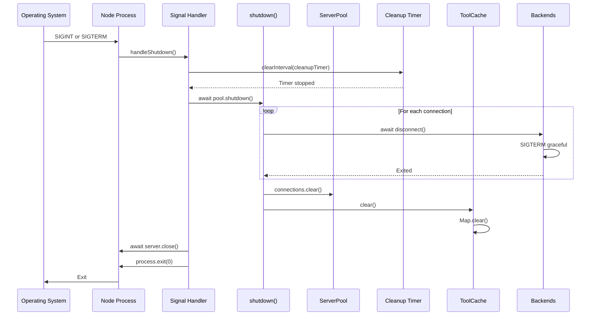

### Cleanup and Eviction Order

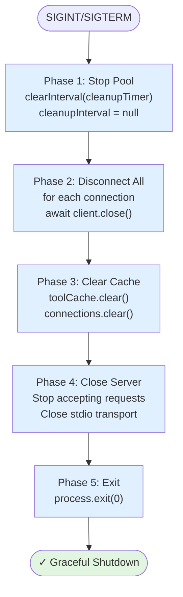

### Complete System State Machine

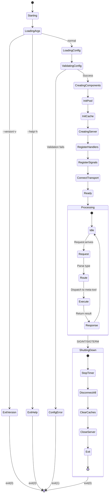

### Background Processes

```mermaid
gantt
    title Timeline: Pool Cleanup & Connections
    dateFormat X
    axisFormat %Ss

    section Pool
    Startup         :milestone, 0, 0s
    Ready           :active, 2, 60
    Shutdown        :crit, 60, 62

    section Cleanup
    Timer started   :milestone, 1, 1s
    Waiting         :60s, 1, 60
    Cleanup 1       :milestone, 60, 60s
    Cleanup 2       :milestone, 120, 120s

    section Conn1
    Created         :milestone, 5, 5s
    Active          :active, 5, 15
    Idle            :15, 310
    Evicted         :crit, 310, 311

    section Conn2
    Created         :milestone, 10, 10s
    Active          :active, 10, 20
    Idle            :20, 320
```

---

## 4. Key Metrics

### Token Consumption

```
Traditional MCP:           16,000 tokens (all 25 tools upfront)
Meta-MCP Two-Tier:          1,480 tokens (typical 2-tool workflow)
Token Reduction:            90.8%

Breakdown:
  Phase 1 (list_servers):     100 tokens
  Phase 2 (summary_only):     100 tokens
  Phase 3 (full schema):      640 tokens × N tools (on-demand)
  Phase 4 (execution):        Variable (result size)
```

### Response Times

```
list_servers:              1ms      (cached manifest)
get_server_tools (spawn):  100-500ms (backend spawn)
get_server_tools (cached): 1ms      (cache hit)
call_tool (first):         50-200ms (spawn + execute)
call_tool (reuse):         10-50ms  (execute only)

Total typical workflow:    ~250ms (vs 2-6 seconds traditional)
```

### Resource Usage (6 Backends)

```
Backend Process:    30-100 MB × 6 = 180-600 MB
Tool Cache:         50 KB × 6 = 300 KB
Connection Pool:    10 KB × 6 = 60 KB
Meta-MCP Core:      20 MB
───────────────────────────────────────────
Total:              200-620 MB (vs 600 MB traditional)
```

---

## 5. Runtime Configuration

### Environment Variables

```bash
SERVERS_CONFIG       # Path to servers.json (default: ~/.config/mcp/servers.json)
MAX_CONNECTIONS      # Max backends (default: 6, hardcoded per CLAUDE.md)
IDLE_TIMEOUT_MS      # Idle timeout (default: 300000, hardcoded per CLAUDE.md)
```

### Pool Configuration (Hardcoded)

```typescript
DEFAULT_CONFIG = {
  maxConnections: 6,           // From CLAUDE.md spec
  idleTimeoutMs: 300000,       // 5 minutes
  cleanupIntervalMs: 60000     // 1 minute
}
```

### Command Examples

```bash
# Build
npm run build

# Run tests
npx vitest run

# Run server
node dist/index.js

# Debug with logs
export DEBUG=meta-mcp:*
DEBUG=meta-mcp:* node dist/index.js
```

---

## 6. File Structure Reference

```
src/
├── index.ts                 # Entry point (startup, signal handling)
├── server.ts                # MCP server, 3 meta-tool handlers
├── pool/
│   ├── server-pool.ts       # LRU pool manager (max 20, 5min timeout)
│   └── connection.ts        # Backend spawn/connect lifecycle
├── registry/
│   ├── loader.ts            # Loads/validates servers.json via Zod
│   └── manifest.ts          # ServerManifest types
└── tools/
    ├── tool-cache.ts        # Per-server cache Map<serverId, ToolDefinition[]>
    ├── list-servers.ts      # Queries registry, filters by tag
    ├── get-server-tools.ts  # Fetches + caches schemas, summary_only filtering
    └── call-tool.ts         # Pool lookup, backend execution

tests/
├── integration/             # Real backends (Docker, Node, uvx)
├── unit/                    # Mocked pool/connections
└── *.test.ts               # Test files
```

---

## Legend

### Diagram Notation

- **Solid lines** (→): Synchronous calls or direct data flow
- **Dashed lines** (-.->): Lazy loading, async operations
- **Dotted lines** (...): Configuration relationships

### Colors

- **Blue** (#e1f5ff): AI Client layer
- **Orange** (#fff3e0): Meta-MCP Server core
- **Purple** (#f3e5f5): Connection pool
- **Green** (#e8f5e9): Backend MCP servers
- **Pink** (#fce4ec): Caching layer
- **Yellow** (#fff9c4): Configuration/registry

---

## Quick Reference

### Three Meta-Tools

```typescript
list_servers({filter?: string})
→ Returns: [{name, description, tags}]

get_server_tools({server_name, summary_only?: boolean, tools?: string[]})
→ Returns: [ToolDefinition] (full or summary)

call_tool({server_name, tool_name, arguments?: object})
→ Returns: CallToolResult
```

### Pool Defaults (From CLAUDE.md)

```
Max connections:    6
Idle timeout:       5 minutes (300000ms)
Cleanup interval:   1 minute (60000ms)
Eviction policy:    LRU (Least Recently Used)
```

### Error Recovery

```
Startup errors → Fatal (exit 1)
Runtime errors → Return to client (no crash)
Pool exhausted → Evict LRU idle connection
Backend crash → Evict from pool, next request spawns fresh
Stale cache → Manual clear or connection eviction
```

---

**Version**: 1.0
**Updated**: 2025-12-02
**Focus**: Developer-oriented, architecture-first, minimal prose
