# Core Mechanics: Consolidated Technical Reference

Ultra-dense reference consolidating ServerPool, Connection Layer, Tool Cache, and Tool System architectures.

---

## 1. ServerPool: Connection Pooling & LRU Eviction (250 lines)

### Class Structure

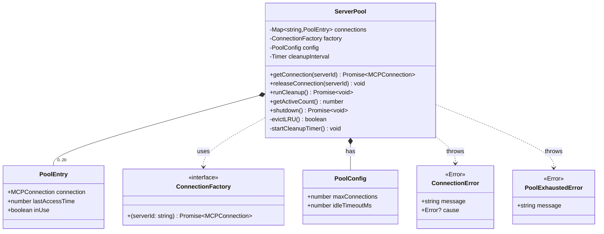
```mermaid
classDiagram
    class ServerPool {
        -Map~string,PoolEntry~ connections
        -ConnectionFactory factory
        -PoolConfig config
        -Timer cleanupInterval
        +getConnection(serverId) Promise~MCPConnection~
        +releaseConnection(serverId) void
        +runCleanup() Promise~void~
        +getActiveCount() number
        +shutdown() Promise~void~
        -evictLRU() boolean
        -startCleanupTimer() void
    }

    class PoolEntry {
        +MCPConnection connection
        +number lastAccessTime
        +boolean inUse
    }

    class PoolConfig {
        +number maxConnections
        +number idleTimeoutMs
    }

    class ConnectionFactory {
        <<interface>>
        +(serverId: string) Promise~MCPConnection~
    }

    class ConnectionError {
        <<Error>>
        +string message
        +Error? cause
    }

    class PoolExhaustedError {
        <<Error>>
        +string message
    }

    ServerPool *-- "0..20" PoolEntry
    ServerPool ..> ConnectionFactory : uses
    ServerPool *-- PoolConfig : has
    ServerPool ..> ConnectionError : throws
    ServerPool ..> PoolExhaustedError : throws
```

### DEFAULT_CONFIG & Types

```typescript
const DEFAULT_CONFIG: PoolConfig = {
  maxConnections: 20,
  idleTimeoutMs: 300000,  // 5 minutes
};

interface PoolEntry {
  connection: MCPConnection;
  lastAccessTime: number;  // Date.now()
  inUse: boolean;
}

interface PoolConfig {
  maxConnections: number;
  idleTimeoutMs: number;
}

type ConnectionFactory = (serverId: string) => Promise<MCPConnection>;
```

### LRU Eviction Algorithm (Flowchart Only)

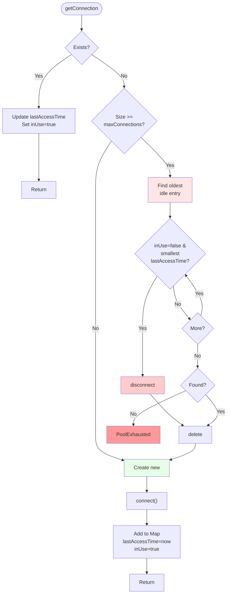
```mermaid
flowchart TD
    START([getConnection]) --> EXIST{Exists?}
    EXIST -->|Yes| UPDATE[Update lastAccessTime<br/>Set inUse=true]
    UPDATE --> RET1[Return]

    EXIST -->|No| SIZE{Size >=<br/>maxConnections?}
    SIZE -->|No| CREATE[Create new]
    SIZE -->|Yes| FIND[Find oldest<br/>idle entry]
    FIND --> FILTER{inUse=false &<br/>smallest<br/>lastAccessTime?}
    FILTER -->|Yes| DISC[disconnect]
    DISC --> DEL[delete]
    FILTER -->|No| NEXT{More?}
    NEXT -->|Yes| FILTER
    NEXT -->|No| FOUND{Found?}
    FOUND -->|No| ERR["PoolExhausted"]
    FOUND -->|Yes| DEL
    DEL --> CREATE
    CREATE --> CONNECT["connect()"]
    CONNECT --> ADD["Add to Map<br/>lastAccessTime=now<br/>inUse=true"]
    ADD --> RET2[Return]

    style FIND fill:#ffe6e6
    style DISC fill:#ffcccc
    style ERR fill:#ff9999
    style CREATE fill:#e6ffe6
```

### State Machine: PoolEntry Lifecycle

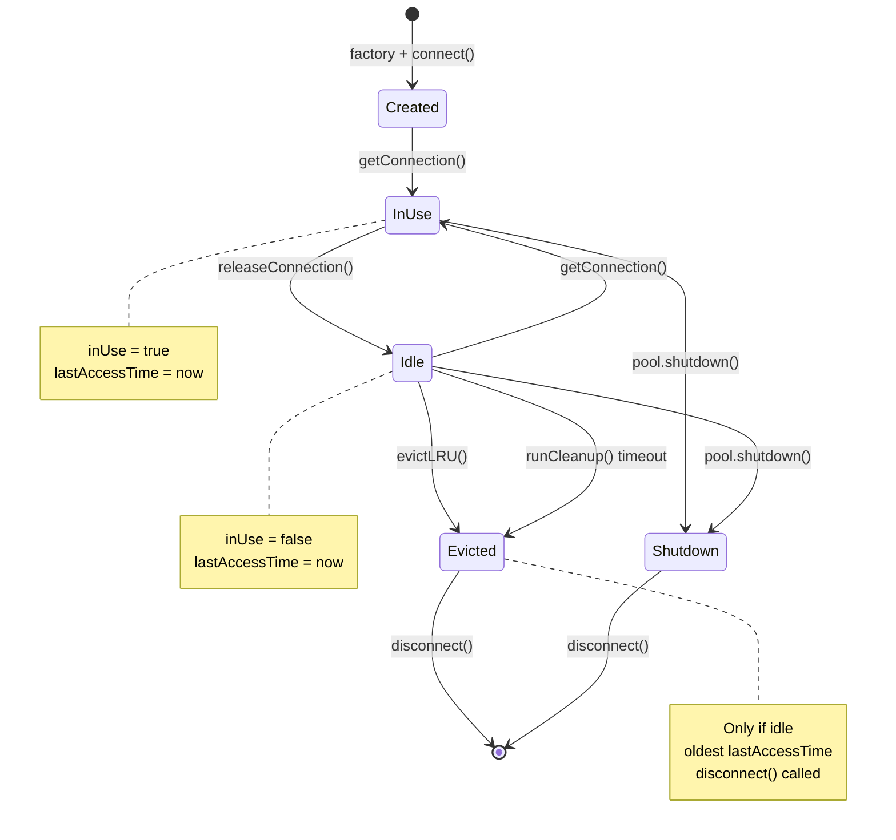
```mermaid
stateDiagram-v2
    [*] --> Created: factory + connect()
    Created --> InUse: getConnection()
    InUse --> Idle: releaseConnection()
    Idle --> InUse: getConnection()
    Idle --> Evicted: evictLRU()
    Idle --> Evicted: runCleanup() timeout
    InUse --> Shutdown: pool.shutdown()
    Idle --> Shutdown: pool.shutdown()
    Evicted --> [*]: disconnect()
    Shutdown --> [*]: disconnect()

    note right of InUse
        inUse = true
        lastAccessTime = now
    end note

    note right of Idle
        inUse = false
        lastAccessTime = now
    end note

    note right of Evicted
        Only if idle
        oldest lastAccessTime
        disconnect() called
    end note
```

### Connection Pool Operations (Sequence Diagram - All 3 Critical Flows)

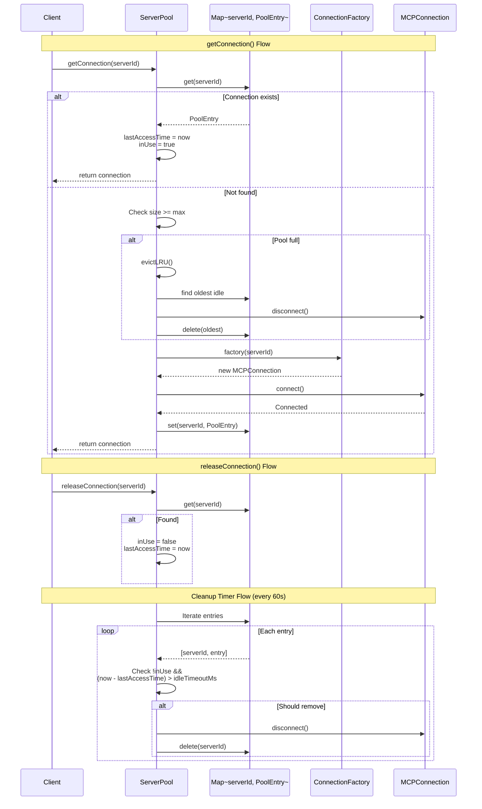
```mermaid
sequenceDiagram
    participant Client
    participant Pool as ServerPool
    participant Map as Map~serverId, PoolEntry~
    participant Factory as ConnectionFactory
    participant Conn as MCPConnection

    Note over Client,Conn: getConnection() Flow
    Client->>Pool: getConnection(serverId)
    Pool->>Map: get(serverId)
    alt Connection exists
        Map-->>Pool: PoolEntry
        Pool->>Pool: lastAccessTime = now<br/>inUse = true
        Pool-->>Client: return connection
    else Not found
        Pool->>Pool: Check size >= max
        alt Pool full
            Pool->>Pool: evictLRU()
            Pool->>Map: find oldest idle
            Pool->>Conn: disconnect()
            Pool->>Map: delete(oldest)
        end
        Pool->>Factory: factory(serverId)
        Factory-->>Pool: new MCPConnection
        Pool->>Conn: connect()
        Conn-->>Pool: Connected
        Pool->>Map: set(serverId, PoolEntry)
        Pool-->>Client: return connection
    end

    Note over Client,Conn: releaseConnection() Flow
    Client->>Pool: releaseConnection(serverId)
    Pool->>Map: get(serverId)
    alt Found
        Pool->>Pool: inUse = false<br/>lastAccessTime = now
    end

    Note over Client,Conn: Cleanup Timer Flow (every 60s)
    Pool->>Map: Iterate entries
    loop Each entry
        Map-->>Pool: [serverId, entry]
        Pool->>Pool: Check !inUse &&<br/>(now - lastAccessTime) > idleTimeoutMs
        alt Should remove
            Pool->>Conn: disconnect()
            Pool->>Map: delete(serverId)
        end
    end
```

### Configuration Parameters

| Parameter | Value | Meaning |
|-----------|-------|---------|
| `maxConnections` | 20 | Max concurrent backend connections |
| `idleTimeoutMs` | 300000 | 5 min - idle connections closed |
| `cleanupIntervalMs` | 60000 | 1 min - cleanup timer runs every 60s |

---

## 2. Connections: Lifecycle & Transport Layer (200 lines)

### Connection State Machine

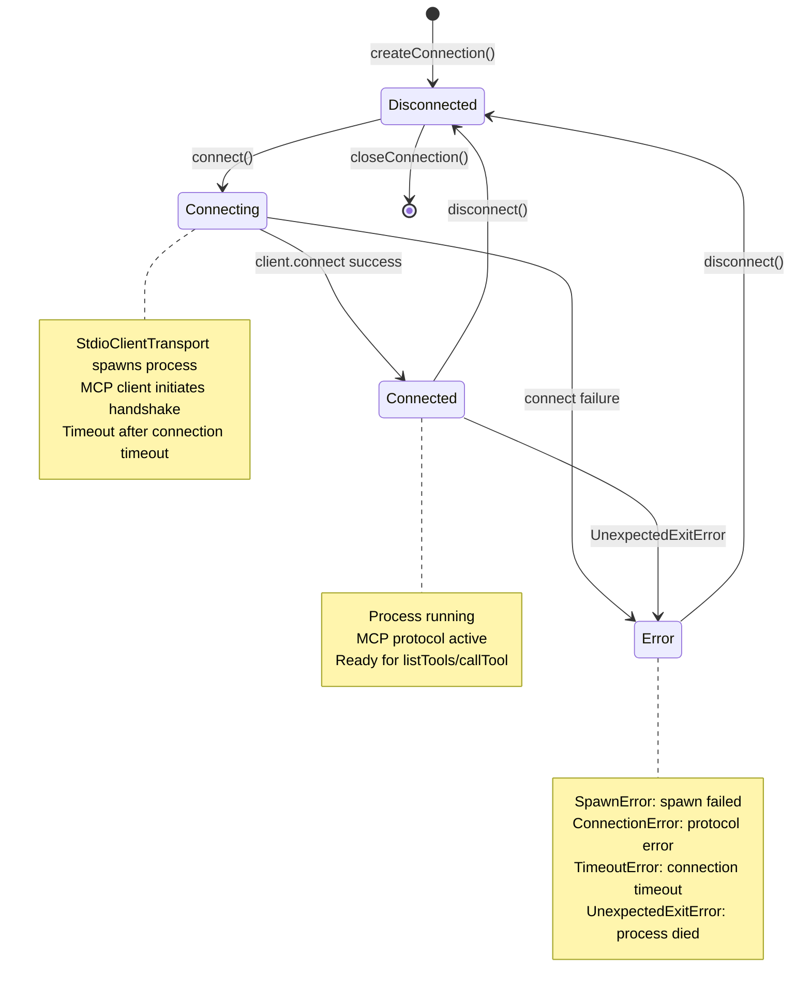
```mermaid
stateDiagram-v2
    [*] --> Disconnected: createConnection()
    Disconnected --> Connecting: connect()
    Connecting --> Connected: client.connect success
    Connecting --> Error: connect failure
    Connected --> Disconnected: disconnect()
    Connected --> Error: UnexpectedExitError
    Error --> Disconnected: disconnect()
    Disconnected --> [*]: closeConnection()

    note right of Connecting
        StdioClientTransport spawns process
        MCP client initiates handshake
        Timeout after connection timeout
    end note

    note right of Connected
        Process running
        MCP protocol active
        Ready for listTools/callTool
    end note

    note right of Error
        SpawnError: spawn failed
        ConnectionError: protocol error
        TimeoutError: connection timeout
        UnexpectedExitError: process died
    end note
```

### MCPConnection Interface & Error Types

```typescript
interface MCPConnection {
  serverId: string;
  state: ConnectionState;
  connect(): Promise<void>;
  disconnect(): Promise<void>;
  isConnected(): boolean;
  getTools(): Promise<ToolDefinition[]>;
}

enum ConnectionState {
  Disconnected = 'disconnected',
  Connecting = 'connecting',
  Connected = 'connected',
  Error = 'error',
}

class SpawnError extends Error {
  constructor(
    message: string,
    public readonly command: string,
    public readonly args: string[],
    public readonly cause?: Error
  )
}

class TimeoutError extends Error {
  constructor(message: string, public readonly timeoutMs: number)
}

class UnexpectedExitError extends Error {
  constructor(
    message: string,
    public readonly exitCode: number | null,
    public readonly signal: string | null
  )
}
```

### Transport Selection Logic

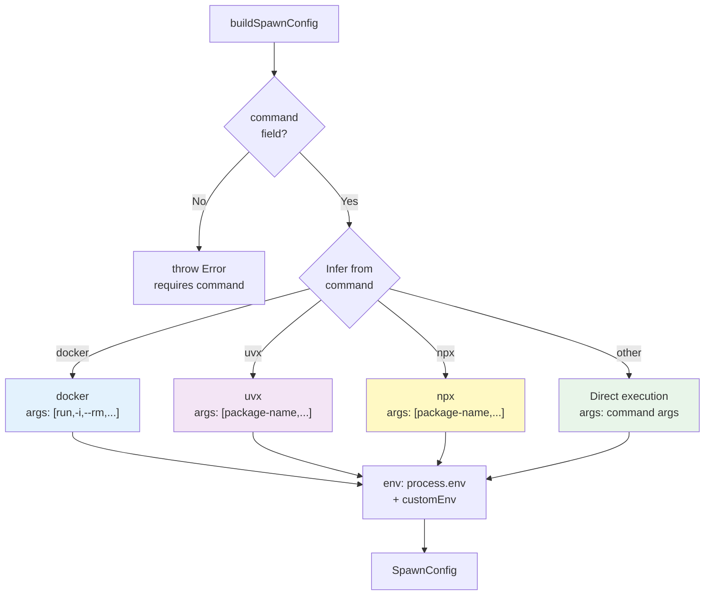
```mermaid
flowchart TD
    START[buildSpawnConfig] --> CHECK{command<br/>field?}
    CHECK -->|No| ERR["throw Error<br/>requires command"]

    CHECK -->|Yes| INFER{Infer from<br/>command}
    INFER -->|docker| D["docker<br/>args: [run,-i,--rm,...]"]
    INFER -->|uvx| U["uvx<br/>args: [package-name,...]"]
    INFER -->|npx| N["npx<br/>args: [package-name,...]"]
    INFER -->|other| DIR["Direct execution<br/>args: command args"]

    D --> ENV["env: process.env<br/>+ customEnv"]
    U --> ENV
    N --> ENV
    DIR --> ENV
    ENV --> RETURN[SpawnConfig]

    style D fill:#e3f2fd
    style U fill:#f3e5f5
    style N fill:#fff9c4
    style DIR fill:#e8f5e9
```

### Transport Examples

```typescript
// Docker
{
  command: "docker",
  args: ["run", "-i", "--rm", "mcp/filesystem"],
  env: { ...process.env, ...customEnv }
}

// uvx (Python)
{
  command: "uvx",
  args: ["mcp-server-git"],
  env: { ...process.env, ...customEnv }
}

// Node
{
  command: "node",
  args: ["/path/to/jira/dist/index.js"],
  env: { ...process.env, JIRA_API_KEY: "..." }
}

// Python
{
  command: "python",
  args: ["-m", "mcp_server_module"],
  env: { ...process.env, ...customEnv }
}
```

### Detailed Connection Sequence (Phases 1-4)

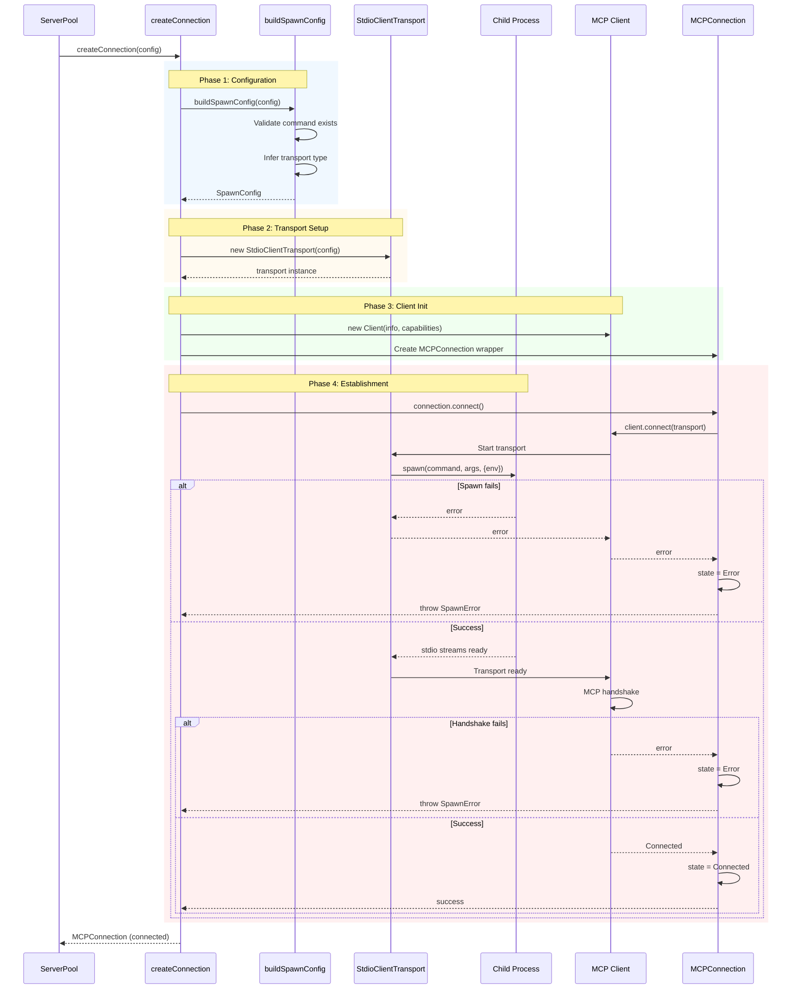
```mermaid
sequenceDiagram
    participant Pool as ServerPool
    participant Factory as createConnection
    participant Builder as buildSpawnConfig
    participant Transport as StdioClientTransport
    participant Process as Child Process
    participant Client as MCP Client
    participant Conn as MCPConnection

    Pool->>Factory: createConnection(config)

    rect rgb(240, 248, 255)
        Note over Factory,Builder: Phase 1: Configuration
        Factory->>Builder: buildSpawnConfig(config)
        Builder->>Builder: Validate command exists
        Builder->>Builder: Infer transport type
        Builder-->>Factory: SpawnConfig
    end

    rect rgb(255, 250, 240)
        Note over Factory,Transport: Phase 2: Transport Setup
        Factory->>Transport: new StdioClientTransport(config)
        Transport-->>Factory: transport instance
    end

    rect rgb(240, 255, 240)
        Note over Factory,Client: Phase 3: Client Init
        Factory->>Client: new Client(info, capabilities)
        Factory->>Conn: Create MCPConnection wrapper
    end

    rect rgb(255, 240, 240)
        Note over Factory,Process: Phase 4: Establishment
        Factory->>Conn: connection.connect()
        Conn->>Client: client.connect(transport)
        Client->>Transport: Start transport
        Transport->>Process: spawn(command, args, {env})

        alt Spawn fails
            Process-->>Transport: error
            Transport-->>Client: error
            Client-->>Conn: error
            Conn->>Conn: state = Error
            Conn-->>Factory: throw SpawnError
        else Success
            Process-->>Transport: stdio streams ready
            Transport->>Client: Transport ready
            Client->>Client: MCP handshake

            alt Handshake fails
                Client-->>Conn: error
                Conn->>Conn: state = Error
                Conn-->>Factory: throw SpawnError
            else Success
                Client-->>Conn: Connected
                Conn->>Conn: state = Connected
                Conn-->>Factory: success
            end
        end
    end

    Factory-->>Pool: MCPConnection (connected)
```

### Error Handling Architecture

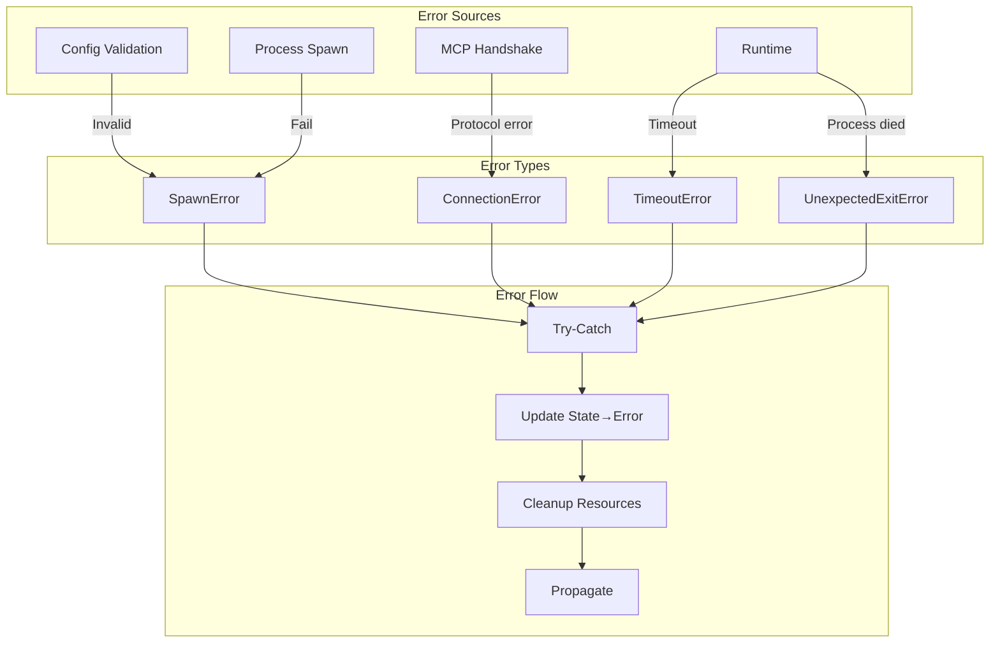
```mermaid
graph TB
    subgraph "Error Sources"
        CONFIG[Config Validation]
        SPAWN[Process Spawn]
        HANDSHAKE[MCP Handshake]
        RUNTIME[Runtime]
    end

    subgraph "Error Types"
        SE[SpawnError]
        CE[ConnectionError]
        TE[TimeoutError]
        UE[UnexpectedExitError]
    end

    subgraph "Error Flow"
        CATCH[Try-Catch]
        STATE[Update State→Error]
        CLEANUP[Cleanup Resources]
        RETHROW[Propagate]
    end

    CONFIG -->|Invalid| SE
    SPAWN -->|Fail| SE
    HANDSHAKE -->|Protocol error| CE
    RUNTIME -->|Timeout| TE
    RUNTIME -->|Process died| UE

    SE --> CATCH
    CE --> CATCH
    TE --> CATCH
    UE --> CATCH

    CATCH --> STATE
    STATE --> CLEANUP
    CLEANUP --> RETHROW
```

### Graceful Shutdown Sequence

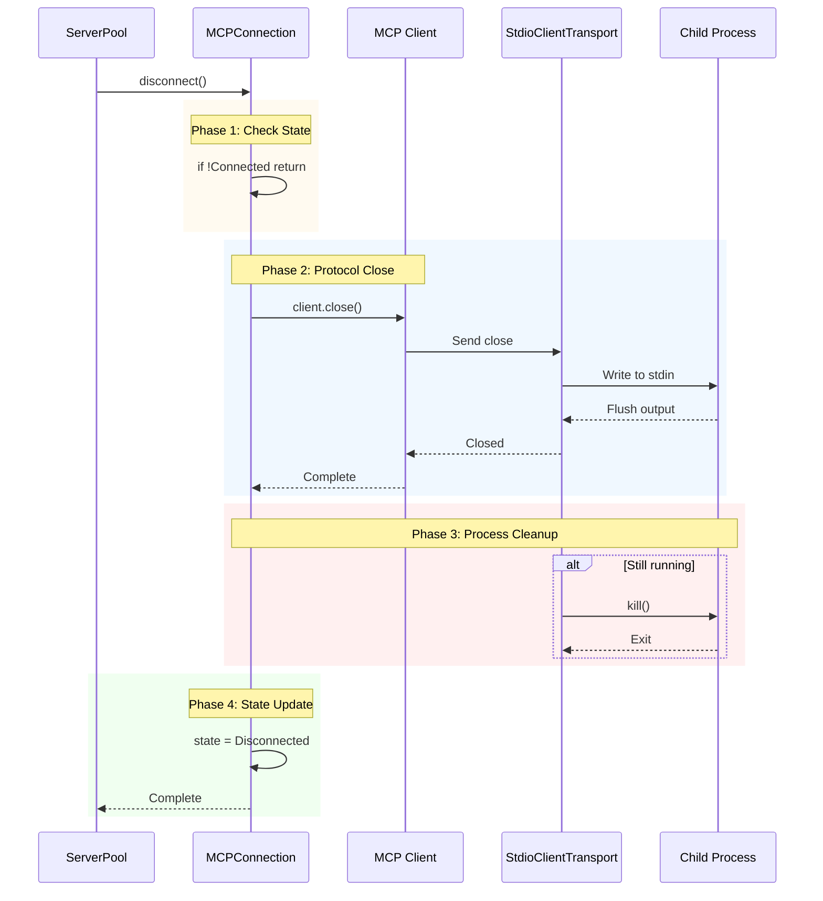
```mermaid
sequenceDiagram
    participant Pool as ServerPool
    participant Conn as MCPConnection
    participant Client as MCP Client
    participant Transport as StdioClientTransport
    participant Process as Child Process

    Pool->>Conn: disconnect()

    rect rgb(255, 250, 240)
        Note over Conn: Phase 1: Check State
        Conn->>Conn: if !Connected return
    end

    rect rgb(240, 248, 255)
        Note over Conn,Client: Phase 2: Protocol Close
        Conn->>Client: client.close()
        Client->>Transport: Send close
        Transport->>Process: Write to stdin
        Process-->>Transport: Flush output
        Transport-->>Client: Closed
        Client-->>Conn: Complete
    end

    rect rgb(255, 240, 240)
        Note over Conn,Process: Phase 3: Process Cleanup
        alt Still running
            Transport->>Process: kill()
            Process-->>Transport: Exit
        end
    end

    rect rgb(240, 255, 240)
        Note over Conn: Phase 4: State Update
        Conn->>Conn: state = Disconnected
        Conn-->>Pool: Complete
    end
```

---

## 3. Tool Cache: Structure & Lifecycle (150 lines)

### Cache Structure (Class Diagram)

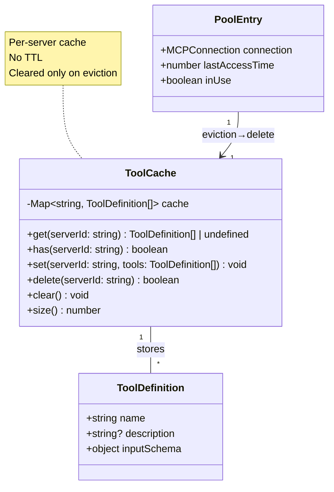
```mermaid
classDiagram
    class ToolCache {
        -Map~string, ToolDefinition[]~ cache
        +get(serverId: string) ToolDefinition[] | undefined
        +has(serverId: string) boolean
        +set(serverId: string, tools: ToolDefinition[]) void
        +delete(serverId: string) boolean
        +clear() void
        +size() number
    }

    class ToolDefinition {
        +string name
        +string? description
        +object inputSchema
    }

    class PoolEntry {
        +MCPConnection connection
        +number lastAccessTime
        +boolean inUse
    }

    ToolCache "1" -- "*" ToolDefinition : stores
    PoolEntry "1" --> "1" ToolCache : eviction→delete

    note for ToolCache "Per-server cache<br/>No TTL<br/>Cleared only on eviction"
```

### Cache Implementation

```typescript
export class ToolCache {
  private readonly cache = new Map<string, ToolDefinition[]>();

  get(serverId: string): ToolDefinition[] | undefined {
    return this.cache.get(serverId);
  }

  has(serverId: string): boolean {
    return this.cache.has(serverId);
  }

  set(serverId: string, tools: ToolDefinition[]): void {
    this.cache.set(serverId, tools);
  }

  delete(serverId: string): boolean {
    return this.cache.delete(serverId);
  }

  clear(): void {
    this.cache.clear();
  }

  size(): number {
    return this.cache.size;
  }
}
```

### Hit/Miss Flow (Single Flowchart)

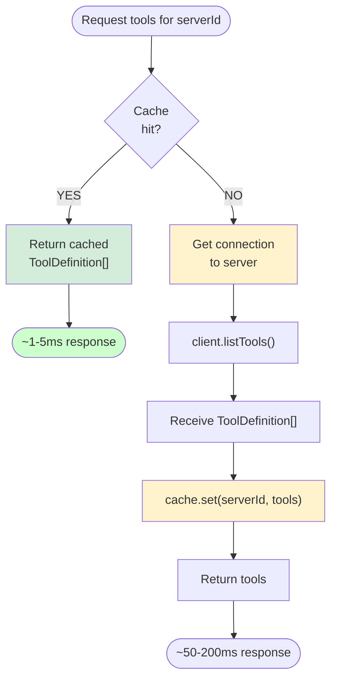
```mermaid
flowchart TD
    START([Request tools for serverId]) --> CHECK{Cache<br/>hit?}

    CHECK -->|YES| RET1["Return cached<br/>ToolDefinition[]"]
    RET1 --> END([~1-5ms response])

    CHECK -->|NO| GET["Get connection<br/>to server"]
    GET --> CALL["client.listTools()"]
    CALL --> REC["Receive ToolDefinition[]"]
    REC --> STORE["cache.set(serverId, tools)"]
    STORE --> RET2["Return tools"]
    RET2 --> END2([~50-200ms response])

    style RET1 fill:#d4edda
    style END fill:#ccffcc
    style GET fill:#fff3cd
    style STORE fill:#fff3cd
```

### Cache Lifecycle State Machine

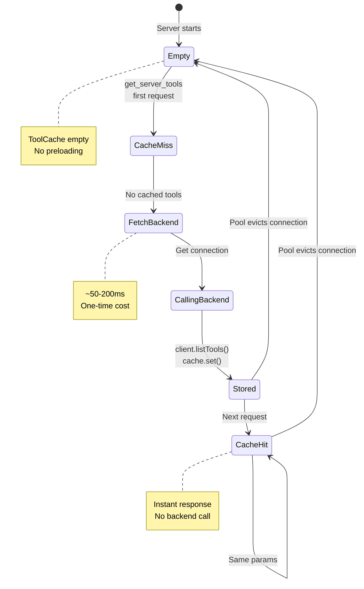
```mermaid
stateDiagram-v2
    [*] --> Empty: Server starts
    Empty --> CacheMiss: get_server_tools<br/>first request
    CacheMiss --> FetchBackend: No cached tools
    FetchBackend --> CallingBackend: Get connection
    CallingBackend --> Stored: client.listTools()<br/>cache.set()
    Stored --> CacheHit: Next request
    CacheHit --> CacheHit: Same params
    Stored --> Empty: Pool evicts connection
    CacheHit --> Empty: Pool evicts connection

    note right of CacheHit
        Instant response
        No backend call
    end note

    note right of FetchBackend
        ~50-200ms
        One-time cost
    end note

    note right of Empty
        ToolCache empty
        No preloading
    end note
```

### Cache Invalidation (Eviction Trigger)

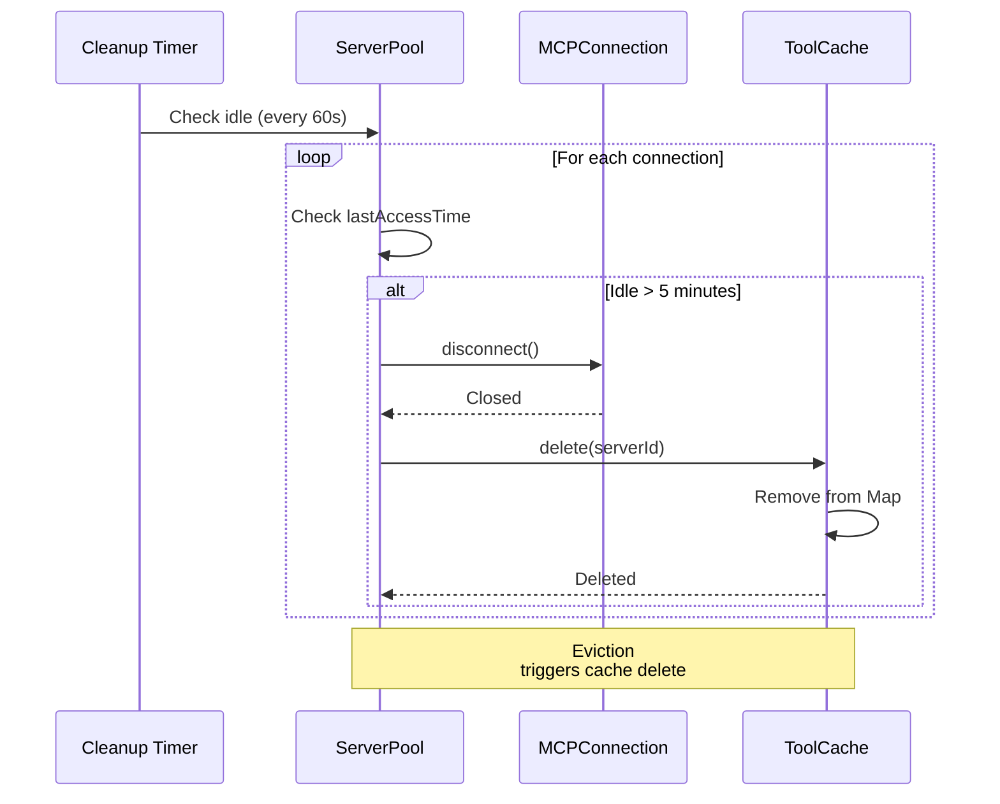
```mermaid
sequenceDiagram
    participant Timer as Cleanup Timer
    participant Pool as ServerPool
    participant Conn as MCPConnection
    participant Cache as ToolCache

    Timer->>Pool: Check idle (every 60s)

    loop For each connection
        Pool->>Pool: Check lastAccessTime
        alt Idle > 5 minutes
            Pool->>Conn: disconnect()
            Conn-->>Pool: Closed
            Pool->>Cache: delete(serverId)
            Cache->>Cache: Remove from Map
            Cache-->>Pool: Deleted
        end
    end

    Note over Pool,Cache: Eviction<br/>triggers cache delete
```

---

## 4. Tool System: Three Handler Architecture (200 lines)

### Three Handlers Overview

```mermaid
graph TB
    subgraph "Meta-MCP Server"
        subgraph "Handlers"
            LS["listServersHandler"]
            GST["getServerToolsHandler"]
            CT["callToolHandler"]
        end

        subgraph "Support"
            REG["Registry Loader"]
            CACHE["ToolCache"]
            POOL["ServerPool"]
        end
    end

    subgraph "Data Flow"
        AI["AI Client"]
        BS["Backend Servers"]
    end

    AI -->|1. list_servers| LS
    LS -->|Load manifest| REG
    LS -->|Server[]| AI

    AI -->|2. get_server_tools| GST
    GST -->|Validate| GST
    GST -->|Check| CACHE
    GST -->|Get conn| POOL
    POOL -->|listTools| BS
    GST -->|Return| AI

    AI -->|3. call_tool| CT
    CT -->|Validate| CT
    CT -->|Get conn| POOL
    POOL -->|callTool| BS
    CT -->|Return| AI

    POOL -.->|eviction| CACHE
```

### Handler 1: listServersHandler() - Server Discovery

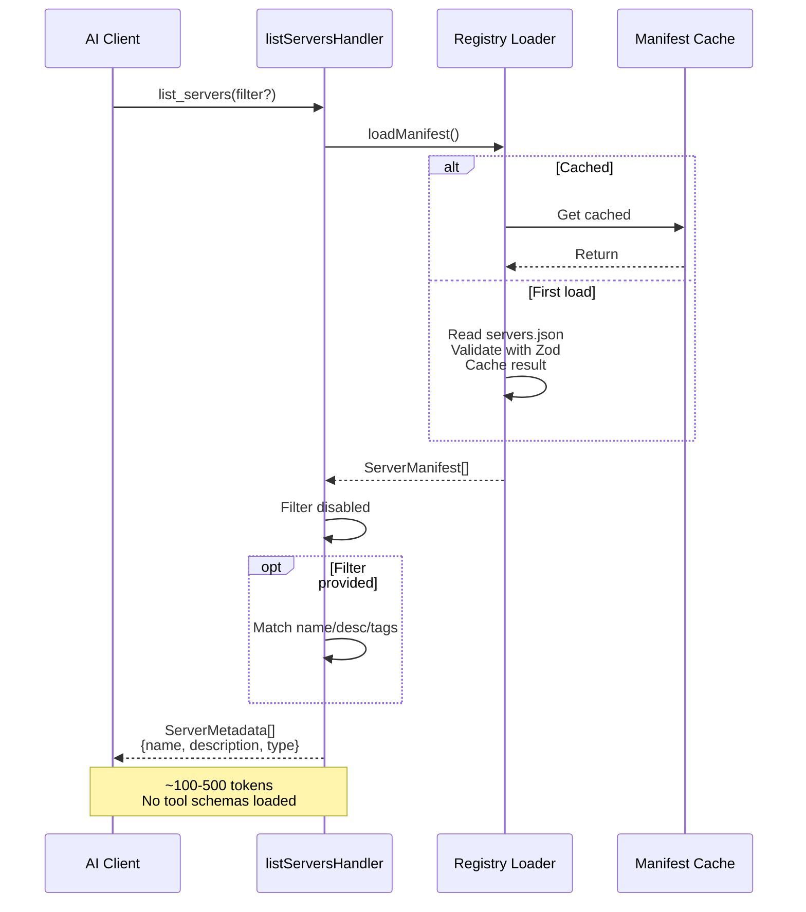
```mermaid
sequenceDiagram
    participant AI as AI Client
    participant Handler as listServersHandler
    participant Registry as Registry Loader
    participant Cache as Manifest Cache

    AI->>Handler: list_servers(filter?)
    Handler->>Registry: loadManifest()

    alt Cached
        Registry->>Cache: Get cached
        Cache-->>Registry: Return
    else First load
        Registry->>Registry: Read servers.json<br/>Validate with Zod<br/>Cache result
    end

    Registry-->>Handler: ServerManifest[]
    Handler->>Handler: Filter disabled
    opt Filter provided
        Handler->>Handler: Match name/desc/tags
    end
    Handler-->>AI: ServerMetadata[]<br/>{name, description, type}

    Note over AI,Handler: ~100-500 tokens<br/>No tool schemas loaded
```

### Handler 2: getServerToolsHandler() - Tool Discovery & Caching

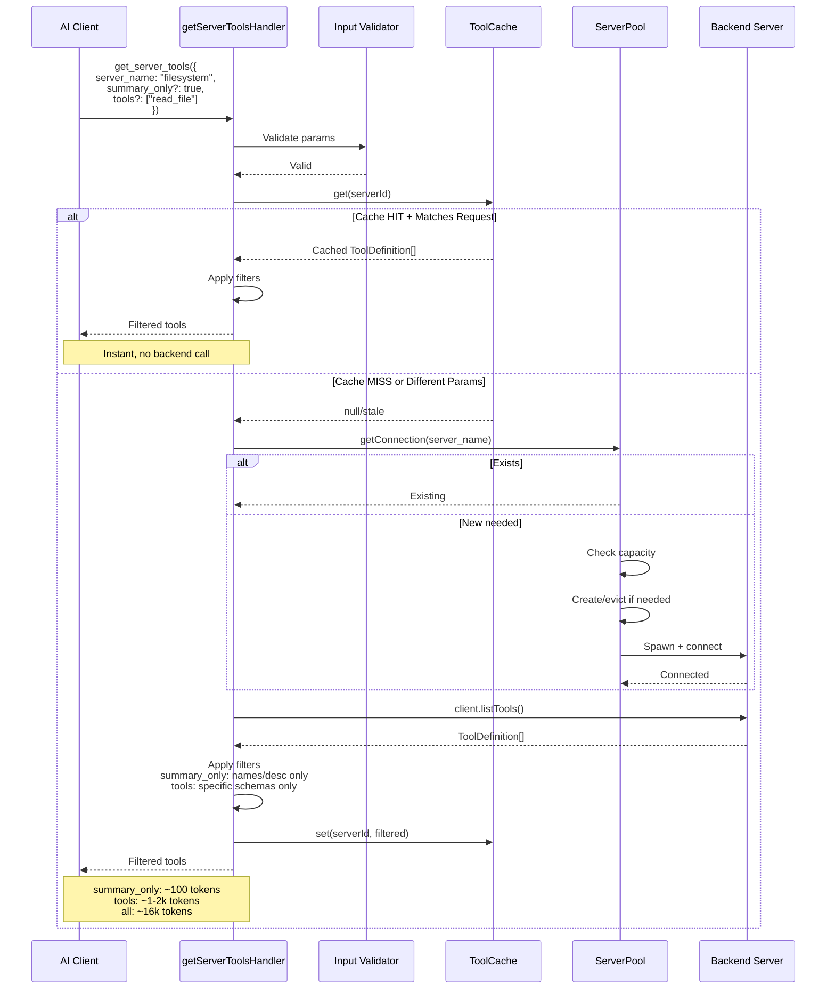
```mermaid
sequenceDiagram
    participant AI as AI Client
    participant Handler as getServerToolsHandler
    participant Validator as Input Validator
    participant Cache as ToolCache
    participant Pool as ServerPool
    participant Backend as Backend Server

    AI->>Handler: get_server_tools({<br/>  server_name: "filesystem",<br/>  summary_only?: true,<br/>  tools?: ["read_file"]<br/>})

    Handler->>Validator: Validate params
    Validator-->>Handler: Valid

    Handler->>Cache: get(serverId)

    alt Cache HIT + Matches Request
        Cache-->>Handler: Cached ToolDefinition[]
        Handler->>Handler: Apply filters
        Handler-->>AI: Filtered tools
        Note over AI,Handler: Instant, no backend call
    else Cache MISS or Different Params
        Cache-->>Handler: null/stale
        Handler->>Pool: getConnection(server_name)

        alt Exists
            Pool-->>Handler: Existing
        else New needed
            Pool->>Pool: Check capacity
            Pool->>Pool: Create/evict if needed
            Pool->>Backend: Spawn + connect
            Backend-->>Pool: Connected
        end

        Handler->>Backend: client.listTools()
        Backend-->>Handler: ToolDefinition[]

        Handler->>Handler: Apply filters<br/>summary_only: names/desc only<br/>tools: specific schemas only

        Handler->>Cache: set(serverId, filtered)
        Handler-->>AI: Filtered tools

        Note over AI,Handler: summary_only: ~100 tokens<br/>tools: ~1-2k tokens<br/>all: ~16k tokens
    end
```

### Handler 3: callToolHandler() - Tool Execution

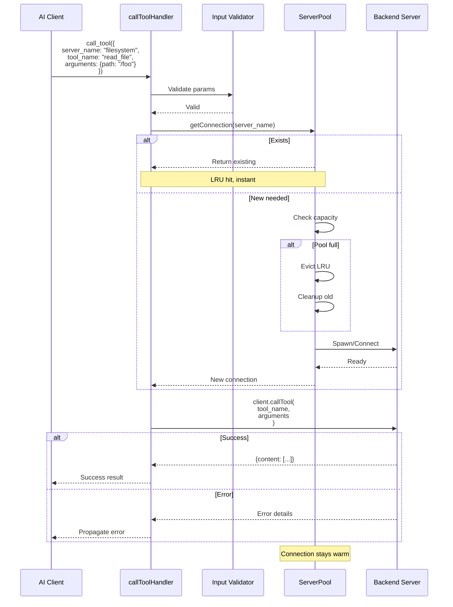
```mermaid
sequenceDiagram
    participant AI as AI Client
    participant Handler as callToolHandler
    participant Validator as Input Validator
    participant Pool as ServerPool
    participant Backend as Backend Server

    AI->>Handler: call_tool({<br/>  server_name: "filesystem",<br/>  tool_name: "read_file",<br/>  arguments: {path: "/foo"}<br/>})

    Handler->>Validator: Validate params
    Validator-->>Handler: Valid

    Handler->>Pool: getConnection(server_name)

    alt Exists
        Pool-->>Handler: Return existing
        Note over Pool,Handler: LRU hit, instant
    else New needed
        Pool->>Pool: Check capacity
        alt Pool full
            Pool->>Pool: Evict LRU
            Pool->>Pool: Cleanup old
        end
        Pool->>Backend: Spawn/Connect
        Backend-->>Pool: Ready
        Pool-->>Handler: New connection
    end

    Handler->>Backend: client.callTool(<br/>  tool_name,<br/>  arguments<br/>)

    alt Success
        Backend-->>Handler: {content: [...]}
        Handler-->>AI: Success result
    else Error
        Backend-->>Handler: Error details
        Handler-->>AI: Propagate error
    end

    Note over Pool: Connection stays warm
```

### Zod Input Validation Schemas

```typescript
// Handler 1: list_servers
const ListServersInputSchema = z.object({
  filter: z.string().optional(),
});

// Handler 2: get_server_tools
const GetServerToolsInputSchema = z.object({
  server_name: z.string(),
  summary_only: z.boolean().optional(),
  tools: z.array(z.string()).optional(),
});

// Handler 3: call_tool
const CallToolInputSchema = z.object({
  server_name: z.string(),
  tool_name: z.string(),
  arguments: z.record(z.unknown()).optional().default({}),
});
```

### Filtering Logic: summary_only & tools Array

```typescript
function filterTools(
  tools: ToolDefinition[],
  summaryOnly?: boolean,
  toolNames?: string[]
): ToolDefinition[] | ToolSummary[] {
  let filtered = tools;

  // Filter by tool names if specified
  if (toolNames && toolNames.length > 0) {
    filtered = tools.filter((t) => toolNames.includes(t.name));
  }

  // Return summaries only if requested
  if (summaryOnly) {
    return filtered.map((t) => ({
      name: t.name,
      description: t.description
    }));
  }

  return filtered;
}
```

### Tool System Results (Return Types)

```typescript
// listServersHandler() result
interface ListServersResult {
  servers: ServerManifestEntry[];
  warning?: string;
}

// getServerToolsHandler() result
interface GetServerToolsResult {
  tools: ToolDefinition[] | ToolSummary[];
  server_name: string;
  cached: boolean;
}

// callToolHandler() result
type CallToolResult = {
  type: "text" | "image" | "resource" | "error";
  text?: string;
  error?: string;
  // ...MCP SDK CallToolResult shape
};

interface ToolSummary {
  name: string;
  description?: string;
}
```

### Combined Request Flow (All 3 Handlers)

```mermaid
flowchart TD
    START([Request] --> TYPE{Handler<br/>type?}

    TYPE -->|1| LS["listServersHandler"]
    LS --> LOAD["loadServerManifest"]
    LOAD --> FILTER["Filter disabled<br/>Apply filter param"]
    FILTER --> RET1["Return ServerMetadata[]"]

    TYPE -->|2| GST["getServerToolsHandler"]
    GST --> VAL["Validate inputs"]
    VAL --> CHK{Cache<br/>hit?}
    CHK -->|Yes| RET2["Return filtered"]
    CHK -->|No| GCONN["getConnection"]
    GCONN --> LIST["client.listTools()"]
    LIST --> FIL["Apply summary_only<br/>& tools filters"]
    FIL --> STORE["cache.set()"]
    STORE --> RET2

    TYPE -->|3| CT["callToolHandler"]
    CT --> VAL2["Validate inputs"]
    VAL2 --> GCONN2["getConnection"]
    GCONN2 --> CALL["client.callTool()"]
    CALL --> CHK2{Success?}
    CHK2 -->|Yes| RET3["Return result"]
    CHK2 -->|No| RET4["Propagate error"]

    RET1 --> END([Response to AI])
    RET2 --> END
    RET3 --> END
    RET4 --> END
```

---

## 5. Integration Points & Lifecycle Example (100 lines)

### Pool Eviction Triggers Cache Cleanup

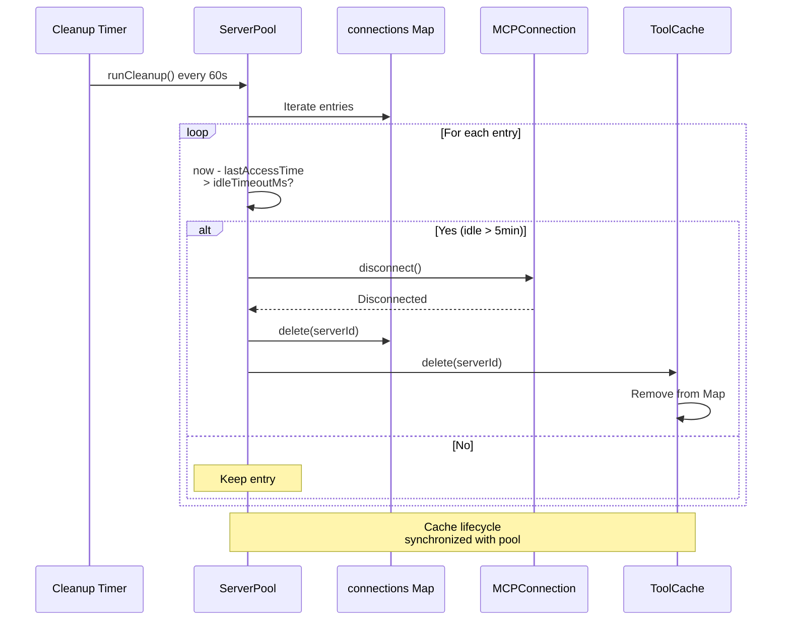
```mermaid
sequenceDiagram
    participant Timer as Cleanup Timer
    participant Pool as ServerPool
    participant Map as connections Map
    participant Conn as MCPConnection
    participant Cache as ToolCache

    Timer->>Pool: runCleanup() every 60s
    Pool->>Map: Iterate entries

    loop For each entry
        Pool->>Pool: now - lastAccessTime<br/>> idleTimeoutMs?

        alt Yes (idle > 5min)
            Pool->>Conn: disconnect()
            Conn-->>Pool: Disconnected
            Pool->>Map: delete(serverId)
            Pool->>Cache: delete(serverId)
            Cache->>Cache: Remove from Map
        else No
            Note over Pool: Keep entry
        end
    end

    Note over Pool,Cache: Cache lifecycle<br/>synchronized with pool
```

### Complete Request Lifecycle Example

```
1. AI calls list_servers()
   → listServersHandler loads manifest
   → Returns server names (~200 tokens)

2. AI calls get_server_tools({server_name: "filesystem", summary_only: true})
   → Cache MISS: calls pool.getConnection("filesystem")
   → Pool creates new connection (spawn + connect)
   → Calls client.listTools()
   → Filters to names/descriptions only
   → Stores in cache
   → Returns (~100 tokens)

3. AI calls get_server_tools({server_name: "filesystem", tools: ["read_file"]})
   → Cache HIT but different params
   → Calls backend again for full schemas
   → Filters to read_file only
   → Updates cache
   → Returns (~500 tokens)

4. AI calls call_tool({server_name: "filesystem", tool_name: "read_file", args: {path: "/data.txt"}})
   → pool.getConnection("filesystem") - connection exists
   → Returns existing (warm) connection
   → Calls client.callTool("read_file", {path: "/data.txt"})
   → Executes, returns result
   → Connection stays in pool (marked idle)

5. 6 minutes pass with no requests
   → Cleanup timer fires every 60s
   → Checks lastAccessTime
   → Detects idle > 5 minutes
   → Calls connection.disconnect()
   → Deletes from pool
   → Calls cache.delete("filesystem")
   → Cache cleared
```

### Error Propagation Flow

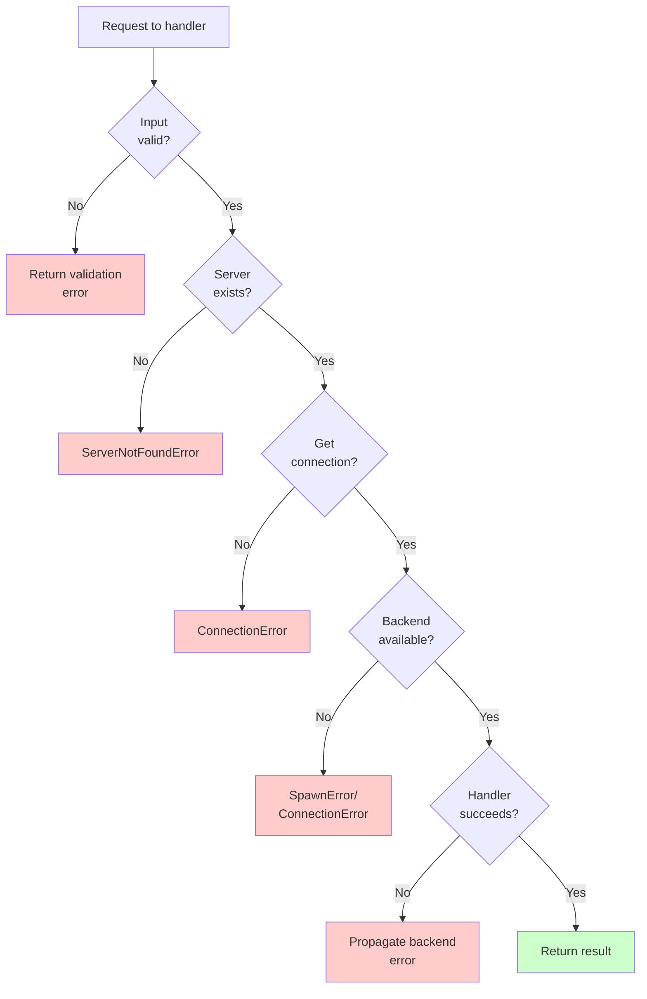
```mermaid
flowchart TD
    A[Request to handler] --> B{Input<br/>valid?}
    B -->|No| C["Return validation<br/>error"]
    B -->|Yes| D{Server<br/>exists?}
    D -->|No| E["ServerNotFoundError"]
    D -->|Yes| F{Get<br/>connection?}
    F -->|No| G["ConnectionError"]
    F -->|Yes| H{Backend<br/>available?}
    H -->|No| I["SpawnError/<br/>ConnectionError"]
    H -->|Yes| J{Handler<br/>succeeds?}
    J -->|No| K["Propagate backend<br/>error"]
    J -->|Yes| L["Return result"]

    style C fill:#ffcccc
    style E fill:#ffcccc
    style G fill:#ffcccc
    style I fill:#ffcccc
    style K fill:#ffcccc
    style L fill:#ccffcc
```

---

## Key Configuration & Defaults

| Component | Setting | Value | Meaning |
|-----------|---------|-------|---------|
| ServerPool | maxConnections | 20 | Max concurrent backend connections |
| ServerPool | idleTimeoutMs | 300000 | 5 minutes - idle timeout |
| ServerPool | cleanupIntervalMs | 60000 | 1 minute - cleanup interval |
| Connection | state | Enum | Disconnected, Connecting, Connected, Error |
| Transport | Supported | docker, uvx, npx, direct | Spawn config inference |
| ToolCache | Storage | Map<serverId, ToolDefinition[]> | Per-server only |
| ToolCache | TTL | None | Cleared only on pool eviction |

---

## Critical Paths & Time Complexity

### Time Complexity

| Operation | Complexity | Notes |
|-----------|-----------|-------|
| getConnection (hit) | O(1) | Map.get() + timestamp update |
| getConnection (miss, space) | O(1) | Create + Map.set() |
| getConnection (miss, full) | O(n) | Iterate for LRU (n ≤ 20) |
| releaseConnection | O(1) | Map.get() + flag update |
| runCleanup | O(n) | Iterate all entries (n ≤ 20) |
| cache.get | O(1) | Map.get() |
| cache.set | O(1) | Map.set() |
| cache.delete | O(1) | Map.delete() |

### Space Complexity

| Resource | Usage | Max |
|----------|-------|-----|
| connections Map | O(n) | 20 entries |
| ToolCache Map | O(n) | 20 entries max |
| Per PoolEntry | ~96 bytes | ~1.92 KB total |
| Per ToolDefinition | ~500-2000 bytes | ~10-40 KB per server |

---

## Implementation File References

| Component | File | Key Class/Function |
|-----------|------|-------------------|
| ServerPool | `src/pool/server-pool.ts` | `ServerPool`, `evictLRU()`, `runCleanup()` |
| Connection | `src/pool/connection.ts` | `createConnection()`, `SpawnError`, `UnexpectedExitError` |
| Transport | `src/pool/stdio-transport.ts` | `buildSpawnConfig()` |
| ToolCache | `src/tools/tool-cache.ts` | `ToolCache` |
| Handler 1 | `src/tools/list-servers.ts` | `listServersHandler()` |
| Handler 2 | `src/tools/get-server-tools.ts` | `getServerToolsHandler()`, `filterTools()` |
| Handler 3 | `src/tools/call-tool.ts` | `callToolHandler()` |
| Types | `src/types/index.ts` | `MCPConnection`, `ToolDefinition`, `ServerConfig` |
| Registry | `src/registry/loader.ts` | `loadServerManifest()`, `listServers()` |
