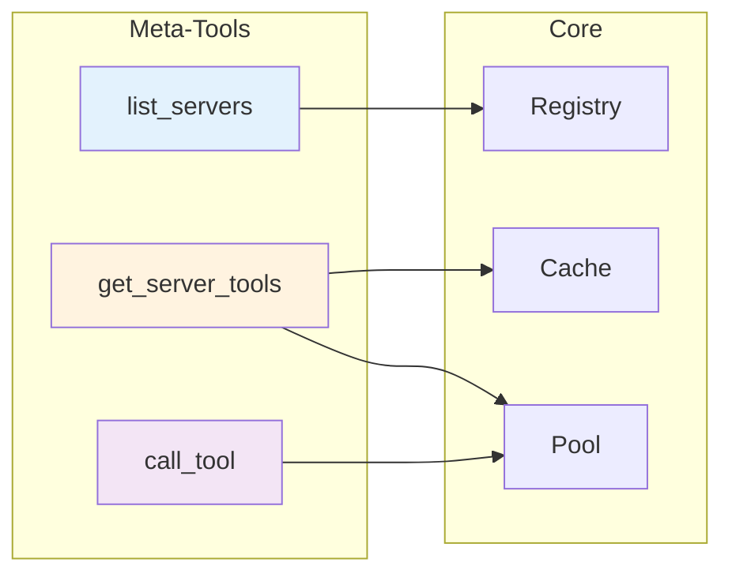
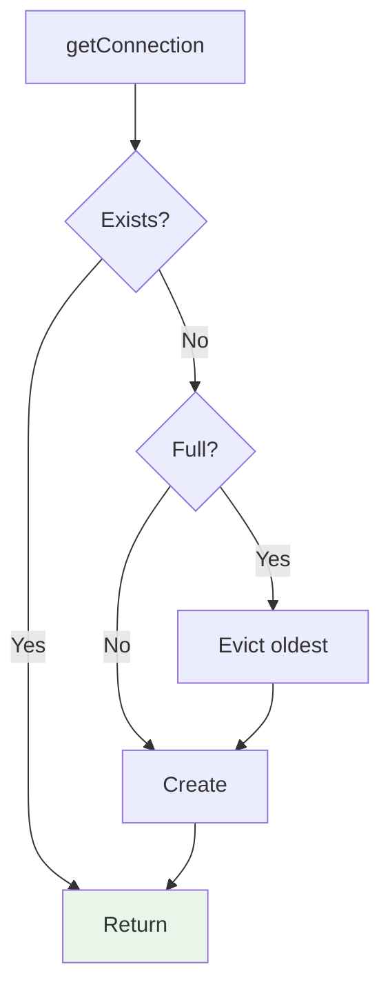
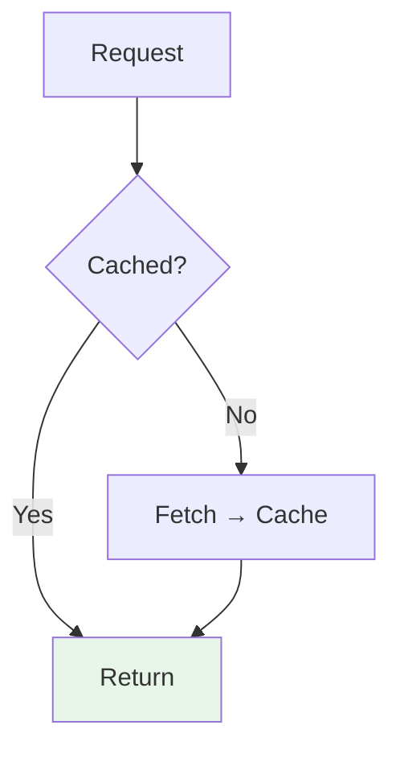

# Core Mechanics

## Handlers

## Pool (LRU)

| Setting | Value |
|---------|-------|
| maxConnections | 6 |
| idleTimeout | 5 min |
| cleanup | 1 min |

## Cache

Cleared when connection evicted.
