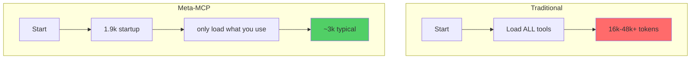
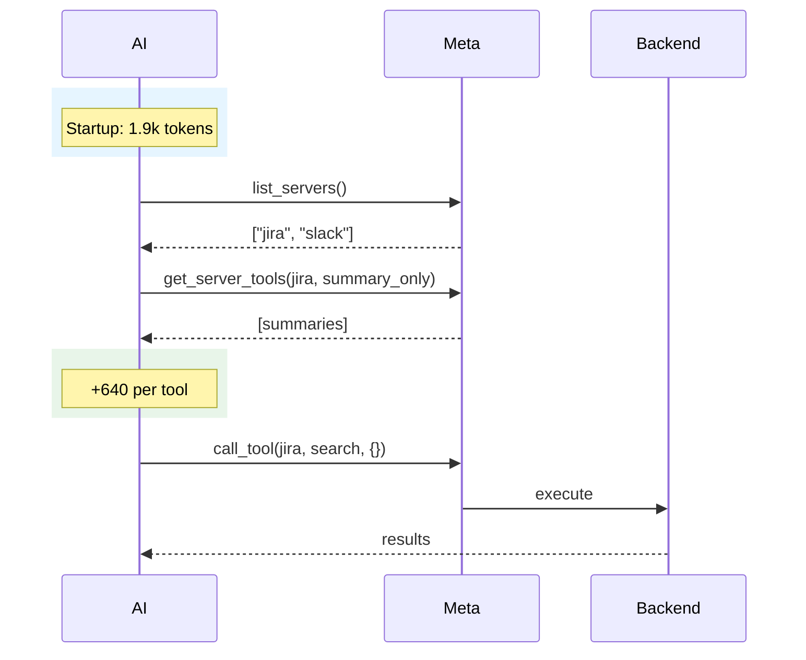

# Token Economics

## Traditional vs Meta-MCP

## Savings

Traditional loads ALL available tools at startup. Meta-MCP only loads what you use.

| Servers | Tools Available | Traditional | You Use | Meta-MCP | Savings |
|---------|-----------------|-------------|---------|----------|---------|
| 1 | 25 | 16,000 | 2 | 3,200 | **80%** |
| 3 | 75 | 48,000 | 2 | 3,200 | **93%** |
| 3 | 75 | 48,000 | 5 | 5,100 | **89%** |

Formula: `1,900 + (tools used × 640)`

## Request Flow

