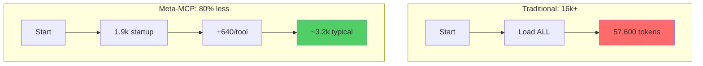
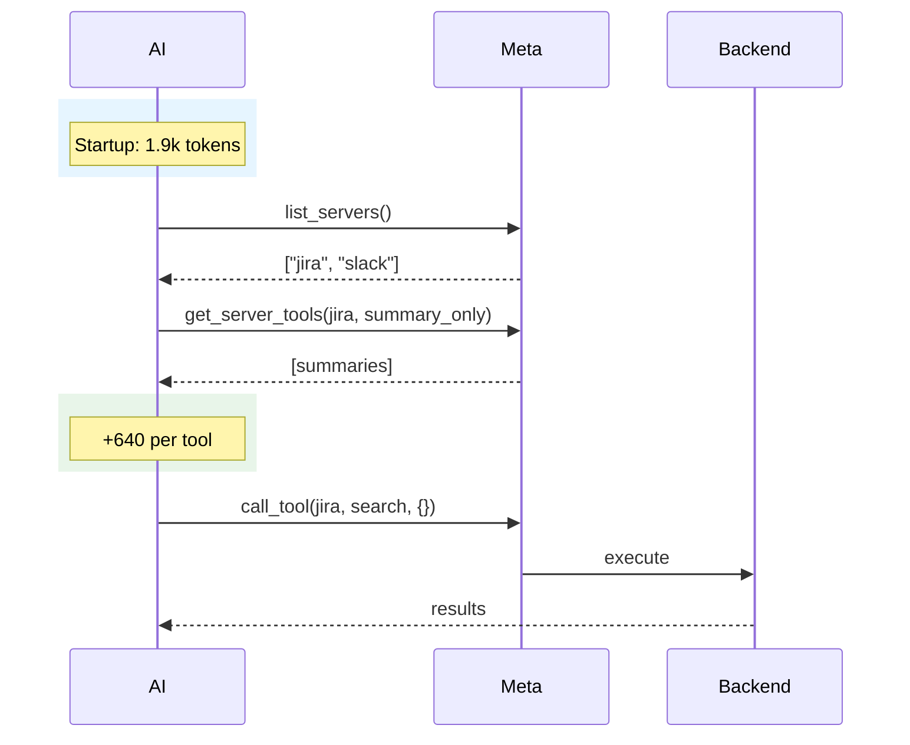

# Token Economics

## Traditional vs Meta-MCP

## Savings

Traditional loads ALL schemas upfront (~57k for 3 servers). Meta-MCP scales with usage.

| Tools Used | Meta-MCP | Savings |
|------------|----------|---------|
| 1 | 2,500 | **96%** |
| 2 | 3,200 | **94%** |
| 5 | 5,100 | **91%** |

Formula: `1,900 + (tools × 640)`

## Request Flow

