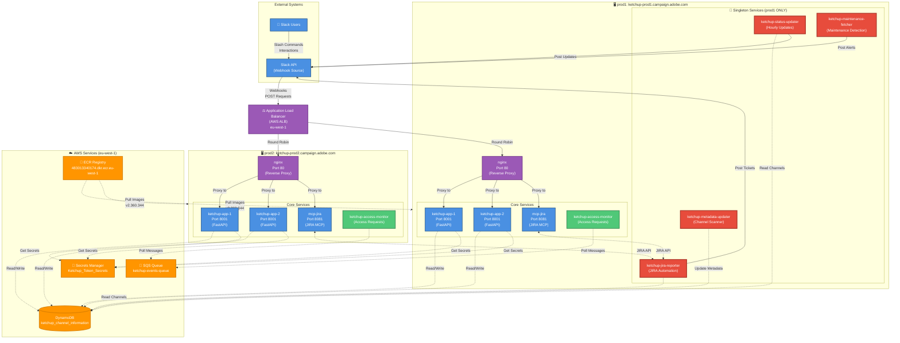

# Ketchup Infrastructure Architecture

This diagram shows the complete AWS infrastructure for the Ketchup Slack application using a C4 Container diagram style. The system uses a dual-server architecture with an Application Load Balancer distributing traffic. **prod1** runs all 9 containers including 4 singleton services (highlighted in red), while **prod2** runs only the 5 core containers for load distribution without duplicating scheduled jobs.

## Key Architecture Points

**Load Distribution:**
- ALB distributes incoming Slack webhooks across both servers
- nginx on each server proxies to local ketchup-app replicas (2 per server)

**Singleton Pattern:**
- 4 services run ONLY on prod1 to prevent duplicate scheduled operations
- These services are explicitly stopped/removed on prod2 during deployment
- Prevents race conditions and duplicate Slack posts

**Container Count:**
- **prod1:** 9 containers (5 core + 4 singletons)
- **prod2:** 5 containers (5 core only)
- **Total:** 14 containers across 2 servers

**Port Mapping:**
- Port 80: nginx (external access)
- Port 8001: ketchup-app containers (internal)
- Port 8081: mcp-jira service (internal)

**AWS Resource Access:**
- All ketchup-app containers read/write to DynamoDB
- All services fetch credentials from Secrets Manager
- Both access-monitor instances poll the same SQS queue
- All images versioned identically and pulled from ECR
