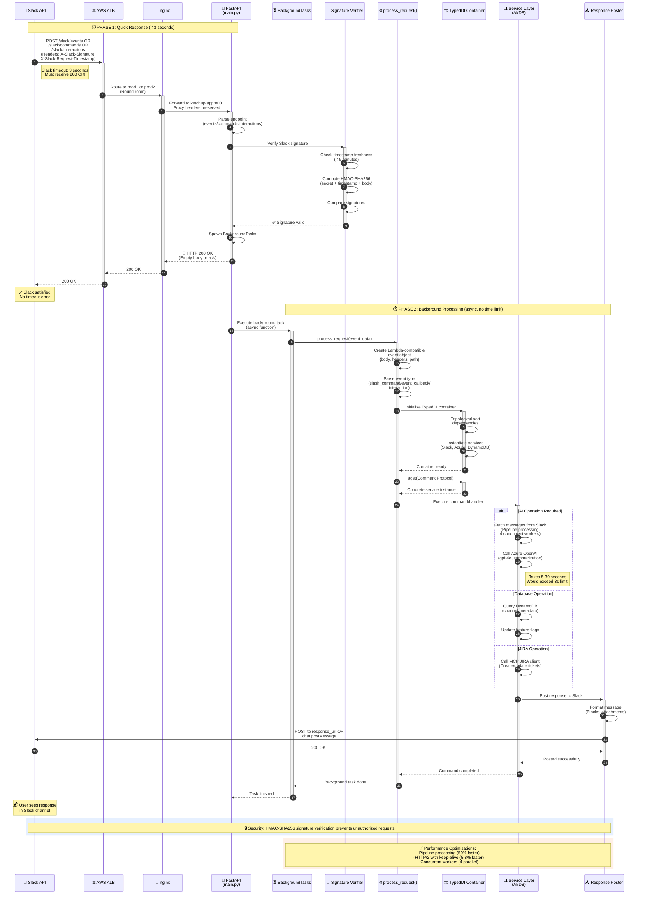

# Slack Event Flow - Complete Request Lifecycle

This sequence diagram shows the complete flow of a Slack event through the Ketchup system. The critical design pattern is **two-phase processing**: an immediate HTTP 200 response within 3 seconds (to satisfy Slack's timeout), followed by asynchronous background processing for expensive operations like AI calls and database queries.

## Key Timing Constraints

**3-Second Rule:**
- Slack requires HTTP 200 within 3 seconds
- Any response taking longer triggers a timeout error visible to users
- FastAPI immediately returns 200 before processing begins

**Background Processing Benefits:**
- No time limits on AI operations (typically 5-30 seconds)
- Can retry failed operations without user-facing errors
- Multiple requests processed concurrently
- Service crashes don't show timeout errors to users

## Security Layer

**Signature Verification Steps:**
1. Extract `X-Slack-Signature` and `X-Slack-Request-Timestamp` headers
2. Verify timestamp is within 5 minutes (prevent replay attacks)
3. Compute signature: `HMAC-SHA256(signing_secret, timestamp + request_body)`
4. Compare computed signature with provided signature
5. Reject request if signatures don't match

## Performance Optimizations (October 2025)

**Pipeline Processing (59% improvement):**
- 4 concurrent workers for message fetching
- Parallel API calls instead of sequential
- Configured via `USE_PIPELINE_PROCESSING=true`

**HTTP/2 with Keep-Alive (5-8% improvement):**
- 94.7% connection reuse rate
- Reduced TCP handshake overhead
- Configured via `KETCHUP_USE_HTTPX=true` and `KETCHUP_HTTP2_ENABLED=true`

## Response Delivery Methods

**Immediate Response (Phase 1):**
- Empty 200 OK for events
- Text acknowledgment for commands

**Delayed Response (Phase 2):**
- `response_url` from Slack payload (expires in 30 minutes)
- `chat.postMessage` API call (requires channel ID)
- `chat.update` for editing existing messages
