# Slash Command Processing Flow

This flowchart shows the complete decision tree for routing and executing Ketchup slash commands. The system uses a multi-layered authorization system with different checks for admin commands versus regular user commands, followed by command-specific routing and execution.

```mermaid
graph TB
    Start(["/ketchup &lt;subcommand&gt;<br/>Received"]) --> Parse["Parse Command<br/>Extract subcommand & args"]
    
    Parse --> AuthCheck{{"Authorization<br/>Required?"}}
    
    AuthCheck -->|"/ketchup feature"| AdminAuth{"Check Admin List<br/>in Secrets Manager<br/>(admin_slack_user_ids)"}
    AuthCheck -->|"Other commands"| UserAuth{"Check Authorized Users<br/>in Secrets Manager<br/>(authorized_slack_user_ids)"}
    
    AdminAuth -->|"❌ Not Admin"| DenyAdmin["🚫 Return Error:<br/>'Admin access required'"]
    AdminAuth -->|"✅ Is Admin"| FeatureRoute["Route to:<br/>FeatureCommand"]
    
    UserAuth -->|"❌ Not Authorized"| DenyUser["🚫 Return Error:<br/>'Not authorized'"]
    UserAuth -->|"✅ Is Authorized"| CommandRoute{"Route by<br/>Subcommand"}
    
    CommandRoute -->|"status"| ReportCmd["ReportCommand<br/>(type='status')"]
    CommandRoute -->|"report"| ReportCmd2["ReportCommand<br/>(type='report')"]
    CommandRoute -->|"short"| ReportCmd3["ReportCommand<br/>(type='short')"]
    CommandRoute -->|"long"| ReportCmd4["ReportCommand<br/>(type='long')"]
    CommandRoute -->|"query"| QueryCmd["QueryCommand"]
    CommandRoute -->|"archive"| ArchiveCmd["ArchiveCommand"]
    CommandRoute -->|"list"| ListCmd["ListCommand"]
    CommandRoute -->|"access"| AccessCmd["AccessCommand"]
    CommandRoute -->|"metrics"| MetricsCmd["MetricsCommand"]
    CommandRoute -->|"unknown"| UnknownCmd["🚫 Return Error:<br/>'Unknown command'"]
    
    FeatureRoute --> FeatureSubcmd{"Feature<br/>Subcommand?"}
    
    FeatureSubcmd -->|"enable"| FeatureEnable["Enable feature<br/>for channel"]
    FeatureSubcmd -->|"disable"| FeatureDisable["Disable feature<br/>for channel"]
    FeatureSubcmd -->|"list"| FeatureList["List all<br/>feature-enabled<br/>channels"]
    FeatureSubcmd -->|"status"| FeatureStatus["Show feature<br/>status & env vars"]
    FeatureSubcmd -->|"global-on"| FeatureGlobalOn["Enable feature<br/>globally"]
    FeatureSubcmd -->|"global-off"| FeatureGlobalOff["Disable feature<br/>globally"]
    FeatureSubcmd -->|"clear-disabled"| FeatureClear["Clear disabled<br/>channels list"]
    FeatureSubcmd -->|"flag-review"| FeatureFlagReview["Show flag review<br/>interactive form"]
    FeatureSubcmd -->|"set-review-channel"| FeatureSetChannel["Set review<br/>notification channel"]
    FeatureSubcmd -->|"get-review-channel"| FeatureGetChannel["Get review<br/>notification channel"]
    
    subgraph Validation["Parameter Extraction & Validation"]
        ReportCmd --> ValidateReport["Validate:<br/>- Channel ID exists<br/>- Time range valid"]
        ReportCmd2 --> ValidateReport
        ReportCmd3 --> ValidateReport
        ReportCmd4 --> ValidateReport
        
        QueryCmd --> ValidateQuery["Validate:<br/>- Question provided<br/>- Channel eligible"]
        
        ArchiveCmd --> ValidateArchive["Validate:<br/>- Valid action<br/>(summarize/check)"]
        
        ListCmd --> ValidateList["Validate:<br/>- No params needed"]
        
        AccessCmd --> ValidateAccess["Validate:<br/>- Subcommand valid<br/>(request/status/revoke)"]
        
        MetricsCmd --> ValidateMetrics["Validate:<br/>- Optional channel filter"]
        
        FeatureEnable --> ValidateFeature["Validate:<br/>- Feature name valid<br/>- Channel ID valid"]
        FeatureDisable --> ValidateFeature
        FeatureList --> ValidateFeature
        FeatureStatus --> ValidateFeature
        FeatureGlobalOn --> ValidateFeature
        FeatureGlobalOff --> ValidateFeature
        FeatureClear --> ValidateFeature
        FeatureFlagReview --> ValidateFeature
        FeatureSetChannel --> ValidateFeature
        FeatureGetChannel --> ValidateFeature
    end
    
    ValidateReport --> DIResolve["TypedDI:<br/>Resolve Services"]
    ValidateQuery --> DIResolve
    ValidateArchive --> DIResolve
    ValidateList --> DIResolve
    ValidateAccess --> DIResolve
    ValidateMetrics --> DIResolve
    ValidateFeature --> DIResolve
    
    subgraph DIResolution["TypedDI Service Resolution"]
        DIResolve --> GetServices["container.aget():<br/>- SlackAsyncClient<br/>- AzureAsyncClient<br/>- DynamoDBClient<br/>- FeatureService<br/>- MCPAsyncClient"]
    end
    
    GetServices --> Execute{"Execute<br/>Command Logic"}
    
    subgraph Execution["Command Execution"]
        Execute -->|"Report Commands"| ExecReport["1. Fetch messages<br/>2. Generate AI summary<br/>3. Format response"]
        Execute -->|"Query Command"| ExecQuery["1. Fetch context<br/>2. Call AI with question<br/>3. Return answer"]
        Execute -->|"Archive Command"| ExecArchive["1. Check archive status<br/>2. Generate summary<br/>3. Return report"]
        Execute -->|"List Command"| ExecList["1. Scan DynamoDB<br/>2. Filter eligible<br/>3. Return list"]
        Execute -->|"Access Command"| ExecAccess["1. Check user status<br/>2. Post request form<br/>3. Monitor approval"]
        Execute -->|"Metrics Command"| ExecMetrics["1. Gather metrics<br/>2. Generate HTML<br/>3. Upload & return link"]
        Execute -->|"Feature Commands"| ExecFeature["1. Update DynamoDB<br/>2. Verify change<br/>3. Return confirmation"]
    end
    
    ExecReport --> PostResponse["Post Response<br/>to Slack"]
    ExecQuery --> PostResponse
    ExecArchive --> PostResponse
    ExecList --> PostResponse
    ExecAccess --> PostResponse
    ExecMetrics --> PostResponse
    ExecFeature --> PostResponse
    
    PostResponse --> ResponseMethod{"Response<br/>Method?"}
    
    ResponseMethod -->|"Immediate"| ImmediateResp["Return in<br/>HTTP 200 body<br/>(< 3 seconds)"]
    ResponseMethod -->|"Delayed"| DelayedResp["POST to<br/>response_url<br/>(background)"]
    
    ImmediateResp --> End([Command Complete])
    DelayedResp --> End
    
    DenyAdmin --> End
    DenyUser --> End
    UnknownCmd --> End
    
    classDef authNode fill:#E74C3C,stroke:#A93226,stroke-width:2px,color:#fff
    classDef routeNode fill:#9B59B6,stroke:#6C3483,stroke-width:2px,color:#fff
    classDef validateNode fill:#F39C12,stroke:#CA7E0A,stroke-width:2px,color:#fff
    classDef diNode fill:#8E44AD,stroke:#6C3483,stroke-width:2px,color:#fff
    classDef execNode fill:#3498DB,stroke:#2471A3,stroke-width:2px,color:#fff
    classDef successNode fill:#27AE60,stroke:#1E8449,stroke-width:2px,color:#fff
    classDef errorNode fill:#E74C3C,stroke:#A93226,stroke-width:3px,color:#fff
    
    class AdminAuth,UserAuth authNode
    class CommandRoute,FeatureSubcmd,ResponseMethod routeNode
    class ValidateReport,ValidateQuery,ValidateArchive,ValidateList,ValidateAccess,ValidateMetrics,ValidateFeature validateNode
    class DIResolve,GetServices diNode
    class ExecReport,ExecQuery,ExecArchive,ExecList,ExecAccess,ExecMetrics,ExecFeature execNode
    class PostResponse,ImmediateResp,DelayedResp,End successNode
    class DenyAdmin,DenyUser,UnknownCmd errorNode
```

## Command Categories

### Report Commands (AI-Powered)
- **status**: Quick channel status (last 24 hours)
- **report**: Detailed channel report (configurable time range)
- **short**: Brief summary (< 100 words)
- **long**: Detailed summary (> 300 words)

**Execution:** Fetch messages → AI summarization → Post formatted response

### Interactive Commands
- **query**: Ask questions about channel history using AI
- **archive**: Check archive status and generate summaries
- **list**: List all Ketchup-eligible channels

**Execution:** Varies by command, typically involves AI or database queries

### Access Management Commands
- **access request**: Submit access request with justification
- **access status**: Check current access status
- **access revoke**: Revoke own access

**Execution:** Update DynamoDB → Post to access channel → Wait for approval

### Metrics Commands (HTML Dashboard)
- **metrics**: Generate comprehensive HTML dashboard
- **metrics [channel_id]**: Channel-specific metrics

**Execution:** Aggregate data → Generate HTML → Upload → Return URL

### Feature Commands (Admin Only - 10 Subcommands)
1. **enable [feature] [channel]**: Enable feature for specific channel
2. **disable [feature] [channel]**: Disable feature for specific channel
3. **list [feature]**: List all channels with feature enabled
4. **status [feature]**: Show feature status (env vars + DB count)
5. **global-on [feature]**: Enable feature for ALL channels
6. **global-off [feature]**: Disable global flag
7. **clear-disabled [feature]**: Clear disabled channels list
8. **flag-review**: Show interactive flag review form
9. **set-review-channel [channel]**: Set notification channel for reviews
10. **get-review-channel**: Get current review channel

**Available Features:**
- `status_updater` (hourly status updates)
- `jira_reporter` (JIRA ticket automation)
- `trust_endorsement` (trust endorsement system)

## Authorization Levels

### Admin Users (Secrets Manager: admin_slack_user_ids)
- Can execute ALL commands
- Can manage feature flags
- Can configure system settings

### Authorized Users (Secrets Manager: authorized_slack_user_ids)
- Can execute standard commands
- Cannot manage feature flags
- Limited to personal access management

### Unauthorized Users
- Receive immediate error message
- No command execution
- Must request access via approval flow

## Parameter Validation

Each command validates:
- **Required parameters**: Command fails if missing
- **Channel eligibility**: Must be Ketchup-enabled channel
- **Time range**: Must be valid date/time format
- **Feature names**: Must match known features
- **User permissions**: Must have appropriate access level

## Response Timing

**Immediate Response (< 3 seconds):**
- Simple commands (list, status check)
- Error messages
- Acknowledgment messages

**Delayed Response (background):**
- AI-powered commands (5-30 seconds)
- Database-heavy operations
- HTML generation
- JIRA API calls

## Error Handling

All commands include error handling:
1. **Validation errors**: Clear user-facing message
2. **Authorization errors**: "Not authorized" or "Admin required"
3. **Service errors**: Generic error + logged details
4. **Timeout errors**: Retry mechanism for AI calls
5. **API errors**: Fallback to cached data when possible
