# TypedDI Dependency Injection Resolution Flow

This flowchart shows the TypedDI dependency injection system. TypedDI provides type-safe, protocol-first dependency management with compile-time validation and topological sorting for dependency resolution.

```mermaid
graph TB
    Start([Application Startup]) --> DefineProtocols["📋 Step 1: Define Protocols<br/>━━━━━━━━━━━━━━━<br/>packages/core/typed_di/protocols.py"]
    
    DefineProtocols --> ProtocolExample["Example Protocols:<br/>• SlackPostingProtocol<br/>• SlackFetchingProtocol<br/>• AzureAIProtocol<br/>• DynamoDBProtocol<br/>• FeatureServiceProtocol"]
    
    ProtocolExample --> Register["📝 Step 2: Register Services<br/>━━━━━━━━━━━━━━━<br/>packages/core/typed_di/<br/>service_registrations/"]
    
    Register --> RegisterFiles["Registration Files:<br/>• ai_registrations.py<br/>• command_registrations.py<br/>• db_registrations.py<br/>• feature_registrations.py<br/>• slack_registrations.py"]
    
    RegisterFiles --> RegisterLogic["For each service:<br/>1. Define concrete class<br/>2. Specify protocol interface<br/>3. Declare dependencies<br/>4. Register with container"]
    
    RegisterLogic --> ContainerInit["🏗️ Step 3: Container Initialization<br/>━━━━━━━━━━━━━━━<br/>TypedServiceRegistry()"]
    
    ContainerInit --> BuildGraph["Build Dependency Graph<br/>━━━━━━━━━━━━━━━"]
    
    BuildGraph --> GraphScan["Scan all registrations:<br/>• Extract service dependencies<br/>• Build directed graph<br/>• Node = Service<br/>• Edge = Dependency"]
    
    GraphScan --> TopoSort["⚙️ Step 4: Topological Sort<br/>━━━━━━━━━━━━━━━"]
    
    TopoSort --> CheckCycles{"Circular<br/>Dependencies?"}
    
    CheckCycles -->|"Yes ❌"| CycleError["🚨 Raise Error:<br/>'Circular dependency detected'<br/>Show dependency chain"]
    
    CheckCycles -->|"No ✅"| SortOrder["Compute initialization order:<br/>1. Leaf dependencies first<br/>2. Mid-tier services<br/>3. Top-level services last"]
    
    SortOrder --> Initialize["🚀 Step 5: Initialize Services<br/>━━━━━━━━━━━━━━━<br/>In topological order"]
    
    Initialize --> InitLoop["For each service in order:"]
    
    InitLoop --> GetDeps["Get dependencies<br/>(already initialized)"]
    
    GetDeps --> Instantiate["Instantiate service<br/>with dependencies"]
    
    Instantiate --> Cache["Cache in container<br/>(singleton pattern)"]
    
    Cache --> NextService{"More<br/>services?"}
    
    NextService -->|"Yes"| InitLoop
    NextService -->|"No"| Ready["✅ Container Ready"]
    
    Ready --> RuntimeUse["🔍 Step 6: Runtime Resolution<br/>━━━━━━━━━━━━━━━"]
    
    RuntimeUse --> GetRequest["Code calls:<br/>container.aget(ProtocolType)"]
    
    GetRequest --> Lookup["Lookup service<br/>by protocol"]
    
    Lookup --> Found{"Service<br/>registered?"}
    
    Found -->|"No ❌"| NotFoundError["🚨 Raise Error:<br/>'No service registered<br/>for protocol'"]
    
    Found -->|"Yes ✅"| ReturnInstance["Return cached<br/>service instance"]
    
    ReturnInstance --> TypeCheck["✅ Type checker validates:<br/>Instance implements protocol"]
    
    TypeCheck --> UsageComplete([Service Used])

    subgraph ModernAdvantages["✅ TYPEDDI ADVANTAGES"]
        Adv1["✅ Type-safe (Protocol-based)"]
        Adv2["✅ Compile-time validation"]
        Adv3["✅ IDE autocomplete support"]
        Adv4["✅ Topological sorting"]
        Adv5["✅ Circular dependency detection"]
        Adv6["✅ Clear error messages"]
        Adv7["✅ Singleton caching"]
        Adv8["✅ Async support (aget)"]
    end
    
    subgraph ExampleUsage["💡 EXAMPLE USAGE"]
        Ex1["# Protocol Definition<br/>class SlackPostingProtocol(Protocol):<br/>    async def post_message(<br/>        self,<br/>        channel: str,<br/>        text: str<br/>    ) -> dict: ..."]
        
        Ex2["# Service Registration<br/>container.register(<br/>    protocol=SlackPostingProtocol,<br/>    implementation=SlackAsyncClient,<br/>    dependencies=[SecretsProtocol]<br/>)"]
        
        Ex3["# Runtime Resolution<br/>slack = await container.aget(<br/>    SlackPostingProtocol<br/>)<br/><br/># Type-safe usage<br/>await slack.post_message(<br/>    'C123',<br/>    'Hello!'<br/>)"]
    end
    
    classDef protocolNode fill:#8E44AD,stroke:#6C3483,stroke-width:2px,color:#fff
    classDef registerNode fill:#3498DB,stroke:#2471A3,stroke-width:2px,color:#fff
    classDef topoNode fill:#E67E22,stroke:#CA6F1E,stroke-width:2px,color:#fff
    classDef initNode fill:#27AE60,stroke:#1E8449,stroke-width:2px,color:#fff
    classDef resolveNode fill:#16A085,stroke:#138D75,stroke-width:2px,color:#fff
    classDef errorNode fill:#E74C3C,stroke:#A93226,stroke-width:3px,color:#fff
    classDef successNode fill:#27AE60,stroke:#1E8449,stroke-width:3px,color:#fff
    classDef advNode fill:#D5F4E6,stroke:#27AE60,stroke-width:2px
    classDef exampleNode fill:#EBF5FB,stroke:#3498DB,stroke-width:1px
    
    class DefineProtocols,ProtocolExample protocolNode
    class Register,RegisterFiles,RegisterLogic registerNode
    class TopoSort,CheckCycles,SortOrder topoNode
    class Initialize,InitLoop,GetDeps,Instantiate,Cache initNode
    class RuntimeUse,GetRequest,Lookup,ReturnInstance,TypeCheck resolveNode
    class CycleError,NotFoundError errorNode
    class Ready,UsageComplete successNode
```



## TypedDI Architecture Overview

### Design Principles

1. **Protocol-First Design**: All services implement typed protocols (Python's `typing.Protocol`)
2. **Compile-Time Validation**: Type checkers (mypy, pyright) validate at development time
3. **Dependency Graph**: Explicit dependency declarations enable topological sorting
4. **Singleton Pattern**: Services instantiated once and cached for performance
5. **Async Support**: Full async/await support via `aget()` method

### Key Components

**Location**: `packages/core/typed_di/`

**Core Files**:
- `typed_service_registry.py` - Main DI container with topological sorting
- `protocols.py` - Protocol definitions for all services
- `service_registration.py` - Master registration orchestrator
- `service_registrations/` - Modular registration files by domain

### Production Services Using TypedDI

All 7 production services use TypedDI:
- ketchup-app (FastAPI)
- ketchup-status-updater
- ketchup-jira-reporter
- ketchup-metadata-updater
- ketchup-maintenance-fetcher
- ketchup-access-monitor
- mcp-jira

Test coverage: 100% TypedDI validation tests

---

## Step-by-Step Breakdown

### Step 1: Protocol Definition

**File**: `packages/core/typed_di/protocols.py`

```python
from typing import Protocol

class SlackPostingProtocol(Protocol):
    """Protocol for posting messages to Slack"""
    async def post_message(
        self,
        channel: str,
        text: str,
        blocks: list | None = None
    ) -> dict:
        """Post message to Slack channel"""
        ...

class AzureAIProtocol(Protocol):
    """Protocol for Azure OpenAI operations"""
    async def generate_summary(
        self,
        messages: list[str],
        max_tokens: int = 500
    ) -> str:
        """Generate AI summary from messages"""
        ...
```

**Benefits**:
- Clear interface contracts
- Type hints for IDE autocomplete
- Decouples interface from implementation
- Enables mocking for tests

---

### Step 2: Service Registration

**File**: `packages/core/typed_di/service_registrations/slack_registrations.py`

```python
from packages.integrations.slack.slack_async_client import SlackAsyncClient
from packages.core.typed_di.protocols import SlackPostingProtocol, SecretsProtocol

def register_slack_services(container: TypedServiceRegistry):
    container.register(
        protocol=SlackPostingProtocol,
        implementation=SlackAsyncClient,
        dependencies=[SecretsProtocol]  # Explicit dependency
    )
```

**Registration Structure**:
- `protocol`: Interface the service implements
- `implementation`: Concrete class to instantiate
- `dependencies`: List of protocol dependencies (injected via constructor)

**Registration Files by Domain**:
- `ai_registrations.py` - Azure OpenAI services
- `command_registrations.py` - Slash command handlers
- `db_registrations.py` - DynamoDB operations
- `feature_registrations.py` - Feature flag services
- `slack_registrations.py` - Slack API clients
- `secrets_registrations.py` - Secrets Manager

---

### Step 3: Container Initialization

**File**: `packages/core/typed_di/typed_service_registry.py`

```python
class TypedServiceRegistry:
    def __init__(self):
        self._services: dict[Type, Any] = {}
        self._registrations: dict[Type, Registration] = {}
        self._dependency_graph: dict[Type, list[Type]] = {}
        
    def register(
        self,
        protocol: Type[T],
        implementation: Type[T],
        dependencies: list[Type] | None = None
    ):
        self._registrations[protocol] = Registration(
            protocol=protocol,
            implementation=implementation,
            dependencies=dependencies or []
        )
        self._build_dependency_graph()
```

**Container Lifecycle**:
1. Create empty registry
2. Register all services (via registration modules)
3. Build dependency graph
4. Perform topological sort
5. Initialize services in dependency order

---

### Step 4: Topological Sort

**Purpose**: Ensure services are initialized in correct order (dependencies first)

**Algorithm**:
1. Build directed graph (nodes = services, edges = dependencies)
2. Find nodes with no incoming edges (leaf dependencies)
3. Remove node and its outgoing edges
4. Repeat until all nodes processed
5. If cycle detected, raise error with chain

**Example Dependency Order**:
```
SecretsManager (no dependencies)
  ↓
SlackAsyncClient (depends on SecretsManager)
  ↓
AzureAsyncClient (depends on SecretsManager)
  ↓
ReportCommand (depends on SlackAsyncClient, AzureAsyncClient)
```

**Topological Order**: `[SecretsManager, SlackAsyncClient, AzureAsyncClient, ReportCommand]`

---

### Step 5: Service Initialization

**Lazy Initialization**: Services instantiated on first request, not at startup

**Initialization Flow**:
```python
async def aget(self, protocol: Type[T]) -> T:
    # Check cache
    if protocol in self._services:
        return self._services[protocol]
    
    # Get registration
    registration = self._registrations[protocol]
    
    # Resolve dependencies recursively
    dependencies = []
    for dep_protocol in registration.dependencies:
        dep_instance = await self.aget(dep_protocol)
        dependencies.append(dep_instance)
    
    # Instantiate with dependencies
    instance = registration.implementation(*dependencies)
    
    # Cache for singleton behavior
    self._services[protocol] = instance
    
    return instance
```

**Singleton Pattern**: Each service instantiated once, cached for lifetime of application

---

### Step 6: Runtime Resolution

**Usage in Application Code**:

```python
# In command handler
async def handle_status_command(event: dict):
    # Get DI container
    container = get_container()
    
    # Resolve services
    slack = await container.aget(SlackPostingProtocol)
    azure = await container.aget(AzureAIProtocol)
    db = await container.aget(DynamoDBProtocol)
    
    # Use services (type-safe!)
    channel = event['channel_id']
    messages = await slack.fetch_messages(channel)
    summary = await azure.generate_summary(messages)
    await slack.post_message(channel, summary)
```

**Type Safety**: Type checker validates:
- Protocol exists
- Methods are correctly called
- Parameters match signatures
- Return types are correct

---

## TypedDI Usage Pattern

```python
# Protocol-based lookup
slack_client = await container.aget(SlackPostingProtocol)

# Benefits:
# ✅ Full type checking
# ✅ Compile-time error detection
# ✅ IDE autocomplete support
# ✅ Automatic dependency resolution
# ✅ Topological sorting
```

---

## Error Handling

### Circular Dependency Detection

```
🚨 Circular dependency detected:
ServiceA → ServiceB → ServiceC → ServiceA

Resolution:
1. Refactor to remove circular dependency
2. Use dependency inversion (introduce protocol)
3. Lazy initialization pattern
```

### Service Not Found

```
🚨 No service registered for protocol: SlackPostingProtocol

Resolution:
1. Check service_registration.py includes registration
2. Verify protocol matches registration
3. Ensure registration called at startup
```

---

## Testing with TypedDI

**Mock Services**:
```python
class MockSlackClient:
    async def post_message(self, channel: str, text: str) -> dict:
        return {"ok": True, "ts": "1234567890.123456"}

# In test
container.register(
    protocol=SlackPostingProtocol,
    implementation=MockSlackClient,
    dependencies=[]
)
```

**Validation Tests**:
- `test_typed_di.py` - Container initialization
- `test_protocol_validation.py` - Protocol compliance
- `test_dependency_resolution.py` - Dependency graph
- `test_circular_dependencies.py` - Cycle detection

---

## Performance Considerations

**Singleton Caching**:
- Services instantiated once
- No overhead for repeated lookups
- Memory-efficient (shared instances)

**Lazy Initialization**:
- Services created on first use
- Faster application startup
- Only instantiate what's needed

**Async Support**:
- Full async/await support
- Non-blocking service resolution
- Concurrent initialization possible

---

## Documentation References

**Primary Documentation**:
- `docs/TYPEDDI_MIGRATION_SUMMARY.md` - Complete migration guide (400+ lines)
- `packages/core/typed_di/README.md` - API reference
- `tests/setup/test_typed_di.py` - Usage examples

**Migration Status**: 100% complete (September 2025)
