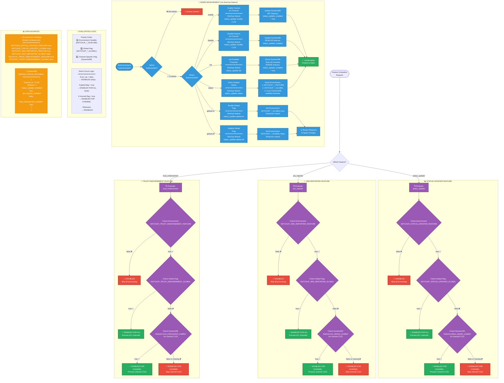

# Feature Flag Decision Tree

This flowchart shows the three-tier feature flag evaluation system used by Ketchup. Each feature (status_updater, jira_reporter, trust_endorsement) follows the same evaluation logic: environment variable check → global flag check → channel-specific flag check. Admins manage flags via `/ketchup feature` commands.



## Feature Flag Evaluation Algorithm

### Three-Tier Hierarchy

```
1. Environment Variable Check (Master Kill Switch)
   ↓
2. Global Flag Check (Enable for ALL channels)
   ↓
3. Channel-Specific Flag Check (Enable for specific channel)
```

**Short-Circuit Logic**: Evaluation stops at first decisive check:
- If environment variable is `false` → **DISABLED** (stop)
- If global flag is `true` → **ENABLED FOR ALL** (stop)
- If channel-specific flag is `true` → **ENABLED FOR CHANNEL**
- Otherwise → **DISABLED**

### Example Evaluation

**Scenario 1: Global Feature Enabled**
```
Environment: KETCHUP_STATUS_UPDATER_FEATURE=true ✅
Global Flag: KETCHUP_STATUS_UPDATER_GLOBAL=true ✅
Result: ENABLED FOR ALL CHANNELS (don't check DynamoDB)
```

**Scenario 2: Channel-Specific Feature**
```
Environment: KETCHUP_JIRA_REPORTER_FEATURE=true ✅
Global Flag: KETCHUP_JIRA_REPORTER_GLOBAL=false ❌
Channel Flag (C123): features.jira_reporter_enabled=true ✅
Result: ENABLED FOR C123 (but not other channels)
```

**Scenario 3: Feature Disabled**
```
Environment: KETCHUP_STATUS_UPDATER_FEATURE=false ❌
Result: DISABLED FOR ALL (don't check global or channel flags)
```

---

## Available Features

### 1. Status Updater (`status_updater`)

**Purpose**: Automated hourly channel status updates

**Environment Variables**:
- `KETCHUP_STATUS_UPDATER_FEATURE=true` (master switch)
- `KETCHUP_STATUS_UPDATER_GLOBAL=true` (global enable)

**DynamoDB Field**: `features.status_updater_enabled`

**Default Configuration**: 
- Feature: ✅ Enabled
- Global: ✅ Enabled for all channels

---

### 2. JIRA Reporter (`jira_reporter`)

**Purpose**: Automated JIRA ticket creation for incidents

**Environment Variables**:
- `KETCHUP_JIRA_REPORTER_FEATURE=true` (master switch)
- `KETCHUP_JIRA_REPORTER_GLOBAL=false` (global disabled)

**DynamoDB Field**: `features.jira_reporter_enabled`

**Default Configuration**: 
- Feature: ✅ Enabled
- Global: ❌ Disabled (requires per-channel opt-in)

**Rationale**: JIRA integration is opt-in to prevent unwanted ticket creation

---

### 3. Trust Endorsement (`trust_endorsement`)

**Purpose**: Trust endorsement system for channel members

**Environment Variables**:
- `KETCHUP_TRUST_ENDORSEMENT_FEATURE=true` (master switch)
- `KETCHUP_TRUST_ENDORSEMENT_GLOBAL=true` (global enable)

**DynamoDB Field**: `features.trust_endorsement_enabled`

**Default Configuration**: 
- Feature: ✅ Enabled
- Global: ✅ Enabled for all channels

---

## Admin Management Commands

### Enable Feature for Channel

```bash
/ketchup feature status_updater enable C0LQEJGCB
```

**Action**: Sets `features.status_updater_enabled = true` in DynamoDB for channel C0LQEJGCB

**Result**: Channel C0LQEJGCB now receives status updates (if global is disabled)

---

### Disable Feature for Channel

```bash
/ketchup feature jira_reporter disable C0LQEJGCB
```

**Action**: Removes `features.jira_reporter_enabled` from DynamoDB for channel C0LQEJGCB

**Result**: Channel C0LQEJGCB no longer creates JIRA tickets

---

### List Enabled Channels

```bash
/ketchup feature status_updater list
```

**Action**: Scans DynamoDB for all channels where `features.status_updater_enabled = true`

**Response**:
```
Status Updater - Enabled Channels:
• C0LQEJGCB - #campaign-ops-team
• C0M5N3P2Q - #incident-response
• C0N7R4S1T - #platform-alerts
Total: 3 channels
```

---

### Show Feature Status

```bash
/ketchup feature status_updater status
```

**Response**:
```
Status Updater Configuration:

Environment Variables:
• KETCHUP_STATUS_UPDATER_FEATURE: true ✅
• KETCHUP_STATUS_UPDATER_GLOBAL: true ✅

DynamoDB:
• Explicitly enabled channels: 0
• Explicitly disabled channels: 0

Current Behavior:
✅ ENABLED FOR ALL CHANNELS (global flag is true)

Note: Global flag overrides channel-specific settings.
```

---

### Enable Global Flag

```bash
/ketchup feature status_updater global-on
```

**Action**: Sets `KETCHUP_STATUS_UPDATER_GLOBAL=true` in docker-compose.yml

**Result**: Feature enabled for ALL channels, regardless of DynamoDB settings

**⚠️ Requires Restart**: Container must be restarted to apply environment variable change

---

### Disable Global Flag

```bash
/ketchup feature jira_reporter global-off
```

**Action**: Sets `KETCHUP_JIRA_REPORTER_GLOBAL=false` in docker-compose.yml

**Result**: Feature respects per-channel DynamoDB settings

**⚠️ Requires Restart**: Container must be restarted to apply environment variable change

---

### Clear Disabled Channels List

```bash
/ketchup feature status_updater clear-disabled
```

**Action**: Removes ALL `features.status_updater_enabled = false` entries from DynamoDB

**Use Case**: Cleanup after testing or bulk re-enabling

---

### Flag Review (Interactive Form)

```bash
/ketchup feature flag-review
```

**Action**: Posts interactive form with all feature flags and current states

**Response**: Modal dialog with:
- Current environment variable values
- Global flag states
- Channel-specific flag counts
- Quick enable/disable buttons

---

### Set Review Notification Channel

```bash
/ketchup feature set-review-channel C0LQEJGCB
```

**Action**: Sets notification channel for feature flag changes

**Use Case**: Admins receive notifications when flags are changed

---

### Get Review Notification Channel

```bash
/ketchup feature get-review-channel
```

**Response**: Current notification channel ID and name

---

## Implementation Details

### Feature Service (`packages/core/feature_flags/feature_service.py`)

```python
class FeatureService:
    async def is_feature_enabled(
        self,
        feature_name: str,
        channel_id: str
    ) -> bool:
        # 1. Check environment variable (master switch)
        env_var = f"KETCHUP_{feature_name.upper()}_FEATURE"
        if not os.getenv(env_var, "false").lower() == "true":
            return False  # DISABLED
        
        # 2. Check global flag
        global_var = f"KETCHUP_{feature_name.upper()}_GLOBAL"
        if os.getenv(global_var, "false").lower() == "true":
            return True  # ENABLED FOR ALL
        
        # 3. Check channel-specific flag in DynamoDB
        channel = await self.db.get_channel(channel_id)
        feature_key = f"{feature_name}_enabled"
        return channel.get("features", {}).get(feature_key, False)
```

### DynamoDB Schema

```json
{
  "channel_id": "C0LQEJGCB",
  "channel_name": "campaign-ops-team",
  "features": {
    "status_updater_enabled": true,
    "jira_reporter_enabled": false,
    "trust_endorsement_enabled": true
  }
}
```

### Environment Variables (docker-compose.yml)

```yaml
services:
  ketchup-app:
    environment:
      # Status Updater
      - KETCHUP_STATUS_UPDATER_FEATURE=true
      - KETCHUP_STATUS_UPDATER_GLOBAL=true
      
      # JIRA Reporter
      - KETCHUP_JIRA_REPORTER_FEATURE=true
      - KETCHUP_JIRA_REPORTER_GLOBAL=false
      
      # Trust Endorsement
      - KETCHUP_TRUST_ENDORSEMENT_FEATURE=true
      - KETCHUP_TRUST_ENDORSEMENT_GLOBAL=true
```

---

## Authorization

### Admin Users Only

**Requirement**: User must be in `admin_slack_user_ids` list in Secrets Manager

**Enforcement**: 
1. Extract user_id from Slack command payload
2. Fetch admin list from Secrets Manager
3. Check if user_id in admin list
4. Deny if not admin

**Error Response**: 
```
❌ Access Denied

This command requires admin privileges.
Contact @ketchup-admins to request access.
```

---

## Performance Optimizations

### Caching

**Feature Flag Cache**: 
- Cache feature evaluations for 5 minutes
- Reduces DynamoDB queries
- Invalidate cache on flag updates

**Admin List Cache**:
- Cache admin user list for 10 minutes
- Reduces Secrets Manager API calls

### Short-Circuit Evaluation

**Benefit**: Avoid unnecessary checks
- If environment variable is false, skip global and DynamoDB checks
- If global flag is true, skip DynamoDB query
- Reduces latency and API costs

---

## Monitoring and Logging

**Logged Events**:
- Feature flag evaluations (channel, feature, result)
- Admin command executions (user, action, target)
- Flag changes (old value → new value)
- Cache hits/misses

**Metrics**:
- Feature flag evaluation rate
- Enabled channel counts per feature
- Admin command frequency
- Cache hit ratio

**Alerting**:
- Notify admin channel when flags are changed
- Alert on unexpected feature behavior
- Monitor for unauthorized access attempts
