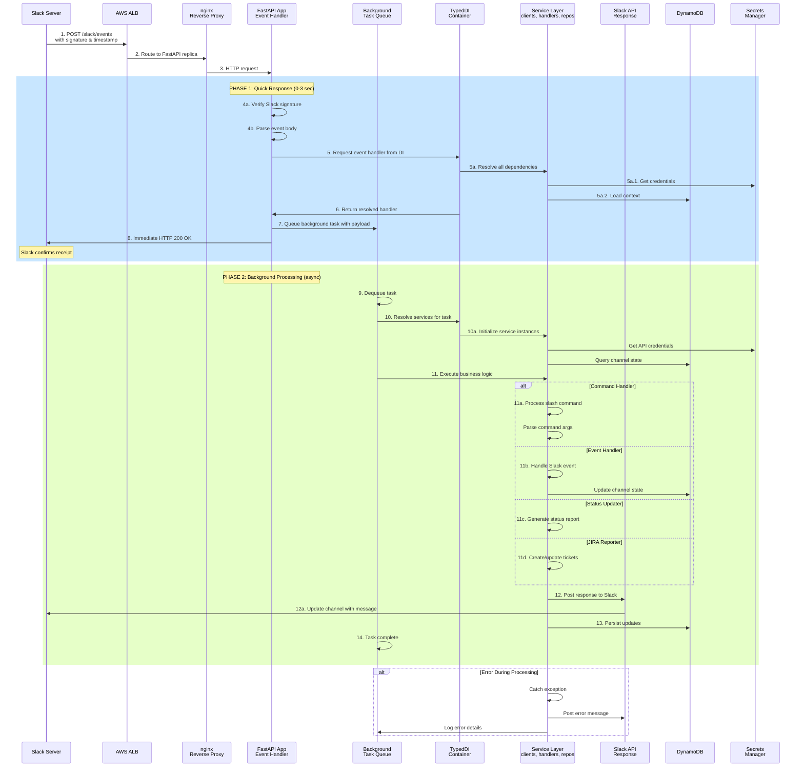
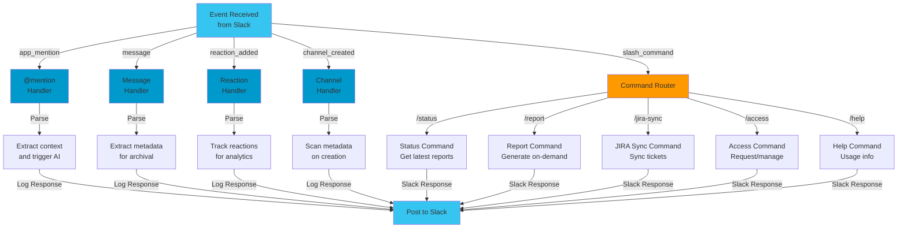

# Slack Event Processing Flow

## Complete Request-Response Lifecycle

## Event Types and Handlers

## Key Processing Phases

### Phase 1: Quick Response (Synchronous, <3 seconds)
1. **Signature Verification**: Validate request came from Slack using HMAC-SHA256
2. **Event Parsing**: Extract event type, user, channel, content
3. **Dependency Resolution**: TypedDI resolves all required services
4. **Credential Loading**: Pull API credentials from Secrets Manager
5. **Context Loading**: Query DynamoDB for channel/user state
6. **Task Queueing**: Enqueue background task with full payload
7. **Immediate Response**: Send HTTP 200 to Slack (confirms receipt)

### Phase 2: Asynchronous Processing
1. **Background Execution**: Process task from queue when workers available
2. **Business Logic**: Run actual command/handler logic
3. **External API Calls**:
   - Post responses to Slack
   - Query/update JIRA tickets
   - Fetch Adobe employee data
4. **State Persistence**: Update DynamoDB with new state
5. **Error Handling**: Log failures and post error messages to Slack

## Why Two Phases?

**Slack's 3-second Response Requirement**:
- Slack expects HTTP 200 response within 3 seconds
- AI operations, JIRA queries, and database updates often take longer
- Solution: Acknowledge immediately, process asynchronously

**Concurrency Benefits**:
- Multiple background workers process tasks in parallel
- Faster request throughput (don't block on slow operations)
- Better resource utilization across servers

---

**Error Handling**: All errors caught in Phase 2, logged to CloudWatch, and error messages posted to Slack
**Retry Logic**: Failed background tasks can be replayed from SQS queue
