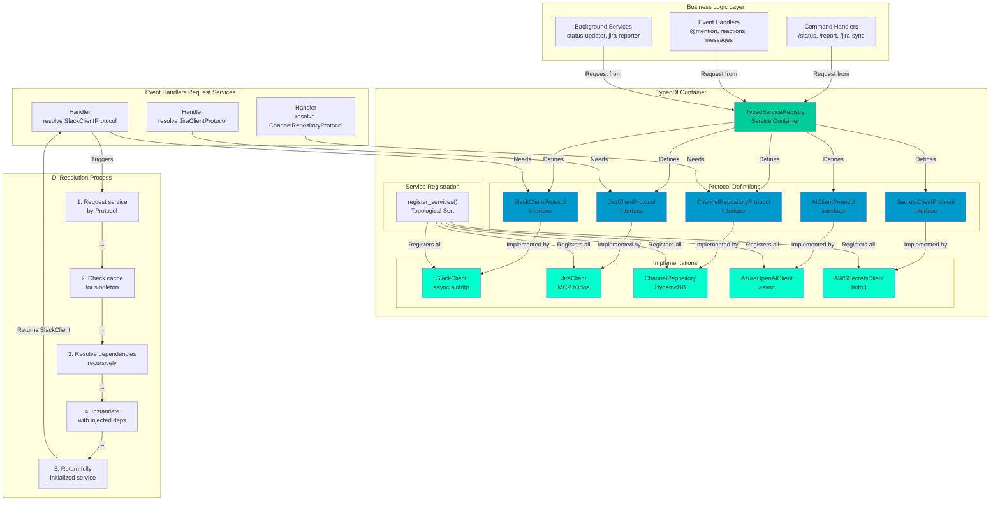
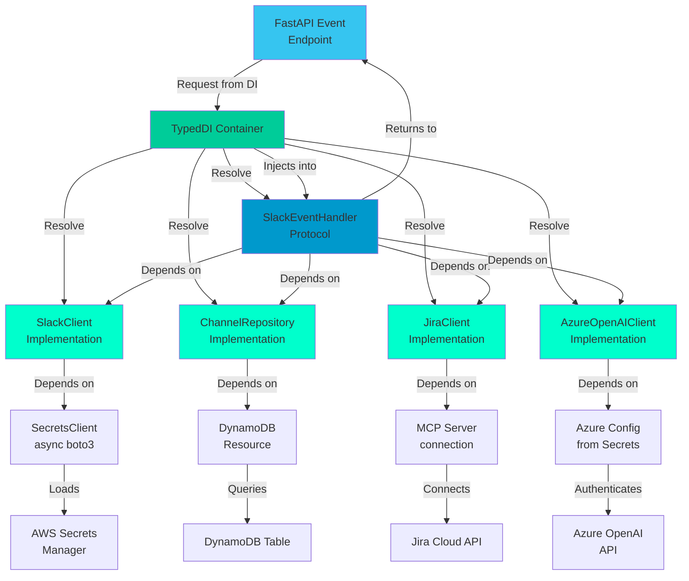
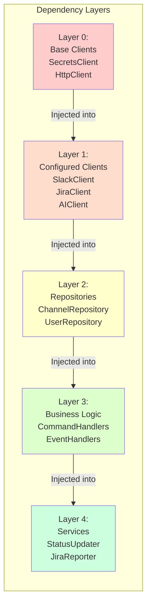
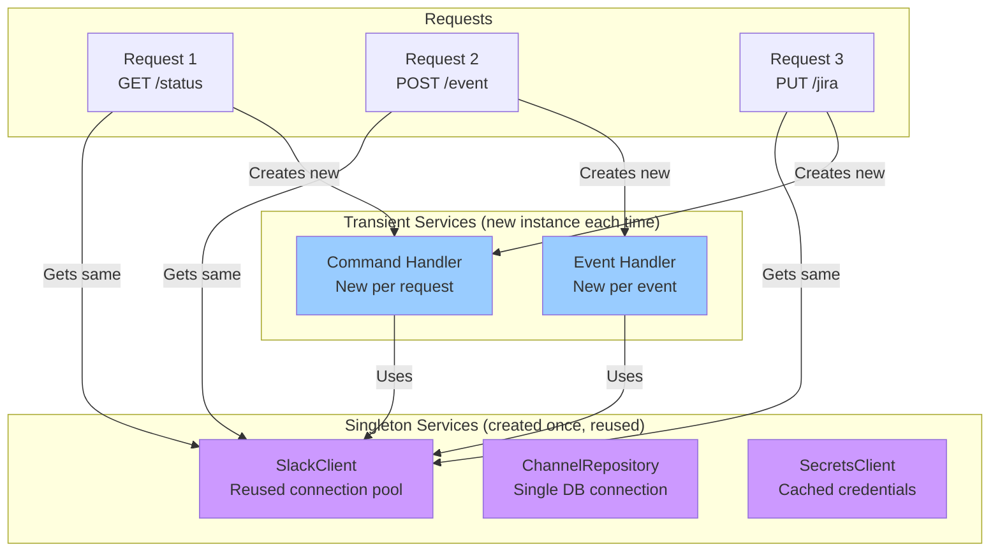

# TypedDI Dependency Injection Architecture

## Service Container & Resolution Flow



## Dependency Graph Example: Slack Event Handler



## Service Registration Order (Topological Sort)



## Singleton vs Transient Services



## File Structure

```
packages/core/typed_di/
├── typed_service_registry.py     # Main DI container with topological sort
├── protocols.py                  # Protocol definitions (interfaces)
├── service_registration.py       # Register all services with dependencies
├── decorators.py                 # @injectable, @singleton decorators
└── exceptions.py                 # DI resolution errors

packages/slack/
├── handlers/
│   ├── command_handlers.py      # Implement SlackCommandProtocol
│   └── event_handlers.py        # Implement SlackEventProtocol
└── clients/
    └── slack_client.py          # Implement SlackClientProtocol

packages/integrations/
├── jira_client.py               # Implement JiraClientProtocol
├── ai_client.py                 # Implement AIClientProtocol
└── async_client.py              # Base class for all async clients

packages/db/
└── repositories/
    └── channel_repository.py    # Implement RepositoryProtocol
```

## Key Advantages

✅ **Type Safety**: Protocol-first design catches errors at development time
✅ **Testability**: Easy to mock services by providing test implementations
✅ **Loose Coupling**: Services depend on interfaces, not implementations
✅ **Dependency Resolution**: No string-based lookups (100% compile-time safe)
✅ **Circular Dependency Prevention**: Topological sort detects cycles early
✅ **Singleton Management**: Automatic lifecycle management of shared resources

---

**Migration Status**: 100% complete - all 7 production services use pure TypedDI (no legacy string-based DI)
