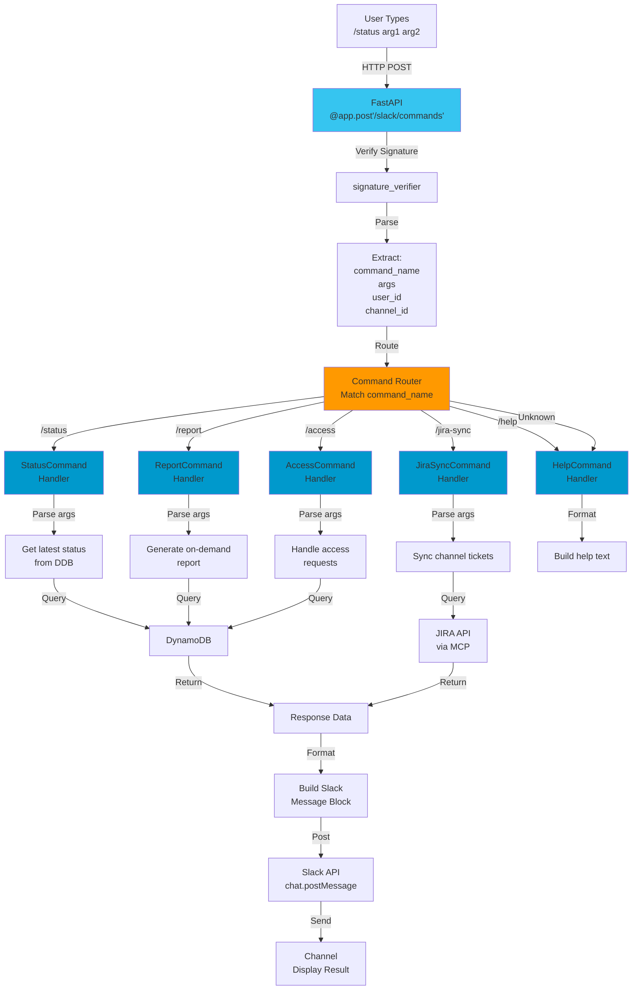
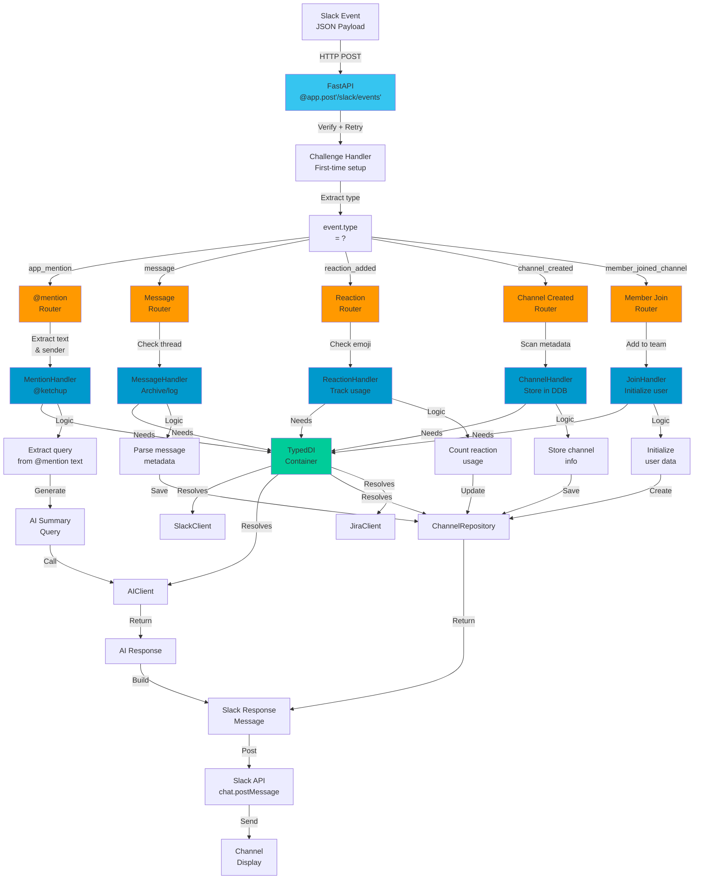
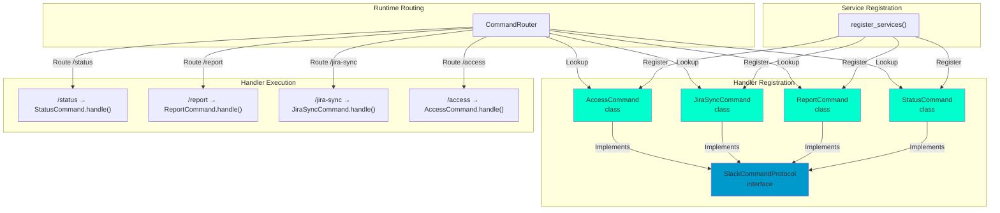
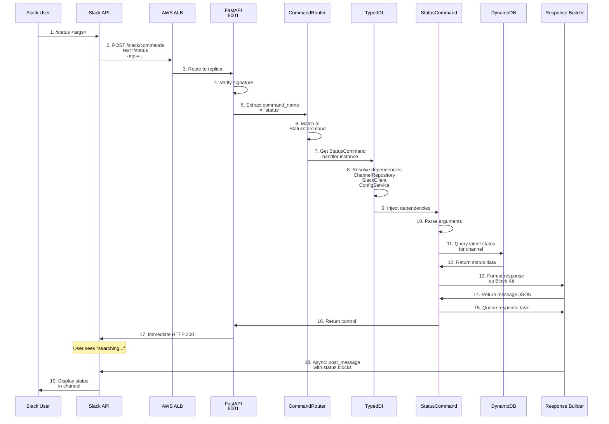
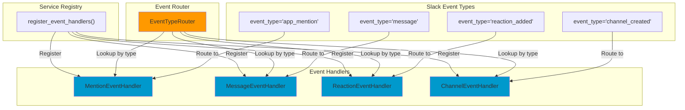

# Command & Event Routing Architecture

## Slash Command Routing



## Event Routing & Handler Registration



## Command Handler Registration Pattern



## Request Flow: /status Command Example



## Event Handler Registration Pattern



---

## Adding a New Slash Command

To add `/newcommand`:

1. **Create handler**: `packages/slack/commands/new_command.py`
   ```python
   class NewCommand(SlackCommandProtocol):
       async def handle(self, args: List[str]) -> SlackResponse:
           # implementation
   ```

2. **Implement protocol**: Must implement `SlackCommandProtocol` interface

3. **Register in DI**: Add to `packages/core/typed_di/service_registration.py`
   ```python
   registry.register(SlackCommandProtocol, NewCommand)
   ```

4. **Route in FastAPI**: Router will automatically discover via DI

5. **Test**: Write unit test with mocked dependencies

---

## Adding a New Event Handler

To handle a new Slack event type:

1. **Create handler**: `packages/slack/handlers/new_event_handler.py`
2. **Implement protocol**: `SlackEventProtocol`
3. **Register in router**: Add mapping in event router
4. **Get dependencies from DI**: Request needed services
5. **Test**: Mock Slack API responses
