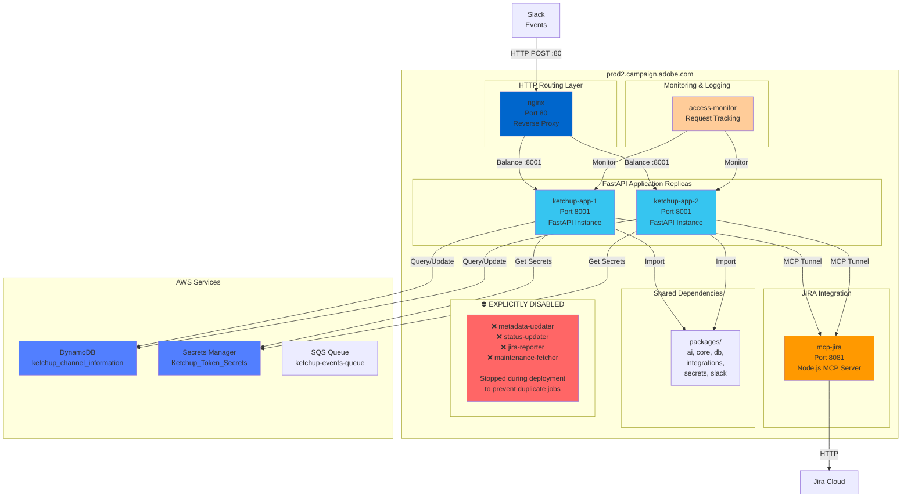
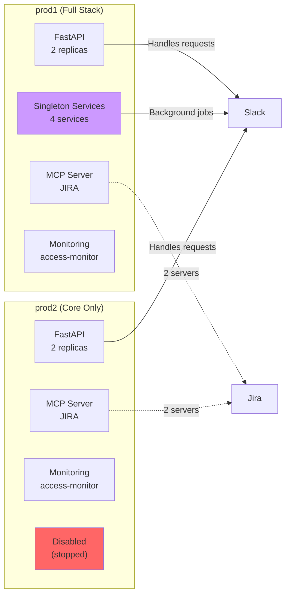
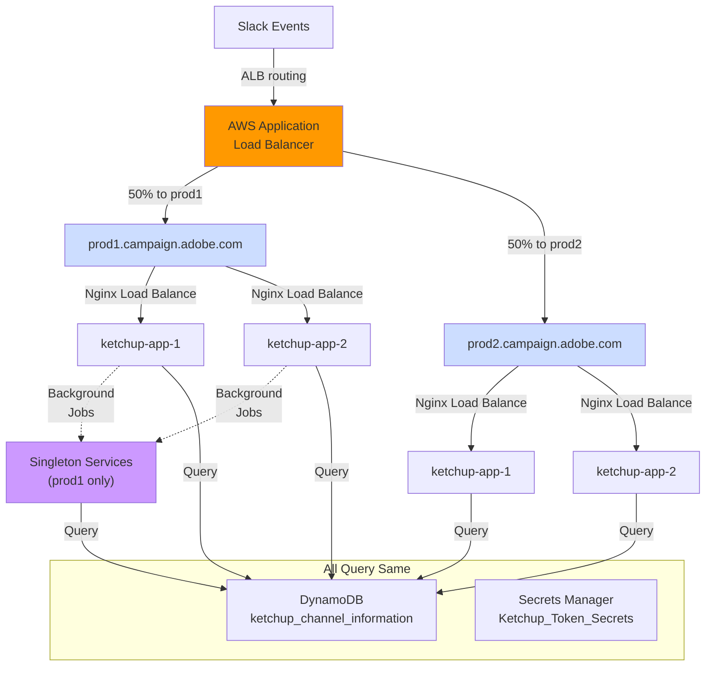
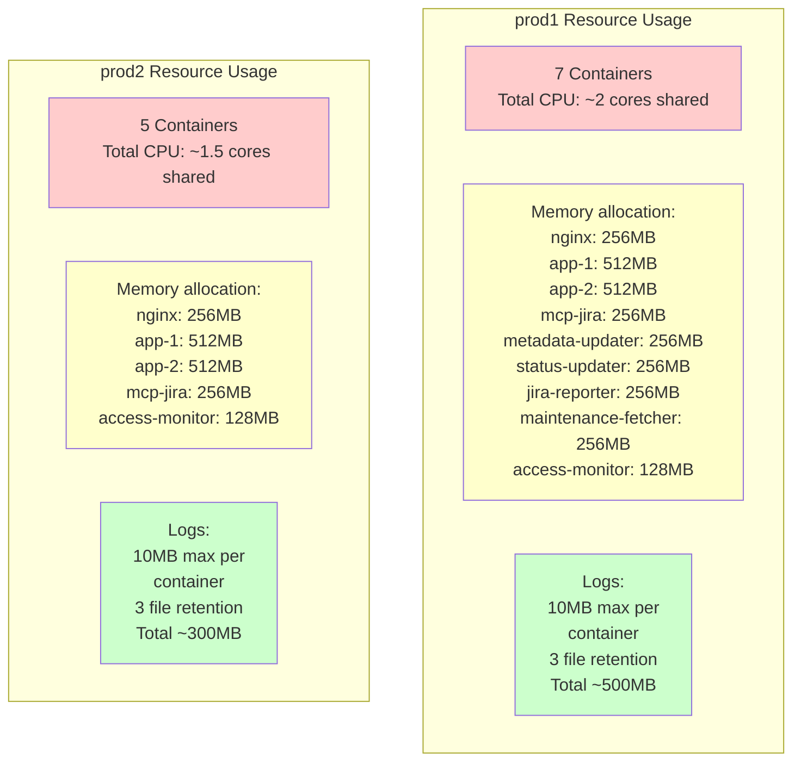

# Container Topology: Production Deployment

## Production Server 1 (Singletons Included)

```mermaid
graph TB
    subgraph "prod1.campaign.adobe.com"
        subgraph "HTTP Routing Layer"
            Nginx1["nginx<br/>Port 80<br/>Reverse Proxy"]
        end

        subgraph "FastAPI Application Replicas"
            App1["ketchup-app-1<br/>Port 8001<br/>FastAPI Instance"]
            App2["ketchup-app-2<br/>Port 8001<br/>FastAPI Instance"]
        end

        subgraph "JIRA Integration"
            MCP["mcp-jira<br/>Port 8081<br/>Node.js MCP Server"]
        end

        subgraph "Singleton Services (prod1 ONLY)"
            MetaUpdater["metadata-updater<br/>Channel Scanner<br/>Runs hourly"]
            StatusUpdater["status-updater<br/>Status Reporter<br/>Runs hourly"]
            JiraReporter["jira-reporter<br/>JIRA Automation<br/>Runs every 15m"]
            MaintenanceFetcher["maintenance-fetcher<br/>Maintenance Detector<br/>Runs every 5m"]
        end

        subgraph "Monitoring & Logging"
            AccessMonitor["access-monitor<br/>Request Tracking"]
        end

        subgraph "Shared Dependencies"
            Packages["packages/<br/>ai, core, db,<br/>integrations,<br/>secrets, slack"]
        end
    end

    subgraph "AWS Services"
        DDB["DynamoDB<br/>ketchup_channel_information"]
        Secrets["Secrets Manager<br/>Ketchup_Token_Secrets"]
        SQS["SQS Queue<br/>ketchup-events-queue"]
    end

    Input1["Slack<br/>Events"]
    Input1 -->|HTTP POST :80| Nginx1

    Nginx1 -->|Balance :8001| App1
    Nginx1 -->|Balance :8001| App2

    App1 -->|Import| Packages
    App2 -->|Import| Packages

    App1 -->|MCP Tunnel| MCP
    App2 -->|MCP Tunnel| MCP

    MCP -->|HTTP| JiraCloud["Jira Cloud"]

    MetaUpdater -->|Pull Tasks| SQS
    MetaUpdater -->|Import| Packages
    MetaUpdater -->|Post Responses| SlackAPI["Slack API"]

    StatusUpdater -->|Pull Tasks| SQS
    StatusUpdater -->|Import| Packages
    StatusUpdater -->|Post Responses| SlackAPI

    JiraReporter -->|Pull Tasks| SQS
    JiraReporter -->|Import| Packages
    JiraReporter -->|Post Responses| SlackAPI

    MaintenanceFetcher -->|Pull Tasks| SQS
    MaintenanceFetcher -->|Import| Packages
    MaintenanceFetcher -->|Post Responses| SlackAPI

    App1 -->|Query/Update| DDB
    App2 -->|Query/Update| DDB
    MetaUpdater -->|Query/Update| DDB
    StatusUpdater -->|Query/Update| DDB
    JiraReporter -->|Query/Update| DDB
    MaintenanceFetcher -->|Query/Update| DDB

    App1 -->|Get Secrets| Secrets
    App2 -->|Get Secrets| Secrets
    MCP -->|Get Secrets| Secrets
    MetaUpdater -->|Get Secrets| Secrets
    StatusUpdater -->|Get Secrets| Secrets
    JiraReporter -->|Get Secrets| Secrets
    MaintenanceFetcher -->|Get Secrets| Secrets

    AccessMonitor -->|Monitor| App1
    AccessMonitor -->|Monitor| App2

    style Nginx1 fill:#0066cc
    style App1 fill:#36c5f0
    style App2 fill:#36c5f0
    style MCP fill:#ff9900
    style MetaUpdater fill:#cc99ff
    style StatusUpdater fill:#cc99ff
    style JiraReporter fill:#cc99ff
    style MaintenanceFetcher fill:#cc99ff
    style AccessMonitor fill:#ffcc99
    style DDB fill:#527fff
    style Secrets fill:#527fff
    style SQS fill:#527fff
```



## Production Server 2 (Core Services Only)



## Service Comparison: prod1 vs prod2



## Load Balancing Across Servers



## Container Resource Allocation



## Deployment Strategy: Why Singletons Only on prod1?

**Problem**:
- Scheduled jobs (hourly status updates, JIRA reporting) cannot run on multiple servers
- Would create duplicate messages, duplicate tickets, race conditions
- Data conflicts in DynamoDB

**Solution**:
- Run singletons **only** on prod1
- Explicitly **stop and remove** these containers from prod2
- deployment script (deploy-ketchup.sh:505-506):
  ```bash
  # Remove singleton services from prod2
  ssh prod2 "docker-compose rm -f metadata-updater status-updater jira-reporter maintenance-fetcher"
  ```

**Benefits**:
- ✅ No duplicate scheduled jobs
- ✅ No race conditions on shared resources
- ✅ Clear "source of truth" for singleton work
- ✅ Reduces load on prod2 to core request handling
- ✅ Failover ready: if prod1 fails, can manually run singletons on prod2

---

**Total Containers**: 14 (7 on prod1, 5 on prod2, plus 2 monitoring)
**Total Services**: 9 (FastAPI, MCP, 4 singletons, 1 metadata updater, 1 access monitor, 1 jira reporter)
