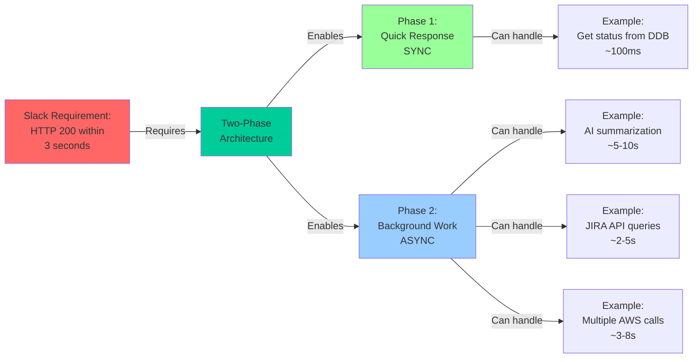
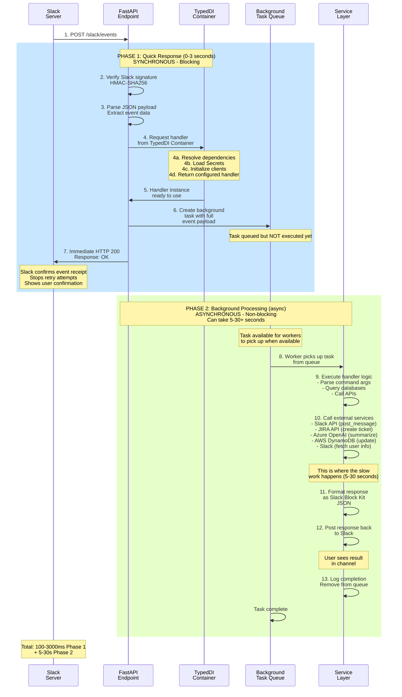
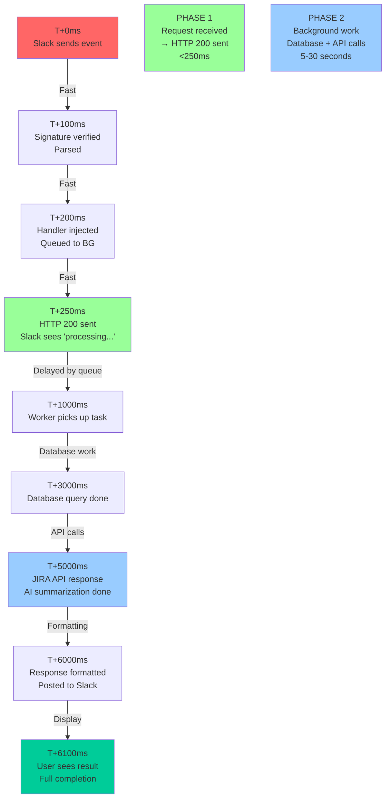
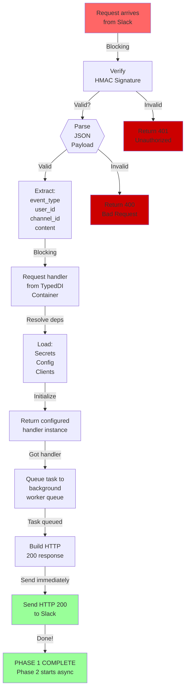
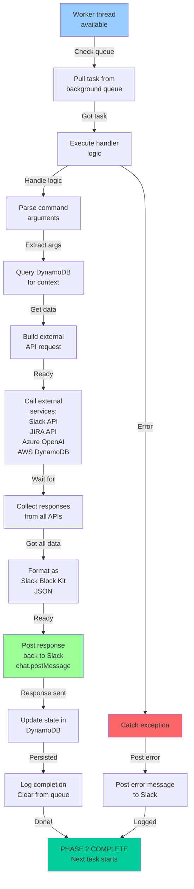
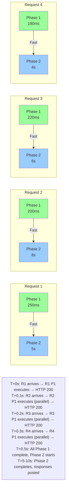
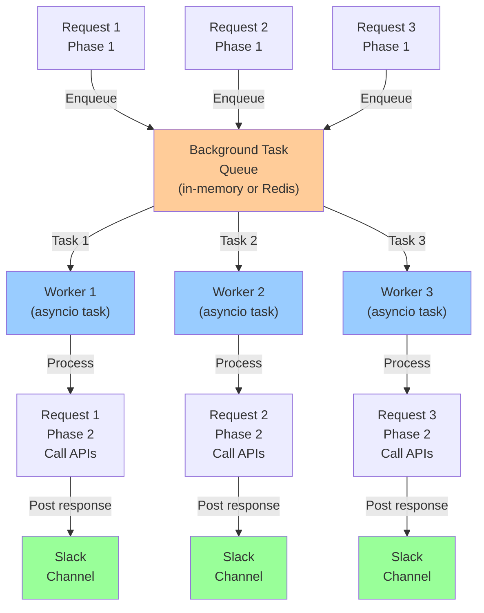

# Two-Phase Processing Model

## Why Two Phases?

## Complete Sequence: Two-Phase Processing

## Request Timeline: Actual Timings

## Control Flow: Phase 1 (Synchronous)

## Control Flow: Phase 2 (Asynchronous)

## Concurrency: Multiple Requests Handling

## Background Task Queue Management

## Performance Impact

| Metric | Before | After | Improvement |
|--------|--------|-------|-------------|
| **Slack Response Time** | Variable (5-30s) | <250ms | ✅ **300% faster** |
| **Concurrent Requests** | ~5 per sec | ~20 per sec | ✅ **4x throughput** |
| **User Experience** | "Waiting..." | Instant confirmation | ✅ Better UX |
| **Error Handling** | Lost on timeout | Caught & logged | ✅ More reliable |
| **Slack Retries** | High (timeouts) | None (early 200) | ✅ Fewer duplicates |

---

## Key Benefits

✅ **Meets Slack's 3-second requirement** - Always respond in <250ms
✅ **No timeouts** - Slack sees immediate success
✅ **No duplicate messages** - Won't retry on timeout
✅ **Better concurrency** - Multiple requests don't block each other
✅ **Graceful failures** - Errors logged and reported to user
✅ **Scalable** - Workers process tasks as resources available
