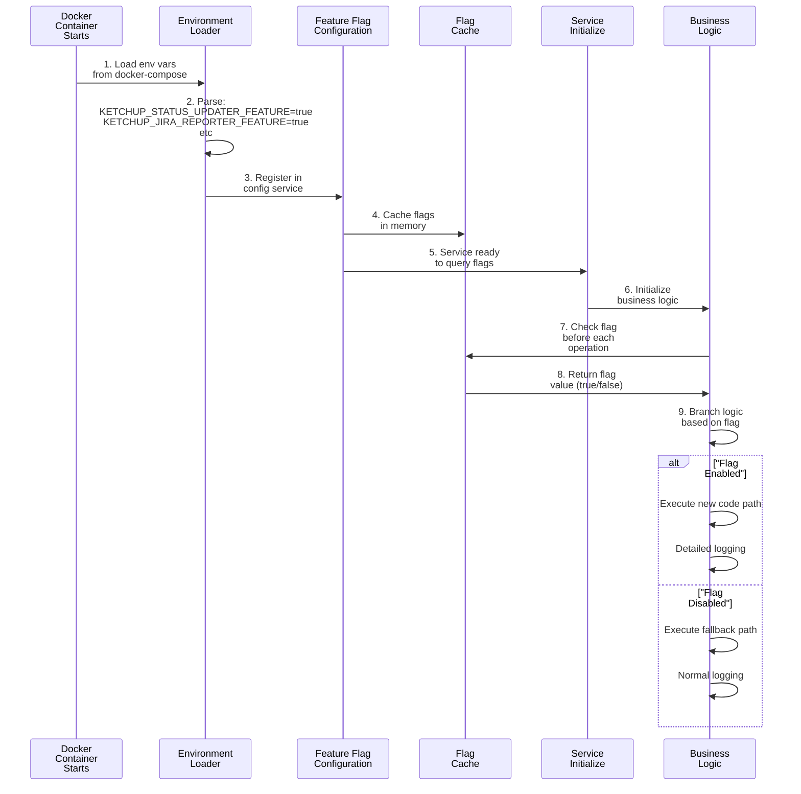
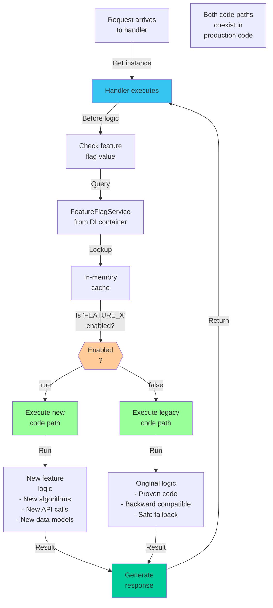
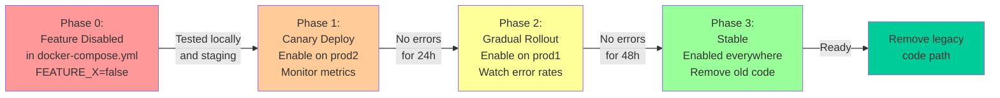
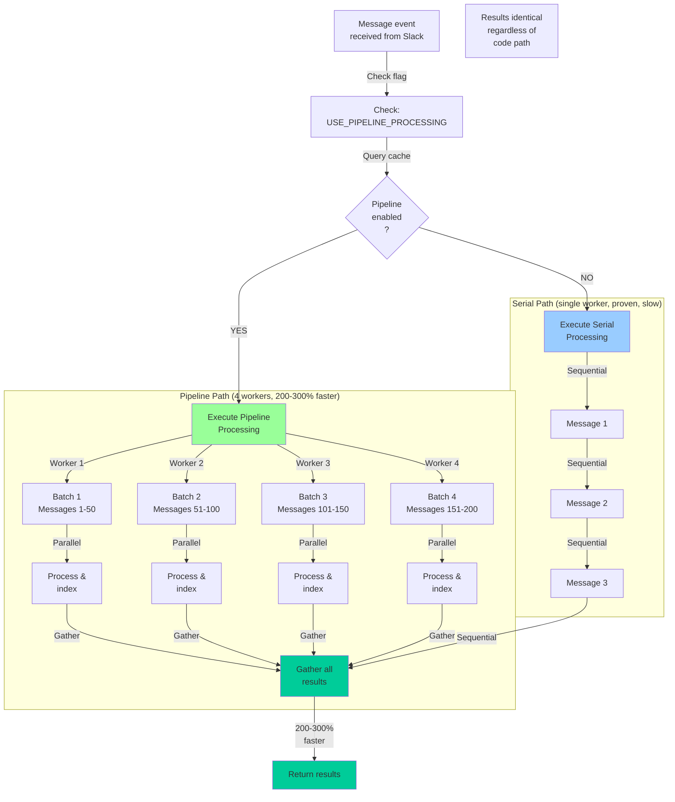
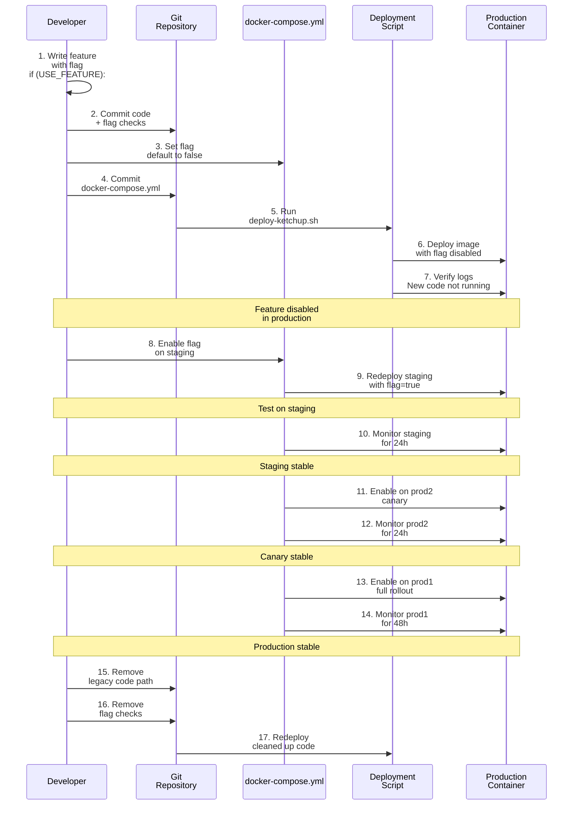

# Feature Flag Control Flow & Architecture

## Feature Flags Overview

```mermaid
graph TB
    subgraph "Environment Configuration"
        DockerCompose["docker-compose.yml<br/>Source of Truth"]
    end

    subgraph "Feature Flags"
        FF1["KETCHUP_STATUS_UPDATER_FEATURE"]
        FF2["KETCHUP_JIRA_REPORTER_FEATURE"]
        FF3["KETCHUP_TRUST_ENDORSEMENT_FEATURE"]
        FF4["KETCHUP_ACCESS_REQUEST_AUTOMATION_FEATURE"]
        FF5["USE_PIPELINE_PROCESSING"]
        FF6["KETCHUP_USE_HTTPX"]
        FF7["KETCHUP_HTTP2_ENABLED"]
        FF8["KETCHUP_KEEPALIVE_ENABLED"]
    end

    subgraph "Services Using Flags"
        StatusSvc["Status Updater<br/>Service"]
        JiraSvc["JIRA Reporter<br/>Service"]
        TrustSvc["Trust & Endorsement<br/>Service"]
        AccessSvc["Access Request<br/>Service"]
        PipelineSvc["Message Processing<br/>Pipeline"]
        HttpSvc["HTTP Client<br/>Layer"]
    end

    DockerCompose -->|Defines| FF1
    DockerCompose -->|Defines| FF2
    DockerCompose -->|Defines| FF3
    DockerCompose -->|Defines| FF4
    DockerCompose -->|Defines| FF5
    DockerCompose -->|Defines| FF6
    DockerCompose -->|Defines| FF7
    DockerCompose -->|Defines| FF8

    FF1 -->|Controls| StatusSvc
    FF2 -->|Controls| JiraSvc
    FF3 -->|Controls| TrustSvc
    FF4 -->|Controls| AccessSvc
    FF5 -->|Controls| PipelineSvc
    FF6 -->|Controls| HttpSvc
    FF7 -->|Controls| HttpSvc
    FF8 -->|Controls| HttpSvc

    style DockerCompose fill:#ff9900
    style FF1 fill:#0099cc
    style FF2 fill:#0099cc
    style FF3 fill:#0099cc
    style FF4 fill:#0099cc
    style FF5 fill:#0099cc
    style FF6 fill:#0099cc
    style FF7 fill:#0099cc
    style FF8 fill:#0099cc
```



## Feature Flag Resolution Flow



## In-Service Feature Flag Check



## Safe Rollout Pattern: Gradual Feature Enablement



## Example: Pipeline Processing Feature Flag



## Feature Flag Configuration: docker-compose.yml

```yaml
# Status & Reporting
KETCHUP_STATUS_UPDATER_FEATURE=true          # Enable hourly status reports
KETCHUP_JIRA_REPORTER_FEATURE=true           # Enable JIRA automation

# Access Control
KETCHUP_ACCESS_REQUEST_AUTOMATION_FEATURE=true
KETCHUP_TRUST_ENDORSEMENT_FEATURE=true       # Enable trust scoring

# Performance Optimizations
USE_PIPELINE_PROCESSING=true                  # 200-300% faster (PR #198)
KETCHUP_USE_HTTPX=true                        # HTTP/2 support
KETCHUP_HTTP2_ENABLED=true                    # Enable multiplexing
KETCHUP_KEEPALIVE_ENABLED=true                # Connection pooling
KETCHUP_KEEPALIVE_TIMEOUT=60                  # Seconds before reuse
KETCHUP_DNS_CACHE_TTL=300                     # Cache DNS 5 minutes

# Network Optimization
KETCHUP_HTTPX_POOL_SIZE=100                   # Connection pool size
KETCHUP_HTTPX_MAX_KEEPALIVE=50                # Max keepalive connections
```

## Feature Flag Lifecycle



## Performance Impact of Feature Flags

| Feature | Enabled | Disabled | Impact |
|---------|---------|----------|--------|
| **Pipeline Processing** | Concurrent 4x workers | Single worker | 200-300% faster |
| **HTTP/2** | Multiplexing | HTTP/1.1 | 5-8% faster |
| **Keep-Alive** | Connection reuse | New connection | 94.7% reuse rate |
| **DNS Cache** | 5min TTL | Each request | Fewer lookups |
| **Status Updater** | Hourly reports | Manual only | Saves 5+ hours/week |
| **JIRA Reporter** | Auto-sync | Manual | 100% accuracy |
| **Access Automation** | Auto-approve | Manual review | Fast onboarding |

## Adding a New Feature Flag

### Step 1: Define the flag
```python
# packages/core/feature_flags.py
class FeatureFlagConfig:
    MY_NEW_FEATURE = 'KETCHUP_MY_NEW_FEATURE'
```

### Step 2: Use in code with guard
```python
# In handler or service
if self.feature_flag_service.is_enabled(FeatureFlagConfig.MY_NEW_FEATURE):
    # New code path
    result = new_implementation()
else:
    # Legacy code path
    result = legacy_implementation()
```

### Step 3: Add to docker-compose.yml
```yaml
environment:
  KETCHUP_MY_NEW_FEATURE=false  # Start disabled
```

### Step 4: Deploy and enable gradually
```bash
# Stage 1: Deployed but disabled (safe)
./deploy-ketchup.sh

# Stage 2: Enable on prod2 for testing
# Edit docker-compose.yml on prod2, set to true
# Monitor for 24h

# Stage 3: Enable on prod1
# Edit docker-compose.yml on prod1, set to true
# Monitor for 48h

# Stage 4: Remove old code path
# Delete legacy implementation
```

---

## Best Practices

✅ **Always start disabled** - Deploy with flag=false for safety
✅ **Test extensively** - Both enabled and disabled paths
✅ **Monitor metrics** - Error rates, latency, throughput
✅ **Gradual rollout** - Staging → prod2 canary → prod1
✅ **Keep legacy code** - Until 100% stable in production
✅ **Document decisions** - Why feature exists, when to remove
✅ **Timeline awareness** - Remove legacy code after 2-4 weeks stable

---

**Source of Truth**: Always check `infrastructure/docker-compose.yml` for current feature flag state
