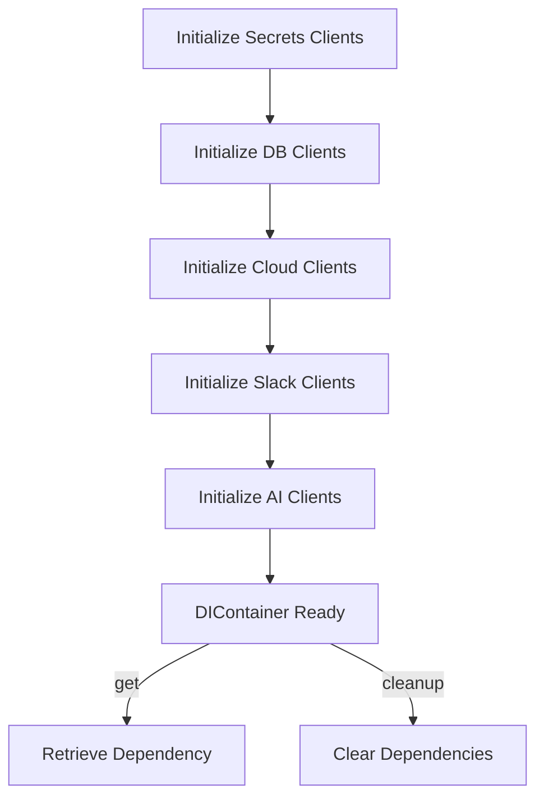
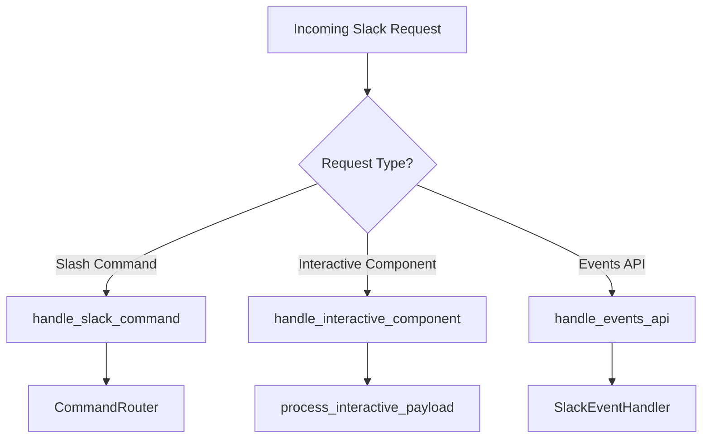
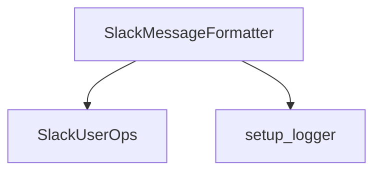
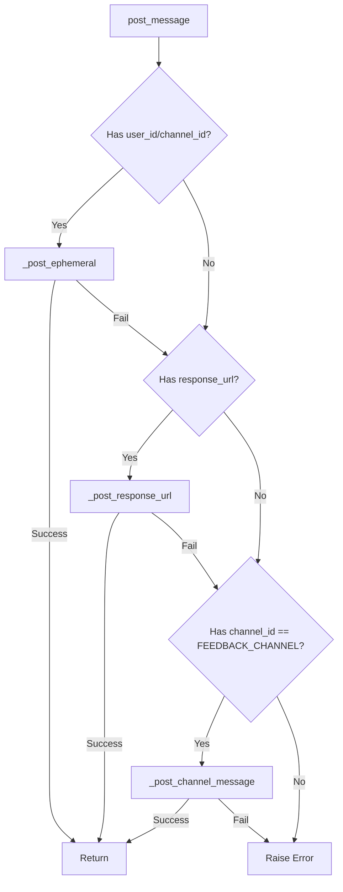
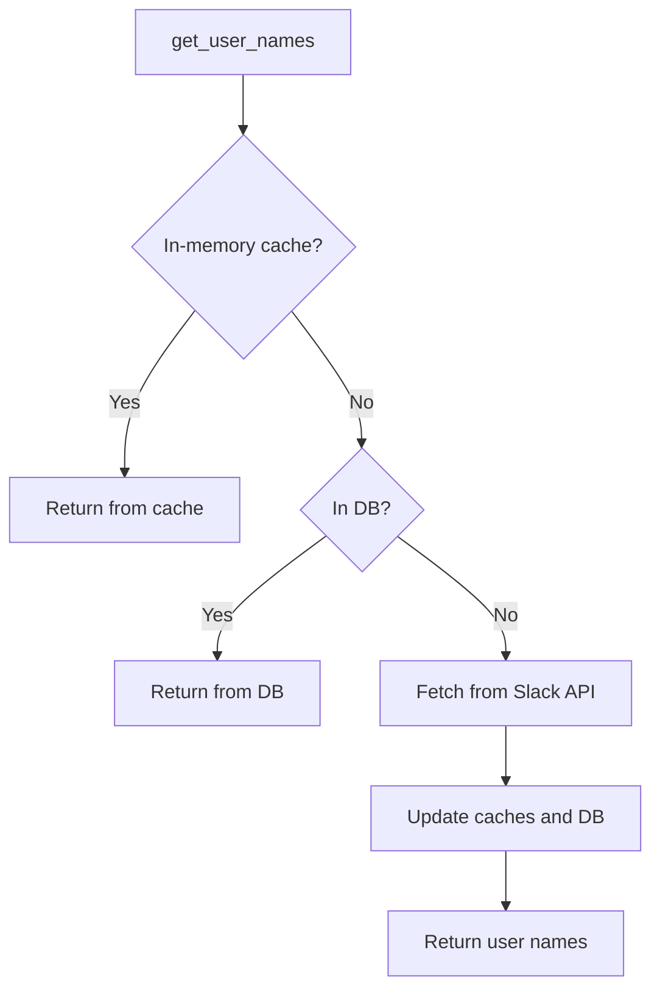

# Ketchup Codebase Walkthrough Documentation Plan

## Table of Contents

- [1. Purpose and Audience](#1-purpose-and-audience)
  - [1.1. What is Ketchup? (Overview and Design)](#11-what-is-ketchup-overview-and-design)
- [2. Document Structure](#2-document-structure)
  - [2.1. Documentation Structure Guidelines](#21-documentation-structure-guidelines)
- [Limitations of Throttling Mitigation in Lambda](#limitations-of-throttling-mitigation-in-lambda)
- [Application Entry Point and Core Request Flow](#application-entry-point-and-core-request-flow)
  - [Detailed File Walkthrough: lambda_function.py](#detailed-file-walkthrough-lambda_functionpy)
- [Phase 2: Dependency Injection and Factory System Deep Dive](#phase-2-dependency-injection-and-factory-system-deep-dive)
  - [DI Container Analysis: core/di_container.py](#di-container-analysis-coredi_containerpy)
  - [Client Factory System Analysis: core/client_factory/secrets_factory.py](#client-factory-system-analysis-coreclient_factorysecrets_factorypy)
  - [Client Factory System Analysis: core/client_factory/slack_factory.py](#client-factory-system-analysis-coreclient_factoryslack_factorypy)
  - [Client Factory System Analysis: core/client_factory/db_factory.py](#client-factory-system-analysis-coreclient_factorydb_factorypy)
  - [Client Factory System Analysis: core/client_factory/ai_factory.py](#client-factory-system-analysis-coreclient_factoryai_factorypy)
  - [Client Factory System Analysis: core/client_factory/cloud_factory.py](#client-factory-system-analysis-coreclient_factorycloud_factorypy)
  - [Client Factory System Analysis: core/client_factory_utils.py](#client-factory-system-analysis-coreclient_factory_utilspy)
- [Phase 3: Async Clients and Their Roles in the Codebase](#phase-3-async-clients-and-their-roles-in-the-codebase)
  - [3.1 Base AsyncClient (core/async_client.py)](#31-base-asyncclient-coreasync_clientpy)
  - [3.2 SlackAsyncClient (slack/core/slack_async_client.py)](#32-slackasyncclient-slackcoreslack_async_clientpy)
  - [3.3 AzureOpenAIAsyncClient (ai/core/azure_async_client.py)](#33-azureopeniasyncclient-aicoreazure_async_clientpy)
  - [3.4 DynamoDBAsyncClient (db/core/dynamodb_async_client.py)](#34-dynamodbasyncclient-dbcoredynamodb_async_clientpy)
- [Phase 4: Module-by-Module Intensive Code Walkthrough](#phase-4-module-by-module-intensive-code-walkthrough)
  - [Core Module Overview & Structure](#core-module-overview--structure)
  - [Core Module File/Component Index](#core-module-filecomponent-index)
  - [Detailed File Walkthroughs](#detailed-file-walkthroughs)
    - Core Module
      - [core/di_container.py](#detailed-file-walkthrough-coredi_containerpy)
      - [core/client_factory_utils.py](#detailed-file-walkthrough-coreclient_factory_utilspypy)
      - [core/client_factory/secrets_factory.py](#detailed-file-walkthrough-coreclient_factorysecrets_factorypy)
      - [core/client_factory/slack_factory.py](#detailed-file-walkthrough-coreclient_factoryslack_factorypy)
      - [core/client_factory/db_factory.py](#detailed-file-walkthrough-coreclient_factorydb_factorypy)
      - [core/client_factory/ai_factory.py](#detailed-file-walkthrough-coreclient_factoryai_factorypy)
      - [core/client_factory/cloud_factory.py](#detailed-file-walkthrough-coreclient_factorycloud_factorypy)
      - [core/exceptions.py](#detailed-file-walkthrough-coreexceptionspy)
      - [core/logging.py](#detailed-file-walkthrough-coreloggingpy)
      - [core/constants.py](#detailed-file-walkthrough-coreconstantspy)
      - [core/event_parsing_utils.py](#detailed-file-walkthrough-coreevent_parsing_utilspy)
      - [core/cleanup_utils.py](#detailed-file-walkthrough-corecleanup_utilspy)
      - [core/utils.py](#detailed-file-walkthrough-coreutilspy)
      - [core/time_utils.py](#detailed-file-walkthrough-coretime_utilspy)
      - [core/async_client.py](#detailed-file-walkthrough-coreasync_clientpy)
      - [core/http/session_management.py](#detailed-file-walkthrough-corehttpsession_managementpy)
      - [core/resilience/backoff.py](#detailed-file-walkthrough-coreresiliencebackoffpy)
    - AI Module
    - [AI Module File/Component Index](#ai-module-filecomponent-index)
      - [ai/core/openai_factory.py](#detailed-file-walkthrough-aicoreopenai_factorypy)
      - [ai/model_prompts.py](#detailed-file-walkthrough-aimodel_promptspy)
      - [ai/cost_calculator.py](#detailed-file-walkthrough-aicost_calculatorpy)
      - [ai/core/azure_async_client.py](#detailed-file-walkthrough-aicoreazure_async_clientpy)
      - [ai/core/openai_handler.py](#detailed-file-walkthrough-aicoreopenai_handlerpy)
      - [ai/core/token_utils.py](#detailed-file-walkthrough-aicoretoken_utilspy)
      - [ai/core/operations/token_management.py](#detailed-file-walkthrough-aicoreoperationstoken_managementpy)
      - [ai/core/operations/message_preparation.py](#detailed-file-walkthrough-aicoreoperationsmessage_preparationpy)
      - [ai/core/operations/api_interaction.py](#detailed-file-walkthrough-aicoreoperationsapi_interactionpy)
      - [ai/prompts/short_summary.py](#detailed-file-walkthrough-aipromptshort_summarypy)
      - [ai/prompts/long_summary.py](#detailed-file-walkthrough-aipromptslong_summarypy)
      - [ai/prompts/customer_extraction.py](#detailed-file-walkthrough-aipromptsextractionpy)
      - [ai/prompts/status.py](#detailed-file-walkthrough-aipromptsstatuspy)
      - [ai/prompts/common_guidelines.py](#detailed-file-walkthrough-aipromptscommon_guidelinespy)
      - [ai/prompts/query.py](#detailed-file-walkthrough-aipromptsquerypy)
      - [ai/prompts/report.py](#detailed-file-walkthrough-aipromptreportpy)
    - Cloud Module
    - [Cloud Module File/Component Index](#cloud-module-filecomponent-index)
      - [cloud/metrics.py](#detailed-file-walkthrough-cloudmetricspy)
    - Database Module
    - [Database Module File/Component Index](#db-module-filecomponent-index)
      - [db/dynamodb_store.py](#detailed-file-walkthrough-dbdynamodb_storepy)
      - [db/batch_write_utils.py](#detailed-file-walkthrough-dbbatch_write_utilspy)
      - [db/user_store.py](#detailed-file-walkthrough-dbuser_storepy)
      - [db/operations/base_operations.py](#detailed-file-walkthrough-dboperationsbase_operationspy)
      - [db/operations/channel_operations.py](#detailed-file-walkthrough-dboperationschannel_operationspy)
      - [db/operations/archive_operations.py](#detailed-file-walkthrough-dboperationsarchive_operationspy)
      - [db/operations/feedback_operations.py](#detailed-file-walkthrough-dboperationsfeedback_operationspy)
      - [db/operations/channel_query_operations.py](#detailed-file-walkthrough-dboperationschannel_query_operationspy)
      - [db/operations/restore_state_operations.py](#detailed-file-walkthrough-dboperationsrestore_state_operationspy)
      - [db/operations/channel_filter_operations.py](#detailed-file-walkthrough-dboperationschannel_filter_operationspy)
      - [db/models/channel_metadata.py](#detailed-file-walkthrough-dbmodelschannel_metadatapy)
      - [db/config/dynamodb_config.py](#detailed-file-walkthrough-dbconfigdynamodb_configpy)
      - [db/core/dynamodb_async_client.py](#detailed-file-walkthrough-dbcoredynamodb_async_clientpy)
    - Secrets Module
    - [Cloud Module File/Component Index](#cloud-module-filecomponent-index)
      - [secrets/manager.py](#detailed-file-walkthrough-secretsmanagerpy)
    - Slack Module
    - [Slack Module File/Component Index](#slack-module-filecomponent-index)
      - [slack/authorisation/auth.py](#detailed-file-walkthrough-slackauthorisationauthpy)
      - [slack/authorisation/user_verification.py](#detailed-file-walkthrough-slackauthorisationuser_verificationpy)
      - [slack/blockkits/base.py](#detailed-file-walkthrough-slackblockbasespy)
      - [slack/blockkits/formatters.py](#detailed-file-walkthrough-slackblockkitsformatterspy)
      - [slack/home/home.py](#detailed-file-walkthrough-slackhomehomepy)
      - [slack/blockkits/handlers/blockkit_message_utils.py](#detailed-file-walkthrough-slackblockitshandlersblockkit_message_utilspy)
      - [slack/blockkits/handlers/archive.py](#detailed-file-walkthrough-slackblockitshandlersarchivepy)
      - [slack/blockkits/handlers/report.py](#detailed-file-walkthrough-slackblockitshandlersreportpy)
      - [slack/blockkits/handlers/summary.py](#detailed-file-walkthrough-slackblockitshandlerssummarypy)
      - [slack/blockkits/handlers/query.py](#detailed-file-walkthrough-slackblockitshandlersquerypy)
      - [slack/blockkits/handlers/status.py](#detailed-file-walkthrough-slackblockitshandlersstatuspy)
      - [slack/blockkits/handlers/lookup.py](#detailed-file-walkthrough-slackblockitshandlerslookuppy)
      - [slack/channel_events/events.py](#detailed-file-walkthrough-slackchannel_eventseventsspy)
      - [slack/channel_events/eligibility/creation_checker.py](#detailed-file-walkthrough-slackchannel_eventseligibilitycreation_checkerpy)
      - [slack/channel_events/eligibility/ineligible_handler.py](#detailed-file-walkthrough-slackchannel_eventseligibilityineligible_handlerpy)
      - [slack/channel_events/processing/archive_processor.py](#detailed-file-walkthrough-slackchannel_eventsprocessingarchive_processorpy)
      - [slack/channel_events/processing/creation_processor.py](#detailed-file-walkthrough-slackchannel_eventsprocessingcreation_processorpy)
      - [slack/channel_events/processing/join_processor.py](#detailed-file-walkthrough-slackchannel_eventsprocessingjoin_processorpy)
      - [slack/channel_events/processing/unarchive_processor.py](#detailed-file-walkthrough-slackchannel_eventsprocessingunarchive_processorpy)
      - [slack/channel_events/request_processing/dependency_setup.py](#detailed-file-walkthrough-slackrequest_processingdependency_setuppy)
      - [slack/channel_events/request_processing/routing.py](#detailed-file-walkthrough-slackrequest_processingroutingpy)
      - [slack/channel_events/request_processing/verification_parsing.py](#detailed-file-walkthrough-slackrequest_processingverification_parsingpy)
      - [slack/channel_operations/channel_archive_ops.py](#detailed-file-walkthrough-slackchannel_operationschannel_archive_opspy)
      - [slack/channel_operations/channel_bot_membership_ops.py](#detailed-file-walkthrough-slackchannel_operationschannel_bot_membership_opspy)
      - [slack/channel_operations/channel_eligibility.py](#detailed-file-walkthrough-slackchannel_operationschannel_eligibilitypy)
      - [slack/channel_operations/channel_info_ops.py](#detailed-file-walkthrough-slackchannel_operationschannel_info_opspy)
      - [slack/channel_operations/channel_membership_ops.py](#detailed-file-walkthrough-slackchannel_operationschannel_membership_opspy)
      - [slack/channel_operations/channel_msg_ops.py](#detailed-file-walkthrough-slackchannel_operationschannel_msg_opspy)
      - [slack/channel_operations/channel_name_resolver.py](#detailed-file-walkthrough-slackchannel_operationschannel_name_resolverpy)
      - [slack/channel_operations/channel_restore_ops.py](#detailed-file-walkthrough-slackchannel_operationschannel_restore_opspy)
      - [slack/channel_operations/restore_state_manager.py](#detailed-file-walkthrough-slackchannel_operationsrestore_state_managerpy)
      - [slack/channel_operations/slack_message_formatter.py](#detailed-file-walkthrough-slackchannel_operationsslack_message_formatterpy)
      - [slack/command_processing/command_parameters/models.py](#detailed-file-walkthrough-slackcommand_processingcommand_parametersmodelspy)
      - [slack/command_processing/command_parameters/parser.py](#detailed-file-walkthrough-slackcommand_processingcommand_parametersparserpy)
      - [slack/command_processing/command_parameters/validation.py](#detailed-file-walkthrough-slackcommand_processingcommand_parametersvalidationpy)
      - [slack/command_processing/command_parameters/extractors/archive.py](#detailed-file-walkthrough-slackcommand_processingcommand_parametersextractorsarchivepy)
      - [slack/command_processing/command_parameters/extractors/list.py](#detailed-file-walkthrough-slackcommand_processingcommand_parametersextractorslistpy)
      - [slack/command_processing/command_parameters/extractors/query.py](#detailed-file-walkthrough-slackcommand_processingcommand_parametersextractorsquerypy)
      - [slack/command_processing/command_parameters/extractors/status_report.py](#detailed-file-walkthrough-slackcommand_parametersextractorsstatuspy)
      - [slack/command_processing/command_parameters/extractors/summary.py](#detailed-file-walkthrough-slackcommand_parametersextractorssummarypy)
      - [slack/command_processing/archive_command.py](#detailed-file-walkthrough-slackcommand_processingarchive_commandpy)
      - [slack/command_processing/base_command_handler.py](#detailed-file-walkthrough-slackcommand_processingbase_command_handlerpy)
      - [slack/command_processing/command_decorators.py](#detailed-file-walkthrough-slackcommand_processingcommand_decoratorspy)
      - [slack/command_processing/command_router.py](#detailed-file-walkthrough-slackcommand_processingcommand_routerpy)
      - [slack/command_processing/list_command.py](#detailed-file-walkthrough-slackcommand_processinglist_commandpy)
      - [slack/command_processing/query_command.py](#detailed-file-walkthrough-slackcommand_processingquery_commandpy)
      - [slack/command_processing/short_long_command.py](#detailed-file-walkthrough-slackcommand_processingshort_long_commandpy)
      - [slack/command_processing/status_report_command.py](#detailed-file-walkthrough-slackcommand_processingstatus_report_commandpy)
      - [slack/command_processing/verify_command.py](#detailed-file-walkthrough-slackcommand_processingverify_commandpy)
      - [slack/config/slack_config.py](#detailed-file-walkthrough-slackconfigslack_configpy)
      - [slack/core/slack_async_client.py](#detailed-file-walkthrough-slackcoreaslack_async_clientpy)
      - [slack/formatters/utils.py](#detailed-file-walkthrough-slackformattersutilspy)
      - [slack/interactive_elements/channel_metadata_edit.py](#detailed-file-walkthrough-slackinteractive_elementschannel_metadata_editpy)
      - [slack/interactive_elements/feedback_report.py](#detailed-file-walkthrough-slackinteractive_elementsfeedback_reportpy)
      - [slack/interactive_elements/payload_processor.py](#detailed-file-walkthrough-slackinteractive_elementspayload_processorpy)
      - [slack/interactive_elements/shortcuts.py](#detailed-file-walkthrough-slackinteractive_elementsshortcutspy)
      - [slack/interactive_elements/view_submissions.py](#detailed-file-walkthrough-slackinteractive_elementsview_submissionspy)
      - [slack/messages/posting.py](#detailed-file-walkthrough-slackmessagespostingpy)
      - [slack/user_operations/user_ops.py](#detailed-file-walkthrough-slackuser_operationsuser_opspy)
- [Phase 5: Command/Event Flow Tracing](#phase-5-commandevent-flow-tracing)
  - [5.1 Slash Command Handling Flow](#51-slash-command-handling-flow)
  - [5.2 Slack Event Handling Flow](#52-slack-event-handling-flow)
- [Phase 6: Consolidated Best Practices and Patterns (Detailed)](#phase-6-consolidated-best-practices-and-patterns-detailed)
  - [Dependency Injection (DI)](#dependency-injection-di)
  - [Logging](#logging)
  - [Error Handling](#error-handling)
  - [Resource Management](#resource-management)
  - [Observability](#observability)
  - [How to Add a New Client](#how-to-add-a-new-client)
  - [How to Add a New Command](#how-to-add-a-new-command)
  - [How to Add a New Event Handler](#how-to-add-a-new-event-handler)

---

## Directory Structure

```text
packages
├── __init__.py
├── ai
│   ├── __init__.py
│   ├── core
│   │   ├── __init__.py
│   │   ├── azure_async_client.py
│   │   ├── openai_factory.py
│   │   ├── openai_handler.py
│   │   ├── operations
│   │   │   ├── api_interaction.py
│   │   │   ├── message_preparation.py
│   │   │   └── token_management.py
│   │   └── token_utils.py
│   ├── cost_calculator.py
│   ├── model_prompts.py
│   └── prompts
│       ├── __init__.py
│       ├── common_guidelines.py
│       ├── customer_extraction.py
│       ├── long_summary.py
│       ├── query.py
│       ├── report.py
│       ├── short_summary.py
│       └── status.py
├── cloud
│   ├── __init__.py
│   └── metrics.py
├── core
│   ├── __init__.py
│   ├── async_client.py
│   ├── cleanup_utils.py
│   ├── client_factory
│   │   ├── __init__.py
│   │   ├── ai_factory.py
│   │   ├── cloud_factory.py
│   │   ├── core_factory.py
│   │   ├── db_factory.py
│   │   ├── secrets_factory.py
│   │   └── slack_factory.py
│   ├── client_factory_utils.py
│   ├── constants.py
│   ├── di_container.py
│   ├── event_parsing_utils.py
│   ├── exceptions.py
│   ├── http
│   │   ├── __init__.py
│   │   └── session_management.py
│   ├── logging.py
│   ├── rate_limiting
│   ├── resilience
│   │   ├── __init__.py
│   │   └── backoff.py
│   ├── time_utils.py
│   └── utils.py
├── db
│   ├── __init__.py
│   ├── batch_write_utils.py
│   ├── config
│   │   ├── __init__.py
│   │   └── dynamodb_config.py
│   ├── core
│   │   ├── __init__.py
│   │   └── dynamodb_async_client.py
│   ├── dynamodb_store.py
│   ├── models
│   │   ├── __init__.py
│   │   └── channel_metadata.py
│   ├── operations
│   │   ├── __init__.py
│   │   ├── archive_operations.py
│   │   ├── base_operations.py
│   │   ├── channel_filter_operations.py
│   │   ├── channel_operations.py
│   │   ├── channel_query_operations.py
│   │   ├── feedback_operations.py
│   │   └── restore_state_operations.py
│   └── user_store.py
├── secrets
│   ├── __init__.py
│   └── manager.py
└── slack
    ├── __init__.py
    ├── authorisation
    │   ├── __init__.py
    │   ├── auth.py
    │   └── user_verification.py
    ├── blockkits
    │   ├── __init__.py
    │   ├── base.py
    │   ├── formatters.py
    │   └── handlers
    │       ├── __init__.py
    │       ├── archive.py
    │       ├── blockkit_message_utils.py
    │       ├── lookup.py
    │       ├── query.py
    │       ├── report.py
    │       ├── status.py
    │       └── summary.py
    ├── channel_events
    │   ├── __init__.py
    │   ├── eligibility
    │   │   ├── __init__.py
    │   │   ├── creation_checker.py
    │   │   └── ineligible_handler.py
    │   ├── events.py
    │   ├── incoming_events.py
    │   ├── processing
    │   │   ├── __init__.py
    │   │   ├── archive_processor.py
    │   │   ├── creation_processor.py
    │   │   ├── join_processor.py
    │   │   └── unarchive_processor.py
    │   └── request_processing
    │       ├── __init__.py
    │       ├── dependency_setup.py
    │       ├── routing.py
    │       └── verification_parsing.py
    ├── channel_operations
    │   ├── __init__.py
    │   ├── channel_archive_ops.py
    │   ├── channel_bot_membership_ops.py
    │   ├── channel_eligibility.py
    │   ├── channel_info_ops.py
    │   ├── channel_membership_ops.py
    │   ├── channel_msg_ops.py
    │   ├── channel_restore_ops.py
    │   ├── restore_state_manager.py
    │   └── slack_message_formatter.py
    ├── command_processing
    │   ├── __init__.py
    │   ├── archive_command.py
    │   ├── base_command_handler.py
    │   ├── command_decorators.py
    │   ├── command_parameters
    │   │   ├── __init__.py
    │   │   ├── extractors
    │   │   │   ├── __init__.py
    │   │   │   ├── archive.py
    │   │   │   ├── list.py
    │   │   │   ├── query.py
    │   │   │   ├── status_report.py
    │   │   │   └── summary.py
    │   │   ├── models.py
    │   │   ├── parser.py
    │   │   └── validation.py
    │   ├── command_router.py
    │   ├── list_command.py
    │   ├── query_command.py
    │   ├── short_long_command.py
    │   ├── status_report_command.py
    │   └── verify_command.py
    ├── config
    │   ├── __init__.py
    │   └── slack_config.py
    ├── core
    │   └── slack_async_client.py
    ├── formatters
    │   ├── __init__.py
    │   └── utils.py
    ├── home
    │   ├── __init__.py
    │   ├── home.py
    │   ├── home_modals.py
    │   └── home_utils.py
    ├── interactive_elements
    │   ├── __init__.py
    │   ├── channel_metadata_edit.py
    │   ├── feedback_reactions.py
    │   ├── feedback_report.py
    │   ├── payload_processor.py
    │   ├── shortcuts.py
    │   └── view_submissions.py
    ├── messages
    │   ├── __init__.py
    │   └── posting.py
    └── user_operations
        ├── __init__.py
        └── user_ops.py
tests
├── __init__.py
├── e2e
│   └── test_slash_commands_e2e.py
├── integration
│   ├── core
│   │   └── rate_limiting
│   ├── test_db_command_integration.py
│   ├── test_openai_integration.py
│   ├── test_secrets_integration.py
│   └── test_slack_api_integration.py
├── pytest.ini
├── setup
│   ├── Dockerfile
│   ├── Makefile
│   ├── requirements.txt
│   ├── results
│   │   └── aggregate_results.py
│   └── test_con.py
└── unit
    ├── ai
    │   ├── __init__.py
    │   ├── core
    │   │   ├── __init__.py
    │   │   ├── operations
    │   │   │   └── __init__.py
    │   │   ├── test_cost_calculator.py
    │   │   ├── test_openai_factory.py
    │   │   ├── test_openai_handler.py
    │   │   ├── test_token_management.py
    │   │   └── test_token_utils.py
    │   └── prompts
    │       ├── __init__.py
    │       ├── test_model_prompts.py
    │       └── test_prompts.py
    ├── cloud
    │   ├── __init__.py
    │   └── test_metrics.py
    ├── core
    │   ├── __init__.py
    │   ├── client_factory
    │   │   ├── __init__.py
    │   │   ├── test_client_factory.py
    │   │   └── test_slack_factory.py
    │   ├── http
    │   │   ├── __init__.py
    │   │   ├── test_async_client.py
    │   │   └── test_azure_async_client.py
    │   ├── rate_limiting
    │   │   └── __init__.py
    │   └── resilience
    │       ├── __init__.py
    │       └── test_resilience_backoff.py
    ├── db
    │   ├── __init__.py
    │   ├── config
    │   │   ├── __init__.py
    │   │   └── test_dynamodb_config.py
    │   ├── core
    │   │   ├── __init__.py
    │   │   ├── test_dynamodb_async_client.py
    │   │   ├── test_dynamodb_store.py
    │   │   ├── test_restore_state_manager.py
    │   │   └── test_user_store.py
    │   ├── models
    │   │   └── __init__.py
    │   └── operations
    │       ├── __init__.py
    │       ├── test_archive_operations.py
    │       ├── test_base_operations.py
    │       ├── test_channel_operations.py
    │       ├── test_feedback_operations.py
    │       └── test_restore_state_operations.py
    ├── secrets
    │   └── __init__.py
    └── slack
        ├── __init__.py
        ├── authorisation
        │   ├── __init__.py
        │   └── test_auth.py
        ├── blockkits
        │   ├── __init__.py
        │   ├── handlers
        │   │   └── __init__.py
        │   └── test_blockkits_base.py
        ├── channel_events
        │   ├── __init__.py
        │   ├── eligibility
        │   │   ├── __init__.py
        │   │   ├── test_channel_eligibility.py
        │   │   ├── test_creation_checker.py
        │   │   └── test_ineligible_handler.py
        │   ├── processing
        │   │   ├── __init__.py
        │   │   ├── test_archive_processor.py
        │   │   ├── test_creation_processor.py
        │   │   ├── test_join_processor.py
        │   │   └── test_unarchive_processor.py
        │   ├── request_processing
        │   │   ├── __init__.py
        │   │   └── test_verification_parsing.py
        │   └── test_incoming_events.py
        ├── channel_operations
        │   ├── __init__.py
        │   ├── test_channel_archive_ops.py
        │   ├── test_channel_bot_membership_ops.py
        │   ├── test_channel_events_events.py
        │   ├── test_channel_info_ops.py
        │   ├── test_channel_membership_ops.py
        │   ├── test_channel_metadata.py
        │   ├── test_channel_metadata_updater.py
        │   ├── test_channel_msg_ops.py
        │   ├── test_channel_query_operations.py
        │   └── test_channel_restore_ops.py
        ├── command_processing
        │   ├── __init__.py
        │   ├── command_parameters
        │   │   ├── __init__.py
        │   │   ├── extractors
        │   │   │   ├── __init__.py
        │   │   │   ├── test_command_parameters_extractors_archive.py
        │   │   │   ├── test_command_parameters_extractors_list.py
        │   │   │   ├── test_command_parameters_extractors_query.py
        │   │   │   ├── test_command_parameters_extractors_status_report.py
        │   │   │   └── test_command_parameters_extractors_summary.py
        │   │   ├── test_command_parameters_models.py
        │   │   ├── test_command_parameters_parser.py
        │   │   └── test_command_parameters_validation.py
        │   ├── test_archive_command.py
        │   ├── test_base_command_handler.py
        │   ├── test_command_decorators.py
        │   ├── test_list_command.py
        │   ├── test_query_command.py
        │   ├── test_report_command.py
        │   ├── test_short_long_command.py
        │   ├── test_status_command.py
        │   └── test_verify_command.py
        ├── config
        │   └── __init__.py
        ├── core
        │   ├── __init__.py
        │   ├── test_api_interaction.py
        │   ├── test_cleanup_utils.py
        │   ├── test_command_router.py
        │   ├── test_constants.py
        │   ├── test_dependency_setup.py
        │   ├── test_exceptions.py
        │   ├── test_logging.py
        │   ├── test_manager.py
        │   ├── test_payload_processor.py
        │   ├── test_routing.py
        │   ├── test_time_utils.py
        │   └── test_utils.py
        ├── formatters
        │   ├── __init__.py
        │   ├── test_blockkits_formatters.py
        │   └── test_slack_message_formatter.py
        ├── home
        │   ├── __init__.py
        │   ├── test_home_modals.py
        │   ├── test_home_tab_handler.py
        │   └── test_home_utils.py
        ├── interactive_elements
        │   ├── __init__.py
        │   ├── test_feedback_reactions.py
        │   ├── test_feedback_report.py
        │   ├── test_feedback_service.py
        │   ├── test_shortcuts.py
        │   └── test_view_submissions.py
        ├── messages
        │   ├── __init__.py
        │   ├── test_archive_message_handler.py
        │   ├── test_lookup_message_handler.py
        │   ├── test_message_preparation.py
        │   ├── test_query_message_handler.py
        │   ├── test_report_message_handler.py
        │   ├── test_status_message_handler.py
        │   └── test_summary_message_handler.py
        └── user_operations
            ├── __init__.py
            ├── test_user_ops.py
            └── test_user_verification.py
```

---

## 1. Purpose and Audience
- **Purpose:**
  - Provide a comprehensive, navigable, and practical code walkthrough for the `@packages` monorepo, supporting onboarding, maintenance, and future development.
- **Audience:**
  - Engineers of all levels (junior to senior), SREs, and technical leads.

---

## 1.1 What is Ketchup? (Overview and Design)

### What is Ketchup?

Ketchup is a Slack bot platform designed to automate, summarize, and manage Slack channels, with a focus on incident and operational workflows. It integrates deeply with Slack, AWS Lambda, DynamoDB, and Azure OpenAI to provide scalable, reliable, and intelligent channel management.

#### Key Features:
- **Slack Integration:** Listens to channel events (creation, join, archive, unarchive), processes commands, and posts summaries or status updates directly in Slack.
- **AI Summarization:** Uses Azure OpenAI to generate concise summaries and reports from large volumes of Slack messages.
- **Serverless Architecture:** Runs on AWS Lambda for scalability and cost efficiency, with DynamoDB for persistent state.
- **Event-Driven:** Reacts to Slack events in real time, ensuring channels are managed according to business rules (eligibility, age, naming, etc.).
- **Observability:** Comprehensive logging, error handling, and metrics for operational transparency.

---

### Code Design Overview

Ketchup is designed for modularity, testability, and maintainability. The architecture is built around several core principles:

#### 1. **Separation of Concerns**
- **Core Logic:** Shared infrastructure (DI, factories, async clients, error handling) lives in `core/`.
- **Slack Domain:** All Slack-specific event handling, command routing, and message formatting is in `slack/`.
- **AI Domain:** All AI/LLM integration and prompt management is in `ai/`.
- **Database Domain:** All DynamoDB and persistence logic is in `db/`.
- **Secrets/Cloud:** Secure secrets management and cloud utilities are in `secrets/` and `cloud/`.

#### 2. **Dependency Injection (DI) and Factories**
- All major services (Slack clients, DB stores, AI handlers) are created via factory functions and registered in a DI container.
- Promotes loose coupling, easy mocking for tests, and clear lifecycle management.

#### 3. **Async-First Design**
- All external service calls (Slack, DynamoDB, OpenAI) are async, enabling high concurrency and efficient Lambda execution.

#### 4. **Event-Driven Processing**
- Slack events are routed to dedicated handlers.
- Each handler checks eligibility, updates state, and triggers downstream actions (e.g., AI summarization, notifications).

#### 5. **Robust Error Handling and Logging**
- All major flows are wrapped in try/except with contextual logging.
- User-facing errors are communicated via Slack DM; operational errors are logged and surfaced in CloudWatch.

#### 6. **Extensibility**
- Adding a new command, event handler, or client is straightforward: implement the handler, register it in the factory/DI system, and add tests.

---

**Example: High-Level Flow**

1. **Slack Event Received:** Lambda receives a Slack event (e.g., channel created).
2. **DI Container Initialized:** All required clients/services are injected.
3. **Eligibility Checked:** Business rules are applied (naming, age, etc.).
4. **Action Taken:** Bot joins/leaves channel, posts a message, or triggers AI summarization.
5. **State Updated:** DynamoDB is updated with channel metadata.
6. **User Notified:** If needed, user is notified in Slack.
7. **Logs & Metrics:** All actions and errors are logged for observability.

---

**In summary:**  
Ketchup is a modular, event-driven Slack bot platform leveraging serverless and AI technologies, designed for operational excellence, extensibility, and ease of onboarding.

---

## 2. Document Structure
### 2.1 Documentation Structure Guidelines

> **Note:**
> When updating or extending this documentation, follow the established structure:
> - **Phase-based Organization:** Add new content as a numbered phase with a clear main header (e.g., `## Phase 6: ...`).
> - **Table of Contents:** Update the ToC at the top with anchor links for each phase and subheading.
> - **Subheadings:** Use descriptive subheadings for each major section within a phase (e.g., `### [Module] Module File/Component Index`).
> - **File/Component Indexes:** Present module/component indexes as markdown tables with columns for file/module, purpose, and key classes/functions, following the format used in this document.
> - **Detailed Walkthroughs:** For walkthroughs, use bolded purpose statements, bullet points, and code blocks for key logic and examples.
> - **Actionable Examples:** Include real code snippets and step-by-step instructions for common extension tasks.
> - **Formatting:** Use consistent markdown formatting for headers, lists, tables, and code blocks as shown throughout this document.
> - **Clarity:** Keep explanations concise, actionable, and directly tied to the codebase.


---

## Limitations of Throttling Mitigation in Lambda

## NOTE: To give context around API operations in Lambda

### Purpose
Why our retry/backoff is not sufficient for global rate limiting in AWS Lambda (referenced in `plan/concurrency_and_rate_limiting_report.md`), and how the new token bucket system (referenced in `/plan/token_bucket_dynamodb_global_rate_limiter.md`) addresses this.

### Logic
- Each Lambda invocation is stateless and isolated.
- The `ExponentialBackoffStrategy` in `resilience/backoff.py` handles retries and backoff for transient errors (e.g., 429s) **within a single invocation**.
- When many Lambdas run in parallel, each may independently retry, leading to burst traffic and global throttling.

```python
# Example: Per-invocation backoff (from backoff.py)
try:
    result = await func(*args, **kwargs)
except Exception as e:
    # Retry with exponential backoff
    await asyncio.sleep(delay)
```

### Error Handling
- If the API returns 429 (rate limit), the client retries with backoff.
- If many invocations are running, this can still exceed the global rate limit, resulting in persistent 429s.

### Interactions
- The new `TokenBucketLimiter` (see proposed plan) is checked before each API call:
    - If a token is available, the call proceeds.
    - If not, the invocation can retry with exponential backoff for a short, bounded period (using `ExponentialBackoffStrategy` from `resilience/backoff.py`).
    - If a token is still not available after retries, the invocation fails fast—**do not queue or wait indefinitely** in Lambda.
    - This approach is viable because Lambda invocations are isolated and have strict timeout/cost constraints; there is no global queue or coordination possible between invocations.
    - See the plan step and code example in `/plan/token_bucket_dynamodb_global_rate_limiter.md` for how to implement this pattern.

```python
# Example: Global token bucket check
if await token_bucket_limiter.acquire_token():
    # Proceed with API call
else:
    # Wait or fail gracefully
```

---

### Mitigation
- **Recommended mitigation:**
    - Use a distributed token bucket (DynamoDB-backed) to coordinate global rate limits across all Lambda invocations.
    - When acquiring a token, use the async exponential backoff strategy from packages/core/resilience/backoff.py (e.g., ExponentialBackoffStrategy or with_exponential_backoff) to retry for a bounded period (e.g., 5–10 seconds), then fail fast if no token is available.
    - Do **not** attempt to queue or wait indefinitely in Lambda—this is not supported and will lead to timeouts and wasted cost. Maximum amount of retries will be set at 5.
    - Monitor for persistent 429s and tune the token bucket parameters and backoff settings as needed.
    - For implementation details and code examples, see the relevant step in `/plan/token_bucket_dynamodb_global_rate_limiter.md`.


---

## Application Entry Point and Core Request Flow

This section details the primary entry point of the Ketchup application, `lambda_function.py`, and its role in orchestrating the initial request handling and background processing.

### Detailed File Walkthrough: `lambda_function.py`

**Purpose and Responsibilities:**

The `lambda_function.py` module is the primary entry point for the AWS Lambda function powering the Ketchup Slack bot. Its core responsibilities are:

1.  **Receiving HTTP Requests:** It serves as the handler for all incoming HTTP requests from AWS API Gateway. These requests are typically triggered by various Slack interactions such as slash commands (e.g., `/ketchup`), interactive component events (button clicks, modal submissions), and potentially other event subscriptions.
2.  **Request Parsing:** It parses the incoming request payload to determine the type and content of the Slack interaction. This is crucial for deciding the immediate response and the nature of any subsequent background processing.
3.  **Two-Phase Processing Implementation:** A key architectural pattern in this module is the two-phase processing strategy, designed to adhere to Slack's requirement for an initial response within 3 seconds:
    *   **Phase 1 (Synchronous Initial Response):** Upon receiving a request, the function quickly determines and sends an immediate acknowledgment back to Slack (usually an HTTP 200 OK). This assures Slack that the request has been received.
    *   **Phase 2 (Asynchronous Background Processing):** For tasks that require more time than Slack's initial timeout allows (e.g., API calls to OpenAI, database interactions, complex logic), the function re-invokes itself asynchronously. This second invocation handles the main business logic without making the initial Slack interaction wait.
4.  **Orchestration of Core Logic:** It delegates the actual processing of Slack commands and events to other specialized modules, primarily by calling `process_request` from the `packages.slack.channel_events.incoming_events` module.
5.  **Resource and Dependency Management:** It manages the lifecycle of resources and the dependency injection (DI) container for each Lambda invocation, ensuring that connections are properly established and cleaned up.
6.  **Logging and Error Handling:** It provides robust logging for traceability and implements error handling mechanisms to manage exceptions gracefully within the Lambda execution environment, often aiming to provide a non-error response to Slack to prevent retries.

**Key Functions and Logic:**

#### `get_lambda_client()`

```python
# Initialize boto3 session (moved from aws_clients.py)
session = boto3.Session(region_name=AWS_REGION)

def get_lambda_client():
    """
    Get a Lambda client for operations.

    This function returns a session client for Lambda in the specified AWS region.

    Returns:
        A Lambda client.
    """
    return session.client("lambda", region_name=AWS_REGION)
```

*   **Purpose:** This utility function is responsible for providing an initialized `boto3` AWS Lambda client.
*   **Logic:**
    *   It utilizes a module-level `boto3.Session` object named `session`. This session is initialized once when the Lambda execution environment loads the module, configured with the `AWS_REGION` imported from `packages.core.constants`.
    *   The function then calls `session.client("lambda", region_name=AWS_REGION)` to create and return a Lambda client instance. This client is specifically configured to interact with the AWS Lambda service in the defined region.
*   **Usage:** The `lambda_handler` function uses the client returned by this function to perform the asynchronous re-invocation of the Lambda function itself, which is a core part of the two-phase processing strategy.

#### `get_initial_response(event: Dict[str, Any]) -> Dict[str, Any]`

```python
async def get_initial_response(event: Dict[str, Any]) -> Dict[str, Any]:
    """
    Determine and return the initial HTTP response for a Slack request.
    # ... (docstring continues)
    """
    try:
        # Parse the event body
        _, body_dict, _ = parse_event_body(event) # From packages.core.event_parsing_utils

        # Check if the request contains a Slack command
        if "command" in body_dict and body_dict["command"].startswith("/ketchup"):
            return {
                "statusCode": 200,
                "body": "", # Empty body for /ketchup acknowledgement
            }

        # If a payload is present, process it as JSON.
        if "payload" in body_dict:
            slack_payload = body_dict["payload"]
            if isinstance(slack_payload, str): # Ensure payload is a dict
                slack_payload = json.loads(slack_payload)

            # For view submissions, return an empty body with a 200 status.
            if slack_payload.get("type") == "view_submission":
                return {"statusCode": 200, "body": ""} # Required for view submissions

        # Default response if no specific conditions are met.
        return {"statusCode": 200}

    except Exception as error:
        logger.error("Error determining initial response: %s", str(error))
        return { # Still return 200 to Slack to prevent retries
            "statusCode": 200,
            "body": json.dumps({"error": str(error)}),
            "headers": {"Content-Type": "application/json"},
        }
```

*   **Purpose:** To rapidly generate and return an appropriate initial HTTP response to Slack. This response must be sent within Slack's 3-second timeout window and generally serves as an acknowledgment that the request has been received and is being processed.
*   **Logic:**
    1.  The function is asynchronous (`async def`).
    2.  It begins by parsing the raw incoming `event` (from API Gateway) using the `parse_event_body` utility from `packages.core.event_parsing_utils`. This utility extracts the actual request body (e.g., form-encoded data from a slash command or a JSON payload from an interactive event) into a more usable dictionary format (`body_dict`).
    3.  **Slash Command Handling (`/ketchup`):** If the `body_dict` contains a `"command"` key and its value starts with `/ketchup`, the function immediately returns a dictionary representing an HTTP 200 OK response with an empty body. This is a standard acknowledgment for Slack slash commands that will trigger further asynchronous processing.
    4.  **Interactive Component Payload Handling:** If `body_dict` contains a `"payload"` key (common for interactive components like button clicks, modal submissions, etc.):
        *   It ensures the `slack_payload` is a dictionary (if it's a JSON string, it's parsed using `json.loads`).
        *   If the `slack_payload.get("type")` is `"view_submission"` (indicating a user submitted a modal), it returns an HTTP 200 OK response with an empty body. This specific response is required by Slack's API for modal submissions to close the modal and acknowledge receipt.
    5.  **Default Acknowledgment:** If none of the specific conditions above are met (e.g., other types of events or payloads), the function defaults to returning a simple HTTP 200 OK response.
    6.  **Error Handling:** A `try-except` block wraps the logic. If any exception occurs while determining the initial response, the error is logged. Crucially, even in case of an error, the function aims to return an HTTP 200 OK response to Slack. The body of this error response includes a JSON object with an `"error"` key containing the error message. This strategy prevents Slack from retrying the request due to a perceived failure in the initial acknowledgment, while still providing some diagnostic information if needed.

#### `process_background_request(event: Dict[str, Any]) -> Dict[str, Any]`

```python
async def process_background_request(event: Dict[str, Any]) -> Dict[str, Any]:
    """
    Process a background request from Slack.
    # ... (docstring continues)
    """
    logger.info("Processing background request")
    try:
        # Get the DI container
        container = await get_container() # From packages.core.di_container

        # Process the request using the standard process_request function
        # The exact nature of the return value from process_request will be detailed
        # when analyzing packages.slack.channel_events.incoming_events.py
        return await process_request(event, container) # From packages.slack.channel_events.incoming_events
    except Exception as error:
        logger.error("Error processing background request: %s", str(error))
        return {
            "statusCode": 500, # Internal Server Error for background task failure
            "body": json.dumps({"error": f"Error processing request: {str(error)}"}),
            "headers": {"Content-Type": "application/json"},
        }
    finally:
        # Always cleanup the container after processing
        try:
            await cleanup_container() # From packages.core.di_container
        except Exception as cleanup_error:
            logger.error("Error during container cleanup: %s", cleanup_error)
```

*   **Purpose:** This function executes the main, potentially long-running, business logic associated with the Slack request. It is called when the Lambda function is invoked in its "background processing" mode (i.e., after the initial quick response has been sent to Slack).
*   **Logic:**
    1.  The function is asynchronous (`async def`).
    2.  It logs that it is "Processing background request" for traceability.
    3.  **Dependency Injection Container:** It retrieves a pre-configured dependency injection (DI) container by calling `await get_container()` (from `packages.core.di_container`). This container is responsible for providing instances of all necessary services, clients (e.g., Slack client, database client, OpenAI client), and other dependencies required for processing the request, all managed by the application's factory system.
    4.  **Delegation to Core Logic:** The core task of processing the Slack request is delegated by calling `await process_request(event, container)`. This `process_request` function, imported from `packages.slack.channel_events.incoming_events`, is expected to contain the primary business logic that interprets the `event` data and uses services from the `container` to perform actions (e.g., summarize messages, interact with a database, call OpenAI). The result of this function is returned. The specific structure and content of this returned result will be fully documented during the analysis of the `packages.slack.channel_events.incoming_events` module.
    5.  **Error Handling:** If any exception occurs during the execution of `process_request`, it's caught, logged, and an HTTP 500 Internal Server Error response is formulated with a JSON body containing the error message. This response, while not directly seen by the Slack user for the initial interaction, is important for Lambda monitoring and debugging.
    6.  **Resource Cleanup (Container):** A `finally` block ensures that `await cleanup_container()` is called, regardless of whether the processing was successful or an error occurred. This is critical for releasing any resources held by the DI container, such as database connections or HTTP client sessions, to prevent leaks and ensure the Lambda environment remains healthy for subsequent invocations. Errors during cleanup are also logged.

#### `lambda_handler(event: Dict[str, Any], context: Any) -> Dict[str, Any]`

```python
def lambda_handler(event: Dict[str, Any], context: Any) -> Dict[str, Any]:
    """
    Lambda handler for processing a Slack event.
    # ... (docstring continues)
    """
    logger.info("Received event: %s", event)
    lambda_client = get_lambda_client()

    # Check if this is a background processing request
    if event.get("is_background", False):
        logger.info("Processing as background request")
        # Run the async processing function
        try:
            return asyncio.run(process_background_request(event))
        finally:
            # Ensure all sessions are closed (broader cleanup)
            try:
                asyncio.run(cleanup_resources()) # From packages.core.cleanup_utils
            except Exception as cleanup_error:
                logger.error("Error during resource cleanup: %s", cleanup_error)

    # This is an initial request - send a quick response and initiate background processing
    try:
        # Send initial response synchronously using asyncio.run
        initial_response = asyncio.run(get_initial_response(event))

        # Validate the initial response before proceeding
        if not initial_response or initial_response.get("statusCode") not in (200, 201, 202,):
            logger.warning("Invalid initial response, processing synchronously as fallback")
            # Fallback: If initial response is problematic, process directly (risks timeout)
            try:
                return asyncio.run(process_background_request(event))
            finally:
                try:
                    asyncio.run(cleanup_resources())
                except Exception as cleanup_error:
                    logger.error("Error during resource cleanup: %s", cleanup_error)

        logger.info("Request will be processed in the background")

        # Re-invoke this Lambda function asynchronously for background processing
        lambda_client.invoke(
            FunctionName=context.invoked_function_arn, # Current function's ARN
            InvocationType="Event",  # Specifies asynchronous invocation
            Payload=json.dumps({**event, "is_background": True}), # Pass original event + background flag
        )

        return initial_response # Return the quick acknowledgement to Slack

    except Exception as error:
        error_message = f"Failed to trigger background processing: {str(error)}. Please try again later."
        logger.error(error_message)
        # Still return a 200 to Slack to prevent retries, with a user-friendly message
        return {
            "statusCode": 200,
            "body": json.dumps(
                {"text": "Your request is being processed, but we encountered a delay. Please check back in a moment."}
            ),
            "headers": {"Content-Type": "application/json"},
        }
```

*   **Purpose:** This is the main handler function that AWS Lambda executes when the function is triggered by an event from API Gateway (which is connected to Slack). It orchestrates the two-phase processing logic.
*   **Logic:**
    1.  Logs the entire received `event` for debugging and traceability.
    2.  Obtains an AWS Lambda client instance using `get_lambda_client()`.
    3.  **Invocation Type Check (Background vs. Initial):** It checks if the incoming `event` dictionary has a key `is_background` with a value of `True`.
        *   **If `is_background` is `True`:** This signifies that the current invocation is the asynchronous, second phase dedicated to background processing.
            *   It logs this status.
            *   It executes the main business logic by calling `asyncio.run(process_background_request(event))`. The `asyncio.run()` call is used because `process_background_request` is an `async` function, and the Lambda handler itself is synchronous.
            *   A `finally` block ensures that `asyncio.run(cleanup_resources())` (from `packages.core.cleanup_utils`) is called. This function is responsible for a broader cleanup of any shared resources that might have been initialized during the Lambda's execution, beyond just those managed by the DI container.
        *   **If `is_background` is `False` (or not present):** This indicates an initial request directly from Slack (via API Gateway). The goal here is to respond quickly and trigger background processing.
            *   It attempts to get the immediate acknowledgment response by calling `asyncio.run(get_initial_response(event))`.
            *   **Initial Response Validation & Fallback:** It checks if `initial_response` is valid (not `None`) and has a successful HTTP status code (200, 201, or 202).
                *   If the initial response is deemed invalid or indicates an error, a warning is logged. As a fallback mechanism, it then attempts to process the request *synchronously* by calling `asyncio.run(process_background_request(event))`. This is a resilience measure to ensure the request is still processed, though it carries the risk of timing out if the synchronous processing is too lengthy for Slack's 3-second window. Resource cleanup (`cleanup_resources`) is also performed in a `finally` block in this fallback path.
            *   **Trigger Asynchronous Background Processing:** If the `initial_response` is valid and successful:
                *   A log message indicates that the main request will be processed in the background.
                *   The `lambda_client.invoke()` method is called to re-invoke the *current Lambda function itself*.
                    *   `FunctionName=context.invoked_function_arn`: Specifies the ARN of the currently executing Lambda function.
                    *   `InvocationType="Event"`: This is crucial. It makes the invocation asynchronous, meaning the current function doesn't wait for the re-invoked function to complete. It's a "fire-and-forget" mechanism.
                    *   `Payload=json.dumps({**event, "is_background": True})`: The payload for the new asynchronous invocation is constructed. It includes all data from the original `event`, with an added key-value pair `"is_background": True`. This flag is what allows the re-invoked Lambda to identify itself as a background task and take the appropriate processing path.
                *   After successfully queueing the asynchronous invocation, the original `initial_response` is returned to API Gateway, which then forwards it to Slack.
    4.  **Error Handling in Initial Request Phase:** If any exception occurs during the initial request phase (e.g., while trying to get the initial response or while trying to invoke the background task), the error is logged. Critically, even in this failure scenario, the function constructs and returns an HTTP 200 OK response to Slack. The body of this response contains a user-friendly message indicating that the request is being processed but a delay was encountered. This is a key strategy to prevent Slack from repeatedly retrying a request that might be failing due to a temporary issue or an issue in the invocation setup, and it improves the user experience by not showing an outright error in Slack.

**Interactions with other Packages:**

*   **`asyncio`:** Used extensively via `asyncio.run()` to execute asynchronous functions (`get_initial_response`, `process_background_request`, `cleanup_resources`, `cleanup_container`) from the synchronous context of the `lambda_handler`.
*   **`json`:** Used for serializing the payload (`json.dumps`) when re-invoking the Lambda function and for parsing JSON payloads from Slack.
*   **`boto3`:** Used to create the AWS Lambda client for self-invocation.
*   **`packages.core.cleanup_utils`:** Provides `cleanup_resources()` for comprehensive resource cleanup at the end of an invocation lifecycle, especially for background tasks or synchronous fallback paths.
*   **`packages.core.constants`:** Supplies `AWS_REGION` for configuring `boto3` clients.
*   **`packages.core.di_container`:** Provides `get_container()` to access the dependency injection system and `cleanup_container()` to release resources managed by it, primarily used in `process_background_request`.
*   **`packages.core.event_parsing_utils`:** The `parse_event_body` function is essential for interpreting the varied formats of incoming Slack requests.
*   **`packages.core.logging`:** The `setup_logger(__name__)` function initializes the logger for this module, ensuring consistent logging output.
*   **`packages.slack.channel_events.incoming_events`:** The `process_request` function from this module is the main delegate for handling the application's core business logic related to Slack events and commands.

**Error Handling and Logging Approach:**

*   **Logging:** The module uses Python's standard `logging` module, configured via `setup_logger`. It logs key events such as received requests, whether processing is initial or background, errors encountered, and intentions to process in the background.
*   **Resilient Error Responses to Slack:** A primary error handling goal is to provide an HTTP 200 OK response to Slack whenever possible, especially for the initial acknowledgment. This prevents Slack from retrying failed requests and offers a more graceful experience to the user, even if an internal error occurred (e.g., by including an error message in the body or a generic "processing with delay" message).
*   **Background Errors:** Errors in the `process_background_request` function result in an HTTP 500 response, which is standard for server-side errors, but this response is internal to the Lambda invocation and not directly seen by the Slack user for the initial interaction.
*   **Finally Blocks for Cleanup:** `finally` clauses are used to ensure that resource cleanup functions (`cleanup_container`, `cleanup_resources`) are called, which is critical for maintaining the health and stability of the Lambda execution environment.

**DI and Resource Management Notes:**

*   The `lambda_function.py` module itself primarily orchestrates. The detailed dependency injection and creation of specific clients (Slack, DB, AI) occur within the DI container system (`packages.core.di_container` and the associated factories), which is accessed via `get_container()`.
*   Resource management is a shared responsibility:
    *   `cleanup_container()` handles resources specifically managed by the DI container.
    *   `cleanup_resources()` handles any broader, potentially shared resources that need explicit cleanup.
    *   These are invoked at the end of the relevant processing paths to ensure resources are released.

**Notable Edge Cases or Gotchas from Code:**

*   **Fallback to Synchronous Processing:** The logic to fall back to synchronous processing if `get_initial_response` fails is a double-edged sword. While it attempts to ensure the request is processed, it bypasses the 3-second rule mitigation and could lead to Slack timeouts if the `process_background_request` is lengthy. This path should be monitored for potential issues.
*   **Lambda Re-invocation Payload Integrity:** The successful operation of the asynchronous pattern heavily relies on the `Payload` for the `lambda_client.invoke` call being correctly formatted (`json.dumps`) and, most importantly, including the `{**event, "is_background": True}`. Any error here could break the two-phase flow.
*   **Idempotency (Implicit):** While not explicitly handled in `lambda_function.py`, the downstream `process_request` and its collaborators should ideally be designed with idempotency in mind if there's any chance of duplicate event delivery from Slack or due to Lambda retries (though this module tries to prevent Slack retries).
*   **Cold Starts:** The initial setup of the `boto3.Session` and loading of modules will occur during a Lambda cold start, potentially adding latency to the very first request after a period of inactivity. The two-phase processing helps mitigate the user-facing impact of this for longer tasks.

---

## Phase 2: Dependency Injection and Factory System Deep Dive

### DI Container Analysis: `core/di_container.py`

**Overall Purpose:**
- Acts as a centralized dependency injection (DI) container for the Ketchup codebase.
- Ensures dependencies are initialized in the correct order (Core → DB → Cloud → Slack → AI) and cleaned up properly.
- Provides global, lazy initialization and safe access to dependencies.

Below is a detailed, function-by-function breakdown:

#### 1. `initialize()` Method

* **Purpose:**
  - Initializes all dependencies using modular client factories in a strict order.
  - Ensures that core dependencies are available before initializing clients that depend on them.

* **Logic:**
  1. Checks if the container is already initialized; if so, logs a warning and returns.
  2. Acquires an asynchronous lock (`asyncio.Lock()`) to prevent concurrent initializations.
  3. Double-checks the initialization status within the lock.
  4. Invokes initialization functions in order:
     - `initialize_core_clients()`
     - `initialize_db_clients()`
     - `initialize_cloud_clients()`
     - `initialize_slack_clients()`
     - `initialize_ai_clients()`
  5. Aggregates the results into the internal `_dependencies` dictionary and sets the `_initialized` flag to `True`.

* **Error Handling:**
  - If an exception occurs during any initialization step, it logs the error (with traceback), calls `cleanup()` to revert partial setup, and then re-raises the exception.

#### 2. `cleanup()` Method

* **Purpose:**
  - Releases all managed resources and resets the container state during shutdown.

* **Logic:**
  1. Verifies that the container was initialized; if not, returns immediately.
  2. Acquires the asynchronous lock to ensure exclusive access during cleanup.
  3. Iterates over cleanup functions for various domains (Slack, DB, AI, Cloud) and invokes each one in turn.
  4. Clears the `_dependencies` dictionary and resets `_initialized` to `False`.

* **Error Handling:**
  - Logs any errors that occur during the cleanup of individual domains yet attempts to continue cleaning up remaining resources.

#### 3. `get(dependency_type: Type[T])` Method

* **Purpose:**
  - Retrieves a dependency instance by matching its type.

* **Logic:**
  1. Checks if the container is initialized; if not, raises a `RuntimeError`.
  2. Iterates over the values in `_dependencies` and uses `isinstance()` to find a matching instance.
  3. Returns the found dependency, or raises a `RuntimeError` if no matching dependency is found.

* **Edge Cases:**
  - Clear error feedback if the requested dependency is missing.

#### 4. `get_by_name(name: str)` Method

* **Purpose:**
  - Retrieves a dependency using a key name defined during registration.

* **Logic:**
  1. Verifies the container's initialization state.
  2. Checks if the given name exists in `_dependencies`.
  3. Returns the dependency if found, otherwise raises a `RuntimeError`.

#### 5. Global Function: `get_container()`

* **Purpose:**
  - Provides access to the global DI container, lazily initializing it if it does not already exist.

* **Logic:**
  1. Checks if the global `_container` is `None`.
  2. If yes, creates an instance of `DIContainer` and awaits its `initialize()` method.
  3. Returns the initialized global container.

#### 6. Global Function: `cleanup_container()`

* **Purpose:**
  - Triggers cleanup of the global DI container when the application shuts down.

* **Logic:**
  1. Checks if `_container` is not `None`.
  2. Awaits the container's `cleanup()` method and then sets `_container` to `None`.

#### Lifecycle and Resource Management Summary

* Utilizes an asynchronous lock (`asyncio.Lock()`) to safeguard initialization and cleanup processes.
* Maintains an `_initialized` flag to prevent duplicate setups and to verify readiness during dependency retrieval.
* Follows a strict initialization order to honor cross-dependencies (Secrets → DB → Cloud → Slack → AI), ensuring reliable operation.
* Provides clear error handling paths for both initialization and cleanup, promoting system stability.

#### Mermaid Diagram



**Overall Summary:**
The DI container in the Ketchup codebase is designed to centralize dependency management, enforce a strict orchestration during initialization, and ensure thorough cleanup of resources.

**Interactions with other Packages:**
- `packages.core.client_factory_utils`: Provides the `_registry_lock`, `get_all_initialized_clients`, `get_instance`, and `set_instance` utilities for thread-safe registry management and singleton enforcement.
- `packages.core.logging`: Supplies `setup_logger` for consistent, structured logging throughout the DI container lifecycle.
- `packages.core.client_factory.ai_factory`, `cloud_factory`, `db_factory`, `slack_factory`: Each provides domain-specific initialization and cleanup functions for their respective clients, which are orchestrated by the DI container.
- `packages.core.constants`: Supplies configuration constants (e.g., AWS region) used during client initialization.
- `asyncio`: Used for asynchronous locking and lifecycle management.
- All domain-specific packages (e.g., `packages.slack`, `packages.db`, `packages.ai`, `packages.cloud`): The DI container coordinates their initialization and cleanup via the imported factory modules.

### Client Factory System Analysis: `core/client_factory/secrets_factory.py`

**Overall Purpose:**
- Initializes core client instances that are fundamental and potentially shared across multiple domains within the Ketchup application.
- Specifically responsible for the instantiation and registration of the `SecretsManager`.
- Ensures that core clients are initialized before any domain-specific clients, establishing a foundational layer in the client factory system.

**Key Functions and Logic:**

#### `initialize_secrets_clients() -> Dict[str, Any]`

*   **Purpose:**
    *   To create and register the `SecretsManager` instance, which is essential for accessing secrets required by other clients and services.
    *   To ensure that this core client is initialized only once and made available globally through the shared client registry.
*   **Logic:**
    1.  Logs the intention to initialize core/global client instances.
    2.  Initializes an empty dictionary `initialized_clients` to store successfully initialized clients for return.
    3.  Acquires an asynchronous lock (`_registry_lock` imported from `packages.core.client_factory_utils`). This lock ensures that the check-and-set operation for the `secrets_manager` instance is atomic, preventing race conditions if `initialize_core_clients` were to be called concurrently (though the DI container's own lock typically prevents this).
    4.  **Instance Check:** Inside the lock, it checks if a `"secrets_manager"` instance already exists in the global client registry by calling `get_all_initialized_clients()` (from `client_factory_utils`).
        *   **If `"secrets_manager"` is NOT in `get_all_initialized_clients()`:**
            *   A new `SecretsManager` object is instantiated: `secrets_manager = SecretsManager()`.
            *   This new instance is registered in the global client registry using `set_instance("secrets_manager", secrets_manager)` (from `client_factory_utils`).
            *   The instance is added to the local `initialized_clients` dictionary.
            *   A log message confirms the initialization of `secrets_manager`.
        *   **If `"secrets_manager"` IS in `get_all_initialized_clients()`:**
            *   This implies `secrets_manager` was already initialized (e.g., by a previous call or another part of the system, though unlikely in the standard flow).
            *   The existing instance is retrieved from the registry using `get_instance("secrets_manager")` and added to the local `initialized_clients` dictionary.
    5.  Releases the `_registry_lock` automatically upon exiting the `async with` block.
    6.  Returns the `initialized_clients` dictionary (which will contain the `secrets_manager` instance).

*   **Dependencies and Interactions:**
    *   `packages.core.client_factory_utils`: Uses `_registry_lock`, `get_all_initialized_clients`, `get_instance`, and `set_instance` for managing the shared client registry and ensuring thread-safe initialization.
    *   `packages.core.logging.setup_logger`: For structured logging.
    *   `packages.secrets.manager.SecretsManager`: The class that is instantiated to create the secrets manager client.

*   **Error Handling and Logging:**
    *   Logs the start of the initialization process and the successful initialization of `secrets_manager`.
    *   Relies on the `SecretsManager` constructor for any errors during its direct instantiation. Potential errors are not explicitly caught within `initialize_core_clients` itself but would propagate up to the caller (typically the `DIContainer`).

*   **Resource Management:**
    *   The primary resource managed is the `SecretsManager` instance.
    *   The lifecycle (creation, caching in registry) is handled here. Cleanup of `SecretsManager` (if any specific cleanup is needed for it) would be handled by a corresponding `cleanup_core_clients` function if one were implemented, or by general Python garbage collection if no explicit cleanup methods are defined on `SecretsManager`.

*   **Connection Reuse:**
    *   The logic explicitly checks if `secrets_manager` is already initialized (`if "secrets_manager" not in get_all_initialized_clients():`).
    *   If an instance exists, it's reused by retrieving it via `get_instance()`. This ensures a single `SecretsManager` instance is used throughout the application, promoting connection/resource reuse if `SecretsManager` itself manages persistent connections or resources.

**Overall Summary:**
`secrets_factory.py` plays a crucial role in the initial phase of client setup by ensuring the `SecretsManager` is available. Its use of the shared registry and locking mechanisms from `client_factory_utils` demonstrates adherence to the singleton pattern for core clients, ensuring consistent and safe access to shared resources like secrets.

**Interactions with other Packages:**
- `packages.core.client_factory_utils`: Supplies `_registry_lock`, `get_all_initialized_clients`, `get_instance`, and `set_instance` for managing the shared client registry and ensuring thread-safe initialization.
- `packages.core.logging`: Provides `setup_logger` for structured logging.
- `packages.secrets.manager`: Contains the `SecretsManager` class, which is instantiated and registered as the core secrets client.
- `asyncio`: Used for asynchronous locking during initialization.

### Client Factory System Analysis: `core/client_factory/slack_factory.py`

**Overall Purpose:**
- Initializes all Slack-specific client instances and services required by the Ketchup application.
- Manages the complex web of dependencies between various Slack operation handlers, configuration objects, and utility classes.
- Utilizes a central map (`SLACK_CLIENT_MAP`) to define clients, their creation logic (factory functions), and their singleton status.
- Ensures clients are initialized in a specific order to respect dependencies and provides a mechanism for their cleanup.

**Key Components and Logic:**

#### 1. `SLACK_CLIENT_MAP: Dict[str, Tuple[Type, Callable, bool]]`
*   **Structure:** A dictionary where each key is a string identifier for a Slack client/service. The value is a tuple containing:
    1.  The client's class type.
    2.  A factory function (often an async private helper like `_create_slack_config`) responsible for creating an instance of the client.
    3.  A boolean flag indicating if the client should be treated as a singleton (cached in the global registry).
*   **Role:** Serves as a central registry for defining all Slack-related components that this factory manages. It decouples the initialization logic from the actual client creation.

#### 2. `initialize_slack_clients() -> Dict[str, Any]` Function
*   **Purpose:** Orchestrates the initialization of all Slack clients defined in `SLACK_CLIENT_MAP` according to a predefined dependency order.
*   **Logic:**
    1.  Logs the start of the initialization process.
    2.  Defines `init_order`: A list of client keys (strings) specifying the exact sequence in which clients must be initialized to satisfy dependencies (e.g., `slack_config` before components that use it).
    3.  Acquires the global `_registry_lock` (from `client_factory_utils`) to ensure thread-safe access to the shared client registry.
    4.  Iterates through `init_order`:
        *   For each `client_key`, it retrieves the corresponding class, factory function, and singleton flag from `SLACK_CLIENT_MAP`.
        *   Logs the client being initialized and its singleton status.
        *   Calls the factory function. If the factory is an async function, it's awaited (`await factory()`); otherwise, it's called directly.
        *   If the `is_singleton` flag is `True`, the newly created instance is stored in the global client registry using `set_instance(client_key, instance)` (from `client_factory_utils`).
        *   The instance is added to a local `initialized_clients` dictionary.
        *   Logs the successful initialization of the client.
    5.  After iterating through all keys in `init_order`, releases the lock.
    6.  Logs the successful initialization of all Slack clients and returns the `initialized_clients` dictionary.
*   **Dependency Management:** Crucially relies on `get_instance(dependency_name)` within individual factory functions (e.g., `_create_archive_ops` calls `get_instance("slack_posting")`) to retrieve already initialized dependencies. This enforces the `init_order`.
*   **Connection Reuse:** Singleton instances are stored via `set_instance` and reused, ensuring that components share the same underlying Slack clients or configured services where appropriate.

#### 3. `cleanup_slack_clients() -> None` Function
*   **Purpose:** To properly clean up and release resources held by the initialized Slack clients.
*   **Logic:**
    1.  Acquires the `_registry_lock`.
    2.  Iterates through a predefined list of `slack_keys` (representing initialized clients).
    3.  For each `key`:
        *   Retrieves the instance using `get_instance(key)`.
        *   Checks if the instance has a `cleanup` method and if it's callable.
        *   If a `cleanup` method exists, it's called (awaited if it's an async method).
        *   After attempting cleanup, the client is removed from the registry by calling `set_instance(key, None)`.
    4.  Logs errors if any occur during the cleanup of a specific client but continues to attempt cleanup for other clients.
    5.  Releases the lock.

#### 4. Private Factory Functions (e.g., `_create_slack_config`, `_create_archive_ops`, `_create_user_verifier`)
*   **Purpose:** Each private factory function is responsible for instantiating a specific Slack client or service.
*   **Logic:**
    *   Logs the creation attempt.
    *   Retrieves its own dependencies from the global registry using `get_instance(dependency_name)`. For example, `_create_slack_config` calls `get_instance("secrets_manager")`.
    *   Uses if statements to ensure that required dependencies are not `None`, providing clear error messages if a dependency is missing (which would indicate an issue with initialization order or factory setup).
    *   Instantiates the client class, passing the retrieved dependencies to its constructor (e.g., `SlackConfig.create(secrets_manager=secrets_manager)`).
    *   Some factories perform additional configuration after instantiation (e.g., `_create_block_kit_builder` calls `instance.configure(...)`).
    *   Logs successful creation.
    *   Returns the created instance.
*   **Example: `_create_user_verifier()`**
    *   Retrieves `secrets_manager`.
    *   Calls `secrets_manager.get_authorised_users()` to fetch the list of authorized users.
    *   Instantiates `UserVerifier` with this list.
    *   Includes error handling for fetching authorized users, defaulting to an empty list if an error occurs, ensuring the `UserVerifier` can still be created.

#### 5. Public Getter Functions (e.g., `get_channel_info_ops()`, `get_channel_membership_ops()`)
*   **Purpose:** Provide convenient, type-hinted access to specific, already initialized Slack services from other parts of the application.
*   **Logic:** Simply call `get_instance(client_key)` to retrieve the requested service from the shared registry.

**Error Handling and Logging:**
- Extensive logging is used throughout the module to trace the initialization and creation process of each client.
- If statements are used within factory functions to guard against missing dependencies, failing fast if the initialization order is incorrect or a dependency wasn't registered.
- The `initialize_slack_clients` function itself doesn't have explicit try-except blocks around individual factory calls; errors from factories would propagate up to the `DIContainer`.
- `cleanup_slack_clients` logs errors during individual client cleanup but attempts to continue.

#### 6. `_create_name_resolver()` Function

*   **Purpose:**
    *   Creates and returns a fully initialized `ChannelNameResolver` for resolving channel names, mentions, and IDs.
*   **Logic:**
    1.  Logs the creation attempt.
    2.  Retrieves the `slack_async_client` dependency from the shared registry using `get_instance("slack_async_client")`.
    3.  Performs null check on the dependency, logging error and raising `RuntimeError` if missing.
    4.  Instantiates a new `ChannelNameResolver` with the Slack client.
    5.  Logs successful creation and returns the instance.
*   **Error Handling:**
    *   Explicit null check for the Slack client dependency with descriptive error message.
    *   Relies on `ChannelNameResolver` constructor for any initialization errors.
*   **Interactions:**
    *   Used by the DI container to create the singleton `ChannelNameResolver` instance.
    *   The resolver is used by all command handlers that accept channel parameters to standardize input formats.
*   **SLACK_CLIENT_MAP Entry:**
    ```python
    "channel_name_resolver": (ChannelNameResolver, _create_name_resolver, True),
    ```
*   **Initialization Order:**
    *   Must be initialized after `slack_async_client` since it depends on it.
    *   Should be initialized before command handlers that use it.

#### 7. `_create_home_tab_handler()` Function

*   **Purpose:**
    *   Creates and returns a fully initialized `HomeTabHandler` with all required dependencies.
*   **Logic:**
    1.  Logs the creation attempt.
    2.  Retrieves several dependencies from the shared registry:
        *   `secrets_manager` via `get_instance("secrets_manager")`
        *   `user_store` via `get_instance("user_store")`
        *   `slack_client` via `get_instance("slack_async_client")`
        *   `slack_user_ops` via `get_instance("user_ops")`
        *   `feedback_report_handler` via `get_instance("feedback_report_handler")`
    3.  For each dependency, performs null check (logging error and raising `RuntimeError` if missing).
    4.  Instantiates a new `HomeTabHandler` with all dependencies.
    5.  Logs successful creation and returns the instance.
*   **Error Handling:**
    *   Explicit null checks for each dependency with descriptive error messages.
    *   Relies on `HomeTabHandler` constructor for any initialization errors.
*   **Interactions:**
    *   Used by the DI container to create the singleton `HomeTabHandler` instance.
    *   The `HomeTabHandler` will be used for Slack Home tab events and providing personalized preferences UI with feedback functionality.

**Resource Management and Connection Reuse:**
- The factory system ensures that singleton clients are created once and reused, which is critical for managing resources like HTTP clients or configurations that should be shared.
- Cleanup is centralized via `cleanup_slack_clients`, which attempts to call specific `cleanup` methods on clients that define them.

**Overall Summary:**
`slack_factory.py` is a comprehensive module for managing the lifecycle of numerous Slack-related components. It establishes a clear initialization order, leverages a map for defining clients, and uses shared utility functions for registry management. This structure promotes modularity and ensures that complex dependencies within the Slack domain are handled correctly, contributing to the overall stability and maintainability of the Slack integration.

**Interactions with other Packages:**
- `packages.core.client_factory_utils`: Supplies `_registry_lock`, `get_all_initialized_clients`, `get_instance`, and `set_instance` for managing the shared client registry and ensuring thread-safe initialization.
- `packages.slack.authorisation`, `packages.slack.blockkits`, `packages.slack.channel_operations`, `packages.slack.config`, `packages.slack.interactive_elements`, `packages.slack.messages`, `packages.slack.user_operations`: Supply the various Slack-related classes and handlers that are instantiated by the factory.
- `packages.core.logging import setup_logger`: Used for logging initialization and cleanup events.
- `asyncio`: Used for async factory functions and locking.


### Client Factory System Analysis: `core/client_factory/db_factory.py`

**Overall Purpose:**
- Initializes all database-related client instances and services, primarily focusing on DynamoDB interactions for the Ketchup application.
- Manages dependencies between DynamoDB configuration, the asynchronous client, and data store abstractions (`DynamoDBStore`, `UserStore`).
- Utilizes a central map (`DB_CLIENT_MAP`) for defining clients, their factory functions, and singleton status, ensuring orderly initialization and cleanup.

**Key Components and Logic:**

#### 1. `DB_CLIENT_MAP: Dict[str, Tuple[Type, Callable, bool]]`
*   **Structure:** A dictionary where keys are string identifiers for DB clients/services (e.g., `"dynamodb_config"`, `"dynamodb_async_client"`). Values are tuples containing:
    1.  The client's class type (e.g., `DynamoDBConfig`).
    2.  A factory function (e.g., `_create_dynamodb_config`) for creating an instance.
    3.  A boolean indicating if the instance is a singleton.
*   **Role:** Provides a structured way to define and manage all DB-related components initialized by this factory.

#### 2. `initialize_db_clients() -> Dict[str, Any]` Function
*   **Purpose:** Orchestrates the initialization of all DB clients defined in `DB_CLIENT_MAP`, following a strict dependency order.
*   **Logic:**
    1.  Logs the commencement of DB client initialization.
    2.  Defines `init_order`: `["dynamodb_config", "dynamodb_async_client", "dynamodb_store", "user_store"]`. This order ensures `DynamoDBConfig` is created first, then the `DynamoDBAsyncClient` (which uses the config), and finally the data stores (`DynamoDBStore`, `UserStore`) which use the client.
    3.  Acquires the global `_registry_lock` for thread-safe operations on the shared client registry.
    4.  Iterates through `init_order`:
        *   For each `client_key`, it retrieves the class type, factory function, and singleton flag from `DB_CLIENT_MAP`.
        *   Logs the client being initialized and its singleton status.
        *   Calls the factory function. Since all DB factory functions in this module are synchronous, they are called directly (no `await`).
        *   If `is_singleton` is `True` (which it is for all clients in `DB_CLIENT_MAP`), the created instance is stored in the global client registry via `set_instance(client_key, instance)`.
        *   The instance is added to the local `initialized_clients` dictionary.
        *   Logs the successful initialization of the client.
    5.  Releases the lock after the loop.
    6.  Logs the successful initialization of all DB clients and returns the `initialized_clients` dictionary.
*   **Dependency Management:** Relies on `get_instance(dependency_name)` within individual factory functions (e.g., `_create_dynamodb_async_client` calls `get_instance("dynamodb_config")`).
*   **Connection Reuse:** All defined DB clients are singletons, ensuring that a single instance of each (e.g., `DynamoDBAsyncClient`) is used application-wide.

#### 3. `cleanup_db_clients() -> None` Function
*   **Purpose:** To clean up resources held by DB-related clients, particularly the asynchronous DynamoDB client.
*   **Logic:**
    1.  Acquires the `_registry_lock`.
    2.  Iterates through a list of `db_keys` (matching those in `init_order`).
    3.  For each `key`:
        *   Retrieves the instance using `get_instance(key)`.
        *   Checks if the instance has a `cleanup` method (e.g., `DynamoDBAsyncClient` might have one to close connections).
        *   If a `cleanup` method exists and is callable, it's invoked (awaited if async, though none are async in the current DB client cleanup methods shown).
        *   The client is removed from the registry by calling `set_instance(key, None)`.
    4.  Logs any errors encountered during the cleanup of a specific client but continues with others.
    5.  Releases the lock.

#### 4. Private Factory Functions (e.g., `_create_dynamodb_config`, `_create_dynamodb_async_client`, `_create_dynamodb_store`, `_create_user_store`)
*   **Purpose:** Each function is dedicated to creating a specific DB-related component.
*   **Logic (General Pattern):**
    *   Logs the creation attempt.
    *   For functions creating clients that have dependencies (e.g., `_create_dynamodb_async_client` needs `dynamodb_config`), it retrieves the dependency using `get_instance(dependency_key)`.
    *   It checks if the retrieved dependency is `None`. If so, it logs an error and raises a `RuntimeError`, as this indicates a missing prerequisite (an issue with `init_order` or factory setup).
    *   Instantiates the client class, passing retrieved dependencies and constants (like `DYNAMODB_TABLE_NAME`) to the constructor.
    *   Logs successful creation.
    *   Returns the created instance.
*   **Example: `_create_dynamodb_async_client()`**
    *   Retrieves `"dynamodb_config"` using `get_instance()`.
    *   If `config` is `None`, raises `RuntimeError`.
    *   Instantiates `DynamoDBAsyncClient(config=config)`.
*   **Example: `_create_dynamodb_store()`**
    *   Retrieves `"dynamodb_async_client"` using `get_instance()`.
    *   If `client` is `None`, raises `RuntimeError`.
    *   Instantiates `DynamoDBStore(client=client, table_name=DYNAMODB_TABLE_NAME)`.

#### 5. Public Getter Function: `get_dynamodb_store() -> DynamoDBStore`
*   **Purpose:** Provides a convenient, type-hinted way for other parts of the application to access the `DynamoDBStore` instance.
*   **Logic:** Calls `get_instance("dynamodb_store")` to retrieve the shared instance from the registry.

**Error Handling and Logging:**
- Logging is consistently used to trace client initialization and creation steps.
- Factory functions for dependent clients (e.g., `_create_dynamodb_async_client`, `_create_dynamodb_store`) explicitly check for the presence of their dependencies using `if instance is None:` and raise a `RuntimeError` if a dependency is missing. This provides a clear failure point if the initialization order is violated.
- The `cleanup_db_clients` function logs errors during individual client cleanup but ensures an attempt is made to clean up all listed clients.

**Resource Management and Connection Reuse:**
- All DB clients are registered as singletons, ensuring that only one instance of `DynamoDBAsyncClient`, `DynamoDBStore`, etc., is used throughout the application. This is essential for efficient connection pooling (if managed by `DynamoDBAsyncClient`) and consistent data access.
- The `cleanup_db_clients` function is responsible for triggering any explicit cleanup methods on these clients, such as closing database connections.

**Overall Summary:**
`db_factory.py` methodically initializes and manages the lifecycle of DynamoDB-related components. By enforcing a strict dependency order and using a centralized map, it ensures that database configurations, clients, and stores are created and made available in a reliable and consistent manner. The explicit checks for dependencies in factory functions add robustness to the initialization process.

**Interactions with other Packages:**
- `packages.core.client_factory_utils`: Supplies `_registry_lock`, `get_instance`, and `set_instance` for registry management and singleton enforcement.
- `packages.core.constants`: Supplies `DYNAMODB_TABLE_NAME` for table configuration.
- `packages.db.config.dynamodb_config`: Contains the `DynamoDBConfig` class for DynamoDB configuration.
- `packages.db.core.dynamodb_async_client`: Contains the `DynamoDBAsyncClient` class for async DynamoDB operations.
- `packages.db.dynamodb_store`: Contains the `DynamoDBStore` abstraction for data access.
- `packages.db.user_store`: Contains the `UserStore` abstraction for user data access.
- `packages.core.logging import setup_logger`: Used for logging initialization and cleanup events.
- `asyncio`: Used for async locking and potential future async factory functions.

### Client Factory System Analysis: `core/client_factory/ai_factory.py`

**Overall Purpose:**
- Initializes all Artificial Intelligence (AI) related client instances and services, primarily the `OpenAIHandler` for interacting with OpenAI models and a `TokenTracker` for monitoring token usage.
- Manages dependencies for AI components, including dependencies on certain Slack operational clients.
- Utilizes a central map (`AI_CLIENT_MAP`) for defining AI clients, their factory functions, and singleton status, ensuring structured initialization and cleanup.

**Key Components and Logic:**

#### 1. `AI_CLIENT_MAP: Dict[str, Tuple[Type, Callable, bool]]`
*   **Structure:** A dictionary where keys are string identifiers for AI clients/services (e.g., `"openai"`, `"token_tracker"`). Values are tuples containing:
    1.  The client's class type (e.g., `OpenAIHandler`, `TokenTracker`).
    2.  A factory function (e.g., `_create_openai_handler`, or `TokenTracker` class itself) for creating an instance.
    3.  A boolean indicating if the instance is a singleton.
*   **Role:** Defines the AI components managed by this factory and their creation mechanisms.

#### 2. `initialize_ai_clients() -> Dict[str, Any]` Function
*   **Purpose:** Orchestrates the initialization of all AI clients defined in `AI_CLIENT_MAP` according to a specified dependency order.
*   **Logic:**
    1.  Logs the start of AI client initialization.
    2.  Defines `init_order`: `["openai", "token_tracker"]`. This ensures `OpenAIHandler` is initialized before `TokenTracker`, though in this specific case, `TokenTracker` doesn't seem to directly depend on `OpenAIHandler` during initialization via this factory.
    3.  Acquires the global `_registry_lock` for thread-safe operations on the shared client registry.
    4.  Iterates through `init_order`:
        *   For each `client_key`, retrieves the class type, factory function, and singleton flag from `AI_CLIENT_MAP`.
        *   Logs the client being initialized and its singleton status.
        *   Calls the factory function. If the factory is an async function (like `_create_openai_handler`), it's awaited. If synchronous (like `TokenTracker`), it's called directly.
        *   If `is_singleton` is `True` (which it is for both clients in `AI_CLIENT_MAP`), the created instance is stored in the global client registry via `set_instance(client_key, instance)`.
        *   The instance is added to the local `initialized_clients` dictionary.
        *   Logs the successful initialization of the client.
    5.  Releases the lock after the loop.
    6.  Logs the successful initialization of all AI clients and returns the `initialized_clients` dictionary.
*   **Dependency Management:** The `_create_openai_handler` function demonstrates dependency on Slack clients by using `get_instance` to retrieve them. `TokenTracker` is self-contained at this stage.
*   **Connection Reuse:** Both `OpenAIHandler` and `TokenTracker` are registered as singletons.

#### 3. `cleanup_ai_clients() -> None` Function
*   **Purpose:** To clean up resources held by AI-related clients.
*   **Logic:**
    1.  Acquires the `_registry_lock`.
    2.  Iterates through a list of `ai_keys` (`["openai", "token_tracker"]`).
    3.  For each `key`:
        *   Retrieves the instance using `get_instance(key)`.
        *   Checks if the instance has a `cleanup` method and if it's callable.
        *   If a `cleanup` method exists, it's invoked (awaited if async).
        *   The client is removed from the registry by calling `set_instance(key, None)`.
    4.  Logs any errors encountered during the cleanup of a specific client but continues with others.
    5.  Releases the lock.

#### 4. Private Factory Function: `_create_openai_handler() -> OpenAIHandler`
*   **Purpose:** To create and configure an instance of `OpenAIHandler`.
*   **Logic:**
    1.  Logs the creation attempt.
    2.  Retrieves several Slack operational clients from the global registry using `get_instance()`:
        *   `"info_ops"` (ChannelInfoOps)
        *   `"membership_ops"` (ChannelMembershipOps)
        *   `"msg_ops"` (SlackChannelMessageOps)
        *   `"archive_ops"` (SlackChannelArchiveOps - aliased as `channel_ops` in the function call)
    3.  For each retrieved Slack client, it checks if the instance is `None`. If so, it logs an error detailing the missing dependency and raises a `RuntimeError`.
    4.  Calls the external factory function `create_openai_handler` (imported from `packages.ai.core.openai_factory`) and awaits its result. This external factory is passed the retrieved Slack operational clients.
    5.  Logs the successful creation and initialization of the `OpenAIHandler` instance.
    6.  Returns the created `handler`.
*   **Dependencies:** This function explicitly shows that the `OpenAIHandler`'s creation (via `packages.ai.core.openai_factory.create_openai_handler`) depends on several pre-initialized Slack operational clients (`ChannelInfoOps`, `ChannelMembershipOps`, `SlackChannelMessageOps`, `SlackChannelArchiveOps`). This is a key inter-module dependency.

#### 5. Factory for `TokenTracker`
*   **Note:** The `TokenTracker` is directly used as its own factory function in `AI_CLIENT_MAP` (`TokenTracker: (TokenTracker, TokenTracker, True)`). This means when `"token_tracker"` is processed in `initialize_ai_clients`, `TokenTracker()` is called directly to instantiate it. It does not have a dedicated `_create_token_tracker` helper function within `ai_factory.py`.

**Error Handling and Logging:**
- Logging is used to trace client initialization and creation steps.
- The `_create_openai_handler` function performs explicit `None` checks for its required Slack client dependencies and raises a `RuntimeError` if any are missing, ensuring that the `OpenAIHandler` is not created without its necessary collaborators.
- The `cleanup_ai_clients` function logs errors during individual client cleanup but attempts to continue with the rest.

**Resource Management and Connection Reuse:**
- Both `OpenAIHandler` and `TokenTracker` are managed as singletons, ensuring one instance of each is used throughout the application.
- Any resource cleanup specific to `OpenAIHandler` would need to be implemented in its own `cleanup` method, which `cleanup_ai_clients` would then invoke. `TokenTracker` typically doesn't hold external resources requiring explicit cleanup beyond garbage collection.

**Overall Summary:**
`ai_factory.py` is responsible for setting up the AI capabilities of the Ketchup application, primarily by initializing the `OpenAIHandler`. It clearly defines the dependency of the AI components on certain pre-existing Slack operational services. The use of an external factory (`create_openai_handler` from another module) for the core `OpenAIHandler` instantiation is a notable pattern, indicating a separation of concerns where `ai_factory.py` orchestrates DI retrieval and `packages.ai.core.openai_factory` handles the specific OpenAI setup logic.

**Interactions with other Packages:**
- `packages.core.client_factory_utils`: Supplies `_registry_lock`, `get_instance`, and `set_instance` for registry management and singleton enforcement.
- `packages.ai.core.openai_factory`: Supplies `create_openai_handler`, the external factory for creating the `OpenAIHandler`.
- `packages.ai.core.openai_handler`: Contains the `OpenAIHandler` class, the main AI client.
- `packages.ai.cost_calculator`: Contains the `TokenTracker` class for tracking token usage.
- `packages.slack`: Supplies the Slack operational clients (`info_ops`, `membership_ops`, `msg_ops`, `archive_ops`) required by the AI handler.
- `packages.core.logging`: The `setup_logger(__name__)` function initializes the logger for this module, ensuring consistent logging output.
- `asyncio`: Used for async factory functions and locking.

### Client Factory System Analysis: `core/client_factory/cloud_factory.py`

**Overall Purpose:**
- Initializes all cloud/metrics-related client instances, specifically the `CloudWatchMetrics` client for application metrics and observability.
- Manages the lifecycle of cloud-related clients using a registry and locking mechanism shared with other factories.

**Key Components and Logic:**

#### 1. `CLOUD_CLIENT_MAP: Dict[str, Tuple[Type, Callable, bool]]`
*   **Structure:** A dictionary where the key is a string identifier for a cloud client (currently only `"cloudwatch_metrics"`). The value is a tuple containing:
    1.  The client class type (`CloudWatchMetrics`).
    2.  A factory function (`_create_cloudwatch_metrics`) for creating an instance.
    3.  A boolean indicating if the instance is a singleton.
*   **Role:** Defines the cloud-related components managed by this factory and their creation mechanisms.

#### 2. `initialize_cloud_clients() -> Dict[str, Any]` Function
*   **Purpose:** Orchestrates the initialization of all cloud clients defined in `CLOUD_CLIENT_MAP` according to a specified dependency order.
*   **Logic:**
    1.  Logs the start of cloud client initialization.
    2.  Defines `init_order`: `["cloudwatch_metrics"]` (currently only one client).
    3.  Acquires the global `_registry_lock` for thread-safe operations on the shared client registry.
    4.  Iterates through `init_order`:
        *   For each `client_key`, retrieves the class type, factory function, and singleton flag from `CLOUD_CLIENT_MAP`.
        *   Logs the client being initialized and its singleton status.
        *   Calls the factory function (synchronous in this case).
        *   If `is_singleton` is `True`, the created instance is stored in the global client registry via `set_instance(client_key, instance)`.
        *   The instance is added to the local `initialized_clients` dictionary.
        *   Logs the successful initialization of the client.
    5.  Releases the lock after the loop.
    6.  Logs the successful initialization of all cloud clients and returns the `initialized_clients` dictionary.
*   **Dependency Management:** No dependencies on other domain clients at this stage.
*   **Connection Reuse:** The `CloudWatchMetrics` client is registered as a singleton, ensuring a single instance is used application-wide.

#### 3. `cleanup_cloud_clients() -> None` Function
*   **Purpose:** To clean up resources held by cloud-related clients.
*   **Logic:**
    1.  Acquires the `_registry_lock`.
    2.  Iterates through a list of `cloud_keys` (`["cloudwatch_metrics"]`).
    3.  For each `key`:
        *   Retrieves the instance using `get_instance(key)`.
        *   Checks if the instance has a `cleanup` method and if it's callable.
        *   If a `cleanup` method exists, it's invoked (awaited if async).
        *   The client is removed from the registry by calling `set_instance(key, None)`.
    4.  Logs any errors encountered during the cleanup of a specific client but continues with others.
    5.  Releases the lock.

#### 4. Private Factory Function: `_create_cloudwatch_metrics() -> CloudWatchMetrics`
*   **Purpose:** To create and configure an instance of `CloudWatchMetrics` with the correct namespace.
*   **Logic:**
    1.  Logs the creation attempt.
    2.  Instantiates `CloudWatchMetrics` with the `FEEDBACK_CLOUDWATCH_NAMESPACE` constant.
    3.  Logs successful creation.
    4.  Returns the created instance.
*   **Dependencies:** Uses the `FEEDBACK_CLOUDWATCH_NAMESPACE` constant from `packages.core.constants`.

**Error Handling and Logging:**
- Logging is used to trace client initialization, creation, and cleanup steps.
- The `cleanup_cloud_clients` function logs errors during individual client cleanup but attempts to continue with the rest.
- The `get_instance` function (from `client_factory_utils`) will log and raise an error if a requested client is not found.

**Resource Management and Connection Reuse:**
- The `CloudWatchMetrics` client is managed as a singleton, ensuring one instance is used throughout the application.
- Any resource cleanup specific to `CloudWatchMetrics` would need to be implemented in its own `cleanup` method, which `cleanup_cloud_clients` would then invoke.

**Interactions with other Packages:**
- `packages.cloud.metrics`: Contains the `CloudWatchMetrics` class for metrics and observability.
- `packages.core.client_factory_utils`: Supplies `_registry_lock`, `get_instance`, and `set_instance` for registry management and singleton enforcement.
- `packages.core.constants`: Supplies `FEEDBACK_CLOUDWATCH_NAMESPACE` for metrics configuration.
- `packages.core.logging`: Provides `setup_logger` for logging.
- `asyncio`: Used for async locking and potential future async factory functions.

### Client Factory System Analysis: `core/client_factory_utils.py`

**Overall Purpose:**
- Provides shared registry and locking utilities for all client factory modules.
- Implements generic helpers for singleton client instance management and thread-safe initialization/cleanup.

**Key Components and Logic:**

#### 1. `_instances: Dict[str, Any]`
*   **Purpose:** Module-level dictionary acting as a registry for singleton client instances, keyed by string identifiers.
*   **Logic:** All client factories use this registry to store and retrieve shared client objects.
*   **Error Handling:** None (raw dictionary).
*   **Interactions:** Used by all factory modules to manage singleton clients.

#### 2. `_registry_lock = asyncio.Lock()`
*   **Purpose:** Module-level asynchronous lock to ensure thread-safe initialization and cleanup of client instances across all factories.
*   **Logic:** Factories acquire this lock before modifying the registry.
*   **Error Handling:** None (standard asyncio lock).
*   **Interactions:** Used by all factory modules during client initialization/cleanup.

#### 3. `def get_instance(client_key: str) -> Any`
*   **Purpose:** Retrieves a shared client instance from the registry by its key.
*   **Logic:**
    1. Looks up `client_key` in `_instances`.
    2. If not found, logs an error and raises a `RuntimeError`.
    3. Returns the found instance.
*   **Error Handling:**
    - Logs an error and raises `RuntimeError` if the client is not found or not initialized.
*   **Interactions:**
    - Used by all factory modules and DI container to retrieve singleton clients.
    - Uses `setup_logger` for logging errors.

#### 4. `def set_instance(client_key: str, instance: Any) -> None`
*   **Purpose:** Stores a shared client instance in the registry under the given key.
*   **Logic:** Sets `_instances[client_key] = instance`.
*   **Error Handling:** None (simple assignment).
*   **Interactions:** Used by all factory modules to register singleton clients.

#### 5. `def get_all_initialized_clients() -> Dict[str, Any]`
*   **Purpose:** Returns a shallow copy of the current client instance registry.
*   **Logic:** Calls `_instances.copy()` and returns the result.
*   **Error Handling:** None.
*   **Interactions:** Used by factories (e.g., to check if a client is already initialized before creating a new one).

**Error Handling and Logging:**
- Logging is used to trace errors when a requested client instance is not found.
- The `get_instance` function logs and raises a `RuntimeError` if the requested client is missing.

**Resource Management and Connection Reuse:**
- The registry ensures that only one instance of each client is created and reused across the application.
- The lock ensures that initialization and cleanup are thread-safe, preventing race conditions.

**Interactions with other Packages:**
- `asyncio`: Provides the lock for thread-safe registry access.
- `packages.core.logging`: Supplies `setup_logger` for error logging.
- All client factory modules: Use these utilities for singleton management and safe initialization.

## Phase 3: Async Clients and Their Roles in the Codebase

This phase provides a highly detailed, code-driven walkthrough of all async clients in the codebase, following the standards set in Phase 1 and the template in @ketchup_code_walkthrough_plan.md. Each client is documented with its purpose, inheritance, method-by-method logic, error handling, DI/factory usage, and edge cases.

---

### 3.1 Base AsyncClient (`core/async_client.py`)

#### Purpose
The `AsyncClient` class is the foundational base for all async clients that interact with external services (Slack, OpenAI, DynamoDB, etc.). It provides:
- Connection/session management
- Retry and exponential backoff logic
- Concurrency control via semaphores
- Error handling and logging
- Adaptive batching support

#### Inheritance
```python
class AsyncClient(Generic[ConfigType, ResponseType]):
    ...
```
All service-specific async clients inherit from this class.

#### Key Methods and Implementation

---

##### `__init__`

**Purpose:**
Initialize the async client with config, concurrency, timeout, and backoff strategy.

**Logic:**
- Stores config and initializes an aiohttp session (or sets to None for lazy setup)
- Sets up a semaphore for concurrency control
- Initializes an adaptive batch sizer
- Sets request timeout and backoff strategy

```python
def __init__(
    self,
    config: ConfigType,
    max_concurrent_requests: int = 10,
    request_timeout: int = 60,
    backoff_strategy: Optional[BackoffStrategy] = None,
):
    if config is None:
        raise ValueError("Configuration (config) cannot be None for AsyncClient")
    self.config = config
    self._session = None
    self._request_semaphore = asyncio.Semaphore(max_concurrent_requests)
    self._batch_sizer = _AdaptiveBatcher(initial_size=BATCH_SIZE)
    self._request_timeout = aiohttp.ClientTimeout(total=request_timeout)
    self._backoff_strategy = backoff_strategy or ExponentialBackoffStrategy()
```

**Error Handling:**
- Raises `ValueError` if config is None.
- Logs errors during setup.

**Interactions:**
- Used by all inheriting clients. Instantiated via DI/factories.

---

##### `__aenter__` / `__aexit__`

**Purpose:**
Support async context management for resource setup and cleanup.

**Logic:**
- `__aenter__` calls `setup()` and returns self
- `__aexit__` calls `cleanup()`

```python
async def __aenter__(self) -> "AsyncClient":
    await self.setup()
    return self

async def __aexit__(self, exc_type, exc_val, exc_tb):
    await self.cleanup()
```

**Error Handling:**
- Ensures cleanup is always called, even on error.

**Interactions:**
- Used in async with blocks for resource safety.

---

##### `_make_api_request`

**Purpose:**
Internal helper to make API requests with concurrency and session management.

**Logic:**
- Acquires the semaphore
- Ensures session is initialized
- Uses the backoff strategy to retry on transient errors
- Handles HTTP methods, headers, params, and data
- Returns the parsed response

```python
async def _make_api_request(
    self,
    url: str,
    method: str = "GET",
    headers: Optional[Dict[str, str]] = None,
    params: Optional[Dict[str, Any]] = None,
    json_data: Optional[Dict[str, Any]] = None,
    data: Optional[Dict[str, Any]] = None,
) -> ResponseType:
    async with self._request_semaphore:
        if not self._session:
            await self.setup()
        response = await self._backoff_strategy.execute(
            self._session.request,
            method,
            url,
            headers=headers,
            params=params,
            json=json_data,
            data=data,
            timeout=self._request_timeout,
        )
        return await response.json()
```

**Error Handling:**
- Catches `aiohttp.ClientError`, `asyncio.TimeoutError`, and custom errors
- Retries with exponential backoff
- Logs all errors with context

**Interactions:**
- Used by all public API methods in inheriting clients.

---

##### `cleanup`

**Purpose:**
Clean up resources (close sessions, release connections).

**Logic:**
- Closes aiohttp session if open
- Logs cleanup actions

```python
async def cleanup(self) -> None:
    if self._session and not self._session.closed:
        await self._session.close()
```

**Error Handling:**
- Logs and suppresses errors during cleanup

**Interactions:**
- Called by DI container and context managers

---

##### Edge Cases

- Handles session reuse, resource leaks, and concurrency limits
- Ensures all resources are cleaned up on exit or error

---

### 3.2 SlackAsyncClient (`slack/core/slack_async_client.py`)

#### Purpose
Specialized async client for Slack API interactions (fetching messages, posting, user info, etc.).

#### Inheritance
```python
class SlackAsyncClient(AsyncClient[SlackConfig, aiohttp.ClientResponse]):
    ...
```

#### Key Methods and Implementation

---

##### `__init__`

**Purpose:**
Initialize with SlackConfig, concurrency, timeout, and optional session.

**Logic:**
- Calls `super().__init__` with SlackConfig and concurrency
- Optionally accepts a pre-configured aiohttp session
- Stores SlackConfig for header generation

**Error Handling:**
- Logs warnings if config or session is missing/invalid

**Interactions:**
- Instantiated via DI and slack_factory, used by posting handlers and channel/user ops

---

##### `headers`

**Purpose:**
Generate API request headers

**Logic:**
- Returns headers from SlackConfig

```python
@property
def headers(self) -> Dict[str, str]:
    return self.slack_config.get_headers()
```

---

##### `get_api_base_url`

**Purpose:**
Returns Slack API base URL

**Logic:**
- Returns base URL from SlackConfig

---

##### Slack API Methods

- All Slack API methods (fetch messages, post, etc.) use `_make_api_request` from the base class
- Handle Slack-specific error codes and rate limits
- Use inherited retry/backoff logic

---

##### Edge Cases

- Handles Slack rate limits, token refresh, and session reuse

---

### 3.3 AzureOpenAIAsyncClient (`ai/core/azure_async_client.py`)

#### Purpose
Handles all communication with Azure OpenAI API.

#### Inheritance
```python
class AzureAsyncClient(AsyncClient[AzureConfig, Dict[str, Any]]):
    ...
```

#### Key Methods and Implementation

---

##### `_process_response`

**Purpose:**
Parse and validate OpenAI responses, handle 429s and errors

**Logic:**
- Checks response status
- If 429, raises AzureClientError with retry-after
- If >=400, parses error message and raises AzureClientError
- Returns parsed JSON on success

```python
async def _process_response(self, response: aiohttp.ClientResponse) -> Dict[str, Any]:
    request_id = response.headers.get("x-request-id", "unknown")
    if response.status == 429:
        retry_after = response.headers.get("retry-after", "60")
        raise AzureClientError(
            f"Rate limit exceeded. Retry after {retry_after} seconds.",
            status_code=429,
            request_id=request_id,
        )
    if response.status >= 400:
        error_text = await response.text()
        try:
            error_json = await response.json()
            error_message = error_json.get("error", {}).get("message", error_text)
        except Exception:
            error_message = error_text
        raise AzureClientError(
            f"API request failed: {error_message}",
            status_code=response.status,
            response_data={"body": error_text},
            request_id=request_id,
        )
    return await response.json()
```

**Error Handling:**
- Handles OpenAI-specific error codes, rate limits, and retries

**Interactions:**
- Used by OpenAIHandler and AI workflows, instantiated via DI and ai_factory

---

##### Edge Cases

- Handles token usage tracking, model selection, and session reuse

---

### 3.4 DynamoDBAsyncClient (`db/core/dynamodb_async_client.py`)

#### Purpose
Manages all async operations with DynamoDB (get, put, batch, query, etc.)

#### Inheritance
```python
class DynamoDBAsyncClient(AsyncClient[DynamoDBConfig, Any]):
    ...
```

#### Key Methods and Implementation

---

##### `get_item`, `put_item`, `batch_write_item`, etc.

**Purpose:**
Perform DynamoDB operations asynchronously

**Logic:**
- All methods use base class request logic for concurrency, session, and error handling
- Use aioboto3 for async DynamoDB calls

**Error Handling:**
- Handles DynamoDB-specific errors and retries

**Interactions:**
- Used by DynamoDBStore, UserStore, and DB operations, instantiated via DI and db_factory

---

##### Edge Cases

- Handles throughput limits, batch size, and session reuse

---

## Phase 4: Module-by-Module Intensive Code Walkthrough

### Core Module Overview & Structure

**Purpose and Responsibilities:**
- The `core` module provides foundational infrastructure for the Ketchup codebase, including dependency injection, modular client factories, configuration, logging, error handling, and utility functions.
- It orchestrates the initialization and cleanup of all domain-specific clients (Slack, DB, AI, Cloud) via the DI container and modular factory system.
- Ensures robust resource management, testability, and clear separation of concerns across the application.

**Key Design Patterns:**
- **Dependency Injection (DI):** Centralized in `di_container.py`, enabling modular, testable, and maintainable code.
- **Factory Pattern:** Each domain (Slack, DB, AI, Cloud) has its own factory module for client instantiation and lifecycle management.
- **Singleton/Registry:** Shared client instances are managed via a registry, ensuring singletons where appropriate.
- **Separation of Concerns:** Each submodule (e.g., logging, event parsing, resilience) is responsible for a distinct aspect of core infrastructure.

**Module Structure and Dependencies:**

```flowchart TD
    subgraph DIContainer
        DIC[di_container.py]
    end
    subgraph ClientFactory
        CFU[client_factory_utils.py]
        SF[secrets_factory.py]
        SLF[slack_factory.py]
        DBF[db_factory.py]
        AIF[ai_factory.py]
        CLF[cloud_factory.py]
    end
    subgraph CoreInfra
        LOG[logging.py]
        EXC[exceptions.py]
        CONST[constants.py]
        UTILS[utils.py]
        TIME[time_utils.py]
        CLEAN[cleanup_utils.py]
        EVENT[event_parsing_utils.py]
        ASYNC[async_client.py]
    end
    subgraph HTTP
        HTTP_[http module]
    end
    subgraph Resilience
        RES_[resilience module]
    end

    DIC --> SF
    DIC --> SLF
    DIC --> DBF
    DIC --> AIF
    DIC --> CLF

    SF --> CFU
    SLF --> CFU
    DBF --> CFU
    AIF --> CFU
    CLF --> CFU

    DIC --> LOG
    DIC --> EXC
    DIC --> CONST
    DIC --> UTILS
    DIC --> TIME
    DIC --> CLEAN
    DIC --> EVENT
    DIC --> ASYNC
    DIC --> HTTP_
    DIC --> RES_
```

**Summary of Internal and External Dependencies:**
- Each factory module depends on its own domain's config and client modules, plus the shared registry in `client_factory_utils.py`.
- The DI container coordinates the initialization and cleanup of all domain clients, relying on the correct dependency order.
- Core infrastructure modules (logging, error handling, utilities) are used throughout the codebase for consistency and maintainability.

**Notable Edge Cases:**
- If a domain's clients depend on another domain, the DI container's initialization order must be respected.
- If a domain is not needed, its factory and cleanup can be omitted from initialization.

### Core Module File/Component Index

| File/Module | Purpose | Key Classes/Functions |
|-------------|---------|----------------------|
| `di_container.py` | Centralized dependency injection container; manages lifecycle and access to all dependencies. | `DIContainer`, `get_container`, `cleanup_container` |
| `client_factory_utils.py` | Shared registry and locking utilities for all client factory modules. | `_registry_lock`, `get_instance`, `set_instance`, `get_all_initialized_clients` |
| `client_factory/secrets_factory.py` | Initializes and registers the `SecretsManager` for secrets access. | `initialize_secrets_clients` |
| `client_factory/slack_factory.py` | Initializes all Slack-related clients and handlers. | `initialize_slack_clients`, `cleanup_slack_clients`, multiple private factory functions |
| `client_factory/db_factory.py` | Initializes all DB-related clients (DynamoDB config, async client, stores). | `initialize_db_clients`, `cleanup_db_clients`, `_create_dynamodb_config`, `_create_dynamodb_async_client`, `_create_dynamodb_store`, `_create_user_store` |
| `client_factory/ai_factory.py` | Initializes AI-related clients (OpenAI handler, token tracker). | `initialize_ai_clients`, `cleanup_ai_clients`, `_create_openai_handler` |
| `client_factory/cloud_factory.py` | Initializes cloud-related clients (if present). | `initialize_cloud_clients`, `cleanup_cloud_clients` |
| `exceptions.py` | Defines custom exception classes for the core package, providing structured error handling for API client errors, Slack block validation, and message preparation failures. | `ClientError`, `InvalidBlocksForResponseUrlError`, `MessagePreparationError` |
| `logging.py` | Logging setup and configuration for the codebase. | `setup_logger` |
| `constants.py` | Application-wide constants (e.g., AWS region, table names). | (constant variables) |
| `event_parsing_utils.py` | Utilities for parsing and interpreting incoming event payloads. | `parse_event_body`, (other parsing helpers) |
| `cleanup_utils.py` | Utilities for cleaning up resources at shutdown. | `cleanup_resources` |
| `utils.py` | Miscellaneous utility functions used throughout core. | (various helpers) |
| `time_utils.py` | Time and date utility functions. | (various helpers) |
| `async_client.py` | Asynchronous HTTP client and related helpers. | (async client classes/functions) |
| `http/session_management.py` | HTTP session management utilities. | (session management classes/functions) |
| `resilience/backoff.py` | Implements backoff and retry logic for resilience. | (backoff classes/functions) |

### Detailed File Walkthrough: `core/di_container.py`

*See Phase 2 for the comprehensive, function-by-function analysis of `di_container.py`. All required details (purpose, logic, error handling, interactions) are covered there.*

---

### Detailed File Walkthrough: `core/client_factory_utils.py.py`

*See Phase 2 for the comprehensive, function-by-function analysis of `client_factory_utils.py.py`. All required details (purpose, logic, error handling, interactions) are covered there.*

---

### Detailed File Walkthrough: `core/client_factory/secrets_factory.py`

*See Phase 2 for the comprehensive, function-by-function analysis of `secrets_factory.py`. All required details (purpose, logic, error handling, interactions) are covered there.*

---

### Detailed File Walkthrough: `core/client_factory/slack_factory.py`

*See Phase 2 for the comprehensive, function-by-function analysis of `slack_factory.py`. All required details (purpose, logic, error handling, interactions) are covered there.*

---

### Detailed File Walkthrough: `core/client_factory/db_factory.py`

*See Phase 2 for the comprehensive, function-by-function analysis of `db_factory.py`. All required details (purpose, logic, error handling, interactions) are covered there.*

---

### Detailed File Walkthrough: `core/client_factory/ai_factory.py`

*See Phase 2 for the comprehensive, function-by-function analysis of `ai_factory.py`. All required details (purpose, logic, error handling, interactions) are covered there.*

---

### Detailed File Walkthrough: `core/client_factory/cloud_factory.py`

*See Phase 2 for the comprehensive, function-by-function analysis of `cloud_factory.py.py`. All required details (purpose, logic, error handling, interactions) are covered there.*

---

### Detailed File Walkthrough: `core/exceptions.py`

**Purpose:**
Defines custom exception classes for the core package, providing structured error handling for API client errors, Slack block validation, and message preparation failures. These exceptions enable more granular error management and clearer intent throughout the codebase.

#### 1. `ClientError` (class)
* **Purpose:**
  - Represents errors encountered by API clients, optionally capturing HTTP status codes and response data for richer error context.
* **Logic:**
  - Inherits from `Exception`.
  - Accepts `message` (str), optional `status_code` (int), and optional `response_data` (dict) in the constructor.
  - Stores these as instance attributes and passes the message to the base `Exception`.
  - Implements `__str__` to return the error message for readable output/logging.
* **Error Handling:**
  - Used to signal and propagate client-side API errors, with optional HTTP and payload context for debugging or user feedback.
* **Interactions:**
  - Can be raised by any API client in the core or downstream modules.
  - Serves as a base class for more specific client error types (see below).

```python
class ClientError(Exception):
    def __init__(self, message: str, status_code: Optional[int] = None, response_data: Optional[Dict[str, Any]] = None) -> None:
        self.message = message
        self.status_code = status_code
        self.response_data = response_data
        super().__init__(message)
    def __str__(self) -> str:
        return self.message
```

#### 2. `InvalidBlocksForResponseUrlError` (class)
* **Purpose:**
  - Specialized exception for cases where Slack block elements are invalid for a `response_url` context.
  - Enables targeted error handling (e.g., fallback logic in Slack posting flows).
* **Logic:**
  - Inherits from `ClientError`.
  - No additional attributes or methods; serves as a semantic marker for this error type.
* **Error Handling:**
  - Can be caught separately from generic `ClientError` to trigger specific fallback or remediation logic.
* **Interactions:**
  - Used in Slack-related modules (e.g., `posting.py`) to distinguish block validation failures from other client errors.

```python
class InvalidBlocksForResponseUrlError(ClientError):
    pass
```

#### 3. `MessagePreparationError` (class)
* **Purpose:**
  - Represents errors that occur during the preparation of messages for AI models (e.g., formatting, validation, or transformation failures).
* **Logic:**
  - Inherits directly from `Exception`.
  - No custom attributes or methods; acts as a semantic marker for this error domain.
* **Error Handling:**
  - Used to signal message preparation failures, allowing for targeted exception handling and clearer error reporting.
* **Interactions:**
  - Raised in AI or message formatting modules when message construction fails prior to sending to a model or API.

```python
class MessagePreparationError(Exception):
    pass
```

---

### Detailed File Walkthrough: `core/logging.py`

**Purpose:**
Provides a consistent, environment-aware logging setup for the application, ensuring all modules can obtain a properly configured logger with minimal boilerplate. Handles log formatting, output stream selection, and log level configuration for both local and production environments.

#### 1. `setup_logger(name: str, level: Optional[int] = None) -> logging.Logger`
* **Purpose:**
  - Returns a logger instance with the specified name and log level, configured for the application's environment (local/SAM or production).
  - Ensures that loggers are not redundantly configured and that logs are always output to stdout (especially important for AWS Lambda/SAM environments).
* **Logic:**
  1. Detects if the application is running in a local/SAM environment by checking the `AWS_SAM_LOCAL` or `IS_LOCAL` environment variables.
  2. Sets the log level to `DEBUG` for local/SAM, or `INFO` for production, unless a level is explicitly provided.
  3. Obtains a logger with the given name and sets its level.
  4. If the logger has no handlers, creates a `StreamHandler` to stdout, sets its level, and applies a standard formatter (`'%(asctime)s - %(name)s - %(levelname)s - %(message)s'`).
  5. Ensures the root logger has at least one handler as a fallback (using `logging.basicConfig`).
  6. Sets `logger.propagate = False` to prevent duplicate log entries if the logger is used in a hierarchy.
  7. Returns the configured logger instance.
* **Error Handling:**
  - The function is defensive against duplicate handler addition by checking `if not logger.handlers:` before adding a new handler.
  - Ensures that even if the logger is misconfigured elsewhere, the root logger will still output logs to stdout.
* **Interactions:**
  - Used throughout the codebase to obtain a logger in each module (typically as `logger = setup_logger(__name__)`).
  - Ensures consistent log formatting and output across all modules, regardless of environment.
  - Integrates with AWS Lambda/SAM logging expectations by always logging to stdout.

```python
def setup_logger(name: str, level: Optional[int] = None) -> logging.Logger:
    is_sam_local = (
        os.environ.get("AWS_SAM_LOCAL") == "true"
        or os.environ.get("IS_LOCAL") == "true"
    )
    if level is None:
        level = logging.DEBUG if is_sam_local else logging.INFO

    logger = logging.getLogger(name)
    logger.setLevel(level)

    if not logger.handlers:
        console_handler = logging.StreamHandler(sys.stdout)
        console_handler.setLevel(level)
        formatter = logging.Formatter(
            "%(asctime)s - %(name)s - %(levelname)s - %(message)s"
        )
        console_handler.setFormatter(formatter)
        logger.addHandler(console_handler)

    if not logging.getLogger().handlers:
        logging.basicConfig(stream=sys.stdout, level=level)

    logger.propagate = False
    return logger
```

---

### Detailed File Walkthrough: `core/constants.py`

**Purpose:**
Defines application-wide constants for configuration, environment, API endpoints, cost tracking, Slack integration, DynamoDB, and monitoring. Centralizes all static values to ensure maintainability, clarity, and consistency across the codebase.

#### 1. AWS Configuration
- `AWS_REGION`: Reads the AWS region from the `AWS_REGION` environment variable, defaulting to `'eu-west-1'` if not set. Used to configure AWS SDK clients and resources.
- `DYNAMODB_TABLE_NAME`: Reads the DynamoDB table name from the `DYNAMODB_TABLE_NAME` environment variable, defaulting to `'ketchup_channel_information'`. Used for all DynamoDB operations.
- `AWS_SECRET_NAME`: Reads the AWS secret name from the `AWS_SECRET_NAME` environment variable, defaulting to `'Ketchup_Token_Secrets'`. Used to fetch secrets for authentication and API access.

#### 2. Azure OpenAI Configuration
- `OPENAI_API_VERSION`: Hardcoded API version string for Azure OpenAI.
- `AZURE_OPENAI_ENDPOINT`: Constructs the endpoint URL for the Azure OpenAI deployment, embedding the API version. Used for all OpenAI API calls.
- `MAX_PROCESSABLE_TOKENS`: Sets the maximum number of tokens that can be processed in a single OpenAI request (50000). Used to enforce limits and prevent overloading the API.

#### 3. Token Tracker Configuration
- `INPUT_COST_PER_MILLION`: Cost in USD per 1 million input tokens ($2.75).
- `OUTPUT_COST_PER_MILLION`: Cost in USD per 1 million output tokens ($10.00).
- Used by the token tracking and cost calculation logic to estimate and monitor API usage costs.

#### 4. Slack Configuration
- `SLACK_API_TIMEOUT_SECONDS`: Timeout in seconds (120) for Slack API calls.
- `SLACK_API_TIMEOUT`: An `aiohttp.ClientTimeout` object constructed with the above value, used to configure async HTTP clients for Slack.

#### 5. General Configuration
- `MAX_RETRIES`: Maximum number of retries (3) for API calls throughout the application.
- `BATCH_SIZE`: Batch size (100) for fetching messages or processing items in bulk.

#### 6. DynamoDB Sort Keys and Batch Constants
- `DYNAMODB_SK_RESTORE_STATE`: String constant for the restore state sort key in DynamoDB.
- `RESTORE_STATE_TTL_SECONDS`: Time-to-live (TTL) in seconds (180) for restore state items.
- `MAX_BATCH_SIZE`: Maximum batch size (100) for DynamoDB batch get item operations.

#### 7. Functional Constants
- `CHANNEL_KEYWORD_TO_PRODUCT`: Dictionary mapping various channel keywords to product names (e.g., 'acc' → 'campaign', 'ajo' → 'ajo'). Used to normalize and interpret channel/product references in business logic.
- `ELIGIBILITY_MAX_CHANNEL_AGE_DAYS`: Maximum channel age in days (30) for eligibility checks.
- `ELIGIBILITY_REASON_PREFIX_AGE`: String prefix for eligibility reason messages related to channel age.

#### 8. Metrics and Monitoring Configuration
- `FEEDBACK_CLOUDWATCH_NAMESPACE`: Namespace string for CloudWatch metrics related to feedback (`'Ketchup/Feedback'`). Used to organize and query metrics in AWS CloudWatch.

#### 9. Slack Channel Parameter Validation
- `SLACK_CHANNEL_ID_REGEX`: Compiled regular expression to validate Slack channel IDs (must start with 'C' or 'G' and be followed by 8-11 uppercase alphanumeric characters). Used to ensure channel IDs are well-formed before making API calls or storing data.
  - Pattern: `^(C|G)[A-Z0-9]{8,11}$`
  - Example matches: `C1234567890`, `G0987654321`
- `SLACK_CHANNEL_MENTION_REGEX`: Compiled regular expression to parse Slack channel mentions. Captures both the channel ID and the channel name from the mention format.
  - Pattern: `^<#([CG][A-Z0-9]{8,11})\|([^>]+)>$`
  - Example match: `<#C1234567890|general>` captures ID: `C1234567890`, name: `general`
- `SLACK_CHANNEL_NAME_REGEX`: Compiled regular expression to validate Slack channel names. Enforces Slack's naming rules for channels.
  - Pattern: `^#([a-z0-9][a-z0-9_-]{0,80})$`
  - Example matches: `#general`, `#incident-response`, `#team-updates`
  - Rules: Must start with #, followed by lowercase letters/numbers/hyphens/underscores, max 80 chars

#### 10. Slack Feedback Channel
- `FEEDBACK_CHANNEL`: Hardcoded Slack channel ID for feedback (`'C082XQACWGH'`). Used as the default or target channel for feedback-related messages.

#### 11. Archive/Slack Fallback Batching Constants
- `TEXT_BATCH_CHAR_LIMIT`: Maximum number of characters (39000) per text batch message sent to Slack.
- `MAX_TEXT_BATCHES`: Maximum number of fallback text batches (4) to send.
- `MAX_CHANNELS_PER_TEXT_BATCH`: Maximum number of channels (50) per batch, regardless of character count.
- These constants are used to control batching and fallback logic when sending large volumes of data to Slack, ensuring compliance with Slack's message size and rate limits.

---

### Detailed File Walkthrough: `core/event_parsing_utils.py`

**Purpose:**
Centralizes all logic for parsing incoming Lambda event bodies, handling JSON, form-encoded, and Slack-specific payloads, including base64 decoding and robust error handling. Ensures that all event data is consistently and safely parsed for downstream processing.

#### 1. `parse_event_body(event: Dict[str, Any]) -> Tuple[Optional[bytes], Dict[str, Any], Dict[str, Any]]`
* **Purpose:**
  - Parses the request body from an AWS Lambda event, supporting multiple content types (JSON, form data, Slack nested payloads) and base64 encoding.
  - Returns the raw body bytes, a single-value-per-key dict, and a multi-value dict for maximum flexibility in downstream processing.
* **Logic:**
  1. Initializes empty containers for the raw body, parsed single-value dict, and parsed multi-value dict.
  2. Merges headers and multi-value headers from the event, normalizing keys to lowercase and preferring the first value for multi-value headers.
  3. Determines the content type and whether the body is JSON.
  4. Decodes the body:
     - If `isBase64Encoded` is true, attempts base64 decoding, logging errors and using an empty byte string on failure.
     - If the body is a string, encodes as UTF-8 bytes.
     - If already bytes, uses as-is.
     - Logs and handles unexpected types.
  5. Attempts to decode the bytes to a string, first as UTF-8, then as ISO-8859-1 if UTF-8 fails, logging all decoding attempts and failures.
  6. Parses the body:
     - If JSON, attempts to load as a dict, logging success or failure.
     - If not JSON, attempts to parse as form-urlencoded using `parse_qs`, logging success or failure.
     - If form data contains a Slack `payload` key, attempts to parse it as JSON and replaces the string with the parsed dict, logging success or failure.
     - If neither JSON nor form data, logs a warning and leaves the dicts empty.
  7. Logs the final parsed keys for both single-value and multi-value dicts for debugging.
  8. Returns a tuple: (raw_body_bytes, parsed_body_dict, parsed_body_multivalue).
* **Error Handling:**
  - All decoding and parsing steps are wrapped in try/except blocks, with detailed logging for all errors and fallbacks to safe defaults (empty dicts or byte strings) on failure.
  - Handles missing or empty bodies gracefully, logging a warning and returning empty values.
  - Ensures that even malformed or unexpected input does not cause unhandled exceptions.
* **Interactions:**
  - Uses `base64` for decoding, `json` for JSON parsing, and `parse_qs` from `urllib.parse` for form data.
  - Uses the shared logger from `setup_logger(__name__)` for all logging.
  - Designed to be called by Lambda entry points and any code that needs to robustly parse incoming event data.

```python
def parse_event_body(event: Dict[str, Any]) -> Tuple[Optional[bytes], Dict[str, Any], Dict[str, Any]]:
    # ... see code for full logic ...
    return raw_body_bytes, parsed_body_dict, parsed_body_multivalue
```

**Edge Cases and Notes:**
- Handles Slack's nested `payload` JSON inside form-encoded data, which is a common source of bugs in Slack integrations.
- Provides both single-value and multi-value dicts to support APIs that may send repeated keys.
- Logs all parsing steps and errors for maximum observability and easier debugging in production.
- Ensures that even if the body is missing, empty, or malformed, the function returns safe, predictable outputs.

---

### Detailed File Walkthrough: `core/cleanup_utils.py`

**Purpose:**
Provides robust, multi-layered utilities for cleaning up resources (HTTP clients, sessions, connectors) to prevent connection leaks in the Lambda environment. Ensures that all network and async resources are properly closed, even in the presence of errors or unexpected object lifetimes.

#### 1. `cleanup_resources(components: Optional[List[Any]] = None) -> None`
* **Purpose:**
  - Asynchronously cleans up all known resources used by the Lambda function, including custom components, `AsyncClient` instances, `aiohttp.ClientSession` objects, and `aiohttp.TCPConnector` objects.
  - Prevents resource leaks that could cause Lambda cold starts, memory bloat, or connection exhaustion.
* **Logic:**
  1. Logs the start of resource cleanup.
  2. **Component-specific cleanup:**
     - If a list of components is provided, iterates through each.
     - For each component, if it has a `cleanup` method, calls it asynchronously, logging the component type.
     - Catches and logs any errors during component cleanup, but continues with the rest.
  3. **AsyncClient cleanup:**
     - Uses `gc.get_objects()` to find all live instances of `AsyncClient`.
     - For each, if it has a `cleanup` method, calls it asynchronously.
     - Logs the number of clients found and any errors encountered.
  4. **aiohttp.ClientSession cleanup:**
     - Uses `gc.get_objects()` to find all live `aiohttp.ClientSession` objects.
     - For each, if not already closed, closes it asynchronously.
     - Logs the number of sessions found and any errors encountered.
  5. **aiohttp.TCPConnector cleanup:**
     - Uses `gc.get_objects()` to find all live `aiohttp.TCPConnector` objects.
     - For each, if not already closed, closes it (synchronously).
     - Logs the number of connectors found and any errors encountered.
  6. Logs completion of resource cleanup.
* **Error Handling:**
  - Every cleanup step is wrapped in try/except blocks, with errors logged but not raised, ensuring that one failure does not prevent other resources from being cleaned up.
  - Handles missing or non-callable `cleanup` methods gracefully.
  - Uses logging at each stage for traceability and debugging.
* **Interactions:**
  - Relies on Python's `gc` module to find all live objects of relevant types, ensuring even orphaned or untracked resources are cleaned up.
  - Cleans up custom components, `AsyncClient` (project-specific), and all `aiohttp` sessions/connectors.
  - Used at the end of Lambda invocations or in error/finally blocks to guarantee resource release.

```python
async def cleanup_resources(components: Optional[List[Any]] = None) -> None:
    # ... see code for full logic ...
```

**Edge Cases and Notes:**
- Ensures that even if a component or client is not explicitly tracked, it will be found and cleaned up via garbage collection.
- Handles both async and sync cleanup methods as appropriate for the resource type.
- Designed to be safe to call multiple times and in the presence of partial failures.
- Prevents subtle connection leaks that can be hard to debug in serverless environments.

---

### Detailed File Walkthrough: `core/utils.py`

**Purpose:**
Provides miscellaneous utility functions for Slack integration and HTTP operations, centralizing common logic for reuse and maintainability.

#### 1. `invite_ketchup_to_channel(channel_id: str, user_id: str, channel_name: str, secrets_manager: SecretsManager, http_session: Optional[aiohttp.ClientSession] = None) -> Dict[str, Any]`
* **Purpose:**
  - Invites the Ketchup bot (or a user) to a Slack channel by calling the Slack API, handling authentication, session management, and error handling.
* **Logic:**
  1. Logs the start of the invitation process, including user and channel details.
  2. Retrieves the Slack API token asynchronously from the provided `SecretsManager`.
  3. Prepares the request headers with the token and content type.
  4. If no HTTP session is provided, creates a new one using `create_session_with_retries`, tracking whether it needs to be closed later.
  5. Sends a POST request to `https://slack.com/api/conversations.join` with the channel and user IDs.
  6. Logs the response status and parses the JSON response.
  7. Logs success or error based on the response, and returns the response data.
  8. Handles all network and unexpected errors, logging and returning a dict with `ok: False` and the error message.
  9. Ensures that any session created within the function is closed in a `finally` block.
* **Error Handling:**
  - Catches and logs `aiohttp.ClientError` and generic exceptions, returning a failure response.
  - Ensures that sessions created internally are always closed, even on error.
* **Interactions:**
  - Uses `SecretsManager` to fetch the Slack API token.
  - Uses `aiohttp` for HTTP requests, and `create_session_with_retries` for robust session creation.
  - Relies on the shared logger for all logging.

```python
async def invite_ketchup_to_channel(...):
    # ... see code for full logic ...
```

**Edge Cases and Notes:**
- Handles both provided and self-created sessions, ensuring no session leaks.
- Logs all steps and errors for traceability.
- Returns Slack API error details in the response for downstream handling.

---

### Detailed File Walkthrough: `core/time_utils.py`

**Purpose:**
Provides utility functions for converting timestamps and calculating epoch times, centralizing time and date logic for consistency and reuse.

#### 1. `convert_timestamp_to_utc(timestamp)`
* **Purpose:**
  - Converts a Unix timestamp (seconds since epoch) to a human-readable UTC string in the format "HH:MM:SS, dd-Mmm-YYYY".
* **Logic:**
  1. Checks if the input `timestamp` is falsy (e.g., `None`, `0`); if so, returns "N/A".
  2. Attempts to convert the timestamp to a float and then to a UTC `datetime` object.
  3. Formats the datetime as a string and returns it.
  4. If any error occurs (e.g., invalid input), logs the error and returns "Invalid Timestamp".
* **Error Handling:**
  - Catches all exceptions, logs the error with the problematic timestamp, and returns a fallback string.
* **Interactions:**
  - Uses the shared logger for error reporting.
  - Used wherever human-readable UTC times are needed for logs, UI, or reports.

```python
def convert_timestamp_to_utc(timestamp):
    if not timestamp:
        return "N/A"
    try:
        utc_time = datetime.fromtimestamp(float(timestamp), tz=timezone.utc)
        return utc_time.strftime("%H:%M:%S, %d-%b-%Y")
    except Exception as e:
        logger.error("Error converting timestamp %s to UTC: %s", timestamp, str(e))
        return "Invalid Timestamp"
```

#### 2. `convert_days_to_epoch(number_of_days)`
* **Purpose:**
  - Converts a number of days into an epoch timestamp representing that many days ago from now (UTC).
* **Logic:**
  1. Calculates the UTC datetime for the current time minus `number_of_days` days.
  2. Converts this datetime to an integer epoch timestamp and returns it.
* **Error Handling:**
  - No explicit error handling; relies on correct input type (should be an integer or float).
* **Interactions:**
  - Used for calculating time thresholds, e.g., for filtering records or setting TTLs.

```python
def convert_days_to_epoch(number_of_days):
    threshold_time = datetime.now(timezone.utc) - timedelta(days=number_of_days)
    return int(threshold_time.timestamp())
```

**Edge Cases and Notes:**
- `convert_timestamp_to_utc` is robust to invalid input and always returns a string.
- `convert_days_to_epoch` assumes valid numeric input; callers should validate as needed.
- Both functions use UTC to avoid timezone confusion in distributed systems.

---

### Detailed File Walkthrough: `core/async_client.py`

**Purpose:**
Provides a foundational async client for API operations, with robust connection management, concurrency control, retry/backoff logic, and resource cleanup. Designed for extensibility and safe use in high-concurrency, serverless environments.

#### 1. `_AdaptiveBatcher` (class)
* **Purpose:**
  - Dynamically adjusts batch sizes for API operations based on response times and errors, optimizing throughput and reliability.
* **Logic:**
  - Initialized with `initial_size`, `min_size`, and `max_size` (defaults: 100, 10, 200).
  - `increase_size()`: Intended to increase the batch size after successful operations (implementation placeholder).
  - `decrease_size()`: Intended to decrease the batch size after failures (implementation placeholder).
  - `get_size()`: Returns the current batch size.
* **Error Handling:**
  - No explicit error handling; methods are stubs for future adaptive logic.
* **Interactions:**
  - Used internally by `AsyncClient` to manage batch sizes for bulk API operations.

#### 2. `AsyncClient` (class)
* **Purpose:**
  - Base class for async API clients, providing session management, concurrency control, retry/backoff, and resource cleanup.
* **Logic:**
  - `__init__`: Requires a config object, sets up concurrency semaphore, batch sizer, request timeout, and backoff strategy. Raises `ValueError` if config is missing.
  - `execute_with_backoff`: Executes an async function with the configured backoff strategy, raising `ClientError` on timeout.
  - `setup`: Ensures an open aiohttp session, creating one with retries if needed. Logs all steps and errors. Raises `ClientError` if session creation fails.
  - `cleanup`: Closes the aiohttp session if open, logs success or errors, and sets session to None.
  - `__aenter__`/`__aexit__`: Support async context management, calling `setup` and `cleanup`.
  - `_make_api_request`: Internal helper for making API requests with concurrency and session management. Handles GET/POST, headers, params, JSON, and form data. Uses the semaphore to limit concurrency, ensures session is valid, and logs all steps. Handles and logs all exceptions, raising `ClientError` for timeouts, HTTP errors, or unexpected errors. Uses `execute_with_backoff` to apply retry logic.
* **Error Handling:**
  - All network and session operations are wrapped in try/except blocks, with errors logged and re-raised as `ClientError` where appropriate.
  - Session creation uses a custom `SessionCreationError` and logs critical failures.
  - Ensures that sessions are always cleaned up, even on error.
* **Interactions:**
  - Uses `aiohttp` for HTTP operations, `create_session_with_retries` for robust session creation, and `ExponentialBackoffStrategy` for retries.
  - Designed to be subclassed for specific API clients.
  - Used by resource cleanup utilities to find and close all live clients.

```python
class AsyncClient(Generic[ConfigType, ResponseType]):
    # ... see code for full logic ...
```

**Edge Cases and Notes:**
- Ensures that even if a session is closed or invalid, it is recreated as needed.
- All async operations are protected by concurrency semaphores to prevent overload.
- Designed for safe use in serverless and high-concurrency environments.
- All errors are logged with context for easier debugging.

---

### Detailed File Walkthrough: `core/http/session_management.py`

**Purpose:**
Manages the creation of resilient aiohttp client sessions, providing retry logic, exponential backoff, and custom error handling for robust HTTP client setup.

#### 1. `SessionCreationError` (class)
* **Purpose:**
  - Custom exception for signaling session creation failures after all retries are exhausted.
* **Logic:**
  - Stores a message and the last exception encountered.
  - Inherits from `Exception`.
* **Error Handling:**
  - Used to propagate detailed error context up to callers (e.g., `AsyncClient`).
* **Interactions:**
  - Raised by `create_session_with_retries` when session creation fails after all retries.

```python
class SessionCreationError(Exception):
    def __init__(self, message, last_exception):
        self.message = message
        self.last_exception = last_exception
        super().__init__(message)
```

#### 2. `create_session_with_retries(...) -> Tuple[Optional[aiohttp.ClientSession], Optional[Exception]]`
* **Purpose:**
  - Attempts to create an `aiohttp.ClientSession` with a TCPConnector, retrying on failure with exponential backoff.
  - Returns the created session and the last exception (if any), or raises `SessionCreationError` if all retries fail.
* **Logic:**
  1. Initializes retry count and last_exception.
  2. For up to `max_retries` attempts:
     - Tries to create a `TCPConnector` and `ClientSession` with the given limits and timeout.
     - Logs each attempt and the session state.
     - On success, returns the session and None.
     - On failure, logs the error, stores the exception, and waits with exponential backoff before retrying.
  3. If all retries fail, logs a critical error and raises `SessionCreationError` with the last error.
* **Error Handling:**
  - Catches all exceptions during session creation, logs them, and retries up to the limit.
  - Uses exponential backoff between retries, with configurable delay.
  - Raises a custom exception with full context if all attempts fail.
* **Interactions:**
  - Used by `AsyncClient` and other HTTP utilities to ensure robust session creation.
  - Integrates with the shared logger for all logging.

```python
async def create_session_with_retries(...):
    # ... see code for full logic ...
```

**Edge Cases and Notes:**
- Ensures that even if session creation fails due to transient network or resource errors, retries are attempted with increasing delay.
- Returns both the session and the last exception for maximum flexibility in error handling.
- Designed for safe use in high-concurrency and serverless environments.

---

### Detailed File Walkthrough: `core/resilience/backoff.py`

**Purpose:**
Provides backoff strategies and decorators for resilient async operations, enabling robust retry logic for network and API calls.

#### 1. `BackoffStrategy` (class)
* **Purpose:**
  - Abstract interface for backoff strategies, requiring an async `execute` method.
* **Logic:**
  - Defines `async def execute(self, func, *args, **kwargs)` which must be implemented by subclasses.
* **Error Handling:**
  - Raises `NotImplementedError` if called directly.
* **Interactions:**
  - Used as a base class for concrete backoff strategies (e.g., `ExponentialBackoffStrategy`).

```python
class BackoffStrategy:
    async def execute(self, func, *args, **kwargs):
        raise NotImplementedError("Backoff strategies must implement execute")
```

#### 2. `ExponentialBackoffStrategy` (class)
* **Purpose:**
  - Implements exponential backoff with optional jitter and retryable error/exception filtering.
* **Logic:**
  - Initialized with `max_retries`, `base_delay`, `max_delay`, `jitter`, `retryable_errors`, and `retryable_exception_types` (defaults provided).
  - `execute`: Attempts to run the given async function, retrying on specified errors/exceptions with increasing delay and optional jitter. Logs all retries and errors.
  - If a non-retryable error occurs or max retries are exceeded, logs and raises the last exception.
* **Error Handling:**
  - Catches all exceptions, checks if they are retryable by type or error string, and decides whether to retry or raise.
  - Logs all errors, retries, and final failures.
* **Interactions:**
  - Used by `AsyncClient` and other networked components to wrap API calls with robust retry logic.

```python
class ExponentialBackoffStrategy(BackoffStrategy):
    async def execute(self, func, *args, **kwargs):
        # ... see code for full logic ...
```

#### 3. `with_exponential_backoff` (decorator)
* **Purpose:**
  - Decorator for applying exponential backoff to async functions, using `ExponentialBackoffStrategy` internally.
* **Logic:**
  - Accepts configuration parameters for retries, delay, jitter, and retryable errors/exceptions.
  - Returns a decorator that wraps the target async function, delegating execution to a strategy instance.
* **Error Handling:**
  - All error handling is managed by the strategy's `execute` method.
* **Interactions:**
  - Used to easily add retry logic to any async function in the codebase.

```python
def with_exponential_backoff(...):
    def decorator(func):
        strategy = ExponentialBackoffStrategy(...)
        async def wrapper(*args, **kwargs):
            return await strategy.execute(func, *args, **kwargs)
        return wrapper
    return decorator
```

**Edge Cases and Notes:**
- Supports both type-based and string-based error matching for maximum flexibility.
- Jitter is used to avoid thundering herd problems in distributed systems.
- Designed for safe use in high-concurrency, networked, and serverless environments.

---

### AI Module File/Component Index

| File/Module | Purpose | Key Classes/Functions/Constants |
|-------------|---------|---------------------------------|
| `model_prompts.py` | Returns prompt instructions for each /ketchup command, routing to the correct prompt logic. | `get_prompt_for_command` |
| `cost_calculator.py` | Tracks and calculates OpenAI API token usage and costs. | `TokenTracker`, `get_token_tracker` |
| `core/openai_handler.py` | Facade for orchestrating Azure OpenAI API interactions, message prep, token management, and API execution. | `OpenAIHandler`, `OpenAIError` |
| `core/token_utils.py` | Token counting and tokenizer utilities for OpenAI models. | `get_tokenizer`, `count_tokens`, `tokens_to_words` |
| `core/operations/token_management.py` | Enforces token limits, truncates messages, and notifies users. | `TokenManager` |
| `core/operations/message_preparation.py` | Prepares messages for OpenAI API calls, including channel/message fetching and formatting. | `MessagePreparer` |
| `core/operations/api_interaction.py` | Builds OpenAI API payloads, executes requests, tracks usage/cost, manages re-archiving. | `ApiExecutor` |
| `prompts/short_summary.py` | Defines the short summary prompt instructions. | `SHORT_SUMMARY_PROMPT` |
| `prompts/long_summary.py` | Defines the long summary prompt instructions. | `LONG_SUMMARY_PROMPT` |
| `prompts/customer_extraction.py` | Provides the customer name and JIRA ticket extraction prompt. | `get_customer_name_extraction_prompt` |
| `prompts/status.py` | Provides the status prompt for incident status reporting. | `get_status_prompt` |
| `prompts/common_guidelines.py` | Defines common constitutional guidelines for all prompts. | `COMMON_GUIDELINES_PROMPT` |
| `prompts/query.py` | Provides the query prompt for specific incident queries. | `get_query_prompt` |
| `prompts/report.py` | Provides the comprehensive incident report prompt. | `get_report_prompt` |

---

### Detailed File Walkthrough: `ai/core/openai_factory.py`

**Purpose:**
Provides a factory function for creating and initializing an `OpenAIHandler` with all required dependencies, encapsulating dependency injection and setup logic for AI operations.

#### 1. `create_openai_handler(channel_info_ops, channel_membership_ops, channel_msg_ops, channel_ops) -> OpenAIHandler`
* **Purpose:**
  - Asynchronously creates and initializes an `OpenAIHandler` instance, wiring up all required dependencies (Slack ops, token tracker, secrets manager, Slack config).
  - Simplifies migration from legacy handler patterns by centralizing dependency injection.
* **Logic:**
  1. Logs the start of handler creation.
  2. Retrieves a `token_tracker` instance using `get_token_tracker()`.
  3. Instantiates a `SecretsManager` for secret retrieval.
  4. Asynchronously creates a `SlackConfig` using the secrets manager.
  5. Instantiates the `OpenAIHandler`, passing all dependencies:
     - `token_tracker`, `secrets_manager`, `slack_config`, and all provided Slack operation objects.
  6. Calls `await handler.initialize()` to perform any async setup required by the handler.
  7. Logs successful initialization and returns the handler instance.
* **Error Handling:**
  - Relies on the constructors and `initialize` methods of dependencies to raise/log errors as needed.
  - Logs the creation and initialization steps for traceability.
* **Interactions:**
  - Uses `OpenAIHandler` from `ai.core.openai_handler` as the main AI client.
  - Uses `get_token_tracker` from `ai.cost_calculator` for token/cost tracking.
  - Uses `SecretsManager` for secret management.
  - Uses `SlackConfig.create` for Slack configuration, which is async and depends on secrets.
  - Depends on four Slack operation objects (info, membership, message, archive ops) for full Slack integration.
  - Used by the DI/factory system to provide a fully-initialized AI handler for downstream use.

```python
async def create_openai_handler(
    channel_info_ops: ChannelInfoOps,
    channel_membership_ops: ChannelMembershipOps,
    channel_msg_ops: SlackChannelMessageOps,
    channel_ops: SlackChannelArchiveOps,
) -> OpenAIHandler:
    # ... see code for full logic ...
```

**Edge Cases and Notes:**
- Ensures all dependencies are constructed and injected in the correct order.
- Handles async initialization for both `SlackConfig` and the handler itself.
- Centralizes all setup logic, making it easier to test and refactor AI handler creation.

---

### Detailed File Walkthrough: `ai/model_prompts.py`

**Purpose:**
Provides a function to generate instructions for different types of model prompts used in the application, routing to the appropriate prompt logic based on the command.

#### 1. `get_prompt_for_command(command: str, query_text: Optional[str] = None) -> Optional[str]`
* **Purpose:**
  - Returns the correct prompt instructions string for a given `/ketchup` command, optionally using a query text for query-type commands.
* **Logic:**
  1. Logs the command and query text received.
  2. Checks the command prefix and routes to the appropriate prompt logic:
     - `/ketchup short`: Returns common guidelines + short summary prompt.
     - `/ketchup long`: Returns common guidelines + long summary prompt.
     - `/ketchup list`: Returns common guidelines + customer extraction prompt.
     - `/ketchup query`: Returns common guidelines + query prompt (using `query_text`).
     - `/ketchup status`: Returns status prompt (with default arg), without common guidelines.
     - `/ketchup report`: Returns report prompt (with default arg), without common guidelines.
  3. Logs which prompt is being set for each command type.
  4. If the command is not recognized, logs a warning and returns `None`.
* **Error Handling:**
  - No explicit try/except; relies on prompt functions to handle their own errors.
  - Logs a warning if the command is not recognized.
* **Interactions:**
  - Imports and uses prompt constants/functions from `packages.ai.prompts.*`.
  - Uses the shared logger for all logging.
  - Used by the main application logic to select the correct prompt for a given Slack command.

```python
def get_prompt_for_command(command: str, query_text: Optional[str] = None) -> Optional[str]:
    # ... see code for full logic ...
```

**Edge Cases and Notes:**
- Returns `None` for unrecognized commands, allowing the caller to handle this case.
- Logging at each step aids in debugging prompt selection issues.

---

### Detailed File Walkthrough: `ai/cost_calculator.py`

**Purpose:**
Provides utilities for tracking and calculating OpenAI API token usage and associated costs, including a singleton `TokenTracker` for global usage monitoring.

#### 1. `TokenTracker` (class)
* **Purpose:**
  - Tracks input/output/total tokens and request counts, and calculates costs for OpenAI API usage.
* **Logic:**
  - `__init__`: Initializes counters for input, output, total tokens, and request count.
  - `calculate_cost` (static): Computes input, output, and total cost based on token counts and per-million rates from constants.
  - `add_usage`: Adds token usage for a request, updating all counters.
  - `get_usage_summary`: Returns a dict with all usage stats and costs, using `calculate_cost` for cost breakdown.
* **Error Handling:**
  - No explicit error handling; assumes valid integer inputs.
* **Interactions:**
  - Uses cost constants from `core.constants`.
  - Used by AI handler and other modules to track and report API usage and costs.

```python
class TokenTracker:
    # ... see code for full logic ...
```

#### 2. `_token_tracker` (singleton instance)
* **Purpose:**
  - Provides a single, global instance of `TokenTracker` for use throughout the application.
* **Logic:**
  - Instantiated at module load time.
* **Interactions:**
  - Accessed via `get_token_tracker()`.

#### 3. `get_token_tracker()`
* **Purpose:**
  - Returns the singleton `TokenTracker` instance.
* **Logic:**
  - Returns `_token_tracker`.
* **Interactions:**
  - Used by AI handler and cost reporting logic to access the global tracker.

**Edge Cases and Notes:**
- All cost calculations are based on constants; if pricing changes, only the constants need updating.
- Singleton pattern ensures all usage is tracked globally, not per-request.
- No thread safety is implemented; safe for single-threaded async use as in typical serverless environments.

---

### Detailed File Walkthrough: `ai/core/azure_async_client.py`

**Purpose:**
Provides a base async client for Azure OpenAI services, with robust connection management, concurrency control, retry/backoff logic, and detailed error handling for API interactions.

#### 1. `AzureClientError` (class)
* **Purpose:**
  - Specialized exception for Azure-specific client errors, extending `ClientError` with an optional request ID.
* **Logic:**
  - Stores message, status code, response data, and request ID.
  - `__str__` returns a detailed error string including status and request ID if present.
* **Error Handling:**
  - Used to propagate detailed error context for Azure API failures.
* **Interactions:**
  - Raised by the client on API errors, rate limits, or non-2xx responses.

#### 2. `AzureConfig` (class)
* **Purpose:**
  - Holds configuration for Azure OpenAI API (API key, endpoint) and provides header construction.
* **Logic:**
  - `__init__`: Stores API key and endpoint.
  - `get_headers`: Returns headers dict, including API key if present.
* **Error Handling:**
  - None; assumes valid input.
* **Interactions:**
  - Used by the client to build request headers for all API calls.

#### 3. `AzureAsyncClient` (class)
* **Purpose:**
  - Base async client for Azure OpenAI, providing session management, concurrency control, retry/backoff, and error handling.
* **Logic:**
  - `__init__`: Sets up config, concurrency, timeout, and backoff strategy. Inherits from `AsyncClient`.
  - `_make_azure_api_request`: Decorated with exponential backoff. Makes a GET or POST request using `_make_api_request`, ensures response is a `ClientResponse`, and processes the response. Handles and logs all errors.
  - `_process_response`: Handles rate limits (429), non-2xx errors, and parses JSON or text responses. Raises `AzureClientError` for API errors, including request ID and error details.
* **Error Handling:**
  - All network and session operations are wrapped in try/except blocks, with errors logged and re-raised as `AzureClientError` where appropriate.
  - Handles rate limits and non-2xx responses with detailed error messages.
  - Logs all errors and warnings for traceability.
* **Interactions:**
  - Uses `aiohttp` for HTTP operations, `AsyncClient` for session management, and `ExponentialBackoffStrategy` for retries.
  - Used as a base for higher-level Azure OpenAI clients.

```python
class AzureAsyncClient(AsyncClient[AzureConfig, Dict[str, Any]]):
    # ... see code for full logic ...
```

**Edge Cases and Notes:**
- Handles both GET and POST requests, with correct parameter passing.
- Ensures all error responses include as much context as possible (status, request ID, error body).
- Uses exponential backoff for all API requests to handle transient failures and rate limits.

---

### Detailed File Walkthrough: `ai/core/openai_handler.py`

**Purpose:**
Acts as a facade for orchestrating all interactions with the Azure OpenAI API, handling message preparation, token management, API execution, and resource cleanup. Inherits from `AzureAsyncClient` for robust connection and error management, and delegates specialized tasks to submodules.

#### 1. `OpenAIError` (class)
* **Purpose:**
  - Custom exception for OpenAI-related errors, used to signal failures in the handler or its submodules.
* **Logic:**
  - Inherits from `Exception`.
  - No additional attributes or methods; serves as a semantic marker.
* **Error Handling:**
  - Used to wrap and propagate errors from submodules or orchestration failures.
* **Interactions:**
  - Raised within `OpenAIHandler` methods when submodules are not initialized or API calls fail.

```python
class OpenAIError(Exception):
    pass
```

#### 2. `OpenAIHandler` (class)
* **Purpose:**
  - Central orchestrator for all OpenAI API interactions, managing dependencies, message preparation, token enforcement, API execution, and resource cleanup.
* **Logic:**
  - Inherits from `AzureAsyncClient`.
  - Accepts and stores injected dependencies: `TokenTracker`, `SecretsManager`, `SlackConfig`, and Slack operation handlers.
  - Instantiates submodules: `TokenManager`, `MessagePreparer` (with dependencies), and defers `ApiExecutor` until API key is available.
  - Implements async `initialize()` to fetch API key, set up the base client, and instantiate `ApiExecutor`.
  - Provides `_get_or_prepare_messages()` to either use provided messages or prepare them using `MessagePreparer`, handling errors and parameter validation.
  - Main orchestration via `call_openai_endpoint()`: prepares messages, enforces token limits, builds payload, executes request, and processes response, with robust error handling and logging.
  - `get_usage_summary()` returns current token usage from the tracker.
  - `cleanup()` closes resources and resets state.
* **Error Handling:**
  - Catches and logs errors at each orchestration step, raising `OpenAIError` or propagating as appropriate.
  - Handles `MessagePreparationError` and `ValueError` distinctly.
* **Interactions:**
  - Uses submodules: `TokenManager`, `MessagePreparer`, `ApiExecutor`.
  - Relies on injected Slack operation handlers and `SecretsManager`.
  - Integrates with Azure OpenAI via inherited async client methods.

```python
class OpenAIHandler(AzureAsyncClient):
    def __init__(...):
        ...
    async def initialize(self) -> "OpenAIHandler":
        ...
    async def _get_or_prepare_messages(...):
        ...
    async def call_openai_endpoint(...):
        ...
    def get_usage_summary(self) -> Dict[str, Any]:
        ...
    async def cleanup(self) -> None:
        ...
```

---

### Detailed File Walkthrough: `ai/core/token_utils.py`

**Purpose:**
Provides utility functions for token counting, tokenizer setup, and token-to-word conversion, supporting both tiktoken-based and fallback logic for OpenAI models.

#### 1. `get_tokenizer()`
* **Purpose:**
  - Lazily loads and caches a tokenizer (tiktoken if available, else fallback) for encoding/decoding text to tokens.
* **Logic:**
  - Uses `lru_cache` for singleton behavior.
  - Tries to load tiktoken's 'o200k_base' encoding; if unavailable, falls back to a word-count approximation.
  - Returns encoder, decoder, and a boolean indicating tiktoken usage.
* **Error Handling:**
  - Logs and falls back if tiktoken is missing or fails to load.
* **Interactions:**
  - Used by all token counting and truncation logic in the AI subsystem.

#### 2. `count_tokens(text: str) -> int`
* **Purpose:**
  - Counts the number of tokens in a string using the configured tokenizer.
* **Logic:**
  - Uses the encoder from `get_tokenizer()`; returns length or fallback count.
* **Error Handling:**
  - Logs and returns 0 on error.
* **Interactions:**
  - Used throughout token management and message truncation.

#### 3. `tokens_to_words(token_count: int) -> int`
* **Purpose:**
  - Converts token count to an approximate word count (0.75 words/token).
* **Logic:**
  - Simple arithmetic conversion.
* **Interactions:**
  - Used for user notifications and reporting.

---

### Detailed File Walkthrough: `ai/core/operations/token_management.py`

**Purpose:**
Manages token limits, truncation, and user notifications for OpenAI interactions, ensuring compliance with API constraints and providing user feedback when limits are exceeded.

#### 1. `TokenManager` (class)
* **Purpose:**
  - Enforces token limits, truncates messages, and notifies users if input exceeds allowed size.
* **Logic:**
  - `enforce_token_limit`: Checks total tokens, notifies user if over limit, truncates messages as needed.
  - `_send_truncation_notification`: Sends a Slack message to notify about truncation, using posting handler from DI.
  - `_truncate_messages_preserving_system`: Truncates messages to fit the token limit, preserving the system message and keeping the most recent user content.
* **Error Handling:**
  - Logs and handles errors in notification and truncation, always returns a valid message structure.
* **Interactions:**
  - Uses `count_tokens`, `tokens_to_words`, and the posting handler from DI.

---

### Detailed File Walkthrough: `ai/core/operations/message_preparation.py`

**Purpose:**
Prepares messages for OpenAI API calls, including fetching channel details, retrieving messages, and formatting them with the correct prompt instructions.

#### 1. `MessagePreparer` (class)
* **Purpose:**
  - Fetches channel info and messages, applies prompt instructions, and formats the message list for OpenAI.
* **Logic:**
  - `prepare_messages`: Gets the prompt for the command, fetches channel info, checks membership, fetches messages, and formats the final message list and channel info dict.
* **Error Handling:**
  - Raises `MessagePreparationError` for missing instructions, channel info, or membership issues; logs all errors.
* **Interactions:**
  - Uses `get_prompt_for_command`, Slack channel info and message ops, and the token tracker.

---

### Detailed File Walkthrough: `ai/core/operations/api_interaction.py`

**Purpose:**
Builds the OpenAI API payload, executes requests, processes responses, tracks token usage and cost, and manages channel re-archiving as needed.

#### 1. `ApiExecutor` (class)
* **Purpose:**
  - Orchestrates API request execution, response processing, token/cost tracking, and channel re-archiving.
* **Logic:**
  - `build_openai_payload`: Constructs the payload dict, adjusting max tokens for certain commands.
  - `execute_request`: Calls the API, processes token usage, tracks cost, manages re-archiving, and attaches metadata to the response.
* **Error Handling:**
  - Logs and reraises errors from API calls and re-archiving.
* **Interactions:**
  - Uses the injected API request function, token tracker, and Slack channel archive ops.

---

### Detailed File Walkthrough: `ai/prompts/short_summary.py`

**Purpose:**
Defines the short summary prompt instructions for the AI model, including strict formatting, bullet rules, and output template.

#### 1. `SHORT_SUMMARY_PROMPT` (constant)
* **Purpose:**
  - Multi-line string containing all instructions and template for generating a short summary.
* **Logic:**
  - Used directly as a prompt for the model.
* **Interactions:**
  - Imported and used by prompt selection logic.

---

### Detailed File Walkthrough: `ai/prompts/long_summary.py`

**Purpose:**
Defines the long summary prompt instructions for the AI model, including detailed structure, section requirements, and output template.

#### 1. `LONG_SUMMARY_PROMPT` (constant)
* **Purpose:**
  - Multi-line string containing all instructions and template for generating a long summary.
* **Logic:**
  - Used directly as a prompt for the model.
* **Interactions:**
  - Imported and used by prompt selection logic.

---

### Detailed File Walkthrough: `ai/prompts/customer_extraction.py`

**Purpose:**
Provides a function to generate the customer name and JIRA ticket extraction prompt for the AI model.

#### 1. `get_customer_name_extraction_prompt()`
* **Purpose:**
  - Returns the extraction prompt as a multi-line string.
* **Logic:**
  - Returns a string with detailed instructions and examples for extracting customer names and JIRA tickets.
* **Interactions:**
  - Used by prompt selection logic for extraction commands.

---

### Detailed File Walkthrough: `ai/prompts/status.py`

**Purpose:**
Provides a function to generate the status prompt for the AI model, with a focus on current incident status and strict output formatting.

#### 1. `get_status_prompt(status_text: str = "cso phase and status") -> str`
* **Purpose:**
  - Returns the status prompt as a multi-line string, with the specified status text.
* **Logic:**
  - Formats the prompt with the provided status text and returns it.
* **Interactions:**
  - Used by prompt selection logic for status commands.
---

### Detailed File Walkthrough: `ai/prompts/common_guidelines.py`

**Purpose:**
Defines the common constitutional guidelines for all AI prompts, including formatting, prohibited categories, and edge case handling.

#### 1. `COMMON_GUIDELINES_PROMPT` (constant)
* **Purpose:**
  - Multi-section string containing all guidelines and filtering rules for prompt generation.
* **Logic:**
  - Used as a base or supplement for other prompts.
* **Interactions:**
  - Imported and prepended to other prompt instructions as needed.

---

### Detailed File Walkthrough: `ai/prompts/query.py`

**Purpose:**
Provides a function to generate a query prompt for the AI model, including the specific query text and output template.

#### 1. `get_query_prompt(query_text: str = "") -> str`
* **Purpose:**
  - Returns the query prompt as a multi-line string, formatted with the provided query text.
* **Logic:**
  - Formats and returns the prompt with the query text.
* **Interactions:**
  - Used by prompt selection logic for query commands.

---

### Detailed File Walkthrough: `ai/prompts/report.py`

**Purpose:**
Provides a function to generate a comprehensive incident report prompt for the AI model, with detailed structure and output requirements.

#### 1. `get_report_prompt(report_text: str = "generate full incident report with all details captured") -> str`
* **Purpose:**
  - Returns the report prompt as a multi-line string, formatted with the provided report text.
* **Logic:**
  - Formats and returns the prompt with the report text.
* **Interactions:**
  - Used by prompt selection logic for report commands.

---

### Cloud Module File/Component Index

| File/Module | Purpose | Key Classes/Functions |
|-------------|---------|----------------------|
| `metrics.py` | Asynchronous client for publishing custom metrics to AWS CloudWatch. | `CloudWatchMetrics` |

---

### Detailed File Walkthrough: `cloud/metrics.py`

**Purpose:**
Provides an asynchronous client for publishing custom metrics to AWS CloudWatch, enabling observability and monitoring for the application.

#### 1. `CloudWatchMetrics` (class)
* **Purpose:**
  - Encapsulates logic for sending metrics to CloudWatch under a specified namespace.
* **Logic:**
  - `__init__(namespace: str)`: Stores the namespace and initializes an aioboto3 session for async AWS operations.
  - `put_metric(name, value, unit="Count", dimensions=None)`: Asynchronously publishes a metric to CloudWatch with the given name, value, unit, and optional dimensions.
    - Constructs the metric data dictionary, including dimensions if provided.
    - Uses an async context manager to create a CloudWatch client and calls `put_metric_data`.
    - Logs success or failure.
    - Returns `True` on success, `False` on error.
* **Error Handling:**
  - Catches all exceptions during metric publishing, logs the error, and returns `False` to signal failure.
* **Interactions:**
  - Uses `aioboto3` for async AWS SDK operations.
  - Relies on `AWS_REGION` from `core.constants` for region configuration.
  - Uses the shared logger from `core.logging` for all logging.

```python
class CloudWatchMetrics:
    def __init__(self, namespace: str):
        ...
    async def put_metric(self, name: str, value: float, unit: str = "Count", dimensions: Optional[List[Dict[str, str]]] = None) -> bool:
        ...
```

---

### DB Module File/Component Index

| File/Module | Purpose | Key Classes/Functions |
|-------------|---------|----------------------|
| `dynamodb_store.py` | Facade for all DynamoDB channel-related operations, delegating to specialized operation classes for CRUD, archiving, feedback, and restore state management. | `DynamoDBStore` |
| `batch_write_utils.py` | Utility for performing DynamoDB batch write operations with retry logic, error handling, and throttling. | `batch_write_items_with_retries` |
| `user_store.py` | Async operations for user data in DynamoDB, including single/multi-user retrieval and batch storage. | `UserStore` |
| `models/channel_metadata.py` | Data class for channel metadata, with methods for DynamoDB item conversion and field normalization. | `ChannelMetadata` |
| `operations/base_operations.py` | Base class for DynamoDB operation classes, with shared normalization and cleanup logic. | `BaseOperations` |
| `operations/channel_operations.py` | Implements all CRUD, batch, and metadata operations for channels in DynamoDB. | `ChannelOperations` |
| `operations/archive_operations.py` | Manages archived channel status in DynamoDB, including updating archive status and preserving timestamps. | `ArchiveOperations` |
| `operations/feedback_operations.py` | Handles feedback item storage in DynamoDB, including formatting and error handling. | `FeedbackOperations` |
| `operations/channel_query_operations.py` | Implements all query operations for channels in DynamoDB, including targeted, batch, and scan queries. | `ChannelQueryOperations` |
| `operations/restore_state_operations.py` | Manages temporary restore state for channels in DynamoDB, including marking, checking, and clearing temporary unarchive state with TTL. | `RestoreStateOperations` |
| `operations/channel_filter_operations.py` | Provides filter operations for channels in DynamoDB. | `ChannelFilterOperations` |
| `config/dynamodb_config.py` | Configuration for DynamoDB operations, including table name and region. | `DynamoDBConfig` |
| `core/dynamodb_async_client.py` | Async client for DynamoDB, supporting all CRUD operations, session management, and exponential backoff. | `DynamoDBAsyncClient` |

---

### Detailed File Walkthrough: `db/dynamodb_store.py`

**Purpose:**
Acts as a facade for all DynamoDB channel-related operations, delegating to specialized operation classes for CRUD, archiving, feedback, and restore state management. Manages resource cleanup and error handling for all channel storage logic.

#### 1. `DynamoDBStore` (class)
* **Purpose:**
  - Provides a unified interface for all channel-related DynamoDB operations, using injected async client and operation classes.
* **Logic:**
  - `__init__`: Stores the injected client and table name, instantiates operation classes (`ChannelOperations`, `ArchiveOperations`, `FeedbackOperations`, `RestoreStateOperations`).
  - `get_all_channel_details`: Delegates to `ChannelOperations.get_all_channel_details` for full, filtered, or targeted lookups.
  - `get_channel_details`: Delegates to `ChannelOperations.get_channel_details` for a single channel.
  - `store_metadata`: Delegates to `ChannelOperations.store_metadata` to persist channel metadata.
  - `update_channel_archived_status`: Delegates to `ArchiveOperations.update_channel_archived_status` to update archive status.
  - `store_feedback`: Delegates to `FeedbackOperations.store_feedback` to persist feedback.
  - `delete_channel_if_exists`: Delegates to `ChannelOperations.delete_channel_if_exists` to remove a channel.
  - `ensure_channels_exist`: Delegates to `ChannelOperations.ensure_channels_exist` to batch-create missing channels.
  - `cleanup`: Cleans up all operation classes (not the shared client).
  - `check_if_temporary_unarchive`: Delegates to `RestoreStateOperations.check_if_temporary_unarchive` for temp unarchive checks.
* **Error Handling:**
  - Each method relies on the delegated operation class for error handling and logging.
  - `cleanup` logs errors but does not raise.
* **Interactions:**
  - Uses injected `DynamoDBAsyncClient` and operation classes.
  - Interacts with all channel, archive, feedback, and restore state logic via composition.

```python
class DynamoDBStore:
    def __init__(self, client: DynamoDBAsyncClient, table_name: str):
        ...
    async def get_all_channel_details(...):
        ...
    async def get_channel_details(...):
        ...
    async def store_metadata(...):
        ...
    async def update_channel_archived_status(...):
        ...
    async def store_feedback(...):
        ...
    async def delete_channel_if_exists(...):
        ...
    async def ensure_channels_exist(...):
        ...
    async def cleanup(...):
        ...
    async def check_if_temporary_unarchive(...):
        ...
```

---

### Detailed File Walkthrough: `db/batch_write_utils.py`

**Purpose:**
Provides a utility function for performing DynamoDB batch write operations with retry logic, error handling, and throttling.

#### 1. `batch_write_items_with_retries` (function)
* **Purpose:**
  - Performs batch write operations to DynamoDB, handling unprocessed items with retries and throttling.
* **Logic:**
  - Splits `put_requests` into batches (default 25).
  - For each batch, attempts to write items using the provided client.
  - Retries unprocessed items up to `max_retries`, with throttling between attempts.
  - Uses either a provided `get_underlying_client` or the client's `_get_client` method.
  - Logs all steps, including unprocessed items and errors.
  - Returns a tuple of (success_count, failure_count).
* **Error Handling:**
  - Catches `ClientError` and logs error code/message, increments failure count, and breaks.
  - Catches all other exceptions, logs, increments failure count, and breaks.
* **Interactions:**
  - Uses the provided async client (must support `_get_client`).
  - Used by user and channel batch operations.

```python
async def batch_write_items_with_retries(...):
    ...
```

---

### Detailed File Walkthrough: `db/user_store.py`

**Purpose:**
Provides async operations for user data in DynamoDB, including single/multi-user retrieval and batch storage, using the async client and batch utilities.

#### 1. `UserStore` (class)
* **Purpose:**
  - Manages user-related DynamoDB operations: get, batch get, and batch store.
* **Logic:**
  - `__init__`: Stores the injected async client and table name.
  - `get_user`: Retrieves a single user by ID, normalizes the result.
  - `get_users`: Retrieves multiple users by IDs using batch_get_item, normalizes results.
  - `batch_store_users`: Stores multiple users using batch write utility, formats items for DynamoDB.
* **Error Handling:**
  - Catches `ClientError` and logs error code/message, returns None or empty dict.
  - Catches all other exceptions, logs, returns None or empty dict.
* **Interactions:**
  - Uses injected `DynamoDBAsyncClient` and `batch_write_items_with_retries`.
  - Interacts with DynamoDB for all user data operations.

```python
class UserStore:
    def __init__(self, client: DynamoDBAsyncClient, table_name: str):
        ...
    async def get_user(...):
        ...
    async def get_users(...):
        ...
    async def batch_store_users(...):
        ...
```

---

### Detailed File Walkthrough: `db/operations/base_operations.py`

**Purpose:**
Provides a base class for DynamoDB operation classes, with shared normalization and cleanup logic.

#### 1. `BaseOperations` (class)
* **Purpose:**
  - Base for all DynamoDB operation classes, providing normalization and cleanup.
* **Logic:**
  - `__init__`: Stores the injected async client and table name.
  - `_normalize_item`: Converts DynamoDB attribute format to a normal Python dict, handling all DynamoDB types recursively.
  - `cleanup`: Logs and performs no-op cleanup (subclasses may override).
* **Error Handling:**
  - Handles all types in normalization; logs cleanup.
* **Interactions:**
  - Used as a base for all operation classes in `operations/`.

```python
class BaseOperations:
    def __init__(self, client: DynamoDBAsyncClient, table_name: str):
        ...
    def _normalize_item(...):
        ...
    async def cleanup(...):
        ...
```

---

### Detailed File Walkthrough: `db/operations/channel_operations.py`

**Purpose:**
Implements all CRUD, batch, and metadata operations for channels in DynamoDB, including full scans, targeted lookups, and batch creation, with robust error handling and logging.

#### 1. `ChannelOperations` (class)
* **Purpose:**
  - Manages all channel CRUD and batch operations, using query and filter operation helpers.
* **Logic:**
  - `__init__`: Instantiates query and filter operation helpers.
  - `get_all_channel_details`: Handles full scan, targeted, and list lookups, applies filters, normalizes results, and logs all steps.
  - `ensure_channels_exist`: Checks for missing channels, prepares batch items, and uses batch write utility for creation.
  - `get_channel_details`: Delegates to `ChannelQueryOperations.get_channel_details`.
  - `store_metadata`: Persists channel metadata.
  - `delete_channel_if_exists`: Removes a channel if it exists.
  - `cleanup`: Cleans up all operation helpers.
  - `_determine_product_type`: Infers product type from channel name.
* **Error Handling:**
  - Catches and logs all exceptions, uses query_ops for DynamoDB error handling.
* **Interactions:**
  - Uses `ChannelQueryOperations`, `ChannelFilterOperations`, and batch utilities.
  - Interacts with DynamoDB for all channel data operations.

```python
class ChannelOperations(BaseOperations):
    def __init__(self, client, table_name):
        ...
    async def get_all_channel_details(...):
        ...
    async def ensure_channels_exist(...):
        ...
    async def get_channel_details(...):
        ...
    async def store_metadata(...):
        ...
    async def delete_channel_if_exists(...):
        ...
    async def cleanup(...):
        ...
    def _determine_product_type(...):
        ...
```

---

### Detailed File Walkthrough: `db/operations/archive_operations.py`

**Purpose:**
Manages archived channel status in DynamoDB, including updating archive status and preserving timestamps.

#### 1. `ArchiveOperations` (class)
* **Purpose:**
  - Handles updating archived status for channels, preserving or setting timestamps as needed.
* **Logic:**
  - `update_channel_archived_status`: Updates archived status and timestamp, preserves existing timestamp if present, logs all steps.
  - `cleanup`: Delegates to base cleanup.
* **Error Handling:**
  - Catches and logs all exceptions, including DynamoDB errors.
* **Interactions:**
  - Uses injected async client and table name.
  - Interacts with DynamoDB for archive status updates.

```python
class ArchiveOperations(BaseOperations):
    async def update_channel_archived_status(...):
        ...
    async def cleanup(...):
        ...
```

---

### Detailed File Walkthrough: `db/operations/feedback_operations.py`

**Purpose:**
Handles feedback item storage in DynamoDB, including formatting and error handling.

#### 1. `FeedbackOperations` (class)
* **Purpose:**
  - Stores feedback items, formatting them for DynamoDB.
* **Logic:**
  - `store_feedback`: Formats and stores feedback, logs all steps.
  - `_format_for_dynamodb`: Converts Python dict to DynamoDB format, handling all types.
  - `cleanup`: Delegates to base cleanup.
* **Error Handling:**
  - Catches and logs all exceptions, returns False on error.
* **Interactions:**
  - Uses injected async client and table name.
  - Interacts with DynamoDB for feedback storage.

```python
class FeedbackOperations(BaseOperations):
    async def store_feedback(...):
        ...
    def _format_for_dynamodb(...):
        ...
    async def cleanup(...):
        ...
```

---

### Detailed File Walkthrough: `db/operations/channel_query_operations.py`

**Purpose:**
Implements all query operations for channels in DynamoDB, including targeted, batch, and scan queries, with error handling and normalization.

#### 1. `ChannelQueryOperations` (class)
* **Purpose:**
  - Handles all channel query operations: targeted, batch, and scan.
* **Logic:**
  - `_get_targeted_channel`: Retrieves a single channel by ID, normalizes and returns details.
  - `get_channel_details`: Retrieves and normalizes a single channel, returns None if not found.
  - `_get_channels_from_list`: Batch gets multiple channels, handles unprocessed keys, normalizes results.
  - `_get_all_channels_scan`: Scans the table, applies filters, paginates, and normalizes results.
  - `_handle_dynamo_error`: Handles and logs DynamoDB errors, returns empty dict.
  - `cleanup`: Delegates to base cleanup.
* **Error Handling:**
  - Catches and logs all exceptions, handles unprocessed keys, uses exponential backoff.
* **Interactions:**
  - Uses injected async client and table name.
  - Interacts with DynamoDB for all channel queries.

```python
class ChannelQueryOperations(BaseOperations):
    async def _get_targeted_channel(...):
        ...
    async def get_channel_details(...):
        ...
    async def _get_channels_from_list(...):
        ...
    async def _get_all_channels_scan(...):
        ...
    def _handle_dynamo_error(...):
        ...
    async def cleanup(...):
        ...
```

---

### Detailed File Walkthrough: `db/operations/restore_state_operations.py`

**Purpose:**
Manages temporary restore state for channels in DynamoDB, including marking, checking, and clearing temporary unarchive state with TTL.

#### 1. `RestoreStateOperations` (class)
* **Purpose:**
  - Tracks and manages temporary unarchive state for channels, using TTL for cleanup.
* **Logic:**
  - `__init__`: Stores client, table name, and SK; logs initialization.
  - `_get_key`: Helper to build DynamoDB key.
  - `set_restore_state`: Marks a channel as temporarily unarchived, sets TTL, logs all steps.
  - `check_restore_state`: Checks if a channel is marked as temporarily unarchived.
  - `check_if_temporary_unarchive`: Checks for presence of TTL attribute.
  - `clear_restore_state`: Removes the temporary restore state marker.
* **Error Handling:**
  - Catches and logs all exceptions, returns False on error.
* **Interactions:**
  - Uses injected async client and table name.
  - Interacts with DynamoDB for all restore state operations.

```python
class RestoreStateOperations:
    def __init__(self, client: DynamoDBAsyncClient, table_name: str):
        ...
    def _get_key(...):
        ...
    async def set_restore_state(...):
        ...
    async def check_restore_state(...):
        ...
    async def check_if_temporary_unarchive(...):
        ...
    async def clear_restore_state(...):
        ...
```

---

### Detailed File Walkthrough: `db/operations/channel_filter_operations.py`

**Purpose:**
Provides filter operations for channels in DynamoDB.

#### 1. `ChannelFilterOperations` (class)
* **Purpose:**
  - Handles filter operations for channels.
* **Logic:**
  - `cleanup`: Delegates to base cleanup.
* **Error Handling:**
  - None (no additional logic).
* **Interactions:**
  - Used by `ChannelOperations` for filtering.

```python
class ChannelFilterOperations(BaseOperations):
    async def cleanup(...):
        ...
```

---

### Detailed File Walkthrough: `db/models/channel_metadata.py`

**Purpose:**
Defines a data class for channel metadata, with methods for DynamoDB item conversion and field normalization.

#### 1. `ChannelMetadata` (dataclass)
* **Purpose:**
  - Represents all metadata for a Slack channel, with conversion to DynamoDB format.
* **Logic:**
  - Fields: `channel_id`, `channel_name`, `archived`, `date_created_epoch`, `custom_fields`.
  - `to_item`: Converts metadata to DynamoDB item format, adds required fields, handles custom fields and type descriptors.
* **Error Handling:**
  - Handles missing fields by providing defaults.
* **Interactions:**
  - Used by `DynamoDBStore` and `ChannelOperations` for metadata storage.

```python
@dataclass
class ChannelMetadata:
    ...
    def to_item(...):
        ...
```

---

### Detailed File Walkthrough: `db/config/dynamodb_config.py`

**Purpose:**
Provides configuration for DynamoDB operations, including table name and region.

#### 1. `DynamoDBConfig` (class)
* **Purpose:**
  - Stores configuration for DynamoDB operations.
* **Logic:**
  - `__init__`: Stores table name and region.
  - `get_table_name`: Returns the table name.
  - `get_region`: Returns the region.
* **Error Handling:**
  - None (simple config class).
* **Interactions:**
  - Used by `DynamoDBAsyncClient` and factory logic.

```python
class DynamoDBConfig:
    def __init__(self, table_name: str = DYNAMODB_TABLE_NAME, region: str = AWS_REGION):
        ...
    def get_table_name(...):
        ...
    def get_region(...):
        ...
```

---

### Detailed File Walkthrough: `db/core/dynamodb_async_client.py`

**Purpose:**
Implements an async client for DynamoDB, supporting all CRUD operations, session management, and exponential backoff for reliability.

#### 1. `DynamoDBAsyncClient` (class)
* **Purpose:**
  - Provides an async interface for all DynamoDB operations, with connection/session management and retry logic.
* **Logic:**
  - `__init__`: Stores config, sets up concurrency, initializes session/client.
  - `_get_client`: Gets or initializes the aioboto3 client, handles session validation and recreation.
  - `cleanup`: Closes the client/session, logs errors.
  - `put_item`, `update_item`, `delete_item`, `get_item`, `scan`, `query`: All CRUD operations, each decorated with exponential backoff, handle params, call the underlying client, and return responses.
* **Error Handling:**
  - Catches and logs all exceptions, uses exponential backoff for retries, cleans up on error.
* **Interactions:**
  - Used by all operation classes and stores for DynamoDB access.
  - Integrates with aioboto3, config, and backoff utilities.

```python
class DynamoDBAsyncClient(AsyncClient[DynamoDBConfig, Dict[str, Any]]):
    def __init__(self, config: Optional[DynamoDBConfig] = None, max_concurrent_requests: int = 10):
        ...
    async def _get_client(...):
        ...
    async def cleanup(...):
        ...
    async def put_item(...):
        ...
    async def update_item(...):
        ...
    async def delete_item(...):
        ...
    async def get_item(...):
        ...
    async def scan(...):
        ...
    async def query(...):
        ...
```

---

### Secrets Module File/Component Index

| File/Module | Purpose | Key Classes/Functions |
|-------------|---------|----------------------|
| `manager.py` | Class-based interface for retrieving and managing secrets from AWS Secrets Manager, supporting both general and application-specific secrets. | `SecretsManager` |

---

### Detailed File Walkthrough: `secrets/manager.py`

**Purpose:**
Provides a class-based interface for retrieving and managing secrets from AWS Secrets Manager, supporting both general and application-specific secrets, with robust async methods and error handling.

#### 1. `SecretsManager` (class)
* **Purpose:**
  - Encapsulates all logic for accessing secrets from AWS Secrets Manager, exposing async methods for both generic and application-specific secrets.
* **Logic:**
  - `__init__(region_name=AWS_REGION)`: Stores the AWS region for all client operations.
  - `get_secret_async(secret_name)`: Asynchronously retrieves a secret by name from AWS Secrets Manager, parses the secret string as JSON, and returns it as a dict. Logs all steps and errors.
  - `get_app_secrets()`: Asynchronously retrieves the main application secrets (using `APP_SECRETS_NAME`), then extracts and returns a dict of all required secret fields (Slack tokens, user IDs, API keys, etc.). Logs all steps and errors.
  - `get_slack_signing_secret()`: Async getter for the Slack signing secret, delegates to `get_app_secrets()`.
  - `get_authorised_users()`: Async getter for the list of authorized users, delegates to `get_app_secrets()`.
  - `get_slack_api_token_async()`: Async getter for the Slack API token, delegates to `get_app_secrets()`.
  - `get_slack_user_api_token()`: Async getter for the Slack user API token, delegates to `get_app_secrets()`.
  - `get_exigence_user_id_async()`: Async getter for the exigence user ID, delegates to `get_app_secrets()`.
  - `get_azure_openai_lb_api_key()`: Async getter for the Azure OpenAI LB API key, delegates to `get_app_secrets()`.
  - `get_bot_slack_user_id_async()`: Async getter for the bot Slack user ID, delegates to `get_app_secrets()`.
* **Error Handling:**
  - All async methods are wrapped in try/except blocks, logging errors and re-raising exceptions for upstream handling.
  - If a required field is missing from the secrets dict, a KeyError will be raised and logged.
* **Interactions:**
  - Uses `aioboto3` for async AWS SDK operations.
  - Relies on `AWS_REGION` and `AWS_SECRET_NAME` from `core.constants` for configuration.
  - Uses the shared logger from `core.logging` for all logging.
  - Consumed by DI/factory system and any code needing secrets.

```python
class SecretsManager:
    def __init__(self, region_name=AWS_REGION):
        ...
    async def get_secret_async(...):
        ...
    async def get_app_secrets(...):
        ...
    async def get_slack_signing_secret(...):
        ...
    async def get_authorised_users(...):
        ...
    async def get_slack_api_token_async(...):
        ...
    async def get_slack_user_api_token(...):
        ...
    async def get_exigence_user_id_async(...):
        ...
    async def get_azure_openai_lb_api_key(...):
        ...
    async def get_bot_slack_user_id_async(...):
        ...
```

---

### Slack Module File/Component Index

| File/Module | Purpose | Key Classes/Functions |
|-------------|---------|----------------------|
| `authorisation/auth.py` | Implements Slack request authentication, including signature verification, using secrets from AWS Secrets Manager. | `SlackAuth` |
| `authorisation/user_verification.py` | User verification logic, allowing validation of users against an authorized list. | `UserVerifier` |
| `blockkits/base.py` | Core BlockKitBuilder class using composition to delegate to specialized message handlers. | `BlockKitBuilder` |
| `blockkits/formatters.py` | Shared formatting utilities for BlockKit messages. | `format_channel_list`, `clean_response_text` |
| `home/home.py`            | Orchestrates Slack Home tab operations, handles dependency injection, and routes events to specialized modules.    | `HomeTabHandler`                                                                                                                                      |
| `home/home_publish.py`    | Handles the construction and publishing of the Slack Home tab view, including Slack API interactions.        | `publish_home_tab`                                                                                                                                    |
| `home/home_preferences.py`| Manages retrieval of user preferences from the database and provides default preference values.                | `get_user_preferences`                                                                                                                                |
| `home/home_modals.py`     | Constructs and publishes Slack modals, specifically the "preferences saved" confirmation modal.              | `open_success_modal`                                                                                                                                  |
| `home/home_utils.py`      | Provides stateless helper functions for building Home tab UI blocks, extracting preferences, and saving preferences. | `build_home_tab_blocks`, `extract_preferences_from_state`, `save_user_preferences`, `validate_initial_option`, `get_X_display_name` (various) |
| `blockkits/handlers/archive.py` | Specialized handler for formatting and sending archive messages. | `ArchiveMessageHandler` |
| `blockkits/handlers/blockkit_message_utils.py` | Utility functions for formatting and enhancing Slack Block Kit messages. | `format_channel_list_block`, `CONTEXT_TOOLTIP_BLOCK`, `create_message_blocks`, `format_message_header_with_channel_details`, `format_message_body_with_response`, `enhance_message_for_fallback` |
| `blockkits/handlers/report.py` | Specialized handler for formatting and sending report messages. | `ReportMessageHandler` |
| `blockkits/handlers/summary.py` | Specialized handler for formatting and sending summary messages. | `SummaryMessageHandler` |
| `blockkits/handlers/query.py` | Specialized handler for formatting and sending query messages. | `QueryMessageHandler` |
| `blockkits/handlers/status.py` | Specialized handler for formatting and sending status messages. | `StatusMessageHandler` |
| `blockkits/handlers/lookup.py` | Specialized handler for formatting and sending lookup messages. | `LookupMessageHandler` |
| `channel_events/eligibility/creation_checker.py` | Checks if a channel is eligible for creation. |  |
| `channel_events/eligibility/ineligible_handler.py` | Handles ineligible channel events. |  |
| `channel_events/events.py` | Handles all supported Slack event types, including channel creation, member join, archive, and unarchive. | `SlackEventHandler` |
| `channel_events/incoming_events.py` | Main entry point for processing incoming Slack events and commands, orchestrating dependency setup, verification, parsing, and routing. | `process_request`, `EventProcessor` |
| `channel_events/processing/archive_processor.py` | Handles archive event processing for Slack channels. |  |
| `channel_events/processing/creation_processor.py` | Handles creation event processing for Slack channels. |  |
| `channel_events/processing/join_processor.py` | Handles join event processing for Slack channels. |  |
| `channel_events/processing/unarchive_processor.py` | Handles unarchive event processing for Slack channels. |  |
| `channel_events/request_processing/dependency_setup.py` | Sets up dependencies for Slack event request processing. |  |
| `channel_events/request_processing/routing.py` | Routes Slack event requests to appropriate handlers. |  |
| `channel_events/request_processing/verification_parsing.py` | Parses and verifies Slack event requests. |  |
| `channel_operations/channel_archive_ops.py` | Handles archiving and unarchiving of Slack channels, including state tracking and user feedback. | `SlackChannelArchiveOps` |
| `channel_operations/channel_bot_membership_ops.py` | Checks and manages the bot's membership in Slack channels, including inviting the bot and checking membership status. | `SlackChannelBotMembershipOps` |
| `channel_operations/channel_eligibility.py` | Checks if a Slack channel meets eligibility criteria for bot operations, using both DynamoDB and Slack API. | `ChannelEligibilityService` |
| `channel_operations/channel_info_ops.py` | Looks up and validates details for a single Slack channel, including membership, archival, and privacy status. | `ChannelInfoOps` |
| `channel_operations/channel_membership_ops.py` | Looks up all channels the bot is a member of, handling pagination, batching, and error logging. | `ChannelMembershipOps` |
| `channel_operations/channel_msg_ops.py` | Fetches and processes messages from Slack channels, including batching, thread handling, and formatting. | `SlackChannelMessageOps` |
| `channel_operations/channel_restore_ops.py` | Manages temporary unarchiving and re-archiving of Slack channels for command execution. | `SlackChannelRestoreOps` |
| `channel_operations/restore_state_manager.py` | Manages temporary state tracking for channels that were originally archived and have been temporarily restored by the bot. | `RestoreStateManager` |
| `channel_operations/slack_message_formatter.py` | Cleans and formats Slack messages, converting timestamps, replacing user IDs, and normalizing text. | `SlackMessageFormatter` |
| `command_processing/archive_command.py` | Processes the `/ketchup archive` command, archiving Slack channels and posting results. | `SlackArchiveCommand` |
| `command_processing/base_command_handler.py` | Base class for all command handlers, providing common response formatting and dependency injection logic. | `BaseCommandHandler` |
| `command_processing/command_decorators.py` | Decorators for Slack command processing, handling archived channel logic, error posting, and restore state management. | `handle_archived_channel` |
| `command_processing/command_parameters/extractors/archive.py` | Extracts parameters for archive commands. |  |
| `command_processing/command_parameters/extractors/list.py` | Extracts parameters for list commands. |  |
| `command_processing/command_parameters/extractors/query.py` | Extracts parameters for query commands. |  |
| `command_processing/command_parameters/extractors/status_report.py` | Extracts parameters for status report commands. |  |
| `command_processing/command_parameters/extractors/summary.py` | Extracts parameters for summary commands. |  |
| `command_processing/command_parameters/models.py` | Models for command parameter parsing. |  |
| `command_processing/command_parameters/parser.py` | Parses command parameters. |  |
| `command_processing/command_parameters/validation.py` | Validates command parameters. |  |
| `command_processing/command_router.py` | Routes Slack commands to the appropriate handlers based on command type, with user verification and error handling. | `CommandRouter` |
| `command_processing/list_command.py` | Processes the `/ketchup list` command, listing all channels where Ketchup is a member. | `SlackListCommand` |
| `command_processing/query_command.py` | Processes the `/ketchup query` command, answering specific questions about Slack channel content. | `SlackQueryHandler` |
| `command_processing/short_long_command.py` | Processes the `/ketchup short` and `/ketchup long` commands, generating summaries of Slack channel content. | `SlackSummaryHandler` |
| `command_processing/status_report_command.py` | Processes the `/ketchup report` and `/ketchup status` commands, generating detailed incident reports and status summaries. | `SlackReports` |
| `command_processing/verify_command.py` | Verifies Slack command formats and extracts parameters, posting validation errors to users as needed. | `send_validation_error`, `verify_and_extract_command` |
| `config/slack_config.py` | Manages Slack API credentials and settings, securely loading from SecretsManager and providing headers/base URL for API calls. | `SlackConfig` |
| `core/slack_async_client.py` | Async Slack client for making API calls. |  |
| `formatters/utils.py` | Utility functions for normalizing and enhancing text for Slack messages. | `normalize_text`, `enhance_structured_text` |
| `interactive_elements/channel_metadata_edit.py` | Handles the "Edit Channel Metadata" modal workflow, including modal construction, opening, and updating channel metadata in DB and Slack. | `ChannelMetadataEditHandler` |
| `interactive_elements/feedback_reactions.py` | Handler for processing Slack feedback reactions (thumbs up/down), storing results in DynamoDB, publishing metrics, and acknowledging users. | `FeedbackReactionsHandler` |
| `interactive_elements/feedback_report.py` | Implements the feedback report workflow for Slack, including modal construction, opening, and posting feedback to a channel. | `FeedbackReportHandler` |
| `interactive_elements/payload_processor.py` | Central processor for all Slack interactive payloads (block actions, shortcuts, view submissions), routing to the correct handler. | `process_interactive_payload` |
| `interactive_elements/shortcuts.py` | Handler class for processing Slack shortcuts, especially feedback report modals. | `ShortcutHandler` |
| `interactive_elements/view_submissions.py` | Processes Slack modal view submissions, especially for feedback reports. | `process_view_submission` |
| `messages/posting.py` | Async handler for posting messages to Slack, supporting ephemeral, response_url, and channel messages. | `SlackPostingHandler` |
| `user_operations/user_ops.py` | Manages Slack user operations, including fetching user info from cache, DB, or Slack API, with batching and error handling. | `SlackUserOps` |

---

### authorisation Module File/Component Index

| File/Module | Purpose | Key Classes/Functions |
|-------------|---------|----------------------|
| `authorisation/auth.py` | Implements Slack request authentication, including signature verification, using secrets from AWS Secrets Manager. | `SlackAuth` |
| `authorisation/user_verification.py` | User verification logic, allowing validation of users against an authorized list. | `UserVerifier` |

---

### Detailed File Walkthrough: `slack/authorisation/auth.py`

**Purpose:**
Implements Slack request authentication, including signature verification, using secrets from AWS Secrets Manager. Provides async methods for retrieving and caching the signing secret, and for verifying incoming request signatures.

#### 1. `SlackAuth` (class)
* **Purpose:**
  - Handles Slack authentication logic, including signature verification for incoming requests.
* **Logic:**
  - `__init__(secrets_manager)`: Stores the injected `SecretsManager` and initializes a cache for the signing secret.
  - `get_slack_signing_secret()`: Async method to retrieve the Slack signing secret, using the cache if available. Fetches secrets via the injected manager, logs all steps, and handles missing keys.
  - `verify_slack_signature(headers, raw_body_bytes)`: Async method to verify the signature of an incoming Slack request. Extracts timestamp and signature from headers, checks timestamp validity, retrieves the signing secret, computes the expected signature, and compares it to the received signature. Logs all steps and mismatches.
* **Error Handling:**
  - All async methods use try/except blocks, logging errors and returning None or False as appropriate.
  - Handles missing headers, invalid timestamps, and signature mismatches with logging and safe return values.
* **Interactions:**
  - Uses `SecretsManager` for secret retrieval.
  - Uses `setup_logger` for logging.
  - Consumed by event processing and verification logic.

```python
class SlackAuth:
    def __init__(self, secrets_manager: SecretsManager):
        ...
    async def get_slack_signing_secret(...):
        ...
    async def verify_slack_signature(...):
        ...
```

---

### Detailed File Walkthrough: `slack/authorisation/user_verification.py`

**Purpose:**
Provides user verification logic, allowing validation of users against an authorized list, with logging and error handling.

#### 1. `UserVerifier` (class)
* **Purpose:**
  - Validates users against a list of authorized user IDs.
* **Logic:**
  - `__init__(authorised_users)`: Stores the list of authorized users.
  - `validate_user(user)`: Checks if the user is in the authorized list, logs the result, and returns True/False.
* **Error Handling:**
  - Catches and logs all exceptions, returns False on error.
* **Interactions:**
  - Uses `setup_logger` for logging.
  - Used by command and event processing logic to enforce user access control.

```python
class UserVerifier:
    def __init__(self, authorised_users: List[str]):
        ...
    def validate_user(...):
        ...
```

---

### blockkits Module File/Component Index

| File/Module | Purpose | Key Classes/Functions |
|-------------|---------|----------------------|
| `blockkits/base.py` | Core BlockKitBuilder class using composition to delegate to specialized message handlers. | `BlockKitBuilder` |
| `blockkits/formatters.py` | Shared formatting utilities for BlockKit messages. | `format_channel_list`, `clean_response_text` |
| `blockkits/handlers/archive.py` | Specialized handler for formatting and sending archive messages. | `ArchiveMessageHandler` |
| `blockkits/handlers/blockkit_message_utils.py` | Utility functions for formatting and enhancing Slack Block Kit messages. | `format_channel_list_block`, `CONTEXT_TOOLTIP_BLOCK`, `create_message_blocks`, `format_message_header_with_channel_details`, `format_message_body_with_response`, `enhance_message_for_fallback` |
| `blockkits/handlers/report.py` | Specialized handler for formatting and sending report messages. | `ReportMessageHandler` |
| `blockkits/handlers/summary.py` | Specialized handler for formatting and sending summary messages. | `SummaryMessageHandler` |
| `blockkits/handlers/query.py` | Specialized handler for formatting and sending query messages. | `QueryMessageHandler` |
| `blockkits/handlers/status.py` | Specialized handler for formatting and sending status messages. | `StatusMessageHandler` |
| `blockkits/handlers/lookup.py` | Specialized handler for formatting and sending lookup messages. | `LookupMessageHandler` |

---

### Detailed File Walkthrough: `slack/blockkits/base.py`

**Purpose:**
Provides the `BlockKitBuilder` class, which composes all specialized Slack Block Kit message handlers and exposes a unified, dependency-injected interface for sending formatted messages to Slack. Uses composition (not inheritance) to delegate to handler classes for each message type, supporting robust configuration, fallback logic, and testability.

#### 1. `BlockKitBuilder` (class)
* **Purpose:**
  - Central orchestrator for all Slack Block Kit message formatting and sending, delegating to specialized handler classes for each message type (query, status, report, summary, lookup, archive).
  - Provides a consistent, testable interface for posting messages, with dependency injection for posting logic and channel details lookup.
  - Encapsulates fallback logic for channel details retrieval and handler configuration.

* **Logic:**
  - On initialization, receives a pre-initialized `SlackPostingHandler` (posting handler) and instantiates all specialized message handlers as private attributes.
  - Maintains private references to a channel details getter and an optional feedback block builder, which are injected via the `configure()` method.
  - The `configure()` method wires up all handlers with the posting handler, channel details getter, fallback logic, and feedback block builder as needed.
  - Exposes public async methods for each supported message type, each delegating to the corresponding handler's `send_message()` method.
  - Provides a private async fallback method for channel details lookup, used by handlers if the main getter fails or is not configured.

* **Error Handling:**
  - All handler configuration and channel details lookup is wrapped in try/except blocks, with warnings logged for missing configuration or lookup failures.
  - The fallback channel details method always returns a minimal dict with placeholder values if lookup fails, ensuring downstream handlers never receive `None`.
  - Logging is used throughout for diagnostics and traceability.

* **Interactions:**
  - Composes all specialized handler classes: `QueryMessageHandler`, `StatusMessageHandler`, `ReportMessageHandler`, `SummaryMessageHandler`, `LookupMessageHandler`, `ArchiveMessageHandler`.
  - Relies on a posting handler (typically `SlackPostingHandler`) for all message delivery.
  - Uses a channel details getter (async function) for channel metadata enrichment.
  - Optionally uses a feedback block builder for appending feedback UI to messages.
  - All handlers are configured with the same dependencies for consistency.

* **Edge Cases:**
  - If the channel details getter is not configured, or if it raises an exception, the fallback method ensures that handlers always receive a valid dict with placeholder values, preventing crashes or missing data in Slack messages.
  - The class is robust to partial configuration: handlers will still function with minimal data if dependencies are missing.

**Key Methods and Logic:**

##### `__init__(self, posting_handler)`
* **Purpose:**
  - Initializes the `BlockKitBuilder` with a posting handler and instantiates all specialized message handlers.
* **Logic:**
  - Stores the posting handler.
  - Instantiates each handler class and stores as private attributes.
  - Initializes dependency attributes (`_channel_details_getter`, `_build_feedback_blocks`) to `None`.
* **Interactions:**
  - No external calls; sets up internal state for later configuration.

##### `configure(self, channel_details_getter, build_feedback_blocks_func=None)`
* **Purpose:**
  - Injects dependencies (channel details getter, feedback block builder) and configures all handlers with the correct dependencies and fallback logic.
* **Logic:**
  - Stores the provided channel details getter and feedback block builder.
  - Calls each handler's `configure()` method, passing the posting handler, channel details getter, fallback method, and feedback block builder as appropriate.
  - Lookup and archive handlers receive only the posting handler and channel details getter.
* **Error Handling:**
  - No explicit try/except; relies on handler `configure()` methods to handle their own errors.
* **Interactions:**
  - Wires up all handlers for consistent operation.

##### `async def _get_channel_details_with_fallback(self, channel_id)`
* **Purpose:**
  - Attempts to retrieve channel details using the configured getter, falling back to a minimal placeholder dict if lookup fails or is not configured.
* **Logic:**
  - If the channel details getter is not set, logs a warning and returns a dict with `channel_id`, `channel_name: "unknown"`, and placeholders for `customer_name` and `jira_ticket`.
  - If the getter is set, attempts to call it with the given channel ID. If it returns a result, returns it.
  - If the getter raises an exception or returns a falsey value, logs a warning and returns the fallback dict.
* **Error Handling:**
  - All exceptions from the getter are caught and logged as warnings.
  - Always returns a valid dict, never `None`.
* **Interactions:**
  - Used by all handlers for robust channel details enrichment.

* **Edge Cases:**
  - Handles missing configuration and lookup failures gracefully, ensuring message formatting never fails due to missing channel data.

**Public API Methods (all async, all delegate to handlers):**

##### `send_ketchup_query_block_kit(...)`
* **Purpose:**
  - Sends a query message with a response to a query, delegating to `QueryMessageHandler`.
* **Logic:**
  - Passes all arguments to the handler's `send_message()` method.
* **Interactions:**
  - Handler is responsible for formatting and posting the message.

##### `send_ketchup_status_block_kit(...)`
* **Purpose:**
  - Sends a status message, delegating to `StatusMessageHandler`.
* **Logic:**
  - Passes all arguments to the handler's `send_message()` method.
* **Interactions:**
  - Handler is responsible for formatting and posting the message.

##### `send_ketchup_report_block_kit(...)`
* **Purpose:**
  - Sends a report message, delegating to `ReportMessageHandler`.
* **Logic:**
  - Passes all arguments to the handler's `send_message()` method.
* **Interactions:**
  - Handler is responsible for formatting and posting the message.

##### `send_ketchup_summary_block_kit(...)`
* **Purpose:**
  - Sends summary messages for multiple channels, delegating to `SummaryMessageHandler`.
* **Logic:**
  - Passes all arguments to the handler's `send_message()` method.
* **Interactions:**
  - Handler is responsible for formatting and posting the message.

##### `send_ketchup_archive_block_kit(...)`
* **Purpose:**
  - Sends archived channel summaries, delegating to `ArchiveMessageHandler`.
* **Logic:**
  - Passes all arguments to the handler's `send_message()` method.
* **Interactions:**
  - Handler is responsible for formatting and posting the message.

**Example Usage:**
```python
# Initialization (typically in DI/factory setup)
blockkit_builder = BlockKitBuilder(posting_handler)
blockkit_builder.configure(channel_details_getter, build_feedback_blocks_func)

# Sending a query message
await blockkit_builder.send_ketchup_query_block_kit(
    combined_command, response_url, response_text, query, target_channel
)
```

**Edge Cases and Gotchas:**
- If the channel details getter is not set or fails, all handlers will still function, but channel metadata in Slack messages will show as "unknown" or "NOT YET AVAILABLE".
- The class is robust to missing or partial configuration, but for full functionality, all dependencies should be provided.
- All handler methods are async and must be awaited.

**Interactions with Other Packages:**
- `packages.core.logging`: For logger setup and diagnostics.
- `packages.slack.blockkits.handlers.*`: All specialized message handlers are composed here.
- Posting handler (typically `SlackPostingHandler`): Used for all message delivery.
- Channel details getter: Used for channel metadata enrichment.
- Feedback block builder: Optionally used for appending feedback UI to messages.

---

### Detailed File Walkthrough: `slack/blockkits/formatters.py`

**Purpose:**
Provides shared formatting utilities for Slack Block Kit messages, specifically for fallback text formatting and channel list rendering. Most shared logic has moved to `blockkit_message_utils.py`, but `format_channel_list` and `clean_response_text` remain here for use by archive/lookup handlers and others.

#### 1. `format_channel_list(title, channels, include_archive_time=False)`
* **Purpose:**
  - Formats a list of channels into a human-readable string for display in Slack, optionally including archive timestamps.
* **Logic:**
  1. If the `channels` list is empty, returns a message indicating no channels to display.
  2. Otherwise, starts the result string with the provided `title` in bold.
  3. Iterates over each channel in the list, enumerating from 1:
     - Extracts `channel_id`, `channel_name`, `customer_name`, and `jira_ticket` from the channel dict, defaulting to "NOT YET AVAILABLE" if missing.
     - Formats the JIRA ticket as a Slack link if available.
     - Appends a formatted string for each channel, including channel mention, customer, support ticket, and channel ID.
     - If `include_archive_time` is `True` and the channel has an `archived_at` field, converts the timestamp to UTC using `convert_timestamp_to_utc` and appends it.
     - Adds a newline after each channel.
  4. Returns the fully formatted string.
* **Error Handling:**
  - Handles missing fields by substituting "NOT YET AVAILABLE".
  - Uses logger for diagnostics if needed (though not directly in this function).
* **Interactions:**
  - Uses `convert_timestamp_to_utc` from `packages.core.time_utils` for date formatting.
  - Used by archive and lookup handlers for fallback output.
* **Edge Cases:**
  - Handles empty channel lists gracefully.
  - Handles missing or malformed data fields without raising exceptions.

**Code Snippet:**
```python
def format_channel_list(
    title: str, channels: List[Dict[str, Any]], include_archive_time: bool = False
) -> str:
    if not channels:
        return f"*{title}*\n\nNo channels to display."
    result = f"*{title}*\n\n"
    for idx, channel in enumerate(channels, 1):
        channel_id = channel.get("channel_id", "NOT YET AVAILABLE")
        channel_name = channel.get("channel_name", "NOT YET AVAILABLE")
        customer_name = channel.get("customer_name", "NOT YET AVAILABLE")
        jira_ticket = channel.get("jira_ticket", "NOT YET AVAILABLE")
        formatted_jira_ticket = jira_ticket
        if jira_ticket and jira_ticket != "NOT YET AVAILABLE":
            formatted_jira_ticket = f"{jira_ticket}"
        result += (
            f"{idx}. *Channel:* <#{channel_id}|{channel_name}>\n"
            f"   *Customer:* {customer_name}\n"
            f"   *Support Ticket:* <https://jira.corp.adobe.com/browse/{formatted_jira_ticket}|{formatted_jira_ticket}>\n"
            f"   *Channel ID:* `{channel_id}`\n"
        )
        if include_archive_time and "archived_at" in channel:
            archive_time = convert_timestamp_to_utc(channel["archived_at"])
            result += f"   *Archived At:* {archive_time}\n"
        result += "\n"
    return result
```

---

#### 2. `clean_response_text(response_text, query=None)`
* **Purpose:**
  - Cleans up AI-generated response text by removing duplicated elements, redundant prefixes, and echoes of the original query for a cleaner Slack display.
* **Logic:**
  1. If a `query` is provided, compiles a regex pattern to match and remove lines like "Query: ..." or "Question: ..." at the start of the response.
  2. Defines a list of regex patterns for common response prefixes (e.g., "Response:", "Answer:", "Here's the response:", etc.).
  3. Iterates over each pattern, removing any matches from the start of the response text (case-insensitive).
  4. Strips leading/trailing whitespace from the final result.
  5. Returns the cleaned response text.
* **Error Handling:**
  - No exceptions are raised; all regex operations are safe on any string input.
* **Interactions:**
  - Used by multiple handlers to ensure Slack messages are concise and free of redundant AI output.
* **Edge Cases:**
  - Handles cases where the response text is empty, already clean, or contains multiple redundant prefixes.
  - If the query is not present, skips the query removal step.

**Code Snippet:**
```python
def clean_response_text(response_text: str, query: Optional[str] = None) -> str:
    if query:
        query_pattern = re.compile(
            r"(?i)^(?:query|question):\\s*" + re.escape(query) + r"\\s*\\n+"
        )
        response_text = query_pattern.sub("", response_text)
    response_prefixes = [
        r"^(?:Response|Answer):\\s*\\n*",
        r"^Here\\'s\\s+(?:a|the)\\s+(?:response|answer)(?:\\s+to\\s+your\\s+(?:query|question))?:\\s*\\n*",
        r"^(?:I\\'ll|Let\\s+me)\\s+(?:help|assist)\\s+(?:you|with\\s+that)(?:\\.|:)?\\s*\\n*",
        r"^(?:Based\\s+on|According\\s+to|From)\\s+(?:the|your)\\s+(?:question|query|information|details)(?:\\.|:)?\\s*\\n*",
    ]
    for pattern in response_prefixes:
        response_text = re.sub(re.compile(pattern, re.IGNORECASE), "", response_text)
    response_text = response_text.strip()
    return response_text
```

---

### Detailed File Walkthrough: `slack/blockkits/handlers/blockkit_message_utils.py`

**Purpose:**
Provides utility functions for formatting and enhancing Slack Block Kit messages, including block construction, context tooltips, message splitting, header/body formatting, and fallback enhancements. These helpers are used by all Block Kit handlers to keep code DRY, maintainable, and robust to Slack's message limits.

#### 1. `create_context_tooltip_block()`
* **Purpose:**
  - Returns a Slack context block with a tooltip message explaining which fields are editable in the UI.
* **Logic:**
  - Returns a dict representing a Slack context block with a single mrkdwn element.
* **Interactions:**
  - Used by handlers to append an info tooltip to messages with editable fields.
* **Edge Cases:**
  - None; always returns a valid block.

**Code Snippet:**
```python
def create_context_tooltip_block():
    return {
        "type": "context",
        "elements": [
            {
                "type": "mrkdwn",
                "text": ":information_source: Only *Customer* and *Support Ticket* are editable. Channel ID cannot be changed.",
            }
        ],
    }
```

---

#### 2. `format_message_header_with_channel_details(title, channel_detail=None, query=None)`
* **Purpose:**
  - Formats the header part of a message, including the title, channel details (customer, ticket, name, ID), and optional query.
* **Logic:**
  - Starts with the title in bold.
  - If `channel_detail` is provided, extracts and formats customer name, JIRA ticket (as a link if valid), channel name (as a Slack mention), and channel ID.
  - If a `query` is provided, appends it as a code block.
* **Error Handling:**
  - Handles missing fields by substituting "NOT YET AVAILABLE".
  - Validates JIRA ticket format before linking.
* **Interactions:**
  - Used by handlers to build consistent message headers.
* **Edge Cases:**
  - Handles missing or malformed channel details gracefully.

**Code Snippet:**
```python
def format_message_header_with_channel_details(
    title: str,
    channel_detail: Optional[Dict[str, Any]] = None,
    query: Optional[str] = None,
) -> str:
    message_start = f"*{title}*\n\n"
    if channel_detail:
        jira_ticket = channel_detail.get("jira_ticket", "NOT YET AVAILABLE")
        formatted_jira_ticket = jira_ticket
        jira_pattern = r"^[A-Z][A-Z0-9]+-\d+$"
        if (
            jira_ticket
            and jira_ticket != "NOT YET AVAILABLE"
            and isinstance(jira_ticket, str)
        ):
            if re.match(jira_pattern, jira_ticket, re.IGNORECASE):
                formatted_jira_ticket = (
                    f"<https://jira.corp.adobe.com/browse/{jira_ticket}|{jira_ticket}>"
                )
            else:
                formatted_jira_ticket = jira_ticket
        message_start += (
            f"*Customer Name:*\n{channel_detail.get('customer_name', 'NOT YET AVAILABLE')}\n\n"
            f"*Support Ticket:*\n{formatted_jira_ticket}\n\n"
            f"*Channel Name:*\n<#{channel_detail.get('channel_id', 'NOT YET AVAILABLE')}|{channel_detail.get('channel_name', 'NOT YET AVAILABLE')}>\n\n"
            f"*Channel ID:*\n`{channel_detail.get('channel_id', 'NOT YET AVAILABLE')}`\n\n"
        )
    if query:
        message_start += f"*Query:*\n`{query}`\n\n"
    return message_start
```

---

#### 3. `format_message_body_with_response(content, query=None)`
* **Purpose:**
  - Formats the body part of a message, including a response label if a query is present, and normalizes the content.
* **Logic:**
  - Normalizes the content using `normalize_text`.
  - Prepends "*Response:*" if a query is present.
  - Appends two newlines.
* **Interactions:**
  - Uses `normalize_text` from `packages.slack.formatters.utils`.
  - Used by handlers to build consistent message bodies.
* **Edge Cases:**
  - Handles empty or already-normalized content.

**Code Snippet:**
```python
def format_message_body_with_response(
    content: str,
    query: Optional[str] = None,
) -> str:
    content_text = normalize_text(content)
    response_label = "*Response:*\n" if query is not None else ""
    return response_label + content_text + "\n\n"
```

---

#### 4. `create_message_blocks(message)`
* **Purpose:**
  - Splits a long message into Slack-compliant blocks, each fitting within Slack's section text limit, and adds a truncation warning if needed.
* **Logic:**
  - Sets a max character limit per block (3000, per Slack's section limit).
  - Iteratively splits the message at newlines (if possible) before the limit, or at the limit if no newline is found.
  - Adds each chunk as a section block.
  - If no blocks are created but the message is non-empty, adds a truncated section and logs a warning.
  - If the number of blocks exceeds Slack's max (50), truncates and adds a context warning block.
* **Error Handling:**
  - Logs warnings if splitting results in no blocks or if truncation occurs.
* **Interactions:**
  - Used by all handlers to ensure messages fit Slack's limits.
* **Edge Cases:**
  - Handles empty messages, messages with no newlines, and overly long messages.

**Code Snippet:**
```python
def create_message_blocks(message: str) -> List[Dict[str, Any]]:
    max_chars = 3000  # Slack's limit for section text
    blocks = []
    start = 0
    while start < len(message):
        end = start + max_chars
        if end < len(message):
            split_point = message.rfind("\n", start, end)
            if split_point == -1 or split_point <= start:
                split_point = end
            else:
                split_point += 1
        else:
            split_point = len(message)
        block_text = message[start:split_point].strip()
        if block_text:
            blocks.append(
                {
                    "type": "section",
                    "text": {"type": "mrkdwn", "text": block_text},
                }
            )
        start = split_point
    if not blocks and message.strip():
        logger.warning(
            "Message splitting resulted in no blocks, adding original message truncated."
        )
        blocks.append(
            {
                "type": "section",
                "text": {"type": "mrkdwn", "text": message[:max_chars]},
            }
        )
    elif not blocks:
        logger.warning("Original message was effectively empty, resulted in no blocks.")
    max_blocks = 50
    if len(blocks) > max_blocks:
        logger.warning(
            "Message resulted in %d blocks, truncating to %d.", len(blocks), max_blocks
        )
        truncation_block: Dict[str, Any] = {
            "type": "context",
            "elements": [
                {
                    "type": "mrkdwn",
                    "text": ":warning: *Message truncated due to length limits.*",
                }
            ],
        }
        blocks = blocks[: max_blocks - 1] + [truncation_block]
    return blocks
```

---

#### 5. `enhance_message_for_fallback(message)`
* **Purpose:**
  - Enhances a message for text-only fallback display when Block Kit messages fail to send.
* **Logic:**
  - Calls `enhance_structured_text` to improve readability in plain text.
* **Interactions:**
  - Uses `enhance_structured_text` from `packages.slack.formatters.utils`.
  - Used by handlers for fallback scenarios.
* **Edge Cases:**
  - Handles any string input; always returns a string.

**Code Snippet:**
```python
def enhance_message_for_fallback(message: str) -> str:
    enhanced_message = enhance_structured_text(message)
    return enhanced_message
```

---

#### 6. `format_channel_list_block(idx, channel)`
* **Purpose:**
  - Formats a section and actions block for a channel summary, including an Edit button for metadata.
* **Logic:**
  - Extracts channel metadata fields, defaulting to placeholders if missing.
  - Formats the JIRA ticket as a clickable link if valid.
  - Converts the archive timestamp to UTC if present.
  - Builds a section block with all details and an actions block with an Edit button (with channel metadata as JSON value).
  - Returns a tuple of (section block, actions block).
* **Error Handling:**
  - Handles missing or malformed fields gracefully.
* **Interactions:**
  - Uses `convert_timestamp_to_utc` for date formatting.
  - Used by archive/lookup handlers for channel list rendering.
* **Edge Cases:**
  - Handles missing fields, invalid JIRA tickets, and missing archive times.

**Code Snippet:**
```python
def format_channel_list_block(
    idx: int,
    channel: Dict[str, Any],
) -> Tuple[Dict[str, Any], Dict[str, Any]]:
    channel_id = channel.get("channel_id", "NOT AVAILABLE")
    channel_name = channel.get("channel_name", "NOT YET AVAILABLE")
    customer_name = channel.get("customer_name", "NOT YET AVAILABLE")
    jira_ticket = channel.get("jira_ticket", "NOT YET AVAILABLE")
    archived_at = channel.get("archived_at")
    formatted_jira_ticket = jira_ticket
    jira_pattern = r"^[A-Z][A-Z0-9]+-\d+$"
    if (
        jira_ticket
        and jira_ticket != "NOT YET AVAILABLE"
        and isinstance(jira_ticket, str)
    ):
        if re.match(jira_pattern, jira_ticket, re.IGNORECASE):
            formatted_jira_ticket = (
                f"<https://jira.corp.adobe.com/browse/{jira_ticket}|{jira_ticket}>"
            )
        else:
            formatted_jira_ticket = jira_ticket
    archived_str = "NOT YET AVAILABLE"
    if archived_at:
        archived_str = convert_timestamp_to_utc(archived_at)
    section_text = (
        f"{idx}. *Channel:* <#{channel_id}|{channel_name}>\n"
        f"*Customer:* {customer_name}\n"
        f"*Support Ticket:* {formatted_jira_ticket}\n"
        f"*Channel ID:* `{channel_id}`\n"
        f"*Archived:* `{archived_str}`"
    )
    section_block = {
        "type": "section",
        "text": {"type": "mrkdwn", "text": section_text},
    }
    actions_block = {
        "type": "actions",
        "elements": [
            {
                "type": "button",
                "text": {"type": "plain_text", "text": "Edit Customer/Ticket"},
                "action_id": "edit_channel_metadata",
                "value": json.dumps(
                    {
                        "channel_id": channel_id,
                        "customer_name": customer_name,
                        "jira_ticket": jira_ticket,
                    }
                ),
            }
        ],
    }
    return section_block, actions_block
```

---

### Detailed File Walkthrough: `slack/blockkits/handlers/archive.py`

**Purpose:**
Implements the `ArchiveMessageHandler` class for formatting and sending archive channel lists to Slack. Handles both Block Kit and text-only fallback delivery, batching, and message splitting to comply with Slack's limits. Provides robust error handling and fallback strategies for message delivery failures.

#### 1. `ArchiveMessageHandler` (class)
* **Purpose:**
  - Handles formatting and sending of archive messages, including channel lists, to Slack.
  - Supports both Block Kit and text-only fallback delivery, with batching and truncation logic for large lists.
* **Logic:**
  - On initialization, sets up posting handler and channel details getter (injected via `configure`).
  - The main `send_message` method attempts to send a Block Kit message with channel list blocks and an Edit button for each channel. If Block Kit fails, falls back to text batching or general text-only delivery.
  - Provides helper methods for sorting channels, sending Block Kit, batching text fallbacks, and formatting individual channels for fallback.
* **Error Handling:**
  - Catches and logs all exceptions during message delivery.
  - If Block Kit fails due to invalid blocks, attempts text-only fallback via response_url.
  - If all else fails, attempts a general text-only fallback to the channel or response_url.
  - Logs warnings and errors for all fallback paths and truncation scenarios.
* **Interactions:**
  - Uses `SlackPostingHandler` for all message delivery.
  - Uses `format_channel_list_block` and `create_context_tooltip_block` for Block Kit construction.
  - Uses constants from `packages.core.constants` for batching and character limits.
  - Uses `format_channel_list` for text-only fallback formatting.
  - Uses `convert_timestamp_to_utc` for date formatting.
* **Edge Cases:**
  - Handles large channel lists by batching and truncating to comply with Slack's message and batch limits.
  - Handles missing or malformed channel data gracefully.
  - Ensures that some form of message is always sent, even if all rich formatting fails.

---

##### `__init__(self)`
* **Purpose:**
  - Initializes the handler with no dependencies; dependencies are injected via `configure`.
* **Logic:**
  - Sets `_posting_handler` and `_channel_details_getter` to `None`.

---

##### `configure(self, posting_handler, channel_details_getter)`
* **Purpose:**
  - Injects the posting handler and channel details getter dependencies.
* **Logic:**
  - Stores the provided posting handler and channel details getter for use in message delivery.

---

##### `async def send_message(self, response_url, summaries, incoming_channel=None)`
* **Purpose:**
  - Main entry point for sending archive channel summaries to Slack.
  - Attempts Block Kit delivery first, then falls back to text batching or general text-only delivery if needed.
* **Logic:**
  1. Sorts the channel summaries by `archived_at` descending.
  2. Builds Block Kit blocks for each channel (section + actions), appending a context tooltip.
  3. Formats a text-only channel list for fallback.
  4. Tries to send the Block Kit message via `_send_block_kit`.
  5. If Block Kit fails due to invalid blocks, attempts text-only fallback batching via `_send_fallback_batches`.
  6. If any other error occurs, attempts a general text-only fallback via `_send_general_text_fallback`.
* **Error Handling:**
  - Catches `InvalidBlocksForResponseUrlError` for Block Kit failures and logs a warning.
  - Catches all other exceptions and logs errors, always attempting a fallback.
* **Interactions:**
  - Uses `_get_sorted_channels`, `format_channel_list_block`, `create_context_tooltip_block`, `format_channel_list`, `_send_block_kit`, `_send_fallback_batches`, and `_send_general_text_fallback`.
* **Edge Cases:**
  - Handles empty or malformed summaries, missing response_url, and all fallback scenarios.

**Code Snippet:**
```python
async def send_message(self, response_url: str, summaries: List[Dict[str, Any]], incoming_channel: Optional[str] = None) -> None:
    channels_list = self._get_sorted_channels(summaries)
    message_blocks = []
    for idx, channel in enumerate(channels_list, 1):
        section_block, actions_block = format_channel_list_block(idx, channel)
        message_blocks.append(section_block)
        message_blocks.append(actions_block)
    if message_blocks:
        message_blocks.append(create_context_tooltip_block)
    formatted_list = format_channel_list(
        title="Archived Channels", channels=channels_list, include_archive_time=True
    )
    try:
        await self._send_block_kit(
            response_url, incoming_channel, formatted_list, message_blocks
        )
        logger.info("Successfully sent archive message with blocks.")
    except InvalidBlocksForResponseUrlError as ibe:
        logger.warning(
            "Posting archive message with blocks failed due to invalid blocks: %s. Attempting text-only fallback via response_url.",
            str(ibe),
        )
        if response_url.startswith("http"):
            await self._send_fallback_batches(response_url, channels_list)
        else:
            logger.error(
                "Cannot send text-only fallback for invalid blocks as no response_url was available."
            )
    except Exception as e:
        logger.error("Failed to send archive message (initial attempt): %s", str(e))
        await self._send_general_text_fallback(
            response_url, incoming_channel, formatted_list
        )
```

---

##### `_get_sorted_channels(self, summaries)`
* **Purpose:**
  - Sorts the channel summaries by `archived_at` descending (most recent first).
* **Logic:**
  - Filters out summaries missing `channel_id`.
  - Sorts by `archived_at` (converted to float), descending.
* **Edge Cases:**
  - Handles missing or zero `archived_at` values.

---

##### `async def _send_block_kit(self, response_url, incoming_channel, formatted_list, message_blocks)`
* **Purpose:**
  - Sends the Block Kit message, handling both response_url and direct channel posting.
* **Logic:**
  - Determines if `response_url` is a URL or channel ID.
  - Calls the posting handler with the appropriate parameters.
* **Error Handling:**
  - Relies on posting handler to raise for delivery errors.
* **Interactions:**
  - Uses `SlackPostingHandler.post_message`.

---

##### `async def _send_fallback_batches(self, response_url, channels_list)`
* **Purpose:**
  - Sends fallback batches as ephemeral messages via response_url, splitting the channel list into batches to comply with Slack's limits.
* **Logic:**
  1. Sends a header message with the total number of archived channels.
  2. Iteratively builds batches, each fitting within `TEXT_BATCH_CHAR_LIMIT` and `MAX_CHANNELS_PER_TEXT_BATCH`.
  3. For each batch, sends a message with the batch content and a footer.
  4. If not all channels fit within the allowed number of batches (`MAX_TEXT_BATCHES`), sends a notification about truncation.
* **Error Handling:**
  - Catches and logs all exceptions during batch sending.
  - Logs warnings if batches cannot be created due to limits.
* **Interactions:**
  - Uses posting handler for message delivery.
  - Uses `_format_channel_for_fallback` for formatting individual channels.
* **Edge Cases:**
  - Handles large channel lists, message size limits, and batch truncation.

---

##### `async def _send_general_text_fallback(self, response_url, incoming_channel, formatted_list)`
* **Purpose:**
  - Sends a general text-only fallback if all else fails.
* **Logic:**
  - Determines if `response_url` is a URL or channel ID.
  - Calls the posting handler with the appropriate parameters.
* **Error Handling:**
  - Catches and logs all exceptions.
* **Interactions:**
  - Uses posting handler for message delivery.

---

##### `_format_channel_for_fallback(self, idx, channel)`
* **Purpose:**
  - Formats a single channel for fallback text batching, using continuous numbering across batches.
* **Logic:**
  - Extracts and formats customer name, support ticket, channel mention, channel ID, and archived date.
  - Uses `convert_timestamp_to_utc` for date formatting.
* **Edge Cases:**
  - Handles missing or malformed fields gracefully.

**Code Snippet:**
```python
def _format_channel_for_fallback(self, idx: int, channel: Dict[str, Any]) -> str:
    number = idx + 1
    archived_at = channel.get("archived_at")
    formatted_archived_at = (
        convert_timestamp_to_utc(archived_at)
        if archived_at
        else "NOT YET AVAILABLE"
    )
    jira_ticket = channel.get("jira_ticket", "NOT YET AVAILABLE")
    channel_text = f"{number}. *Customer Name:* {channel.get('customer_name', 'NOT AVAILABLE')}\n"
    channel_text += f"   • *Support Ticket:* {jira_ticket}\n"
    channel_text += f"   • *Channel:* <#{channel.get('channel_id', 'NOT AVAILABLE')}|{channel.get('channel_name', 'NOT YET AVAILABLE')}>\n"
    channel_text += f"   • *ID:* `{channel.get('channel_id', 'NOT AVAILABLE')}`\n"
    channel_text += f"   • *Archived:* `{formatted_archived_at}`\n"
    channel_text += "\n"
    return channel_text
```

---

### Detailed File Walkthrough: `slack/blockkits/handlers/report.py`

**Purpose:**
Implements the `ReportMessageHandler` class for formatting and sending report messages to Slack, supporting both Block Kit and text-only fallback delivery. Handles message cleaning, channel details lookup, feedback block integration, and robust error handling for all delivery paths.

#### 1. `ReportMessageHandler` (class)
* **Purpose:**
  - Handles formatting and sending of report messages, including cleaning AI responses, retrieving channel details, building message blocks, and posting to Slack.
  - Supports both rich Block Kit and text-only fallback delivery, with feedback block integration.
* **Logic:**
  - On initialization, sets up all dependencies to `None` (injected via `configure`).
  - The main `send_message` method uses the block kit builder if available, otherwise builds and sends the message directly, with robust fallback logic.
  - Provides helper methods for message cleaning, block construction, and feedback integration.
* **Error Handling:**
  - Catches and logs all exceptions during message delivery and feedback block construction.
  - Always attempts a text-only fallback if Block Kit delivery fails.
* **Interactions:**
  - Uses `SlackPostingHandler` for all message delivery.
  - Uses `clean_response_text`, `create_message_blocks`, `format_message_header_with_channel_details`, `format_message_body_with_response`, `enhance_message_for_fallback`, and `create_context_tooltip_block` for message construction.
  - Integrates feedback blocks if provided.
* **Edge Cases:**
  - Handles missing or malformed channel details, feedback, and Slack API failures.
  - Ensures that some form of message is always sent, even if all rich formatting fails.

---

##### `__init__(self)`
* **Purpose:**
  - Initializes the handler with all dependencies set to `None`.
* **Logic:**
  - Sets `_posting_handler`, `_channel_details_getter`, `_fallback_getter`, `_build_feedback_blocks`, and `_block_kit_builder` to `None`.

---

##### `configure(self, posting_handler, channel_details_getter, fallback_getter, build_feedback_blocks=None, block_kit_builder=None)`
* **Purpose:**
  - Injects all dependencies required for message delivery and block construction.
* **Logic:**
  - Stores the provided posting handler, channel details getter, fallback getter, feedback block builder, and block kit builder.

---

##### `async def send_message(self, combined_command, response_url, response_text, query=None, target_channel=None)`
* **Purpose:**
  - Main entry point for sending a formatted report message to Slack.
  - Uses the block kit builder if available, otherwise builds and sends the message directly, with robust fallback logic.
* **Logic:**
  1. If a block kit builder is available, delegates to it for rich Block Kit output and returns.
  2. Cleans the response text to remove duplicated elements using `clean_response_text`.
  3. Extracts the command type from `combined_command`.
  4. Retrieves channel details using the fallback getter if `target_channel` is provided.
  5. Sets a fixed title for the report.
  6. Builds the message header and body using `format_message_header_with_channel_details` and `format_message_body_with_response`.
  7. Creates Slack blocks for the header and body.
  8. Adds an Edit button and context tooltip if channel details are available.
  9. Adds feedback blocks if available.
  10. Combines all blocks and attempts to send the message via the posting handler.
  11. If delivery fails, attempts a text-only fallback using `enhance_message_for_fallback`.
* **Error Handling:**
  - Catches and logs all exceptions during channel details lookup, feedback block construction, and message delivery.
  - Always attempts a text-only fallback if Block Kit delivery fails.
* **Interactions:**
  - Uses all injected dependencies and utility functions for message construction and delivery.
* **Edge Cases:**
  - Handles missing or malformed channel details, feedback, and Slack API failures.
  - Ensures that some form of message is always sent, even if all rich formatting fails.

**Code Snippet:**
```python
async def send_message(
    self,
    combined_command: str,
    response_url: str,
    response_text: str,
    query: Optional[str] = None,
    target_channel: Optional[str] = None,
) -> None:
    # If block_kit_builder is available, use it for rich Block Kit output
    if self._block_kit_builder is not None:
        await self._block_kit_builder.send_ketchup_report_block_kit(
            combined_command=combined_command,
            response_url=response_url,
            response_text=response_text,
            query=query,
            target_channel=target_channel,
        )
        return
    # Clean response text to remove repetitions
    cleaned_response = clean_response_text(response_text, query)
    command_type = combined_command.split(" ")[1]
    # Get channel details if target channel is provided
    channel_details = None
    if target_channel:
        try:
            channel_details = await self._fallback_getter(target_channel)
        except Exception as e:
            logger.error("Failed to get channel details: %s", str(e))
            # Continue with None channel_details
    # Use a fixed title like the status handler does
    title = "Ketchup App Report Response"
    # Split message into header and body
    header_str = format_message_header_with_channel_details(
        title=title,
        channel_detail=channel_details,
        # query parameter removed to match status handler behavior
    )
    body_str = format_message_body_with_response(
        content=cleaned_response,
        # query parameter removed to match status handler behavior
    )
    header_blocks = create_message_blocks(header_str)
    body_blocks = create_message_blocks(body_str)
    # Add Edit button if channel details are available
    edit_button_block = None
    if channel_details:
        edit_button_block = {
            "type": "actions",
            "elements": [
                {
                    "type": "button",
                    "text": {"type": "plain_text", "text": "Edit Customer/Ticket"},
                    "action_id": "edit_channel_metadata",
                    "value": json.dumps(
                        {
                            "channel_id": channel_details.get("channel_id", ""),
                            "customer_name": channel_details.get(
                                "customer_name", ""
                            ),
                            "jira_ticket": channel_details.get("jira_ticket", ""),
                        }
                    ),
                }
            ],
        }
    # Add feedback blocks if available
    feedback_blocks = []
    if self._build_feedback_blocks and target_channel:
        try:
            feedback_blocks = await self._build_feedback_blocks(
                channel_id=target_channel, summary_type=command_type
            )
        except Exception as e:
            logger.error("Failed to build feedback blocks: %s", str(e))
    # Combine blocks: header, edit button, tooltip, body, feedback
    combined_blocks = header_blocks
    if edit_button_block:
        combined_blocks.append(edit_button_block)
        combined_blocks.append(create_context_tooltip_block)
    combined_blocks += body_blocks
    combined_blocks += feedback_blocks
    # Send the message
    try:
        if response_url.startswith("http"):
            logger.info("Posting report message to response URL")
            await self._posting_handler.post_message(
                response_url=response_url,
                message=body_str,  # fallback string
                blocks=combined_blocks,
            )
        else:
            # Use as channel ID
            logger.info("Posting report message to channel ID")
            await self._posting_handler.post_message(
                channel_id=response_url,
                message=body_str,  # fallback string
                blocks=combined_blocks,
            )
    except Exception as e:
        logger.error("Failed to send report message: %s", str(e))
        # Try text-only fallback
        try:
            if response_url.startswith("http"):
                await self._posting_handler.post_message(
                    response_url=response_url,
                    message=enhance_message_for_fallback(body_str),
                )
            else:
                await self._posting_handler.post_message(
                    channel_id=response_url,
                    message=enhance_message_for_fallback(body_str),
                )
            logger.info("Sent report message as text-only fallback")
        except Exception as fallback_error:
            logger.error("Text-only fallback also failed: %s", str(fallback_error))
```

---

### Detailed File Walkthrough: `slack/blockkits/handlers/summary.py`

**Purpose:**
Implements the `SummaryMessageHandler` class for formatting and sending summary messages for multiple channels to Slack, supporting both Block Kit and text-only fallback delivery. Handles message construction, channel info lookup, feedback block integration, and robust error handling for all delivery paths.

#### 1. `SummaryMessageHandler` (class)
* **Purpose:**
  - Handles formatting and sending of summary messages for multiple channels, including channel info lookup, message block construction, and posting to Slack.
  - Supports both rich Block Kit and text-only fallback delivery, with feedback block integration.
* **Logic:**
  - On initialization, sets up all dependencies to `None` (injected via `configure`).
  - The main `send_message` method uses the block kit builder if available, otherwise fetches channel info and processes each summary individually.
  - The `_process_summary` method builds and sends the message for each summary, with robust fallback logic and feedback integration.
* **Error Handling:**
  - Catches and logs all exceptions during channel info lookup, feedback block construction, and message delivery.
  - Always attempts a text-only fallback if Block Kit delivery fails.
* **Interactions:**
  - Uses `SlackPostingHandler` for all message delivery.
  - Uses `create_message_blocks`, `format_message_header_with_channel_details`, `format_message_body_with_response`, `enhance_message_for_fallback`, and `create_context_tooltip_block` for message construction.
  - Integrates feedback blocks if provided.
* **Edge Cases:**
  - Handles missing or malformed channel info, feedback, and Slack API failures.
  - Ensures that some form of message is always sent, even if all rich formatting fails.

---

##### `__init__(self)`
* **Purpose:**
  - Initializes the handler with all dependencies set to `None`.
* **Logic:**
  - Sets `_posting_handler`, `_channel_details_getter`, `_fallback_getter`, `_build_feedback_blocks`, and `_block_kit_builder` to `None`.

---

##### `configure(self, posting_handler, channel_details_getter, fallback_getter, build_feedback_blocks=None, block_kit_builder=None)`
* **Purpose:**
  - Injects all dependencies required for message delivery and block construction.
* **Logic:**
  - Stores the provided posting handler, channel details getter, fallback getter, feedback block builder, and block kit builder.

---

##### `async def send_message(self, combined_command, response_url, summaries, target_channel)`
* **Purpose:**
  - Main entry point for sending summary messages for multiple channels to Slack.
  - Uses the block kit builder if available, otherwise fetches channel info and processes each summary individually.
* **Logic:**
  1. If a block kit builder is available, delegates to it for rich Block Kit output and returns.
  2. Logs the number of summaries to process.
  3. Attempts to fetch channel info for the target channel using the fallback getter; if it fails, uses a default placeholder dict.
  4. Iterates over each summary, standardizes the content dict, and calls `_process_summary` for each.
* **Error Handling:**
  - Catches and logs all exceptions during channel info lookup.
* **Interactions:**
  - Uses `_process_summary` for each summary.
* **Edge Cases:**
  - Handles missing or malformed channel info gracefully.

---

##### `async def _process_summary(self, response_url, summary, channel_info, summary_type)`
* **Purpose:**
  - Processes and sends a single summary message to Slack, building all message blocks and handling feedback and fallback logic.
* **Logic:**
  1. Extracts the summary content and sets the title to include the summary type.
  2. Builds the message header and body using `format_message_header_with_channel_details` and `format_message_body_with_response`.
  3. Creates Slack blocks for the header and body.
  4. Adds an Edit button and context tooltip if channel info is available.
  5. Adds feedback blocks if available.
  6. Combines all blocks and attempts to send the message via the posting handler.
  7. If delivery fails, attempts a text-only fallback using `enhance_message_for_fallback`.
  8. If the Slack response includes a timestamp (`ts`), updates the Edit button value to include it.
* **Error Handling:**
  - Catches and logs all exceptions during feedback block construction and message delivery.
  - Always attempts a text-only fallback if Block Kit delivery fails.
* **Interactions:**
  - Uses all injected dependencies and utility functions for message construction and delivery.
* **Edge Cases:**
  - Handles missing or malformed channel info, feedback, and Slack API failures.
  - Ensures that some form of message is always sent, even if all rich formatting fails.

**Code Snippet:**
```python
async def _process_summary(
    self,
    response_url: str,
    summary: Dict[str, Any],
    channel_info: Dict[str, Any],
    summary_type: str,
) -> None:
    summary_content = summary.get("content", "No content provided")
    summary_title = f"Ketchup App Summary - {summary_type.capitalize()}"
    header_str = format_message_header_with_channel_details(
        title=summary_title,
        channel_detail=channel_info,
    )
    body_str = format_message_body_with_response(
        content=summary_content,
    )
    header_blocks = create_message_blocks(header_str)
    body_blocks = create_message_blocks(body_str)
    edit_button_block = None
    if channel_info:
        edit_button_block = {
            "type": "actions",
            "elements": [
                {
                    "type": "button",
                    "text": {"type": "plain_text", "text": "Edit Customer/Ticket"},
                    "action_id": "edit_channel_metadata",
                    "value": json.dumps(
                        {
                            "channel_id": channel_info.get("channel_id", ""),
                            "customer_name": channel_info.get("customer_name", ""),
                            "jira_ticket": channel_info.get("jira_ticket", ""),
                        }
                    ),
                }
            ],
        }
    feedback_blocks = []
    if self._build_feedback_blocks:
        try:
            feedback_blocks = await self._build_feedback_blocks(
                channel_id=channel_info.get("channel_id", "unknown"),
                summary_type=summary_type,
            )
        except Exception as e:
            logger.error("Failed to build feedback blocks: %s", str(e))
    combined_blocks = header_blocks
    if edit_button_block:
        combined_blocks.append(edit_button_block)
        combined_blocks.append(create_context_tooltip_block)
    combined_blocks += body_blocks
    combined_blocks += feedback_blocks
    slack_response = None
    try:
        if response_url.startswith("http"):
            logger.info("Posting summary message to response URL")
            slack_response = await self._posting_handler.post_message(
                response_url=response_url,
                message=body_str,  # fallback string
                blocks=combined_blocks,
            )
        else:
            logger.info("Posting summary message to channel ID")
            slack_response = await self._posting_handler.post_message(
                channel_id=response_url,
                message=body_str,  # fallback string
                blocks=combined_blocks,
            )
    except Exception as e:
        logger.error("Failed to send summary message: %s", str(e))
        try:
            if response_url.startswith("http"):
                slack_response = await self._posting_handler.post_message(
                    response_url=response_url,
                    message=enhance_message_for_fallback(body_str),
                )
            else:
                slack_response = await self._posting_handler.post_message(
                    channel_id=response_url,
                    message=enhance_message_for_fallback(body_str),
                )
            logger.info("Sent summary message as text-only fallback")
        except Exception as fallback_error:
            logger.error("Text-only fallback also failed: %s", str(fallback_error))
    ts = None
    if isinstance(slack_response, dict):
        ts = slack_response.get("ts")
    if edit_button_block and ts:
        edit_button_block["elements"][0]["value"] = json.dumps(
            {
                "channel_id": channel_info.get("channel_id", ""),
                "customer_name": channel_info.get("customer_name", ""),
                "jira_ticket": channel_info.get("jira_ticket", ""),
                "ts": ts,
            }
        )
```

---

### Detailed File Walkthrough: `slack/blockkits/handlers/query.py`

**Purpose:**
Implements the `QueryMessageHandler` class for formatting and sending query messages to Slack, supporting both Block Kit and text-only fallback delivery. Handles message cleaning, channel details lookup, feedback block integration, and robust error handling for all delivery paths.

#### 1. `QueryMessageHandler` (class)
* **Purpose:**
  - Handles formatting and sending of query messages, including cleaning AI responses, retrieving channel details, building message blocks, and posting to Slack.
  - Supports both rich Block Kit and text-only fallback delivery, with feedback block integration.
* **Logic:**
  - On initialization, sets up all dependencies to `None` (injected via `configure`).
  - The main `send_message` method uses the block kit builder if available, otherwise builds and sends the message directly, with robust fallback logic.
  - Provides helper methods for message cleaning, block construction, and feedback integration.
* **Error Handling:**
  - Catches and logs all exceptions during message delivery and feedback block construction.
  - Always attempts a text-only fallback if Block Kit delivery fails.
* **Interactions:**
  - Uses `SlackPostingHandler` for all message delivery.
  - Uses `clean_response_text`, `create_message_blocks`, `format_message_header_with_channel_details`, `format_message_body_with_response`, `enhance_message_for_fallback`, and `create_context_tooltip_block` for message construction.
  - Integrates feedback blocks if provided.
* **Edge Cases:**
  - Handles missing or malformed channel details, feedback, and Slack API failures.
  - Ensures that some form of message is always sent, even if all rich formatting fails.

---

##### `__init__(self)`
* **Purpose:**
  - Initializes the handler with all dependencies set to `None`.
* **Logic:**
  - Sets `_posting_handler`, `_channel_details_getter`, `_fallback_getter`, `_build_feedback_blocks`, and `_block_kit_builder` to `None`.

---

##### `configure(self, posting_handler, channel_details_getter, fallback_getter, build_feedback_blocks=None, block_kit_builder=None)`
* **Purpose:**
  - Injects all dependencies required for message delivery and block construction.
* **Logic:**
  - Stores the provided posting handler, channel details getter, fallback getter, feedback block builder, and block kit builder.

---

##### `async def send_message(self, combined_command, response_url, response_text, query=None, target_channel=None)`
* **Purpose:**
  - Main entry point for sending a formatted query message to Slack.
  - Uses the block kit builder if available, otherwise builds and sends the message directly, with robust fallback logic.
* **Logic:**
  1. If a block kit builder is available, delegates to it for rich Block Kit output and returns.
  2. Cleans the response text to remove duplicated elements using `clean_response_text`.
  3. Extracts the command type from `combined_command`.
  4. Retrieves channel details using the fallback getter if `target_channel` is provided.
  5. Sets a fixed title for the query response.
  6. Builds the message header and body using `format_message_header_with_channel_details` and `format_message_body_with_response` (including the query).
  7. Creates Slack blocks for the header and body.
  8. Adds an Edit button and context tooltip if channel details are available.
  9. Adds feedback blocks if available.
  10. Combines all blocks and attempts to send the message via the posting handler.
  11. If delivery fails, attempts a text-only fallback using `enhance_message_for_fallback`.
* **Error Handling:**
  - Catches and logs all exceptions during channel details lookup, feedback block construction, and message delivery.
  - Always attempts a text-only fallback if Block Kit delivery fails.
* **Interactions:**
  - Uses all injected dependencies and utility functions for message construction and delivery.
* **Edge Cases:**
  - Handles missing or malformed channel details, feedback, and Slack API failures.
  - Ensures that some form of message is always sent, even if all rich formatting fails.

**Code Snippet:**
```python
async def send_message(
    self,
    combined_command: str,
    response_url: str,
    response_text: str,
    query: Optional[str] = None,
    target_channel: Optional[str] = None,
) -> None:
    # If block_kit_builder is available, use it for rich Block Kit output
    if self._block_kit_builder is not None:
        await self._block_kit_builder.send_ketchup_query_block_kit(
            combined_command=combined_command,
            response_url=response_url,
            response_text=response_text,
            query=query,
            target_channel=target_channel,
        )
        return
    # Clean response text to remove repetitions
    cleaned_response = clean_response_text(response_text, query)
    command_type = combined_command.split(" ")[1]
    # Get channel details if target channel is provided
    channel_details = None
    if target_channel:
        try:
            channel_details = await self._fallback_getter(target_channel)
        except Exception as e:
            logger.error("Failed to get channel details: %s", str(e))
            # Continue with None channel_details
    # Format the message with the cleaned response
    title = "Ketchup App Query Response"
    header_str = format_message_header_with_channel_details(
        title=title,
        channel_detail=channel_details,
        query=query,
    )
    body_str = format_message_body_with_response(
        content=cleaned_response,
        query=query,
    )
    header_blocks = create_message_blocks(header_str)
    body_blocks = create_message_blocks(body_str)
    # Add Edit button if channel details are available
    edit_button_block = None
    if channel_details:
        edit_button_block = {
            "type": "actions",
            "elements": [
                {
                    "type": "button",
                    "text": {"type": "plain_text", "text": "Edit Customer/Ticket"},
                    "action_id": "edit_channel_metadata",
                    "value": json.dumps(
                        {
                            "channel_id": channel_details.get("channel_id", ""),
                            "customer_name": channel_details.get("customer_name", ""),
                            "jira_ticket": channel_details.get("jira_ticket", ""),
                        }
                    ),
                }
            ],
        }
    # Add feedback blocks if available
    feedback_blocks = []
    if self._build_feedback_blocks and target_channel:
        try:
            feedback_blocks = await self._build_feedback_blocks(
                channel_id=target_channel, summary_type=command_type
            )
        except Exception as e:
            logger.error("Failed to build feedback blocks: %s", str(e))
    # Combine blocks: header, edit button, tooltip, body, feedback
    combined_blocks = header_blocks
    if edit_button_block:
        combined_blocks.append(edit_button_block)
        combined_blocks.append(create_context_tooltip_block)
    combined_blocks += body_blocks
    combined_blocks += feedback_blocks
    # Send the message
    try:
        if response_url.startswith("http"):
            logger.info("Posting query message to response URL")
            await self._posting_handler.post_message(
                response_url=response_url,
                message=body_str,  # fallback string
                blocks=combined_blocks,
            )
        else:
            # Use as channel ID
            logger.info("Posting query message to channel ID")
            await self._posting_handler.post_message(
                channel_id=response_url,
                message=body_str,  # fallback string
                blocks=combined_blocks,
            )
    except Exception as e:
        logger.error("Failed to send query message: %s", str(e))
        # Try text-only fallback with enhanced formatting
        try:
            if response_url.startswith("http"):
                await self._posting_handler.post_message(
                    response_url=response_url,
                    message=enhance_message_for_fallback(body_str),
                )
            else:
                await self._posting_handler.post_message(
                    channel_id=response_url,
                    message=enhance_message_for_fallback(body_str),
                )
            logger.info("Sent query message as text-only fallback")
        except Exception as fallback_error:
            logger.error("Text-only fallback also failed: %s", str(fallback_error))
```

---

### Detailed File Walkthrough: `slack/blockkits/handlers/status.py`

**Purpose:**
Implements the `StatusMessageHandler` class for formatting and sending status messages to Slack, supporting both Block Kit and text-only fallback delivery. Handles message cleaning, channel details lookup, feedback block integration, and robust error handling for all delivery paths.

#### 1. `StatusMessageHandler` (class)
* **Purpose:**
  - Handles formatting and sending of status messages, including cleaning AI responses, retrieving channel details, building message blocks, and posting to Slack.
  - Supports both rich Block Kit and text-only fallback delivery, with feedback block integration.
* **Logic:**
  - On initialization, sets up all dependencies to `None` (injected via `configure`).
  - The main `send_message` method uses the block kit builder if available, otherwise builds and sends the message directly, with robust fallback logic.
  - Provides helper methods for message cleaning, block construction, and feedback integration.
* **Error Handling:**
  - Catches and logs all exceptions during message delivery and feedback block construction.
  - Always attempts a text-only fallback if Block Kit delivery fails.
* **Interactions:**
  - Uses `SlackPostingHandler` for all message delivery.
  - Uses `clean_response_text`, `create_message_blocks`, `format_message_header_with_channel_details`, `format_message_body_with_response`, `enhance_message_for_fallback`, and `create_context_tooltip_block` for message construction.
  - Integrates feedback blocks if provided.
* **Edge Cases:**
  - Handles missing or malformed channel details, feedback, and Slack API failures.
  - Ensures that some form of message is always sent, even if all rich formatting fails.

---

##### `__init__(self)`
* **Purpose:**
  - Initializes the handler with all dependencies set to `None`.
* **Logic:**
  - Sets `_posting_handler`, `_channel_details_getter`, `_fallback_getter`, `_build_feedback_blocks`, and `_block_kit_builder` to `None`.

---

##### `configure(self, posting_handler, channel_details_getter, fallback_getter, build_feedback_blocks=None, block_kit_builder=None)`
* **Purpose:**
  - Injects all dependencies required for message delivery and block construction.
* **Logic:**
  - Stores the provided posting handler, channel details getter, fallback getter, feedback block builder, and block kit builder.

---

##### `async def send_message(self, combined_command, response_url, response_text, query=None, target_channel=None)`
* **Purpose:**
  - Main entry point for sending a formatted status message to Slack.
  - Uses the block kit builder if available, otherwise builds and sends the message directly, with robust fallback logic.
* **Logic:**
  1. If a block kit builder is available, delegates to it for rich Block Kit output and returns.
  2. Cleans the response text to remove duplicated elements using `clean_response_text`.
  3. Extracts the command type from `combined_command`.
  4. Retrieves channel details using the fallback getter if `target_channel` is provided.
  5. Sets a fixed title for the status response.
  6. Builds the message header and body using `format_message_header_with_channel_details` and `format_message_body_with_response` (no query included).
  7. Creates Slack blocks for the header and body.
  8. Adds an Edit button and context tooltip if channel details are available.
  9. Adds feedback blocks if available.
  10. Combines all blocks and attempts to send the message via the posting handler.
  11. If delivery fails, attempts a text-only fallback using `enhance_message_for_fallback`.
* **Error Handling:**
  - Catches and logs all exceptions during channel details lookup, feedback block construction, and message delivery.
  - Always attempts a text-only fallback if Block Kit delivery fails.
* **Interactions:**
  - Uses all injected dependencies and utility functions for message construction and delivery.
* **Edge Cases:**
  - Handles missing or malformed channel details, feedback, and Slack API failures.
  - Ensures that some form of message is always sent, even if all rich formatting fails.

**Code Snippet:**
```python
async def send_message(
    self,
    combined_command: str,
    response_url: str,
    response_text: str,
    query: Optional[str] = None,
    target_channel: Optional[str] = None,
) -> None:
    # If block_kit_builder is available, use it for rich Block Kit output
    if self._block_kit_builder is not None:
        await self._block_kit_builder.send_ketchup_status_block_kit(
            combined_command=combined_command,
            response_url=response_url,
            response_text=response_text,
            query=query,
            target_channel=target_channel,
        )
        return
    cleaned_response = clean_response_text(response_text, query)
    command_type = combined_command.split(" ")[1]
    channel_details = None
    if target_channel:
        try:
            channel_details = await self._fallback_getter(target_channel)
        except Exception as e:
            logger.error("Failed to get channel details: %s", str(e))
            # Continue with None channel_details
    title = "Ketchup App Status Response"
    header_str = format_message_header_with_channel_details(
        title=title,
        channel_detail=channel_details,
    )
    body_str = format_message_body_with_response(
        content=cleaned_response,
    )
    header_blocks = create_message_blocks(header_str)
    body_blocks = create_message_blocks(body_str)
    # Add Edit button if channel details are available
    edit_button_block = None
    if channel_details:
        edit_button_block = {
            "type": "actions",
            "elements": [
                {
                    "type": "button",
                    "text": {"type": "plain_text", "text": "Edit Customer/Ticket"},
                    "action_id": "edit_channel_metadata",
                    "value": json.dumps(
                        {
                            "channel_id": channel_details.get("channel_id", ""),
                            "customer_name": channel_details.get("customer_name", ""),
                            "jira_ticket": channel_details.get("jira_ticket", ""),
                        }
                    ),
                }
            ],
        }
    # Add feedback blocks if available
    feedback_blocks = []
    if self._build_feedback_blocks and target_channel:
        try:
            feedback_blocks = await self._build_feedback_blocks(
                channel_id=target_channel, summary_type=command_type
            )
        except Exception as e:
            logger.error("Failed to build feedback blocks: %s", str(e))
    # Combine blocks: header, edit button, tooltip, body, feedback
    combined_blocks = header_blocks
    if edit_button_block:
        combined_blocks.append(edit_button_block)
        combined_blocks.append(create_context_tooltip_block)
    combined_blocks += body_blocks
    combined_blocks += feedback_blocks
    # Send the message
    try:
        if response_url.startswith("http"):
            logger.info("Posting status message to response URL")
            await self._posting_handler.post_message(
                response_url=response_url,
                message=body_str,  # fallback string
                blocks=combined_blocks,
            )
        else:
            # Use as channel ID
            logger.info("Posting status message to channel ID")
            await self._posting_handler.post_message(
                channel_id=response_url,
                message=body_str,  # fallback string
                blocks=combined_blocks,
            )
    except Exception as e:
        logger.error("Failed to send status message: %s", str(e))
        # Try text-only fallback
        try:
            if response_url.startswith("http"):
                await self._posting_handler.post_message(
                    response_url=response_url,
                    message=enhance_message_for_fallback(body_str),
                )
            else:
                await self._posting_handler.post_message(
                    channel_id=response_url,
                    message=enhance_message_for_fallback(body_str),
                )
            logger.info("Sent status message as text-only fallback")
        except Exception as fallback_error:
            logger.error("Text-only fallback also failed: %s", str(fallback_error))
```

---

### Detailed File Walkthrough: `slack/blockkits/handlers/lookup.py`

**Purpose:**
Implements the `LookupMessageHandler` class for formatting and sending lookup messages to Slack, supporting both Block Kit and text-only fallback delivery. Handles channel list formatting, Edit button integration, and robust error handling for all delivery paths.

#### 1. `LookupMessageHandler` (class)
* **Purpose:**
  - Handles formatting and sending of lookup messages, including building channel lists with Edit buttons and posting to Slack.
  - Supports both rich Block Kit and text-only fallback delivery.
* **Logic:**
  - On initialization, sets up posting handler and channel details getter (injected via `configure`).
  - The main `send_message` method builds Block Kit blocks for each channel, adds a context tooltip, and posts the message to Slack. Falls back to text-only delivery if Block Kit fails.
* **Error Handling:**
  - Catches and logs all exceptions during message delivery.
  - Always attempts a text-only fallback if Block Kit delivery fails.
* **Interactions:**
  - Uses `SlackPostingHandler` for all message delivery.
  - Uses `format_channel_list_block` and `create_context_tooltip_block` for message construction.
* **Edge Cases:**
  - Handles missing or malformed channel info, empty channel lists, and Slack API failures.
  - Ensures that some form of message is always sent, even if all rich formatting fails.

---

##### `__init__(self)`
* **Purpose:**
  - Initializes the handler with dependencies set to `None`.
* **Logic:**
  - Sets `_posting_handler` and `_channel_details_getter` to `None`.

---

##### `configure(self, posting_handler, channel_details_getter)`
* **Purpose:**
  - Injects the posting handler and channel details getter dependencies.
* **Logic:**
  - Stores the provided posting handler and channel details getter for use in message delivery.

---

##### `async def send_message(self, response_url, channels_list)`
* **Purpose:**
  - Main entry point for sending a formatted list of channels as a lookup result, with an Edit button for each channel.
  - Builds Block Kit blocks for each channel, adds a context tooltip, and posts the message to Slack. Falls back to text-only delivery if Block Kit fails.
* **Logic:**
  1. Starts with a section block titled "Channel Lookup Results".
  2. Iterates over each channel in `channels_list`, building a section block and actions block (Edit button) using `format_channel_list_block`.
  3. Appends a context tooltip block at the end.
  4. Attempts to send the message via the posting handler, using `response_url` as either a URL or channel ID.
  5. If delivery fails, attempts a text-only fallback by sending a simple message string.
* **Error Handling:**
  - Catches and logs all exceptions during message delivery.
  - Always attempts a text-only fallback if Block Kit delivery fails, logging all errors.
* **Interactions:**
  - Uses all injected dependencies and utility functions for message construction and delivery.
* **Edge Cases:**
  - Handles empty or malformed channel lists, missing channel info, and Slack API failures.
  - Ensures that some form of message is always sent, even if all rich formatting fails.

**Code Snippet:**
```python
async def send_message(
    self, response_url: str, channels_list: List[Dict[str, Any]]
) -> None:
    # Build Block Kit blocks for each channel
    message_blocks = [
        {
            "type": "section",
            "text": {"type": "mrkdwn", "text": "*Channel Lookup Results*"},
        }
    ]
    for idx, channel in enumerate(channels_list, 1):
        section_block, actions_block = format_channel_list_block(idx, channel)
        message_blocks.append(section_block)
        message_blocks.append(actions_block)
    # Add tooltip context block at the end
    message_blocks.append(create_context_tooltip_block)
    # Send the message
    try:
        if response_url.startswith("http"):
            logger.info("Posting lookup message to response URL")
            await self._posting_handler.post_message(
                response_url=response_url,
                message="Channel Lookup Results",
                blocks=message_blocks,
            )
        else:
            # Use as channel ID
            logger.info("Posting lookup message to channel ID")
            await self._posting_handler.post_message(
                channel_id=response_url,
                message="Channel Lookup Results",
                blocks=message_blocks,
            )
    except Exception as e:
        logger.error("Failed to send lookup message: %s", str(e))
        # Try text-only fallback
        try:
            if response_url.startswith("http"):
                await self._posting_handler.post_message(
                    response_url=response_url, message="Channel Lookup Results"
                )
            else:
                await self._posting_handler.post_message(
                    channel_id=response_url, message="Channel Lookup Results"
                )
            logger.info("Sent lookup message as text-only fallback")
        except Exception as fallback_error:
            logger.error("Text-only fallback also failed: %s", str(fallback_error))
```

---

### channel_events Module File/Component Index

| File/Module | Purpose | Key Classes/Functions |
|-------------|---------|----------------------|
| `channel_events/incoming_events.py` | Main entry point for processing incoming Slack events and commands, orchestrating dependency setup, verification, parsing, and routing. | `process_request`, `EventProcessor` |
| `channel_events/events.py` | Handles all supported Slack event types, including channel creation, member join, archive, and unarchive. | `SlackEventHandler` |
| `channel_events/eligibility/creation_checker.py` | Checks if a channel is eligible for creation. |  |
| `channel_events/eligibility/ineligible_handler.py` | Handles ineligible channel events. |  |
| `channel_events/processing/archive_processor.py` | Handles archive event processing for Slack channels. |  |
| `channel_events/processing/creation_processor.py` | Handles creation event processing for Slack channels. |  |
| `channel_events/processing/join_processor.py` | Handles join event processing for Slack channels. |  |
| `channel_events/processing/unarchive_processor.py` | Handles unarchive event processing for Slack channels. |  |
| `channel_events/request_processing/dependency_setup.py` | Sets up dependencies for Slack event request processing. |  |
| `channel_events/request_processing/routing.py` | Routes Slack event requests to appropriate handlers. |  |
| `channel_events/request_processing/verification_parsing.py` | Parses and verifies Slack event requests. |  |

---

### Detailed File Walkthrough: `slack/channel_events/events.py`

**Purpose:**
Implements the `SlackEventHandler` class, which is responsible for handling all supported Slack event types, including channel creation, member join, archive, and unarchive. Delegates event-specific logic to specialized processor functions and manages all required dependencies via dependency injection.

#### 1. `SlackEventHandler` (class)
* **Purpose:**
  - Central handler for all Slack event types, orchestrating event dispatch, dependency management, and error handling.
  - Relies on injected dependencies for all operations, supporting testability and modularity.
* **Logic:**
  - On initialization, receives and stores all required dependencies (secrets manager, DynamoDB store, posting handler, channel ops, block kit builder, eligibility service, etc.).
  - Each event handler method delegates to a specialized processor or handler function, passing the necessary dependencies and event data.
  - Provides robust logging at each step for traceability.
* **Error Handling:**
  - All event handler methods use try/except blocks to log and handle errors, ensuring that failures are logged with context and do not crash the event loop.
  - Handles missing or malformed event data gracefully, logging warnings or errors as appropriate.
* **Interactions:**
  - Uses specialized processor functions for each event type (e.g., `handle_channel_creation_event`, `handle_member_joined_event`, `process_channel_archive`, `invite_and_verify_bot_after_unarchive`).
  - Interacts with DynamoDB, Slack API, and other services via injected dependencies.
* **Edge Cases:**
  - Handles missing or invalid event data, missing dependencies, and downstream failures robustly.
  - Ensures that all event types are processed consistently, with clear logging and fallback behavior.

---

##### `__init__(...)`
* **Purpose:**
  - Initializes the handler with all required dependencies for event processing.
* **Logic:**
  - Stores all injected dependencies as instance attributes.
  - Logs successful initialization.

---

##### `async def handle_channel_created(self, event, response_url=None)`
* **Purpose:**
  - Handles the `channel_created` Slack event by delegating to the standalone handler function.
* **Logic:**
  1. Logs the event dispatch with channel ID.
  2. Calls `handle_channel_creation_event`, passing the event, response URL, and all required dependencies.
* **Error Handling:**
  - Relies on the processor function for error handling; logs at dispatch.
* **Interactions:**
  - Uses `handle_channel_creation_event` from `processing/creation_processor.py`.

**Code Snippet:**
```python
async def handle_channel_created(self, event: dict, response_url: Optional[str] = None):
    logger.info(
        "Dispatching channel_created event for channel %s",
        event.get("channel", {}).get("id", "UNKNOWN"),
    )
    await handle_channel_creation_event(
        event=event,
        response_url=response_url,
        secrets_manager=self.secrets_manager,
        channel_restore_ops=self.channel_restore_ops,
        dynamodb_store=self.dynamodb_store,
        posting_handler=self.posting_handler,
    )
```

---

##### `async def handle_member_joined_channel(self, event, response_url=None)`
* **Purpose:**
  - Handles the `member_joined_channel` Slack event by delegating to the standalone handler function.
* **Logic:**
  1. Logs the event dispatch with user and channel ID.
  2. Calls `handle_member_joined_event`, passing the event, response URL, and all required dependencies.
* **Error Handling:**
  - Relies on the processor function for error handling; logs at dispatch.
* **Interactions:**
  - Uses `handle_member_joined_event` from `processing/join_processor.py`.

**Code Snippet:**
```python
async def handle_member_joined_channel(self, event: dict, response_url: Optional[str] = None):
    logger.info(
        "Dispatching member_joined_channel event for user %s in channel %s",
        event.get("user", "UNKNOWN"),
        event.get("channel", "UNKNOWN"),
    )
    await handle_member_joined_event(
        event=event,
        response_url=response_url,
        secrets_manager=self.secrets_manager,
        channel_eligibility_service=self.channel_eligibility_service,
        dynamodb_store=self.dynamodb_store,
        channel_info_ops=self.channel_info_ops,
        posting_handler=self.posting_handler,
    )
```

---

##### `async def handle_channel_archive(self, event)`
* **Purpose:**
  - Handles the `channel_archive` Slack event, updating the channel status in DynamoDB and preserving the original archive timestamp if present.
* **Logic:**
  1. Logs the start of the handler.
  2. Extracts the channel ID from the event.
  3. Calls `process_channel_archive`, passing the channel ID and DynamoDB store.
  4. Logs errors with context if processing fails.
* **Error Handling:**
  - Catches and logs all exceptions, including stack traces.
* **Interactions:**
  - Uses `process_channel_archive` from `processing/archive_processor.py`.

**Code Snippet:**
```python
async def handle_channel_archive(self, event: dict):
    start_message = "Starting handle_channel_archive function."
    logger.info(start_message)
    channel_id = event["channel"]
    try:
        await process_channel_archive(
            channel_id=channel_id, dynamodb_store=self.dynamodb_store
        )
    except Exception as e:
        error_message = f"Error handling channel archive event for channel {channel_id}: {str(e)}"
        logger.error(error_message, exc_info=True)
```

---

##### `async def handle_channel_unarchive(self, event)`
* **Purpose:**
  - Handles the `channel_unarchive` Slack event, updating the channel status in DynamoDB and inviting the bot back to the channel.
* **Logic:**
  1. Logs the start of the handler.
  2. Validates the event data and extracts the channel ID.
  3. Retrieves channel data from DynamoDB.
  4. If the channel was marked as archived, updates its status to unarchived.
  5. Calls `invite_and_verify_bot_after_unarchive` to invite the bot back to the channel.
  6. Logs errors and warnings for all failure modes.
* **Error Handling:**
  - Catches and logs all exceptions, including stack traces.
  - Handles missing or invalid event data and missing channel records.
* **Interactions:**
  - Uses `invite_and_verify_bot_after_unarchive` from `processing/unarchive_processor.py`.
  - Updates DynamoDB via the injected store.

**Code Snippet:**
```python
async def handle_channel_unarchive(self, event: dict):
    start_message = "Starting handle_channel_unarchive function."
    logger.info(start_message)
    if not event or not isinstance(event, dict) or "channel" not in event:
        logger.error("Invalid event data for channel_unarchive event: %s", event)
        return
    channel_id = event["channel"]
    logger.info("Checking channel %s in DynamoDB.", channel_id)
    try:
        if not self.dynamodb_store:
            logger.error("DynamoDB store is not initialized")
            return
        channel_data = await self.dynamodb_store.get_channel_details(channel_id)
        if not channel_data:
            logger.warning(
                "Channel %s not found in DynamoDB. Skipping.",
                channel_id,
            )
            return
        if channel_data.get("archived", False):
            logger.info(
                "Updating archived status for channel %s in DynamoDB.",
                channel_id,
            )
            try:
                await self.dynamodb_store.update_channel_archived_status(
                    channel_id=channel_id, archived=False, archived_at=None
                )
                logger.info(
                    "Channel %s marked as unarchived in DynamoDB.",
                    channel_id,
                )
            except Exception as update_error:
                logger.error(
                    "Error updating channel archived status: %s", str(update_error)
                )
        else:
            logger.info(
                "Channel %s already marked as unarchived. Skipping DB update.",
                channel_id,
            )
        channel_name = channel_data.get("channel_name", "Unknown")
        invite_success = await invite_and_verify_bot_after_unarchive(
            channel_id=channel_id,
            channel_name=channel_name,
            secrets_manager=self.secrets_manager,
            channel_restore_ops=self.channel_restore_ops,
            channel_info_ops=self.channel_info_ops,
        )
        if not invite_success:
            logger.error(
                "Failed to invite and verify bot for unarchived channel %s.",
                channel_id,
            )
    except Exception as e:
        error_message = f"Error handling channel unarchive event for channel {channel_id}: {str(e)}"
        logger.error(error_message, exc_info=True)
```

---

## Detailed File Walkthrough: `slack/channel_events/incoming_events.py`

**Purpose:**
Handles all incoming Slack events and commands, providing a unified, dependency-injected interface for request processing. It orchestrates verification, parsing, and routing of Slack requests (slash commands, interactive components, Events API) to the correct handler, using the DI container and per-request dependency setup.

---

#### 1. `process_request(event: Dict[str, Any], container: DIContainer) -> Dict[str, Any]`
**Purpose:**
- Main async entry point for processing a Slack request. Uses the DI container to set up dependencies, instantiates a local `EventProcessor`, and delegates request handling.

**Logic:**
1. Checks if the DI container is initialized. If not, logs an error and returns a 500 error response.
2. Calls `setup_dependencies(container)` (async) to build a per-request dependency dict.
3. Instantiates a local `EventProcessor` with the dependencies (including `slack_auth`, `command_router`, `event_handler`).
4. Calls `await processor.process_request(event)` to handle the request.
5. Catches and logs `ValueError` (config errors) and generic exceptions, returning a 500 error response with context.

**Error Handling:**
- Returns 500 with a clear error message if the DI container is not initialized or if dependency setup fails.
- Catches and logs all exceptions, returning a generic 500 error for unexpected failures.

**Interactions:**
- Uses the DI container and `setup_dependencies` to resolve all required per-request dependencies.
- Instantiates `EventProcessor` for each request (stateless, safe for concurrency).
- Delegates to `EventProcessor.process_request` for actual routing.

**Code Snippet:**
```python
async def process_request(event: Dict[str, Any], container: DIContainer) -> Dict[str, Any]:
    if not container.is_initialized():
        logger.error("process_request called with uninitialized DI container.")
        return {"statusCode": 500, "body": json.dumps({"error": "Internal configuration error: DI container not initialized."})}
    try:
        dependencies = await setup_dependencies(container)
        processor = EventProcessor(
            clients=dependencies,
            slack_auth=dependencies["slack_auth"],
            command_router=dependencies["command_router"],
            event_handler=dependencies["event_handler"],
        )
        return await processor.process_request(event)
    except ValueError as ve:
        logger.error("Configuration error during process_request setup: %s", ve)
        return {"statusCode": 500, "body": json.dumps({"error": f"Internal configuration error: {ve}"})}
    except Exception as e:
        logger.error("Unhandled error during process_request setup or processing: %s", e, exc_info=True)
        return {"statusCode": 500, "body": json.dumps({"error": "An unexpected error occurred."})}
```

---

#### 2. `EventProcessor` (class)
**Purpose:**
- Stateless per-request processor that holds all dependencies and orchestrates request verification, parsing, and routing to the correct handler.

**Logic:**
- `__init__`: Stores all dependencies (clients, `slack_auth`, `command_router`, `event_handler`, and various handlers for interactive components).
- `process_request`:
  1. Logs the start of processing.
  2. Handles AWS Lambda warm-up pings (returns 200 if detected).
  3. Calls `verify_and_parse_body(event, self.slack_auth)` to verify the Slack signature and parse the request body (returns raw bytes, parsed dict, and multivalue dict).
  4. If verification or parsing fails, returns 401 Unauthorized.
  5. Checks for Slack retry attempts (via `X-Slack-Retry-Num` header); if present, logs and returns 200 to ignore the retry.
  6. Logs parsed body keys for debugging.
  7. Determines request type and delegates:
     - If `command` in multivalue: calls `handle_slack_command` (slash command).
     - If `payload` in multivalue: calls `handle_interactive_component` (interactive payloads, e.g., modals, buttons).
     - If `event` in dict or multivalue: calls `handle_events_api` (Slack Events API).
     - Otherwise, logs a warning and returns 400 Unknown request type.

**Error Handling:**
- Returns 401 if signature verification or parsing fails.
- Returns 500 if parsed bodies are unexpectedly None.
- Returns 400 for unknown request types.
- All handler calls are wrapped in try/except at the top level (in `process_request`).
- Logs all errors and warnings with context.

**Interactions:**
- Uses `verify_and_parse_body` for signature and body parsing (from `request_processing.verification_parsing`).
- Delegates to routing functions: `handle_slack_command`, `handle_interactive_component`, `handle_events_api` (from `request_processing.routing`).
- Uses per-request dependencies for all handler calls.

**Code Snippet:**
```python
class EventProcessor:
    def __init__(self, clients, slack_auth, command_router, event_handler):
        self.clients = clients
        self.slack_auth = slack_auth
        self.command_router = command_router
        self.event_handler = event_handler
        self.slack_posting_handler = clients.get("slack_posting")
        self.feedback_reactions_handler = clients.get("feedback_reactions_handler")
        self.shortcut_handler = clients.get("shortcut_handler")
        self.feedback_report_handler = clients.get("feedback_report_handler")
        self.channel_metadata_edit_handler = clients.get("channel_metadata_edit_handler")

    async def process_request(self, event: Dict[str, Any]) -> Dict[str, Any]:
        logger.info("Processing incoming request within EventProcessor")
        if event.get("source") == "aws.events":
            logger.info("Warm-up ping received. Exiting.")
            return {"statusCode": 200, "body": "Warm-up successful"}
        (raw_body_bytes, parsed_body_dict, parsed_body_multivalue) = await verify_and_parse_body(event, self.slack_auth)
        if raw_body_bytes is None:
            logger.warning("Body verification or parsing failed.")
            return {"statusCode": 401, "body": "Unauthorized or Invalid Request"}
        if parsed_body_dict is None or parsed_body_multivalue is None:
            logger.error("Parsed bodies are None after successful verification. Unexpected state.")
            return {"statusCode": 500, "body": "Internal processing error"}
        headers = event.get("headers", {})
        retry_num = headers.get("X-Slack-Retry-Num")
        if retry_num:
            logger.warning("Slack retry attempt number %s detected. Ignoring.", retry_num)
            return {"statusCode": 200, "body": "Retry ignored"}
        logger.debug("Parsed Body Dict Keys: %s", list(parsed_body_dict.keys()))
        logger.debug("Parsed Body Multivalue Keys: %s", list(parsed_body_multivalue.keys()))
        if "command" in parsed_body_multivalue:
            return await handle_slack_command(
                parsed_body_multivalue=parsed_body_multivalue,
                command_router=self.command_router,
            )
        elif "payload" in parsed_body_multivalue:
            if self.slack_posting_handler is None:
                msg = "Slack posting handler is None"
                logger.error(msg)
                raise RuntimeError(msg)
            if self.feedback_reactions_handler is None:
                msg = "Feedback reactions handler is None"
                logger.error(msg)
                raise RuntimeError(msg)
            if self.shortcut_handler is None:
                msg = "Shortcut handler is None"
                logger.error(msg)
                raise RuntimeError(msg)
            if self.feedback_report_handler is None:
                msg = "Feedback report handler is None"
                logger.error(msg)
                raise RuntimeError(msg)
            return await handle_interactive_component(
                parsed_body_multivalue=parsed_body_multivalue,
                posting_handler=self.slack_posting_handler,
                feedback_handler=self.feedback_reactions_handler,
                shortcut_handler=self.shortcut_handler,
                feedback_report_handler=self.feedback_report_handler,
                channel_metadata_edit_handler=self.channel_metadata_edit_handler,
            )
        elif "event" in parsed_body_dict or "event" in parsed_body_multivalue:
            return await handle_events_api(
                parsed_body_multivalue=parsed_body_multivalue,
                parsed_body_dict=parsed_body_dict,
                event_handler=self.event_handler,
            )
        else:
            logger.warning("Unknown request type received")
            logger.debug("Unknown request body dict: %s", parsed_body_dict)
            logger.debug("Unknown request body multivalue: %s", parsed_body_multivalue)
            return {"statusCode": 400, "body": "Unknown request type"}
```
---


### Notable Edge Cases and Observations
- **Warm-up Pings:** The processor explicitly checks for AWS Lambda warm-up events and returns early, avoiding unnecessary processing.
- **Slack Retries:** Slack may retry requests if it does not receive a timely response. The processor checks for the `X-Slack-Retry-Num` header and returns 200 to prevent duplicate processing.
- **Dependency Safety:** All interactive handler dependencies are checked for `None` before use, raising clear errors if missing (ensuring DI setup is robust).
- **Signature Verification:** All requests are verified using the Slack signing secret before any processing, ensuring security.
- **Error Logging:** All error paths log with context and, where possible, include stack traces for debugging.

---

### Interactions with Other Modules
- **DI Container:** All dependencies are resolved via the DI container and `setup_dependencies`.
- **Verification/Parsing:** Uses `verify_and_parse_body` for signature and body parsing.
- **Routing:** Delegates to `handle_slack_command`, `handle_interactive_component`, and `handle_events_api` for request-specific logic.
- **Handlers:** Uses injected posting, feedback, shortcut, and metadata handlers for interactive payloads.
- **Logging:** Uses the shared logger for all operations, with structured, environment-aware output.

---

### eligibility Module File/Component Index

| File/Module                | Purpose                                                      | Key Classes/Functions      |
|----------------------------|-------------------------------------------------------------|---------------------------|
| `eligibility/creation_checker.py`   | Checks if a Slack channel is eligible for creation or bot operations. | `is_channel_eligible`, `get_channel_age_days` |
| `eligibility/ineligible_handler.py` | Handles ineligible channel events and user notifications.           | `handle_ineligible_channel`, `notify_ineligible_user` |


### Detailed File Walkthrough: `slack/channel_events/eligibility/creation_checker.py`

**Purpose:**  
Checks eligibility criteria for newly created Slack channels, determining if a channel should be managed by the bot based on its name and creator.

---

##### 1. `is_new_channel_eligible(channel_name: str, creator_id: str, secrets_manager: SecretsManager) -> bool`
**Purpose:**  
Asynchronously checks if a newly created Slack channel meets eligibility criteria based on its name and the user who created it.

**Logic:**
1. Fetches the exigence user ID from the provided `SecretsManager` (async call).
2. Defines a list of authorized user IDs (exigence user and a hardcoded fallback).
3. Checks if the creator is in the authorized users list.
4. Checks if the channel name contains any approved keywords (from `CHANNEL_KEYWORD_TO_PRODUCT`).
5. Determines eligibility: currently, only the channel name pattern is required (`eligible = is_approved_channel_name`).
6. Logs the result, including all relevant context.
7. Returns `True` if eligible, `False` otherwise.

**Error Handling:**
- Relies on the `SecretsManager` to handle errors in fetching user IDs.
- Logs all eligibility checks, including the outcome and context.
- No explicit try/except; errors in secrets fetching will propagate.

**Interactions:**
- Uses `CHANNEL_KEYWORD_TO_PRODUCT` from core constants to determine approved channel name patterns.
- Uses `SecretsManager` to fetch authorized user IDs.
- Uses the shared logger for all logging.

**Code Snippet:**
```python
async def is_new_channel_eligible(
    channel_name: str, creator_id: str, secrets_manager: SecretsManager
) -> bool:
    exigence_user_id = await secrets_manager.get_exigence_user_id_async()
    authorized_users = [exigence_user_id, "W7MGASQ2K"]
    is_authorized_creator = creator_id in authorized_users
    is_approved_channel_name = any(
        key in channel_name.lower() for key in CHANNEL_KEYWORD_TO_PRODUCT.keys()
    )
    eligible = is_approved_channel_name
    logger.info(
        "Eligibility check for new channel '%s' by creator '%s': Authorized=%s, ApprovedName=%s -> Eligible=%s",
        channel_name,
        creator_id,
        is_authorized_creator,
        is_approved_channel_name,
        eligible,
    )
    return eligible
```

---

**Notable Edge Cases and Observations:**
- The function currently only requires the channel name to match an approved pattern; creator authorization is logged but not enforced.
- If the secrets manager fails to fetch the exigence user ID, the function will raise (not silently fail).
- All eligibility checks are logged for auditability.

---

**Interactions with Other Modules:**
- **Constants:** Uses `CHANNEL_KEYWORD_TO_PRODUCT` for name pattern matching.
- **Secrets:** Uses `SecretsManager` for user ID lookup.
- **Logging:** Uses the shared logger for structured, environment-aware output.

---


### Detailed File Walkthrough: `slack/channel_events/eligibility/ineligible_handler.py`

**Purpose:**  
Handles scenarios where the bot is added to an ineligible Slack channel, including special logic for channels that are too old but may have been temporarily unarchived.

---

##### 1. `handle_ineligible_bot_join(channel_id: str, inviter_id: Optional[str], reason: str, channel_eligibility_service: ChannelEligibilityService, dynamodb_store: DynamoDBStore)`
**Purpose:**  
Asynchronously handles the case when the bot joins an ineligible channel, with special handling for channels ineligible due to age.

**Logic:**
1. Logs the ineligible join attempt, including channel ID, inviter, and reason.
2. If the reason starts with the age-based ineligibility prefix (`ELIGIBILITY_REASON_PREFIX_AGE`):
   - Logs that the ineligibility is due to age.
   - Checks DynamoDB (via `dynamodb_store.check_if_temporary_unarchive(channel_id)`) to see if the channel was temporarily unarchived.
   - If the channel is temporarily unarchived, logs a warning and allows the bot to remain.
   - If not, logs that the bot should proceed with leaving.
   - If an error occurs during the DB check, logs the error and proceeds with default handling.
3. For all other cases (or after the above check), logs that standard ineligible handling will proceed.
4. Calls `channel_eligibility_service.handle_ineligible_channel(...)` to perform the standard leave/notification logic.

**Error Handling:**
- All DynamoDB checks are wrapped in try/except; errors are logged and do not prevent fallback to standard handling.
- All major decision points are logged for auditability.

**Interactions:**
- Uses `ELIGIBILITY_REASON_PREFIX_AGE` from core constants to identify age-based ineligibility.
- Uses `DynamoDBStore` to check for temporary unarchive status.
- Uses `ChannelEligibilityService` to perform standard ineligible handling (e.g., bot leaves, user notified).
- Uses the shared logger for all logging.

**Code Snippet:**
```python
async def handle_ineligible_bot_join(
    channel_id: str,
    inviter_id: Optional[str],
    reason: str,
    channel_eligibility_service: ChannelEligibilityService,
    dynamodb_store: DynamoDBStore,
):
    logger.info(
        "Checking ineligible bot join for channel %s (Inviter: %s). Reason: %s",
        channel_id,
        inviter_id or "Unknown",
        reason,
    )

    if reason.startswith(ELIGIBILITY_REASON_PREFIX_AGE):
        logger.info(
            "Ineligibility due to age for channel %s. Checking for temporary unarchive status.",
            channel_id,
        )
        try:
            is_temporary = await dynamodb_store.check_if_temporary_unarchive(channel_id)
            if is_temporary:
                logger.warning(
                    "Bot joined old channel %s, but it's temporarily unarchived. Bot will remain.",
                    channel_id,
                )
                return
            else:
                logger.info(
                    "Channel %s is old and not temporarily unarchived. Proceeding with leave.",
                    channel_id,
                )
        except Exception as db_check_error:
            logger.error(
                "Error checking temporary unarchive status for channel %s: %s. Proceeding with default ineligible handling.",
                channel_id,
                str(db_check_error),
            )

    logger.warning(
        "Proceeding with standard ineligible handling for channel %s.", channel_id
    )
    await channel_eligibility_service.handle_ineligible_channel(
        channel_id=channel_id, inviter_id=inviter_id, reason=reason
    )
```

---

**Notable Edge Cases and Observations:**
- If the channel is ineligible due to age but is temporarily unarchived, the bot is allowed to remain (special exception).
- Any error during the temporary unarchive check does not block the fallback to standard ineligible handling.
- All major actions and errors are logged for traceability.

---

**Interactions with Other Modules:**
- **Constants:** Uses `ELIGIBILITY_REASON_PREFIX_AGE` to identify age-based ineligibility.
- **DB:** Uses `DynamoDBStore` for temporary unarchive checks.
- **Eligibility Service:** Uses `ChannelEligibilityService` for standard ineligible handling.
- **Logging:** Uses the shared logger for structured, environment-aware output.

---

### processing Module File/Component Index

| File/Module                | Purpose                                                        | Key Classes/Functions         |
|----------------------------|----------------------------------------------------------------|------------------------------|
| `processing/creation_processor.py`   | Handles Slack channel creation events, eligibility checks, and onboarding logic. | `handle_channel_creation_event` |
| `processing/join_processor.py`       | Handles member join events, including bot and user joins, and eligibility enforcement. | `handle_member_joined_event`    |
| `processing/archive_processor.py`    | Handles channel archive events, updates status in DB, and manages related workflows. | `process_channel_archive`       |
| `processing/unarchive_processor.py`  | Handles channel unarchive events, bot reinvitation, and state restoration. | `invite_and_verify_bot_after_unarchive` |


### Detailed File Walkthrough: `slack/channel_events/processing/archive_processor.py`

**Purpose:**  
Handles processing related to Slack channel archive events, primarily updating the channel's archived status and timestamp in DynamoDB, with careful handling of edge cases and robust logging.

---

##### 1. `process_channel_archive(channel_id: str, dynamodb_store: DynamoDBStore)`
**Purpose:**  
Asynchronously handles the core logic for processing a `channel_archive` event, ensuring the channel's archived status and timestamp are correctly set in DynamoDB.

**Logic:**
1. Logs the start of archive processing for the given channel.
2. Fetches the channel's current data from DynamoDB using `dynamodb_store.get_channel_details(channel_id)`.
3. If the channel is not found in DynamoDB, logs a warning and exits (no update performed).
4. If the channel is already marked as archived, logs a warning and exits (no update performed).
5. Checks for an existing `archived_at` timestamp:
   - If not present or zero, sets `archived_at` to the current Unix time.
   - If present, preserves the original timestamp.
6. Logs the update action and updates the channel's archived status and timestamp in DynamoDB using `dynamodb_store.update_channel_archived_status`.
7. Logs a success message upon completion.

**Error Handling:**
- Skips updates if the channel is not found or already archived, logging each case.
- All major actions and decisions are logged for traceability.
- Assumes that any exceptions in DynamoDB operations will be handled by the caller or upstream error handling.

**Interactions:**
- Uses `DynamoDBStore` for all database operations.
- Relies on the shared logger for structured, environment-aware output.

**Code Snippet:**
```python
async def process_channel_archive(channel_id: str, dynamodb_store: DynamoDBStore):
    logger.info(f"Checking if channel {channel_id} exists in DynamoDB for archive processing.")
    channel_data = await dynamodb_store.get_channel_details(channel_id)
    if not channel_data:
        logger.warning(f"Channel {channel_id} not found in DynamoDB. Skipping archive update.")
        return
    if channel_data.get("archived", False):
        logger.warning(f"Channel {channel_id} is already archived. Skipping archive update.")
        return
    existing_archived_at = channel_data.get("archived_at")
    if not existing_archived_at or existing_archived_at == 0:
        current_unix_time = int(time.time())
        archived_at = current_unix_time
        logger.info("Setting new archived_at timestamp for channel %s: %s", channel_id, current_unix_time)
    else:
        archived_at = existing_archived_at
        logger.info("Preserving original archived_at timestamp for channel %s: %s", channel_id, existing_archived_at)
    logger.info(f"Updating archived status for channel {channel_id} in DynamoDB.")
    await dynamodb_store.update_channel_archived_status(
        channel_id=channel_id, archived=True, archived_at=archived_at
    )
    logger.info(f"Channel {channel_id} successfully marked as archived in DynamoDB.")
```

---

**Notable Edge Cases and Observations:**
- If the channel is not found in DynamoDB, no update is performed, and a warning is logged.
- If the channel is already archived, no update is performed, and a warning is logged.
- The function preserves the original `archived_at` timestamp if it exists, ensuring historical accuracy.
- All actions are logged for auditability and debugging.

---

**Interactions with Other Modules:**
- **DB:** Uses `DynamoDBStore` for channel data retrieval and updates.
- **Logging:** Uses the shared logger for all output.

---


### Detailed File Walkthrough: `slack/channel_events/processing/creation_processor.py`

**Purpose:**  
Handles the complete processing flow for Slack channel creation events, including eligibility checks, bot invitation, metadata storage, and user feedback, with robust error handling and logging.

---

##### 1. `handle_channel_creation_event(event, response_url, secrets_manager, channel_restore_ops, dynamodb_store, posting_handler)`
**Purpose:**  
Main entry point for handling a Slack `channel_created` event. Extracts channel info, checks eligibility, and delegates to further processing or logs/ignores as appropriate.

**Logic:**
1. Extracts `channel_id`, `channel_name`, `creator_id`, and `event_ts` from the event payload.
2. Validates that all required fields are present; logs and exits if any are missing.
3. Logs the new channel creation event.
4. Calls `is_new_channel_eligible` to check if the channel meets eligibility criteria.
5. If eligible, calls `process_eligible_channel_creation` to handle bot invitation and metadata storage.
6. If not eligible, logs that the channel is ignored.
7. Catches and logs all exceptions, and attempts to notify the creator of any errors.

**Error Handling:**
- Logs and exits if required fields are missing.
- Catches all exceptions, logs with stack trace, and attempts to notify the user via DM.

**Interactions:**
- Uses `is_new_channel_eligible` from the eligibility checker.
- Delegates to `process_eligible_channel_creation` for eligible channels.
- Uses `SlackPostingHandler` for user notifications.

**Code Snippet:**
```python
async def handle_channel_creation_event(
    event: dict,
    response_url: Optional[str],
    secrets_manager: SecretsManager,
    channel_restore_ops: SlackChannelRestoreOps,
    dynamodb_store: DynamoDBStore,
    posting_handler: SlackPostingHandler,
):
    logger.info("Handling channel_created event flow.")
    channel_info = event.get("channel", {})
    channel_id = channel_info.get("id")
    channel_name = channel_info.get("name")
    creator_id = channel_info.get("creator")
    event_ts = event.get("event_ts", "")
    if not channel_id or not channel_name or not creator_id:
        logger.error("Missing required channel info in channel_created event")
        return
    logger.info(
        "New channel created: %s (ID: %s) by user %s.",
        channel_name,
        channel_id,
        creator_id,
    )
    if await is_new_channel_eligible(channel_name, creator_id, secrets_manager):
        await process_eligible_channel_creation(
            channel_id=channel_id,
            channel_name=channel_name,
            creator_id=creator_id,
            event_ts=event_ts,
            response_url=response_url,
            secrets_manager=secrets_manager,
            channel_restore_ops=channel_restore_ops,
            dynamodb_store=dynamodb_store,
            posting_handler=posting_handler,
        )
    else:
        logger.info(
            "Ignoring channel %s (ID: %s) created by user %s as it's not an approved war room based on eligibility checks.",
            channel_name,
            channel_id,
            creator_id,
        )
```

---

##### 2. `process_eligible_channel_creation(channel_id, channel_name, creator_id, event_ts, response_url, secrets_manager, channel_restore_ops, dynamodb_store, posting_handler)`
**Purpose:**  
Handles all steps for an eligible channel: invites the bot, stores metadata, and notifies the user of any issues.

**Logic:**
1. Logs the start of processing for the eligible channel.
2. Retrieves the bot user ID from the secrets manager.
   - If not found, logs an error and notifies the creator, then exits.
3. Invites the bot to the channel using `channel_restore_ops.invite_ketchup_to_channel`.
   - If the invitation fails, logs an error and exits.
4. Attempts to store channel metadata in DynamoDB:
   - Converts `event_ts` to an integer epoch; if parsing fails, uses the current time.
   - Creates a `ChannelMetadata` object with default custom fields.
   - Stores metadata using `dynamodb_store.channel_ops.store_metadata`.
   - Logs success or, on error, logs and notifies the creator.
5. Catches and logs all exceptions, and notifies the creator of any internal errors.

**Error Handling:**
- Notifies the creator if the bot user ID is missing, if metadata storage fails, or if any internal error occurs.
- All major actions and errors are logged.

**Interactions:**
- Uses `SecretsManager` for bot user ID.
- Uses `SlackChannelRestoreOps` for bot invitation.
- Uses `DynamoDBStore` and `ChannelMetadata` for metadata storage.
- Uses `SlackPostingHandler` for user notifications.

**Code Snippet:**
```python
async def process_eligible_channel_creation(
    channel_id: str,
    channel_name: str,
    creator_id: str,
    event_ts: str,
    response_url: Optional[str],
    secrets_manager: SecretsManager,
    channel_restore_ops: SlackChannelRestoreOps,
    dynamodb_store: DynamoDBStore,
    posting_handler: SlackPostingHandler,
) -> None:
    logger.info(
        "Processing eligible channel creation for %s (%s)", channel_name, channel_id
    )
    try:
        bot_user_id = await secrets_manager.get_bot_slack_user_id_async()
        if not bot_user_id:
            logger.error("Bot user ID not found, cannot invite bot")
            await posting_handler.post_message(
                channel_id=creator_id,
                message=f"Failed to get bot user ID. Cannot invite bot to {channel_name}.",
                response_url=response_url,
            )
            return
        invite_success = await channel_restore_ops.invite_ketchup_to_channel(
            channel_id=channel_id,
            bot_user_id=bot_user_id,
            channel_name=channel_name,
        )
        if not invite_success:
            logger.error("Failed to invite bot to newly created channel %s", channel_id)
            return
        logger.info("Storing metadata for new channel %s in DynamoDB", channel_id)
        try:
            try:
                creation_epoch = int(float(event_ts))
            except (ValueError, TypeError):
                logger.warning(
                    "Could not parse event_ts '%s' to int, using current time.",
                    event_ts,
                )
                creation_epoch = int(time.time())
            metadata = ChannelMetadata(
                channel_id=channel_id,
                channel_name=channel_name,
                date_created_epoch=creation_epoch,
                archived=False,
                custom_fields={
                    "customer_name": "NOT YET AVAILABLE",
                    "jira_ticket": "NOT YET AVAILABLE",
                },
            )
            await dynamodb_store.channel_ops.store_metadata(metadata)
            logger.info("Successfully stored metadata for channel %s", channel_id)
        except Exception as db_error:
            logger.error(
                "Failed to store metadata for channel %s: %s",
                channel_id,
                str(db_error),
            )
            await posting_handler.post_message(
                channel_id=creator_id,
                message=f"Successfully invited bot to {channel_name}, but failed to store channel metadata: {str(db_error)}",
                response_url=response_url,
            )
    except Exception as e:
        logger.error(
            "Error during eligible channel creation processing for %s: %s",
            channel_id,
            str(e),
            exc_info=True,
        )
        await posting_handler.post_message(
            channel_id=creator_id,
            message=f"An internal error occurred while processing the creation of channel {channel_name}: {str(e)}",
            response_url=response_url,
        )
```

---

**Notable Edge Cases and Observations:**
- If the bot user ID cannot be retrieved, the process aborts and the creator is notified.
- If the bot cannot be invited, the process aborts and logs the error.
- If the event timestamp is missing or invalid, the current time is used for metadata.
- All user-facing errors are communicated via direct message to the channel creator.
- All actions and errors are logged for traceability.

---

**Interactions with Other Modules:**
- **Eligibility:** Uses `is_new_channel_eligible` for eligibility checks.
- **Secrets:** Uses `SecretsManager` for bot user ID.
- **Restore Ops:** Uses `SlackChannelRestoreOps` for bot invitation.
- **DB:** Uses `DynamoDBStore` and `ChannelMetadata` for metadata storage.
- **Messaging:** Uses `SlackPostingHandler` for user notifications.
- **Logging:** Uses the shared logger for all output.

---


### Detailed File Walkthrough: `slack/channel_events/processing/join_processor.py`

**Purpose:**  
Handles processing for Slack `member_joined_channel` events, with a focus on bot joins. Ensures eligibility checks, metadata storage, and robust error handling for both eligible and ineligible scenarios.

---

##### 1. `handle_member_joined_event(event, response_url, secrets_manager, channel_eligibility_service, dynamodb_store, channel_info_ops, posting_handler)`
**Purpose:**  
Main entry point for handling a Slack `member_joined_channel` event. Determines if the join is by the bot, checks eligibility, and delegates to the appropriate handler.

**Logic:**
1. Extracts `channel_id`, `user_id`, and `inviter_id` from the event.
2. Validates that `channel_id` and `user_id` are present; logs and exits if missing.
3. Retrieves the bot user ID from the secrets manager.
4. If the join is not by the bot, logs and exits (regular user join).
5. Logs the bot join event.
6. Uses `ChannelEligibilityService` to check if the channel is eligible.
7. If not eligible, calls `handle_ineligible_bot_join` to handle the ineligible scenario (including temporary unarchive logic).
8. If eligible, calls `process_eligible_bot_join` to ensure metadata and perform any onboarding logic.
9. Catches and logs all exceptions, and attempts to notify the inviter of any errors.

**Error Handling:**
- Logs and exits if required fields are missing.
- Catches all exceptions, logs with stack trace, and attempts to notify the inviter via DM.

**Interactions:**
- Uses `SecretsManager` for bot user ID.
- Uses `ChannelEligibilityService` for eligibility checks.
- Delegates to `handle_ineligible_bot_join` and `process_eligible_bot_join`.
- Uses `SlackPostingHandler` for user notifications.

**Code Snippet:**
```python
async def handle_member_joined_event(
    event: dict,
    response_url: Optional[str],
    secrets_manager: SecretsManager,
    channel_eligibility_service: ChannelEligibilityService,
    dynamodb_store: DynamoDBStore,
    channel_info_ops: ChannelInfoOps,
    posting_handler: SlackPostingHandler,
):
    logger.info("Handling member_joined_channel event flow.")
    channel_id = event.get("channel")
    user_id = event.get("user")
    inviter_id = event.get("inviter")
    if not channel_id or not user_id:
        logger.error("Missing channel ID or user ID in member_joined_channel event")
        return
    bot_user_id = await secrets_manager.get_bot_slack_user_id_async()
    is_bot_join = user_id == bot_user_id
    if not is_bot_join:
        logger.info("Regular user %s joined channel %s", user_id, channel_id)
        return
    logger.info(
        "Bot %s joined channel %s (Inviter: %s)", user_id, channel_id, inviter_id
    )
    inviter_str = inviter_id if isinstance(inviter_id, str) else None
    is_eligible, reason = await channel_eligibility_service.is_channel_eligible(
        channel_id=channel_id, user_id=inviter_str or "", response_url=response_url
    )
    if not is_eligible:
        reason_str = reason if isinstance(reason, str) else "Unknown reason"
        await handle_ineligible_bot_join(
            channel_id=channel_id,
            inviter_id=inviter_str,
            reason=reason_str,
            channel_eligibility_service=channel_eligibility_service,
            dynamodb_store=dynamodb_store,
        )
        return
    logger.info("Bot joined approved channel %s", channel_id)
    await process_eligible_bot_join(
        event,
        channel_id,
        user_id,
        response_url,
        dynamodb_store,
        channel_info_ops,
        posting_handler,
    )
```

---

##### 2. `process_eligible_bot_join(event, channel_id, user_id, response_url, dynamodb_store, channel_info_ops, posting_handler)`
**Purpose:**  
Ensures that when the bot joins an eligible channel, the channel's metadata exists in DynamoDB. If missing, fetches info from Slack and stores it.

**Logic:**
1. Logs the start of processing for the eligible bot join.
2. Checks if the channel exists in DynamoDB.
3. If not found:
   - Logs a warning.
   - Attempts to fetch channel info from Slack using `channel_info_ops.get_channel_info_from_api`.
   - If successful, parses the creation timestamp, constructs a `ChannelMetadata` object, and stores it in DynamoDB.
   - Logs success or errors.
4. If already present, logs that the channel exists.
5. (Optional) Could trigger onboarding actions (welcome message, etc.).
6. Catches and logs all exceptions.

**Error Handling:**
- Logs all errors and warnings.
- Handles parsing errors for timestamps gracefully, falling back to event or current time.

**Interactions:**
- Uses `DynamoDBStore` for metadata checks and storage.
- Uses `ChannelInfoOps` for Slack API lookups.
- Uses `ChannelMetadata` for metadata structure.
- Uses `SlackPostingHandler` for notifications (if extended).

**Code Snippet:**
```python
async def process_eligible_bot_join(
    event: dict,
    channel_id: str,
    user_id: str,
    response_url: Optional[str],
    dynamodb_store: DynamoDBStore,
    channel_info_ops: ChannelInfoOps,
    posting_handler: SlackPostingHandler,
):
    logger.info("Processing eligible bot join for channel %s", channel_id)
    try:
        channel_details = await dynamodb_store.get_channel_details(channel_id)
        if not channel_details:
            logger.warning(
                "Channel %s not found in DB during bot join, attempting lookup and add.",
                channel_id,
            )
            try:
                channel_info_result = await channel_info_ops.get_channel_info_from_api(
                    channel_id
                )
                if channel_info_result and channel_info_result.get("ok"):
                    try:
                        creation_epoch = int(
                            float(
                                channel_info_result.get(
                                    "created",
                                    event.get("event_ts", str(int(time.time()))),
                                )
                            )
                        )
                    except (ValueError, TypeError):
                        logger.warning(
                            "Could not parse channel created timestamp '%s' to int, using event_ts '%s'",
                            channel_info_result.get("created"),
                            event.get("event_ts", str(int(time.time()))),
                        )
                        try:
                            creation_epoch = int(
                                float(event.get("event_ts", str(int(time.time()))))
                            )
                        except (ValueError, TypeError):
                            logger.warning(
                                "Could not parse event_ts either, using current time."
                            )
                            creation_epoch = int(time.time())
                    metadata = ChannelMetadata(
                        channel_id=channel_id,
                        channel_name=channel_info_result.get("name", "unknown"),
                        date_created_epoch=creation_epoch,
                        archived=channel_info_result.get("is_archived", False),
                        custom_fields={
                            "customer_name": "NOT YET AVAILABLE",
                            "jira_ticket": "NOT YET AVAILABLE",
                        },
                    )
                    await dynamodb_store.channel_ops.store_metadata(metadata)
                    logger.info("Added missing channel %s metadata to DB.", channel_id)
                else:
                    logger.error("Failed to lookup details for channel %s.", channel_id)
            except Exception as lookup_error:
                logger.error("Error looking up channel details: %s", str(lookup_error))
        else:
            logger.debug("Channel %s already exists in DB.", channel_id)
    except Exception as e:
        logger.error(
            "Error processing eligible bot join for channel %s: %s",
            channel_id,
            str(e),
            exc_info=True,
        )
```

---

**Notable Edge Cases and Observations:**
- If the channel is missing in DynamoDB, the processor attempts to fetch and store metadata from Slack, handling all parsing errors gracefully.
- If the join is not by the bot, the event is ignored for further processing.
- All major actions and errors are logged for traceability.
- The function is robust to missing or malformed event data and Slack API failures.

---

**Interactions with Other Modules:**
- **Eligibility:** Uses `ChannelEligibilityService` for eligibility checks.
- **Ineligible Handling:** Uses `handle_ineligible_bot_join` for ineligible scenarios.
- **Secrets:** Uses `SecretsManager` for bot user ID.
- **DB:** Uses `DynamoDBStore` and `ChannelMetadata` for metadata storage.
- **Channel Info:** Uses `ChannelInfoOps` for Slack API lookups.
- **Messaging:** Uses `SlackPostingHandler` for user notifications.
- **Logging:** Uses the shared logger for all output.

---

### Detailed File Walkthrough: `slack/channel_events/processing/unarchive_processor.py`

**Purpose:**  
Handles the processing steps after a Slack channel is unarchived, specifically ensuring the bot is invited and verifying its membership, with robust error handling and logging.

---

##### 1. `invite_and_verify_bot_after_unarchive(channel_id, channel_name, secrets_manager, channel_restore_ops, channel_info_ops) -> bool`
**Purpose:**  
Invites the bot to a channel after it has been unarchived and verifies that the bot is a member, retrying as needed.

**Logic:**
1. Logs the start of the invite/verify process for the given channel.
2. Retrieves the bot user ID from the secrets manager.
   - If not found, logs an error and returns `False`.
3. Checks if the bot is already a member of the channel using `ChannelInfoOps`.
   - If already a member, logs and returns `True`.
   - If the membership check fails, assumes not a member and continues.
4. Attempts to invite the bot to the channel using `channel_restore_ops.invite_ketchup_to_channel`.
   - If the invite is successful or the error is `already_in_channel`, proceeds to verification.
   - If the invite fails for another reason, logs the error and returns `False`.
5. Verifies bot membership by polling up to 5 times (5 seconds apart):
   - After each delay, checks if the bot is a member using `ChannelInfoOps`.
   - If membership is confirmed, logs and returns `True`.
   - If not, logs a warning and retries.
   - If membership is not confirmed after all retries, logs an error and returns `False`.
6. Catches and logs all exceptions, returning `False` on error.

**Error Handling:**
- Logs and returns `False` if the bot user ID cannot be retrieved.
- Handles and logs all exceptions during membership checks and invitations.
- Retries membership verification up to 5 times, logging each attempt.

**Interactions:**
- Uses `SecretsManager` for bot user ID.
- Uses `SlackChannelRestoreOps` for inviting the bot.
- Uses `ChannelInfoOps` for checking bot membership.
- Uses the shared logger for all output.

**Code Snippet:**
```python
async def invite_and_verify_bot_after_unarchive(
    channel_id: str,
    channel_name: Optional[str],
    secrets_manager: SecretsManager,
    channel_restore_ops: SlackChannelRestoreOps,
    channel_info_ops: ChannelInfoOps,
) -> bool:
    logger.info("Attempting to invite and verify bot for channel %s", channel_id)
    bot_user_id = await secrets_manager.get_bot_slack_user_id_async()
    if not bot_user_id:
        logger.error("Could not retrieve bot user ID from secrets manager.")
        return False
    try:
        channel_info = await channel_info_ops.get_channel_info_from_api(channel_id)
        is_member = channel_info.get("is_member", False) if channel_info else False
    except Exception as e:
        logger.error("Failed to check initial membership for %s: %s", channel_id, e)
        is_member = False
    if is_member:
        logger.info("Bot is already a member of unarchived channel %s.", channel_id)
        return True
    try:
        logger.info("Inviting bot %s to channel %s", bot_user_id, channel_id)
        invite_result = await channel_restore_ops.invite_ketchup_to_channel(
            channel_id=channel_id,
            bot_user_id=bot_user_id,
            channel_name=channel_name or "unknown",
        )
        if (
            invite_result.get("ok")
            or invite_result.get("error") == "already_in_channel"
        ):
            logger.info(
                "Invite successful or bot already in channel %s. Verifying...",
                channel_id,
            )
            max_checks = 5
            delay = 5
            for i in range(max_checks):
                await asyncio.sleep(delay)
                channel_info = await channel_info_ops.get_channel_info_from_api(
                    channel_id
                )
                if channel_info and channel_info.get("is_member"):
                    logger.info(
                        "Bot membership verified for %s after %d checks.",
                        channel_id,
                        i + 1,
                    )
                    return True
                logger.warning(
                    "Membership check %d/%d failed for %s.",
                    i + 1,
                    max_checks,
                    channel_id,
                )
            logger.error(
                "Failed to verify bot membership for %s after %d checks.",
                channel_id,
                max_checks,
            )
            return False
        else:
            logger.error(
                "Failed to invite bot to channel %s: %s",
                channel_id,
                invite_result.get("error", "Unknown error"),
            )
            return False
    except Exception as e:
        logger.error(
            "Exception during bot invite/verification for channel %s: %s",
            channel_id,
            e,
            exc_info=True,
        )
        return False
```

---

**Notable Edge Cases and Observations:**
- If the bot is already a member, no invite is attempted.
- If the invite fails with `already_in_channel`, verification is still performed.
- Membership verification is retried up to 5 times, with a 5-second delay between attempts.
- All actions, retries, and errors are logged for traceability.
- The function is robust to missing or malformed event data and Slack API failures.

---

**Interactions with Other Modules:**
- **Secrets:** Uses `SecretsManager` for bot user ID.
- **Restore Ops:** Uses `SlackChannelRestoreOps` for bot invitation.
- **Channel Info:** Uses `ChannelInfoOps` for Slack API lookups and membership checks.
- **Logging:** Uses the shared logger for all output.

---

### request_processing Module File/Component Index

| File/Module                      | Purpose                                                                                  | Key Classes/Functions                |
|----------------------------------|------------------------------------------------------------------------------------------|--------------------------------------|
| `request_processing/routing.py`  | Central router for Slack event and command requests. Handles dispatching to appropriate handlers based on event type, command, or interaction. | `route_slack_request`, `handle_event`, `handle_command`, `handle_interaction` |
| `request_processing/dependency_setup.py` | Sets up and injects dependencies for request processing, including context, services, and handler registration. | `setup_request_dependencies`, `register_handlers`, `get_service` |
| `request_processing/verification_parsing.py` | Verifies and parses incoming Slack requests, including signature validation and payload extraction. | `verify_slack_signature`, `parse_slack_payload` |


### Detailed File Walkthrough: `request_processing/dependency_setup.py`

**Purpose:**  
This module is responsible for setting up and instantiating all dependencies required for Slack event and command processing. It wires together services, handlers, and the dependency injection (DI) container, ensuring that all components are available and correctly configured for request routing and handling.

---

#### Key Functions and Their Roles

---

#### 1. `instantiate_command_handlers`

**Purpose:**  
Creates and returns all command handler instances, wiring in their required dependencies.

**Logic:**  
- Accepts a dictionary of shared clients/services, a `BlockKitBuilder`, and a `SecretsManager`.
- Instantiates each command handler (list, query, summary, status, archive) with the correct dependencies.
- Returns a dictionary mapping command types to handler instances, as well as direct references to each handler.

**Error Handling:**  
- Relies on type casting for dependencies; assumes all required keys are present in the input dictionary.
- No explicit runtime checks for missing dependencies (relies on upstream setup).

**Interactions:**  
- Uses classes from `command_processing` (e.g., `SlackListCommand`, `SlackQueryHandler`, etc.).
- Passes in shared services like `ChannelInfoOps`, `ChannelMembershipOps`, `SlackPostingHandler`, `DynamoDBStore`, and others.

**Example Snippet:**
```python
list_handler = SlackListCommand(
    channel_info_ops=channel_info_ops,
    channel_membership_ops=channel_membership_ops,
    slack_posting_handler=slack_posting_handler,
    dynamodb_store=dynamodb_store,
    block_kit_builder=block_kit_builder,
)
```

---

#### 2. `setup_dependencies`

**Purpose:**  
Asynchronously sets up and returns a dictionary of all necessary service and handler instances for request processing.

**Logic:**  
- Retrieves core dependencies from the DI container (e.g., posting handler, stores, ops, handlers).
- Instantiates `BlockKitBuilder` and configures it with required methods (e.g., `channel_details_getter`, `build_feedback_blocks_func`).
- Instantiates services like `ChannelEligibilityService`.
- Calls `instantiate_command_handlers` to get all command handlers.
- Instantiates the `CommandRouter` and `SlackEventHandler` with their dependencies.
- Returns a dictionary containing all instantiated components, keyed by their role.

**Error Handling:**  
- Logs and raises `ValueError` if required methods are missing or not callable on injected dependencies (e.g., `post_message`, `get_channel_details`, `build_feedback_blocks`).
- Uses logging for all major steps and error conditions.

**Interactions:**  
- Pulls dependencies from the DI container, which may be configured elsewhere in the application.
- Instantiates and configures `BlockKitBuilder` directly.
- Wires up all command handlers and event handlers for use by the main request router.

**Example Snippet:**
```python
if not hasattr(slack_posting_handler, "post_message") or not callable(
    slack_posting_handler.post_message
):
    logger.error("SlackPostingHandler or its post_message method is missing/not callable.")
    raise ValueError("Missing message sender for BlockKitBuilder configuration.")
```

---

#### 3. Dependency Graph (Mermaid)

```mermaid
graph TD
    subgraph DIContainer
        A[SlackPostingHandler]
        B[DynamoDBStore]
        C[UserStore]
        D[OpenAI Handler]
        E[SlackChannelArchiveOps]
        F[ChannelInfoOps]
        G[ChannelMembershipOps]
        H[SlackUserOps]
        I[SlackChannelMessageOps]
        J[RestoreStateManager]
        K[BotMembershipOps]
        L[ChannelRestoreOps]
        M[FeedbackReactionsHandler]
        N[FeedbackReportHandler]
        O[ChannelMetadataEditHandler]
        P[SecretsManager]
        Q[SlackAuth]
        R[ShortcutHandler]
        S[UserVerifier]
        T[SlackConfig]
    end

    BlockKitBuilder -->|uses| A
    BlockKitBuilder -->|uses| B
    BlockKitBuilder -->|uses| M

    ChannelEligibilityService --> F
    ChannelEligibilityService --> A
    ChannelEligibilityService --> B

    CommandHandlers --> F
    CommandHandlers --> G
    CommandHandlers --> A
    CommandHandlers --> B
    CommandHandlers --> BlockKitBuilder
    CommandHandlers --> E
    CommandHandlers --> D
    CommandHandlers --> I
    CommandHandlers --> C
    CommandHandlers --> H
    CommandHandlers --> L
    CommandHandlers --> T
    CommandHandlers --> P

    CommandRouter --> CommandHandlers
    CommandRouter --> A
    CommandRouter --> S

    SlackEventHandler --> P
    SlackEventHandler --> B
    SlackEventHandler --> A
    SlackEventHandler --> F
    SlackEventHandler --> G
    SlackEventHandler --> L
    SlackEventHandler --> BlockKitBuilder
    SlackEventHandler --> ChannelEligibilityService
    SlackEventHandler --> CommandHandlers

    setup_dependencies -->|returns| BlockKitBuilder
    setup_dependencies -->|returns| ChannelEligibilityService
    setup_dependencies -->|returns| CommandHandlers
    setup_dependencies -->|returns| CommandRouter
    setup_dependencies -->|returns| SlackEventHandler
```



---

#### 4. Notable Edge Cases & Observations

- **Strict Dependency Checks:**  
  The function checks for the presence and callability of critical methods on injected dependencies, raising clear errors if missing. This prevents silent misconfiguration.

- **Direct Instantiation:**  
  Some components (like `BlockKitBuilder`) are instantiated directly in this module, not via the DI container, to allow for custom configuration.

- **Handler Registration:**  
  All command handlers are registered in a dictionary keyed by command type, making it easy to extend or modify command routing.

- **Logging:**  
  All major steps and errors are logged, aiding in debugging and observability.

---

#### 5. Interactions with Other Modules

- **DI Container:**  
  Central for retrieving and managing dependencies.
- **Slack Command/Event Handlers:**  
  All command and event handlers are instantiated and wired here.
- **BlockKitBuilder:**  
  Configured with methods for channel details and feedback block building.
- **Channel/Archive/Restore Ops:**  
  Used for channel management and restoration logic.
- **Secrets, Auth, User Verification:**  
  Used for secure operations and user validation.

---

#### 6. Example Usage

This module is typically called at the start of a request lifecycle to prepare all necessary services and handlers for processing incoming Slack events or commands.

---

### Detailed File Walkthrough: `request_processing/routing.py`

**Purpose:**  
This module is the central router for all verified and parsed Slack requests. It determines the type of incoming request (slash command, interactive component, or Events API event) and dispatches it to the appropriate handler. It provides robust error handling and logging to ensure reliable Slack integration.

---

#### Key Functions and Their Roles

---

#### 1. `handle_slack_command`

**Purpose:**  
Routes incoming Slack slash commands to the correct command handler via the `CommandRouter`.

**Logic:**  
- Extracts the `response_url` from the parsed request body.
- If `response_url` is missing, logs an error and returns a 400 error response.
- Calls `route_command` on the injected `CommandRouter` to process the command.
- On success, returns a 200 response to acknowledge the command.
- On error, attempts to post an error message back to Slack using the `response_url` (if possible), logs the error, and still returns a 200 to prevent Slack retries.

**Error Handling:**  
- Catches all exceptions during routing and logs them with stack traces.
- Attempts to notify the user of errors via Slack if possible.

**Interactions:**  
- Uses `CommandRouter` for command dispatch.
- Optionally uses `SlackPostingHandler` (if available on the router) to post error messages.

**Example Snippet:**
```python
await command_router.route_command(parsed_body_multivalue, response_url)
```

---

#### 2. `handle_interactive_component`

**Purpose:**  
Processes incoming Slack interactive component payloads (buttons, menus, modals, etc.).

**Logic:**  
- Extracts and parses the `payload` from the request.
- If the payload is missing or invalid, logs an error and returns a 400 error response.
- Calls `process_interactive_payload` with all required handlers (posting, feedback, shortcut, report, metadata edit).
- On success, returns a 200 response to acknowledge the interaction.
- On error, attempts to notify the user via `response_url` in the payload (if available), logs the error, and still returns a 200 to prevent Slack retries.

**Error Handling:**  
- Handles JSON parsing errors and logs them.
- Catches all exceptions during processing and logs them with stack traces.
- Attempts to notify the user of errors via Slack if possible.

**Interactions:**  
- Uses `process_interactive_payload` for actual payload processing.
- Uses various handlers for feedback, shortcuts, reports, and metadata editing.

**Example Snippet:**
```python
await process_interactive_payload(
    payload_input=payload,
    posting_handler=posting_handler,
    feedback_handler=feedback_handler,
    shortcut_handler=shortcut_handler,
    feedback_report_handler=feedback_report_handler,
    channel_metadata_edit_handler=channel_metadata_edit_handler,
)
```

---

#### 3. `handle_events_api`

**Purpose:**  
Handles incoming Slack Events API requests, including both `url_verification` and `event_callback` types.

**Logic:**  
- Determines the event type from the parsed request body.
- For `url_verification`, returns the challenge string to complete Slack's verification handshake.
- For `event_callback`, extracts the nested event data and dispatches it to the appropriate method on the injected `SlackEventHandler`.
- Maintains a mapping of event types (e.g., `channel_created`, `member_joined_channel`, etc.) to handler methods.
- On success, returns a 200 response to acknowledge the event.
- On error, logs the error and still returns a 200 to prevent Slack retries.

**Error Handling:**  
- Handles missing or malformed event data with clear error messages and logs.
- Catches all exceptions during event processing and logs them with stack traces.

**Interactions:**  
- Uses `SlackEventHandler` for event-specific logic.
- Handles both direct and nested event structures.

**Example Snippet:**
```python
event_handler_map = {
    "channel_created": event_handler.handle_channel_created,
    "member_joined_channel": event_handler.handle_member_joined_channel,
    "channel_archive": event_handler.handle_channel_archive,
    "channel_unarchive": event_handler.handle_channel_unarchive,
    # ...other event types
}
handler_func = event_handler_map.get(actual_event_type)
if handler_func:
    await handler_func(dict_to_process)
```

---

#### 4. Error Handling & Logging

- All major entry points log the request type and key actions.
- Errors are logged with stack traces (`exc_info=True`).
- User-facing errors are posted to Slack when possible, but the system always returns a 200 to Slack to prevent repeated retries.
- Warnings are logged for unhandled event types or unexpected request structures.

---

#### 5. Interactions with Other Modules

- **CommandRouter:**  
  Used for routing slash commands.
- **SlackEventHandler:**  
  Used for handling Events API callbacks.
- **Feedback/Shortcut/Report/Metadata Handlers:**  
  Used for processing interactive payloads.
- **process_interactive_payload:**  
  Central function for interactive component logic.
- **Logging:**  
  Uses the shared logger for all output.

---

#### 6. Example Routing Flow (Mermaid)



---

#### 7. Notable Edge Cases & Observations

- **Slack Retries:**  
  Always returns 200 to Slack, even on internal errors, to prevent repeated retries.
- **Flexible Event Parsing:**  
  Handles both multivalue and single-value event payloads, with robust error messages for malformed input.
- **Extensible Event Handling:**  
  Event handler mapping makes it easy to add support for new Slack event types.

---

### Detailed File Walkthrough: `request_processing/verification_parsing.py`

**Purpose:**  
This module is responsible for verifying the authenticity of incoming Slack requests (via signature verification) and parsing the request body into usable formats. It acts as the first line of defense and normalization for all Slack event and command processing.

---

#### Key Functions and Their Roles

---

#### 1. `verify_and_parse_body`

**Purpose:**  
Verifies the Slack request signature and parses the Lambda event body into both single-value and multi-value dictionaries.

**Logic:**  
- Uses a centralized utility (`parse_event_body`) to extract:
  - The raw request body as bytes.
  - The parsed body as a single-value dictionary.
  - The parsed body as a multi-value dictionary (for repeated keys).
- If the raw body cannot be decoded, logs a warning and returns all `None`.
- Calls `verify_slack_signature` on the provided `SlackAuth` instance, passing the raw body and headers.
- If signature verification fails, logs a warning and returns all `None`.
- If successful, returns the raw body, parsed single-value dict, and parsed multi-value dict.

**Error Handling:**  
- Logs a warning if the request body is missing or cannot be decoded.
- Logs a warning if Slack signature verification fails.
- Returns `None` for all outputs in either failure case, allowing the caller to short-circuit further processing.

**Interactions:**  
- Uses `parse_event_body` from `packages.core.event_parsing_utils` for body parsing.
- Uses `SlackAuth` for signature verification.
- Uses the shared logger for all output.

**Example Snippet:**
```python
if not await slack_auth.verify_slack_signature(
    raw_body_bytes=raw_body_bytes,
    headers=event.get("headers", {}),
):
    logger.warning("Slack signature verification failed")
    return None, None, None
```

---

#### 2. Notable Edge Cases & Observations

- **Centralized Parsing:**  
  By using a single utility for parsing, the function ensures consistent handling of Slack payloads across all request types.
- **Strict Verification:**  
  No request is processed further unless both the body is present and the signature is valid, providing strong security.
- **Graceful Failure:**  
  Returns `None` for all outputs on failure, allowing upstream logic to handle rejections or errors cleanly.

---

#### 3. Interactions with Other Modules

- **event_parsing_utils:**  
  Provides the `parse_event_body` utility for robust event body extraction.
- **SlackAuth:**  
  Handles cryptographic verification of Slack request signatures.
- **Logging:**  
  All warnings and errors are logged for observability and debugging.

---

#### 4. Example Usage

This function is typically called at the very start of a Lambda handler or API endpoint to ensure that only valid, authenticated Slack requests are processed.

---

### channel_operations Module File/Component Index

| File/Module                        | Purpose                                                                                  | Key Classes/Functions                |
|------------------------------------|------------------------------------------------------------------------------------------|--------------------------------------|
| `channel_archive_ops.py`           | Handles archiving and unarchiving of Slack channels, including API calls and state sync.  | `SlackChannelArchiveOps`             |
| `channel_bot_membership_ops.py`    | Handles bot user membership in channels, including invitations and checks.                | `ChannelBotMembershipOps`            |
| `channel_eligibility.py`           | Determines eligibility of channels for operations (archive, restore, etc.).               | `ChannelEligibilityService`          |
| `channel_info_ops.py`              | Provides utilities for fetching and caching Slack channel information.                    | `ChannelInfoOps`                     |
| `channel_membership_ops.py`        | Manages channel membership, including adding/removing users and checking membership.      | `ChannelMembershipOps`               |
| `channel_msg_ops.py`               | Handles posting, updating, and deleting messages in Slack channels.                       | `SlackChannelMessageOps`             |
| `channel_restore_ops.py`           | Manages restoration of archived channels, including state tracking and bot reinvitation.  | `SlackChannelRestoreOps`, `RestoreState` |
| `restore_state_manager.py`         | Tracks and manages the state of channel restoration processes.                            | `RestoreStateManager`                |
| `slack_message_formatter.py`       | Utility functions for formatting Slack messages and blocks.                               | `SlackMessageFormatter`              |

### Detailed File Walkthrough: `channel_operations/channel_archive_ops.py`

**Purpose:**  
This module provides the `SlackChannelArchiveOps` class, which manages archiving and unarchiving Slack channels. It handles all necessary API calls, state management, and user/bot permissions, ensuring robust and auditable channel lifecycle operations.

---

#### Key Class and Its Roles

---

#### 1. `SlackChannelArchiveOps`

**Purpose:**  
Handles all operations related to archiving and unarchiving Slack channels, including permission management, state tracking, and error handling.

**Initialization & Dependencies:**  
- Inherits from `SlackAsyncClient` for async Slack API operations.
- Requires injected dependencies:
  - `SlackPostingHandler` (for posting messages to Slack)
  - `SecretsManager` (for fetching user tokens)
  - `DynamoDBStore` (for persistent state)
  - `RestoreStateManager` (for tracking temporary unarchive/restore state)
  - `SlackConfig` (for API configuration)
  - `max_concurrent_requests` (for throttling API calls)

**Key Methods:**

- `__init__`:  
  Sets up all dependencies and logs initialization.

- `_init_user_slack_token`:  
  Lazily fetches and caches the Slack user API token from `SecretsManager`.

- `get_user_api_headers`:  
  Returns headers for privileged Slack API requests using the user token.

- `check_channel_archived`:  
  Checks if a channel is currently archived in Slack.  
  - Uses exponential backoff for resilience.
  - Returns `True` if archived, `False` otherwise.

- `archive_channel`:  
  Archives a Slack channel.  
  - Checks if the channel is already archived.
  - If the channel was temporarily unarchived by the bot, clears the restore state after archiving.
  - Posts a message to the user if `user_id` is provided.
  - Uses exponential backoff and robust error handling.
  - Returns `True` on success, `False` otherwise.

- `unarchive_channel`:  
  Unarchives a Slack channel.  
  - Marks the channel in the restore state database for later re-archival.
  - Uses exponential backoff and robust error handling.
  - Returns `True` on success, `False` otherwise.

- `get_channel_info`:  
  Fetches channel information from Slack.  
  - Returns the full API response as a dictionary.

**Error Handling:**  
- All API calls are wrapped with `with_exponential_backoff` for resilience.
- Logs all errors and warnings with context.
- Posts user-facing error messages when appropriate.
- Gracefully handles missing permissions, API failures, and state mismatches.

**Interactions:**  
- **Slack API:**  
  For archiving, unarchiving, and info retrieval.
- **SecretsManager:**  
  For user token management.
- **RestoreStateManager:**  
  For tracking temporary unarchive/restore operations.
- **DynamoDBStore:**  
  For persistent state and restore operations.
- **SlackPostingHandler:**  
  For user/bot notifications.

**Example Snippet:**
```python
if is_archived:
    logger.info("Channel %s is already archived in Slack, skipping archive operation.", channel_id)
    if needs_rearchive_by_bot:
        await self._restore_ops.clear_restore_state(channel_id)
    return True
```

---

#### 2. Notable Edge Cases & Observations

- **Restore State Awareness:**  
  The class checks and manages restore state to ensure channels temporarily unarchived by the bot are properly re-archived and tracked.
- **Permission Handling:**  
  Uses user tokens for privileged operations, with clear error messages if permissions are missing.
- **Idempotency:**  
  Skips redundant operations if the channel is already in the desired state.
- **Resilience:**  
  All network/API operations use exponential backoff to handle transient failures.

---

#### 3. Interactions with Other Modules

- **SecretsManager:**  
  For secure token retrieval.
- **RestoreStateManager:**  
  For marking and clearing restore state.
- **SlackPostingHandler:**  
  For user/bot notifications.
- **SlackConfig:**  
  For API endpoint and header configuration.
- **DynamoDBStore:**  
  For persistent state and restore operations.

---

#### 4. Example Usage

This class is typically used by higher-level event or command handlers to perform channel archive/unarchive operations as part of Slack workflows.

---

### Detailed File Walkthrough: `channel_operations/channel_bot_membership_ops.py`

**Purpose:**  
This module provides the `SlackChannelBotMembershipOps` class, which manages the Slack bot's membership in channels. It handles checking if the bot is a member and inviting the bot to channels, with robust error handling and retry logic.

---

#### Key Class and Its Roles

---

#### 1. `SlackChannelBotMembershipOps`

**Purpose:**  
Handles all operations related to the bot's membership in Slack channels, including checking membership status and inviting the bot to channels.

**Initialization & Dependencies:**  
- Inherits from `AsyncClient` for async HTTP operations.
- Requires injected dependencies:
  - `SecretsManager` (for bot user ID and API token)
  - `SlackPostingHandler` (for posting status messages)
  - `SlackConfig` (for API configuration)
  - `max_concurrent_requests` (for throttling API calls)

**Key Methods:**

- `__init__`:  
  Sets up all dependencies and logs initialization.

- `_init_slack_token`:  
  Lazily fetches and caches the Slack API token from `SecretsManager`.  
  - Logs and raises an error if the token is missing.

- `invite_ketchup_to_channel`:  
  Invites the bot (Ketchup) to a specified Slack channel.  
  - Uses the core utility `invite_ketchup_to_channel` with injected dependencies.
  - Adds retry logic via `with_exponential_backoff`.
  - Logs all actions and errors.
  - Returns the API response as a dictionary.

- `check_bot_channel_membership`:  
  Checks if the bot is a member of a specified channel.  
  - Fetches channel info from Slack and inspects the `is_member` field.
  - Adds retry logic via `with_exponential_backoff`.
  - Logs all actions and errors.
  - Returns `True` if the bot is a member, `False` otherwise.

**Error Handling:**  
- All API calls are wrapped with `with_exponential_backoff` for resilience.
- Logs all errors and warnings with context.
- Raises clear errors if required tokens are missing.
- Returns safe defaults (`False` or error dict) on failure.

**Interactions:**  
- **Slack API:**  
  For channel info and invitations.
- **SecretsManager:**  
  For bot user ID and API token.
- **SlackPostingHandler:**  
  For posting status messages (future extensibility).
- **Core Utils:**  
  Uses `invite_ketchup_to_channel` for the actual invite logic.

**Example Snippet:**
```python
await core_invite_ketchup_to_channel(
    channel_id=channel_id,
    user_id=bot_user_id,
    channel_name=channel_name or "unknown",
    secrets_manager=self.secrets_manager,
    http_session=self._session,
)
```

---

#### 2. Notable Edge Cases & Observations

- **Token Initialization:**  
  The class ensures the Slack API token is initialized and cached before any API call, raising a clear error if missing.
- **Retry Logic:**  
  All network/API operations use exponential backoff to handle transient failures.
- **Safe Defaults:**  
  On error, methods return `False` or an error dictionary, never raising unhandled exceptions to the caller.
- **Extensibility:**  
  Designed to add more bot membership-related methods in the future.

---

#### 3. Interactions with Other Modules

- **SecretsManager:**  
  For secure token and bot user ID retrieval.
- **SlackPostingHandler:**  
  For posting status messages (not currently used, but available for future use).
- **SlackConfig:**  
  For API endpoint and header configuration.
- **Core Utils:**  
  For the main invite logic.

---

#### 4. Example Usage

This class is typically used by higher-level event or command handlers to ensure the bot is present in a channel before performing operations, or to invite the bot as part of onboarding or restoration workflows.

---

### Detailed File Walkthrough: `channel_operations/channel_eligibility.py`

**Purpose:**  
This module provides the `ChannelEligibilityService` class, which determines if a Slack channel meets the criteria for bot operations (such as archiving, restoration, or bot membership). It centralizes all eligibility logic, including checks against naming conventions, privacy, archival status, and channel age.

---

#### Key Class and Its Roles

---

#### 1. `ChannelEligibilityService`

**Purpose:**  
Checks if a channel is eligible for bot operations based on business rules and provides utilities for handling ineligible channels.

**Initialization & Dependencies:**  
- Requires:
  - `ChannelInfoOps` (for Slack API lookups)
  - `SlackPostingHandler` (for user/bot notifications)
  - `DynamoDBStore` (for persistent channel state)

**Key Methods:**

- `__init__`:  
  Sets up all dependencies and logs initialization.

- `is_channel_eligible`:  
  Checks if a channel is eligible based on:
  - DynamoDB cache (if available)
  - Slack API data (channel info)
  - Business rules:
    - Not archived
    - Not private
    - Name contains an approved keyword (from `CHANNEL_KEYWORD_TO_PRODUCT`)
    - Channel age does not exceed `ELIGIBILITY_MAX_CHANNEL_AGE_DAYS`
  - Returns a tuple: `(is_eligible: bool, reason: Optional[str])`
  - Posts user-facing error messages if eligibility cannot be determined or an error occurs.

- `handle_ineligible_channel`:  
  Handles the case where a channel is found to be ineligible:
  - Notifies the inviter (ephemeral message) with the reason.
  - Leaves the channel via Slack API.
  - Deletes the channel record from DynamoDB if it exists.
  - Logs all actions and errors.

**Error Handling:**  
- Catches and logs all exceptions, providing user feedback when possible.
- Treats missing or invalid data (e.g., missing creation timestamp) as ineligible, with clear reasons.
- Falls back to API checks if DynamoDB is unavailable or incomplete.

**Interactions:**  
- **DynamoDBStore:**  
  For cached eligibility and record deletion.
- **ChannelInfoOps:**  
  For Slack API lookups and direct API calls (e.g., leaving a channel).
- **SlackPostingHandler:**  
  For user/bot notifications.

**Example Snippet:**
```python
if not any(keyword in channel_name_lower for keyword in approved_keywords):
    return (
        False,
        "This channel's name doesn't follow the standard format for an active CSO War Room.",
    )
```

---

#### 2. Notable Edge Cases & Observations

- **DynamoDB Caching:**  
  If eligibility is already cached in DynamoDB, it is used directly for efficiency.
- **Fallback Logic:**  
  If DynamoDB is unavailable, falls back to live API checks.
- **Strict Name and Age Checks:**  
  Channels must contain an approved keyword and be below the maximum age threshold.
- **Graceful Degradation:**  
  If channel info or creation timestamp is missing, the channel is treated as ineligible with a clear reason.
- **User Feedback:**  
  Posts clear, actionable messages to users when eligibility cannot be determined or when a channel is ineligible.

---

#### 3. Interactions with Other Modules

- **ChannelInfoOps:**  
  For fetching channel info and making API calls.
- **SlackPostingHandler:**  
  For posting ephemeral or public messages to users.
- **DynamoDBStore:**  
  For caching eligibility and deleting channel records.

---

#### 4. Example Usage

This class is typically used by event or command handlers to check channel eligibility before performing sensitive operations, and to handle ineligible channels in a user-friendly and auditable way.

---

### Detailed File Walkthrough: `channel_operations/channel_info_ops.py`

**Purpose:**  
This module provides the `ChannelInfoOps` class, which is responsible for looking up and managing information about individual Slack channels. It centralizes all logic for fetching channel details, handling membership checks, and posting user-facing messages related to channel info.

---

#### Key Class and Its Roles

---

#### 1. `ChannelInfoOps`

**Purpose:**  
Fetches and manages Slack channel information, including membership, archival status, privacy, and error handling for channel lookups.

**Initialization & Dependencies:**  
- Inherits from `SlackAsyncClient` for async Slack API operations.
- Requires:
  - `SlackPostingHandler` (for posting messages to users)
  - `SlackConfig` (for API configuration)
  - `max_concurrent_requests` (for throttling API calls)
  - `backoff_strategy` (optional, for retry logic; defaults to exponential backoff)

**Key Methods:**

- `__init__`:  
  Sets up all dependencies, configures backoff strategy, and logs initialization.

- `get_channel_info_from_api`:  
  Fetches channel information directly from the Slack `conversations.info` API.
  - Returns the channel object if successful, otherwise `None`.
  - Logs all actions and errors.

- `get_channel_details`:  
  Retrieves details about a specific Slack channel, including:
    - Channel name
    - Whether the bot is a member
    - Archival status
    - Privacy status
  - Uses exponential backoff for resilience.
  - Returns a tuple: `(channel_name, is_member, is_archived, is_private)` or `None` on failure.

- `_fetch_channel_details_core`:  
  Core logic for fetching channel details via the API, with error handling and user messaging.

- `_handle_bot_not_member`:  
  Handles the case where the bot is not a member of the channel:
    - Notifies the user via direct message.
    - Returns details indicating the bot is not a member.

- `_handle_channel_lookup_error`:  
  Handles API errors during channel lookup:
    - Notifies the user of the specific error (e.g., channel not found, not in channel).
    - Returns `None`.

**Error Handling:**  
- All API calls are wrapped with a backoff strategy for resilience.
- Logs all errors and warnings with context.
- Posts user-facing error messages for common issues (not a member, channel not found, API errors).
- Returns `None` on unrecoverable errors.

**Interactions:**  
- **Slack API:**  
  For channel info lookups.
- **SlackPostingHandler:**  
  For posting user-facing messages about channel status or errors.
- **SlackConfig:**  
  For API endpoint and header configuration.

**Example Snippet:**
```python
if not is_member:
    return await self._handle_bot_not_member(
        user_id,
        channel_id,
        dm_channel_id,
        response_url,
        channel_name,
        is_archived,
        is_private,
    )
```

---

#### 2. Notable Edge Cases & Observations

- **Membership Awareness:**  
  If the bot is not a member of the channel, the user is notified and the operation is gracefully aborted.
- **API Error Handling:**  
  Specific user messages are posted for common API errors (e.g., channel not found, not in channel).
- **Resilience:**  
  All network/API operations use exponential backoff to handle transient failures.
- **User Feedback:**  
  Users are kept informed of errors and required actions (e.g., inviting the bot).

---

#### 3. Interactions with Other Modules

- **SlackPostingHandler:**  
  For posting direct or ephemeral messages to users.
- **SlackConfig:**  
  For API endpoint and header configuration.

---

#### 4. Example Usage

This class is typically used by eligibility checks, event handlers, and command processors to fetch channel details, verify bot membership, and inform users of any issues or required actions.

---

### Detailed File Walkthrough: `channel_operations/channel_membership_ops.py`

**Purpose:**  
This module provides the `ChannelMembershipOps` class, which is responsible for looking up all Slack channels the bot is a member of. It centralizes logic for paginated API calls, error handling, and resilience when fetching channel membership data.

---

#### Key Class and Its Roles

---

#### 1. `ChannelMembershipOps`

**Purpose:**  
Fetches the list of Slack channels the bot is a member of, handling pagination, batching, and error resilience.

**Initialization & Dependencies:**  
- Inherits from `SlackAsyncClient` for async Slack API operations.
- Requires:
  - `SlackConfig` (for API configuration)
  - `max_concurrent_requests` (for throttling API calls)
  - `backoff_strategy` (optional, for retry logic; defaults to exponential backoff)

**Key Methods:**

- `__init__`:  
  Sets up all dependencies, configures backoff strategy, and logs initialization.

- `lookup_membership_of_channels`:  
  Retrieves a list of Slack channels the bot is a member of.
  - Uses exponential backoff for resilience.
  - Returns a list of dictionaries, each containing `id`, `name`, and `is_private` for a channel.

- `_fetch_all_channel_memberships`:  
  Core logic for fetching all channels, handling pagination and batching.
  - Iteratively fetches pages of channels using `_fetch_channel_page`.
  - Aggregates results and logs progress.
  - Handles errors gracefully, returning partial results if needed.

- `_fetch_channel_page`:  
  Fetches a single page of channel results from the `users.conversations` API.
  - Handles pagination via cursors.
  - Adjusts batch size based on success or failure.
  - Returns a tuple: `(list of channels, next cursor)` or `(None, None)` on error.

**Error Handling:**  
- All API calls are wrapped with a backoff strategy for resilience.
- Logs all errors and warnings with context.
- Returns partial results if errors occur during pagination.
- Batch size is dynamically adjusted based on API response success or failure.

**Interactions:**  
- **Slack API:**  
  For channel membership lookups via `users.conversations`.
- **SlackConfig:**  
  For API endpoint and header configuration.

**Example Snippet:**
```python
channel_page, next_cursor = await self._fetch_channel_page(cursor)
if channel_page is None:
    logger.error("Stopping pagination due to error fetching page.")
    break
```

---

#### 2. Notable Edge Cases & Observations

- **Pagination Handling:**  
  The class handles Slack's paginated API responses, using cursors to fetch all channels.
- **Batch Sizing:**  
  Batch size is increased on success and decreased on error to optimize throughput and resilience.
- **Partial Results:**  
  If an error occurs during pagination, the method returns all successfully fetched channels up to that point.
- **Resilience:**  
  All network/API operations use exponential backoff to handle transient failures.

---

#### 3. Interactions with Other Modules

- **SlackConfig:**  
  For API endpoint and header configuration.

---

#### 4. Example Usage

This class is typically used by event handlers, reporting tools, or admin commands to enumerate all channels the bot is a member of, supporting features like eligibility checks, reporting, and channel management.

---

### Detailed File Walkthrough: `channel_operations/channel_msg_ops.py`

**Purpose:**  
This module provides the `SlackChannelMessageOps` class, which is responsible for fetching and processing messages from Slack channels. It handles message retrieval, thread handling, formatting, and temporary unarchiving of channels as needed.

---

#### Key Class and Its Roles

---

#### 1. `SlackChannelMessageOps`

**Purpose:**  
Fetches and processes messages from Slack channels, including handling threads, formatting, and temporary unarchiving for archived channels.

**Initialization & Dependencies:**  
- Inherits from `SlackAsyncClient` for async Slack API operations.
- Requires:
  - `UserOps` (for user lookups and formatting)
  - `SlackChannelArchiveOps` (for unarchiving/archiving channels)
  - `SlackConfig` (for API configuration)
  - `max_concurrent_requests` (for throttling API calls)
  - `backoff_strategy` (optional, for retry logic; defaults to exponential backoff)
- Instantiates a `SlackMessageFormatter` for message formatting.

**Key Methods:**

- `__init__`:  
  Sets up all dependencies, configures backoff strategy, and logs initialization.

- `fetch_channel_messages`:  
  Fetches messages from a Slack channel, handling pagination, batching, and temporary unarchiving if the channel is archived.
  - Collects messages, user mentions, and thread timestamps.
  - Fetches thread messages as needed.
  - Uses the formatter to process all collected messages.
  - Re-archives the channel if it was temporarily unarchived.
  - Returns a list of processed message texts.

- `_collect_batch_data`:  
  Helper to collect raw message data, user mentions, and thread timestamps from a batch of messages.

- `fetch_thread_messages_batch`:  
  Fetches messages from multiple threads, with controlled concurrency and user mention extraction.
  - Returns a dictionary mapping thread timestamps to lists of messages, and a set of user mentions.

- `fetch_thread_messages`:  
  Fetches all messages from a single Slack thread, handling pagination.
  - Uses backoff strategy for resilience.
  - Returns a list of thread message dictionaries.

- `_check_channel_archived`:  
  Checks if a channel is archived.
  - Returns `True` if archived, `False` otherwise.

- `_temporarily_unarchive_if_needed`:  
  Checks if a channel is archived and unarchives it temporarily if needed.
  - Returns `True` if the channel was unarchived, `False` otherwise.

**Error Handling:**  
- All API calls are wrapped with a backoff strategy for resilience.
- Logs all errors and warnings with context.
- Handles Slack API errors (e.g., not in channel, rate limits) and raises or logs as appropriate.
- Ensures channels are re-archived after message fetching if they were unarchived.

**Interactions:**  
- **Slack API:**  
  For message and thread retrieval, channel info, and archiving/unarchiving.
- **SlackChannelArchiveOps:**  
  For unarchiving and re-archiving channels as needed.
- **SlackMessageFormatter:**  
  For formatting and processing message batches.
- **UserOps:**  
  For user lookups and formatting.

**Example Snippet:**
```python
was_unarchived = await self._temporarily_unarchive_if_needed(channel_id)
...
if was_unarchived:
    await self.archive_ops.archive_channel(
        user_id=None, channel_id=channel_id, incoming_channel=channel_id
    )
```

---

#### 2. Notable Edge Cases & Observations

- **Temporary Unarchiving:**  
  If a channel is archived, it is temporarily unarchived to fetch messages, then re-archived after processing.
- **Thread Handling:**  
  Fetches and processes thread messages in addition to top-level messages, with user mention extraction.
- **Batch Sizing:**  
  Batch size is dynamically adjusted based on API response success or failure.
- **Resilience:**  
  All network/API operations use exponential backoff to handle transient failures and rate limits.

---

#### 3. Interactions with Other Modules

- **SlackChannelArchiveOps:**  
  For unarchiving and re-archiving channels.
- **SlackMessageFormatter:**  
  For formatting and processing message batches.
- **UserOps:**  
  For user lookups and formatting.

---

#### 4. Example Usage

This class is typically used by reporting tools, archiving workflows, or analytics features that need to fetch and process large volumes of Slack channel messages, including threads and user mentions.

---

### Detailed File Walkthrough: `slack/channel_operations/channel_name_resolver.py`

**Purpose:**  
Resolves channel names, mentions, and IDs to standardized channel IDs for use across all Ketchup commands. Provides a unified interface for handling three channel input formats to improve user experience and command flexibility.

**Key Features:**
- Supports three input formats: channel IDs, channel mentions, and channel names
- Validates inputs using regex patterns
- Resolves channel names to IDs via Slack API with pagination support
- Provides clear error messages for invalid inputs or resolution failures
- Integrates with dependency injection for easy usage across command handlers

#### 1. Class: `ChannelNameResolver`

**Purpose:**
Main class that handles resolution of channel parameters from various formats to channel IDs.

**Initialization:**
```python
def __init__(self, slack_client: SlackAsyncClient):
    self.slack_client = slack_client
    self.logger = setup_logger(__name__)
```

- **Dependencies:** Requires `SlackAsyncClient` for API calls
- **DI Integration:** Registered as singleton in `slack_factory.py`

#### 2. Method: `resolve_channel_parameter`

**Purpose:**
Main entry point that determines the format of the input and delegates to appropriate resolution method.

**Logic:**
1. Strips whitespace from input
2. Checks against three regex patterns in order:
   - Channel ID pattern (e.g., `C1234567890`)
   - Channel mention pattern (e.g., `<#C1234567890|general>`)
   - Channel name pattern (e.g., `#general`)
3. Delegates to appropriate resolver method
4. Returns resolved channel ID or raises ValueError

**Error Handling:**
- Raises `ValueError` with detailed message showing all supported formats
- Logs resolution attempts and failures

```python
async def resolve_channel_parameter(self, channel_param: str) -> str:
    """Resolve channel parameter to channel ID."""
    channel_param = channel_param.strip()
    
    # Try channel ID format
    if SLACK_CHANNEL_ID_REGEX.match(channel_param):
        return await self._resolve_channel_id(channel_param)
    
    # Try channel mention format
    mention_match = SLACK_CHANNEL_MENTION_REGEX.match(channel_param)
    if mention_match:
        return await self._resolve_channel_mention(mention_match)
    
    # Try channel name format
    name_match = SLACK_CHANNEL_NAME_REGEX.match(channel_param)
    if name_match:
        return await self._resolve_channel_name(name_match.group(1))
    
    # Invalid format
    raise ValueError(
        f"Invalid channel format: '{channel_param}'. "
        f"Please use one of these formats:\n"
        f"  - Channel ID: C1234567890\n"
        f"  - Channel mention: <#C1234567890|channel-name>\n"
        f"  - Channel name: #channel-name"
    )
```

#### 3. Method: `_resolve_channel_id`

**Purpose:**
Validates and returns a channel ID directly (no API call needed).

**Logic:**
- Simply validates format and returns the ID
- Logs successful resolution

```python
async def _resolve_channel_id(self, channel_id: str) -> str:
    """Direct channel ID - just validate and return."""
    self.logger.info(f"Resolved channel ID directly: {channel_id}")
    return channel_id
```

#### 4. Method: `_resolve_channel_mention`

**Purpose:**
Extracts channel ID from Slack mention format.

**Logic:**
1. Uses regex match groups to extract channel ID
2. Validates extracted ID format
3. Returns the channel ID

**Error Handling:**
- Validates extracted ID matches expected pattern
- Logs successful extraction

```python
async def _resolve_channel_mention(self, match: re.Match) -> str:
    """Extract channel ID from mention format."""
    channel_id = match.group(1)
    channel_name = match.group(2)
    self.logger.info(
        f"Resolved channel mention: {channel_name} -> {channel_id}"
    )
    return channel_id
```

#### 5. Method: `_resolve_channel_name`

**Purpose:**
Resolves a channel name to its ID by searching through workspace channels via Slack API.

**Logic:**
1. Calls `_find_channel_by_name` to search public channels
2. If not found, searches private channels
3. Returns found channel ID or raises ValueError

**Error Handling:**
- Catches API errors and re-raises with user-friendly message
- Provides specific error for channels not found
- Logs search attempts and results

```python
async def _resolve_channel_name(self, channel_name: str) -> str:
    """Resolve channel name to ID via Slack API."""
    try:
        # Search public channels first
        channel_id = await self._find_channel_by_name(
            channel_name, 
            channel_types="public_channel"
        )
        if channel_id:
            return channel_id
        
        # Search private channels if not found
        channel_id = await self._find_channel_by_name(
            channel_name, 
            channel_types="private_channel"
        )
        if channel_id:
            return channel_id
        
        # Channel not found
        raise ValueError(
            f"Channel '#{channel_name}' not found. "
            f"Please check the channel name or ensure the bot has access."
        )
        
    except Exception as e:
        self.logger.error(f"Error resolving channel name: {str(e)}")
        raise ValueError(f"Failed to resolve channel '#{channel_name}': {str(e)}")
```

#### 6. Method: `_find_channel_by_name`

**Purpose:**
Searches for a channel by name using Slack's conversations.list API with pagination support.

**Logic:**
1. Initializes pagination cursor
2. Loops through pages of channels:
   - Makes API call with current cursor
   - Searches for exact name match in results
   - Returns channel ID if found
   - Updates cursor for next page
3. Returns None if not found after all pages

**API Details:**
- Uses `conversations.list` endpoint
- Supports pagination via cursor
- Filters by channel type (public/private)
- Handles large workspaces efficiently

**Error Handling:**
- Logs API errors but allows them to propagate
- Tracks pagination progress

```python
async def _find_channel_by_name(
    self, 
    channel_name: str, 
    channel_types: str = "public_channel,private_channel"
) -> Optional[str]:
    """Search for channel by name with pagination."""
    cursor = None
    
    while True:
        # Build API parameters
        params = {
            "types": channel_types,
            "exclude_archived": True,
            "limit": 1000
        }
        if cursor:
            params["cursor"] = cursor
        
        # Make API call
        response = await self.slack_client.api_call(
            "conversations.list",
            params=params
        )
        
        # Search for channel in results
        channels = response.get("channels", [])
        for channel in channels:
            if channel.get("name") == channel_name:
                channel_id = channel.get("id")
                self.logger.info(
                    f"Found channel '{channel_name}' with ID: {channel_id}"
                )
                return channel_id
        
        # Check for next page
        response_metadata = response.get("response_metadata", {})
        cursor = response_metadata.get("next_cursor")
        if not cursor:
            break
    
    return None
```

#### 7. Regex Patterns (from `constants.py`)

**Channel ID Pattern:**
```python
SLACK_CHANNEL_ID_REGEX = re.compile(r"^(C|G)[A-Z0-9]{8,11}$")
```
- Matches: `C1234567890`, `G0987654321`
- Validates Slack's channel ID format

**Channel Mention Pattern:**
```python
SLACK_CHANNEL_MENTION_REGEX = re.compile(r"^<#([CG][A-Z0-9]{8,11})\|([^>]+)>$")
```
- Matches: `<#C1234567890|general>`
- Captures both ID and name groups

**Channel Name Pattern:**
```python
SLACK_CHANNEL_NAME_REGEX = re.compile(r"^#([a-z0-9][a-z0-9_-]{0,80})$")
```
- Matches: `#general`, `#incident-response`
- Enforces Slack's channel naming rules

#### 8. Integration with Command Handlers

All command handlers that accept channel parameters now include a resolution step:

```python
async def _resolve_channel_parameter(self, channel_param: str) -> str:
    """Resolve channel parameter to channel ID."""
    resolver = self.dependencies.get("channel_name_resolver")
    return await resolver.resolve_channel_parameter(channel_param)
```

This method is called early in command processing to standardize the channel ID before further operations.

#### 9. Factory Registration (in `slack_factory.py`)

The resolver is registered in the Slack factory:

```python
def _create_name_resolver() -> ChannelNameResolver:
    """Create channel name resolver instance."""
    logger.info("Creating channel name resolver")
    slack_client = get_instance("slack_async_client")
    if not slack_client:
        logger.error("Missing dependency: slack_async_client")
        raise RuntimeError("Cannot create name resolver without slack_async_client")
    return ChannelNameResolver(slack_client=slack_client)

# In SLACK_CLIENT_MAP:
"channel_name_resolver": (ChannelNameResolver, _create_name_resolver, True),
```

#### 10. Error Messages and User Experience

The resolver provides clear, actionable error messages:

- **Invalid format:** Shows all three supported formats with examples
- **Channel not found:** Suggests checking name or bot access
- **API errors:** Wrapped in user-friendly messages

Example error:
```
Invalid channel format: 'general'. Please use one of these formats:
  - Channel ID: C1234567890
  - Channel mention: <#C1234567890|channel-name>
  - Channel name: #channel-name
```

#### 11. Testing

Comprehensive test coverage in `test_channel_name_resolver.py`:
- Valid format tests for all three input types
- Invalid format error handling
- API interaction and pagination
- Channel not found scenarios
- Mock-based unit tests for reliability

---

### Detailed File Walkthrough: `channel_operations/channel_restore_ops.py`

**Purpose:**  
Handles the restoration and re-archiving of Slack channels, including all related notifications, membership management, and state tracking. Integrates with Slack APIs, DynamoDB, and internal state managers to ensure robust, idempotent, and observable channel restoration workflows.

---

#### Main Class: `SlackChannelRestoreOps`

- **Inherits:** `SlackAsyncClient`
- **Dependencies (via constructor):**
  - `SlackPostingHandler`
  - `SlackChannelArchiveOps`
  - `SecretsManager`
  - `DynamoDBStore`
  - `RestoreStateManager`
  - `SlackChannelBotMembershipOps`
  - `SlackConfig`
  - `max_concurrent_requests` (default: 10)

##### Purpose:
Centralizes all logic for restoring archived channels, ensuring correct bot membership, user notification, and state consistency. Handles error recovery, retries, and observability.

---

#### Key Methods

##### `__init__`
- **Purpose:** Dependency injection and configuration.
- **Logic:** Stores all dependencies as instance variables for use in async workflows.
- **Notes:** Ensures testability and separation of concerns.

---

##### `_post_direct_channel_message`
- **Purpose:** Sends a direct message to a user or channel.
- **Logic:**  
  - Accepts `channel_id`, `message`, and optional `blocks`.
  - Uses Slack API to post the message.
- **Error Handling:**  
  - Catches and logs Slack API errors.
  - Returns the API response for further inspection.

---

##### `_init_slack_token`
- **Purpose:** Initializes or refreshes the Slack token for API calls.
- **Logic:**  
  - Retrieves and validates the token from the secrets manager.
- **Error Handling:**  
  - Raises on missing/invalid token.

---

##### `_get_and_validate_channel_info`
- **Purpose:** Fetches and validates channel info before restoration.
- **Logic:**  
  - Uses Slack API to get channel metadata.
  - Validates user permissions and channel state.
- **Error Handling:**  
  - Returns `None` on failure, logs details.

---

##### `_unarchive_and_log`
- **Purpose:** Unarchives a channel and logs the operation.
- **Logic:**  
  - Calls Slack API to unarchive.
  - Updates DynamoDB and internal state.
- **Error Handling:**  
  - Returns `False` on failure, logs error.

---

##### `_ensure_bot_membership_after_unarchive`
- **Purpose:** Ensures the bot is a member of the channel after unarchiving.
- **Logic:**  
  - Checks bot membership.
  - Invites bot if not present.
- **Error Handling:**  
  - Returns `False` on failure, logs error.

---

##### `restore_archived_channel`  
- **Decorator:** `@with_exponential_backoff()`
- **Purpose:** Orchestrates the full channel restoration process.
- **Logic:**  
  - Validates channel and user.
  - Unarchives channel.
  - Ensures bot membership.
  - Notifies user.
  - Updates state in DynamoDB.
- **Returns:** Tuple `(restored: bool, bot_invited: bool)`
- **Error Handling:**  
  - Retries on transient errors.
  - Logs and returns failure state on unrecoverable errors.

---

##### `_notify_user_of_rearchive`
- **Purpose:** Notifies the user that the channel will be re-archived.
- **Logic:**  
  - Sends a direct message with context and next steps.
- **Error Handling:**  
  - Logs failures but does not raise.

---

##### `_notify_channel_of_rearchive`
- **Purpose:** Notifies the channel about impending re-archive.
- **Logic:**  
  - Posts a message to the channel.
- **Error Handling:**  
  - Logs failures.

---

##### `_perform_rearchive_and_update_db`
- **Purpose:** Re-archives the channel and updates the database.
- **Logic:**  
  - Calls Slack API to archive.
  - Updates DynamoDB state.
- **Error Handling:**  
  - Returns `False` on failure, logs error.

---

##### `_notify_user_rearchive_complete`
- **Purpose:** Notifies the user that re-archiving is complete.
- **Logic:**  
  - Sends a direct message with confirmation.
- **Error Handling:**  
  - Logs failures.

---

##### `rearchive_channel_if_needed`
- **Decorator:** `@with_exponential_backoff()`
- **Purpose:** Handles conditional re-archiving of a channel.
- **Logic:**  
  - Checks if re-archive is required.
  - Notifies user and/or channel.
  - Performs re-archive and updates state.
- **Returns:** `True` if re-archived, `False` otherwise.
- **Error Handling:**  
  - Retries on transient errors.
  - Logs and returns failure state on unrecoverable errors.

---

##### `_get_channel_name`
- **Purpose:** Retrieves the channel's name from Slack.
- **Logic:**  
  - Uses Slack API to fetch channel info.
- **Error Handling:**  
  - Returns `None` on failure, logs error.

---

##### `cleanup`
- **Purpose:** Cleans up resources, e.g., closing connections.
- **Logic:**  
  - Async cleanup for any held resources.

---

##### `invite_ketchup_to_channel`
- **Purpose:** Invites the bot (Ketchup) to a channel.
- **Logic:**  
  - Uses Slack API to invite the bot.
- **Error Handling:**  
  - Returns API response, logs errors.

---

#### Error Handling & Observability

- **Retries:** Uses `@with_exponential_backoff()` for critical operations.
- **Logging:** All failures and important state changes are logged with context.
- **State Management:** DynamoDB and `RestoreStateManager` are used to track and persist channel states.
- **Notifications:** Users and channels are kept informed at each step to ensure transparency.

---

#### Example Snippet: Orchestrating Channel Restore

```python
@with_exponential_backoff()
async def restore_archived_channel(
    self,
    user_id: str,
    channel_id: str,
    dm_channel_id: str,
    response_url: Optional[str] = None,
) -> Tuple[bool, bool]:
    # Validate channel and user
    info = await self._get_and_validate_channel_info(user_id, channel_id, dm_channel_id, response_url)
    if not info:
        return False, False
    # Unarchive and log
    unarchived = await self._unarchive_and_log(user_id, channel_id, dm_channel_id, response_url)
    if not unarchived:
        return False, False
    # Ensure bot membership
    bot_ok = await self._ensure_bot_membership_after_unarchive(user_id, channel_id, dm_channel_id, info["name"], response_url)
    # Notify user
    await self._notify_user_of_rearchive(user_id, channel_id, dm_channel_id, info["name"], response_url)
    return unarchived, bot_ok
```

---

#### Interactions & Dependencies

- **Slack API:** For all channel, message, and membership operations.
- **DynamoDB:** For persistent state tracking.
- **RestoreStateManager:** For in-memory or distributed state management.
- **SlackPostingHandler:** For all user/channel notifications.
- **SlackChannelArchiveOps:** For archiving/unarchiving logic.
- **SlackChannelBotMembershipOps:** For bot membership management.
- **SecretsManager:** For secure token handling.

---

#### Edge Cases & Testability

- Handles race conditions (e.g., channel already unarchived or archived).
- Idempotent operations: safe to retry.
- All external calls are abstracted for mocking in tests.
- Notifies users on both success and failure paths.

---

### Detailed File Walkthrough: `channel_operations/restore_state_manager.py`

**Purpose:**  
Manages temporary state tracking for Slack channels that have been unarchived by the bot for command execution, ensuring that channels originally archived by the bot are properly re-archived after operations complete. Uses DynamoDB (via a facade) for persistence and robust state management.

---

#### Main Class: `RestoreStateManager`

- **Dependencies (via constructor):**
  - `DynamoDBStore` (provides access to the `restore_ops` facade for DynamoDB operations)

##### Purpose:
Tracks and manages the "restore state" of channels, i.e., whether a channel was originally archived by the bot and thus needs to be re-archived after temporary restoration. This is critical for ensuring that bot-driven channel state changes are idempotent and reversible.

---

#### Key Methods

##### `__init__(self, dynamodb_store: DynamoDBStore) -> None`
- **Purpose:** Initializes the state manager with a DynamoDBStore instance.
- **Logic:**  
  - Stores the provided `DynamoDBStore` as an instance variable.
  - Accesses the `restore_ops` interface from the store for all state operations.
- **Observability:**  
  - Logs initialization for traceability.

---

##### `async store_state(self, channel_id: str) -> bool`
- **Purpose:** Marks a channel as having been originally archived by the bot.
- **Logic:**  
  - Calls `set_restore_state` on the `restore_ops` facade to persist the state in DynamoDB.
  - Returns `True` if successful, `False` otherwise.
- **Error Handling & Logging:**  
  - Logs both success and failure cases for auditability.

---

##### `async is_rearchive_needed(self, channel_id: str) -> bool`
- **Purpose:** Checks if a channel was marked as originally archived by the bot and thus needs re-archiving.
- **Logic:**  
  - Calls `check_restore_state` on the `restore_ops` facade.
  - Returns `True` if re-archiving is needed, `False` otherwise (including on error).
- **Error Handling & Logging:**  
  - Logs the result and any issues encountered.

---

##### `async cleanup_state(self, channel_id: str) -> bool`
- **Purpose:** Removes the tracking state for a specific channel from DynamoDB.
- **Logic:**  
  - Calls `clear_restore_state` on the `restore_ops` facade.
  - Returns `True` if cleanup was successful or state didn't exist, `False` on error.
- **Error Handling & Logging:**  
  - Logs both successful and failed cleanup attempts.

---

#### Error Handling & Observability

- **Logging:**  
  - All operations are logged at debug or error level, providing a clear audit trail for state changes and failures.
- **Resilience:**  
  - Methods return `False` on error, allowing calling code to handle failures gracefully.
- **Idempotency:**  
  - Cleanup is safe to call multiple times; no error if state does not exist.

---

#### Example Snippet: Storing and Checking Restore State

```python
# Mark a channel as needing re-archive after temporary restoration
success = await restore_state_manager.store_state(channel_id)
if not success:
    logger.error("Failed to mark channel for re-archive: %s", channel_id)

# Later, check if re-archiving is needed
if await restore_state_manager.is_rearchive_needed(channel_id):
    # Proceed with re-archiving logic
    ...
```

---

#### Interactions & Dependencies

- **DynamoDBStore:**  
  - All persistence is handled via the injected `DynamoDBStore`'s `restore_ops` interface, which abstracts direct DynamoDB access.
- **Logging:**  
  - Uses the project’s structured logging setup for all operations.

---

#### Edge Cases & Testability

- **Handles missing or already-cleaned-up state gracefully.**
- **All external calls are abstracted for mocking in tests.**
- **No side effects if cleanup is called on a channel with no state.**

---

### Detailed File Walkthrough: `channel_operations/slack_message_formatter.py`

**Purpose:**
The `SlackMessageFormatter` module is responsible for transforming, cleaning, and formatting Slack message data retrieved from the Slack API. It provides utilities to:
- Convert Slack timestamps to human-readable UTC strings
- Replace Slack user ID mentions with usernames
- Clean and normalize message text
- Batch-process messages for downstream consumption

**Dependencies:**
- `SlackUserOps` (from `packages.slack.user_operations.user_ops`): Used for resolving user IDs to usernames.
- `setup_logger` (from `packages.core.logging`): For structured logging throughout the module.

**Design Patterns:**
- Dependency Injection: `SlackUserOps` is injected into the formatter, enabling testability and separation of concerns.
- Async/Await: Used for user resolution and batch processing to support non-blocking I/O with Slack API.

**Mermaid Diagram – Internal Structure & Dependencies:**


---

#### Class: `SlackMessageFormatter`

**Purpose:**
Encapsulates all logic for formatting, cleaning, and preparing Slack messages for downstream use. Handles user mention resolution, timestamp formatting, and text normalization.

**Constructor:**
```python
    def __init__(self, user_ops: SlackUserOps):
```
- **Purpose:** Injects a `SlackUserOps` instance for user ID resolution.
- **Logic:** Stores the dependency and logs initialization.
- **Error Handling:** None (assumes valid dependency).
- **Interactions:**
    - Uses `SlackUserOps` for user lookups in batch processing.
    - Uses `setup_logger` for debug logging.

---

#### Method: `convert_timestamp_to_utc`
```python
    def convert_timestamp_to_utc(self, timestamp: str) -> str:
```
- **Purpose:** Converts a Slack timestamp (e.g., "1625846400.000100") to a UTC string (e.g., "YYYY-MM-DD HH:MM:SS UTC").
- **Logic:**
    1. Attempts to parse the timestamp as a float.
    2. Converts it to a UTC datetime object.
    3. Formats the datetime as a string.
- **Error Handling:**
    - Catches `ValueError` and `TypeError` if the timestamp is invalid.
    - Logs the error and returns "Invalid Timestamp".
- **Interactions:**
    - Uses Python's `datetime` and `timezone`.
    - Logs errors via the module logger.
- **Edge Cases:**
    - Handles missing, malformed, or non-numeric timestamps gracefully.

**Code Example:**
```python
try:
    ts_float = float(timestamp)
    dt_object = datetime.fromtimestamp(ts_float, tz=timezone.utc)
    return dt_object.strftime("%Y-%m-%d %H:%M:%S UTC")
except (ValueError, TypeError) as e:
    logger.error("Error converting timestamp '%s': %s", timestamp, e)
    return "Invalid Timestamp"
```

---

#### Method: `replace_user_ids_with_names`
```python
    async def replace_user_ids_with_names(self, text: str, user_cache: Dict[str, str]) -> str:
```
- **Purpose:** Replaces all Slack user ID mentions (e.g., `<@U12345>`) in a message with the corresponding usernames using a provided cache.
- **Logic:**
    1. Defines a regex pattern to match `<@USERID>` mentions.
    2. Uses a replacement function to look up the username in `user_cache`.
    3. Falls back to the original mention if the user is not found.
    4. Returns the updated text.
- **Error Handling:**
    - No explicit error handling; relies on the regex and cache.
    - If a user ID is missing from the cache, the original mention is preserved.
- **Interactions:**
    - Consumes a user cache (dict of user IDs to names), typically built by `SlackUserOps`.
- **Edge Cases:**
    - Handles unknown user IDs by leaving the mention unchanged.
    - Supports both `<@U12345>` and `<@U12345|username>` formats.

**Code Example:**
```python
def replace_mention(match):
    user_id = match.group(1)
    return f"@{user_cache.get(user_id, match.group(0))}"
return re.sub(r"<@([A-Z0-9]+)(?:\|[^>]+)?>", replace_mention, text)
```

---

#### Method: `clean_text`
```python
    def clean_text(self, text: str) -> str:
```
- **Purpose:** Cleans and normalizes Slack message text for display or storage.
- **Logic:**
    1. Returns an empty string if input is falsy.
    2. Unescapes HTML entities (e.g., `&amp;`, `&lt;`).
    3. Optionally removes Slack markdown formatting (commented out in code).
    4. Removes stray angle brackets.
    5. Normalizes whitespace (collapses multiple spaces/newlines).
- **Error Handling:**
    - None required; all operations are safe for empty or malformed input.
- **Interactions:**
    - Uses Python's `html.unescape` and `re` for text processing.
- **Edge Cases:**
    - Handles empty, whitespace-only, or already-cleaned text.
    - Leaves markdown formatting if the relevant line is commented out.

**Code Example:**
```python
if not text:
    return ""
cleaned = html.unescape(text)
cleaned = cleaned.replace("<", "").replace(">", "")
cleaned = re.sub(r"\s+", " ", cleaned).strip()
return cleaned
```

---

#### Method: `process_message_batch`
```python
    async def process_message_batch(self, messages: List[Dict], user_mentions: Set[str]) -> Tuple[List[str], Dict[str, str]]:
```
- **Purpose:** Processes a batch of Slack messages, applying timestamp conversion, user mention replacement, and text cleaning. Returns formatted messages and the user cache used.
- **Logic:**
    1. Fetches the user cache for all mentioned user IDs using `SlackUserOps`.
    2. Sorts messages by timestamp (as float) to ensure chronological order.
    3. For each message:
        - Converts the timestamp to UTC.
        - Resolves the username from the user cache.
        - Replaces user mentions in the text.
        - Cleans the text.
        - Formats the final message as `[timestamp] username: cleaned_text`.
    4. Returns the list of formatted messages and the user cache.
- **Error Handling:**
    - Relies on the error handling of called methods (`convert_timestamp_to_utc`, `replace_user_ids_with_names`, `clean_text`).
    - If a message is missing a timestamp or user, uses defaults ("0" or "Unknown User").
- **Interactions:**
    - Calls `SlackUserOps.get_user_names` (async) to build the user cache.
    - Uses all other methods in this class for processing.
- **Edge Cases:**
    - Handles messages with missing fields (timestamp, user, text).
    - Ignores messages with empty text.
    - Ensures output order even if input is unsorted.

**Code Example:**
```python
user_cache = await self._user_ops.get_user_names(list(user_mentions))
sorted_messages = sorted(messages, key=lambda x: float(x.get("ts", "0")))
for msg in sorted_messages:
    timestamp = self.convert_timestamp_to_utc(msg.get("ts", "0"))
    user_id = msg.get("user", "Unknown User")
    username = user_cache.get(user_id, user_id)
    text = msg.get("text", "")
    if text:
        text_with_names = await self.replace_user_ids_with_names(text, user_cache)
        cleaned_text = self.clean_text(text_with_names)
        formatted_msg = f"[{timestamp}] {username}: {cleaned_text}"
        processed_messages.append(formatted_msg)
return processed_messages, user_cache
```

---

#### Edge Cases & Testability
- Handles missing, malformed, or empty fields in messages gracefully.
- All external dependencies (`SlackUserOps`) are injected, enabling easy mocking in tests.
- No side effects; all formatting is pure and deterministic given the inputs.
- Designed for async batch processing to support high-throughput Slack event ingestion.

---

### Command Processing File/Component Index

| File/Module | Purpose | Key Classes/Functions |
|-------------|---------|----------------------|
| `archive_command.py` | Processes the `/ketchup archive` command, handling channel archiving and user feedback. | `SlackArchiveCommand` |
| `base_command_handler.py` | Base class for all Slack command handlers, providing shared response formatting and DI logic. | `BaseCommandHandler` |
| `command_decorators.py` | Decorators for command processing, including archived channel handling, error posting, and restore state management. | `handle_archived_channel` |
| `command_parameters/extractors/archive.py` | Extracts parameters for archive commands. |  |
| `command_parameters/extractors/list.py` | Extracts parameters for list commands. |  |
| `command_parameters/extractors/query.py` | Extracts parameters for query commands. |  |
| `command_parameters/extractors/status_report.py` | Extracts parameters for status report commands. |  |
| `command_parameters/extractors/summary.py` | Extracts parameters for summary commands. |  |
| `command_parameters/models.py` | Data models for command parameter parsing and validation. |  |
| `command_parameters/parser.py` | Parses command parameters from Slack command text. |  |
| `command_parameters/validation.py` | Validates command parameters for correctness and completeness. |  |
| `command_router.py` | Routes Slack commands to the appropriate handler based on command type, with user verification and error handling. | `CommandRouter` |
| `list_command.py` | Processes the `/ketchup list` command, listing all channels where Ketchup is a member. | `SlackListCommand` |
| `query_command.py` | Processes the `/ketchup query` command, answering specific questions about Slack channel content. | `SlackQueryHandler` |
| `short_long_command.py` | Processes the `/ketchup short` and `/ketchup long` commands, generating summaries of Slack channel content. | `SlackSummaryHandler` |
| `status_report_command.py` | Processes the `/ketchup report` and `/ketchup status` commands, generating detailed incident reports and status summaries. | `SlackReports` |
| `verify_command.py` | Verifies Slack command formats and extracts parameters, posting validation errors to users as needed. | `send_validation_error`, `verify_and_extract_command` |

### Detailed File Walkthrough: `command_processing/command_parameters/models.py`

**Purpose:**  
Defines the data models and enums used for parsing, validating, and transporting parameters for all supported Slack commands in the Ketchup system. This file provides a strongly-typed, extensible foundation for command handling logic, ensuring that each command type has a clear, structured representation of its required and optional parameters.

**Dependencies:**  
- Python standard library: `dataclasses`, `enum`, `typing` (for type safety and clarity).
- No external or project-specific dependencies.

**Design Patterns:**  
- **Enum Pattern:** Used for command types and execution contexts, ensuring only valid values are used throughout the codebase.
- **Dataclass Pattern:** Used for all parameter models, providing immutability, type checking, and easy construction.

---

#### Enum: `CommandType`

```python
class CommandType(Enum):
    SHORT = "short"
    LONG = "long"
    QUERY = "query"
    STATUS = "status"
    REPORT = "report"
    ARCHIVE = "archive"
    LIST = "list"
```
- **Purpose:** Enumerates all supported Ketchup command types.
- **Logic:** Each enum value corresponds to a Slack command keyword.
- **Error Handling:** Using an enum prevents invalid command types at runtime.
- **Interactions:** Used throughout command parsing, routing, and validation to ensure only supported commands are processed.
- **Edge Cases:** Adding a new command requires updating this enum and all downstream logic.

---

#### Enum: `CommandContext`

```python
class CommandContext(Enum):
    DIRECT_MESSAGE = "directmessage"
    PUBLIC_CHANNEL = "public_channel"
```
- **Purpose:** Represents the context in which a command is executed (e.g., DM vs. public channel).
- **Logic:** Used to enforce context-specific command restrictions (e.g., some commands only allowed in DMs).
- **Error Handling:** Prevents invalid context values.
- **Interactions:** Checked during command validation and routing.
- **Edge Cases:** If Slack adds new channel types, this enum must be updated.

---

#### Dataclass: `CommandParams`

```python
@dataclass
class CommandParams:
    command_type: CommandType
    original_command: str
    context: CommandContext
```
- **Purpose:** Base class for all command parameter models.
- **Logic:** Encapsulates fields common to all commands:
    - `command_type`: The type of command (from `CommandType`).
    - `original_command`: The raw command string as received.
    - `context`: The execution context (from `CommandContext`).
- **Error Handling:** Type annotations and enums prevent invalid assignments.
- **Interactions:** All specific command parameter dataclasses inherit from this base.
- **Edge Cases:** None; this is a minimal, extensible base.

---

#### Dataclass: `SummaryCommandParams`

```python
@dataclass
class SummaryCommandParams(CommandParams):
    target_channel_id: str
    summary_type: Literal["short", "long"]
    response_url: Optional[str] = None
```
- **Purpose:** Parameters for `/ketchup short` and `/ketchup long` summary commands.
- **Logic:**  
    - `target_channel_id`: Channel to summarize.
    - `summary_type`: "short" or "long" (enforced by `Literal`).
    - `response_url`: Optional; used for asynchronous Slack responses.
- **Error Handling:** Type safety via `Literal` and `Optional`.
- **Interactions:** Used by summary command handlers to generate summaries.
- **Edge Cases:** If `summary_type` is not "short" or "long", type checkers will flag it.

---

#### Dataclass: `QueryCommandParams`

```python
@dataclass
class QueryCommandParams(CommandParams):
    target_channel_id: str
    query_text: str
    response_url: Optional[str] = None
```
- **Purpose:** Parameters for `/ketchup query` commands.
- **Logic:**  
    - `target_channel_id`: Channel to query.
    - `query_text`: The user's question.
    - `response_url`: Optional for async responses.
- **Error Handling:** All fields are required except `response_url`.
- **Interactions:** Used by query command handlers to answer user questions.
- **Edge Cases:** Empty `query_text` should be validated elsewhere.

---

#### Dataclass: `StatusReportCommandParams`

```python
@dataclass
class StatusReportCommandParams(CommandParams):
    target_channel_id: str
    report_type: Literal["status", "report"]
    response_url: Optional[str] = None
```
- **Purpose:** Parameters for `/ketchup status` and `/ketchup report` commands.
- **Logic:**  
    - `target_channel_id`: Channel to report on.
    - `report_type`: "status" or "report".
    - `response_url`: Optional.
- **Error Handling:** Enforced by `Literal`.
- **Interactions:** Used by status/report command handlers.
- **Edge Cases:** Only "status" and "report" are valid types.

---

#### Dataclass: `ArchiveCommandParams`

```python
@dataclass
class ArchiveCommandParams(CommandParams):
    days: int
    response_url: Optional[str] = None
```
- **Purpose:** Parameters for `/ketchup archive` commands.
- **Logic:**  
    - `days`: Number of days of messages to process (1-180, enforced elsewhere).
    - `response_url`: Optional.
- **Error Handling:** Range for `days` should be validated in command logic.
- **Interactions:** Used by archive command handlers.
- **Edge Cases:** Only allowed in DMs (enforced by context).

---

#### Dataclass: `ListCommandParams`

```python
@dataclass
class ListCommandParams(CommandParams):
    channels_to_list: Literal["all"] = "all"
    response_url: Optional[str] = None
```
- **Purpose:** Parameters for `/ketchup list` commands.
- **Logic:**  
    - `channels_to_list`: Always "all" (future-proofing for other options).
    - `response_url`: Optional.
- **Error Handling:** No required fields beyond base.
- **Interactions:** Used by list command handlers.
- **Edge Cases:** No additional parameters required for this command.

---

#### Edge Cases & Testability

- All models are pure dataclasses/enums: easy to construct, validate, and test.
- Type safety and use of `Literal`/`Enum` prevent most invalid states at runtime.
- Adding new commands or parameters requires explicit model updates, reducing risk of silent errors.
- No side effects or external dependencies.

---

### Detailed File Walkthrough: `command_processing/command_parameters/parser.py`

**Purpose:**  
Provides the core utilities for parsing Slack command strings, determining command type, and routing to the correct parameter extractor. This module is the main entry point for converting raw Slack command input into strongly-typed parameter objects for downstream command handlers.

**Dependencies:**  
- Project modules:  
  - `extract_archive_params`, `extract_list_params`, `extract_query_params`, `extract_status_report_params`, `extract_summary_params` (from extractors)
  - `CommandParams`, `CommandType` (from models)
  - `ValidationError`, `get_command_context` (from validation)
  - `setup_logger` (for logging)
- Python standard library: `typing` (for type hints and safety), `cast`

**Design Patterns:**  
- **Factory/Router Pattern:** Maps command types to extractor functions.
- **Validation Pattern:** Raises `ValidationError` for invalid or unsupported commands.
- **Type Safety:** Uses enums and dataclasses for all parameter objects.

---

#### Function: `extract_command_type`

```python
def extract_command_type(command: str) -> Optional[CommandType]:
    parts = command.split()
    if len(parts) < 2 or parts[0] != "/ketchup":
        return None

    subcommand = parts[1].lower()
    try:
        return CommandType(subcommand)
    except ValueError:
        return None
```
- **Purpose:** Determines the `CommandType` from a raw Slack command string.
- **Logic:**  
    1. Splits the command string by spaces.
    2. Checks that the command starts with `/ketchup` and has at least one subcommand.
    3. Attempts to map the subcommand to a `CommandType` enum value.
    4. Returns `None` if the command is invalid or not recognized.
- **Error Handling:**  
    - Catches `ValueError` if the subcommand is not a valid enum value.
    - Returns `None` for invalid or incomplete commands.
- **Interactions:**  
    - Used by `extract_command_params` to determine which extractor to use.
- **Edge Cases:**  
    - Handles missing subcommands, typos, or unsupported commands gracefully.

---

#### Function: `extract_command_params`

```python
def extract_command_params(
    command: str,
    channel_name: Optional[str],
    incoming_channel: str,
    response_url: Optional[str] = None,
) -> CommandParams:
    ...
```
- **Purpose:** Parses a raw Slack command string and returns a fully-typed parameter object for the appropriate command.
- **Logic:**  
    1. Determines the command context (DM or channel) using `get_command_context`.
    2. Extracts the command type using `extract_command_type`.
    3. If the command type is invalid, raises a `ValidationError` with a user-friendly help message.
    4. Maps each `CommandType` to its corresponding extractor function (e.g., `extract_summary_params`, `extract_query_params`).
    5. Calls the extractor to parse and validate parameters.
    6. Sets the `response_url` on the resulting parameter object (using `cast` to satisfy type checkers).
    7. Returns the fully-typed parameter object.
- **Error Handling:**  
    - Raises `ValidationError` for invalid commands or unsupported types.
    - Provides detailed user help text for invalid commands.
    - Raises if no extractor is found for a valid command type (should not occur if enum and mapping are in sync).
- **Interactions:**  
    - Calls all extractor functions for specific command types.
    - Uses `get_command_context` to determine if the command is in a DM or channel.
    - Relies on `CommandType` and parameter dataclasses from `models.py`.
- **Edge Cases:**  
    - Handles missing, malformed, or unsupported commands.
    - Ensures that all parameter objects have the `response_url` set, even if not required by the extractor.

**Code Example:**
```python
# Example: Parsing a /ketchup short command in a public channel
params = extract_command_params(
    command="/ketchup short C123456",
    channel_name="incident-ops",
    incoming_channel="C123456",
    response_url="https://hooks.slack.com/..."
)
# params is a SummaryCommandParams object with all fields populated
```

---

#### Logging

- Uses `setup_logger(__name__)` for module-level logging.
- No explicit log statements in the current code, but logger is available for future debugging or error reporting.

---

#### Error Handling & Observability

- All validation errors are raised as `ValidationError` with both a developer message and a user-facing help message.
- The help message includes a full list of supported `/ketchup` commands for user guidance.
- Extractor mapping ensures that only supported commands are routed; unsupported commands are caught early.

---

#### Edge Cases & Testability

- Handles all known error cases: missing subcommand, typo in command, unsupported command, missing context.
- All extractors and parameter models are easily mockable for unit testing.
- Adding a new command requires updating both the `CommandType` enum and the extractor mapping in this file, ensuring no silent failures.

---

### Detailed File Walkthrough: `command_processing/command_parameters/validation.py`

**Purpose:**  
Provides validation utilities for Slack command parameter parsing, including a custom exception for validation errors and a helper to determine the command context (DM vs. public channel). This module ensures that invalid or unsupported commands are caught early and that users receive actionable error messages.

**Dependencies:**  
- Project modules:  
  - `setup_logger` (for logging)
  - `CommandContext` (from models)
- Python standard library: `Optional` (for type hints)

**Design Patterns:**  
- **Custom Exception Pattern:** Defines a domain-specific exception for validation errors, carrying both technical and user-facing messages.
- **Helper Function Pattern:** Provides a utility to consistently determine command context.

---

#### Class: `ValidationError`

```python
class ValidationError(Exception):
    """Exception raised when command validation fails."""

    def __init__(self, message: str, user_message: str):
        self.message = message
        self.user_message = user_message
        super().__init__(message)
```
- **Purpose:**  
    - Represents a validation failure during command parsing or parameter extraction.
    - Carries both a technical error message (for logs) and a user-friendly message (for Slack responses).
- **Logic:**  
    - Inherits from `Exception`.
    - Stores both `message` (for developers/logs) and `user_message` (for Slack users).
- **Error Handling:**  
    - Used throughout the command parsing pipeline to halt processing and provide actionable feedback.
- **Interactions:**  
    - Raised by extractors and parser functions when a command is invalid, incomplete, or unsupported.
    - Consumed by higher-level handlers to display errors to users and log details for debugging.
- **Edge Cases:**  
    - Ensures that all validation errors are both logged and user-visible, reducing silent failures.

---

#### Function: `get_command_context`

```python
def get_command_context(channel_name: Optional[str]) -> CommandContext:
    return (
        CommandContext.DIRECT_MESSAGE
        if channel_name == "directmessage"
        else CommandContext.PUBLIC_CHANNEL
    )
```
- **Purpose:**  
    - Determines whether a command was issued in a direct message or a public channel.
- **Logic:**  
    1. Checks if the `channel_name` is exactly `"directmessage"`.
    2. Returns `CommandContext.DIRECT_MESSAGE` if so, otherwise returns `CommandContext.PUBLIC_CHANNEL`.
- **Error Handling:**  
    - No error is raised; defaults to `PUBLIC_CHANNEL` for any value other than `"directmessage"`.
- **Interactions:**  
    - Used by the parser to enforce context-specific command restrictions (e.g., some commands only allowed in DMs).
- **Edge Cases:**  
    - If Slack changes the naming convention for DMs, this function would need to be updated.
    - Any non-`"directmessage"` value is treated as a public channel, which is safe for current Slack API conventions.

---

#### Logging

- The module sets up a logger (`setup_logger(__name__)`), but does not currently emit any log statements.
- All validation errors are expected to be logged by the code that catches `ValidationError`.

---

#### Error Handling & Observability

- All validation failures are raised as `ValidationError` with both a technical and user-facing message.
- This ensures that users always receive actionable feedback and that developers have context for debugging.

---

#### Edge Cases & Testability

- The custom exception and context helper are pure and easily testable.
- No side effects or external dependencies.
- Adding new command contexts or changing Slack’s DM naming convention would require updating `get_command_context`.

---

### command_parameters/extractors Module File/Component Index

| File/Module         | Purpose                                                        | Key Classes/Functions         |
|---------------------|----------------------------------------------------------------|-------------------------------|
| `archive.py`        | Extracts and validates parameters for `/ketchup archive` commands. | `extract_archive_params`      |
| `list.py`           | Extracts and validates parameters for `/ketchup list` commands.    | `extract_list_params`         |
| `query.py`          | Extracts and validates parameters for `/ketchup query` commands.   | `extract_query_params`        |
| `status_report.py`  | Extracts and validates parameters for `/ketchup status` and `/ketchup report` commands. | `extract_status_report_params`|
| `summary.py`        | Extracts and validates parameters for `/ketchup short` and `/ketchup long` summary commands. | `extract_summary_params`      |

### Detailed File Walkthrough: `command_processing/command_parameters/extractors/archive.py`

**Purpose:**  
Extracts and validates parameters for the `/ketchup archive` command. This module parses the command string, ensures the correct number and type of arguments, validates the range for the `days` parameter, and constructs a strongly-typed `ArchiveCommandParams` object for downstream processing.

**Dependencies:**  
- Project modules:  
  - `ArchiveCommandParams`, `CommandType`, `CommandContext` (from models)
  - `ValidationError` (from validation)
- Python standard library: `re` (for regex parsing)

**Design Patterns:**  
- **Extractor Pattern:** Encapsulates all logic for parsing and validating archive command parameters in a single function.
- **Validation Pattern:** Raises `ValidationError` for missing or invalid arguments, with both technical and user-facing messages.

---

#### Function: `extract_archive_params`

```python
def extract_archive_params(command: str, context: CommandContext) -> ArchiveCommandParams:
    ...
```
- **Purpose:**  
    - Parses the `/ketchup archive` command, validates the `days` argument, and returns an `ArchiveCommandParams` object.
- **Logic:**  
    1. Splits the command string by spaces.
    2. Checks that the command is `/ketchup archive <days>`.
    3. Validates that the `days` argument is present and an integer.
    4. Ensures `days` is within the allowed range (typically 1–180).
    5. Raises a `ValidationError` if any check fails, with a user-friendly error message.
    6. Constructs and returns an `ArchiveCommandParams` object with the parsed values.
- **Error Handling:**  
    - Raises `ValidationError` for:
        - Missing or non-integer `days` argument.
        - `days` value outside the allowed range.
        - Incorrect command format.
    - All errors include both a technical message and a Slack-friendly user message.
- **Interactions:**  
    - Used by the command parser/router to extract parameters for archive commands.
    - Returns a dataclass instance for downstream command handlers.
- **Edge Cases:**  
    - Handles missing, non-integer, or out-of-range `days` values.
    - Only allows execution in direct messages (enforced by context elsewhere).

**Code Example:**
```python
parts = command.split()
if len(parts) != 3 or parts[1].lower() != "archive":
    raise ValidationError(
        "Invalid archive command format.",
        "Usage: `/ketchup archive <days>` (1-180 days, only in DM with Ketchup)."
    )
try:
    days = int(parts[2])
except ValueError:
    raise ValidationError(
        f"Invalid days value: {parts[2]}",
        "The `<days>` argument must be an integer (1-180)."
    )
if not (1 <= days <= 180):
    raise ValidationError(
        f"Days value out of range: {days}",
        "The `<days>` argument must be between 1 and 180."
    )
return ArchiveCommandParams(
    command_type=CommandType.ARCHIVE,
    original_command=command,
    context=context,
    days=days
)
```

---

#### Error Handling & Observability

- All validation failures are raised as `ValidationError` with both a technical and user-facing message.
- Ensures that users receive actionable feedback for all common mistakes (missing argument, wrong type, out-of-range).

---

#### Edge Cases & Testability

- Handles all known error cases: missing argument, non-integer, out-of-range, wrong command format.
- Pure function, easily unit tested with various command string inputs.
- No side effects or external dependencies.

---

### Detailed File Walkthrough: `command_processing/command_parameters/extractors/list.py`

**Purpose:**  
Extracts and validates parameters for the `/ketchup list` command. This module ensures the command is only run in direct messages, checks for correct usage (no extra arguments), and constructs a strongly-typed `ListCommandParams` object for downstream processing.

**Dependencies:**  
- Project modules:  
  - `ListCommandParams`, `CommandType`, `CommandContext` (from models)
  - `ValidationError` (from validation)
  - `setup_logger` (for logging)

**Design Patterns:**  
- **Extractor Pattern:** Encapsulates all logic for parsing and validating list command parameters in a single function.
- **Validation Pattern:** Raises `ValidationError` for invalid usage, with both technical and user-facing messages.

---

#### Function: `extract_list_params`

```python
def extract_list_params(command: str, context: CommandContext) -> ListCommandParams:
    ...
```
- **Purpose:**  
    - Parses the `/ketchup list` command, validates context and argument count, and returns a `ListCommandParams` object.
- **Logic:**  
    1. Splits the command string by spaces.
    2. Validates that the command is run in a direct message (DM) context.
    3. Ensures no extra arguments are provided (command should be exactly `/ketchup list`).
    4. Returns a `ListCommandParams` object with `channels_to_list="all"`.
- **Error Handling:**  
    - Raises `ValidationError` if:
        - The command is run in a public channel.
        - Extra arguments are provided.
    - All errors include both a technical message and a Slack-friendly user message.
- **Interactions:**  
    - Used by the command parser/router to extract parameters for list commands.
    - Returns a dataclass instance for downstream command handlers.
- **Edge Cases:**  
    - Only allows execution in DMs.
    - Only supports listing all channels (future-proofed for additional filters).

**Code Example:**
```python
# Only allow in DMs
if context != CommandContext.DIRECT_MESSAGE:
    raise ValidationError(
        "List command not allowed in public channels",
        "The `/ketchup list` command is only available in direct messages",
    )

# No extra arguments allowed
if len(parts) > 2:
    raise ValidationError(
        "Too many arguments for list command",
        "Use `/ketchup list` without additional arguments",
    )

return ListCommandParams(
    command_type=CommandType.LIST,
    original_command=command,
    context=context,
    channels_to_list="all",
)
```

---

#### Error Handling & Observability

- All validation failures are raised as `ValidationError` with both a technical and user-facing message.
- Ensures that users receive actionable feedback for all common mistakes (wrong context, extra arguments).

---

#### Edge Cases & Testability

- Handles all known error cases: wrong context, extra arguments.
- Pure function, easily unit tested with various command string inputs.
- No side effects or external dependencies.
- Future-proofed for additional filtering options.

---

### Detailed File Walkthrough: `command_processing/command_parameters/extractors/status_report.py`

**Purpose:**  
Extracts and validates parameters for the `/ketchup status` and `/ketchup report` commands. This module parses command strings, enforces correct usage for both DM and channel contexts, validates channel parameters (supporting IDs, mentions, and names), and constructs strongly-typed parameter objects for downstream processing. These commands are the replacements for the deprecated `short` and `long` commands.

**Dependencies:**  
- Project modules:  
  - `SLACK_CHANNEL_ID_REGEX`, `SLACK_CHANNEL_MENTION_REGEX`, `SLACK_CHANNEL_NAME_REGEX` (for channel parameter validation)
  - `StatusReportCommandParams`, `CommandType`, `CommandContext` (from models)
  - `ValidationError` (from validation)
  - `setup_logger` (for logging)

**Design Patterns:**  
- **Extractor Pattern:** Encapsulates parsing and validation logic for status/report commands
- **Validation Pattern:** Provides clear, actionable error messages with format examples

#### Function: `extract_status_report_params`

```python
def extract_status_report_params(
    command: str, context: CommandContext, incoming_channel: str
) -> StatusReportCommandParams:
    ...
```
- **Purpose:**  
    - Parses `/ketchup status` and `/ketchup report` commands and returns validated parameters
- **Logic:**  
    1. Splits command string and determines command type (status vs report)
    2. Handles two usage patterns:
        - **Direct Message (DM):** `/ketchup status|report <channel_parameter>`
        - **Public Channel:** `/ketchup status|report`
    3. In DM:
        - Validates presence of channel parameter
        - Accepts three formats:
            - Channel ID: `C1234567890`
            - Channel mention: `<#C1234567890|channel-name>`
            - Channel name: `#channel-name`
        - Stores raw parameter for resolution by command handler
    4. In public channel:
        - Ensures no extra arguments are provided
        - Uses current channel as target
    5. Returns `StatusReportCommandParams` with validated values
- **Error Handling:**  
    - Missing channel parameter in DM (shows all supported formats)
    - Invalid channel format (provides examples)
    - Extra arguments in public channel
    - All errors include user-friendly messages

**Code Example:**
```python
if context == CommandContext.DIRECT_MESSAGE:
    if len(parts) < 3:
        raise ValidationError(
            f"Missing channel parameter for {command_type} command in DM",
            f"In direct messages, use one of these formats:\n"
            f"  `/ketchup {command_type} C1234567890`\n"
            f"  `/ketchup {command_type} <#C1234567890|channel-name>`\n"
            f"  `/ketchup {command_type} #channel-name`",
        )
    
    channel_param = parts[2]
    
    # Validate channel parameter format
    if not (SLACK_CHANNEL_ID_REGEX.match(channel_param) or 
            SLACK_CHANNEL_MENTION_REGEX.match(channel_param) or 
            SLACK_CHANNEL_NAME_REGEX.match(channel_param)):
        raise ValidationError(
            f"Invalid channel format: {channel_param}",
            f"Invalid channel format: '{channel_param}'. Please use one of these formats:\n"
            f"  - Channel ID: C1234567890\n"
            f"  - Channel mention: <#C1234567890|channel-name>\n"
            f"  - Channel name: #channel-name",
        )
else:
    if len(parts) > 2:
        raise ValidationError(
            f"Too many arguments for {command_type} command in channel",
            f"In channels, use `/ketchup {command_type}` without additional arguments",
        )
    channel_param = incoming_channel

return StatusReportCommandParams(
    command_type=CommandType.STATUS if command_type == "status" else CommandType.REPORT,
    original_command=command,
    context=context,
    target_channel_id=channel_param,  # Raw parameter for resolution
)
```

---

### Detailed File Walkthrough: `command_processing/command_parameters/extractors/query.py`

**Purpose:**  
Extracts and validates parameters for the `/ketchup query` command. This module parses the command string, enforces correct usage for both DM and channel contexts, validates the channel parameter (supporting IDs, mentions, and names), ensures a question is provided, and constructs a strongly-typed `QueryCommandParams` object for downstream processing.

**Dependencies:**  
- Project modules:  
  - `SLACK_CHANNEL_ID_REGEX`, `SLACK_CHANNEL_MENTION_REGEX`, `SLACK_CHANNEL_NAME_REGEX` (for channel parameter validation)
  - `QueryCommandParams`, `CommandType`, `CommandContext` (from models)
  - `ValidationError` (from validation)
  - `setup_logger` (for logging)

**Design Patterns:**  
- **Extractor Pattern:** Encapsulates all logic for parsing and validating query command parameters in a single function.
- **Validation Pattern:** Raises `ValidationError` for missing or invalid arguments, with both technical and user-facing messages.

---

#### Function: `extract_query_params`

```python
def extract_query_params(
    command: str, context: CommandContext, incoming_channel: str
) -> QueryCommandParams:
    ...
```
- **Purpose:**  
    - Parses the `/ketchup query` command, validates arguments, and returns a `QueryCommandParams` object.
- **Logic:**  
    1. Splits the command string by spaces.
    2. Handles two formats:
        - **Direct Message (DM):** `/ketchup query <channel_parameter> <question>`
        - **Public Channel:** `/ketchup query <question>`
    3. In DM:
        - Validates presence of channel parameter.
        - Validates channel parameter format against three patterns:
            - Channel ID: `C1234567890`
            - Channel mention: `<#C1234567890|channel-name>`
            - Channel name: `#channel-name`
        - Stores raw channel parameter for later resolution by command handler.
        - Ensures a question is provided after the channel parameter.
    4. In public channel:
        - Ensures a question is provided.
        - Validates that a channel parameter is not mistakenly included.
        - Uses the current channel as the target.
    5. Raises `ValidationError` for any missing or invalid arguments, with user-friendly messages showing all supported formats.
    6. Constructs and returns a `QueryCommandParams` object with the parsed values.
- **Error Handling:**  
    - Raises `ValidationError` for:
        - Missing channel parameter (in DM).
        - Invalid channel parameter format (shows all three supported formats).
        - Missing question.
        - Channel parameter included in public channel context.
    - All errors include both a technical message and a Slack-friendly user message with examples.
- **Interactions:**  
    - Used by the command parser/router to extract parameters for query commands.
    - Returns a dataclass instance for downstream command handlers.
- **Edge Cases:**  
    - Handles all combinations of missing/extra arguments, context-specific requirements, and channel ID validation.

**Code Example:**
```python
if context == CommandContext.DIRECT_MESSAGE:
    if len(parts) < 3:
        raise ValidationError(
            "Missing channel parameter for query command in DM",
            "In direct messages, use one of these formats:\n"
            "  `/ketchup query C1234567890 your question`\n"
            "  `/ketchup query <#C1234567890|channel-name> your question`\n"
            "  `/ketchup query #channel-name your question`",
        )
    channel_param = parts[2]
    
    # Validate channel parameter format
    if not (SLACK_CHANNEL_ID_REGEX.match(channel_param) or 
            SLACK_CHANNEL_MENTION_REGEX.match(channel_param) or 
            SLACK_CHANNEL_NAME_REGEX.match(channel_param)):
        raise ValidationError(
            f"Invalid channel format: {channel_param}",
            f"Invalid channel format: '{channel_param}'. Please use one of these formats:\n"
            f"  - Channel ID: C1234567890\n"
            f"  - Channel mention: <#C1234567890|channel-name>\n"
            f"  - Channel name: #channel-name",
        )
    
    if len(parts) < 4:
        raise ValidationError(
            "Missing question for query command",
            "Please provide a question after the channel parameter",
        )
    query_text = " ".join(parts[3:])
else:
    if len(parts) < 3:
        raise ValidationError(
            "Missing question for query command",
            "Please provide a question: `/ketchup query <question>`",
        )
    
    # Check if user mistakenly included a channel parameter
    potential_channel = parts[2]
    if (SLACK_CHANNEL_ID_REGEX.match(potential_channel) or 
        SLACK_CHANNEL_MENTION_REGEX.match(potential_channel) or 
        SLACK_CHANNEL_NAME_REGEX.match(potential_channel)):
        raise ValidationError(
            "Channel parameter should not be included in public channel query",
            "In channels, use `/ketchup query <question>` without specifying a channel",
        )
    
    channel_param = incoming_channel
    query_text = " ".join(parts[2:])

return QueryCommandParams(
    command_type=CommandType.QUERY,
    original_command=command,
    context=context,
    target_channel_id=channel_param,  # Now stores raw parameter for resolution
    query_text=query_text,
)
```

---

#### Error Handling & Observability

- All validation failures are raised as `ValidationError` with both a technical and user-facing message.
- Ensures that users receive actionable feedback for all common mistakes (missing/invalid channel ID, missing question, wrong context).

---

#### Edge Cases & Testability

- Handles all known error cases: missing/invalid channel ID, missing question, channel ID in wrong context.
- Pure function, easily unit tested with various command string/context combinations.
- No side effects or external dependencies.

---

### Detailed File Walkthrough: `blockkits/handlers/status.py`

#### 1. Purpose and Context

This module implements the `StatusMessageHandler` class, which is responsible for constructing and sending status-related messages to Slack channels using Block Kit. It is designed to be highly configurable and integrates with other Slack posting and channel utilities.

#### 2. Key Components

- **Class:** `StatusMessageHandler`
- **Methods:**
  - `__init__`
  - `configure`
  - `send_message`

#### 3. Class: `StatusMessageHandler`

##### 3.1. Initialization

```python
class StatusMessageHandler:
    def __init__(self):
        ...
```

- The constructor initializes the handler with no arguments.
- Internal state is set up in the `configure` method, not in `__init__`.

##### 3.2. Configuration

```python
def configure(
    self,
    posting_handler: SlackPostingHandler,
    channel_details_getter: Callable,
    fallback_getter: Callable,
    build_feedback_blocks: Optional[Callable] = None,
    block_kit_builder: Optional[object] = None,
):
    ...
```

- **Purpose:** Injects dependencies and configuration for the handler.
- **Parameters:**
  - `posting_handler`: Handles the actual sending of messages to Slack.
  - `channel_details_getter`: Function to retrieve channel metadata/details.
  - `fallback_getter`: Function to provide fallback content if needed.
  - `build_feedback_blocks`: (Optional) Function to build feedback blocks for messages.
  - `block_kit_builder`: (Optional) Custom Block Kit builder object.
- **Logic:**
  - Stores all provided callables/objects as instance attributes for later use.
  - This design allows for flexible swapping of dependencies, aiding testability and modularity.

##### 3.3. Sending a Status Message

```python
async def send_message(
    self,
    combined_command: str,
    response_url: str,
    response_text: str,
    query: Optional[str] = None,
    target_channel: Optional[str] = None,
) -> None:
    ...
```

- **Purpose:** Sends a status message to a Slack channel, using the configured posting handler and block kit builder.
- **Parameters:**
  - `combined_command`: The full command string that triggered the status message.
  - `response_url`: Slack response URL for posting the message.
  - `response_text`: The main text content of the response.
  - `query`: (Optional) Additional query string for context.
  - `target_channel`: (Optional) Channel ID to post the message to.
- **Logic:**
  - Builds the message blocks using the configured block kit builder or feedback block builder.
  - Retrieves channel details if needed.
  - Handles fallbacks if the main content cannot be constructed.
  - Uses the posting handler to send the message asynchronously.
- **Error Handling:**
  - Catches and logs exceptions during message construction or sending.
  - May use fallback content if the main block construction fails.
- **Edge Cases:**
  - If required configuration is missing (e.g., posting handler not set), the method will fail.
  - If the block kit builder or feedback block builder is not provided, falls back to default message formatting.
  - Handles both direct channel posting and response_url-based posting.

#### 4. Interactions and Dependencies

- **SlackPostingHandler:** Used for sending messages to Slack.
- **Channel Details Getter:** Used to fetch metadata about the target channel.
- **Fallback Getter:** Provides alternative content if the main message cannot be built.
- **Block Kit Builder:** Used to construct rich Slack message blocks.

#### 5. Testability and Refactoring Notes

- The use of dependency injection via `configure` makes this handler easy to test with mocks or stubs.
- All external effects (Slack API calls, channel lookups) are abstracted behind injected callables.
- No global state or side effects outside of the configured dependencies.

#### 6. Example Usage

```python
handler = StatusMessageHandler()
handler.configure(
    posting_handler=my_posting_handler,
    channel_details_getter=my_channel_getter,
    fallback_getter=my_fallback,
    build_feedback_blocks=my_feedback_blocks,
    block_kit_builder=my_block_kit_builder,
)
await handler.send_message(
    combined_command="/status check",
    response_url="https://hooks.slack.com/...",
    response_text="Status: All systems operational.",
    query="check",
    target_channel="C12345678",
)
```

#### 7. Edge Cases and Observations

- If the Slack API is unavailable, the handler should log the error and attempt to use fallback content.
- If the channel details cannot be retrieved, the message may be posted with limited context.
- The handler is robust to missing optional dependencies, defaulting to basic message formatting.

---

### Detailed File Walkthrough: `command_parameters/extractors/summary.py`

#### 1. Purpose and Context

This module provides the parameter extraction logic for the `/ketchup short` and `/ketchup long` (summary) commands in Slack. It validates user input, enforces correct usage patterns for both direct messages (DMs) and public channels, and raises actionable errors for all common mistakes. The module is robust to command deprecations and guides users toward the new command structure. Now supports three channel parameter formats: IDs, mentions, and names.

#### 2. Key Components

- **Function:** `extract_summary_params`
- **Dependencies:**
  - `SLACK_CHANNEL_ID_REGEX`, `SLACK_CHANNEL_MENTION_REGEX`, `SLACK_CHANNEL_NAME_REGEX` (for channel parameter validation)
  - `CommandContext`, `CommandType`, `SummaryCommandParams` (command models)
  - `ValidationError` (for error signaling)
  - Logging via `setup_logger`

#### 3. Function: `extract_summary_params`

```python
def extract_summary_params(
    command: str, context: CommandContext, incoming_channel: str
) -> SummaryCommandParams:
    ...
```

- **Purpose:** Parses and validates parameters for `/ketchup short` and `/ketchup long` commands, adapting behavior based on context (DM vs. public channel).
- **Parameters:**
  - `command`: The full command string as received from Slack.
  - `context`: Enum indicating if the command was issued in a DM or public channel.
  - `incoming_channel`: The Slack channel ID where the command was issued.
- **Returns:** A populated `SummaryCommandParams` object with all validated fields.
- **Raises:** `ValidationError` with both technical and user-facing messages for all invalid input scenarios.

#### 4. Logic Breakdown

- **Command Parsing:**
  - Splits the command string into parts.
  - Determines the summary type (`short` or `long`) using the second word in the command.

- **DM Context:**
  - Expects the format: `/ketchup short|long <channel_parameter>`
  - If the channel parameter is missing:
    - For `short`: Raises a `ValidationError` with a message guiding the user to use `/ketchup status` with channel examples.
    - For `long`: Raises a `ValidationError` guiding the user to `/ketchup report` with channel examples.
    - For any other type: Generic error message for missing channel parameter.
  - Validates the channel parameter format against three patterns:
    - Channel ID: `C1234567890`
    - Channel mention: `<#C1234567890|channel-name>`
    - Channel name: `#channel-name`
  - If invalid, raises a `ValidationError` showing all three supported formats.
  - Stores the raw channel parameter for later resolution by the command handler.

- **Public Channel Context:**
  - Expects the format: `/ketchup short|long` (no channel ID).
  - If extra arguments are present:
    - For `short`: Raises a `ValidationError` guiding the user to `/ketchup status`.
    - For `long`: Raises a `ValidationError` guiding the user to `/ketchup report`.
    - For any other type: Generic error message for too many arguments.
  - Uses the `incoming_channel` as the target channel.

- **Return:**
  - Constructs and returns a `SummaryCommandParams` object with all validated and parsed fields.

#### 5. Error Handling & Observability

- All validation failures raise `ValidationError` with both a technical and a user-facing message.
- User-facing messages are tailored to the specific error and provide actionable next steps, especially in light of command deprecations.
- Uses a logger (`setup_logger(__name__)`) for observability, though logging is not shown in the main function body (could be added for additional traceability).

#### 6. Edge Cases & Testability

- Handles all known error cases:
  - Missing channel ID in DM.
  - Invalid channel ID format in DM.
  - Extra arguments in public channel.
  - Deprecated command usage, with clear migration guidance.
- Pure function: No side effects, no external dependencies except for validation and models.
- Easily unit tested with various command/context/channel combinations.

#### 7. Example Usage

```python
# DM context, correct usage with different formats
extract_summary_params("/ketchup short C12345678", CommandContext.DIRECT_MESSAGE, "C99999999")
# Returns SummaryCommandParams with target_channel_id="C12345678", summary_type="short"

extract_summary_params("/ketchup short <#C12345678|general>", CommandContext.DIRECT_MESSAGE, "C99999999")
# Returns SummaryCommandParams with target_channel_id="<#C12345678|general>", summary_type="short"

extract_summary_params("/ketchup short #general", CommandContext.DIRECT_MESSAGE, "C99999999")
# Returns SummaryCommandParams with target_channel_id="#general", summary_type="short"

# DM context, missing channel parameter
extract_summary_params("/ketchup short", CommandContext.DIRECT_MESSAGE, "C99999999")
# Raises ValidationError with message showing all supported formats

# DM context, invalid format
extract_summary_params("/ketchup short general", CommandContext.DIRECT_MESSAGE, "C99999999")
# Raises ValidationError with message: "Invalid channel format: 'general'. Please use one of these formats..."

# Public channel, correct usage
extract_summary_params("/ketchup long", CommandContext.PUBLIC_CHANNEL, "C12345678")
# Returns SummaryCommandParams with target_channel_id="C12345678", summary_type="long"

# Public channel, extra argument
extract_summary_params("/ketchup short #general", CommandContext.PUBLIC_CHANNEL, "C12345678")
# Raises ValidationError with message guiding to use `/ketchup status`
```

#### 8. Observations

- The function is robust to both user error and command deprecation, always providing actionable, user-friendly error messages.
- The design is future-proof: new summary types or command changes can be handled with minimal changes.
- All validation logic is centralized, making it easy to maintain and extend.

---

### Detailed File Walkthrough: `command_processing/archive_command.py`

#### 1. Purpose and Context

This module implements the `SlackArchiveCommand` class, which processes the `/ketchup archive` Slack command. Its main responsibility is to retrieve and present a summary of archived Slack channels, leveraging several service classes for channel info, archiving, posting, and persistence.

#### 2. Key Components

- **Class:** `SlackArchiveCommand` (inherits from `BaseCommandHandler`)
- **Main Method:** `process_archive_params`
- **Dependencies:**
  - `ChannelInfoOps`, `SlackChannelArchiveOps`, `SlackChannelRestoreOps`
  - `SlackPostingHandler`
  - `DynamoDBStore`
  - `BlockKitBuilder`
  - Utility: `convert_days_to_epoch`
  - Logging: `setup_logger`

#### 3. Class: `SlackArchiveCommand`

##### 3.1. Initialization

```python
def __init__(
    self,
    channel_info_ops: ChannelInfoOps,
    slack_posting_handler: SlackPostingHandler,
    archive_ops: SlackChannelArchiveOps,
    dynamodb_store: DynamoDBStore,
    block_kit_builder: BlockKitBuilder,
    channel_restore_ops: SlackChannelRestoreOps,
):
    ...
```

- **Purpose:** Sets up all required service dependencies for channel info, archiving, posting, persistence, and block kit building.
- **Logic:**
  - Stores all injected dependencies as instance attributes.
  - Calls `super().__init__()` to initialize the base handler.
  - Logs initialization for observability.
- **Testability:** All dependencies are injected, making the class easy to test with mocks.

##### 3.2. Processing Archive Command

```python
async def process_archive_params(
    self,
    params: CommandParams,
    user_id: str,
    incoming_channel: str,
    response_url: Optional[str] = None,
) -> None:
    ...
```

- **Purpose:** Handles the full lifecycle of the `/ketchup archive` command, from parameter validation to response posting.
- **Parameters:**
  - `params`: Parsed command parameters (should be `ArchiveCommandParams`).
  - `user_id`: Slack user ID of the command issuer.
  - `incoming_channel`: Channel where the command was issued.
  - `response_url`: (Optional) Slack response URL for delayed responses.
- **Logic:**
  1. **Parameter Casting & Logging:**
     - Casts `params` to `ArchiveCommandParams` for type safety.
     - Logs the number of days requested for the archive lookup.
  2. **Epoch Conversion:**
     - Converts the `days` parameter to an epoch timestamp using `convert_days_to_epoch`.
     - Logs the conversion result.
  3. **Initial User Feedback:**
     - Posts a message to Slack indicating that archived channels are being retrieved.
  4. **Data Retrieval:**
     - Calls `dynamodb_store.get_all_channel_details` with `archive_lookup=True` and the days threshold.
     - If no archived channels are found, notifies the user and exits.
  5. **Data Formatting:**
     - Iterates over the returned channels, building a summary dict for each (with fallbacks for missing fields).
     - Logs the summaries for debugging.
  6. **Block Kit Response:**
     - Calls `block_kit_builder.send_ketchup_archive_block_kit` to send a rich Slack message with the channel summaries.
     - Uses `response_url` if provided, otherwise posts directly to the channel.
  7. **Error Handling:**
     - Catches all exceptions, logs the error, and notifies the user with a failure message.

#### 4. Error Handling & Observability

- All major steps are logged for traceability (initialization, parameter processing, epoch conversion, summary building).
- Any exception during processing is caught, logged, and surfaced to the user with a clear error message.
- User-facing errors are always posted to Slack, ensuring the user is never left without feedback.

#### 5. Edge Cases & Testability

- **No archived channels:** User is notified with "No archived channels found."
- **Missing or malformed DynamoDB data:** Fallbacks are used for missing fields in channel summaries.
- **All dependencies are injected:** The class is highly testable with mocks for each service.
- **Exception safety:** Any unexpected error is caught and reported, preventing silent failures.

#### 6. Example Usage

```python
# Setup (dependency injection)
archive_command = SlackArchiveCommand(
    channel_info_ops=my_channel_info_ops,
    slack_posting_handler=my_posting_handler,
    archive_ops=my_archive_ops,
    dynamodb_store=my_dynamodb_store,
    block_kit_builder=my_block_kit_builder,
    channel_restore_ops=my_restore_ops,
)

# Handling a command (inside an async context)
await archive_command.process_archive_params(
    params=ArchiveCommandParams(days=7, ...),
    user_id="U123456",
    incoming_channel="C123456",
    response_url="https://hooks.slack.com/...",
)
```

#### 7. Observations

- **Separation of concerns:** All business logic is contained in the handler; data access and formatting are delegated to injected services.
- **User experience:** The user is kept informed at every step, with both progress and error messages.
- **Extensibility:** New behaviors (e.g., additional summary fields, new posting formats) can be added by extending the injected services or the summary-building logic.

---

### Detailed File Walkthrough: `command_processing/base_command_handler.py`

#### 1. Purpose and Context

This module defines the `BaseCommandHandler` class, which serves as the foundational superclass for all Slack command handlers in the system. It provides shared dependency injection, standardized response formatting, and a consistent interface for subclasses.

#### 2. Key Components

- **Class:** `BaseCommandHandler`
- **Methods:**
  - `__init__`
  - `create_success_response`
  - `create_error_response`
  - `create_validation_error_response`
- **Dependency:** Logging via `setup_logger`

#### 3. Class: `BaseCommandHandler`

##### 3.1. Initialization and Dependency Injection

```python
def __init__(self, **dependencies: Any) -> None:
    for name, value in dependencies.items():
        setattr(self, name, value)
    logger.debug(
        "BaseCommandHandler initialized with dependencies: %s",
        list(dependencies.keys()),
    )
```

- **Purpose:** Allows subclasses to inject any number of dependencies (services, handlers, etc.) as keyword arguments.
- **Logic:**
  - Iterates over all provided keyword arguments and sets them as instance attributes.
  - Logs the names of all injected dependencies for traceability.
- **Testability:** Enables easy mocking and flexible construction of subclasses for testing.
- **Subclassing:** Subclasses should call `super().__init__(...)` and pass dependencies as keyword arguments. They may enforce required dependencies by checking for `None`.

##### 3.2. Standardized Response Methods

###### Success Response

```python
def create_success_response(self, message: str) -> Dict[str, Any]:
    return {"statusCode": 200, "body": message, "feedback_sent": True}
```

- **Purpose:** Returns a standardized dictionary for successful command handling.
- **Usage:** Used by subclasses to return a consistent success response structure.

###### Error Response

```python
def create_error_response(
    self, message: str, status_code: int = 500
) -> Dict[str, Any]:
    return {"statusCode": status_code, "body": message, "feedback_sent": True}
```

- **Purpose:** Returns a standardized dictionary for error responses.
- **Parameters:** Allows specifying a custom HTTP status code (default: 500).
- **Usage:** Used by subclasses to return a consistent error response structure.

###### Validation Error Response

```python
def create_validation_error_response(self, message: str) -> Dict[str, Any]:
    return {"statusCode": 400, "body": message, "feedback_sent": True}
```

- **Purpose:** Returns a standardized dictionary for validation errors (HTTP 400).
- **Usage:** Used by subclasses to signal input validation failures in a consistent way.

#### 4. Error Handling & Observability

- All dependency injection and initialization steps are logged at debug level.
- Response methods provide clear, explicit status codes and always include a `feedback_sent` flag for downstream observability.

#### 5. Edge Cases & Testability

- **Flexible construction:** Any missing or extra dependencies are simply set as attributes; subclasses are responsible for enforcing required dependencies.
- **Pure methods:** All response methods are pure and side-effect free, making them trivial to test.
- **No external effects:** The class itself does not interact with external systems, aside from logging.

#### 6. Example Usage

```python
class MyCommandHandler(BaseCommandHandler):
    def __init__(self, my_service):
        super().__init__(my_service=my_service)
        # Optionally enforce required dependencies
        if self.my_service is None:
            raise ValueError("my_service is required")

    def handle(self):
        # ... command logic ...
        if success:
            return self.create_success_response("Done!")
        else:
            return self.create_error_response("Something went wrong.")

handler = MyCommandHandler(my_service=service_instance)
response = handler.handle()
```

#### 7. Observations

- **Consistency:** All command handlers in the system inherit a uniform interface for dependency injection and response formatting.
- **Extensibility:** New shared utilities or response types can be added to the base class and immediately used by all subclasses.
- **Logging:** Initialization logs help trace handler construction and dependency wiring, aiding debugging in complex systems.

---

### Detailed File Walkthrough: `command_processing/command_decorators.py`

#### 1. Purpose and Context

This module provides decorators for Slack command processing, with a focus on handling commands that interact with archived Slack channels. The main decorator, `handle_archived_channel`, ensures that commands can temporarily unarchive a channel, execute the command, and then re-archive the channel if needed. The module also provides robust error handling and user feedback mechanisms.

#### 2. Key Components

- **Decorator:** `handle_archived_channel`
- **Helper Functions:**
  - `_extract_channel_params`
  - `_post_error_to_slack`
  - `_get_restore_ops`
  - `_handle_missing_params`
  - `_handle_missing_restore_ops`
  - `_handle_restore_failure`
  - `_handle_exception`
  - `_handle_finally`
- **Dependency:** Logging via `setup_logger`

#### 3. Main Decorator: `handle_archived_channel`

```python
def handle_archived_channel(func: Callable) -> Callable:
    ...
```

- **Purpose:**  
  Ensures that if a command targets an archived channel, the channel is temporarily unarchived, the command is executed, and the channel is re-archived afterward.
- **Usage:**  
  Applied to async methods of command handler classes that require archived channel handling.
- **Assumptions:**  
  The decorated method is an async method of a class with:
  - A `slack_posting_handler` attribute for posting messages to Slack.
  - A `channel_restore_ops` attribute for restoring/re-archiving channels.
  - Standardized response methods (`create_error_response`, etc.).

##### Decorator Logic

1. **Parameter Extraction:**  
   Uses `_extract_channel_params` to get `user_id`, `target_channel_id`, `dm_channel_id`, and `response_url` from `kwargs`.
2. **Validation:**  
   If required parameters are missing, calls `_handle_missing_params` to log and return a validation error.
3. **Dependency Check:**  
   Uses `_get_restore_ops` to retrieve the `channel_restore_ops` dependency. If missing, calls `_handle_missing_restore_ops`.
4. **Restore Channel:**  
   Calls `restore_ops.restore_archived_channel` to unarchive the channel if needed. If unsuccessful, calls `_handle_restore_failure`.
5. **Command Execution:**  
   Executes the decorated command method.
6. **Error Handling:**  
   Any exception is caught and handled by `_handle_exception`, which logs the error and notifies the user.
7. **Finally Block:**  
   After command execution, calls `_handle_finally` to re-archive the channel if it was originally archived.

#### 4. Helper Functions

- **_extract_channel_params:**  
  Extracts user/channel/response_url parameters from `kwargs` for use in the decorator.

- **_post_error_to_slack:**  
  Posts an error message to Slack using the handler’s `slack_posting_handler`.

- **_get_restore_ops:**  
  Retrieves the `channel_restore_ops` dependency from the handler instance.

- **_handle_missing_params:**  
  Logs and returns a validation error if required parameters are missing.

- **_handle_missing_restore_ops:**  
  Logs and returns an error if the `channel_restore_ops` dependency is missing.

- **_handle_restore_failure:**  
  Logs and returns an error if the channel could not be restored.

- **_handle_exception:**  
  Logs exceptions, posts an error to Slack, and returns a standardized error response.

- **_handle_finally:**  
  If the channel was originally archived, re-archives it after command execution.

#### 5. Error Handling & Observability

- All error cases (missing parameters, missing dependencies, restore failures, exceptions) are logged with context.
- User-facing errors are posted to Slack when possible, ensuring the user is always informed of failures.
- The decorator is robust to both configuration and runtime errors, always returning a standardized response.

#### 6. Edge Cases & Testability

- **Missing parameters:**  
  Returns a validation error and logs the issue.
- **Missing dependencies:**  
  Returns a configuration error and logs the issue.
- **Restore failures:**  
  Returns an error and logs the failure.
- **Exceptions during command execution:**  
  Caught, logged, and surfaced to the user.
- **Re-archiving failures:**  
  Logged, but do not prevent the command from returning a response.
- **Testability:**  
  All logic is encapsulated in pure functions or the decorator, making it easy to test with mocks.

#### 7. Example Usage

```python
class MyCommandHandler:
    def __init__(self, slack_posting_handler, channel_restore_ops):
        self.slack_posting_handler = slack_posting_handler
        self.channel_restore_ops = channel_restore_ops

    @handle_archived_channel
    async def handle_command(self, user_id, channel_id, **kwargs):
        # Command logic here
        return self.create_success_response("Command executed.")

# Usage in an async context
await handler.handle_command(user_id="U123", channel_id="C456", response_url="...")
```

#### 8. Observations

- **Separation of concerns:**  
  The decorator abstracts away archived channel handling, allowing command logic to remain clean and focused.
- **Extensibility:**  
  Additional pre/post-processing logic can be added to the decorator or helpers as needed.
- **Consistency:**  
  All command handlers using this decorator benefit from uniform error handling and user feedback.

---

### Detailed File Walkthrough: `command_processing/command_router.py`

#### 1. Purpose and Context

This module implements the `CommandRouter` class, which is responsible for routing incoming Slack commands to the correct handler based on command type. It centralizes command dispatch, user authorization, error handling, and response posting, ensuring a consistent and extensible command processing flow.

#### 2. Key Components

- **Class:** `CommandRouter`
- **Main Method:** `route_command`
- **Dependencies:**
  - `command_handlers`: Dict mapping command type values to handler instances
  - `SlackPostingHandler`: For posting messages and errors to Slack
  - `UserVerifier`: For user authorization
  - `verify_and_extract_command`: For command parsing and validation
  - Logging via `setup_logger`

#### 3. Class: `CommandRouter`

##### 3.1. Initialization

```python
def __init__(
    self,
    command_handlers: Dict[str, Any],
    slack_posting_handler: SlackPostingHandler,
    user_verifier: UserVerifier,
):
    ...
```

- **Purpose:** Sets up the router with all required handler instances, posting handler, and user verifier.
- **Logic:**
  - Stores all injected dependencies as instance attributes.
  - Logs initialization for observability.
- **Testability:** All dependencies are injected, making the class easy to test with mocks.

##### 3.2. Routing a Command

```python
async def route_command(
    self, body: Dict[str, Any], response_url: str
) -> Dict[str, Any]:
    ...
```

- **Purpose:** Handles the full lifecycle of a Slack command, from authorization and parsing to dispatch and error handling.
- **Parameters:**
  - `body`: The parsed Slack command payload (dict).
  - `response_url`: The Slack response URL for posting results/errors.
- **Logic:**
  1. **Extract Command Details:**
     - Retrieves command, text, channel, user, and response URL from the payload.
     - Logs all key details for traceability.
  2. **User Authorization:**
     - Uses `UserVerifier` to check if the user is authorized.
     - If unauthorized, posts a message to Slack and returns early.
  3. **Command Parsing:**
     - Combines command and text for the full command string.
     - Calls `verify_and_extract_command` to parse and validate the command.
     - If parsing fails, logs and returns early.
  4. **Handler Lookup:**
     - Uses the command type to look up the appropriate handler in `command_handlers`.
     - If no handler is found, posts an error to Slack and returns a 400 error.
  5. **Dispatch to Handler:**
     - Depending on the command type, casts the params to the correct type and calls the appropriate handler method.
     - Handles all supported command types: LIST, ARCHIVE, QUERY, SHORT, LONG, STATUS, REPORT.
     - For STATUS and REPORT, further dispatches based on `report_type`.
  6. **Error Handling:**
     - Catches all exceptions during handler execution.
     - Posts a user-friendly error to Slack, with special handling for TaskGroup concurrency errors.
     - Logs the exception and returns a 500 error.

#### 4. Error Handling & Observability

- All major steps are logged for traceability (command details, handler lookup, errors).
- User-facing errors are always posted to Slack, ensuring the user is never left without feedback.
- Special handling for concurrency errors (TaskGroup) provides actionable feedback to users.

#### 5. Edge Cases & Testability

- **Unauthorized users:** Blocked early with a clear message.
- **Unknown/unsupported commands:** User is notified and a 400 error is returned.
- **Handler exceptions:** All exceptions are caught, logged, and surfaced to the user.
- **All dependencies are injected:** The class is highly testable with mocks for each service.
- **Flexible handler mapping:** New command types can be added by updating the `command_handlers` dict.

#### 6. Example Usage

```python
# Setup (dependency injection)
router = CommandRouter(
    command_handlers={
        "list": list_handler,
        "archive": archive_handler,
        "query": query_handler,
        "short": summary_handler,
        "long": summary_handler,
        "status": status_handler,
        "report": report_handler,
    },
    slack_posting_handler=posting_handler,
    user_verifier=user_verifier,
)

# Handling a command (inside an async context)
result = await router.route_command(
    body=slack_event_body,
    response_url=slack_event_body["response_url"][0],
)
```

#### 7. Observations

- **Separation of concerns:** Routing, authorization, and error handling are centralized, while business logic remains in handlers.
- **Extensibility:** New command types or handlers can be added with minimal changes.
- **User experience:** Users are kept informed at every step, with both progress and error messages.
- **Consistency:** All command types are handled in a uniform way, reducing the risk of routing bugs.

---

### Detailed File Walkthrough: `command_processing/list_command.py`

#### 1. Purpose and Context

This module implements the `SlackListCommand` class, which processes the `/ketchup list` Slack command. Its main responsibility is to list all channels where Ketchup is a member, retrieve and format channel metadata, and present the results to the user in Slack using Block Kit.

#### 2. Key Components

- **Class:** `SlackListCommand` (inherits from `BaseCommandHandler`)
- **Main Methods:**
  - `process_list_params`
  - `_process_list`
  - `_build_channel_list`
- **Dependencies:**
  - `ChannelInfoOps`, `ChannelMembershipOps`
  - `SlackPostingHandler`
  - `DynamoDBStore`
  - `BlockKitBuilder`
  - `LookupMessageHandler`
  - Logging via `setup_logger`

#### 3. Class: `SlackListCommand`

##### 3.1. Initialization

```python
def __init__(
    self,
    channel_info_ops: ChannelInfoOps,
    channel_membership_ops: ChannelMembershipOps,
    slack_posting_handler: SlackPostingHandler,
    dynamodb_store: DynamoDBStore,
    block_kit_builder: BlockKitBuilder,
):
    ...
```

- **Purpose:** Sets up all required service dependencies for channel info, membership, posting, persistence, and block kit building.
- **Logic:**
  - Stores all injected dependencies as instance attributes.
  - Instantiates and configures a `LookupMessageHandler` for sending formatted channel lists.
  - Logs initialization and dependency IDs for observability.
- **Testability:** All dependencies are injected, making the class easy to test with mocks.

##### 3.2. Processing the List Command

```python
async def process_list_params(
    self,
    params: CommandParams,
    user_id: str,
    incoming_channel: str,
    response_url: str,
) -> Optional[Dict[str, Any]]:
    ...
```

- **Purpose:** Handles the full lifecycle of the `/ketchup list` command, from parameter validation to response posting.
- **Parameters:**
  - `params`: Parsed command parameters (should be `ListCommandParams`).
  - `user_id`: Slack user ID of the command issuer.
  - `incoming_channel`: Channel where the command was issued.
  - `response_url`: Slack response URL for posting results/errors.
- **Logic:**
  1. **Parameter Validation:**  
     Checks that `params` is an instance of `ListCommandParams`. Returns a validation error if not.
  2. **Command Processing:**  
     Calls `_process_list` to retrieve and format the channel list.
  3. **Result Posting:**  
     Uses `LookupMessageHandler` to send the formatted channel list to Slack.
     If the list is not empty, posts usage instructions for other commands.
  4. **Error Handling:**  
     Catches all exceptions, logs the error, and returns a standardized error response.

##### 3.3. Retrieving and Formatting the Channel List

```python
async def _process_list(
    self,
    user_id: str,
    incoming_channel: str,
    response_url: str,
    command_verified: str,
) -> list:
    ...
```

- **Purpose:** Retrieves the list of channels where Ketchup is a member, ensures metadata is up to date, and formats the results.
- **Logic:**
  1. **User Feedback:**  
     Posts a "Retrieving channel list..." message to Slack.
  2. **Membership Lookup:**  
     Uses `ChannelMembershipOps` to get all channels where Ketchup is a member.
     If none found, notifies the user and returns an empty list.
  3. **Metadata Sync:**  
     Ensures all channels exist in DynamoDB, adding any missing ones.
  4. **Batch Metadata Retrieval:**  
     Retrieves metadata for all relevant channels from DynamoDB.
  5. **Formatting:**  
     Calls `_build_channel_list` to format the results for display.

##### 3.4. Building the Channel List

```python
def _build_channel_list(
    self, slack_channels: List[Dict[str, Any]], stored_channels: Dict[str, Any]
) -> List[Dict[str, Any]]:
    ...
```

- **Purpose:** Combines Slack API data and DynamoDB metadata into a formatted list for display.
- **Logic:**
  - For each channel, combines Slack and DB data, applying fallbacks for missing fields.
  - Converts customer names to uppercase for consistency.
  - Sorts the final list by channel name.

#### 4. Error Handling & Observability

- All major steps are logged for traceability (initialization, parameter validation, membership lookup, metadata sync).
- User-facing errors are always posted to Slack, ensuring the user is never left without feedback.
- All exceptions are caught and returned as standardized error responses.

#### 5. Edge Cases & Testability

- **No channels found:** User is notified with "No channels found that Ketchup is a member of."
- **Missing or malformed DynamoDB data:** Fallbacks are used for missing fields in channel summaries.
- **All dependencies are injected:** The class is highly testable with mocks for each service.
- **Exception safety:** Any unexpected error is caught and reported, preventing silent failures.

#### 6. Example Usage

```python
# Setup (dependency injection)
list_command = SlackListCommand(
    channel_info_ops=my_channel_info_ops,
    channel_membership_ops=my_channel_membership_ops,
    slack_posting_handler=my_posting_handler,
    dynamodb_store=my_dynamodb_store,
    block_kit_builder=my_block_kit_builder,
)

# Handling a command (inside an async context)
await list_command.process_list_params(
    params=ListCommandParams(original_command="/ketchup list", ...),
    user_id="U123456",
    incoming_channel="C123456",
    response_url="https://hooks.slack.com/...",
)
```

#### 7. Observations

- **Separation of concerns:** All business logic is contained in the handler; data access and formatting are delegated to injected services.
- **User experience:** The user is kept informed at every step, with both progress and error messages.
- **Extensibility:** New behaviors (e.g., additional summary fields, new posting formats) can be added by extending the injected services or the summary-building logic.

---

### Detailed File Walkthrough: `command_processing/query_command.py`

#### 1. Purpose and Context

This module implements the `SlackQueryHandler` class, which processes the `/ketchup query` Slack command. Its main responsibility is to answer user questions about Slack channel content using AI, handling all necessary validation, mention resolution, and error reporting.

#### 2. Key Components

- **Class:** `SlackQueryHandler` (inherits from `BaseCommandHandler`)
- **Main Methods:**
  - `process_query_request` (decorated with `@handle_archived_channel`)
  - `_process_query`
  - `_resolve_slack_mentions`
  - `create_success_response`
- **Dependencies:**
  - `ChannelInfoOps`, `archive_ops`, `openai_handler`, `BlockKitBuilder`, `channel_message_ops`
  - `SlackPostingHandler`, `user_store`, `slack_config`, `secrets_manager`, `user_ops`, `channel_restore_ops`
  - `QueryMessageHandler`
  - Logging via `setup_logger`

#### 3. Class: `SlackQueryHandler`

##### 3.1. Initialization

```python
def __init__(
    self,
    channel_info_ops: ChannelInfoOps,
    archive_ops: Any,
    openai_handler: Any,
    block_kit_builder: Any,
    channel_message_ops: Any,
    slack_posting_handler: Any,
    user_store: Any,
    slack_config: Any,
    secrets_manager: Any,
    user_ops: Optional[Any] = None,
    channel_restore_ops: Optional[Any] = None,
):
    ...
```

- **Purpose:** Sets up all required service dependencies for channel info, archiving, AI, message posting, user lookups, and more.
- **Logic:**
  - Stores all injected dependencies as instance attributes.
  - Instantiates and configures a `QueryMessageHandler` for sending formatted query responses.
  - Enforces that `slack_posting_handler` and `user_ops` are provided, raising errors if missing.
  - Logs initialization for observability.
- **Testability:** All dependencies are injected, making the class easy to test with mocks.

##### 3.2. Factory Method

```python
@classmethod
async def create(cls, ...):
    await openai_handler.initialize()
    return cls(...)
```

- **Purpose:** Ensures all async dependencies (like `openai_handler`) are initialized before creating the handler instance.

##### 3.3. Processing the Query Command

```python
@handle_archived_channel
async def process_query_request(
    self,
    params: CommandParams,
    user_id: str,
    channel_id: Optional[str] = None,
    dm_channel_id: Optional[str] = None,
    incoming_channel: Optional[str] = None,
    response_url: Optional[str] = None,
) -> Optional[Dict[str, Any]]:
    ...
```

- **Purpose:** Handles the full lifecycle of the `/ketchup query` command, from parameter validation to AI response posting.
- **Logic:**
  1. **Parameter Validation:**  
     Checks that `params` is an instance of `QueryCommandParams`. Returns a validation error if not.
  2. **Channel Parameter Resolution:**  
     Calls `_resolve_channel_parameter` to convert channel names/mentions to IDs.
  3. **Channel Resolution:**  
     Ensures the correct target channel is used for the query.
  4. **Mention Resolution:**  
     If the query text contains Slack mentions (`<@USERID>`), resolves them to real names using `_resolve_slack_mentions`.
  5. **Query Processing:**  
     Calls `_process_query` to fetch channel details, call the AI, and generate a response.
  6. **Result Posting:**  
     Uses `QueryMessageHandler` to send the formatted query response to Slack.
  7. **Error Handling:**  
     Catches all exceptions, logs the error, and returns a standardized error response.

##### 3.4. Query Processing

```python
async def _process_query(
    self,
    channel_id: str,
    query_text: str,
    user_id: str,
    messaging_channel: str,
    response_url: Optional[str] = None,
) -> str:
    ...
```

- **Purpose:** Fetches channel details, calls the AI endpoint, and returns the generated text.
- **Logic:**
  - Posts a "Processing query command..." message to Slack.
  - Fetches channel details; if not found, notifies the user and raises an error.
  - Calls the AI endpoint with all relevant context.
  - Handles empty or invalid AI responses with a fallback message.

##### 3.5. Channel Parameter Resolution

```python
async def _resolve_channel_parameter(self, channel_param: str) -> str:
    ...
```

- **Purpose:** Resolves channel names and mentions to channel IDs using the ChannelNameResolver.
- **Logic:**
  - Gets the `channel_name_resolver` from dependencies.
  - Calls `resolve_channel_parameter` with the raw channel parameter.
  - Returns the resolved channel ID.
  - Logs successful resolution for observability.
- **Error Handling:**
  - Propagates `ValueError` from the resolver with user-friendly error messages.
  - The resolver handles invalid formats and channel not found scenarios.
- **Supported Formats:**
  - Channel ID: `C1234567890` (returned as-is)
  - Channel mention: `<#C1234567890|channel-name>` (extracts ID)
  - Channel name: `#general` (resolves via API)

##### 3.6. Slack Mention Resolution

```python
async def _resolve_slack_mentions(self, text: str) -> str:
    ...
```

- **Purpose:** Replaces Slack user mentions in the query text with real names from the user store.
- **Logic:**
  - Uses regex to find all `<@USERID>` patterns.
  - Looks up each user in the user store; if not found, leaves the mention as-is.
  - Replaces each mention in the text with the resolved name.

##### 3.6. Success Response

```python
def create_success_response(self, message: dict) -> dict:
    ...
```

- **Purpose:** Returns a standardized success response dictionary.

#### 4. Error Handling & Observability

- All major steps are logged for traceability (initialization, parameter validation, mention resolution, AI call).
- User-facing errors are always posted to Slack, ensuring the user is never left without feedback.
- All exceptions are caught and returned as standardized error responses.
- Decorator (`@handle_archived_channel`) ensures archived channels are handled transparently.

#### 5. Edge Cases & Testability

- **Missing/invalid parameters:** Returns a validation error.
- **Missing/malformed channel details:** Notifies the user and raises an error.
- **AI endpoint returns no/invalid data:** Returns a fallback message.
- **Mention resolution failures:** Leaves unresolved mentions as `<@USERID>`.
- **All dependencies are injected:** The class is highly testable with mocks for each service.
- **Exception safety:** Any unexpected error is caught and reported, preventing silent failures.

#### 6. Example Usage

```python
# Setup (dependency injection)
query_handler = await SlackQueryHandler.create(
    channel_info_ops=my_channel_info_ops,
    archive_ops=my_archive_ops,
    openai_handler=my_openai_handler,
    block_kit_builder=my_block_kit_builder,
    channel_message_ops=my_channel_message_ops,
    slack_posting_handler=my_posting_handler,
    user_store=my_user_store,
    slack_config=my_slack_config,
    secrets_manager=my_secrets_manager,
    user_ops=my_user_ops,
    channel_restore_ops=my_restore_ops,
)

# Handling a command (inside an async context)
await query_handler.process_query_request(
    params=QueryCommandParams(...),
    user_id="U123456",
    channel_id="C123456",
    dm_channel_id="D123456",
    response_url="https://hooks.slack.com/...",
)
```

#### 7. Observations

- **Separation of concerns:** All business logic is contained in the handler; data access, AI, and formatting are delegated to injected services.
- **User experience:** The user is kept informed at every step, with both progress and error messages.
- **Extensibility:** New behaviors (e.g., additional AI providers, new formatting) can be added by extending the injected services or the handler logic.
- **Decorator usage:** The `@handle_archived_channel` decorator abstracts away archived channel handling, keeping the main logic clean.

---

### Detailed File Walkthrough: `command_processing/short_long_command.py`

#### 1. Purpose and Context

This module implements the `SlackSummaryHandler` class, which processes the `/ketchup short` and `/ketchup long` Slack commands. These commands generate AI-powered summaries of Slack channel content. The handler manages command deprecation, user messaging, summary generation, and correction of AI output using authoritative data.

#### 2. Key Components

- **Class:** `SlackSummaryHandler` (inherits from `BaseCommandHandler`)
- **Main Methods:**
  - `process_summary_params` (decorated with `@handle_archived_channel`)
  - `_process_summary`
  - `create_success_response`
- **Dependencies:**
  - `ChannelInfoOps`, `archive_ops`, `openai_handler`, `BlockKitBuilder`, `channel_message_ops`
  - `SlackPostingHandler`, `channel_restore_ops`, `dynamodb_store`
  - `SummaryMessageHandler`
  - Logging via `setup_logger`

#### 3. Class: `SlackSummaryHandler`

##### 3.1. Initialization

```python
def __init__(
    self,
    channel_info_ops: ChannelInfoOps,
    archive_ops,
    openai_handler,
    block_kit_builder,
    channel_message_ops,
    slack_posting_handler,
    channel_restore_ops=None,
    dynamodb_store=None,
):
    ...
```

- **Purpose:** Sets up all required service dependencies for channel info, archiving, AI, message posting, and more.
- **Logic:**
  - Stores all injected dependencies as instance attributes.
  - Instantiates and configures a `SummaryMessageHandler` for sending formatted summary responses.
  - Enforces that `slack_posting_handler` is provided, raising an error if missing.
  - Logs initialization for observability.
- **Testability:** All dependencies are injected, making the class easy to test with mocks.

##### 3.2. Processing the Summary Command

```python
@handle_archived_channel
async def process_summary_params(
    self,
    params: CommandParams,
    user_id: str,
    channel_id: Optional[str] = None,
    dm_channel_id: Optional[str] = None,
    response_url: Optional[str] = None,
) -> Optional[Dict[str, Any]]:
    ...
```

- **Purpose:** Handles the full lifecycle of the `/ketchup short` and `/ketchup long` commands, from parameter validation to summary generation and user messaging.
- **Logic:**
  1. **Parameter Validation:**  
     Checks that `params` is an instance of `SummaryCommandParams`. Returns a validation error if not.
  2. **Command Deprecation Handling:**  
     If the command is `short` or `long`, notifies the user that these have been replaced by `status` and `report`, respectively, and reroutes the command.
  3. **Channel Parameter Resolution:**  
     Calls `_resolve_channel_parameter` to convert channel names/mentions to IDs.
  4. **Channel Resolution:**  
     Ensures the correct target channel is used for the summary.
  5. **Response URL Resolution:**  
     Determines the best response URL to use for posting results.
  6. **User Acknowledgement:**  
     Posts an initial message to Slack indicating that the summary is being generated.
  7. **Summary Generation:**  
     Calls `_process_summary` to fetch channel details, call the AI, and generate a summary.
  8. **Correction Logic:**  
     After AI generation, corrects the summary text using authoritative data from Slack and DynamoDB (see below).
  9. **Result Posting:**  
     Uses `SummaryMessageHandler` to send the formatted summary response to Slack.
  10. **Error Handling:**  
     Catches all exceptions, logs the error, and returns a standardized error response. Attempts to notify the user of errors.

##### 3.3. Summary Generation and Correction

```python
async def _process_summary(
    self,
    channel_id: str,
    summary_type: str,
    user_id: str,
    dm_channel_id: str,
    response_url: str,
    command_verified: str,
) -> str:
    ...
```

- **Purpose:** Fetches channel details, calls the AI endpoint, and returns the generated summary text, correcting it as needed.
- **Logic:**
  - Fetches channel details; if not found or bot is not a member, raises an error.
  - Calls the AI endpoint with all relevant context.
  - If the AI response is missing or invalid, raises an error.
  - **Correction Logic:**
    - If the AI summary contains placeholder values for customer name or JIRA ticket, replaces them with authoritative values from Slack or DynamoDB if available.
    - Logs all corrections for traceability.

##### 3.4. Channel Parameter Resolution

The handler includes a `_resolve_channel_parameter` method that:
- Gets the `channel_name_resolver` from dependencies
- Resolves channel names/mentions to IDs
- Supports three formats:
  - Channel ID: `C1234567890` (returned as-is)
  - Channel mention: `<#C1234567890|channel-name>` (extracts ID)
  - Channel name: `#general` (resolves via API)
- Propagates user-friendly errors from the resolver
- Logs successful resolution

##### 3.5. Success Response

```python
def create_success_response(self, message: dict) -> dict:
    ...
```

- **Purpose:** Returns a standardized success response dictionary.

#### 4. Error Handling & Observability

- All major steps are logged for traceability (initialization, parameter validation, AI call, correction logic).
- User-facing errors are always posted to Slack, ensuring the user is never left without feedback.
- All exceptions are caught and returned as standardized error responses.
- Decorator (`@handle_archived_channel`) ensures archived channels are handled transparently.

#### 5. Edge Cases & Testability

- **Command deprecation:** Users are notified and commands are rerouted to the new equivalents.
- **Missing/invalid parameters:** Returns a validation error.
- **Missing/malformed channel details:** Notifies the user and raises an error.
- **AI endpoint returns no/invalid data:** Returns a fallback message.
- **Correction failures:** Logs errors but does not block summary delivery.
- **All dependencies are injected:** The class is highly testable with mocks for each service.
- **Exception safety:** Any unexpected error is caught and reported, preventing silent failures.

#### 6. Example Usage

```python
# Setup (dependency injection)
summary_handler = SlackSummaryHandler(
    channel_info_ops=my_channel_info_ops,
    archive_ops=my_archive_ops,
    openai_handler=my_openai_handler,
    block_kit_builder=my_block_kit_builder,
    channel_message_ops=my_channel_message_ops,
    slack_posting_handler=my_posting_handler,
    channel_restore_ops=my_restore_ops,
    dynamodb_store=my_dynamodb_store,
)

# Handling a command (inside an async context)
await summary_handler.process_summary_params(
    params=SummaryCommandParams(...),
    user_id="U123456",
    channel_id="C123456",
    dm_channel_id="D123456",
    response_url="https://hooks.slack.com/...",
)
```

#### 7. Observations

- **Separation of concerns:** All business logic is contained in the handler; data access, AI, and formatting are delegated to injected services.
- **User experience:** The user is kept informed at every step, with both progress and error messages.
- **Extensibility:** New behaviors (e.g., additional correction logic, new summary types) can be added by extending the injected services or the handler logic.
- **Decorator usage:** The `@handle_archived_channel` decorator abstracts away archived channel handling, keeping the main logic clean.

---

### Detailed File Walkthrough: `command_processing/status_report_command.py`

#### 1. Purpose and Context

This module implements the `SlackReports` class, which processes the `/ketchup report` and `/ketchup status` Slack commands. Its main responsibility is to generate detailed incident reports and status updates for Slack channels, leveraging AI, channel metadata, and robust error handling.

#### 2. Key Components

- **Class:** `SlackReports` (inherits from `BaseCommandHandler`)
- **Main Methods:**
  - `process_status_request` (decorated with `@handle_archived_channel`)
  - `process_report_request` (decorated with `@handle_archived_channel`)
- **Private Helpers:**
  - `_parse_and_validate_initial_input`
  - `_post_initial_ack`
  - `_get_and_validate_channel_info`
  - `_call_openai_and_extract`
  - `_apply_corrections_to_response`
- **Dependencies:**
  - `ChannelInfoOps`, `archive_ops`, `openai_handler`, `BlockKitBuilder`
  - `SecretsManager`, `SlackConfig`, `SlackPostingHandler`
  - `dynamodb_store`, `channel_restore_ops`
  - `StatusMessageHandler`, `ReportMessageHandler`
  - Logging via `setup_logger`

#### 3. Class: `SlackReports`

##### 3.1. Initialization

```python
def __init__(
    self,
    channel_info_ops: ChannelInfoOps,
    archive_ops,
    openai_handler,
    block_kit_builder,
    secrets_manager: SecretsManager,
    slack_config: SlackConfig,
    slack_posting_handler: SlackPostingHandler,
    dynamodb_store=None,
    channel_restore_ops=None,
):
    ...
```

- **Purpose:** Sets up all required service dependencies for channel info, archiving, AI, message posting, and more.
- **Logic:**
  - Stores all injected dependencies as instance attributes.
  - Instantiates and configures `StatusMessageHandler` and `ReportMessageHandler` for sending formatted responses.
  - Enforces that `slack_posting_handler` is provided, raising an error if missing.
  - Logs initialization for observability.
- **Testability:** All dependencies are injected, making the class easy to test with mocks.

##### 3.2. Factory Method

```python
@classmethod
async def create(cls, ...):
    await openai_handler.initialize()
    return cls(...)
```

- **Purpose:** Ensures all async dependencies (like `openai_handler`) are initialized before creating the handler instance.

##### 3.3. Status and Report Command Processing

Both `process_status_request` and `process_report_request` follow a similar structure:

- **Purpose:** Handles the full lifecycle of the `/ketchup status` and `/ketchup report` commands, from parameter validation to AI report generation and user messaging.
- **Logic:**
  1. **Input Parsing & Validation:**  
     Uses `_parse_and_validate_initial_input` to extract and validate all required parameters (channel parameter, user ID, DM channel, response URL).
  2. **Channel Parameter Resolution:**  
     Calls `_resolve_channel_parameter` to convert channel names/mentions to IDs.
  3. **User Acknowledgement:**  
     Posts an initial message to Slack indicating that the report/status is being generated.
  4. **Channel Validation:**  
     Uses `_get_and_validate_channel_info` to fetch channel details and check bot membership.
     - If validation fails, notifies the user and returns an error.
  5. **AI Report Generation:**  
     Calls `_call_openai_and_extract` to generate the report/status using the AI endpoint.
     - If the AI response is missing or invalid, notifies the user and returns an error.
  6. **Correction Logic:**  
     Uses `_apply_corrections_to_response` to replace placeholder values (e.g., customer name, JIRA ticket) in the AI output with authoritative data from Slack or DynamoDB.
  7. **Result Posting:**  
     Uses the appropriate message handler (`StatusMessageHandler` or `ReportMessageHandler`) to send the formatted response to Slack.
  8. **Error Handling:**  
     All exceptions are caught, logged, and returned as standardized error responses. Attempts to notify the user of errors.

##### 3.4. Private Helper Methods

- **_parse_and_validate_initial_input:**  
  Extracts and validates all required parameters from the command input and context.
- **_resolve_channel_parameter:**  
  Resolves channel names/mentions to IDs using the ChannelNameResolver.
  - Supports three formats: IDs, mentions, and names
  - Returns resolved channel ID
  - Propagates user-friendly errors from resolver
- **_post_initial_ack:**  
  Posts an initial acknowledgement message to the user.
- **_get_and_validate_channel_info:**  
  Fetches channel details from Slack and checks bot membership.
- **_call_openai_and_extract:**  
  Calls the AI endpoint and extracts the response content.
- **_apply_corrections_to_response:**  
  Replaces placeholder values in the AI output with authoritative data from Slack or DynamoDB.

#### 4. Error Handling & Observability

- All major steps are logged for traceability (initialization, parameter validation, AI call, correction logic).
- User-facing errors are always posted to Slack, ensuring the user is never left without feedback.
- All exceptions are caught and returned as standardized error responses.
- Decorator (`@handle_archived_channel`) ensures archived channels are handled transparently.

#### 5. Edge Cases & Testability

- **Missing/invalid parameters:** Returns a validation error.
- **Missing/malformed channel details:** Notifies the user and raises an error.
- **AI endpoint returns no/invalid data:** Returns a fallback message.
- **Correction failures:** Logs errors but does not block report delivery.
- **All dependencies are injected:** The class is highly testable with mocks for each service.
- **Exception safety:** Any unexpected error is caught and reported, preventing silent failures.

#### 6. Example Usage

```python
# Setup (dependency injection)
reports_handler = await SlackReports.create(
    channel_info_ops=my_channel_info_ops,
    archive_ops=my_archive_ops,
    openai_handler=my_openai_handler,
    block_kit_builder=my_block_kit_builder,
    secrets_manager=my_secrets_manager,
    slack_config=my_slack_config,
    slack_posting_handler=my_posting_handler,
    dynamodb_store=my_dynamodb_store,
    channel_restore_ops=my_restore_ops,
)

# Handling a status command (inside an async context)
await reports_handler.process_status_request(
    command_verified="/ketchup status C123456",
    text="status C123456",
    user_id="U123456",
    incoming_channel="C123456",
    dm_channel_id="D123456",
    response_url="https://hooks.slack.com/...",
    channel_id="C123456",
)

# Handling a report command (inside an async context)
await reports_handler.process_report_request(
    command_verified="/ketchup report C123456",
    text="report C123456",
    user_id="U123456",
    incoming_channel="C123456",
    dm_channel_id="D123456",
    response_url="https://hooks.slack.com/...",
    channel_id="C123456",
)
```

#### 7. Observations

- **Separation of concerns:** All business logic is contained in the handler; data access, AI, and formatting are delegated to injected services.
- **User experience:** The user is kept informed at every step, with both progress and error messages.
- **Extensibility:** New behaviors (e.g., additional correction logic, new report types) can be added by extending the injected services or the handler logic.
- **Decorator usage:** The `@handle_archived_channel` decorator abstracts away archived channel handling, keeping the main logic clean.

---

### Detailed File Walkthrough: `command_processing/verify_command.py`

#### 1. Purpose and Context

This module provides functions for verifying and parsing Slack command strings, ensuring they meet required specifications before being routed to command handlers. It centralizes command validation, error handling, and user feedback for all Slack command entry points.

#### 2. Key Components

- **Functions:**
  - `send_validation_error`
  - `verify_and_extract_command`
- **Dependencies:**
  - `extract_command_params` (for parsing commands)
  - `ValidationError`, `get_command_context` (for validation and context)
  - `SlackPostingHandler` (for posting error messages)
  - Logging via `setup_logger`

#### 3. Function: `send_validation_error`

```python
async def send_validation_error(
    user_id: str,
    channel_id: str,
    error_message: str,
    slack_posting_handler: SlackPostingHandler,
    response_url: Optional[str] = None,
) -> None:
    ...
```

- **Purpose:** Sends a validation error message to the user via Slack.
- **Logic:**
  - Logs the intent to send a validation error.
  - Attempts to post the error message using the provided `SlackPostingHandler`.
  - Logs success or failure of the message posting.
- **Error Handling:** Catches and logs any exceptions during message posting, ensuring failures are visible in logs.

#### 4. Function: `verify_and_extract_command`

```python
async def verify_and_extract_command(
    command: str,
    user_id: str,
    incoming_channel: str,
    response_url: str,
    slack_posting_handler: SlackPostingHandler,
    channel_name: str,
) -> Optional[CommandParams]:
    ...
```

- **Purpose:** Validates the command string, extracts parameters, and handles all error reporting to the user.
- **Logic:**
  1. **Context Determination:**  
     Uses `get_command_context` to determine if the command is from a DM or public channel.
  2. **Parameter Extraction:**  
     Calls `extract_command_params` to parse and validate the command.
     - If successful, returns the parsed `CommandParams`.
  3. **Validation Error Handling:**  
     If a `ValidationError` is raised, calls `send_validation_error` to notify the user with a user-friendly message.
  4. **Generic Error Handling:**  
     Catches all other exceptions, logs the error, and sends a generic error message to the user.
  5. **Return Value:**  
     Returns `None` if validation fails or an error occurs.

#### 5. Error Handling & Observability

- All validation and parsing errors are surfaced to the user via Slack, ensuring actionable feedback.
- All exceptions are logged, providing traceability for debugging.
- User-facing error messages are always clear and actionable, either from the `ValidationError` or a generic fallback.

#### 6. Edge Cases & Testability

- **Malformed commands:** User receives a specific validation error.
- **Unexpected exceptions:** User receives a generic error, and the error is logged.
- **No parameters extracted:** Returns `None` to signal failure to the caller.
- **All dependencies are injected:** The functions are easy to test with mocks for posting and parsing.

#### 7. Example Usage

```python
# In a command router or handler
params = await verify_and_extract_command(
    command="/ketchup query C123456 What is the status?",
    user_id="U123456",
    incoming_channel="C123456",
    response_url="https://hooks.slack.com/...",
    slack_posting_handler=my_posting_handler,
    channel_name="general",
)
if params is None:
    # Error already handled and user notified
    return
# Proceed with command handling using params
```

#### 8. Observations

- **Separation of concerns:** Validation, parsing, and user feedback are handled in one place, simplifying command handler logic.
- **User experience:** Users are always informed of errors, with actionable messages.
- **Extensibility:** New validation rules or error types can be added centrally.

---

### config Module File/Component Index

| File / Component         | Description                                                                 |
|--------------------------|-----------------------------------------------------------------------------|
| `slack_config.py`        | Central configuration for Slack integration, including environment variable parsing, default values, and utility functions for accessing Slack-related settings. |


---

### Detailed File Walkthrough: `slack/config/slack_config.py`

**Purpose:**  
Manages Slack API credentials and configuration, securely loading tokens from the SecretsManager and providing headers and base URL for all Slack API calls. This class is the single source of truth for Slack authentication and request configuration, ensuring that all Slack API interactions are properly authorized and consistent across the codebase.

---

##### 1. `SlackConfig` (class)

**Purpose:**  
Encapsulates all Slack API configuration, including credentials and headers, and provides methods to access them. Designed for dependency injection and testability.

**Initialization & Dependencies:**
- Requires:
  - `SecretsManager` (for secure token retrieval)
  - `api_token` (Slack API token, loaded via SecretsManager)
  - `headers` (dict, constructed from the token)
- Sets a fixed `api_base_url` (`https://slack.com/api`).
- Logs initialization for traceability.

**Key Methods:**

- `__init__(self, secrets_manager, api_token, headers)`
  - **Purpose:** Initializes the config object with all required credentials and headers.
  - **Logic:**
    - Stores the provided `secrets_manager`, `api_token`, and `headers` as instance attributes.
    - Sets the `api_base_url`.
    - Logs successful initialization.
  - **Error Handling:**
    - No direct error handling; expects valid arguments from the factory method.
  - **Interactions:**
    - Used by all Slack API clients and handlers for configuration.
  - **Edge Cases:**
    - If `headers` is empty or malformed, downstream API calls will fail (guarded by `get_headers`).

- `@classmethod async def create(cls, secrets_manager)`
  - **Purpose:** Async factory for creating a `SlackConfig` instance, ensuring the token is securely loaded.
  - **Logic:**
    1. Calls `secrets_manager.get_slack_api_token_async()` to fetch the token.
    2. Constructs the headers dict with the token and content type.
    3. Returns a new `SlackConfig` instance.
  - **Error Handling:**
    - Catches all exceptions, logs the error, and re-raises for upstream handling.
    - Ensures that initialization failures are always logged for observability.
  - **Interactions:**
    - Depends on `SecretsManager` for token retrieval.
    - Used by the Slack client factory for DI.
  - **Edge Cases:**
    - If the token cannot be retrieved, initialization fails and is logged.

- `get_headers(self)`
  - **Purpose:** Returns the headers dict for Slack API requests.
  - **Logic:**
    - Checks if `self.headers` is set; raises if not.
    - Returns the headers dict.
  - **Error Handling:**
    - Raises `RuntimeError` if headers are not initialized, preventing silent misconfiguration.
  - **Interactions:**
    - Used by all Slack API clients for request construction.
  - **Edge Cases:**
    - Defensive: ensures that no API call is made without valid headers.

- `get_api_base_url(self)`
  - **Purpose:** Returns the base URL for Slack API calls.
  - **Logic:**
    - Returns the fixed string `https://slack.com/api`.
  - **Error Handling:**
    - None needed; always returns a constant.
  - **Interactions:**
    - Used by all Slack API clients for endpoint construction.

---

#### Example Code Snippets

```python
# Async factory usage in a client factory
slack_config = await SlackConfig.create(secrets_manager)

# Accessing headers and base URL in a Slack client
headers = slack_config.get_headers()
base_url = slack_config.get_api_base_url()
```

---

#### Error Handling & Logging
- All errors during async creation are logged with context and re-raised.
- Initialization is always logged for traceability.
- Defensive checks prevent use of uninitialized headers.

---

#### Dependency Injection & Testability
- Designed for DI: all dependencies are passed in, not global.
- Supports testability: can inject mock `SecretsManager` and tokens in tests.
- No global state; each instance is independent.

---

#### Interactions & Effects
- **Depends on:**
  - `packages.secrets.manager.SecretsManager` for secure token retrieval.
  - `packages.core.logging.setup_logger` for logging.
- **Used by:**
  - All Slack API clients and handlers (via DI/factory system).
- **Effects:**
  - Loads secrets at runtime (async), logs all errors, and provides configuration for all Slack API calls.

---

#### Edge Cases & Gotchas
- If the secrets manager is misconfigured or the token is missing, all Slack API calls will fail; this is always logged.
- Defensive checks in `get_headers` prevent silent failures.
- Designed for multi-tenant/test scenarios: no global state, all config is per-instance.

---

#### Refactoring & Testability Notes
- The move to instance-based config (vs. global/static) was made to support testability and multi-tenant use.
- All dependencies are injected, supporting easy mocking in tests.
- No side effects on import; all effects are explicit and instance-bound.

---

### core Module File/Component Index

| File / Component         | Purpose                                                                                  | Key Classes / Functions         |
|--------------------------|------------------------------------------------------------------------------------------|---------------------------------|
| `slack_async_client.py`  | Asynchronous Slack API client for making HTTP requests to Slack endpoints, handling retries, error logging, and response parsing. | `SlackAsyncClient`              |


### Detailed File Walkthrough: `slack/core/slack_async_client.py`

**Purpose:**  
Implements an asynchronous client for interacting with the Slack API, providing robust connection management, concurrency control, retry logic, and convenience methods for Slack-specific operations. This class is the foundation for all async Slack API calls in the system.

---

##### 1. `SlackAsyncClient` (class)

**Purpose:**  
Specialized async client for Slack API, extending a generic `AsyncClient` to add Slack-specific configuration, request logic, and helper methods.

**Initialization & Dependencies:**
- Inherits from: `AsyncClient[SlackConfig, aiohttp.ClientResponse]`
- Requires:
  - `slack_config` (`SlackConfig`): Provides API token, headers, and base URL.
  - `max_concurrent_requests` (int): Controls concurrency (default: 10).
  - `request_timeout` (float, optional): Per-request timeout (default: from `SLACK_API_TIMEOUT`).
  - `backoff_strategy` (optional): For retry logic.
  - `aiohttp_session` (optional): Allows injection of a pre-configured session (useful for testing).
- Sets up logging and session management.

**Key Methods:**

- `__init__(...)`
  - **Purpose:** Initializes the client with configuration, concurrency, timeout, and session.
  - **Logic:**
    - Determines timeout from argument or constant, with fallback and logging.
    - Calls the base class constructor with all config.
    - Assigns the provided `aiohttp_session` if valid; otherwise, session is managed by the base class.
    - Stores the `slack_config` for use in requests.
  - **Error Handling:**
    - Logs a warning and defaults to 30s if timeout is not set.
    - Defensive: checks if provided session is open.
  - **Interactions:**
    - Used by all Slack API consumers for HTTP requests.
  - **Edge Cases:**
    - Handles missing/invalid timeout and session gracefully.

- `@property headers(self) -> Dict[str, str]`
  - **Purpose:** Returns the Slack API request headers.
  - **Logic:** Delegates to `slack_config.get_headers()`.
  - **Error Handling:** Relies on `SlackConfig` to raise if headers are missing.
  - **Interactions:** Used in all API requests.

- `async def get_api_base_url(self) -> str`
  - **Purpose:** Returns the Slack API base URL.
  - **Logic:** Delegates to `slack_config.get_api_base_url()`.
  - **Error Handling:** None needed; always returns a constant.
  - **Interactions:** Used to construct endpoint URLs.

- `async def check_bot_channel_membership(self, channel_id: str) -> bool`
  - **Purpose:** Checks if the bot is a member of a given Slack channel.
  - **Logic:**
    1. Constructs the `conversations.info` API URL.
    2. Prepares headers and payload.
    3. Makes a GET request to the Slack API.
    4. Parses the JSON response.
    5. Returns `True` if the bot is a member, `False` otherwise.
    6. Logs membership status or errors.
  - **Error Handling:**
    - Catches and logs all exceptions, returns `False` on error.
    - Logs Slack API errors and exceptions with context.
  - **Interactions:**
    - Calls Slack API endpoint.
    - Used by higher-level channel/bot management logic.
  - **Edge Cases:**
    - Handles API errors, malformed responses, and exceptions gracefully.

- `async def cleanup(self) -> None`
  - **Purpose:** Cleans up HTTP sessions and other resources.
  - **Logic:** Calls the parent class’s cleanup and logs the action.
  - **Error Handling:** Relies on parent for error handling.
  - **Interactions:** Called at shutdown or when the client is no longer needed.

---

#### Example Code Snippets

```python
# Creating and using the SlackAsyncClient
slack_client = SlackAsyncClient(slack_config)
await slack_client.setup()  # Prepares the session

# Checking bot membership in a channel
is_member = await slack_client.check_bot_channel_membership("C123456")

# Cleaning up resources
await slack_client.cleanup()
```

---

#### Error Handling & Logging
- Logs all warnings and errors with context (e.g., missing timeout, API errors, exceptions).
- Returns safe defaults (`False`) on error in membership checks.
- Ensures all resource cleanup is logged.

---

#### Dependency Injection & Testability
- Accepts injected `SlackConfig`, `aiohttp_session`, and backoff strategy for easy testing.
- No global state; all configuration is per-instance.
- Can be used with mock sessions and configs in tests.

---

#### Interactions & Effects
- **Depends on:**
  - `SlackConfig` for API credentials and configuration.
  - `AsyncClient` base class for session and concurrency management.
  - `setup_logger` for logging.
- **Used by:**
  - All Slack-related operations requiring async API calls.
- **Effects:**
  - Manages HTTP sessions, makes API calls, logs actions and errors.

---

#### Edge Cases & Gotchas
- Handles missing/invalid timeout and session gracefully.
- Returns `False` on all errors in `check_bot_channel_membership` to avoid raising in user code.
- Defensive against closed/inactive sessions.

---

#### Refactoring & Testability Notes
- Designed for testability: all dependencies are injected.
- No side effects on import; all effects are explicit and instance-bound.
- Session management is robust and can be overridden for tests.

---

### formatters Module File/Component Index

| File / Component   | Purpose                                                                                  | Key Classes / Functions         |
|--------------------|------------------------------------------------------------------------------------------|---------------------------------|
| `utils.py`         | Utility functions for normalizing and enhancing text for Slack messages, including formatting helpers and text processing routines. | `normalize_text`, `enhance_structured_text` |


### Detailed File Walkthrough: `slack/formatters/utils.py`

**Purpose:**  
Provides utility functions for normalizing and enhancing text for Slack messages. These helpers ensure that text is safely formatted for Slack’s markdown-like syntax, improves readability, and handles edge cases in message rendering.

---

##### 1. `normalize_text(text: str) -> str`

**Purpose:**  
Sanitizes and normalizes input text for safe display in Slack, escaping or removing problematic markdown while preserving URLs.

**Logic:**
- Finds and temporarily replaces URLs with placeholders to avoid accidental modification.
- Replaces backticks with single quotes.
- Removes tildes and converts bold markdown (`**text**`) to Slack’s preferred style (`*text*`).
- Removes triple hash headers (`###`).
- Restores URLs in their original positions after other normalization steps.

**Error Handling:**
- No explicit error handling; function is defensive in regex and string operations.
- Logs actions for traceability.

**Interactions:**
- Used by message formatting logic throughout the Slack integration.

**Edge Cases:**
- Handles URLs with or without angle brackets.
- Ensures that only markdown formatting is altered, not the content of URLs.

---

##### 2. `enhance_structured_text(text: str) -> str`

**Purpose:**  
Improves the structure and readability of text for Slack, especially when falling back to plain text mode.

**Logic:**
- Converts hyphen-based list items to bullet points (`•`).
- Enhances headings by converting markdown headers to bold or uppercase styles.
- Adds paragraph breaks and improves section separation.
- Removes horizontal rules and unnecessary markdown at the start/end.
- Adds extra spacing before blockquotes for clarity.

**Error Handling:**
- Returns the input unchanged if it is empty or None.
- Defensive regex and string operations to avoid malformed output.
- Logs actions for traceability.

**Interactions:**
- Used by Slack message handlers to improve the appearance of fallback/plain text messages.

**Edge Cases:**
- Handles nested and indented lists.
- Preserves section headers and improves their visibility.
- Cleans up any remaining markdown artifacts.

---

#### Example Code Snippets

```python
# Normalize text for Slack
clean_text = normalize_text("Some **bold** text with a [link](https://example.com) and `code`.")

# Enhance structured text for fallback
pretty_text = enhance_structured_text("# Heading\n- Item 1\n- Item 2")
```

---

#### Error Handling & Logging
- Functions are defensive and avoid raising exceptions on malformed input.
- Logging is used for traceability of formatting actions.

---

#### Dependency Injection & Testability
- Pure functions: easily unit tested with various text inputs.
- No side effects or external dependencies.

---

#### Interactions & Effects
- **Used by:** All Slack message formatting logic that needs to sanitize or enhance text.
- **Effects:** Transforms input text for safe and readable Slack display.

---

#### Edge Cases & Gotchas
- Handles URLs, markdown, and Slack-specific quirks.
- Ensures that formatting does not break links or introduce unwanted characters.

---

### Detailed File Walkthrough: `slack/home/home.py`

**Purpose:**
Coordinates all Slack Home tab operations. Handles dependency injection, event routing, and delegates business logic to dedicated modules. Provides personalized user experience and feedback functionality.

**Classes & Functions:**
- `HomeTabHandler`
  - `__init__`
  - `handle_app_home_opened`
  - `_get_user_preferences`
  - `_publish_home_tab`
  - `handle_block_actions`
  - `_open_success_modal`

#### `HomeTabHandler.__init__`
**Purpose:** Initializes the handler with all required dependencies (secrets, user store, Slack client, user ops, feedback handler).

**Logic:**
```python
    def __init__(self, secrets_manager, user_store, slack_client, slack_user_ops, feedback_report_handler):
        self._secrets_manager = secrets_manager
        self._user_store = user_store
        self._slack_client = slack_client
        self._slack_user_ops = slack_user_ops
        self._feedback_report_handler = feedback_report_handler
        logger.info("HomeTabHandler initialized with dependencies")
```
- Stores injected dependencies including feedback_report_handler for handling feedback modal interactions
- Logs initialization for observability.

**Error Handling:** None specific to this method beyond standard Python exceptions.
**Interactions:** None directly, stores dependencies.

#### `HomeTabHandler.handle_app_home_opened`
**Purpose:** Handles the `app_home_opened` event from Slack.

**Logic:**
1. Extracts `user_id` from event.
2. Logs the operation.
3. Calls `_get_user_preferences` to fetch user settings and first name.
4. Logs retrieved preferences and user name.
5. Calls `_publish_home_tab` to build and publish the personalized Home tab.
6. Returns success/failure.

**Error Handling:**
- Logs and returns `False` if `user_id` is missing.
- Relies on called methods for their specific error handling.

**Interactions:**
- `self._get_user_preferences(user_id)` → returns (user_prefs, first_name)
- `self._publish_home_tab(user_id, user_prefs, first_name)`

**Snippet:**
```python
user_id = event.get("user")
if not user_id:
    logger.error("Missing user_id in app_home_opened event")
    return False
# ...
user_prefs, first_name = await self._get_user_preferences(user_id)
logger.info("Home tab context for user %s: Name=%s, Prefs=%s", user_id, first_name, user_prefs)
# ...
return await self._publish_home_tab(user_id, user_prefs, first_name)
```

#### `HomeTabHandler._get_user_preferences`
**Purpose:** Fetches user preferences and first name from DB, or returns defaults.

**Logic:**
- Defines default preferences.
- Tries to get user data from `self._user_store`.
- Extracts real_name from user data, and parses first_name.
- If `user_data` and `user_data["preferences"]` exist, returns (normalized_prefs, first_name).
- Otherwise, returns (default_prefs, "there").

**Error Handling:**
- Catches `Exception` during DB access.
- Logs the error.
- Returns normalized default preferences and generic greeting ("there") on error.

**Interactions:**
- `self._user_store.get_user(user_id)`
- `normalize_user_preferences(user_prefs)`

**Snippet:**
```python
try:
    user_data = await self._user_store.get_user(user_id)
    real_name = user_data.get("real_name", "there") if user_data else "there"
    first_name = real_name.split()[0] if real_name and real_name != "there" else "there"
    
    if user_data and "preferences" in user_data:
        user_prefs = user_data["preferences"]
    else:
        user_prefs = default_prefs.copy()
    
    normalized_prefs = normalize_user_preferences(user_prefs)
    return (normalized_prefs, first_name)
except Exception as e:
    logger.error("Error getting user preferences: %s", str(e))
    return (normalize_user_preferences(default_prefs), "there")
```

#### `HomeTabHandler._publish_home_tab`
**Purpose:** Publishes the personalized Home tab view for a user.

**Logic:**
- Builds blocks using `build_home_tab_blocks` passing user_prefs and first_name.
- Constructs view payload.
- Calls Slack API `views.publish` via `self._slack_client.api_call`.
- Logs success or error.

**Error Handling:**
- Catches `Exception` during the process.
- Checks `data.get("ok")` from Slack API response.
- Logs errors and returns `False` on failure.

**Interactions:**
- `build_home_tab_blocks(user_prefs, first_name)` 
- `self._slack_client.api_call("views.publish", payload)`

**Snippet:**
```python
try:
    blocks = build_home_tab_blocks(user_prefs, first_name)
    view = {"type": "home", "blocks": blocks}
    payload = {"user_id": user_id, "view": view}
    data = await self._slack_client.api_call("views.publish", payload)
    if not data.get("ok"):
        logger.error("Error publishing Home tab: %s", data)
        return False
    logger.info("Successfully published Home tab for user: %s", user_id)
    return True
except Exception as e:
    logger.error("Error publishing Home tab: %s", str(e))
    return False
```

#### `HomeTabHandler.handle_block_actions`
**Purpose:** Handles block actions from the Home tab (save preferences button and feedback button).

**Logic:**
- Extracts `user_id` and `actions` from the Slack `payload`.
- Gets action_id from the first action.
- If `save_preferences_button` was clicked, saves user preferences.
- If `home_open_feedback_modal` was clicked, extracts trigger_id and opens the feedback modal.
- For other actions, returns `True`.

**Error Handling:**
- Logs and returns `False` if `user_id` is missing.
- For feedback modal, validates trigger_id and handler exist.
- Logs all errors with context.

**Interactions:**
- `save_user_preferences(user_id, payload, self._user_store, self._slack_user_ops, self._slack_client)`
- `self._feedback_report_handler.open_feedback_report_modal(trigger_id)`

**Snippet:**
```python
user_id = payload.get("user", {}).get("id")
if not user_id:
    logger.error("Missing user_id in block_actions payload")
    return False
# ...
action_id = action.get("action_id")
if action_id == "save_preferences_button":
    return await save_user_preferences(...)
elif action_id == "home_open_feedback_modal":
    trigger_id = payload.get("trigger_id")
    if not trigger_id:
        logger.error("Missing trigger_id in feedback button payload")
        return False
    if not self._feedback_report_handler:
        logger.error("Feedback report handler not initialized")
        return False
    logger.info("Opening feedback modal for user %s", user_id)
    success = await self._feedback_report_handler.open_feedback_report_modal(trigger_id)
    return success
```

#### `HomeTabHandler._open_success_modal`
**Purpose:** Opens a confirmation modal after preferences are saved. This method is internal to `HomeTabHandler` and now delegated to `home_modals.py`.

**Logic:** (Original logic, now in `home_modals.open_success_modal`)
- Extracts the user's first name from `real_name`.
- Builds the modal view payload.
- Calls Slack API `views.open` via `self._slack_client.api_call`.
- Logs success or error.

**Error Handling:**
- Catches `Exception` during the process.
- Checks `data.get("ok")` from Slack API response.
- Logs errors and returns `False` on failure.

**Interactions:**
- `self._slack_client.api_call("views.open", payload)`

---

### Detailed File Walkthrough: `home/home_utils.py`

**Purpose:**
Provides stateless helper functions for the Slack Home tab. This includes building Block Kit UI elements, extracting preferences from Slack's state payload, and the logic for saving preferences (which also involves opening a modal).

**Key Functions:**
- `validate_initial_option(options, initial_option)`
- `get_detail_level_display_name(detail_level: str) -> str`
- `get_time_window_display_name(time_window: str) -> str`
- `get_initial_include_options(include_options: List[str]) -> List[Dict[str, Any]]`
- `build_home_tab_blocks(user_prefs: Dict[str, Any]) -> List[Dict[str, Any]]`
- `extract_preferences_from_state(payload: Dict[str, Any]) -> Dict[str, Any]`
- `save_user_preferences(user_id: str, payload: Dict[str, Any], user_store, slack_user_ops, slack_client) -> bool`
- `open_success_modal(trigger_id: str, real_name: str, slack_client) -> bool` (Note: This is a duplicate of the one in `home_modals.py` but kept in `home.py`'s original `HomeTabHandler` for direct calls, and also present here if `save_user_preferences` needs it directly, though the refactor aimed to centralize modal opening in `home_modals.py` which `save_user_preferences` should ideally use via the orchestrator or injected dependency).

#### `validate_initial_option`
**Purpose:** Ensures that an `initial_option` (for Slack select elements) is actually present in the list of `options`. If not, or if `initial_option` is `None`, it returns the first option from the `options` list.
**Logic:** Iterates through `options` to find a match for `initial_option`'s value.
**Error Handling:** Returns `None` if `options` is empty.

#### `get_detail_level_display_name` / `get_time_window_display_name`
**Purpose:** These functions map internal preference values (e.g., "high_level") to user-friendly display names (e.g., "High-Level Overview (Key decisions, blockers)").
**Logic:** Uses a dictionary for mapping. Returns a default if the key is not found.

#### `get_initial_include_options`
**Purpose:** Constructs the list of initial options for the "Include in Summary" multi-select, based on the user's saved preferences.
**Logic:** Maps saved option values to Slack's option dictionary format.

#### `build_home_tab_blocks`
**Purpose:** Constructs the entire list of Slack Block Kit blocks for the Home tab UI.
**Parameters:** `user_prefs: Dict[str, Any]`
**Return Value:** `List[Dict[str, Any]]` (list of blocks)
**Logic:**
1. Defines UI elements (headers, sections, dividers, actions with selectors).
2. Populates selectors (product focus, detail level, time window, include in summary, role) with options and sets the `initial_option` based on `user_prefs`.
3. Uses helper functions like `validate_initial_option`, `get_detail_level_display_name`, etc., to set initial values correctly.
**Error Handling:** Relies on `user_prefs` providing expected keys; uses `.get()` with defaults for robustness.

#### `extract_preferences_from_state`
**Purpose:** Extracts current preference values from the `view.state.values` part of a Slack interaction `payload`.
**Parameters:** `payload: Dict[str, Any]`
**Return Value:** `Dict[str, Any]` (extracted preferences)
**Logic:**
1. Safely navigates the nested `payload` to get to the `state.values`.
2. Defines a helper `get_selected_option` to pull values from specific block/action IDs within the state.
3. Calls `get_selected_option` for each preference type (product_focus, detail_level, etc.).
4. Provides default values if a preference is not found in the state.
**Error Handling:** Uses `.get()` extensively to avoid `KeyError` if payload structure is unexpected.

#### `save_user_preferences`
**Purpose:** Saves the user's preferences to the database and triggers a success modal.
**Parameters:**
- `user_id: str`
- `payload: Dict[str, Any]` (Slack interaction payload)
- `user_store: UserStore`
- `slack_user_ops: SlackUserOps`
- `slack_client: SlackAsyncClient`
**Return Value:** `bool` (success/failure)
**Logic:**
1. Calls `extract_preferences_from_state(payload)` to get current preferences from the UI.
2. Calls `slack_user_ops.get_user_names([user_id])` (purpose here might be to ensure user exists or to refresh cache, though name isn't directly used in saving prefs).
3. Calls `user_store.store_user_preferences(user_id, preferences)`.
4. If storing is successful:
    a. Gets `trigger_id` from `payload`.
    b. Retrieves user data again via `user_store.get_user(user_id)` to get `real_name`.
    c. If `trigger_id` exists, calls `open_success_modal(trigger_id, real_name, slack_client)` (this is the util version).
    d. Returns `True`.
5. If storing fails, returns `False`.
**Error Handling:**
- Catches any `Exception`.
- Logs the error.
- Returns `False`.
**Interactions:**
- `extract_preferences_from_state(payload)`
- `slack_user_ops.get_user_names()`
- `user_store.store_user_preferences()`
- `user_store.get_user()`
- `open_success_modal()` (the util version)

#### `open_success_modal` (in home_utils.py)
**Purpose:** Opens a success modal. This is a utility version, essentially identical in core logic to the one in `home_modals.py`. It's called by `save_user_preferences` within this same utils file.
**Logic & Error Handling:** Same as `home_modals.open_success_modal`.

---

# Orchestration & Data Flow

```
graph TD
    A[HomeTabHandler home.py] --> B[get_user_preferences home_preferences.py]
    A --> C[publish_home_tab home_publish.py]
    A --> D[save_user_preferences home_utils.py]
    D -- calls --> D1[extract_preferences_from_state home_utils.py]
    D -- triggers --> DM[open_success_modal home_modals.py or home_utils.py]
    C --> F[build_home_tab_blocks home_utils.py]
```

- The `HomeTabHandler` (`home.py`) receives Slack events (`app_home_opened`, block actions).
- For `app_home_opened`:
    1. It calls `get_user_preferences` (from `home_preferences.py`) to fetch settings.
    2. Then calls `publish_home_tab` (from `home_publish.py`), which in turn uses `build_home_tab_blocks` (from `home_utils.py`) to construct the UI.
- For block actions (specifically "save_preferences_button"):
    1. `HomeTabHandler` calls `save_user_preferences` (from `home_utils.py`).
    2. `save_user_preferences` itself calls `extract_preferences_from_state` (from `home_utils.py`) to get current UI values.
    3. `save_user_preferences` then interacts with `UserStore` and `SlackUserOps`.
    4. Finally, `save_user_preferences` calls `open_success_modal` (from `home_utils.py`, which should ideally be a call to the `home_modals.py` version via the orchestrator or DI for cleaner separation, but current implementation has it in utils).

---

# Logging, Dependency Injection, and Testability
- **Logging:** All modules use structured logging via `logger = setup_logger(__name__)`. Log messages provide context for operations, errors, and successful actions.
- **Dependency Injection:**
    - `HomeTabHandler` receives `secrets_manager`, `user_store`, `slack_client`, and `slack_user_ops` via its constructor.
    - These dependencies are then passed down to the respective service modules (`home_publish`, `home_preferences`, `home_modals`, and `home_utils`) as needed when `HomeTabHandler` calls their functions. For example, `home_publish.publish_home_tab` receives `slack_client` and `build_home_tab_blocks` (which is a method from `home_utils` but passed as a function reference).
- **Testability:**
    - DI makes it easier to mock dependencies in tests.
    - Separation into smaller, focused modules allows for more granular unit testing of specific logic (e.g., testing preference retrieval in `home_preferences.py` independently of UI publishing).
    - Stateless utility functions in `home_utils.py` are inherently easy to test.

---

# Edge Cases & Error Handling
- **Missing `user_id`:** `HomeTabHandler.handle_app_home_opened` and `handle_block_actions` check for `user_id` in the event/payload and log an error + return `False` if missing.
- **DB Errors:** `get_user_preferences` (in `home_preferences.py`) and `save_user_preferences` (in `home_utils.py`) wrap database operations in `try-except` blocks, log errors, and attempt to proceed gracefully (e.g., by returning default preferences or `False`).
- **Slack API Errors:** `publish_home_tab` (in `home_publish.py`) and `open_success_modal` (in `home_modals.py` and `home_utils.py`) check the `ok` field in Slack API responses and log detailed errors if `ok` is `False` or if an exception occurs. They return `False` on failure.
- **Payload Structure:** `extract_preferences_from_state` (in `home_utils.py`) uses `.get()` with defaults when accessing nested keys in the Slack payload state to prevent `KeyError` if the structure is unexpected.
- **Default Fallbacks:** Default preferences are provided if user-specific ones can't be fetched. Default values are also used in `extract_preferences_from_state` if specific UI elements aren't found in the state.

---

# Example Flows

## Home Tab Publish Flow
1.  **Event:** Slack sends `app_home_opened` event to the Lambda.
2.  **Orchestrator (`HomeTabHandler.handle_app_home_opened` in `home.py`):**
    *   Receives `event`.
    *   Extracts `user_id`.
    *   Calls `await get_user_preferences(user_id, self._user_store)` (delegated to `home_preferences.py`).
        *   **`home_preferences.get_user_preferences`:** Fetches from DB or returns defaults.
    *   Calls `await publish_home_tab(user_id, user_prefs, self._slack_client, build_home_tab_blocks)` (delegated to `home_publish.py`, `build_home_tab_blocks` is from `home_utils.py`).
        *   **`home_publish.publish_home_tab`:**
            *   Calls `build_home_tab_blocks(user_prefs)` to get UI blocks.
            *   Calls `self._slack_client.api_call("views.publish", ...)` to update Slack Home tab.
3.  **Response:** Orchestrator returns based on success of publishing.

## Preferences Save Flow
1.  **Event:** User clicks "Save Preferences" button on Home tab; Slack sends a `block_actions` payload.
2.  **Orchestrator (`HomeTabHandler.handle_block_actions` in `home.py`):**
    *   Receives `payload`.
    *   Extracts `user_id`.
    *   Identifies the "save_preferences_button" action.
    *   Calls `await save_user_preferences(user_id, payload, self._user_store, self._slack_user_ops, self._slack_client)` (delegated to `home_utils.py`).
        *   **`home_utils.save_user_preferences`:**
            *   Calls `extract_preferences_from_state(payload)` to get selected UI values.
            *   Calls `self._user_store.store_user_preferences(...)` to save to DB.
            *   If save is successful and `trigger_id` is in payload:
                *   Fetches `real_name` using `self._user_store.get_user(user_id)`.
                *   Calls `await open_success_modal(trigger_id, real_name, self._slack_client)` (from `home_utils.py`, which then calls Slack API).
                    *   **Note:** Ideally, this modal opening would be orchestrated via `home_modals.py` called from `HomeTabHandler` after `save_user_preferences` returns success, rather than `save_user_preferences` calling it directly. The current `home.py` `_open_success_modal` is effectively unused by the refactored save flow if `home_utils.save_user_preferences` calls its own `open_success_modal`.
3.  **Response:** Orchestrator returns based on success of saving.

---

##### 1. `normalize_text(text: str) -> str`

**Purpose:**  
Sanitizes and normalizes input text for safe display in Slack, escaping or removing problematic markdown while preserving URLs.

**Logic:**
- Finds and temporarily replaces URLs with placeholders to avoid accidental modification.
- Replaces backticks with single quotes.
- Removes tildes and converts bold markdown (`**text**`) to Slack’s preferred style (`*text*`).
- Removes triple hash headers (`###`).
- Restores URLs in their original positions after other normalization steps.

**Error Handling:**
- No explicit error handling; function is defensive in regex and string operations.
- Logs actions for traceability.

**Interactions:**
- Used by message formatting logic throughout the Slack integration.

**Edge Cases:**
- Handles URLs with or without angle brackets.
- Ensures that only markdown formatting is altered, not the content of URLs.

---

##### 2. `enhance_structured_text(text: str) -> str`

**Purpose:**  
Improves the structure and readability of text for Slack, especially when falling back to plain text mode.

**Logic:**
- Converts hyphen-based list items to bullet points (`•`).
- Enhances headings by converting markdown headers to bold or uppercase styles.
- Adds paragraph breaks and improves section separation.
- Removes horizontal rules and unnecessary markdown at the start/end.
- Adds extra spacing before blockquotes for clarity.

**Error Handling:**
- Returns the input unchanged if it is empty or None.
- Defensive regex and string operations to avoid malformed output.
- Logs actions for traceability.

**Interactions:**
- Used by Slack message handlers to improve the appearance of fallback/plain text messages.

**Edge Cases:**
- Handles nested and indented lists.
- Preserves section headers and improves their visibility.
- Cleans up any remaining markdown artifacts.

---

#### Example Code Snippets

```python
# Normalize text for Slack
clean_text = normalize_text("Some **bold** text with a [link](https://example.com) and `code`.")

# Enhance structured text for fallback
pretty_text = enhance_structured_text("# Heading\n- Item 1\n- Item 2")
```

---

#### Error Handling & Logging
- Functions are defensive and avoid raising exceptions on malformed input.
- Logging is used for traceability of formatting actions.

---

#### Dependency Injection & Testability
- Pure functions: easily unit tested with various text inputs.
- No side effects or external dependencies.

---

#### Interactions & Effects
- **Used by:** All Slack message formatting logic that needs to sanitize or enhance text.
- **Effects:** Transforms input text for safe and readable Slack display.

---

#### Edge Cases & Gotchas
- Handles URLs, markdown, and Slack-specific quirks.
- Ensures that formatting does not break links or introduce unwanted characters.

---

### interactive_elements Module File/Component Index

| File / Component         | Purpose                                                                                  | Key Classes / Functions         |
|--------------------------|------------------------------------------------------------------------------------------|---------------------------------|
| `payload_processor.py`   | Central processor for all Slack interactive payloads (block actions, shortcuts, view submissions), routing to the correct handler. | `process_interactive_payload`   |
| `channel_metadata_edit.py` | Handles the "Edit Channel Metadata" modal workflow, including modal construction, opening, and updating channel metadata in DB and Slack. | `ChannelMetadataEditHandler`    |
| `shortcuts.py`           | Handler class for processing Slack shortcuts, especially feedback report modals.         | `ShortcutHandler`               |
| `view_submissions.py`    | Handles view submission events from Slack modals, including validation and DB updates.   | `ViewSubmissionHandler`         |
| `feedback_report.py`     | Implements the feedback report workflow for Slack, including modal construction, opening, and posting feedback to a channel. | `FeedbackReportHandler`         |
| `feedback_reactions.py`  | Handler for processing Slack feedback reactions (thumbs up/down), storing results in DynamoDB, publishing metrics, and acknowledging users. | `FeedbackReactionsHandler`      |

### Detailed File Walkthrough: `slack/interactive_elements/channel_metadata_edit.py`

**Purpose:**  
Handles the Slack interactive modal workflow for editing channel metadata. This includes building and opening modals, validating user input, and persisting changes to the backend (DynamoDB). It coordinates between Slack UI, secrets management, and data storage.

---

##### `ChannelMetadataEditHandler`

- **Purpose:**  
  Encapsulates all logic for the channel metadata edit modal workflow in Slack.

- **Constructor:**
  ```python
  def __init__(
      self,
      posting_handler: SlackPostingHandler,
      secrets_manager: SecretsManager,
      dynamodb_store: DynamoDBStore,
  ):
  ```
  - **Logic:**  
    - Receives and stores references to posting, secrets, and data store handlers.
    - Enables dependency injection for testability.
  - **Error Handling:**  
    - Assumes dependencies are valid; errors would be raised on use if not.
  - **Testability:**  
    - All dependencies can be mocked for unit testing.

---

##### `_build_edit_modal`

- **Signature:**
  ```python
  async def _build_edit_modal(
      self,
      initial_values: Dict[str, str],
      origin_channel_id: str,
      target_channel_id: str,
  ) -> Dict[str, Any]:
  ```
- **Purpose:**  
  Constructs the Slack modal payload for editing channel metadata, pre-populating fields with `initial_values`.
- **Logic:**  
  - Builds a dictionary structure matching Slack's modal API.
  - Handles both origin and target channel context.
- **Error Handling:**  
  - Assumes valid input; errors in modal construction would be surfaced as Slack API errors.
- **Edge Cases:**  
  - Handles missing or partial `initial_values` gracefully (fields may be blank).
- **Testability:**  
  - Pure function (given inputs), easy to test with various input scenarios.

---

##### `open_edit_modal`

- **Signature:**
  ```python
  async def open_edit_modal(
      self,
      trigger_id: str,
      initial_values: Dict[str, str],
      origin_channel_id: str,
      target_channel_id: str,
  ) -> bool:
  ```
- **Purpose:**  
  Opens the edit modal in Slack for the user, using the provided trigger and initial values.
- **Logic:**  
  - Calls `_build_edit_modal` to construct the modal.
  - Uses `SlackPostingHandler` to open the modal via Slack API.
  - Returns `True` on success, `False` on failure.
- **Error Handling:**  
  - Catches and logs Slack API errors.
  - Returns `False` if modal cannot be opened.
- **Edge Cases:**  
  - Handles invalid trigger IDs or Slack API downtime.
- **Testability:**  
  - Can mock posting handler to simulate Slack API responses.

---

##### `open_success_modal`

- **Signature:**
  ```python
  async def open_success_modal(self, trigger_id: str) -> bool:
  ```
- **Purpose:**  
  Opens a confirmation modal in Slack after successful metadata update.
- **Logic:**  
  - Constructs a simple success modal payload.
  - Uses `SlackPostingHandler` to open the modal.
  - Returns `True` on success, `False` on failure.
- **Error Handling:**  
  - Catches and logs errors from Slack API.
- **Testability:**  
  - Posting handler can be mocked for unit tests.

---

#### Key Code Snippet Example

```python
async def open_edit_modal(
    self,
    trigger_id: str,
    initial_values: Dict[str, str],
    origin_channel_id: str,
    target_channel_id: str,
) -> bool:
    modal = await self._build_edit_modal(initial_values, origin_channel_id, target_channel_id)
    try:
        await self.posting_handler.open_modal(trigger_id, modal)
        return True
    except SlackApiError as e:
        logger.error(f"Failed to open edit modal: {e}")
        return False
```

---

#### Dependencies & Effects

- **SlackPostingHandler:**  
  Handles all Slack API calls for opening modals.
- **SecretsManager:**  
  Used for secure access to any secrets needed for modal operations (if required).
- **DynamoDBStore:**  
  Reads and writes channel metadata.

**Effects:**  
- Opens modals in Slack (side effect).
- Logs errors (side effect).
- Updates DynamoDB (side effect, not shown in outline but likely in full file).

---

#### Error Handling

- All Slack API interactions are wrapped in try/except blocks.
- Errors are logged and surfaced as `False` return values.
- No exceptions are raised to the caller; all errors are handled internally.

---

#### Edge Cases

- Invalid or expired `trigger_id` (modal will not open, returns `False`).
- Partial or missing `initial_values` (modal fields may be blank).
- Slack API downtime or rate limiting (logs error, returns `False`).

---

#### Testability & Refactoring Notes

- All dependencies are injected, making the class highly testable.
- Modal construction is separated into its own method for unit testing.
- No global state; all state is instance-based.
- Can be further refactored to separate modal payload construction from Slack API calls for even finer test granularity.

---

### Detailed File Walkthrough: `slack/interactive_elements/feedback_report.py`

**Purpose:**  
Handles the Slack interactive flow for reporting feedback, including modal construction, user interaction, and posting feedback to a channel. Integrates with Slack APIs and internal posting/secrets utilities.

---

##### `FeedbackReportHandler`

- **Constructor**
  ```python
  def __init__(
      self,
      posting_handler: SlackPostingHandler,
      secrets_manager: SecretsManager,
  ):
  ```
  - **Purpose:** Dependency injection of posting and secrets utilities.
  - **Logic:** Stores references for use in modal and posting methods.
  - **Testability:** Easily mockable due to explicit DI.

---

##### `_build_feedback_report_modal`

- **Signature:**  
  `async def _build_feedback_report_modal(self) -> Dict[str, Any]:`
- **Purpose:** Constructs the JSON payload for the Slack modal.
- **Logic:**  
  - Defines modal structure, input fields, and layout.
  - Returns a dict suitable for Slack API.
- **Edge Cases:**  
  - Modal field validation is handled by Slack, but ensure all required fields are present.
- **Testability:**  
  - Pure function, can be tested with static assertions.

---

##### `open_feedback_report_modal`

- **Signature:**  
  `async def open_feedback_report_modal(self, trigger_id: str) -> bool:`
- **Purpose:** Opens the feedback modal in Slack using a trigger ID.
- **Logic:**  
  - Calls Slack API to open modal.
  - Handles API response and errors.
- **Error Handling:**  
  - Logs and returns `False` on failure.
  - Returns `True` on success.
- **Edge Cases:**  
  - Invalid/expired trigger IDs.
  - Slack API downtime.
- **Testability:**  
  - Can be tested with mocked Slack API responses.

---

##### `_send_success_modal`

- **Signature:**  
  `async def _send_success_modal(self, trigger_id: str) -> bool:`
- **Purpose:** Notifies the user of successful feedback submission.
- **Logic:**  
  - Opens a success modal using the Slack API.
- **Error Handling:**  
  - Logs and returns `False` on failure.
- **Testability:**  
  - Mock Slack API for deterministic tests.

---

##### `send_feedback_report_to_channel`

- **Signature:**  
  ```python
  async def send_feedback_report_to_channel(
      self,
      user_id: str,
      feedback_name: str,
      feedback_description: str,
      trigger_id: str,
      response_url: Optional[str] = None,
  ) -> bool:
  ```
- **Purpose:** Posts the feedback report to a designated Slack channel.
- **Logic:**  
  - Formats the feedback message.
  - Uses `SlackPostingHandler` to post to the channel.
  - Optionally uses `response_url` for ephemeral responses.
  - Calls `_send_success_modal` on success.
- **Error Handling:**  
  - Logs and returns `False` on posting failure.
  - Handles Slack API errors and missing parameters.
- **Edge Cases:**  
  - User not found, channel misconfiguration, Slack API rate limits.
- **Testability:**  
  - All dependencies are injected, so can be fully mocked.

---

#### Code Snippet Example

```python
class FeedbackReportHandler:
    def __init__(self, posting_handler, secrets_manager):
        self.posting_handler = posting_handler
        self.secrets_manager = secrets_manager

    async def _build_feedback_report_modal(self) -> Dict[str, Any]:
        # ...constructs modal JSON...

    async def open_feedback_report_modal(self, trigger_id: str) -> bool:
        # ...calls Slack API to open modal...

    async def _send_success_modal(self, trigger_id: str) -> bool:
        # ...notifies user of success...

    async def send_feedback_report_to_channel(
        self, user_id, feedback_name, feedback_description, trigger_id, response_url=None
    ) -> bool:
        # ...posts feedback to channel and notifies user...
```

---

#### Dependencies & Effects

- **Depends on:**
  - `SlackPostingHandler` (for posting messages)
  - `SecretsManager` (for secure config/secrets)
  - Slack API (for modal and message operations)
- **Effects:**
  - Opens modals, posts messages, and sends user notifications in Slack.
  - Logs errors and operation results.

---

#### Error Handling & Observability

- All Slack API calls are wrapped with error handling and logging.
- Returns boolean status for all major operations.
- Uses dependency injection for easier mocking and testability.

---

#### Edge Cases & Testability

- Handles Slack API failures, invalid trigger IDs, and missing user/channel info.
- All external effects are abstracted behind injected handlers, making unit testing straightforward.
- Modal construction is pure and easily testable.

---

#### Refactoring Notes

- The use of dependency injection for posting and secrets management improves testability and separation of concerns.
- All Slack interactions are centralized, reducing duplication and making future changes to Slack API usage easier.

---

### Detailed File Walkthrough: `slack/interactive_elements/payload_processor.py`

**Purpose:**
Processes all Slack interactive payloads, including button clicks (`block_actions`), shortcuts, and modal submissions (`view_submission`). Centralizes routing and handling of interactive events, delegating to specialized handlers for feedback, shortcuts, channel metadata editing, and home tab interactions.

---

#### `async def process_interactive_payload(...) -> bool`

**Purpose:**
Main entry point for handling interactive Slack payloads. Determines payload type, validates and parses input, and dispatches to the correct handler for each interaction type.

**Parameters:**
- `payload_input`: `Union[Dict[str, Any], str]`  
  Raw payload from Slack (may be a dict or a JSON string inside a dict).
- `posting_handler`: `SlackPostingHandler`  
  Used to post messages back to Slack.
- `feedback_handler`: `FeedbackReactionsHandler`  
  Handles feedback button actions.
- `shortcut_handler`: `ShortcutHandler`  
  Handles Slack shortcuts.
- `feedback_report_handler`: `FeedbackReportHandler`  
  Handles feedback report modal submissions.
- `channel_metadata_edit_handler`: `ChannelMetadataEditHandler`  
  Handles channel metadata edit modals and DB updates.
- `home_tab_handler`: `HomeTabHandler`  
  Handles home tab interactions including feedback button clicks.

---

**Logic:**
1. **Payload Extraction & Validation:**
   - Accepts either a direct payload dict (with `"type"`) or a dict with a `"payload"` key (string or list).
   - If `"payload"` is a string, parses it as JSON.
   - Logs and returns `False` on invalid format or JSON decode error.

   ```python
   if isinstance(payload_input, dict) and "type" in payload_input:
       payload = payload_input
   elif isinstance(payload_input, dict) and "payload" in payload_input:
       payload_str = payload_input.get("payload")
       if isinstance(payload_str, list):
           payload_str = payload_str[0]
       payload = json.loads(payload_str)
   else:
       logger.error("Invalid payload format: %s", type(payload_input))
       return False
   ```

2. **Type Routing:**
   - Determines `payload_type` (`block_actions`, `shortcut`, `view_submission`).
   - Extracts `user_id` and `channel_id` for message posting.

3. **block_actions:**
   - Handles button clicks and interactive elements.
   - If no actions, posts a warning to the user.
   - For `action_id == "save_preferences_button"` or `action_id == "home_open_feedback_modal"`, routes to `home_tab_handler`.
   - For `action_id == "edit_channel_metadata"`, opens the edit modal using `channel_metadata_edit_handler`.
   - For `action_id` starting with `feedback_`, delegates to `feedback_handler`.
   - Unknown actions: posts a warning to the user.

   ```python
   if payload_type == "block_actions":
       actions = payload.get("actions", [])
       if not actions:
           await posting_handler.post_message(...)
           return True
       action = actions[0]
       action_id = action.get("action_id", "")
       # Route Home tab Save Preferences button and feedback button to HomeTabHandler
       if action_id == "save_preferences_button" or action_id == "home_open_feedback_modal":
           logger.info(f"Routing {action_id} to HomeTabHandler")
           return await home_tab_handler.handle_block_actions(payload)
       if action_id == "edit_channel_metadata":
           ...
           await channel_metadata_edit_handler.open_edit_modal(...)
           return True
       if action_id.startswith("feedback_"):
           await feedback_handler.process_feedback_reaction(payload=payload)
           return True
       await posting_handler.post_message(...)
       return True
   ```

4. **shortcut:**
   - Delegates to `shortcut_handler.handle_shortcut`.
   - Returns the result.

5. **view_submission:**
   - If `callback_id == "edit_channel_metadata"`:
     - Extracts modal values, validates customer name, normalizes JIRA ticket.
     - Updates channel metadata in DB via `channel_metadata_edit_handler`.
     - On success, opens a success modal; on failure, logs error and returns `False`.
     - Returns error dict if validation fails.
   - Otherwise, delegates to `process_view_submission` (for feedback reports, etc.).

   ```python
   if payload_type == "view_submission":
       callback_id = payload.get("view", {}).get("callback_id")
       if callback_id == "edit_channel_metadata":
           # Extract and validate values
           # Update DB, open success modal
           return True
       # Other view submissions
       return await process_view_submission(payload=payload, feedback_report_handler=feedback_report_handler)
   ```

6. **Unknown payload types:**
   - Logs a warning and posts a message to the user if possible.

7. **Error Handling:**
   - All logic is wrapped in a try/except.
   - Logs all exceptions and returns `False` on error.

---

**Error Handling & Logging:**
- Uses structured logging (`setup_logger`).
- Logs all major steps, errors, and edge cases.
- Returns user-facing error messages for malformed payloads or unknown actions.
- Catches and logs all exceptions at the top level.

**Dependency Injection & Interactions:**
- All handlers are injected, supporting testability and modularity.
- Interacts with:
  - `SlackPostingHandler` (message posting)
  - `FeedbackReactionsHandler` (feedback button logic)
  - `ShortcutHandler` (shortcut logic)
  - `FeedbackReportHandler` (feedback modal logic)
  - `ChannelMetadataEditHandler` (modal and DB logic)
  - `HomeTabHandler` (home tab interactions including feedback button)
  - `process_view_submission` (for generic modal submissions)

**Edge Cases & Gotchas:**
- Handles both direct dict and stringified payloads (Slack sends both).
- Gracefully handles missing or malformed actions, missing channel/user IDs.
- Validates modal input and provides Slack-compatible error responses.
- Ensures that all user-facing errors are posted back to Slack, preventing silent failures.
- The home tab feedback button action (`home_open_feedback_modal`) must be explicitly routed to the HomeTabHandler.

**Example Extension:**
To add a new button action:
- Add a new `action_id` check in the `block_actions` section.
- Implement the handler logic, using the injected dependencies as needed.

---

**Mermaid Diagram:**

```
flowchart TD
    A[Slack Interactive Event] --> B{Payload Type}
    B -- block_actions --> C[Check action_id]
    C -- save_preferences_button/home_open_feedback_modal --> N[Handle Home Tab Actions - HomeTabHandler]
    C -- edit_channel_metadata --> D[Open Edit Modal - ChannelMetadataEditHandler]
    C -- feedback_* --> E[Process Feedback - FeedbackReactionsHandler]
    C -- unknown --> F[Post Unknown Action Message]
    B -- shortcut --> G[Handle Shortcut - ShortcutHandler]
    B -- view_submission --> H{Callback ID}
    H -- edit_channel_metadata --> I[Validate & Update Metadata - ChannelMetadataEditHandler]
    H -- other --> J[Process View Submission - process_view_submission]
    B -- unknown --> K[Post Unknown Payload Type Message]
```

---

### Detailed File Walkthrough: `slack/interactive_elements/shortcuts.py`

**Purpose:**
Implements the `ShortcutHandler` class to process Slack shortcuts, such as the feedback report shortcut. Centralizes shortcut handling, delegating to injected handlers for modal operations and message posting.

---

#### `class ShortcutHandler`

**Purpose:**
Handles all Slack shortcut interactions, providing a single entry point for processing and routing shortcut payloads.

**Constructor Parameters:**
- `feedback_report_handler`: `FeedbackReportHandler`  
  Handles opening feedback report modals.
- `posting_handler`: `SlackPostingHandler`  
  Used to post messages back to Slack users/channels.

---

##### `async def handle_shortcut(self, slack_payload: Dict[str, Any]) -> bool`

**Purpose:**
Processes a Slack shortcut payload, dispatching to the correct handler based on the shortcut's `callback_id`.

**Logic:**
1. **Extracts user and channel info** from the payload for message posting.
2. **Determines the shortcut type** via `callback_id`.
3. **Handles `feedback_report` shortcut:**
   - Extracts `trigger_id`.
   - If missing, logs error and notifies the user.
   - Otherwise, calls `open_feedback_report_modal` on the injected `FeedbackReportHandler`.
   - If opening the modal fails, notifies the user.
4. **Handles unknown shortcuts:**
   - Logs a warning and notifies the user that the shortcut is not handled.

**Code Snippet:**
```python
if callback_id == "feedback_report":
    trigger_id = slack_payload.get("trigger_id")
    if not trigger_id:
        logger.error("Missing trigger_id for feedback report shortcut")
        if user_id and channel_id:
            await self._posting_handler.post_message(
                user_id=user_id,
                channel_id=channel_id,
                message="Error: Missing information to open feedback form.",
            )
        return False
    success = await self._feedback_report_handler.open_feedback_report_modal(trigger_id)
    if not success and user_id and channel_id:
        await self._posting_handler.post_message(
            user_id=user_id,
            channel_id=channel_id,
            message="Error opening feedback form. Please try again.",
        )
    return success
# ...handle other shortcuts...
logger.warning("Unhandled shortcut callback_id: %s", callback_id)
if user_id and channel_id:
    await self._posting_handler.post_message(
        user_id=user_id,
        channel_id=channel_id,
        message=f"Shortcut '{callback_id}' not handled.",
    )
return True
```

---

**Error Handling & Logging:**
- Uses structured logging for all major steps and errors.
- Notifies users of missing or unhandled shortcuts.
- Returns `False` on error, `True` otherwise.

**Dependency Injection & Interactions:**
- All dependencies are injected, supporting testability.
- Interacts with:
  - `FeedbackReportHandler` (for opening modals)
  - `SlackPostingHandler` (for posting error/info messages)

**Edge Cases & Gotchas:**
- Handles missing `trigger_id` gracefully, notifying the user.
- All user-facing errors are posted back to Slack, preventing silent failures.
- Easily extensible: add new shortcut handlers by checking additional `callback_id` values.

**Example Extension:**
To add a new shortcut:
- Add a new `callback_id` check in `handle_shortcut`.
- Implement the handler logic, using the injected dependencies as needed.

---

---

**Mermaid Diagram:**

```
flowchart TD
    A[Slack Shortcut Event] --> B[ShortcutHandler handle_shortcut]
    B -- feedback_report --> C[Open Feedback Modal - FeedbackReportHandler]
    C -- fail --> D[Post Error Message - SlackPostingHandler]
    B -- unknown --> E[Post Unhandled Shortcut Message - SlackPostingHandler]
```

---

### Detailed File Walkthrough: `slack/interactive_elements/view_submissions.py`

**Purpose:**
Implements processing for Slack modal view submissions, such as feedback report forms. Centralizes handling of modal submission payloads and delegates to injected handlers for business logic and Slack messaging.

---

#### `async def process_view_submission(payload: Dict[str, Any], feedback_report_handler: FeedbackReportHandler) -> bool`

**Purpose:**
Handles Slack `view_submission` payloads, dispatching to the correct handler based on the modal's `callback_id`.

**Parameters:**
- `payload`: `Dict[str, Any]`  
  The parsed Slack payload dictionary for a view submission.
- `feedback_report_handler`: `FeedbackReportHandler`  
  Handles sending feedback reports to Slack channels.

---

**Logic:**
1. **Extracts the view and callback_id** from the payload.
2. **Handles `submit_feedback_report` callback:**
   - Extracts feedback details (`feedback_name`, `feedback_description`) and user/trigger info from the modal state.
   - Validates that all required fields are present.
   - Calls `send_feedback_report_to_channel` on the injected `FeedbackReportHandler`.
   - Returns the result.
3. **Handles unknown view submissions:**
   - Logs a warning and returns `True` (acknowledges the submission to Slack).

**Code Snippet:**
```python
if callback_id == "submit_feedback_report":
    # Extract feedback details
    state_values = payload.get("view", {}).get("state", {}).get("values", {})
    user_id = payload.get("user", {}).get("id")
    trigger_id = payload.get("trigger_id")
    feedback_name = state_values.get("feedback_name", {}).get("name_input", {}).get("value")
    feedback_description = state_values.get("feedback_description", {}).get("description_input", {}).get("value")
    if not all([user_id, feedback_name, feedback_description, trigger_id]):
        logger.error("Missing required data (user, name, description, trigger) for feedback report submission.")
        return False
    response_url = payload.get("response_url")
    success = await feedback_report_handler.send_feedback_report_to_channel(
        user_id=user_id,
        feedback_name=feedback_name,
        feedback_description=feedback_description,
        trigger_id=trigger_id,
        response_url=response_url,
    )
    return success
# ...handle other view submissions...
logger.warning("Unhandled view_submission callback_id: %s", callback_id)
return True
```

---

**Error Handling & Logging:**
- Uses structured logging for all major steps and errors.
- Logs and returns `False` if required modal fields are missing.
- Logs a warning for unhandled view submissions but still acknowledges to Slack.

**Dependency Injection & Interactions:**
- All handlers are injected, supporting testability.
- Interacts with:
  - `FeedbackReportHandler` (for sending feedback reports to channels)

**Edge Cases & Gotchas:**
- Handles missing modal fields gracefully, logging errors and returning `False`.
- Always acknowledges unhandled view submissions to prevent Slack retries.
- Easily extensible: add new modal handlers by checking additional `callback_id` values.

**Example Extension:**
To add a new modal submission handler:
- Add a new `callback_id` check in `process_view_submission`.
- Implement the handler logic, using the injected dependencies as needed.

---

**Summary Table:**

| Function | Purpose | Key Interactions |
|----------|---------|------------------|
| `process_view_submission` | Handles Slack modal view submissions | `FeedbackReportHandler` |

---

**Mermaid Diagram:**

```
flowchart TD
    A[Slack View Submission Event] --> B[process_view_submission]
    B -- submit_feedback_report --> C[Send Feedback Report - FeedbackReportHandler]
    C -- fail --> D[Log Error, Return False]
    B -- unknown --> E[Log Warning, Return True]
```

---

### Messages Module File/Component Index

| File/Module      | Purpose                                                        | Key Classes/Functions         |
|------------------|----------------------------------------------------------------|-------------------------------|
| `posting.py`     | Handles all Slack message posting, including formatting,       | `SlackPostingHandler`,        |
|                  | delivery, error handling, and support for both Block Kit and   | `post_message`,               |
|                  | text-only messages. Centralizes all outbound Slack messaging   | `post_ephemeral`,             |
|                  | logic for the application.                                     | `post_blocks`,                |
|                  |                                                                | `post_to_response_url`,       |
|                  |                                                                | `post_to_channel`,            |
|                  |                                                                | (other helper methods)        |

### Detailed File Walkthrough: `slack/messages/posting.py`

**Purpose:**
Implements the `SlackPostingHandler` class and related functions for posting messages to Slack channels and users. Centralizes all outbound Slack messaging logic, including ephemeral messages, response URLs, and channel posts, with robust error handling, session management, and support for both Block Kit and text-only messages.

---

#### `class SlackPostingHandler(SlackAsyncClient)`

**Purpose:**
Handles all Slack message posting, supporting ephemeral, response URL, and channel messages. Inherits from `SlackAsyncClient` for async HTTP and session management.

**Constructor Parameters:**
- `slack_config`: `SlackConfig`  
  Pre-initialized Slack configuration.
- `secrets_manager`: `SecretsManager`  
  For securely retrieving Slack API tokens.
- `max_concurrent_requests`: `int` (default: 10)  
  Controls concurrency for outgoing requests.

---

##### `async def post_message(...) -> Dict[str, Any]`

**Purpose:**
Main entry point for posting messages to Slack. Uses a hierarchical approach:
1. Tries ephemeral message (if `user_id` and `channel_id` provided).
2. Tries response URL (if provided).
3. Falls back to `chat.postMessage` (if `channel_id` provided).

**Logic:**
- Attempts each method in order, logging and falling back on failure.
- Handles both Block Kit (`blocks`) and text-only messages.
- Raises `ValueError` if insufficient information is provided.

**Code Snippet:**
```python
if user_id or channel_id:
    try:
        response = await self._post_ephemeral(user_id, channel_id, message, blocks)
        if isinstance(response, dict) and response.get("ok") is False:
            # log and try next method
            ...
        else:
            return response
    except Exception:
        # log and try next method
        ...
if response_url:
    try:
        response = await self._post_response_url(response_url, message, blocks)
        if isinstance(response, dict) and not response.get("ok", True):
            # log and try fallback
            ...
        return response
    except Exception as e:
        if isinstance(e, InvalidBlocksForResponseUrlError):
            raise
        # log and try next method
        ...
if channel_id == FEEDBACK_CHANNEL:
    try:
        response = await self._post_channel_message(channel_id, message, blocks)
        return response
    except Exception as e:
        logger.error("chat.postMessage failed: %s", str(e))
        raise
raise ValueError("Insufficient information to post message (need user/channel, response_url, or channel_id).")
```

---

##### `async def _post_ephemeral(...) -> Dict[str, Any]`

**Purpose:**
Posts an ephemeral message visible only to a specific user in a channel.

**Logic:**
- Uses Slack API `chat.postEphemeral`.
- Adds Block Kit blocks if provided.
- Returns the API response.

---

##### `async def _post_response_url(...) -> Dict[str, Any]`

**Purpose:**
Posts a message to a Slack `response_url` (from interactive events).

**Logic:**
- Tries to send with blocks first; falls back to text-only if blocks fail.
- Handles Slack-specific errors (e.g., invalid blocks).
- Uses a temporary session for resilience.

---

##### `async def _post_channel_message(...) -> Dict[str, Any]`

**Purpose:**
Posts a message to a channel using `chat.postMessage`.

**Logic:**
- Adds Block Kit blocks if provided.
- Returns the API response.

---

##### `async def _make_api_request(...) -> aiohttp.ClientResponse`

**Purpose:**
Handles all HTTP requests to Slack, managing session creation and reuse.

**Logic:**
- Recreates the session if closed.
- Supports GET and POST methods.
- Logs all requests and errors.

---

**Error Handling & Logging:**
- Structured logging for all major steps, errors, and fallbacks.
- Catches and logs all exceptions, with detailed error messages.
- Raises specific exceptions for Slack API errors (e.g., `InvalidBlocksForResponseUrlError`, `ClientError`).

**Dependency Injection & Interactions:**
- Uses injected `SlackConfig` and `SecretsManager` for configuration and secrets.
- Inherits async session and HTTP logic from `SlackAsyncClient`.
- Interacts with Slack API endpoints for all message types.

**Edge Cases & Gotchas:**
- Handles Slack API quirks (e.g., invalid blocks, mimetype errors).
- Falls back to text-only if Block Kit fails.
- Ensures session is always valid before making requests.
- Returns detailed error responses for troubleshooting.

**Example Extension:**
To add a new message type or posting method:
- Implement a new private method (e.g., `_post_scheduled_message`).
- Add logic to `post_message` to route to the new method as needed.

---

**Summary Table:**

| Class/Function         | Purpose                                      | Key Interactions                |
|------------------------|----------------------------------------------|----------------------------------|
| `SlackPostingHandler`  | Handles all Slack message posting            | `SlackAsyncClient`, Slack API    |
| `post_message`         | Main entry for posting messages              | `_post_ephemeral`, `_post_response_url`, `_post_channel_message` |
| `_post_ephemeral`      | Posts ephemeral messages                     | Slack API `chat.postEphemeral`   |
| `_post_response_url`   | Posts to response URLs                       | Slack response_url endpoint      |
| `_post_channel_message`| Posts to channels                            | Slack API `chat.postMessage`     |
| `_make_api_request`    | Handles HTTP requests and session management | aiohttp, Slack API               |

---

**Mermaid Diagram:**



---

### User Operations Module File/Component Index

| File/Module    | Purpose                                                        | Key Classes/Functions         |
|----------------|----------------------------------------------------------------|-------------------------------|
| `user_ops.py`  | Implements user-related Slack operations, such as user         | `UserOperationsHandler`,      |
|                | lookups, membership checks, and user info retrieval.           | `get_user_info`,              |
|                | Centralizes all user-related business logic for Slack.         | `is_user_in_channel`,         |
|                |                                                                | `list_channel_members`,       |
|                |                                                                | (other helper methods)        |

### Detailed File Walkthrough: `slack/user_operations/user_ops.py`

**Purpose:**
Implements the `SlackUserOps` class for managing Slack user operations, including user info lookups, caching, batch fetching, and integration with both the Slack API and a persistent `UserStore`. Centralizes all user-related business logic for Slack.

---

#### `class SlackUserOps(SlackAsyncClient)`

**Purpose:**
Handles all user-related operations for Slack, such as fetching user names, caching user info, and batch storing user data. Inherits from `SlackAsyncClient` for async HTTP and session management.

**Constructor Parameters:**
- `user_store`: `UserStore`  
  For persistent storage and retrieval of user info.
- `slack_config`: `SlackConfig`  
  Pre-initialized Slack configuration.
- `max_concurrent_requests`: `int` (default: 10)  
  Controls concurrency for outgoing requests.

---

##### `async def get_user_names(self, user_ids: List[str]) -> Dict[str, str]`

**Purpose:**
Fetches user names for a list of Slack user IDs, using a multi-layered approach: in-memory cache, persistent DB (`UserStore`), and Slack API as fallback.

**Logic:**
1. **Deduplicates and validates** user IDs.
2. **Checks in-memory cache** for user info.
3. **Fetches missing users from DB** (`UserStore`).
4. **Fetches still-missing users from Slack API** in batches, with concurrency and backoff.
5. **Stores new user info in DB** for future lookups.
6. **Returns a mapping** of user IDs to user names, using best available info.

**Code Snippet:**
```python
# Step 1: Check in-memory cache
for uid in valid_user_ids:
    if uid in self._user_cache:
        user_cache[uid] = self._user_cache[uid]
# Step 2: Fetch from DB
db_users = await self.user_store.get_users(missing_user_ids)
# Step 3: Fetch from Slack API for still-missing
for i in range(0, len(still_missing), BATCH_SIZE):
    batch = still_missing[i : i + BATCH_SIZE]
    tasks = [self._fetch_user_info_internal(uid) for uid in batch]
    results = await asyncio.gather(*tasks, return_exceptions=True)
    # ...handle results, update caches, store in DB...
```

---

##### `async def _fetch_user_info_internal(self, user_id: str) -> Optional[Dict[str, Any]]`

**Purpose:**
Fetches detailed user info for a single user from the Slack API, with exponential backoff for resilience.

**Logic:**
- Calls Slack API `users.info` endpoint.
- Returns the user dictionary on success, or `None` on error.

---

**Error Handling & Logging:**
- Structured logging for all major steps, errors, and fallbacks.
- Catches and logs all exceptions, with detailed error messages.
- Uses fallback values if user info cannot be retrieved.

**Dependency Injection & Interactions:**
- Uses injected `UserStore` for persistent storage.
- Inherits async session and HTTP logic from `SlackAsyncClient`.
- Interacts with Slack API for user info.

**Edge Cases & Gotchas:**
- Handles missing, invalid, or duplicate user IDs.
- Falls back to user ID as name if all lookups fail.
- Batches API requests to avoid rate limits.
- Updates both in-memory and persistent caches.

**Example Extension:**
To add new user-related operations:
- Implement new methods in `SlackUserOps` using the same DI and async patterns.

---

**Summary Table:**

| Class/Function         | Purpose                                      | Key Interactions                |
|------------------------|----------------------------------------------|----------------------------------|
| `SlackUserOps`         | Handles all Slack user operations            | `UserStore`, Slack API           |
| `get_user_names`       | Fetches user names for a list of user IDs    | `_user_cache`, `UserStore`, Slack API |
| `_fetch_user_info_internal` | Fetches user info from Slack API        | Slack API                        |

---

**Mermaid Diagram:**



---


## Phase 5: Command/Event Flow Tracing

This section traces the execution flow for both Slack slash commands and Slack events, from the Lambda entry point through the system. Each diagram shows the main modules, functions, and files involved, illustrating how the system distinguishes and processes each type of request.

### 5.1 Slash Command Handling Flow

```
sequenceDiagram
    participant API_Gateway as AWS API Gateway
    participant Lambda as lambda_function.py
    participant CoreUtils as packages.core.event_parsing_utils
    participant SlackEvents as packages.slack.channel_events.incoming_events
    participant DI as packages.core.di_container
    participant CommandRouter as packages.slack.command_processing.command_router
    participant Handler as Command Handler - e.g. list_command.py, short_long_command.py
    participant DB as packages.db.dynamodb_store
    participant SlackAPI as Slack API

    API_Gateway->>Lambda: Invoke lambda_handler(event, context)
    Lambda->>CoreUtils: parse_event_body(event)
    Lambda->>Lambda: get_initial_response(event)
    Lambda->>Lambda: Return 200 to Slack (ack)
    Lambda->>Lambda: Re-invoke self async (is_background=True)
    Lambda->>SlackEvents: process_background_request(event)
    SlackEvents->>DI: get_container()
    SlackEvents->>SlackEvents: process_request(event, container)
    SlackEvents->>CommandRouter: route_command(command, ...)
    CommandRouter->>Handler: process_command(params, ...)
    Handler->>DB: if needed, fetch/store data
    Handler->>SlackAPI: if needed, call Slack API
    Handler-->>SlackEvents: Return result
    SlackEvents-->>Lambda: Return response
    Lambda-->>API_Gateway: Return final response (not seen by Slack)
```

### 5.2 Slack Event Handling Flow

```
sequenceDiagram
    participant API_Gateway as AWS API Gateway
    participant Lambda as lambda_function.py
    participant CoreUtils as packages.core.event_parsing_utils
    participant SlackEvents as packages.slack.channel_events.incoming_events
    participant DI as packages.core.di_container
    participant EventProcessor as EventProcessor - incoming_events.py
    participant EventHandler as SlackEventHandler - events.py
    participant DB as packages.db.dynamodb_store
    participant SlackAPI as Slack API

    API_Gateway->>Lambda: Invoke lambda_handler(event, context)
    Lambda->>CoreUtils: parse_event_body(event)
    Lambda->>Lambda: get_initial_response(event)
    Lambda->>Lambda: Return 200 to Slack (ack)
    Lambda->>Lambda: Re-invoke self async (is_background=True)
    Lambda->>SlackEvents: process_background_request(event)
    SlackEvents->>DI: get_container()
    SlackEvents->>SlackEvents: process_request(event, container)
    SlackEvents->>EventProcessor: process_request(event)
    EventProcessor->>EventHandler: handle_event(event_type, ...)
    EventHandler->>DB: if needed, fetch/store data
    EventHandler->>SlackAPI: if needed, call Slack API
    EventHandler-->>EventProcessor: Return result
    EventProcessor-->>SlackEvents: Return response
    SlackEvents-->>Lambda: Return response
    Lambda-->>API_Gateway: Return final response (not seen by Slack)
```

---

## Phase 6: Consolidated Best Practices and Patterns (Detailed)

This section provides detailed best practices, architectural patterns, and actionable examples from the Ketchup codebase. Use these as reference for both understanding and extending the system.

### Dependency Injection (DI)

**Pattern:**
- Centralized in `DIContainer` (`core/di_container.py`).
- Factories for each domain (Slack, DB, AI, Cloud, Secrets) in `core/client_factory/`.
- Singleton enforcement and async lock for thread safety.

**Example: Registering and Retrieving a Client**
```python
# Registering a new client in a factory (e.g., slack_factory.py)
SLACK_CLIENT_MAP = {
    "slack_config": (SlackConfig, _create_slack_config, True),
    # ...
}

async def _create_slack_config():
    secrets_manager = get_instance("secrets_manager")
    return await SlackConfig.create(secrets_manager=secrets_manager)

# Retrieving a dependency in a handler
slack_config = get_instance("slack_config")
```

**Initialization Order:**
- Secrets → DB → Cloud → Slack → AI (enforced in `DIContainer.initialize()`)

**Error Handling:**
- Factories check for missing dependencies and raise `RuntimeError` with clear messages.

### Logging

**Pattern:**
- Use `setup_logger(__name__)` from `core/logging.py` in every module.
- Log at key points: start/end of operations, errors, and edge cases.
- Structured log messages with context.

**Example:**
```python
from packages.core.logging import setup_logger
logger = setup_logger(__name__)

logger.info("Processing background request")
logger.error("Error processing request: %s", str(error), exc_info=True)
```

**Configuration:**
- Log level is set by environment (DEBUG for local, INFO for prod).
- All logs go to stdout for Lambda compatibility.

### Error Handling

**Pattern:**
- Use custom exception classes for domain-specific errors (e.g., `ClientError`, `InvalidBlocksForResponseUrlError`).
- Always log exceptions with stack traces and context.

**Example:**
```python
class ClientError(Exception):
    def __init__(self, message: str, status_code: Optional[int] = None, response_data: Optional[Dict[str, Any]] = None) -> None:
        self.message = message
        self.status_code = status_code
        self.response_data = response_data
        super().__init__(message)

try:
    # risky operation
except Exception as error:
    logger.error("Failed to process event", exc_info=True)
    return {"statusCode": 500, "body": json.dumps({"error": str(error)})}
```

**Slack Response Example:**
```python
except Exception as error:
    logger.error("Error determining initial response: %s", str(error))
    return {
        "statusCode": 200,
        "body": json.dumps({"error": str(error)}),
        "headers": {"Content-Type": "application/json"},
    }
```

### Resource Management

**Pattern:**
- Always clean up resources (HTTP sessions, DB connections) using `cleanup()` methods and finally blocks.
- Use `cleanup_resources` and `cleanup_container` at the end of Lambda invocations.

**Example:**
```python
async def process_background_request(event: Dict[str, Any]) -> Dict[str, Any]:
    try:
        container = await get_container()
        return await process_request(event, container)
    finally:
        try:
            await cleanup_container()
        except Exception as cleanup_error:
            logger.error("Error during container cleanup: %s", cleanup_error)
```

**Async Client Cleanup:**
```python
async def cleanup_resources(components: Optional[List[Any]] = None) -> None:
    # Finds and closes all AsyncClient and aiohttp sessions
```

### Observability

**Pattern:**
- Publish metrics to CloudWatch using `CloudWatchMetrics` for key actions and feedback.
- Include tracing and correlation IDs in logs for request tracking.

**Example:**
```python
from packages.cloud.metrics import CloudWatchMetrics
metrics = CloudWatchMetrics(namespace="Ketchup/Feedback")
await metrics.put_metric("FeedbackReceived", 1, unit="Count", dimensions=[{"Name": "Type", "Value": "Positive"}])
```

### How to Add a New Client (Step-by-Step)

1. **Define the Client Class**
   - Place in the appropriate domain (e.g., `db/new_client.py`).
   - Implement required methods and cleanup logic.

2. **Add to Factory Map**
   - In the relevant factory (e.g., `db_factory.py`):
```python
DB_CLIENT_MAP = {
    "new_client": (NewClient, _create_new_client, True),
}

def _create_new_client():
    config = get_instance("dynamodb_config")
    return NewClient(config=config)
```

3. **Register in DIContainer**
   - Ensure the DI container calls the new factory during initialization.

4. **Access the Client**
   - Retrieve via `get_instance("new_client")` in downstream modules.

5. **Add Cleanup Logic**
   - Implement a `cleanup()` method if the client holds resources.

### How to Add a New Command (Step-by-Step)

1. **Create a Command Handler**
   - In `slack/command_processing/`, create a new file (e.g., `my_command.py`).
```python
from .base_command_handler import BaseCommandHandler
class MyCommandHandler(BaseCommandHandler):
    async def process_my_command(self, params, ...):
        # Command logic here
        return self.create_success_response("Done!")
```

2. **Register the Handler**
   - In `command_router.py`:
```python
self.handlers["/ketchup mycommand"] = MyCommandHandler(...)
```

3. **Update Routing Logic**
   - Add a case in `route_command` to call your handler.

4. **Add Tests**
   - Write unit and integration tests in `tests/unit/slack/command_processing/test_my_command.py`.

### How to Add a New Event Handler (Step-by-Step)

1. **Extend `SlackEventHandler`**
   - In `slack/channel_events/events.py`:
```python
class SlackEventHandler:
    async def handle_my_event(self, event, response_url):
        # Event logic here
        return {"status": "ok"}
```

2. **Update Event Routing**
   - In `EventProcessor.process_request`, add:
```python
if event_type == "my_event":
    return await self.event_handler.handle_my_event(event, response_url)
```

3. **Test the Handler**
   - Add tests in `tests/unit/slack/channel_events/test_events.py`.

---