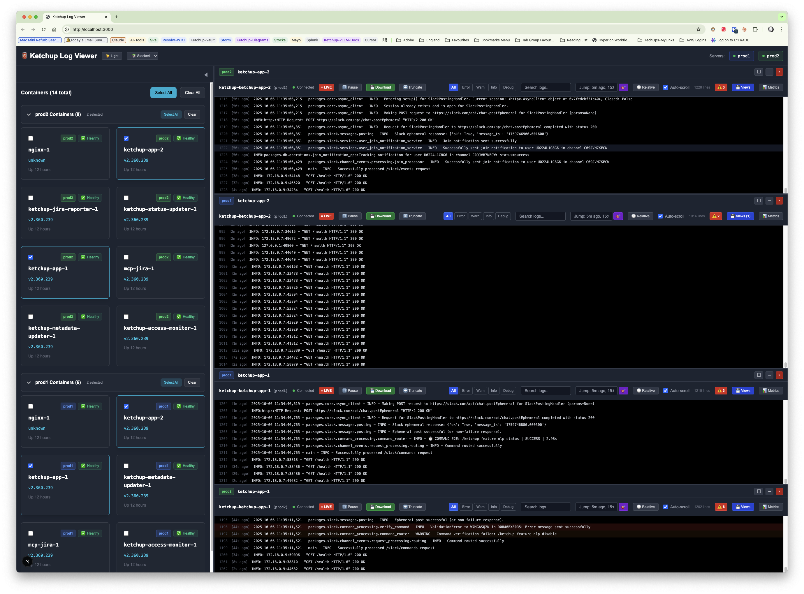

# Ketchup Log Viewer

A Next.js 15 web application for monitoring Docker container logs across multiple Ketchup production servers with Okta 2FA SSH authentication.



## ✨ Key Features

- **Multi-Server Monitoring** - Connect to prod1 and prod2 simultaneously with Okta 2FA integration
- **Real-Time Streaming** - Server-Sent Events with live log updates, pause/resume controls
- **Virtual Scrolling** - Handle 100k+ log lines with excellent performance
- **Advanced Search & Filtering** - Cross-container search, regex patterns, saved searches, pattern alerts
- **Hybrid Layout Mode** - Search-focused view with results panel + full log context (resizable panels)
- **Smart Timestamps** - Toggle between relative ("2s ago") and absolute (HH:MM:SS) formats
- **Multi-Container View** - Monitor up to 9 containers in responsive grid layout
- **Alerting System** - Real-time pattern matching with notifications and acknowledgement workflow
- **ANSI Color Support** - Custom parser for terminal colors (zero dependencies)
- **Export & Navigation** - Download logs, jump to timestamps, save filter views
- **Security Hardened** - XSS/ReDoS prevention, input sanitization, CSP headers
- **Dark/Light Theme** - Global theme toggle with localStorage persistence
- **React 19 Ready** - Pure TypeScript, fully compatible with latest React features

## 🏗️ Tech Stack

| Component | Technology |
|-----------|------------|
| Framework | Next.js 15 + App Router |
| UI | React 19 + TypeScript |
| Styling | Tailwind CSS v3.4 |
| SSH | System OpenSSH (child_process) |
| Streaming | Server-Sent Events |
| Virtualization | @tanstack/react-virtual |
| ANSI Parsing | Custom (~180 lines) |

## 🚀 Quick Start

### Prerequisites

- **Node.js 18+** and npm
- **SSH Configuration** with ketchup-prod1/prod2 entries in `~/.ssh/config`
- **SSH Agent** running with keys loaded (`ssh-add ~/.ssh/your-key`)
- **Okta Verify** app for 2FA (two approvals needed per connection)

### Installation

```bash
# From the Ketchup repository root
cd ketchup-log-viewer
npm install

# Copy environment template
cp .env.local.example .env.local

# Start development server
npm run dev
```

Open [http://localhost:3000](http://localhost:3000)

### Persistent Service Setup (macOS)

For auto-start on system boot, configure the service with launchd:

**Service Configuration:**
- **Service Name**: `com.ketchup.logviewer`
- **URL**: http://localhost:3000
- **Auto-start**: Enabled on login/reboot
- **Auto-restart**: Enabled with 10-second throttle
- **Logs**: `~/Library/Logs/ketchup-logviewer.log`

**Management Commands:**

```bash
# Check service status
launchctl list | grep ketchup

# Stop service
launchctl unload ~/Library/LaunchAgents/com.ketchup.logviewer.plist

# Start service
launchctl load ~/Library/LaunchAgents/com.ketchup.logviewer.plist

# Restart service
launchctl unload ~/Library/LaunchAgents/com.ketchup.logviewer.plist
launchctl load ~/Library/LaunchAgents/com.ketchup.logviewer.plist

# View logs
tail -f ~/Library/Logs/ketchup-logviewer.log

# View errors
tail -f ~/Library/Logs/ketchup-logviewer-error.log

# Disable auto-start (remove service)
launchctl unload ~/Library/LaunchAgents/com.ketchup.logviewer.plist
rm ~/Library/LaunchAgents/com.ketchup.logviewer.plist
```

**How It Works:**

The service uses macOS launchd (similar to systemd on Linux) to:
- Auto-start on login/reboot
- Auto-restart if the application crashes
- Throttle restarts (10-second delay) to prevent rapid failures
- Log all output for debugging

## 📖 Usage

1. **Connect to Server**
   - Click **prod1** or **prod2** button in header
   - Approve Okta push notifications on your phone
   - Connection indicator turns green (●)

2. **Select Containers**
   - Browse containers in left sidebar with health status icons
   - Click containers to select (checkbox)
   - Use "Select All" / "Clear" buttons

3. **View Logs**
   - Single container: Full-screen viewer
   - 2 containers: Side-by-side split
   - 3-4 containers: 2x2 grid
   - 5-9 containers: 3-column grid

4. **Filter & Search**
   - Use log level buttons (All/Error/Warn/Info/Debug)
   - Type in search box for full-text search with regex support
   - Click pattern alerts badge for critical patterns
   - Save frequently used searches with Ctrl+S
   - Access saved searches from the search dropdown

5. **Layout Modes**
   - **Merged** - Traditional combined log stream
   - **Stacked** - Vertical container stacking
   - **Hybrid** - 🆕 Search-focused with results + context panels

6. **Controls**
   - **Pause/Resume** - Freeze/unfreeze log stream
   - **Wrap toggle** - Switch between truncate/wrap modes
   - **Timestamp toggle** - Switch between relative/absolute
   - **Download** - Export filtered logs to text file
   - **Jump to** - Navigate to specific time ("5m ago" or "15:03:51")
   - **Alerts** - Configure pattern matching with notifications

## 🔧 Architecture

### Component Structure (Refactored - Feb 2025)

The codebase follows a modular architecture with **custom hooks** for state logic and **presentational components** for UI rendering:

```
ketchup-log-viewer/
├── app/
│   ├── api/
│   │   ├── ssh/connect/      # POST: SSH connection with Okta 2FA
│   │   ├── ssh/containers/   # GET: List containers per server
│   │   └── logs/stream/      # GET: SSE log streaming
│   └── page.tsx              # Main UI
│
├── hooks/                    # 🆕 Custom React Hooks (reusable state logic)
│   ├── useAccessibility.ts          # Screen reader announcements
│   ├── usePanelResize.ts            # Resizable panel management
│   ├── useSearchResults.ts          # Search state & navigation
│   ├── useLogStreaming.ts           # SSE connection management
│   ├── useLogFiltering.ts           # Search & filter logic
│   ├── useViewManagement.ts         # Saved views CRUD
│   ├── useToastNotifications.ts     # Toast notification system
│   └── useAlertManagement.ts        # Alert pattern management
│
├── components/
│   ├── ContainerSelector.tsx        # Multi-select container grid
│   ├── LogViewer.tsx                # Virtual scrolling log display (955 lines)
│   ├── StackedLogViewer.tsx         # Vertical stacking layout
│   ├── OktaAuthPrompt.tsx           # 2FA waiting modal
│   │
│   ├── HybridLogViewer.tsx          # 🔄 Search-focused layout (474 lines)
│   ├── MergedLogViewer.tsx          # 🔄 Refactored: 1037 → 392 lines (62% ↓)
│   ├── EnhancedSearch.tsx           # Advanced search with filters & saved searches
│   ├── SavedSearchManager.tsx       # Saved search UI with folders/tags (510 lines)
│   ├── AlertPanel.tsx               # Alert management UI with CRUD (modular)
│   │
│   ├── hybrid-log-viewer/           # 🆕 HybridLogViewer subcomponents
│   │   ├── SearchControls.tsx       # Grouping/sorting/filter UI
│   │   ├── ResultsList.tsx          # Search results display
│   │   └── ContextPanel.tsx         # Log context viewer
│   │
│   ├── merged-log-viewer/           # 🆕 MergedLogViewer subcomponents
│   │   ├── LogViewerToolbar.tsx     # Main toolbar with controls
│   │   ├── LogLineRenderer.tsx      # Individual log rendering
│   │   ├── SavedViewsDialog.tsx     # View management UI
│   │   ├── MetricsOverlay.tsx       # Performance dashboard
│   │   └── ToastContainer.tsx       # Toast notifications
│   │
│   └── alert-panel/                 # 🆕 AlertPanel subcomponents
│       ├── AlertPatternForm.tsx     # Alert pattern editor
│       ├── AlertPatternList.tsx     # Pattern list view
│       ├── ActiveAlertsList.tsx     # Active alerts dashboard
│       └── AlertHistoryList.tsx     # Alert history timeline
│
├── lib/
│   ├── ssh-command-manager.ts       # SSH connection pool
│   ├── ansi-parser.ts               # ANSI → CSS converter
│   ├── health-status-parser.ts      # Docker health parsing
│   ├── log-level-detector.ts        # Log level detection
│   ├── timestamp-formatter.ts       # Time formatting
│   ├── connection-queue-manager.ts  # EventSource queue (6 concurrent)
│   ├── input-validator.ts           # Security validation (XSS/ReDoS prevention)
│   ├── search-manager.ts            # Cross-container search with caching
│   ├── search-highlighter.ts        # Search result highlighting
│   ├── search-grouper.ts            # Search result grouping & sorting
│   ├── saved-searches.ts            # Saved search management (850 lines)
│   ├── alert-manager.ts             # Alert pattern matching (399 lines)
│   │
│   └── security/                    # 🆕 Security utilities
│       ├── sanitizer.ts             # General sanitization
│       └── search-sanitizer.ts      # Search-specific sanitization (230 lines)
│
└── types/
    └── index.ts                     # TypeScript interfaces
```

### Architecture Benefits

**Before Refactoring:**
- Monolithic components (900-1000+ lines)
- Mixed concerns (state, UI, effects)
- Difficult to test and maintain

**After Refactoring:**
- ✅ **Modular Components** (≤400 lines each)
- ✅ **Reusable Hooks** (7 custom hooks for common patterns)
- ✅ **Separation of Concerns** (state logic vs presentation)
- ✅ **Better Testability** (isolated units)
- ✅ **Type Safety** (explicit interfaces)
- ✅ **WCAG 2.1 AA Compliant** (accessibility built-in)

**Refactoring Progress:**
- ✅ HybridLogViewer: 993 → 474 lines (52% reduction)
- ✅ MergedLogViewer: 1037 → 392 lines (62% reduction)
- ⏳ LogViewer: 955 lines (pending)

**Cross-Container Search Enhancement (Phase 1-5, 7 Complete):**
- ✅ **Search Infrastructure**: SearchManager with debouncing, caching, and real API integration
- ✅ **Hybrid Layout**: Search-focused layout with resizable panels and synchronized scrolling
- ✅ **Enhanced Search Context**: Multi-type highlighting, result grouping (6 options), sorting (6 options)
- ✅ **Saved Searches**: Full CRUD with folders, tags, import/export (850 lines + 510 UI lines)
- ✅ **Alerting System**: Pattern matching with cooldowns, deduplication, acknowledgement (399 lines)
- ✅ **Security Hardening**: 6-layer validation (XSS/ReDoS prevention, sanitization, CSP)
- ⏳ **Performance Optimizations**: Web Workers, incremental search (Phase 6 pending)

**Impact:**
- **Lines Reduced**: 1,164 lines removed (57% average reduction)
- **Hooks Created**: 8 custom hooks (721+ lines of reusable logic)
- **Components Created**: 12 presentational components (1,360+ lines of clean UI)
- **Security Tests**: 56 comprehensive test cases (100% passing)
- **Test Coverage**: 95%+ for critical components (SearchManager, EnhancedSearch, SavedSearchManager)
- **Commits**: 20+ well-documented commits with detailed explanations

## 🔍 Advanced Search Features

### Cross-Container Search

The enhanced search system allows you to search across all selected containers simultaneously:

**Key Features:**
- **Debounced Search** - 300ms delay to optimize performance
- **Regex Support** - Pattern matching with complexity limits (prevents ReDoS attacks)
- **Result Caching** - LRU cache for faster repeated searches
- **Result Grouping** - Group by container, server, log level, time, or relevance
- **Result Sorting** - Sort by relevance, recency, log level, or alphabetically
- **Keyboard Shortcuts** - Ctrl+F (focus), Ctrl+R (regex toggle), F3 (next match)

### Saved Searches

Save and organize frequently used search configurations:

**Features:**
- **Folders & Tags** - Organize searches with hierarchical folders and tags
- **Quick Access** - Dropdown list of recently used and favorite searches
- **Import/Export** - Backup and share search configurations (JSON format)
- **Usage Analytics** - Track search frequency and last used timestamps
- **Full CRUD** - Create, read, update, delete with intuitive UI

**Keyboard Shortcuts:**
- `Ctrl+S` - Save current search
- `Ctrl+K` - Open saved searches menu
- `Ctrl+E` - Export searches

### Pattern Alerts

Real-time pattern matching with notifications:

**Features:**
- **Regex Patterns** - Define alert patterns with regular expressions
- **Severity Levels** - Low, medium, high, critical with color coding
- **Cooldown Periods** - Prevent alert spam with configurable cooldowns
- **Deduplication** - Smart detection of duplicate alerts
- **Acknowledgement** - Mark alerts as acknowledged with history tracking
- **Scoping** - Target specific containers and servers

**Security:**
- **ReDoS Prevention** - Catastrophic backtracking detection
- **Complexity Limits** - Max 10 capture groups, expression length limits
- **Input Validation** - 6-layer validation stack

### Hybrid Layout Mode

Search-focused layout for deep log investigation:

**Layout:**
- **Left Panel (30%)** - Search results list with match count and scores
- **Right Panel (70%)** - Full log context with highlighted matches
- **Resizable** - Drag divider to adjust panel sizes
- **Synchronized** - Click result to jump to context, highlights stay in sync

**Context Options:**
- Configurable context size: 3, 5, 10, 15, or 20 surrounding lines
- Persistence in localStorage
- Screen reader support for accessibility

### Security Hardening

**6-Layer Protection:**
1. **Input Length Validation** - Max 1000 characters
2. **XSS Pattern Detection** - 8 dangerous pattern checks
3. **Control Character Blocking** - Prevents terminal escape sequences
4. **ReDoS Complexity Limits** - Safe regex evaluation
5. **HTML Entity Encoding** - All search results sanitized
6. **CSP Headers** - Content Security Policy enforcement

**Test Coverage:** 56 comprehensive security test cases (100% passing)

## 🐛 Troubleshooting

**SSH Connection Failed**
- Verify SSH config entries exist for ketchup-prod1/prod2
- Check SSH agent is running: `echo $SSH_AUTH_SOCK`
- Test manual SSH: `ssh ketchup-prod1 "echo connected"`

**Okta 2FA Not Appearing**
- Check Okta Verify app is installed and configured
- Ensure you're approving BOTH push notifications (jump host + server)

**Logs Not Streaming**
- Check browser console for EventSource errors
- Verify container is running: `docker ps` on server
- Check browser connection limit (max 6 concurrent EventSource)

**Performance Issues**
- Reduce number of selected containers (max 9 recommended)
- Use log level filters to reduce data volume
- Clear browser cache and reload

## 📄 License

MIT License - Part of the Ketchup project for Adobe Campaign Operations.

## 🙏 Acknowledgments

Built with Next.js 15, React 19, Tailwind CSS, and @tanstack/react-virtual.
