# Background Services Architecture

This component diagram shows the 3 background services running in Ketchup, their scheduling patterns, data flows, and singleton constraints. The unified scheduler and CSOPM notifier run ONLY on prod1 as singletons to prevent duplicate operations, while the access monitor runs on both servers.

> **Note**: As of Phase 1 Scheduler Consolidation (December 2025), all 5 scheduler tasks run within a single `ketchup-unified-scheduler` container orchestrated by `UnifiedSchedulerEngine` (`packages/ketchup_unified_scheduler/unified_scheduler_engine.py`).

```mermaid
graph TB
    subgraph prod1Singleton["🔴 UNIFIED SCHEDULER (prod1 ONLY)"]
        UnifiedScheduler["⏰ ketchup-unified-scheduler<br/>━━━━━━━━━━━━━━━━━━━━━━━━━<br/>UnifiedSchedulerEngine<br/>━━━━━━━━━━━━━━━━━━━━━━━━━"]

        subgraph SchedulerTasks["Internal Tasks (Same Container)"]
            StatusUpdater["📊 status_updater_task<br/>Schedule: Every 55 min"]
            MetadataUpdater["🔍 metadata_updater_task<br/>Schedule: Every 15 min"]
            JiraReporter["🎫 jira_reporter_task<br/>Schedule: Continuous monitoring"]
            MaintenanceFetcher["⚠️ maintenance_fetcher_task<br/>Schedule: Daily 1:30 UTC"]
            PatRotator["🔑 pat_rotator_task<br/>Schedule: Every 24 hours"]
        end

        UnifiedScheduler -->|"Orchestrates"| StatusUpdater
        UnifiedScheduler -->|"Orchestrates"| MetadataUpdater
        UnifiedScheduler -->|"Orchestrates"| JiraReporter
        UnifiedScheduler -->|"Orchestrates"| MaintenanceFetcher
        UnifiedScheduler -->|"Orchestrates"| PatRotator
    end

    subgraph prod1CSOPMSingleton["🔴 CSOPM NOTIFIER (prod1 ONLY)"]
        CSOPMNotifier["📬 ketchup-csopm-notifier<br/>━━━━━━━━━━━━━━━━━━━━━━━━━<br/>Schedule: 08:00 & 16:00 UTC<br/>━━━━━━━━━━━━━━━━━━━━━━━━━"]

        subgraph CSOPMServices["Internal Services"]
            JIRAPoller["🎫 CSOPMJIRAPoller<br/>Poll JIRA for assignments"]
            SlackNotifier["💬 CSOPMSlackNotifier<br/>Send DM notifications"]
            ReminderService["⏰ CSOPMReminderService<br/>RCA & closure reminders"]
            StatusPoller["📊 CSOPMTicketStatusPoller<br/>Track ticket status"]
        end

        CSOPMNotifier -->|"Orchestrates"| JIRAPoller
        CSOPMNotifier -->|"Orchestrates"| SlackNotifier
        CSOPMNotifier -->|"Orchestrates"| ReminderService
        CSOPMNotifier -->|"Orchestrates"| StatusPoller
    end

    subgraph BothServers["🟢 DISTRIBUTED SERVICE (prod1 + prod2)"]
        AccessMonitor1["🔐 ketchup-access-monitor<br/>(prod1)<br/>━━━━━━━━━━━━━━━<br/>Schedule: SQS polling<br/>━━━━━━━━━━━━━━━"]
        AccessMonitor2["🔐 ketchup-access-monitor<br/>(prod2)<br/>━━━━━━━━━━━━━━━<br/>Schedule: SQS polling<br/>━━━━━━━━━━━━━━━"]
    end
    
    subgraph StatusFlow["Status Updater Flow"]
        StatusUpdater --> StatusCheck{"Check Feature<br/>Flag"}
        StatusCheck -->|"Enabled"| StatusScan["Scan Eligible<br/>Channels"]
        StatusCheck -->|"Disabled"| StatusSkip["Skip Execution"]
        
        StatusScan --> StatusGlobal{"Global Flag<br/>Enabled?"}
        StatusGlobal -->|"Yes"| StatusAllChannels["Get ALL<br/>channels"]
        StatusGlobal -->|"No"| StatusFeatureChannels["Get feature-enabled<br/>channels from DynamoDB"]
        
        StatusAllChannels --> StatusProcess["For each channel:"]
        StatusFeatureChannels --> StatusProcess
        
        StatusProcess --> StatusFetch["1. Fetch messages<br/>(last 24-48h)"]
        StatusFetch --> StatusAI["2. Generate AI summary<br/>(Azure OpenAI)"]
        StatusAI --> StatusPost["3. Post update<br/>to channel"]
    end
    
    subgraph MetadataFlow["Metadata Updater Flow"]
        MetadataUpdater --> MetaScan["Scan ALL<br/>public channels"]
        MetaScan --> MetaFetch["For each channel:<br/>1. Fetch members<br/>2. Fetch topic<br/>3. Fetch purpose"]
        MetaFetch --> MetaUpdate["Update DynamoDB<br/>channel metadata"]
    end
    
    subgraph JiraFlow["JIRA Reporter Flow"]
        JiraReporter --> JiraCheck{"Check Feature<br/>Flag"}
        JiraCheck -->|"Enabled"| JiraScan["Scan JIRA-enabled<br/>channels"]
        JiraCheck -->|"Disabled"| JiraSkip["Skip Execution"]
        
        JiraScan --> JiraMonitor["For each channel:<br/>Monitor messages"]
        JiraMonitor --> JiraDetect{"Incident<br/>Pattern?"}
        JiraDetect -->|"Yes"| JiraCreate["1. Create JIRA ticket<br/>(via MCP client)"]
        JiraDetect -->|"No"| JiraContinue["Continue monitoring"]
        JiraCreate --> JiraNotify["2. Post JIRA link<br/>to channel"]
    end
    
    subgraph MaintenanceFlow["Maintenance Fetcher Flow"]
        MaintenanceFetcher --> RavenPoll["Poll Raven API<br/>(maintenance events)"]
        RavenPoll --> RavenDetect{"Outage or<br/>Maintenance?"}
        RavenDetect -->|"Yes"| RavenNotify["Post alert to<br/>configured channels"]
        RavenDetect -->|"No"| RavenWait["Wait for next poll"]
    end
    
    subgraph CSOPMFlow["CSOPM Notifier Flow"]
        CSOPMNotifier --> CSOPMCheck{"Check Feature<br/>Flag"}
        CSOPMCheck -->|"Enabled"| CSOPMPoll["Poll JIRA for<br/>CSOPM assignments"]
        CSOPMCheck -->|"Disabled"| CSOPMSkip["Skip Execution"]

        CSOPMPoll --> CSOPMFilter["Filter new/reassigned<br/>tickets"]
        CSOPMFilter --> CSOPMNotify["For each ticket:<br/>1. Look up assignee Slack ID<br/>2. Send DM notification<br/>3. Track state in DynamoDB"]

        CSOPMNotify --> CSOPMReminders["Process reminders:<br/>• RCA (7 days)<br/>• Closure (45 days)"]
        CSOPMReminders --> CSOPMButtons["Interactive buttons:<br/>Acknowledge, Done,<br/>Snooze, Stop Reminders"]
    end

    subgraph AccessFlow["Access Monitor Flow (Both Servers)"]
        AccessMonitor1 --> SQSPoll1["Poll SQS queue"]
        AccessMonitor2 --> SQSPoll2["Poll SQS queue"]
        
        SQSPoll1 --> SQSReceive["Receive access<br/>request event"]
        SQSPoll2 --> SQSReceive
        
        SQSReceive --> SQSProcess["Process request:<br/>1. Store in DynamoDB<br/>2. Post to access channel<br/>3. Add approval buttons"]
        SQSProcess --> SQSDelete["Delete message<br/>from queue"]
    end
    
    subgraph ExternalServices["External Services"]
        SlackAPI["📱 Slack API"]
        AzureAI["🤖 Azure OpenAI<br/>(gpt-4o)"]
        MCPJira["🎫 MCP JIRA Client<br/>(port 8081)"]
        RavenAPI["⚠️ Raven API<br/>(Maintenance)"]
    end
    
    subgraph DataStores["Data Stores"]
        DDB[("DynamoDB<br/>ketchup_channel_information")]
        Secrets["🔐 Secrets Manager<br/>Ketchup_Token_Secrets"]
        SQS["📨 SQS Queue<br/>ketchup-events-queue"]
    end
    
    StatusPost --> SlackAPI
    StatusFetch --> SlackAPI
    StatusAI --> AzureAI
    StatusScan --> DDB
    StatusFeatureChannels --> DDB
    
    MetaFetch --> SlackAPI
    MetaUpdate --> DDB
    
    JiraMonitor --> SlackAPI
    JiraCreate --> MCPJira
    JiraNotify --> SlackAPI
    JiraScan --> DDB
    
    RavenPoll --> RavenAPI
    RavenNotify --> SlackAPI

    CSOPMPoll --> MCPJira
    CSOPMNotify --> SlackAPI
    CSOPMNotify --> DDB
    CSOPMReminders --> SlackAPI
    CSOPMNotifier -.->|"Get tokens"| Secrets
    
    SQSPoll1 --> SQS
    SQSPoll2 --> SQS
    SQSProcess --> DDB
    SQSProcess --> SlackAPI
    
    StatusUpdater -.->|"Get tokens"| Secrets
    MetadataUpdater -.->|"Get tokens"| Secrets
    JiraReporter -.->|"Get tokens"| Secrets
    MaintenanceFetcher -.->|"Get tokens"| Secrets
    PatRotator -.->|"Get tokens"| Secrets
    AccessMonitor1 -.->|"Get tokens"| Secrets
    AccessMonitor2 -.->|"Get tokens"| Secrets
    
    classDef singleton fill:#E74C3C,stroke:#A93226,stroke-width:3px,color:#fff
    classDef distributed fill:#27AE60,stroke:#1E8449,stroke-width:2px,color:#fff
    classDef external fill:#3498DB,stroke:#2471A3,stroke-width:2px,color:#fff
    classDef dataStore fill:#F39C12,stroke:#CA7E0A,stroke-width:2px,color:#fff
    classDef scheduler fill:#9B59B6,stroke:#6C3483,stroke-width:2px,color:#fff
    classDef flow fill:#ECF0F1,stroke:#95A5A6,stroke-width:1px
    
    class UnifiedScheduler,StatusUpdater,MetadataUpdater,JiraReporter,MaintenanceFetcher,PatRotator,CSOPMNotifier,JIRAPoller,SlackNotifier,ReminderService,StatusPoller singleton
    class AccessMonitor1,AccessMonitor2 distributed
    class SlackAPI,AzureAI,MCPJira,RavenAPI external
    class DDB,Secrets,SQS dataStore
```



## Service Details

### 0. ketchup-unified-scheduler (SINGLETON CONTAINER)

**Purpose:** Orchestrate all 5 scheduler tasks within a single container

**Architecture:**
- **Engine:** `UnifiedSchedulerEngine` (`packages/ketchup_unified_scheduler/unified_scheduler_engine.py`)
- **Shared TypedDI Container:** All tasks share the same dependency injection container
- **Per-Task Health Monitoring:** `PerTaskHealthMonitor` tracks health of each individual task
- **Independent Scheduling:** Each task runs on its own schedule without blocking others

**Key Benefits:**
1. **Shared Resources:** Single DynamoDB client, Slack client, Secrets Manager instance via TypedDI
2. **Reduced Overhead:** 1 container instead of 5 (lower memory, CPU, deployment complexity)
3. **Unified Health Monitoring:** Single healthcheck endpoint exposes all task statuses
4. **Simplified Deployment:** One Dockerfile, one docker-compose entry, one deployment unit

**Task Orchestration:**
- Each task is a separate async function (`StatusUpdaterTask`, `MetadataUpdaterTask`, etc.)
- Tasks are registered with `UnifiedSchedulerEngine` at startup
- Engine spawns independent asyncio tasks for each scheduler
- Tasks run concurrently but independently (failure of one doesn't affect others)

**Health Monitoring:**
```python
# Each task reports health independently
GET /health
{
  "status": "healthy",
  "tasks": {
    "status_updater": {"status": "healthy", "last_run": "2025-12-08T10:00:00Z"},
    "metadata_updater": {"status": "healthy", "last_run": "2025-12-08T09:45:00Z"},
    "jira_reporter": {"status": "healthy", "last_run": "2025-12-08T10:30:00Z"},
    "maintenance_fetcher": {"status": "healthy", "last_run": "2025-12-08T01:30:00Z"},
    "pat_rotator": {"status": "healthy", "last_run": "2025-12-07T10:00:00Z"}
  }
}
```

**Deployment:**
- Dockerfile: `Dockerfile.unified-scheduler`
- Container name: `ketchup-unified-scheduler`
- **MUST run on prod1 only** (singleton constraint applies to entire container)

**Migration from Old Architecture:**
- **Before:** 5 separate containers (status-updater, metadata-updater, jira-reporter, maintenance-fetcher, pat-rotator)
- **After:** 1 unified container running all 5 tasks internally
- **Logic unchanged:** Each task's execution logic remains identical to previous standalone services

---

### 1. status_updater_task (Task within Unified Scheduler)

**Purpose:** Automated hourly channel status updates with AI-powered summaries

**Schedule:**
- Every 55 minutes (configurable via environment variable)
- Runs as task within `ketchup-unified-scheduler` container

**Logic:**
1. Check `KETCHUP_STATUS_UPDATER_FEATURE` flag → If false, skip
2. Check `KETCHUP_STATUS_UPDATER_GLOBAL` flag:
   - If true: Process ALL eligible channels
   - If false: Query DynamoDB for channels with `features.status_updater_enabled = true`
3. For each channel:
   - Fetch last 24-48 hours of messages (pipeline processing)
   - Generate AI summary via Azure OpenAI (gpt-4o)
   - Format summary with channel stats
   - Post to channel as bot message
4. Log metrics and errors

**Dependencies:**
- `SlackAsyncClient` (message fetching, posting)
- `AzureAsyncClient` (AI summarization)
- `DynamoDBClient` (channel metadata, feature flags)
- `FeatureService` (flag evaluation)
- `SecretsManager` (API tokens)

**Performance:**
- Pipeline processing: 4 concurrent workers
- Average processing time: 10-20 seconds per channel
- HTTP/2 keep-alive for connection reuse

**Deployment:**
- **Runs as task within:** `ketchup-unified-scheduler`
- **Task class:** `StatusUpdaterTask` (`packages/ketchup_unified_scheduler/tasks/status_updater_task.py`)
- **Singleton constraint:** Inherited from parent container (prod1 only)

---

### 2. jira_reporter_task (Task within Unified Scheduler)

**Purpose:** Automated JIRA ticket creation for incident detection

**Schedule:**
- Continuous monitoring (event-driven)
- Checks channels with `features.jira_reporter_enabled = true`
- Runs as task within `ketchup-unified-scheduler` container

**Logic:**
1. Check `KETCHUP_JIRA_REPORTER_FEATURE` flag → If false, skip
2. Query DynamoDB for JIRA-enabled channels
3. For each channel:
   - Monitor new messages via Slack events
   - Detect incident patterns (keywords, urgency)
   - If incident detected:
     - Call MCP JIRA client (port 8081) to create ticket
     - Post JIRA link back to Slack channel
     - Update DynamoDB with ticket mapping
4. Track ticket lifecycle (open → in progress → closed)

**Dependencies:**
- `MCPAsyncClient` (JIRA ticket operations)
- `SlackAsyncClient` (message monitoring, posting)
- `DynamoDBClient` (channel config, ticket tracking)
- `FeatureService` (flag evaluation)
- `SecretsManager` (JIRA credentials)

**Incident Detection Patterns:**
- Keywords: "incident", "outage", "down", "critical"
- Urgency indicators: "URGENT", "P1", "SEV1"
- @mentions of incident management teams

**Deployment:**
- **Runs as task within:** `ketchup-unified-scheduler`
- **Task class:** `JiraReporterTask` (`packages/ketchup_unified_scheduler/tasks/jira_reporter_task.py`)
- **Singleton constraint:** Inherited from parent container (prod1 only)

---

### 3. metadata_updater_task (Task within Unified Scheduler)

**Purpose:** Periodic sync of Slack channel metadata to DynamoDB

**Schedule:**
- Every 15 minutes (configurable)
- Runs as task within `ketchup-unified-scheduler` container

**Logic:**
1. Fetch list of ALL public channels via Slack API
2. For each channel:
   - Fetch channel info (`conversations.info`)
   - Fetch channel members (`conversations.members`)
   - Fetch channel topic and purpose
3. Update DynamoDB with fresh metadata:
   - `channel_name`
   - `member_count`
   - `topic`
   - `purpose`
   - `created_at`
   - `is_archived`
4. Handle rate limits (Tier 3: 50+ requests/min)

**Dependencies:**
- `SlackAsyncClient` (channel info fetching)
- `DynamoDBClient` (metadata storage)
- `SecretsManager` (Slack tokens)

**Performance:**
- Batch processing: 50 channels per batch
- Rate limit handling: Exponential backoff
- Average scan time: 5-10 minutes for 500+ channels

**Deployment:**
- **Runs as task within:** `ketchup-unified-scheduler`
- **Task class:** `MetadataUpdaterTask` (`packages/ketchup_unified_scheduler/tasks/metadata_updater_task.py`)
- **Singleton constraint:** Inherited from parent container (prod1 only)

---

### 4. maintenance_fetcher_task (Task within Unified Scheduler)

**Purpose:** Monitor and alert on maintenance events and outages

**Schedule:**
- Daily at 1:30 UTC
- Runs as task within `ketchup-unified-scheduler` container

**Logic:**
1. Poll Raven API for maintenance events
2. Check for active outages or scheduled maintenance
3. If event detected:
   - Format maintenance alert message
   - Post to configured notification channels
   - Store event in DynamoDB (prevent duplicate alerts)
4. Handle event lifecycle (scheduled → active → completed)

**Dependencies:**
- `RavenMaintenanceClient` (maintenance API)
- `SlackAsyncClient` (alert posting)
- `DynamoDBClient` (event tracking)
- `SecretsManager` (API credentials)

**Alert Types:**
- Scheduled maintenance (advance notice)
- Active outages (immediate alert)
- Service degradation (warning)
- Maintenance completion (all-clear)

**Deployment:**
- **Runs as task within:** `ketchup-unified-scheduler`
- **Task class:** `MaintenanceFetcherTask` (`packages/ketchup_unified_scheduler/tasks/maintenance_fetcher_task.py`)
- **Singleton constraint:** Inherited from parent container (prod1 only)

---

### 5. pat_rotator_task (Task within Unified Scheduler)

**Purpose:** Automatically rotate JIRA Personal Access Tokens (PATs) for security compliance

**Schedule:**
- Every 24 hours
- Runs as task within `ketchup-unified-scheduler` container

**Logic:**
1. Check current PAT expiration date
2. If PAT expires within 7 days:
   - Generate new PAT via JIRA API
   - Update AWS Secrets Manager with new token
   - Test new token for validity
   - Revoke old PAT after successful rotation
3. Log rotation events for audit trail

**Dependencies:**
- `MCPAsyncClient` (JIRA PAT operations)
- `SecretsManager` (token storage)
- `DynamoDBClient` (rotation tracking)

**Security Features:**
- Zero-downtime rotation (new token active before old revoked)
- Automatic rollback on failure
- Audit logging of all rotation events
- Expiration tracking and alerts

**Deployment:**
- **Runs as task within:** `ketchup-unified-scheduler`
- **Task class:** `PatRotatorTask` (`packages/ketchup_unified_scheduler/tasks/pat_rotator_task.py`)
- **Singleton constraint:** Inherited from parent container (prod1 only)

---

### 6. ketchup-access-monitor (DISTRIBUTED)

**Purpose:** Process access requests from SQS queue

**Schedule:**
- Continuous SQS polling (long polling, 20-second wait)

**Logic:**
1. Poll SQS queue: `ketchup-events-queue`
2. Receive access request events (JSON payload)
3. For each request:
   - Parse user_id, justification, timestamp
   - Store in DynamoDB (`access_requests` table)
   - Post to `ACCESS_REQUEST_CHANNEL` with approval buttons
   - Delete message from SQS queue (prevent reprocessing)
4. Wait for approval (handled by interactive components)

**Dependencies:**
- `SQSClient` (queue polling)
- `SlackAsyncClient` (request posting)
- `DynamoDBClient` (request tracking)
- `SecretsManager` (AWS credentials, Slack tokens)

**Queue Configuration:**
- Visibility timeout: 60 seconds
- Long polling: 20 seconds
- Dead letter queue: After 3 retries

**Deployment:**
- Dockerfile: `Dockerfile.access-monitor`
- Container name: `ketchup-access-monitor`
- **Runs on BOTH prod1 and prod2** (distributed load)
- SQS ensures each message processed exactly once

---

### 7. ketchup-csopm-notifier (SINGLETON)

**Purpose:** Automated CSOPM (Customer Success Operations Project Management) ticket assignment notifications via Slack DMs

**Schedule:**
- Twice daily at 08:00 and 16:00 UTC
- Runs as standalone container on prod1 only

**Architecture:**
- **Scheduler:** `CSOPMScheduler` (`ketchup_csopm_notifier/scheduler.py`)
- **Services:** 4 internal services orchestrated by scheduler
- **Shared Components:** State tracking and button handlers in `packages/slack/csopm/`
- **TypedDI Container:** Shared container initialized at startup

**Internal Services:**

| Service | Purpose | Key Methods |
|---------|---------|-------------|
| `CSOPMJIRAPoller` | Poll JIRA for CSOPM assignments | `poll_assignments()` |
| `CSOPMSlackNotifier` | Send Slack DM notifications | `send_notification()` |
| `CSOPMReminderService` | RCA and closure reminders | `process_reminders()` |
| `CSOPMTicketStatusPoller` | Track ticket status changes | `poll_status()` |
| `CSOPMStateTracker` | DynamoDB state persistence | `get_notification_record()`, `update_notification_record()` |

**Logic:**
1. Check `KETCHUP_CSOPM_NOTIFIER_ENABLED` flag → If false, skip
2. Poll JIRA for CSOPM project tickets assigned to users
3. For each assignment:
   - Look up assignee's Slack user ID (via email domain matching)
   - Check if notification already sent (DynamoDB state)
   - Send Slack DM with ticket details and interactive buttons
   - Track notification state in DynamoDB
4. Process reminders:
   - RCA reminders after 7 days (configurable via `CSOPM_RCA_REMINDER_DAYS`)
   - Closure reminders after 45 days (configurable via `CSOPM_CLOSURE_REMINDER_DAYS`)
   - Maximum 3 pings before escalation (`CSOPM_MAX_PING_COUNT`)
5. Poll ticket status for completion/closure tracking

**Interactive Buttons:**
- **Acknowledge:** Mark notification as seen
- **Mark Complete:** Transition ticket with dynamic JIRA fields
- **Close Ticket:** Transition to closed with required fields
- **Snooze/Unsnooze:** Pause reminders temporarily
- **Stop/Enable Reminders:** Toggle reminder notifications

**Dependencies:**
- `MCPAsyncClient` (JIRA ticket operations via mcp-jira)
- `SlackAsyncClient` (DM notifications, button handling)
- `DynamoDBClient` (state persistence with `CSOPM_NOTIFICATION#` prefix)
- `SecretsManager` (API tokens, user PATs)

**DynamoDB State Keys:**
- `PK_NOTIFICATION_PREFIX`: `CSOPM_NOTIFICATION#`
- `SK_NOTIFICATION`: `NOTIFICATION`
- `SK_FOLLOWUP_PREFIX`: `FOLLOWUP#`

**Configuration (Environment Variables):**
```yaml
KETCHUP_CSOPM_NOTIFIER_ENABLED=true
CSOPM_JIRA_PROJECT=CSOPM
CSOPM_RCA_REMINDER_DAYS=7
CSOPM_CLOSURE_REMINDER_DAYS=45
CSOPM_MAX_PING_COUNT=3
CSOPM_SCHEDULE_TIMES=08:00,16:00
```

**Deployment:**
- Dockerfile: `Dockerfile.csopm-notifier`
- Container name: `ketchup-csopm-notifier`
- **MUST run on prod1 only** (singleton constraint)
- Deployment script explicitly stops/removes on prod2

**Health Monitoring:**
```python
GET /health
{
  "status": "healthy",
  "last_poll": "2026-01-22T08:00:00Z",
  "notifications_sent": 15,
  "reminders_processed": 8
}
```

**Split Architecture (Shared vs Scheduler-Specific):**
- **Shared** (`packages/slack/csopm/`): `actions.py`, `state.py`, `blocks.py` - used by both scheduler and ketchup-app for button callbacks
- **Scheduler-Specific** (`ketchup_csopm_notifier/`): `scheduler.py`, `services/*.py` - only runs in singleton container

---

## Singleton Pattern Rationale

**Why Unified Scheduler and CSOPM Notifier are Singletons:**
- **Prevent duplicate Slack posts**: Users would see duplicate status updates
- **Prevent duplicate JIRA tickets**: Same incident would create multiple tickets
- **Prevent duplicate metadata scans**: Wasteful API calls, rate limit issues
- **Prevent duplicate alerts**: Maintenance alerts would spam channels
- **Prevent duplicate PAT rotations**: Token conflicts and security issues
- **Prevent duplicate CSOPM notifications**: Users would receive duplicate DMs for same ticket

**Implementation (Phase 1 Consolidation):**
- **Before:** 5 separate singleton containers on prod1
- **After:** 1 unified scheduler container on prod1 running all 5 tasks
- Defined in `docker-compose.yml` for prod1 only
- Deployment script explicitly stops/removes unified scheduler on prod2
- Monitored via unified healthcheck endpoint

**Benefits of Consolidation:**
1. **Shared Resources:** Single TypedDI container, DynamoDB client, Slack client across all tasks
2. **Reduced Overhead:** ~80% reduction in container overhead (1 vs 5 containers)
3. **Unified Health Monitoring:** Single `/health` endpoint with per-task status
4. **Simplified Deployment:** One Dockerfile, one docker-compose entry, one deployment unit
5. **Improved Observability:** Centralized logging for all scheduler tasks

**Distributed Service (access-monitor):**
- SQS guarantees exactly-once processing
- Safe to run on multiple servers (prod1 + prod2)
- Improves throughput and fault tolerance
- Remains separate from unified scheduler (different scaling needs)

---

## Feature Flag Integration

All background services respect feature flags:

**Environment Variables:**
- `KETCHUP_STATUS_UPDATER_FEATURE=true`
- `KETCHUP_STATUS_UPDATER_GLOBAL=true`
- `KETCHUP_JIRA_REPORTER_FEATURE=true`
- `KETCHUP_JIRA_REPORTER_GLOBAL=false`
- `KETCHUP_TRUST_ENDORSEMENT_FEATURE=true`

**DynamoDB Channel Flags:**
- `features.status_updater_enabled`
- `features.jira_reporter_enabled`
- `features.trust_endorsement_enabled`

**Evaluation Order:**
1. Check environment variable → If false, DISABLED
2. Check global flag → If true, ENABLED FOR ALL
3. Check channel-specific flag → If true, ENABLED FOR CHANNEL

---

## Monitoring and Logging

All services log to Docker json-file driver:
- **Location:** `/opt/ketchup/logs/` on EC2
- **Rotation:** 10MB per file, 3 files max (30MB total)
- **Viewer:** Custom log viewer with real-time streaming

**Key Metrics Logged:**
- Execution time per channel
- AI token usage (Azure OpenAI)
- API rate limits hit
- Errors and retries
- Feature flag evaluations
