# Background Services Architecture

This component diagram shows the 6 background services running in Ketchup, their scheduling patterns, data flows, and singleton constraints. Five services run ONLY on prod1 as singletons to prevent duplicate operations, while the access monitor runs on both servers.

> **Note**: All scheduler services use the consolidated `BaseScheduler` pattern (`packages/core/schedulers/base_scheduler.py`) with a unified `healthcheck-scheduler.sh` script.

```mermaid
graph TB
    subgraph Scheduling["⏰ Scheduling Layer (BaseScheduler)"]
        Cron1["BaseScheduler<br/>(prod1 only)"]
        Cron2["BaseScheduler<br/>(prod2 only)"]
    end

    subgraph prod1Singletons["🔴 SINGLETON SERVICES (prod1 ONLY)"]
        StatusUpdater["📊 ketchup-status-updater<br/>━━━━━━━━━━━━━━━<br/>Schedule: Every 55 min<br/>━━━━━━━━━━━━━━━"]
        MetadataUpdater["🔍 ketchup-metadata-updater<br/>━━━━━━━━━━━━━━━<br/>Schedule: Every 15 min<br/>━━━━━━━━━━━━━━━"]
        JiraReporter["🎫 ketchup-jira-reporter<br/>━━━━━━━━━━━━━━━<br/>Schedule: Continuous monitoring<br/>━━━━━━━━━━━━━━━"]
        MaintenanceFetcher["⚠️ ketchup-maintenance-fetcher<br/>━━━━━━━━━━━━━━━<br/>Schedule: Daily 1:30 UTC<br/>━━━━━━━━━━━━━━━"]
        PatRotator["🔑 ketchup-jira-pat-rotator<br/>━━━━━━━━━━━━━━━<br/>Schedule: Every 24 hours<br/>━━━━━━━━━━━━━━━"]
    end
    
    subgraph BothServers["🟢 DISTRIBUTED SERVICE (prod1 + prod2)"]
        AccessMonitor1["🔐 ketchup-access-monitor<br/>(prod1)<br/>━━━━━━━━━━━━━━━<br/>Schedule: SQS polling<br/>━━━━━━━━━━━━━━━"]
        AccessMonitor2["🔐 ketchup-access-monitor<br/>(prod2)<br/>━━━━━━━━━━━━━━━<br/>Schedule: SQS polling<br/>━━━━━━━━━━━━━━━"]
    end
    
    Cron1 -.->|"Trigger"| StatusUpdater
    Cron1 -.->|"Trigger"| MetadataUpdater
    Cron1 -.->|"Trigger"| JiraReporter
    Cron1 -.->|"Trigger"| MaintenanceFetcher
    Cron1 -.->|"Trigger"| PatRotator
    Cron1 -.->|"Trigger"| AccessMonitor1
    Cron2 -.->|"Trigger"| AccessMonitor2
    
    subgraph StatusFlow["Status Updater Flow"]
        StatusUpdater --> StatusCheck{"Check Feature<br/>Flag"}
        StatusCheck -->|"Enabled"| StatusScan["Scan Eligible<br/>Channels"]
        StatusCheck -->|"Disabled"| StatusSkip["Skip Execution"]
        
        StatusScan --> StatusGlobal{"Global Flag<br/>Enabled?"}
        StatusGlobal -->|"Yes"| StatusAllChannels["Get ALL<br/>channels"]
        StatusGlobal -->|"No"| StatusFeatureChannels["Get feature-enabled<br/>channels from DynamoDB"]
        
        StatusAllChannels --> StatusProcess["For each channel:"]
        StatusFeatureChannels --> StatusProcess
        
        StatusProcess --> StatusFetch["1. Fetch messages<br/>(last 24-48h)"]
        StatusFetch --> StatusAI["2. Generate AI summary<br/>(Azure OpenAI)"]
        StatusAI --> StatusPost["3. Post update<br/>to channel"]
    end
    
    subgraph MetadataFlow["Metadata Updater Flow"]
        MetadataUpdater --> MetaScan["Scan ALL<br/>public channels"]
        MetaScan --> MetaFetch["For each channel:<br/>1. Fetch members<br/>2. Fetch topic<br/>3. Fetch purpose"]
        MetaFetch --> MetaUpdate["Update DynamoDB<br/>channel metadata"]
    end
    
    subgraph JiraFlow["JIRA Reporter Flow"]
        JiraReporter --> JiraCheck{"Check Feature<br/>Flag"}
        JiraCheck -->|"Enabled"| JiraScan["Scan JIRA-enabled<br/>channels"]
        JiraCheck -->|"Disabled"| JiraSkip["Skip Execution"]
        
        JiraScan --> JiraMonitor["For each channel:<br/>Monitor messages"]
        JiraMonitor --> JiraDetect{"Incident<br/>Pattern?"}
        JiraDetect -->|"Yes"| JiraCreate["1. Create JIRA ticket<br/>(via MCP client)"]
        JiraDetect -->|"No"| JiraContinue["Continue monitoring"]
        JiraCreate --> JiraNotify["2. Post JIRA link<br/>to channel"]
    end
    
    subgraph MaintenanceFlow["Maintenance Fetcher Flow"]
        MaintenanceFetcher --> RavenPoll["Poll Raven API<br/>(maintenance events)"]
        RavenPoll --> RavenDetect{"Outage or<br/>Maintenance?"}
        RavenDetect -->|"Yes"| RavenNotify["Post alert to<br/>configured channels"]
        RavenDetect -->|"No"| RavenWait["Wait for next poll"]
    end
    
    subgraph AccessFlow["Access Monitor Flow (Both Servers)"]
        AccessMonitor1 --> SQSPoll1["Poll SQS queue"]
        AccessMonitor2 --> SQSPoll2["Poll SQS queue"]
        
        SQSPoll1 --> SQSReceive["Receive access<br/>request event"]
        SQSPoll2 --> SQSReceive
        
        SQSReceive --> SQSProcess["Process request:<br/>1. Store in DynamoDB<br/>2. Post to access channel<br/>3. Add approval buttons"]
        SQSProcess --> SQSDelete["Delete message<br/>from queue"]
    end
    
    subgraph ExternalServices["External Services"]
        SlackAPI["📱 Slack API"]
        AzureAI["🤖 Azure OpenAI<br/>(gpt-4o)"]
        MCPJira["🎫 MCP JIRA Client<br/>(port 8081)"]
        RavenAPI["⚠️ Raven API<br/>(Maintenance)"]
    end
    
    subgraph DataStores["Data Stores"]
        DDB[("DynamoDB<br/>ketchup_channel_information")]
        Secrets["🔐 Secrets Manager<br/>Ketchup_Token_Secrets"]
        SQS["📨 SQS Queue<br/>ketchup-events-queue"]
    end
    
    StatusPost --> SlackAPI
    StatusFetch --> SlackAPI
    StatusAI --> AzureAI
    StatusScan --> DDB
    StatusFeatureChannels --> DDB
    
    MetaFetch --> SlackAPI
    MetaUpdate --> DDB
    
    JiraMonitor --> SlackAPI
    JiraCreate --> MCPJira
    JiraNotify --> SlackAPI
    JiraScan --> DDB
    
    RavenPoll --> RavenAPI
    RavenNotify --> SlackAPI
    
    SQSPoll1 --> SQS
    SQSPoll2 --> SQS
    SQSProcess --> DDB
    SQSProcess --> SlackAPI
    
    StatusUpdater -.->|"Get tokens"| Secrets
    MetadataUpdater -.->|"Get tokens"| Secrets
    JiraReporter -.->|"Get tokens"| Secrets
    MaintenanceFetcher -.->|"Get tokens"| Secrets
    PatRotator -.->|"Get tokens"| Secrets
    AccessMonitor1 -.->|"Get tokens"| Secrets
    AccessMonitor2 -.->|"Get tokens"| Secrets
    
    classDef singleton fill:#E74C3C,stroke:#A93226,stroke-width:3px,color:#fff
    classDef distributed fill:#27AE60,stroke:#1E8449,stroke-width:2px,color:#fff
    classDef external fill:#3498DB,stroke:#2471A3,stroke-width:2px,color:#fff
    classDef dataStore fill:#F39C12,stroke:#CA7E0A,stroke-width:2px,color:#fff
    classDef scheduler fill:#9B59B6,stroke:#6C3483,stroke-width:2px,color:#fff
    classDef flow fill:#ECF0F1,stroke:#95A5A6,stroke-width:1px
    
    class StatusUpdater,MetadataUpdater,JiraReporter,MaintenanceFetcher,PatRotator singleton
    class AccessMonitor1,AccessMonitor2 distributed
    class SlackAPI,AzureAI,MCPJira,RavenAPI external
    class DDB,Secrets,SQS dataStore
    class Cron1,Cron2 scheduler
```

## Service Details

### 1. ketchup-status-updater (SINGLETON)

**Purpose:** Automated hourly channel status updates with AI-powered summaries

**Schedule:**
- Every hour (configurable via environment variable)
- Default: `:00` of each hour

**Logic:**
1. Check `KETCHUP_STATUS_UPDATER_FEATURE` flag → If false, skip
2. Check `KETCHUP_STATUS_UPDATER_GLOBAL` flag:
   - If true: Process ALL eligible channels
   - If false: Query DynamoDB for channels with `features.status_updater_enabled = true`
3. For each channel:
   - Fetch last 24-48 hours of messages (pipeline processing)
   - Generate AI summary via Azure OpenAI (gpt-4o)
   - Format summary with channel stats
   - Post to channel as bot message
4. Log metrics and errors

**Dependencies:**
- `SlackAsyncClient` (message fetching, posting)
- `AzureAsyncClient` (AI summarization)
- `DynamoDBClient` (channel metadata, feature flags)
- `FeatureService` (flag evaluation)
- `SecretsManager` (API tokens)

**Performance:**
- Pipeline processing: 4 concurrent workers
- Average processing time: 10-20 seconds per channel
- HTTP/2 keep-alive for connection reuse

**Deployment:**
- Dockerfile: `Dockerfile.status-updater`
- Container name: `ketchup-status-updater`
- **MUST run on prod1 only** (prevented duplicate posts)

---

### 2. ketchup-jira-reporter (SINGLETON)

**Purpose:** Automated JIRA ticket creation for incident detection

**Schedule:**
- Continuous monitoring (event-driven)
- Checks channels with `features.jira_reporter_enabled = true`

**Logic:**
1. Check `KETCHUP_JIRA_REPORTER_FEATURE` flag → If false, skip
2. Query DynamoDB for JIRA-enabled channels
3. For each channel:
   - Monitor new messages via Slack events
   - Detect incident patterns (keywords, urgency)
   - If incident detected:
     - Call MCP JIRA client (port 8081) to create ticket
     - Post JIRA link back to Slack channel
     - Update DynamoDB with ticket mapping
4. Track ticket lifecycle (open → in progress → closed)

**Dependencies:**
- `MCPAsyncClient` (JIRA ticket operations)
- `SlackAsyncClient` (message monitoring, posting)
- `DynamoDBClient` (channel config, ticket tracking)
- `FeatureService` (flag evaluation)
- `SecretsManager` (JIRA credentials)

**Incident Detection Patterns:**
- Keywords: "incident", "outage", "down", "critical"
- Urgency indicators: "URGENT", "P1", "SEV1"
- @mentions of incident management teams

**Deployment:**
- Dockerfile: `Dockerfile.jira-reporter`
- Container name: `ketchup-jira-reporter`
- **MUST run on prod1 only** (prevent duplicate tickets)

---

### 3. ketchup-metadata-updater (SINGLETON)

**Purpose:** Periodic sync of Slack channel metadata to DynamoDB

**Schedule:**
- Periodic scan (every 6-12 hours, configurable)

**Logic:**
1. Fetch list of ALL public channels via Slack API
2. For each channel:
   - Fetch channel info (`conversations.info`)
   - Fetch channel members (`conversations.members`)
   - Fetch channel topic and purpose
3. Update DynamoDB with fresh metadata:
   - `channel_name`
   - `member_count`
   - `topic`
   - `purpose`
   - `created_at`
   - `is_archived`
4. Handle rate limits (Tier 3: 50+ requests/min)

**Dependencies:**
- `SlackAsyncClient` (channel info fetching)
- `DynamoDBClient` (metadata storage)
- `SecretsManager` (Slack tokens)

**Performance:**
- Batch processing: 50 channels per batch
- Rate limit handling: Exponential backoff
- Average scan time: 5-10 minutes for 500+ channels

**Deployment:**
- Dockerfile: `Dockerfile.metadata-updater`
- Container name: `ketchup-metadata-updater`
- **MUST run on prod1 only** (prevent duplicate scans)

---

### 4. ketchup-maintenance-fetcher (SINGLETON)

**Purpose:** Monitor and alert on maintenance events and outages

**Schedule:**
- Periodic polling (every 15-30 minutes)

**Logic:**
1. Poll Raven API for maintenance events
2. Check for active outages or scheduled maintenance
3. If event detected:
   - Format maintenance alert message
   - Post to configured notification channels
   - Store event in DynamoDB (prevent duplicate alerts)
4. Handle event lifecycle (scheduled → active → completed)

**Dependencies:**
- `RavenMaintenanceClient` (maintenance API)
- `SlackAsyncClient` (alert posting)
- `DynamoDBClient` (event tracking)
- `SecretsManager` (API credentials)

**Alert Types:**
- Scheduled maintenance (advance notice)
- Active outages (immediate alert)
- Service degradation (warning)
- Maintenance completion (all-clear)

**Deployment:**
- Dockerfile: `Dockerfile.maintenance-fetcher`
- Container name: `ketchup-maintenance-fetcher`
- **MUST run on prod1 only** (prevent duplicate alerts)

---

### 5. ketchup-access-monitor (DISTRIBUTED)

**Purpose:** Process access requests from SQS queue

**Schedule:**
- Continuous SQS polling (long polling, 20-second wait)

**Logic:**
1. Poll SQS queue: `ketchup-events-queue`
2. Receive access request events (JSON payload)
3. For each request:
   - Parse user_id, justification, timestamp
   - Store in DynamoDB (`access_requests` table)
   - Post to `ACCESS_REQUEST_CHANNEL` with approval buttons
   - Delete message from SQS queue (prevent reprocessing)
4. Wait for approval (handled by interactive components)

**Dependencies:**
- `SQSClient` (queue polling)
- `SlackAsyncClient` (request posting)
- `DynamoDBClient` (request tracking)
- `SecretsManager` (AWS credentials, Slack tokens)

**Queue Configuration:**
- Visibility timeout: 60 seconds
- Long polling: 20 seconds
- Dead letter queue: After 3 retries

**Deployment:**
- Dockerfile: `Dockerfile.access-monitor`
- Container name: `ketchup-access-monitor`
- **Runs on BOTH prod1 and prod2** (distributed load)
- SQS ensures each message processed exactly once

---

## Singleton Pattern Rationale

**Why Singletons?**
- **Prevent duplicate Slack posts**: Users would see duplicate status updates
- **Prevent duplicate JIRA tickets**: Same incident would create multiple tickets
- **Prevent duplicate metadata scans**: Wasteful API calls, rate limit issues
- **Prevent duplicate alerts**: Maintenance alerts would spam channels

**Implementation:**
- Singleton services defined in `docker-compose.yml` for prod1
- Deployment script explicitly stops/removes singletons on prod2
- Monitored via deployment verification script

**Distributed Service (access-monitor):**
- SQS guarantees exactly-once processing
- Safe to run on multiple servers
- Improves throughput and fault tolerance

---

## Feature Flag Integration

All background services respect feature flags:

**Environment Variables:**
- `KETCHUP_STATUS_UPDATER_FEATURE=true`
- `KETCHUP_STATUS_UPDATER_GLOBAL=true`
- `KETCHUP_JIRA_REPORTER_FEATURE=true`
- `KETCHUP_JIRA_REPORTER_GLOBAL=false`
- `KETCHUP_TRUST_ENDORSEMENT_FEATURE=true`

**DynamoDB Channel Flags:**
- `features.status_updater_enabled`
- `features.jira_reporter_enabled`
- `features.trust_endorsement_enabled`

**Evaluation Order:**
1. Check environment variable → If false, DISABLED
2. Check global flag → If true, ENABLED FOR ALL
3. Check channel-specific flag → If true, ENABLED FOR CHANNEL

---

## Monitoring and Logging

All services log to Docker json-file driver:
- **Location:** `/opt/ketchup/logs/` on EC2
- **Rotation:** 10MB per file, 3 files max (30MB total)
- **Viewer:** Custom log viewer with real-time streaming

**Key Metrics Logged:**
- Execution time per channel
- AI token usage (Azure OpenAI)
- API rate limits hit
- Errors and retries
- Feature flag evaluations
