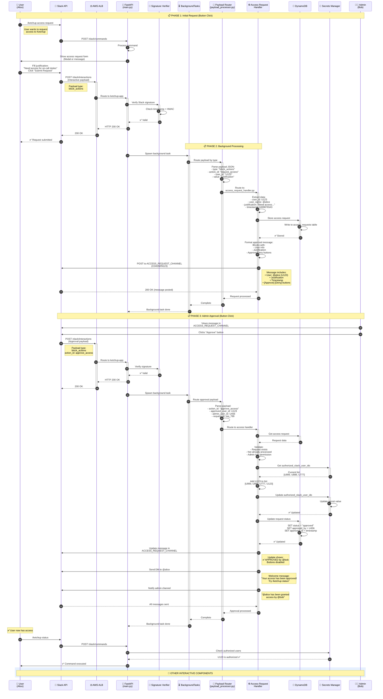
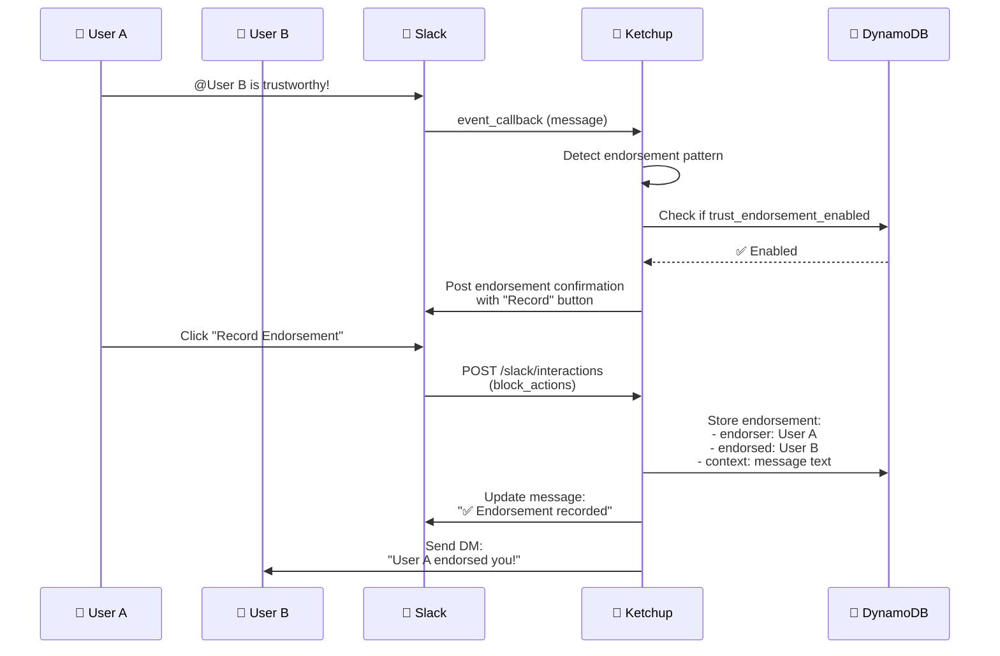
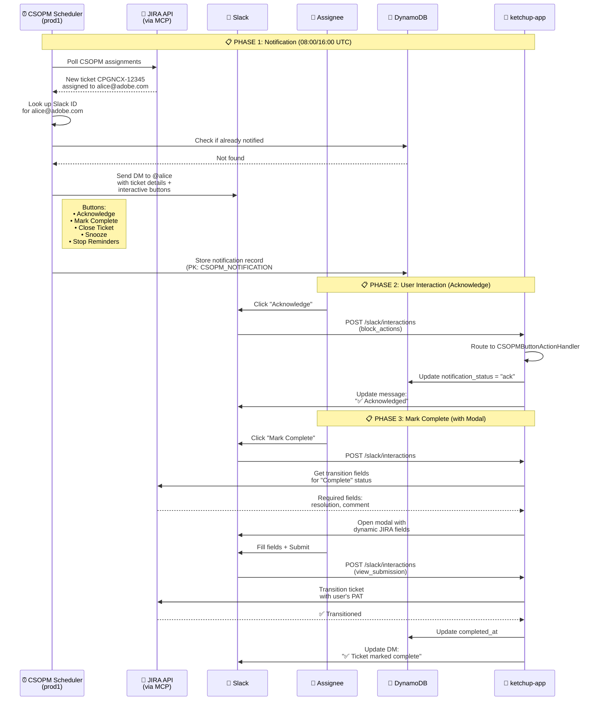
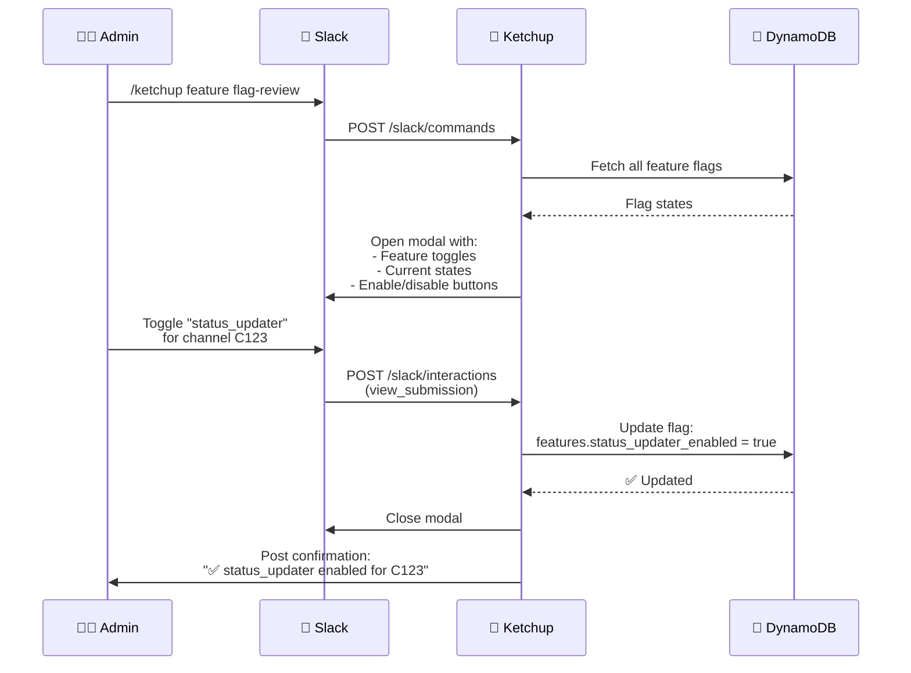
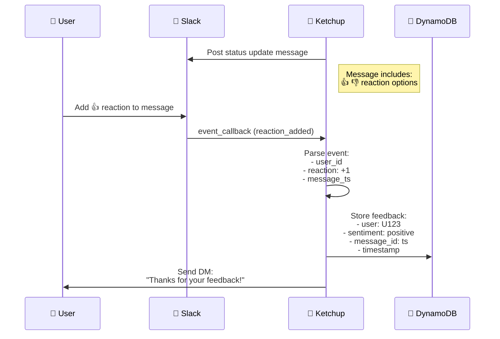
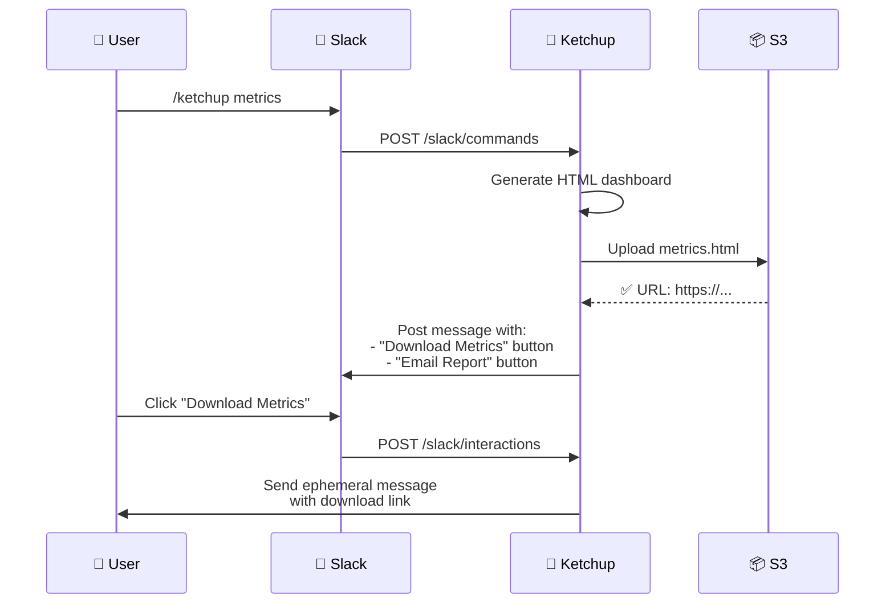

# Interactive Components Flow

This sequence diagram shows how Ketchup handles interactive Slack components (buttons, modals, select menus). The primary example is the Access Request flow, which demonstrates the complete lifecycle from button click to approval workflow, with additional examples of other interactive component types.



## Additional Interactive Component Examples

### 2. Trust Endorsement Flow



**Handler**: `trust_endorsement_handler.py`

**Flow**:
1. User mentions another user with trust-related keywords
2. Ketchup detects pattern and posts confirmation button
3. User clicks "Record Endorsement"
4. Endorsement stored in DynamoDB
5. Endorsed user receives notification

---

### 3. CSOPM Notification Interactive Buttons



**Handler**: `packages/slack/csopm/actions.py` → `CSOPMButtonActionHandler`

**Button Actions:**

| Action ID | Description | Handler Method |
|-----------|-------------|----------------|
| `csopm_acknowledge` | Mark notification as seen | `_handle_acknowledge()` |
| `csopm_mark_complete` | Open modal for ticket completion | `_handle_mark_complete()` |
| `csopm_close_ticket` | Open modal for ticket closure | `_handle_close_ticket()` |
| `csopm_snooze` | Pause reminders temporarily | `_handle_snooze()` |
| `csopm_unsnooze` | Resume reminders | `_handle_unsnooze()` |
| `csopm_stop_reminders` | Stop all reminders | `_handle_stop_reminders()` |
| `csopm_enable_reminders` | Re-enable reminders | `_handle_enable_reminders()` |

**Modal Submissions:**

| Callback ID | Description |
|-------------|-------------|
| `csopm_complete_modal` | Transition ticket to complete with dynamic fields |
| `csopm_close_modal` | Transition ticket to closed with dynamic fields |

**DynamoDB State Keys:**
- `PK`: `CSOPM_NOTIFICATION#{ticket_key}`
- `SK`: `NOTIFICATION` (main record) or `FOLLOWUP#{followup_key}` (followups)

**Split Architecture:**
- **Scheduler container** (`ketchup-csopm-notifier`): Polls JIRA, sends initial DMs
- **App container** (`ketchup-app`): Handles button callbacks via shared `packages/slack/csopm/` code

---

### 4. Flag Review Interactive Form



**Handler**: `flag_review_handler.py`

**Flow**:
1. Admin executes `/ketchup feature flag-review`
2. Ketchup opens modal with all feature flags
3. Admin toggles features via interactive form
4. Ketchup updates DynamoDB
5. Confirmation posted to channel

---

### 5. Feedback Reactions



**Handler**: `feedback_handler.py`

**Flow**:
1. Ketchup posts message (status update, report, etc.)
2. User adds reaction (👍 or 👎)
3. Slack sends `reaction_added` event
4. Ketchup stores feedback in DynamoDB
5. Optional: Thank you DM sent to user

---

### 6. Metrics Export



**Handler**: `metrics_handler.py`

**Flow**:
1. User executes `/ketchup metrics`
2. Ketchup generates HTML dashboard
3. HTML uploaded to S3
4. Message posted with action buttons
5. User clicks button → receives download link

---

## Interactive Component Types

### 1. Block Actions (button, select, overflow, datepicker)

**Payload Structure**:
```json
{
  "type": "block_actions",
  "user": {"id": "U123", "name": "alice"},
  "actions": [{
    "action_id": "approve_access",
    "block_id": "approval_block",
    "value": "U456",
    "type": "button"
  }],
  "response_url": "https://hooks.slack.com/actions/...",
  "trigger_id": "12345.67890.abcdef"
}
```

**Common Actions**:
- Approve/Deny buttons (access requests)
- Feature toggle buttons (flag review)
- Feedback buttons (thumbs up/down)
- Export buttons (metrics download)

---

### 2. View Submissions (modal forms)

**Payload Structure**:
```json
{
  "type": "view_submission",
  "user": {"id": "U123", "name": "alice"},
  "view": {
    "type": "modal",
    "callback_id": "access_request_modal",
    "state": {
      "values": {
        "justification_block": {
          "justification_input": {
            "type": "plain_text_input",
            "value": "Need access for on-call duties"
          }
        }
      }
    }
  }
}
```

**Common Modals**:
- Access request form (justification input)
- Feature flag review (toggle switches)
- Query form (question input)
- Archive form (date range picker)

---

### 3. View Closed (modal dismissal)

**Payload Structure**:
```json
{
  "type": "view_closed",
  "user": {"id": "U123", "name": "alice"},
  "view": {
    "callback_id": "access_request_modal",
    "id": "V123456"
  },
  "is_cleared": false
}
```

**Use Cases**:
- Track modal abandonment
- Clean up temporary data
- Log user interactions

---

### 4. Shortcut (global or message shortcuts)

**Payload Structure**:
```json
{
  "type": "shortcut",
  "callback_id": "summarize_thread",
  "trigger_id": "12345.67890.abcdef",
  "user": {"id": "U123", "name": "alice"},
  "message": {
    "ts": "1699876543.123456",
    "thread_ts": "1699876500.000000"
  }
}
```

**Common Shortcuts**:
- Summarize thread (message shortcut)
- Generate report (global shortcut)
- Archive conversation (message shortcut)

---

## Payload Routing Logic

### Router (`payload_processor.py`)

```python
async def route_interaction(payload: dict):
    interaction_type = payload.get("type")
    
    if interaction_type == "block_actions":
        action_id = payload["actions"][0]["action_id"]
        
        if action_id.startswith("approve_") or action_id.startswith("deny_"):
            return await access_request_handler.handle(payload)
        
        elif action_id.startswith("trust_endorsement_"):
            return await trust_endorsement_handler.handle(payload)
        
        elif action_id.startswith("flag_review_"):
            return await flag_review_handler.handle(payload)

        elif action_id.startswith("csopm_"):
            return await csopm_button_handler.handle(payload)

        elif action_id == "metrics_download":
            return await metrics_handler.handle_download(payload)
    
    elif interaction_type == "view_submission":
        callback_id = payload["view"]["callback_id"]
        
        if callback_id == "access_request_modal":
            return await access_request_handler.handle_submission(payload)
        
        elif callback_id == "flag_review_modal":
            return await flag_review_handler.handle_submission(payload)

        elif callback_id in ("csopm_complete_modal", "csopm_close_modal"):
            return await csopm_button_handler.handle_modal_submission(payload)
    
    elif interaction_type == "shortcut":
        callback_id = payload.get("callback_id")
        
        if callback_id == "summarize_thread":
            return await summary_handler.handle_shortcut(payload)
```

**Routing Strategy**:
1. Extract interaction type
2. Match on action_id, callback_id, or shortcut_id
3. Route to appropriate handler
4. Handler processes and updates Slack

---

## Security Considerations

### Signature Verification

**Every interaction payload verified**:
1. Extract `X-Slack-Signature` and `X-Slack-Request-Timestamp`
2. Verify timestamp within 5 minutes
3. Compute HMAC-SHA256 signature
4. Compare signatures
5. Reject if mismatch

### Authorization Checks

**Different levels for different actions**:
- **Access approval**: Admin only (Secrets Manager list)
- **Flag review**: Admin only
- **Trust endorsement**: Authorized users
- **Feedback**: Any user
- **Metrics download**: Authorized users

### Data Validation

**All user input validated**:
- Sanitize text inputs (prevent XSS)
- Validate user IDs (must be Slack user IDs)
- Validate channel IDs (must exist)
- Rate limiting (prevent abuse)

---

## Performance Optimizations

### Async Processing

**All handlers use async/await**:
- Non-blocking Slack API calls
- Concurrent database queries
- Parallel Secrets Manager fetches

### Response Time

**Immediate acknowledgment**:
- HTTP 200 returned immediately (< 100ms)
- Background processing takes 1-5 seconds
- User sees loading indicator in Slack

### Caching

**Cache frequently accessed data**:
- Authorized user lists (10 minutes)
- Admin user lists (10 minutes)
- Feature flag states (5 minutes)
- Channel metadata (1 hour)

---

## Error Handling

### User-Facing Errors

**Clear error messages**:
```
❌ Unable to process your request

Reason: You don't have permission to approve access requests.

Need help? Contact @ketchup-admins
```

### Technical Errors

**Logged but not shown to users**:
- DynamoDB query failures
- Secrets Manager API errors
- Slack API rate limits
- Invalid payload structures

### Retry Logic

**Automatic retries for transient errors**:
- Network timeouts (3 retries)
- Rate limits (exponential backoff)
- 500 errors (2 retries)

---

## Monitoring and Analytics

### Tracked Metrics

**Interaction Analytics**:
- Button click rates
- Modal completion rates
- Average approval time (access requests)
- Feature flag usage
- Error rates by handler

### Logging

**All interactions logged**:
- User ID, action, timestamp
- Handler execution time
- Errors and stack traces
- Payload samples (sanitized)

### Alerting

**Slack notifications for**:
- High error rates (> 5% per hour)
- Slow response times (> 10 seconds)
- Unusual activity patterns
- Failed authorization attempts
