# Ketchup System Architecture Diagram

## Complete Infrastructure Overview

```mermaid
graph TB
    subgraph "Internet"
        SlackAPI["Slack API<br/>(Events & Commands)"]
        JiraCloud["Jira Cloud<br/>(API)"]
    end

    subgraph "AWS - eu-west-1"
        ALB["Application Load Balancer<br/>:80"]

        subgraph "Production Server 1"
            Nginx1["nginx<br/>Reverse Proxy"]
            App1_1["ketchup-app-1<br/>FastAPI :8001"]
            App1_2["ketchup-app-2<br/>FastAPI :8001"]
            MCP1["mcp-jira<br/>MCP Service :8081"]

            subgraph "Singleton Services (prod1 only)"
                UnifiedScheduler["unified-scheduler<br/>5 Background Tasks"]
                CsopmNotifier["csopm-notifier<br/>Assignment Notifications"]
            end

            AccessMonitor1["access-monitor<br/>Request Tracking"]
        end

        subgraph "Production Server 2"
            Nginx2["nginx<br/>Reverse Proxy"]
            App2_1["ketchup-app-1<br/>FastAPI :8001"]
            App2_2["ketchup-app-2<br/>FastAPI :8001"]
            MCP2["mcp-jira<br/>MCP Service :8081"]
            AccessMonitor2["access-monitor<br/>Request Tracking"]
        end

        subgraph "AWS Services"
            DDB["DynamoDB<br/>ketchup_channel_information"]
            Secrets["Secrets Manager<br/>Ketchup_Token_Secrets"]
            SQS["SQS Queue<br/>ketchup-events-queue"]
            CloudWatch["CloudWatch<br/>(not actively used)"]
        end
    end

    subgraph "Shared Code (All Services)"
        PackagesDir["packages/<br/>ai, core, db, integrations,<br/>secrets, slack"]
        CsopmShared["packages/slack/csopm/<br/>blocks, state, actions"]
    end

    SlackAPI -->|HTTP POST Events| ALB
    JiraCloud -->|REST API| MCP1
    JiraCloud -->|REST API| MCP2

    ALB -->|Route Traffic| Nginx1
    ALB -->|Route Traffic| Nginx2

    Nginx1 -->|:8001| App1_1
    Nginx1 -->|:8001| App1_2
    Nginx2 -->|:8001| App2_1
    Nginx2 -->|:8001| App2_2

    App1_1 -->|TypedDI<br/>Services| PackagesDir
    App1_2 -->|TypedDI<br/>Services| PackagesDir
    App2_1 -->|TypedDI<br/>Services| PackagesDir
    App2_2 -->|TypedDI<br/>Services| PackagesDir

    App1_1 -->|Query/Update| DDB
    App1_2 -->|Query/Update| DDB
    App2_1 -->|Query/Update| DDB
    App2_2 -->|Query/Update| DDB

    UnifiedScheduler -->|Get Creds| Secrets
    CsopmNotifier -->|Get Creds| Secrets
    MCP1 -->|Get Creds| Secrets
    MCP2 -->|Get Creds| Secrets

    UnifiedScheduler -->|Pull Events| SQS
    CsopmNotifier -->|Query/Update| DDB

    UnifiedScheduler -->|Response| SlackAPI
    CsopmNotifier -->|DM Notifications| SlackAPI

    CsopmNotifier -->|Uses| CsopmShared
    App1_1 -->|Uses| CsopmShared
    App1_2 -->|Uses| CsopmShared
    App2_1 -->|Uses| CsopmShared
    App2_2 -->|Uses| CsopmShared

    MCP1 -->|:8081 STDIO| App1_1
    MCP1 -->|:8081 STDIO| App1_2
    MCP2 -->|:8081 STDIO| App2_1
    MCP2 -->|:8081 STDIO| App2_2

    style ALB fill:#ff9900
    style Nginx1 fill:#0066cc
    style Nginx2 fill:#0066cc
    style DDB fill:#527fff
    style Secrets fill:#527fff
    style SQS fill:#527fff
    style PackagesDir fill:#00cc99
    style CsopmShared fill:#00cc99
    style SlackAPI fill:#36c5f0
    style JiraCloud fill:#0052cc
```

## Key Components

### Load Balancing & Routing
- **ALB**: Routes Slack events to both production servers
- **Nginx**: Reverse proxy on each server, balances traffic to FastAPI replicas
- **Zero-downtime deployment**: Sequential updates across servers

### Compute Layer
- **ketchup-app**: 4 replicas total (2 per server) handle Slack webhooks and commands
- **mcp-jira**: JIRA integration service on each server

### Singleton Services (prod1 only)
These run **only** on prod1 to prevent duplicate scheduled jobs:
- `unified-scheduler`: Orchestrates 5 background tasks (metadata_updater, status_updater, jira_reporter, maintenance_fetcher, pat_rotator)
- `csopm-notifier`: CSOPM assignment notifications (runs at 08:00/16:00 UTC)

Explicitly stopped on prod2 during deployment to prevent conflicts.

### CSOPM Shared Services (`packages/slack/csopm/`)
Shared components used by both the scheduler (`ketchup-csopm-notifier`) and main app (`ketchup-app`):
- `blocks.py`: Slack Block Kit notification components
- `state.py`: DynamoDB state tracking for notifications
- `actions.py`: Interactive button action handlers (acknowledge/done/snooze)

### Data & Secrets
- **DynamoDB**: Single table for channel information, queried by all services
- **Secrets Manager**: Credentials for Slack, Jira, Adobe APIs
- **SQS**: Event queue for asynchronous processing

### Shared Code
All 7 services import from the **`packages/`** directory, enabling consistent:
- Dependency injection (TypedDI)
- Async HTTP clients
- Slack message handlers
- Database operations
- Third-party integrations

---

**Total Containers**: 12 across 2 servers (7 on prod1, 5 on prod2)
