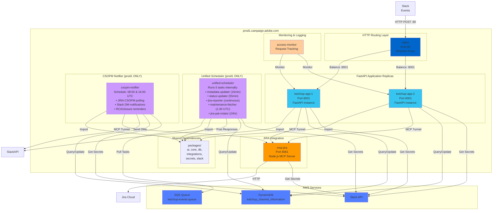
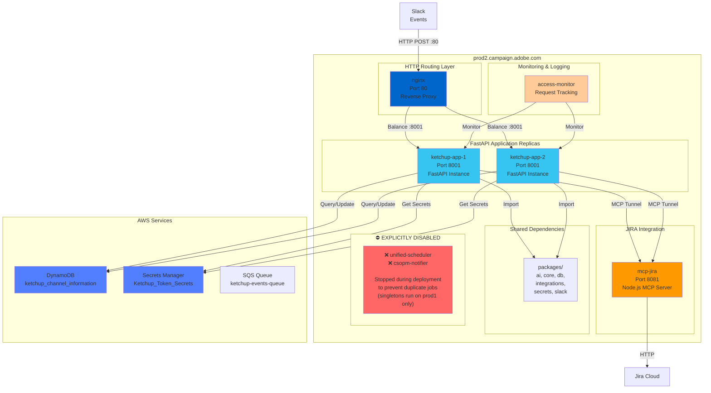
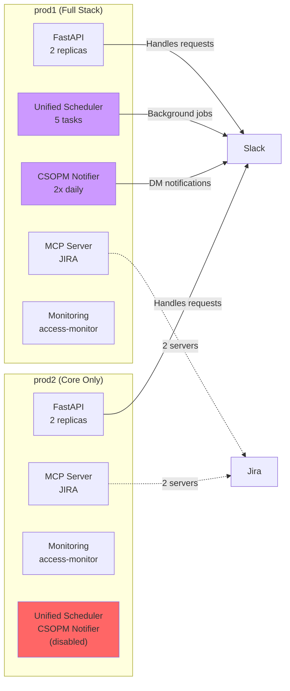
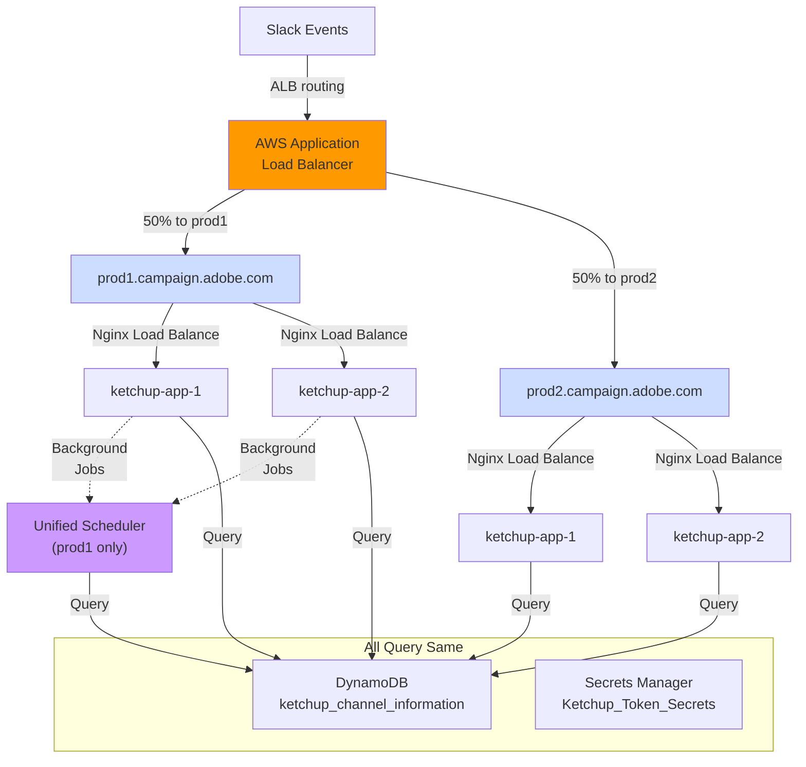
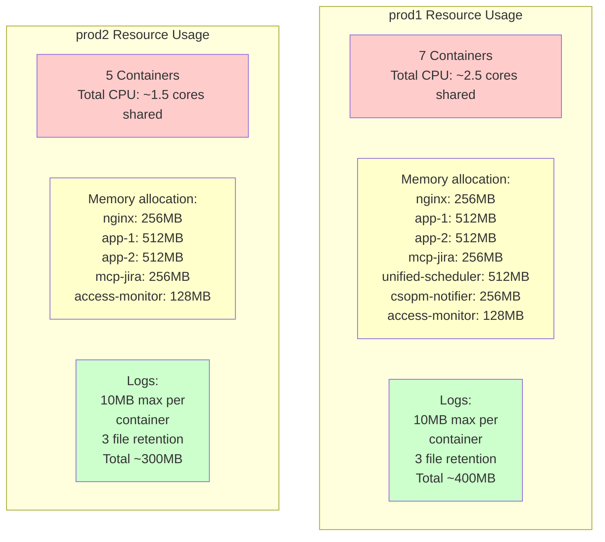

# Container Topology: Production Deployment

## Production Server 1 (Singletons Included)



## Production Server 2 (Core Services Only)



## Service Comparison: prod1 vs prod2



## Load Balancing Across Servers



## Container Resource Allocation



## Deployment Strategy: Why Unified Scheduler Only on prod1?

**Problem**:
- Scheduled jobs (metadata updates, status reports, JIRA automation) cannot run on multiple servers
- Would create duplicate messages, duplicate tickets, race conditions
- Data conflicts in DynamoDB

**Solution**:
- Run unified scheduler **only** on prod1
- Explicitly **stop and remove** this container from prod2
- deployment script (deploy-ketchup.sh):
  ```bash
  # Remove unified scheduler from prod2
  ssh prod2 "docker-compose rm -f unified-scheduler"
  ```

**Benefits**:
- ✅ No duplicate scheduled jobs
- ✅ No race conditions on shared resources
- ✅ Clear "source of truth" for scheduled work
- ✅ Reduces load on prod2 to core request handling
- ✅ Failover ready: if prod1 fails, can manually run unified scheduler on prod2
- ✅ Single healthcheck for all scheduled tasks

---

**Total Containers**: 11 (6 on prod1, 5 on prod2)
**Total Services**: 6 (FastAPI x2, MCP, unified-scheduler, access-monitor x2)
