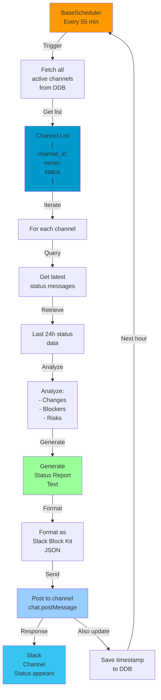
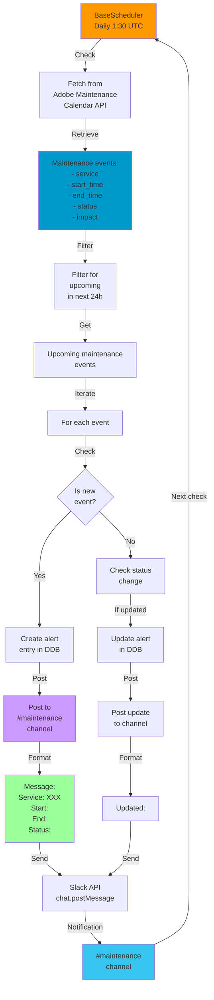
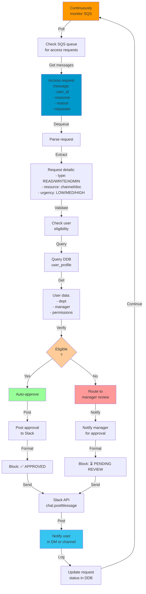
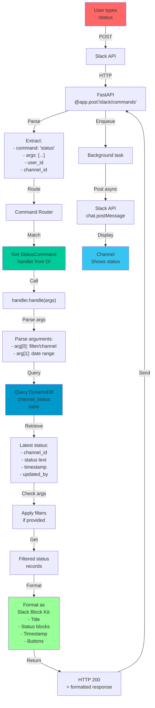
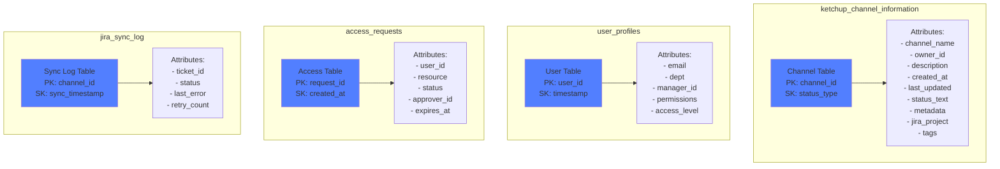

# Service Data Flows

## 1. Status Updater Service Flow



## 2. JIRA Reporter Service Flow

```mermaid
graph TD
    Monitor["Monitor channels<br/>every 15 minutes"]

    Monitor -->|Scan| ScanChannels["Scan all channels<br/>with JIRA enabled"]

    ScanChannels -->|Get| ChannelConfig["Channel config:<br/>- JIRA project<br/>- status field<br/>- auto-reporting"]

    ChannelConfig -->|For each| CheckUpdates["Check for<br/>new/updated<br/>status"]

    CheckUpdates -->|Compare| Compare["Compare with<br/>last sync"]

    Compare -->|If changed| CreateTicket["Create/Update<br/>JIRA ticket"]

    CreateTicket -->|Build request| JiraPayload["JIRA Payload:<br/>- title<br/>- description<br/>- priority<br/>- labels"]

    JiraPayload -->|Call MCP| MCPServer["MCP JIRA<br/>Server<br/>Port 8081"]

    MCPServer -->|Execute| JiraAPI["Jira Cloud<br/>REST API"]

    JiraAPI -->|Return| TicketID["Ticket created<br/>e.g., PROJ-1234"]

    TicketID -->|Post| NotifySlack["Post notification<br/>to channel"]

    NotifySlack -->|Update| DDB["Update DDB:<br/>ticket_id<br/>sync_timestamp"]

    DDB -->|Next scan| Monitor

    alt "No changes"
        Compare -->|No change| Skip["Skip<br/>No action needed"]
        Skip -->|Next scan| Monitor
    end

    style Monitor fill:#ff9900
    style MCPServer fill:#ff9900
    style CreateTicket fill:#cc99ff
    style JiraAPI fill:#0052cc
    style NotifySlack fill:#99ccff
```

## 3. Channel Metadata Updater Flow

```mermaid
graph TD
    Hourly["BaseScheduler<br/>Every 15 min"]

    Hourly -->|Fetch| GetChannels["List all<br/>Slack channels"]

    GetChannels -->|Get list| Channels["Channels:<br/>- id<br/>- name<br/>- topic<br/>- description"]

    Channels -->|Iterate| EachChannel["For each channel"]

    EachChannel -->|Fetch| GetMetadata["Fetch channel<br/>metadata from<br/>Slack API"]

    GetMetadata -->|Retrieve| Metadata["Channel metadata:<br/>- topic<br/>- description<br/>- created_at<br/>- creator<br/>- member_count<br/>- is_archived"]

    Metadata -->|Extract| ParseMetadata["Parse metadata<br/>fields"]

    ParseMetadata -->|Transform| Transform["Transform to<br/>Ketchup format:<br/>- sanitize text<br/>- extract tags<br/>- categorize"]

    Transform -->|Check| Compare["Compare with<br/>stored metadata"]

    Compare -->|If changed| Update["Update in<br/>DynamoDB"]

    Update -->|Trigger| OnMetadataChange["Trigger<br/>metadata-changed<br/>event"]

    OnMetadataChange -->|Notify| PostEvent["Post to<br/>event queue"]

    PostEvent -->|Log| Completion["Log update<br/>completion"]

    Completion -->|Next hour| Hourly

    alt "No change"
        Compare -->|No change| Skip["Skip<br/>No update"]
        Skip -->|Next hour| Hourly
    end

    style Hourly fill:#ff9900
    style Metadata fill:#0099cc
    style Update fill:#cc99ff
    style PostEvent fill:#99ccff
```

## 4. Maintenance Fetcher Service Flow



## 5. Access Request Monitor Flow



## 6. Command Handler: /status Flow



## Data Model: DynamoDB Tables



---

## Service Interaction Summary

| Service | Trigger | Input | Processing | Output | Success Indicator |
|---------|---------|-------|-----------|--------|------------------|
| **Status Updater** | Every 55 min (BaseScheduler) | All channels | Fetch status → Analyze → Format | Slack message | Posted to all channels |
| **JIRA Reporter** | Continuous (BaseScheduler) | Channels with JIRA | Compare state → Create/update ticket | JIRA ticket + Slack notification | Ticket ID saved in DDB |
| **Metadata Updater** | Every 15 min (BaseScheduler) | Slack channels | Fetch metadata → Parse → Compare | Updated DDB records | Row updated in DDB |
| **Maintenance Fetcher** | Daily 1:30 UTC (BaseScheduler) | Adobe API | Fetch events → Filter → Alert | Slack notifications | Posted to #maintenance |
| **PAT Rotator** | Every 24 hours (BaseScheduler) | JIRA PATs | Check expiry → Rotate if needed | New PAT in Secrets Manager | Expiry date updated |
| **Access Monitor** | Continuous SQS | SQS queue | Parse request → Validate → Approve/Route | Slack notification | Status updated in DDB |
| **Command Handlers** | User command | /command args | Parse → Query → Format | Slack response | Message posted |
| **Event Handlers** | Slack event | Event payload | Extract → Process → Update | Slack response | DDB updated |
