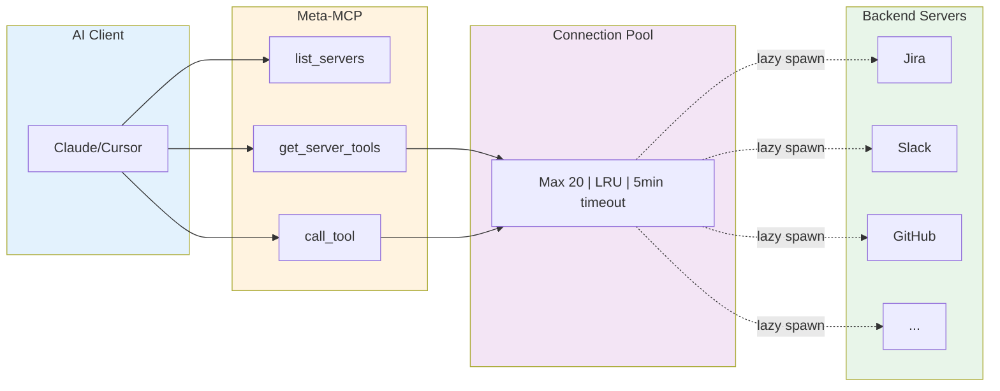
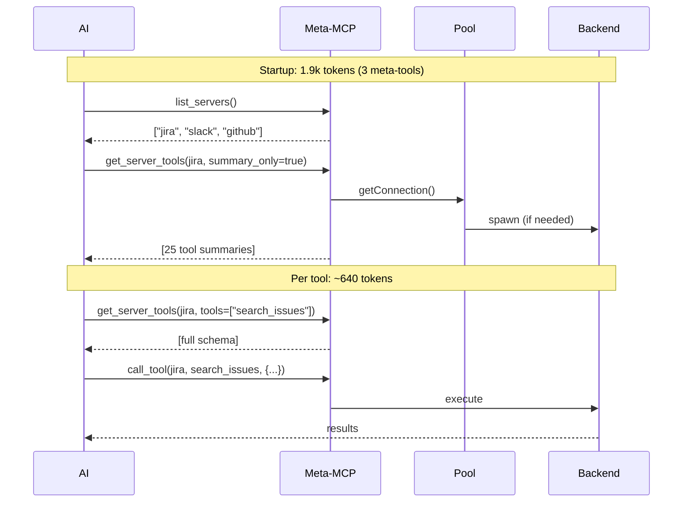
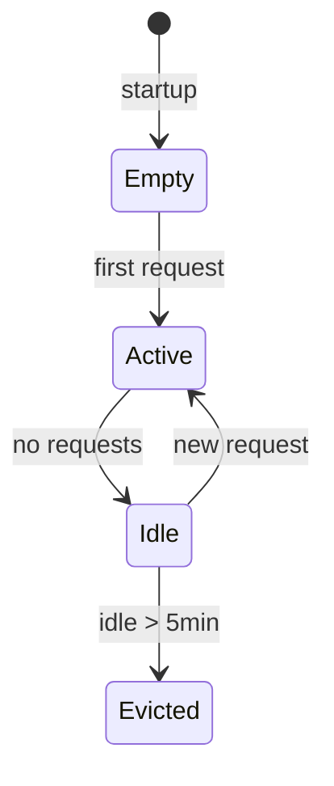

# Meta-MCP Architecture

> **TL;DR**: Proxy layer exposing 3 meta-tools instead of 100+. Reduces tokens by **79%+**.

---

## How It Works



---

## Token Cost

**Startup**: ~1.9k tokens (3 meta-tool schemas loaded once)

**mcp-exec catalog**: ~800-1000 tokens (tool names + param signatures, loaded once per session from `~/.meta-mcp/tool-catalog.json`)

| Tool | Per-call cost |
|------|---------------|
| `list_servers` | minimal |
| `get_server_tools` | ~640/tool |
| `call_tool` | variable |

---

## Request Flow



---

## Token Savings

```
Traditional:  16,000+ tokens (all tool schemas upfront)
Meta-MCP:      3,200 tokens (startup + 2 backend tools used)
─────────────────────────────────────────────────
Savings:       80%
```

| Tools | Traditional | Meta-MCP | Savings |
|-------|-------------|----------|---------|
| 1 | 16,000 | 2,500 | **84%** |
| 2 | 16,000 | 3,200 | **80%** |
| 5 | 16,000 | 5,100 | **68%** |
| 10 | 16,000 | 8,300 | **48%** |

Formula: `1,900 + (tools × 640)`

---

## Configuration

**servers.json**:
```json
{
  "mcpServers": {
    "jira": {
      "command": "node",
      "args": ["/path/to/jira-mcp/dist/index.js"],
      "env": { "JIRA_TOKEN": "..." }
    }
  }
}
```

```bash
SERVERS_CONFIG=~/.meta-mcp/servers.json
```

---

## Pool Behavior



| Setting | Value |
|---------|-------|
| Max connections | 20 |
| Idle timeout | 5 min |
| Cleanup interval | 1 min |
| Eviction | LRU |

---

## Quick Reference

```bash
npm run build        # Build
npx vitest run       # Test
node dist/index.js   # Run
```

| File | Purpose |
|------|---------|
| `src/server.ts` | MCP server + handlers |
| `src/pool/server-pool.ts` | Connection manager |
| `src/registry/loader.ts` | Config loading |
| `src/tools/tool-cache.ts` | Schema cache |

---

See [`diagrams/`](diagrams/README.md) for pool mechanics and token economics.
